# API参考文档

<cite>
**本文引用的文件**   
- [main.py](file://backend/main.py)
- [config.py](file://backend/config.py)
- [database.py](file://backend/database.py)
- [models.py](file://backend/models.py)
- [schemas.py](file://backend/schemas.py)
- [security.py](file://backend/security.py)
- [routers/user.py](file://backend/routers/user.py)
- [routers/records.py](file://backend/routers/records.py)
- [routers/timeline.py](file://backend/routers/timeline.py)
- [routers/export.py](file://backend/routers/export.py)
- [routers/query.py](file://backend/routers/query.py)
- [routers/asr.py](file://backend/routers/asr.py)
- [routers/mood.py](file://backend/routers/mood.py)
- [routers/process.py](file://backend/routers/process.py)
- [routers/context.py](file://backend/routers/context.py)
- [routers/merge.py](file://backend/routers/merge.py)
- [routers/sync.py](file://backend/routers/sync.py)
- [routers/tasks.py](file://backend/routers/tasks.py)
- [services/processor.py](file://backend/services/processor.py)
- [services/fuzzy_match.py](file://backend/services/fuzzy_match.py)
</cite>

## 目录
1. [简介](#简介)
2. [项目结构](#项目结构)
3. [核心组件](#核心组件)
4. [架构总览](#架构总览)
5. [详细组件分析](#详细组件分析)
6. [依赖关系分析](#依赖关系分析)
7. [性能考虑](#性能考虑)
8. [故障排查指南](#故障排查指南)
9. [结论](#结论)
10. [附录](#附录)

## 简介
本API参考文档面向后端REST服务，覆盖用户管理、记录处理、时间线管理、导出功能、查询接口、语音识别（ASR）与情感分析等能力。文档提供每个端点的HTTP方法、URL模式、请求参数、响应格式、错误码说明，以及认证机制、权限控制与速率限制策略。同时给出关键业务流程的时序图与数据流图，帮助开发者快速集成与排错。

## 项目结构
后端采用模块化路由设计，按功能域划分路由模块，业务逻辑下沉至服务层，数据模型与校验通过Pydantic Schema统一管理，安全与鉴权由独立模块负责。

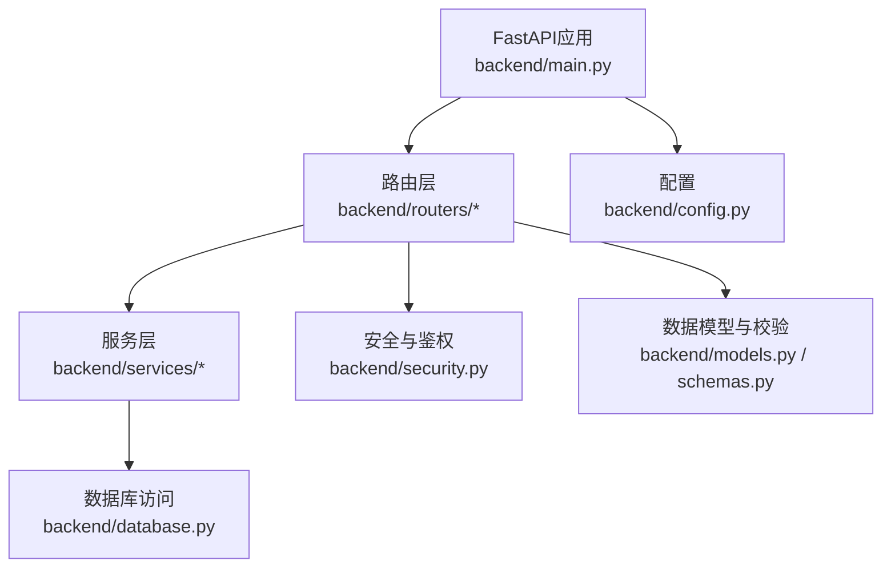

**图表来源**
- [main.py](file://backend/main.py)
- [config.py](file://backend/config.py)
- [database.py](file://backend/database.py)
- [models.py](file://backend/models.py)
- [schemas.py](file://backend/schemas.py)
- [security.py](file://backend/security.py)
- [routers/user.py](file://backend/routers/user.py)
- [routers/records.py](file://backend/routers/records.py)
- [routers/timeline.py](file://backend/routers/timeline.py)
- [routers/export.py](file://backend/routers/export.py)
- [routers/query.py](file://backend/routers/query.py)
- [routers/asr.py](file://backend/routers/asr.py)
- [routers/mood.py](file://backend/routers/mood.py)
- [routers/process.py](file://backend/routers/process.py)
- [routers/context.py](file://backend/routers/context.py)
- [routers/merge.py](file://backend/routers/merge.py)
- [routers/sync.py](file://backend/routers/sync.py)
- [routers/tasks.py](file://backend/routers/tasks.py)
- [services/processor.py](file://backend/services/processor.py)
- [services/fuzzy_match.py](file://backend/services/fuzzy_match.py)

**章节来源**
- [main.py](file://backend/main.py)
- [config.py](file://backend/config.py)

## 核心组件
- 路由层：按功能域组织REST端点，统一前缀与路径命名，集中定义请求/响应模型。
- 服务层：封装复杂业务逻辑，如记录处理、模糊匹配、异步任务编排等。
- 数据层：基于ORM或客户端访问数据库，提供CRUD与事务支持。
- 安全层：JWT鉴权、角色权限校验、输入校验与错误标准化。
- 配置层：环境变量加载、跨域、日志、限流等全局设置。

**章节来源**
- [schemas.py](file://backend/schemas.py)
- [security.py](file://backend/security.py)
- [database.py](file://backend/database.py)
- [services/processor.py](file://backend/services/processor.py)
- [services/fuzzy_match.py](file://backend/services/fuzzy_match.py)

## 架构总览
整体采用“路由-服务-数据”三层架构，配合统一的Schema与Security模块，确保接口契约清晰、可测试性强、扩展性良好。

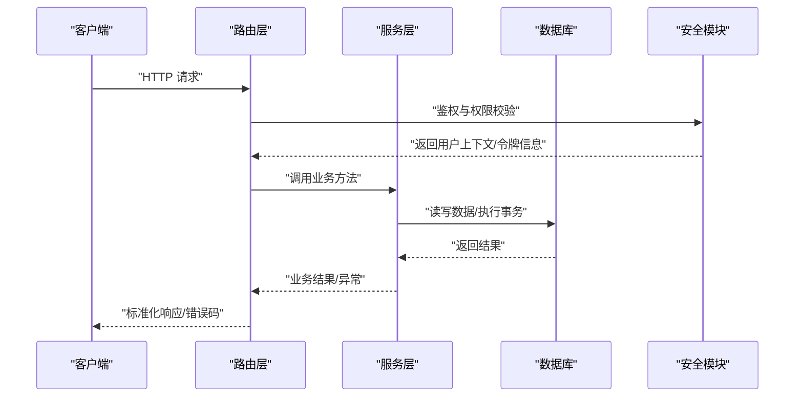

**图表来源**
- [main.py](file://backend/main.py)
- [security.py](file://backend/security.py)
- [routers/user.py](file://backend/routers/user.py)
- [routers/records.py](file://backend/routers/records.py)
- [routers/timeline.py](file://backend/rilters/timeline.py)
- [routers/export.py](file://backend/routers/export.py)
- [routers/query.py](file://backend/routers/query.py)
- [routers/asr.py](file://backend/routers/asr.py)
- [routers/mood.py](file://backend/routers/mood.py)
- [routers/process.py](file://backend/routers/process.py)
- [routers/context.py](file://backend/routers/context.py)
- [routers/merge.py](file://backend/routers/merge.py)
- [routers/sync.py](file://backend/routers/sync.py)
- [routers/tasks.py](file://backend/routers/tasks.py)
- [database.py](file://backend/database.py)

## 详细组件分析

### 用户管理API
- 基础路径：/api/users
- 典型端点
  - POST /api/users/register：注册新用户
  - POST /api/users/login：登录获取令牌
  - GET /api/users/me：获取当前用户信息
  - PUT /api/users/me：更新用户资料
  - DELETE /api/users/me：注销或删除账户
- 认证与权限
  - 注册与登录无需鉴权；其他操作需携带有效令牌。
  - 支持角色区分（如普通用户/管理员），管理员可访问更多管理端点。
- 请求参数与校验
  - 用户名、邮箱唯一性校验；密码强度规则；必填字段非空校验。
- 响应格式
  - 成功：返回用户对象或令牌；失败：返回错误码与消息。
- 错误码
  - 400 参数校验失败；401 未认证；403 权限不足；409 资源冲突（重复注册）；500 服务器错误。

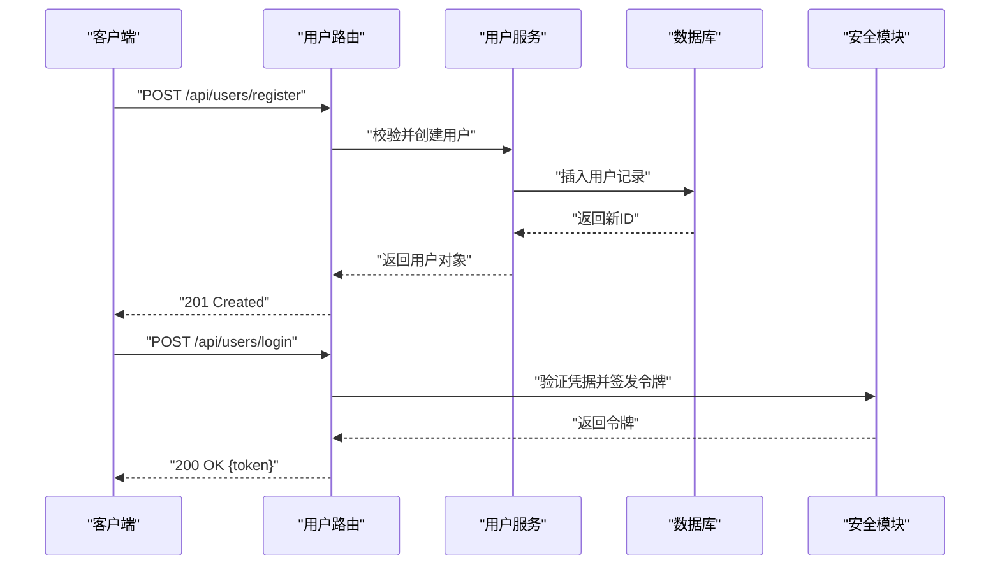

**图表来源**
- [routers/user.py](file://backend/routers/user.py)
- [security.py](file://backend/security.py)
- [database.py](file://backend/database.py)
- [schemas.py](file://backend/schemas.py)

**章节来源**
- [routers/user.py](file://backend/routers/user.py)
- [schemas.py](file://backend/schemas.py)
- [security.py](file://backend/security.py)

### 记录处理API
- 基础路径：/api/records
- 典型端点
  - POST /api/records：新增记录
  - GET /api/records/{id}：获取记录详情
  - PUT /api/records/{id}：更新记录
  - DELETE /api/records/{id}：删除记录
  - GET /api/records：列表查询（分页、过滤、排序）
- 业务逻辑
  - 支持文本、标签、时间戳等字段；自动填充创建/更新时间；软删除可选。
- 请求参数与校验
  - 必填字段校验；长度限制；枚举值校验（如状态）。
- 响应格式
  - 成功：返回记录对象或分页结果；失败：返回错误码与消息。
- 错误码
  - 400 参数错误；404 记录不存在；409 冲突（如唯一约束）；500 服务器错误。

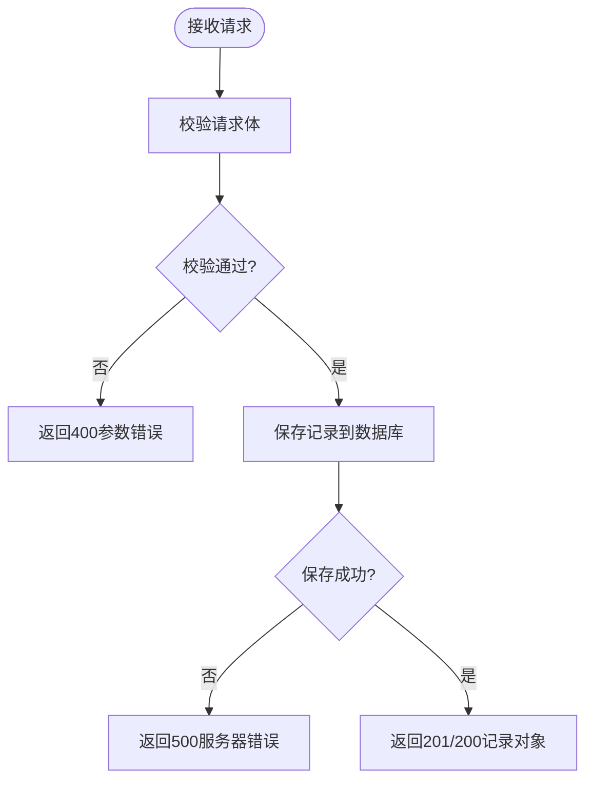

**图表来源**
- [routers/records.py](file://backend/routers/records.py)
- [database.py](file://backend/database.py)
- [schemas.py](file://backend/schemas.py)

**章节来源**
- [routers/records.py](file://backend/routers/records.py)
- [schemas.py](file://backend/schemas.py)

### 时间线管理API
- 基础路径：/api/timeline
- 典型端点
  - GET /api/timeline：按时间范围聚合事件
  - GET /api/timeline/{date}：指定日期事件
  - POST /api/timeline/events：添加时间线事件
  - PUT /api/timeline/events/{id}：更新事件
  - DELETE /api/timeline/events/{id}：删除事件
- 业务逻辑
  - 支持多源事件合并；去重与冲突解决；时区处理。
- 请求参数与校验
  - 时间范围校验；事件类型枚举；必填字段检查。
- 响应格式
  - 成功：返回事件列表或单个事件；失败：返回错误码与消息。
- 错误码
  - 400 参数错误；404 事件不存在；409 冲突；500 服务器错误。

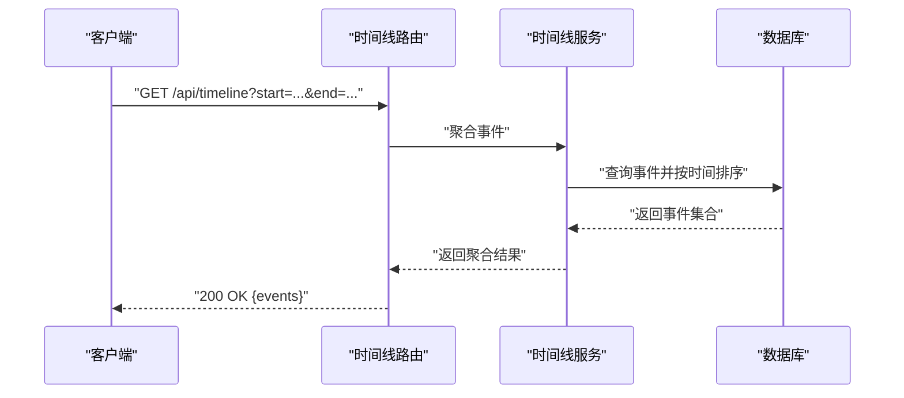

**图表来源**
- [routers/timeline.py](file://backend/routers/timeline.py)
- [database.py](file://backend/database.py)
- [schemas.py](file://backend/schemas.py)

**章节来源**
- [routers/timeline.py](file://backend/routers/timeline.py)
- [schemas.py](file://backend/schemas.py)

### 导出功能API
- 基础路径：/api/export
- 典型端点
  - POST /api/export：发起导出任务（CSV/JSON/PDF）
  - GET /api/export/{task_id}：查询导出任务状态
  - GET /api/export/{task_id}/download：下载导出文件
- 业务逻辑
  - 异步任务队列；进度跟踪；文件生成与存储；过期清理。
- 请求参数与校验
  - 导出类型、时间范围、筛选条件；文件大小限制。
- 响应格式
  - 成功：返回任务ID与状态；下载返回二进制流。
- 错误码
  - 400 参数错误；404 任务不存在；413 文件过大；500 服务器错误。

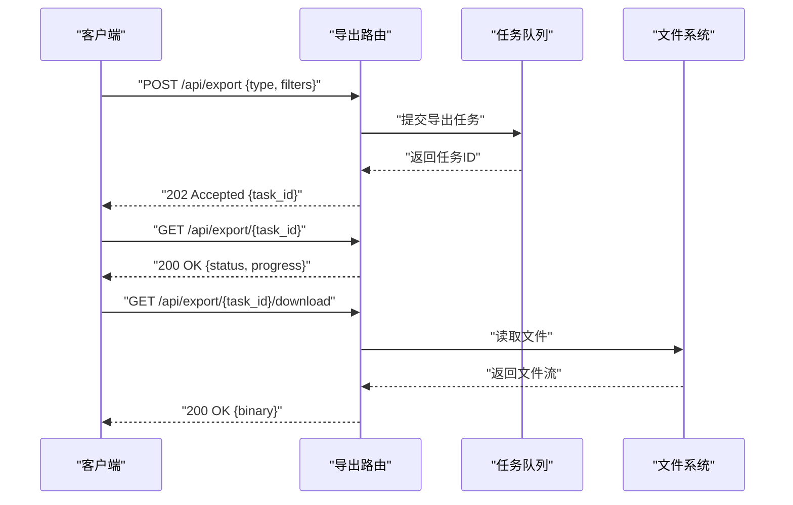

**图表来源**
- [routers/export.py](file://backend/routers/export.py)
- [database.py](file://backend/database.py)
- [schemas.py](file://backend/schemas.py)

**章节来源**
- [routers/export.py](file://backend/routers/export.py)
- [schemas.py](file://backend/schemas.py)

### 查询接口
- 基础路径：/api/query
- 典型端点
  - POST /api/query：自然语言查询
  - GET /api/query/history：查询历史
  - DELETE /api/query/history/{id}：清除历史
- 业务逻辑
  - 语义检索、关键词匹配、结果排序与摘要；缓存命中优化。
- 请求参数与校验
  - 查询语句长度限制；敏感词过滤；分页参数。
- 响应格式
  - 成功：返回结果集与元数据；失败：返回错误码与消息。
- 错误码
  - 400 参数错误；429 频率限制；500 服务器错误。

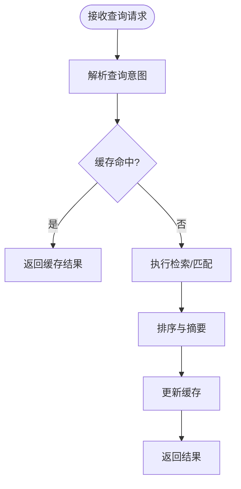

**图表来源**
- [routers/query.py](file://backend/routers/query.py)
- [services/fuzzy_match.py](file://backend/services/fuzzy_match.py)
- [database.py](file://backend/database.py)
- [schemas.py](file://backend/schemas.py)

**章节来源**
- [routers/query.py](file://backend/routers/query.py)
- [services/fuzzy_match.py](file://backend/services/fuzzy_match.py)
- [schemas.py](file://backend/schemas.py)

### 语音识别API（ASR）
- 基础路径：/api/asr
- 典型端点
  - POST /api/asr/transcribe：上传音频转文本
  - GET /api/asr/status/{task_id}：查询转写状态
  - GET /api/asr/result/{task_id}：获取转写结果
- 业务逻辑
  - 异步转写；音频格式校验；分段处理；结果缓存。
- 请求参数与校验
  - 音频大小限制；采样率与编码格式；超时设置。
- 响应格式
  - 成功：返回任务ID与结果；失败：返回错误码与消息。
- 错误码
  - 400 参数错误；413 文件过大；429 频率限制；500 服务器错误。

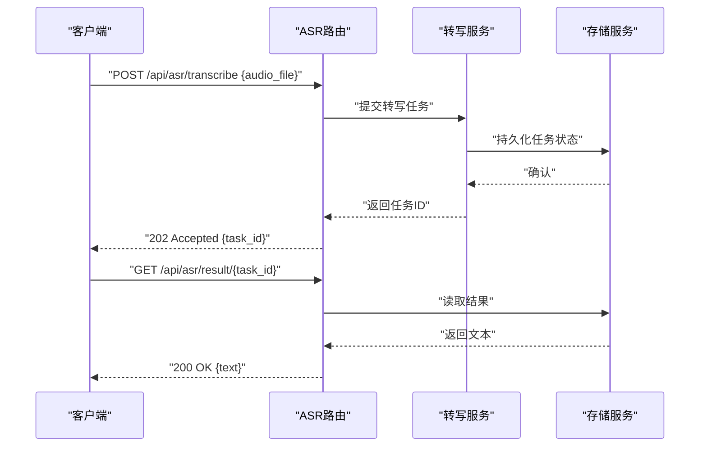

**图表来源**
- [routers/asr.py](file://backend/routers/asr.py)
- [database.py](file://backend/database.py)
- [schemas.py](file://backend/schemas.py)

**章节来源**
- [routers/asr.py](file://backend/routers/asr.py)
- [schemas.py](file://backend/schemas.py)

### 情感分析API
- 基础路径：/api/mood
- 典型端点
  - POST /api/mood/analyze：对文本进行情感分析
  - GET /api/mood/history：历史分析结果
  - DELETE /api/mood/history/{id}：删除历史记录
- 业务逻辑
  - 情感分类（正面/负面/中性）；置信度评分；批量处理。
- 请求参数与校验
  - 文本长度限制；语言检测；批量数量上限。
- 响应格式
  - 成功：返回情感标签与置信度；失败：返回错误码与消息。
- 错误码
  - 400 参数错误；429 频率限制；500 服务器错误。

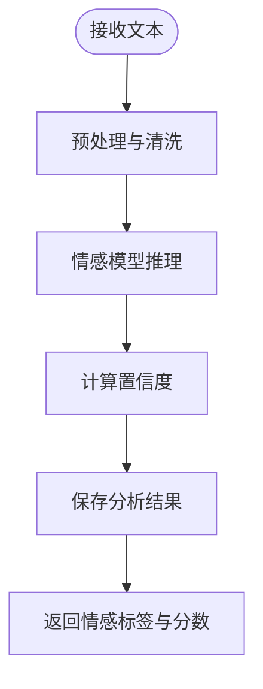

**图表来源**
- [routers/mood.py](file://backend/routers/mood.py)
- [database.py](file://backend/database.py)
- [schemas.py](file://backend/schemas.py)

**章节来源**
- [routers/mood.py](file://backend/routers/mood.py)
- [schemas.py](file://backend/schemas.py)

### 记录处理增强API（process/context/merge/sync/tasks）
- 基础路径：/api/process、/api/context、/api/merge、/api/sync、/api/tasks
- 典型端点
  - POST /api/process：批量处理记录（清洗、标注、关联）
  - POST /api/context：构建上下文快照
  - POST /api/merge：合并多条记录
  - POST /api/sync：同步外部数据源
  - GET/POST /api/tasks：任务管理与状态查询
- 业务逻辑
  - 流水线化处理；上下文记忆；冲突合并策略；增量同步；任务调度与重试。
- 请求参数与校验
  - 批大小限制；字段映射规则；同步策略选择。
- 响应格式
  - 成功：返回处理结果或任务ID；失败：返回错误码与消息。
- 错误码
  - 400 参数错误；409 冲突；429 频率限制；500 服务器错误。

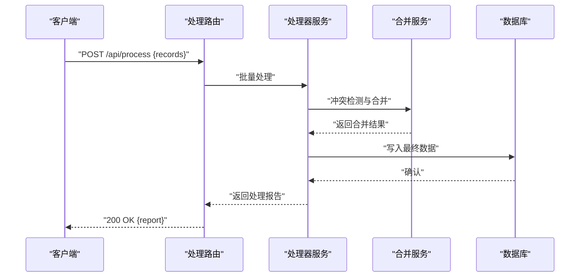

**图表来源**
- [routers/process.py](file://backend/routers/process.py)
- [routers/context.py](file://backend/routers/context.py)
- [routers/merge.py](file://backend/routers/merge.py)
- [routers/sync.py](file://backend/routers/sync.py)
- [routers/tasks.py](file://backend/routers/tasks.py)
- [services/processor.py](file://backend/services/processor.py)
- [database.py](file://backend/database.py)
- [schemas.py](file://backend/schemas.py)

**章节来源**
- [routers/process.py](file://backend/routers/process.py)
- [routers/context.py](file://backend/routers/context.py)
- [routers/merge.py](file://backend/routers/merge.py)
- [routers/sync.py](file://backend/routers/sync.py)
- [routers/tasks.py](file://backend/routers/tasks.py)
- [services/processor.py](file://backend/services/processor.py)
- [schemas.py](file://backend/schemas.py)

## 依赖关系分析
路由层依赖服务层完成具体业务，服务层依赖数据库与安全模块；配置模块为全局设置提供支撑。

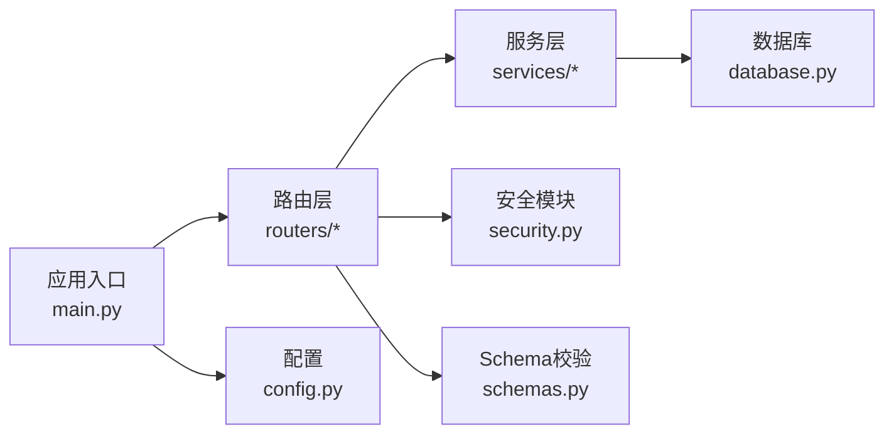

**图表来源**
- [main.py](file://backend/main.py)
- [config.py](file://backend/config.py)
- [database.py](file://backend/database.py)
- [security.py](file://backend/security.py)
- [schemas.py](file://backend/schemas.py)
- [routers/user.py](file://backend/routers/user.py)
- [routers/records.py](file://backend/routers/records.py)
- [routers/timeline.py](file://backend/routers/timeline.py)
- [routers/export.py](file://backend/routers/export.py)
- [routers/query.py](file://backend/routers/query.py)
- [routers/asr.py](file://backend/routers/asr.py)
- [routers/mood.py](file://backend/routers/mood.py)
- [routers/process.py](file://backend/routers/process.py)
- [routers/context.py](file://backend/routers/context.py)
- [routers/merge.py](file://backend/routers/merge.py)
- [routers/sync.py](file://backend/routers/sync.py)
- [routers/tasks.py](file://backend/routers/tasks.py)
- [services/processor.py](file://backend/services/processor.py)
- [services/fuzzy_match.py](file://backend/services/fuzzy_match.py)

**章节来源**
- [main.py](file://backend/main.py)
- [config.py](file://backend/config.py)

## 性能考虑
- 分页与过滤：所有列表接口应支持分页、过滤与排序，避免全量拉取。
- 缓存策略：查询与ASR结果建议引入缓存，减少重复计算与IO。
- 异步处理：导出、ASR、批量处理等耗时操作使用异步任务队列。
- 连接池：数据库连接池与HTTP客户端连接复用，降低延迟。
- 限流与熔断：对高频接口实施速率限制，防止过载。

[本节为通用指导，不直接分析具体文件]

## 故障排查指南
- 常见错误码
  - 400 参数校验失败：检查请求体字段、类型与约束。
  - 401 未认证：确认令牌是否有效且已正确传递。
  - 403 权限不足：检查用户角色与资源访问策略。
  - 404 资源不存在：核对ID与路径是否正确。
  - 409 冲突：唯一约束或并发写入冲突，检查业务逻辑。
  - 413 文件过大：调整上传大小限制或分片上传。
  - 429 频率限制：降低请求频率或申请更高配额。
  - 500 服务器错误：查看服务端日志定位异常。
- 调试建议
  - 启用详细日志与请求追踪。
  - 使用健康检查端点验证服务状态。
  - 对关键路径增加监控与告警。

**章节来源**
- [security.py](file://backend/security.py)
- [schemas.py](file://backend/schemas.py)

## 结论
本API参考文档系统化梳理了后端各功能域的REST端点、数据模型、安全与性能要点。通过清晰的架构分层与标准化校验，便于前端与第三方系统集成。建议在开发中严格遵循Schema与错误码规范，结合监控与限流保障稳定性。

[本节为总结性内容，不直接分析具体文件]

## 附录
- 认证机制
  - JWT令牌：登录后返回令牌，后续请求在Header中携带。
  - 刷新令牌：支持令牌刷新以延长会话。
- 权限控制
  - 基于角色的访问控制（RBAC），区分普通用户与管理员。
- 速率限制
  - 按IP或用户维度限制请求频率，超限返回429。
- 版本管理
  - URL前缀包含版本号（如/api/v1），便于向后兼容。

[本节为补充信息，不直接分析具体文件]