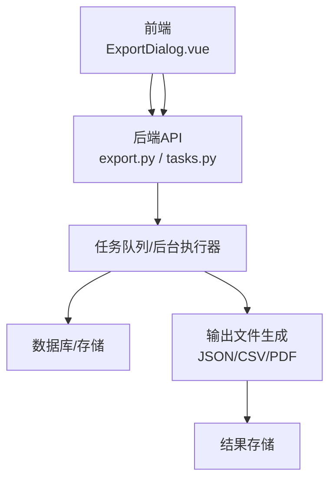
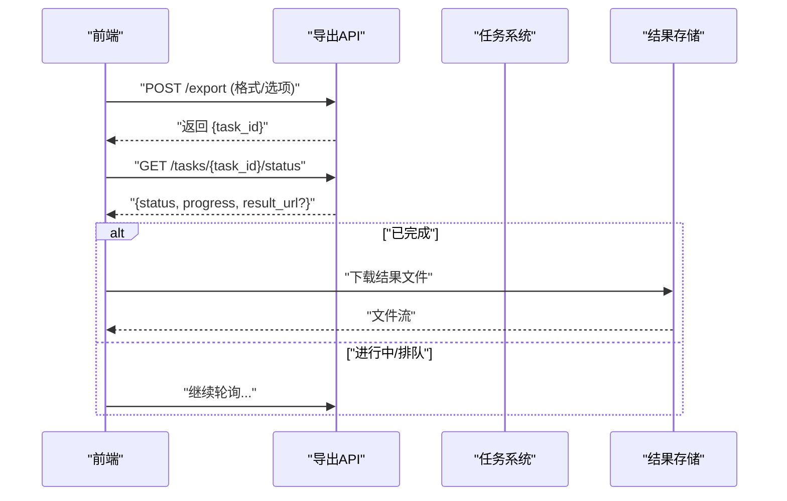
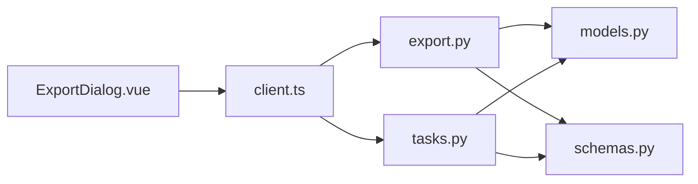

# 导出API

<cite>
**本文引用的文件**   
- [backend/routers/export.py](file://backend/routers/export.py)
- [backend/routers/tasks.py](file://backend/routers/tasks.py)
- [backend/models.py](file://backend/models.py)
- [backend/schemas.py](file://backend/schemas.py)
- [backend/main.py](file://backend/main.py)
- [frontend/src/components/ExportDialog.vue](file://frontend/src/components/ExportDialog.vue)
- [frontend/src/api/client.ts](file://frontend/src/api/client.ts)
</cite>

## 目录
1. [简介](#简介)
2. [项目结构](#项目结构)
3. [核心组件](#核心组件)
4. [架构总览](#架构总览)
5. [详细组件分析](#详细组件分析)
6. [依赖关系分析](#依赖关系分析)
7. [性能与内存优化](#性能与内存优化)
8. [故障排查指南](#故障排查指南)
9. [结论](#结论)
10. [附录：接口定义与示例](#附录接口定义与示例)

## 简介
本文件面向“导出功能”的完整API文档，覆盖以下要点：
- 支持的导出格式（JSON、CSV、PDF等）
- 导出选项配置（过滤条件、字段选择、分页与并发等）
- 异步任务机制（创建任务、进度跟踪、结果获取）
- 大数据量处理优化策略（流式写入、分批查询、内存控制）
- 完整的端到端流程示例（前端发起、后端调度、下载完成）
- 错误处理与重试建议

说明：本文档基于仓库中后端路由与模型、前端导出对话框与客户端封装进行梳理。若实际实现与本文存在差异，请以源码为准。

## 项目结构
导出能力由前后端协同实现：
- 后端提供REST API用于创建导出任务、查询进度与获取结果
- 前端通过导出对话框收集用户选项并调用API，轮询或事件驱动地获取结果

图表来源
- [backend/routers/export.py](file://backend/routers/export.py)
- [backend/routers/tasks.py](file://backend/routers/tasks.py)
- [backend/models.py](file://backend/models.py)
- [frontend/src/components/ExportDialog.vue](file://frontend/src/components/ExportDialog.vue)
- [frontend/src/api/client.ts](file://frontend/src/api/client.ts)

章节来源
- [backend/routers/export.py](file://backend/routers/export.py)
- [backend/routers/tasks.py](file://backend/routers/tasks.py)
- [backend/models.py](file://backend/models.py)
- [backend/schemas.py](file://backend/schemas.py)
- [backend/main.py](file://backend/main.py)
- [frontend/src/components/ExportDialog.vue](file://frontend/src/components/ExportDialog.vue)
- [frontend/src/api/client.ts](file://frontend/src/api/client.ts)

## 核心组件
- 导出路由模块：负责接收导出请求、参数校验、创建任务、返回任务ID
- 任务管理路由：负责查询任务状态、进度、结果URL
- 数据模型与Schema：定义导出任务实体、请求/响应结构
- 前端导出对话框：收集用户选项、发起请求、轮询进度、触发下载
- 客户端封装：统一HTTP调用、错误处理、重试逻辑

章节来源
- [backend/routers/export.py](file://backend/routers/export.py)
- [backend/routers/tasks.py](file://backend/routers/tasks.py)
- [backend/models.py](file://backend/models.py)
- [backend/schemas.py](file://backend/schemas.py)
- [frontend/src/components/ExportDialog.vue](file://frontend/src/components/ExportDialog.vue)
- [frontend/src/api/client.ts](file://frontend/src/api/client.ts)

## 架构总览
导出流程采用“异步任务+结果存储”的模式：
- 前端提交导出请求（包含格式、过滤条件、字段等）
- 后端立即返回任务ID，进入后台处理
- 前端轮询任务状态与进度
- 完成后，前端从结果存储获取下载链接或直接下载

图表来源
- [backend/routers/export.py](file://backend/routers/export.py)
- [backend/routers/tasks.py](file://backend/routers/tasks.py)
- [backend/models.py](file://backend/models.py)

## 详细组件分析

### 导出路由（创建任务）
职责
- 接收导出请求，校验参数（格式、时间范围、字段、分页等）
- 将导出任务入队并返回任务ID
- 支持同步模式（小数据量直接返回结果）与异步模式（默认）

关键行为
- 参数校验失败返回明确错误码与消息
- 大对象或复杂查询走异步路径，避免阻塞请求线程
- 对不支持的格式或非法参数给出快速失败提示

章节来源
- [backend/routers/export.py](file://backend/routers/export.py)

### 任务管理路由（进度与结果）
职责
- 查询任务状态（排队、运行中、已完成、失败）
- 返回进度百分比与阶段性信息
- 提供结果下载链接或流式下载

关键行为
- 未找到任务返回404
- 任务失败时附带错误原因
- 结果过期策略（如TTL清理）

章节来源
- [backend/routers/tasks.py](file://backend/routers/tasks.py)

### 数据模型与Schema
职责
- 定义导出任务实体（任务ID、格式、状态、进度、结果URL、创建时间等）
- 定义请求/响应结构（输入校验、输出字段）

关键行为
- 使用强类型Schema确保前后端契约一致
- 为任务状态机提供枚举约束

章节来源
- [backend/models.py](file://backend/models.py)
- [backend/schemas.py](file://backend/schemas.py)

### 前端导出对话框
职责
- 展示导出选项（格式、过滤、字段选择、分页大小、是否包含附件等）
- 发起导出请求并显示进度条
- 完成后自动下载或提示保存位置

关键行为
- 防抖与节流避免重复提交
- 轮询间隔自适应（初期短间隔，接近完成时缩短）
- 错误提示与重试按钮

章节来源
- [frontend/src/components/ExportDialog.vue](file://frontend/src/components/ExportDialog.vue)

### 前端客户端封装
职责
- 统一封装HTTP调用（超时、重试、错误映射）
- 提供导出相关方法（创建任务、查询状态、下载结果）

关键行为
- 网络异常自动重试（指数退避）
- 统一错误码到用户可读消息

章节来源
- [frontend/src/api/client.ts](file://frontend/src/api/client.ts)

## 依赖关系分析

图表来源
- [frontend/src/components/ExportDialog.vue](file://frontend/src/components/ExportDialog.vue)
- [frontend/src/api/client.ts](file://frontend/src/api/client.ts)
- [backend/routers/export.py](file://backend/routers/export.py)
- [backend/routers/tasks.py](file://backend/routers/tasks.py)
- [backend/models.py](file://backend/models.py)
- [backend/schemas.py](file://backend/schemas.py)

章节来源
- [backend/main.py](file://backend/main.py)
- [backend/routers/export.py](file://backend/routers/export.py)
- [backend/routers/tasks.py](file://backend/routers/tasks.py)
- [backend/models.py](file://backend/models.py)
- [backend/schemas.py](file://backend/schemas.py)
- [frontend/src/components/ExportDialog.vue](file://frontend/src/components/ExportDialog.vue)
- [frontend/src/api/client.ts](file://frontend/src/api/client.ts)

## 性能与内存优化
针对大数据量导出的优化建议：
- 流式写入：按批次读取数据并逐块写入输出文件，避免一次性加载至内存
- 分批查询：使用游标或偏移分页，限制单次查询行数，降低数据库压力
- 并行化：对可独立的数据集进行分片并行处理，合并结果后输出
- 内存控制：设置最大内存阈值，超过则回退为磁盘临时文件
- 压缩输出：对大文件启用GZIP/Zip压缩，减少传输体积
- 结果缓存：相同参数的导出在TTL内复用结果，避免重复计算
- 限流与降级：高峰期限制并发导出任务数，必要时拒绝新任务

章节来源
- [backend/routers/export.py](file://backend/routers/export.py)
- [backend/routers/tasks.py](file://backend/routers/tasks.py)
- [backend/models.py](file://backend/models.py)
- [backend/schemas.py](file://backend/schemas.py)

## 故障排查指南
常见问题与定位步骤：
- 任务创建失败
  - 检查请求参数是否符合Schema定义
  - 查看后端日志中的校验错误与异常堆栈
- 任务长时间无进展
  - 确认任务队列是否堆积，后台工作进程是否正常
  - 检查数据库连接池与慢查询
- 进度不更新
  - 核对任务状态更新逻辑是否被触发
  - 检查结果存储的权限与路径
- 下载失败或文件损坏
  - 验证结果文件是否完整生成
  - 检查网络超时与断点续传支持

章节来源
- [backend/routers/export.py](file://backend/routers/export.py)
- [backend/routers/tasks.py](file://backend/routers/tasks.py)
- [backend/models.py](file://backend/models.py)
- [backend/schemas.py](file://backend/schemas.py)

## 结论
导出API通过“异步任务+结果存储”的架构，兼顾了用户体验与系统稳定性。结合流式写入、分批查询、并行处理与结果缓存等策略，可有效应对大数据量场景。前端通过清晰的对话框与客户端封装，简化了用户的操作流程。建议在部署时关注队列容量、存储容量与监控告警，确保高负载下的稳定运行。

## 附录：接口定义与示例

### 支持的导出格式
- JSON：结构化数据，适合二次处理与分析
- CSV：表格数据，便于导入Excel或数据分析工具
- PDF：报表打印，适合归档与分享

章节来源
- [backend/routers/export.py](file://backend/routers/export.py)
- [backend/schemas.py](file://backend/schemas.py)

### 导出选项配置
常见选项包括：
- 时间范围：起止时间筛选
- 字段选择：仅导出指定列
- 过滤条件：按标签、状态、关键词等过滤
- 分页大小：每批记录数量
- 是否包含附件：二进制内容是否纳入导出
- 压缩输出：是否启用压缩

章节来源
- [backend/schemas.py](file://backend/schemas.py)
- [frontend/src/components/ExportDialog.vue](file://frontend/src/components/ExportDialog.vue)

### 异步任务生命周期
- 排队：任务已入队等待执行
- 运行中：正在生成数据与文件
- 已完成：结果可用，提供下载链接
- 失败：任务失败，附带错误原因

章节来源
- [backend/models.py](file://backend/models.py)
- [backend/routers/tasks.py](file://backend/routers/tasks.py)

### 进度跟踪与结果获取
- 进度跟踪：轮询任务状态接口，获取进度百分比与阶段信息
- 结果获取：完成后从结果存储下载文件或流式传输

章节来源
- [backend/routers/tasks.py](file://backend/routers/tasks.py)
- [frontend/src/api/client.ts](file://frontend/src/api/client.ts)

### 端到端流程示例
- 用户在导出对话框中选择格式与选项
- 前端调用导出接口，获得任务ID
- 前端轮询任务状态，直至完成
- 前端下载结果文件并提示成功

章节来源
- [frontend/src/components/ExportDialog.vue](file://frontend/src/components/ExportDialog.vue)
- [frontend/src/api/client.ts](file://frontend/src/api/client.ts)
- [backend/routers/export.py](file://backend/routers/export.py)
- [backend/routers/tasks.py](file://backend/routers/tasks.py)

### 错误处理方案
- 参数错误：返回明确的字段级错误信息
- 资源不足：返回服务不可用或限流提示
- 网络异常：前端自动重试与降级提示
- 任务失败：返回失败原因与重试建议

章节来源
- [backend/schemas.py](file://backend/schemas.py)
- [frontend/src/api/client.ts](file://frontend/src/api/client.ts)