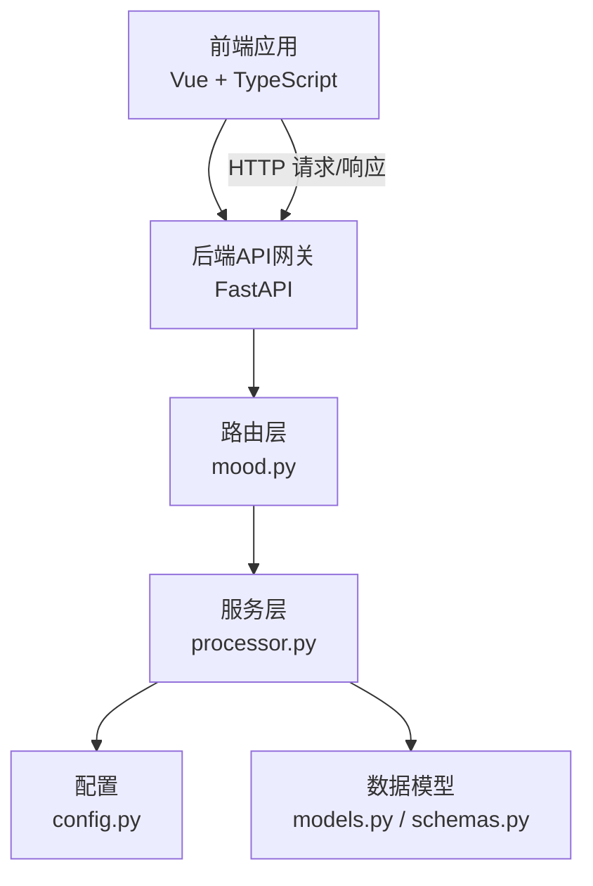
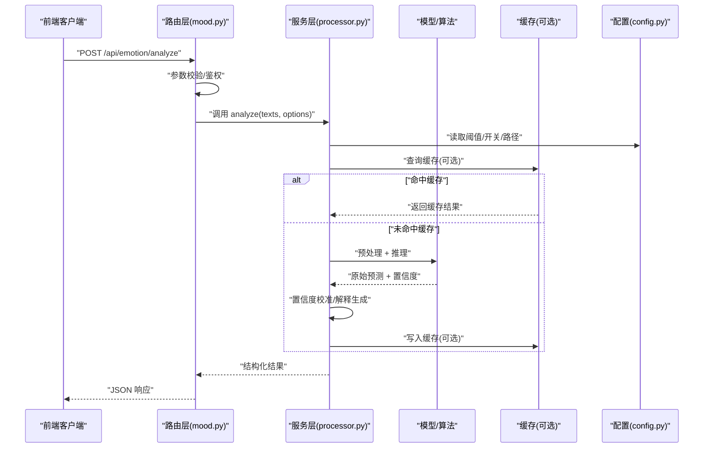
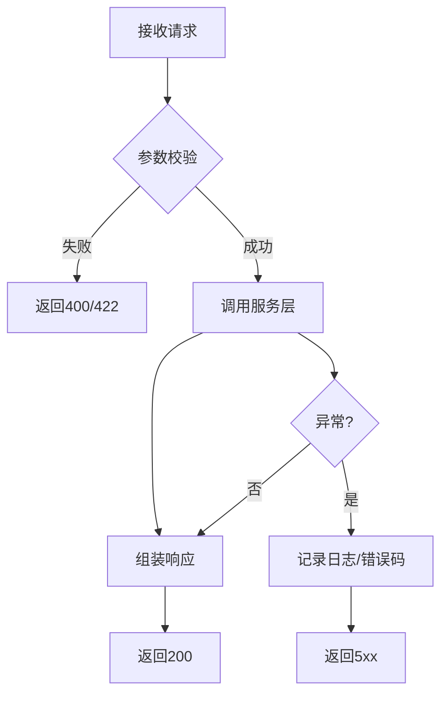
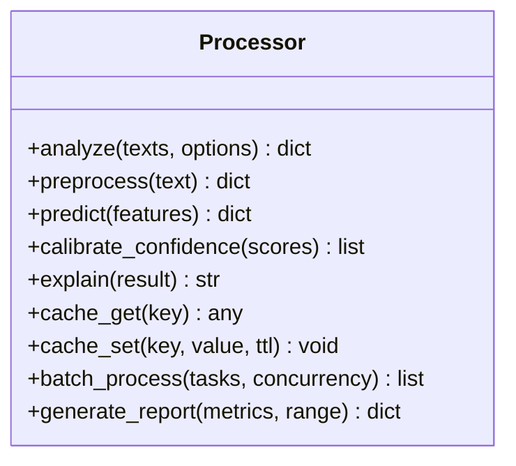
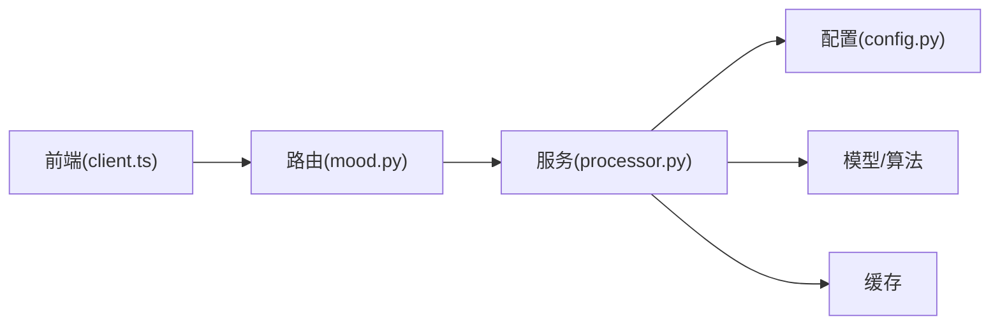

# 情感分析API

<cite>
**本文引用的文件**   
- [backend/main.py](file://backend/main.py)
- [backend/routers/mood.py](file://backend/routers/mood.py)
- [backend/services/processor.py](file://backend/services/processor.py)
- [backend/config.py](file://backend/config.py)
- [backend/models.py](file://backend/models.py)
- [backend/schemas.py](file://backend/schemas.py)
- [frontend/src/api/client.ts](file://frontend/src/api/client.ts)
</cite>

## 目录
1. [简介](#简介)
2. [项目结构](#项目结构)
3. [核心组件](#核心组件)
4. [架构总览](#架构总览)
5. [详细组件分析](#详细组件分析)
6. [依赖关系分析](#依赖关系分析)
7. [性能考量](#性能考量)
8. [故障排查指南](#故障排查指南)
9. [结论](#结论)
10. [附录](#附录)

## 简介
本文件为“情感分析API”的完整技术文档，覆盖文本情感检测、情绪分类、情感强度分析与趋势统计接口。文档面向开发者与产品使用者，既提供系统级架构说明，也给出可操作的调用示例、错误处理与性能优化建议。内容基于仓库中后端路由、服务层、数据模型与前端客户端代码进行梳理与总结。

## 项目结构
本项目采用前后端分离架构：
- 后端使用Python（FastAPI）提供REST API，包含路由、服务、配置、数据模型与请求响应模式定义。
- 前端使用Vue + TypeScript，通过HTTP客户端封装调用后端API，并在界面展示结果。

**图表来源**
- [backend/main.py](file://backend/main.py)
- [backend/routers/mood.py](file://backend/routers/mood.py)
- [backend/services/processor.py](file://backend/services/processor.py)
- [backend/config.py](file://backend/config.py)
- [backend/models.py](file://backend/models.py)
- [backend/schemas.py](file://backend/schemas.py)
- [frontend/src/api/client.ts](file://frontend/src/api/client.ts)

**章节来源**
- [backend/main.py](file://backend/main.py)
- [backend/routers/mood.py](file://backend/routers/mood.py)
- [backend/services/processor.py](file://backend/services/processor.py)
- [backend/config.py](file://backend/config.py)
- [backend/models.py](file://backend/models.py)
- [backend/schemas.py](file://backend/schemas.py)
- [frontend/src/api/client.ts](file://frontend/src/api/client.ts)

## 核心组件
- 路由层（mood.py）
  - 暴露情感分析相关REST接口，包括单条文本情感检测、批量处理、情绪分类、情感强度分析与趋势统计等。
  - 负责参数校验、权限控制（如有）、调用服务层并返回标准化响应。
- 服务层（processor.py）
  - 实现情感分析算法与业务逻辑，包括文本预处理、模型推理、置信度计算、结果解释、缓存策略与报告生成。
  - 协调外部依赖（如配置、模型加载、缓存存储）。
- 配置（config.py）
  - 管理环境变量、模型路径、阈值、并发限制、缓存策略开关等。
- 数据模型与模式（models.py, schemas.py）
  - 定义输入输出数据结构、枚举值、校验规则与序列化格式。
- 前端客户端（client.ts）
  - 封装HTTP调用，统一错误处理、重试机制与结果解析，便于UI渲染与交互。

**章节来源**
- [backend/routers/mood.py](file://backend/routers/mood.py)
- [backend/services/processor.py](file://backend/services/processor.py)
- [backend/config.py](file://backend/config.py)
- [backend/models.py](file://backend/models.py)
- [backend/schemas.py](file://backend/schemas.py)
- [frontend/src/api/client.ts](file://frontend/src/api/client.ts)

## 架构总览
整体流程遵循“请求进入 -> 路由校验 -> 服务处理 -> 模型推理 -> 结果组装 -> 响应返回”的标准模式。关键特性包括：
- 批量处理：支持一次性提交多条文本，内部并行或队列化处理，提升吞吐。
- 缓存策略：对相同输入或哈希指纹的结果进行缓存，降低重复计算成本。
- 置信度与解释：每个预测附带置信度分数与可读性解释，便于下游决策与审计。
- 趋势统计：按时间窗口聚合情感分布与强度变化，生成可视化指标。

**图表来源**
- [backend/routers/mood.py](file://backend/routers/mood.py)
- [backend/services/processor.py](file://backend/services/processor.py)
- [backend/config.py](file://backend/config.py)

## 详细组件分析

### 路由层：mood.py
- 职责
  - 定义REST端点：单条/批量情感分析、情绪分类、强度分析、趋势统计。
  - 输入校验：字段类型、长度、枚举值、必填项。
  - 调用服务层：将请求体映射为服务方法参数。
  - 错误处理：捕获异常并返回标准错误码与消息。
- 典型端点
  - POST /api/emotion/analyze：单条文本情感检测
  - POST /api/emotion/batch：批量处理
  - POST /api/emotion/classify：情绪分类
  - GET /api/emotion/intensity：情感强度分析
  - GET /api/emotion/trends：趋势统计

**图表来源**
- [backend/routers/mood.py](file://backend/routers/mood.py)

**章节来源**
- [backend/routers/mood.py](file://backend/routers/mood.py)

### 服务层：processor.py
- 职责
  - 文本预处理：清洗、分词、归一化、去重。
  - 模型推理：调用分类模型或算法，得到类别与置信度。
  - 置信度计算：概率归一化、阈值过滤、不确定性估计。
  - 结果解释：生成人类可读的解释（关键词、依据、置信度区间）。
  - 缓存策略：基于输入指纹的LRU/TTL缓存，命中率监控。
  - 批量处理：任务拆分、并发控制、进度回调。
  - 报告生成：汇总统计、趋势图数据、导出格式。
- 关键函数
  - analyze(texts, options)：主入口，支持单条与批量
  - preprocess(text)：文本清洗与特征提取
  - predict(text_features)：模型推理
  - calibrate_confidence(scores)：置信度校准
  - explain(result)：解释生成
  - cache_get/set(key, value, ttl)：缓存读写
  - batch_process(tasks, concurrency)：批量调度
  - generate_report(metrics, time_range)：报告生成

**图表来源**
- [backend/services/processor.py](file://backend/services/processor.py)

**章节来源**
- [backend/services/processor.py](file://backend/services/processor.py)

### 配置：config.py
- 职责
  - 加载环境变量与默认值。
  - 管理模型路径、阈值、并发限制、缓存TTL、日志级别。
- 关键键
  - EMOTION_MODEL_PATH：模型文件路径
  - CONFIDENCE_THRESHOLD：置信度阈值
  - BATCH_CONCURRENCY：批量并发数
  - CACHE_TTL：缓存过期时间
  - LOG_LEVEL：日志级别

**章节来源**
- [backend/config.py](file://backend/config.py)

### 数据模型与模式：models.py, schemas.py
- 职责
  - 定义请求/响应结构、枚举、校验规则。
  - 确保前后端契约一致。
- 关键结构
  - EmotionRequest：{ texts: string[], options?: object }
  - EmotionResponse：{ results: array, meta: object }
  - ClassifyRequest/Response：情绪分类输入输出
  - IntensityRequest/Response：强度分析输入输出
  - TrendsRequest/Response：趋势统计输入输出

**章节来源**
- [backend/models.py](file://backend/models.py)
- [backend/schemas.py](file://backend/schemas.py)

### 前端客户端：client.ts
- 职责
  - 封装HTTP调用，统一错误处理与重试。
  - 解析响应结构，转换为UI可用数据。
- 关键方法
  - analyzeEmotion(texts, options)
  - classifyEmotion(texts, options)
  - getIntensity(timeRange)
  - getTrends(timeRange)

**章节来源**
- [frontend/src/api/client.ts](file://frontend/src/api/client.ts)

## 依赖关系分析
- 路由层依赖服务层与配置；服务层依赖模型/算法、缓存与配置；前端依赖后端API。
- 潜在循环依赖：应避免在服务层直接导入路由层。
- 外部依赖：模型加载器、缓存存储（内存/Redis）、日志框架。

**图表来源**
- [backend/routers/mood.py](file://backend/routers/mood.py)
- [backend/services/processor.py](file://backend/services/processor.py)
- [backend/config.py](file://backend/config.py)
- [frontend/src/api/client.ts](file://frontend/src/api/client.ts)

**章节来源**
- [backend/routers/mood.py](file://backend/routers/mood.py)
- [backend/services/processor.py](file://backend/services/processor.py)
- [backend/config.py](file://backend/config.py)
- [frontend/src/api/client.ts](file://frontend/src/api/client.ts)

## 性能考量
- 批量处理
  - 合理设置并发数，避免资源争用；对长文本进行分片处理。
- 缓存策略
  - 对高频输入启用LRU缓存，设置合理TTL；监控命中率与内存占用。
- 模型推理
  - 使用批量化推理、GPU加速（如可用）；预热模型减少冷启动延迟。
- 网络与序列化
  - 压缩响应体；避免过大payload；分页与增量更新。
- 监控与告警
  - 记录QPS、延迟、错误率、缓存命中率；设置阈值告警。

[本节为通用指导，不直接分析具体文件]

## 故障排查指南
- 常见错误
  - 参数校验失败：检查字段类型、必填项与枚举值。
  - 模型加载失败：确认模型路径与权限；检查依赖库版本。
  - 缓存异常：检查缓存服务连接与TTL配置。
  - 超时/内存溢出：调整并发与批次大小；优化文本预处理。
- 调试步骤
  - 开启DEBUG日志，定位异常堆栈。
  - 使用最小复现用例验证问题。
  - 检查上游依赖健康状态（模型、缓存、数据库）。

**章节来源**
- [backend/routers/mood.py](file://backend/routers/mood.py)
- [backend/services/processor.py](file://backend/services/processor.py)
- [backend/config.py](file://backend/config.py)

## 结论
本情感分析API通过清晰的分层架构与完善的错误处理，提供了稳定高效的文本情感检测、情绪分类、强度分析与趋势统计能力。结合批量处理、缓存策略与报告生成，可满足多场景下的自动化分析需求。建议在部署时关注性能调优与监控告警，以确保高可用与可扩展性。

[本节为总结性内容，不直接分析具体文件]

## 附录

### API 端点概览
- POST /api/emotion/analyze
  - 功能：单条文本情感检测
  - 输入：texts, options
  - 输出：results, meta
- POST /api/emotion/batch
  - 功能：批量处理
  - 输入：tasks, concurrency
  - 输出：results, progress
- POST /api/emotion/classify
  - 功能：情绪分类
  - 输入：texts, categories
  - 输出：classifications, confidence
- GET /api/emotion/intensity
  - 功能：情感强度分析
  - 输入：timeRange, granularity
  - 输出：intensityMetrics
- GET /api/emotion/trends
  - 功能：趋势统计
  - 输入：timeRange, filters
  - 输出：trends, summary

[本节为概念性描述，不直接分析具体文件]

### 调用示例（前端）
- 单条分析
  - 调用 client.analyzeEmotion(["今天心情不错"], { threshold: 0.8 })
- 批量处理
  - 调用 client.batchProcess([{ text: "..." }, ...], { concurrency: 5 })
- 情绪分类
  - 调用 client.classifyEmotion(["文本A", "文本B"], { categories: ["积极", "消极", "中性"] })
- 强度分析
  - 调用 client.getIntensity({ start: "2024-01-01", end: "2024-01-31" })
- 趋势统计
  - 调用 client.getTrends({ start: "2024-01-01", end: "2024-01-31", filters: {} })

[本节为概念性描述，不直接分析具体文件]