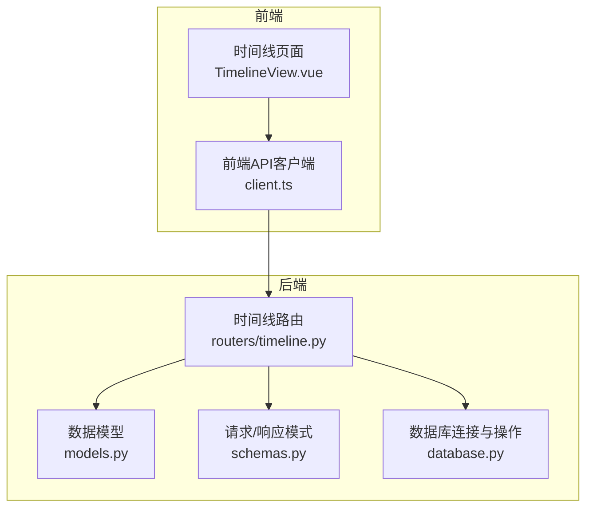
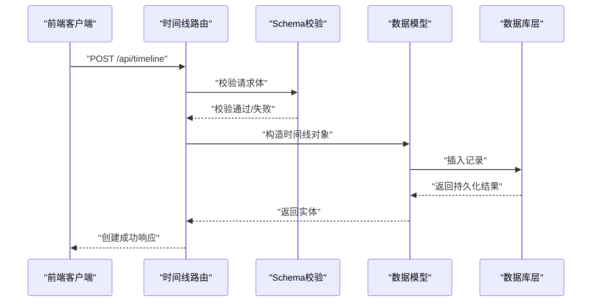
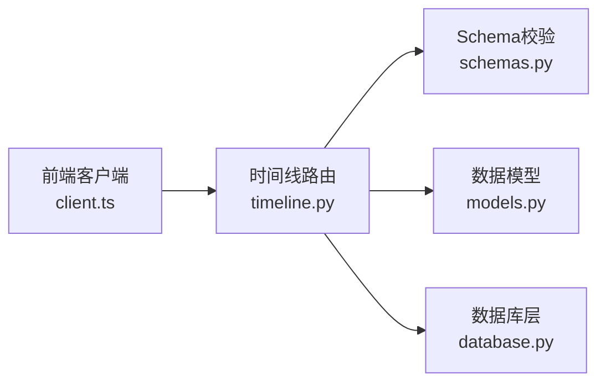

# 时间线API

<cite>
**本文档引用的文件**   
- [backend/routers/timeline.py](file://backend/routers/timeline.py)
- [backend/models.py](file://backend/models.py)
- [backend/schemas.py](file://backend/schemas.py)
- [backend/database.py](file://backend/database.py)
- [frontend/src/api/client.ts](file://frontend/src/api/client.ts)
- [frontend/src/views/TimelineView.vue](file://frontend/src/views/TimelineView.vue)
</cite>

## 目录
1. [简介](#简介)
2. [项目结构](#项目结构)
3. [核心组件](#核心组件)
4. [架构总览](#架构总览)
5. [详细组件分析](#详细组件分析)
6. [依赖关系分析](#依赖关系分析)
7. [性能考虑](#性能考虑)
8. [故障排查指南](#故障排查指南)
9. [结论](#结论)
10. [附录](#附录)

## 简介
本文件为“时间线管理API”的完整技术文档，覆盖时间线的创建、查询、更新与删除接口；详细说明时间线数据结构、排序规则、过滤条件与分页机制；阐述时间线聚合算法、事件关联关系与时间范围查询能力；并提供前后端调用示例与检索优化策略，帮助开发者快速集成与高效使用。

## 项目结构
后端采用分层设计：路由层暴露REST API，服务层封装业务逻辑，数据模型与Schema定义数据结构与校验，数据库层负责持久化。前端通过HTTP客户端调用后端API，并在页面中渲染时间线视图。

图表来源
- [backend/routers/timeline.py](file://backend/routers/timeline.py)
- [backend/models.py](file://backend/models.py)
- [backend/schemas.py](file://backend/schemas.py)
- [backend/database.py](file://backend/database.py)
- [frontend/src/api/client.ts](file://frontend/src/api/client.ts)
- [frontend/src/views/TimelineView.vue](file://frontend/src/views/TimelineView.vue)

章节来源
- [backend/routers/timeline.py](file://backend/routers/timeline.py)
- [backend/models.py](file://backend/models.py)
- [backend/schemas.py](file://backend/schemas.py)
- [backend/database.py](file://backend/database.py)
- [frontend/src/api/client.ts](file://frontend/src/api/client.ts)
- [frontend/src/views/TimelineView.vue](file://frontend/src/views/TimelineView.vue)

## 核心组件
- 路由层（时间线API）
  - 提供时间线的CRUD接口：创建、查询列表、按ID查询、更新、删除。
  - 支持过滤（时间范围、标签、类型等）、排序（时间戳升/降）、分页（页码、每页条数）。
  - 聚合接口：按天/周/月聚合统计，返回分组计数或汇总指标。
- 数据模型与Schema
  - 定义时间线实体字段、约束与默认值。
  - 定义请求体与响应体的结构，包含错误码与消息。
- 数据库层
  - 封装连接、事务、查询构建与结果映射。
  - 提供索引建议与批量操作支持。
- 前端客户端与视图
  - 封装HTTP调用、参数序列化与错误处理。
  - 渲染时间线卡片、聚合视图与交互操作。

章节来源
- [backend/routers/timeline.py](file://backend/routers/timeline.py)
- [backend/models.py](file://backend/models.py)
- [backend/schemas.py](file://backend/schemas.py)
- [backend/database.py](file://backend/database.py)
- [frontend/src/api/client.ts](file://frontend/src/api/client.ts)
- [frontend/src/views/TimelineView.vue](file://frontend/src/views/TimelineView.vue)

## 架构总览
时间线API的请求流程从前端发起，经路由层解析与校验后进入服务层进行业务处理，最终通过数据库层完成数据读写。聚合与排序在内存或数据库层实现，确保查询效率。

图表来源
- [backend/routers/timeline.py](file://backend/routers/timeline.py)
- [backend/schemas.py](file://backend/schemas.py)
- [backend/models.py](file://backend/models.py)
- [backend/database.py](file://backend/database.py)

## 详细组件分析

### 时间线数据模型与Schema
- 时间线实体字段
  - id：主键标识
  - title：标题
  - description：描述
  - start_time：开始时间（必填）
  - end_time：结束时间（可选）
  - tags：标签数组（可选）
  - type：类型枚举（如会议、任务、提醒等）
  - status：状态（草稿、已发布、归档等）
  - created_at/updated_at：审计时间戳
- Schema校验
  - 请求体字段类型与必填项校验
  - 时间范围合法性检查（start_time <= end_time）
  - 枚举值白名单校验（type、status）
- 响应结构
  - data：实体对象或列表
  - meta：分页信息（page、per_page、total、pages）
  - errors：错误码与消息

章节来源
- [backend/models.py](file://backend/models.py)
- [backend/schemas.py](file://backend/schemas.py)

### 时间线CRUD接口
- 创建时间线
  - 方法：POST
  - 路径：/api/timeline
  - 请求体：遵循Schema定义
  - 响应：创建成功的实体对象
- 查询时间线列表
  - 方法：GET
  - 路径：/api/timeline
  - 查询参数：
    - page：页码（默认1）
    - per_page：每页条数（默认20，最大100）
    - start_time/end_time：时间范围过滤
    - tags：标签过滤（逗号分隔或数组）
    - type/status：类型与状态过滤
    - sort_by：排序字段（默认start_time）
    - order：排序方向（asc/desc）
  - 响应：data列表 + meta分页信息
- 按ID查询时间线
  - 方法：GET
  - 路径：/api/timeline/{id}
  - 响应：单个实体对象
- 更新时间线
  - 方法：PUT/PATCH
  - 路径：/api/timeline/{id}
  - 请求体：可更新字段（部分更新）
  - 响应：更新后的实体对象
- 删除时间线
  - 方法：DELETE
  - 路径：/api/timeline/{id}
  - 响应：删除确认或空体

章节来源
- [backend/routers/timeline.py](file://backend/routers/timeline.py)
- [backend/schemas.py](file://backend/schemas.py)

### 排序规则与分页机制
- 排序规则
  - 支持多字段排序（如先按start_time，再按created_at）
  - 默认排序：start_time desc
  - 非法字段或方向将回退到默认排序
- 分页机制
  - 游标式分页或偏移分页（根据实现选择）
  - 限制per_page上限防止大结果集
  - 返回total与pages用于前端计算

章节来源
- [backend/routers/timeline.py](file://backend/routers/timeline.py)
- [backend/database.py](file://backend/database.py)

### 过滤条件与时间范围查询
- 基础过滤
  - 标签匹配（精确或模糊）
  - 类型与状态枚举过滤
- 时间范围查询
  - start_time/end_time闭区间过滤
  - 支持相对时间（如最近7天）
  - 自动校正非法时间范围
- 组合过滤
  - AND逻辑组合多个条件
  - 支持NOT与IN扩展（可选）

章节来源
- [backend/routers/timeline.py](file://backend/routers/timeline.py)
- [backend/schemas.py](file://backend/schemas.py)

### 时间线聚合算法
- 聚合维度
  - 按天/周/月分组统计数量
  - 按类型/标签分组统计
- 聚合指标
  - count：条目数量
  - duration：时长总和（end_time - start_time）
  - avg_duration：平均时长
- 聚合流程
  - 解析聚合参数（group_by、metrics）
  - 构建SQL或内存聚合逻辑
  - 返回结构化聚合结果

章节来源
- [backend/routers/timeline.py](file://backend/routers/timeline.py)
- [backend/database.py](file://backend/database.py)

### 事件关联关系
- 事件与时间线
  - 一条时间线可关联多个事件（一对多）
  - 事件包含类型、内容、时间戳等
- 关联查询
  - 支持JOIN或子查询获取关联事件
  - 分页时避免N+1问题（预加载或批量查询）

章节来源
- [backend/models.py](file://backend/models.py)
- [backend/database.py](file://backend/database.py)

### 前端调用示例与渲染
- 客户端封装
  - 统一请求头与错误处理
  - 参数序列化（时间格式、数组转字符串）
- 页面交互
  - 时间线列表渲染（卡片布局）
  - 筛选器与排序控件
  - 分页导航与加载更多
- 聚合视图
  - 柱状图/折线图展示趋势
  - 点击钻取到明细列表

章节来源
- [frontend/src/api/client.ts](file://frontend/src/api/client.ts)
- [frontend/src/views/TimelineView.vue](file://frontend/src/views/TimelineView.vue)

## 依赖关系分析
时间线API模块依赖Schema校验、数据模型与数据库层，前端依赖HTTP客户端与服务端API契约。

图表来源
- [frontend/src/api/client.ts](file://frontend/src/api/client.ts)
- [backend/routers/timeline.py](file://backend/routers/timeline.py)
- [backend/schemas.py](file://backend/schemas.py)
- [backend/models.py](file://backend/models.py)
- [backend/database.py](file://backend/database.py)

章节来源
- [backend/routers/timeline.py](file://backend/routers/timeline.py)
- [backend/schemas.py](file://backend/schemas.py)
- [backend/models.py](file://backend/models.py)
- [backend/database.py](file://backend/database.py)
- [frontend/src/api/client.ts](file://frontend/src/api/client.ts)

## 性能考虑
- 索引优化
  - 对start_time、end_time、tags、type、status建立复合索引
  - 高频查询字段加入覆盖索引
- 查询优化
  - 使用预加载避免N+1
  - 限制返回字段（投影）减少传输开销
- 缓存策略
  - 热点聚合结果缓存（Redis）
  - 短时效缓存频繁读取的时间线列表
- 分页优化
  - 游标分页替代偏移分页
  - 限制per_page上限与深度分页

[本节为通用性能建议，不直接分析具体文件]

## 故障排查指南
- 常见错误
  - 400：请求体校验失败（字段缺失、类型错误、时间范围非法）
  - 404：资源不存在（ID无效）
  - 500：服务器内部错误（数据库异常、未捕获异常）
- 调试步骤
  - 检查请求参数是否符合Schema
  - 查看数据库日志与慢查询
  - 验证索引是否命中
- 恢复措施
  - 重试幂等接口（GET、POST去重）
  - 降级非关键功能（关闭聚合查询）

章节来源
- [backend/schemas.py](file://backend/schemas.py)
- [backend/database.py](file://backend/database.py)

## 结论
时间线API提供了完整的CRUD能力、灵活的过滤与排序、高效的聚合与分页机制，并通过清晰的数据模型与Schema保障数据一致性。结合前端客户端与视图，可实现丰富的时间线管理与可视化体验。建议在生产环境启用索引、缓存与监控，以保障高可用与高性能。

[本节为总结性内容，不直接分析具体文件]

## 附录
- API调用示例（概念性）
  - 创建时间线：POST /api/timeline，请求体包含title、start_time等必填字段
  - 查询列表：GET /api/timeline?page=1&per_page=20&start_time=...&end_time=...
  - 聚合查询：GET /api/timeline/aggregations?group_by=day&metrics=count,duration
- 最佳实践
  - 始终传递时间范围以减少结果集
  - 使用标签与类型过滤提高精度
  - 合理设置per_page与分页策略

[本节为补充说明，不直接分析具体文件]