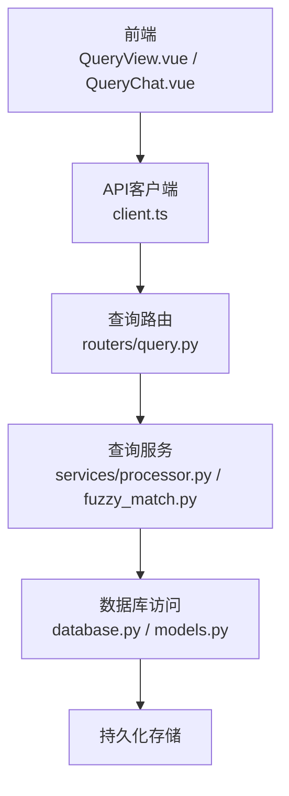
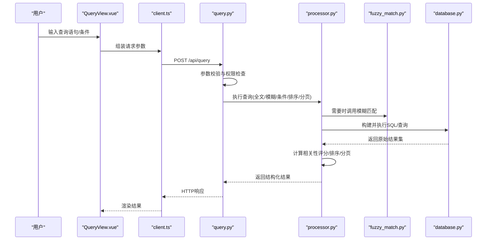
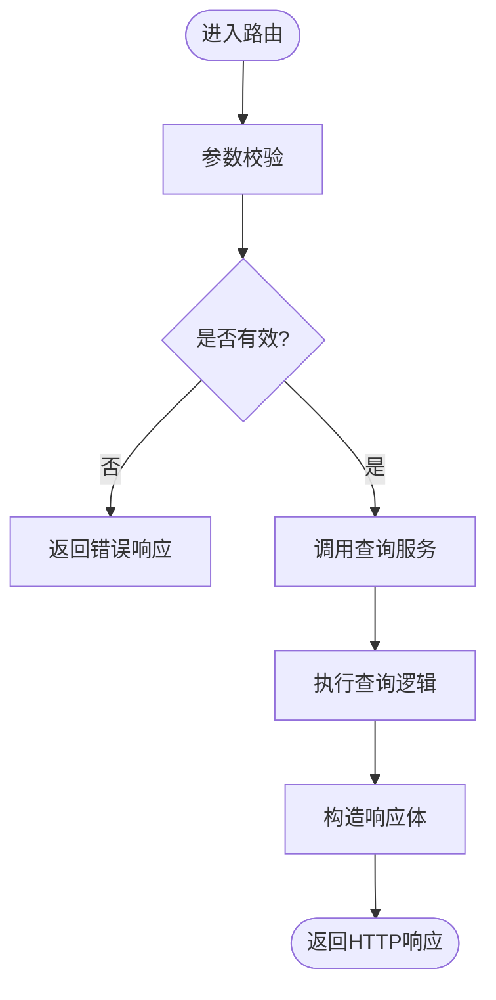
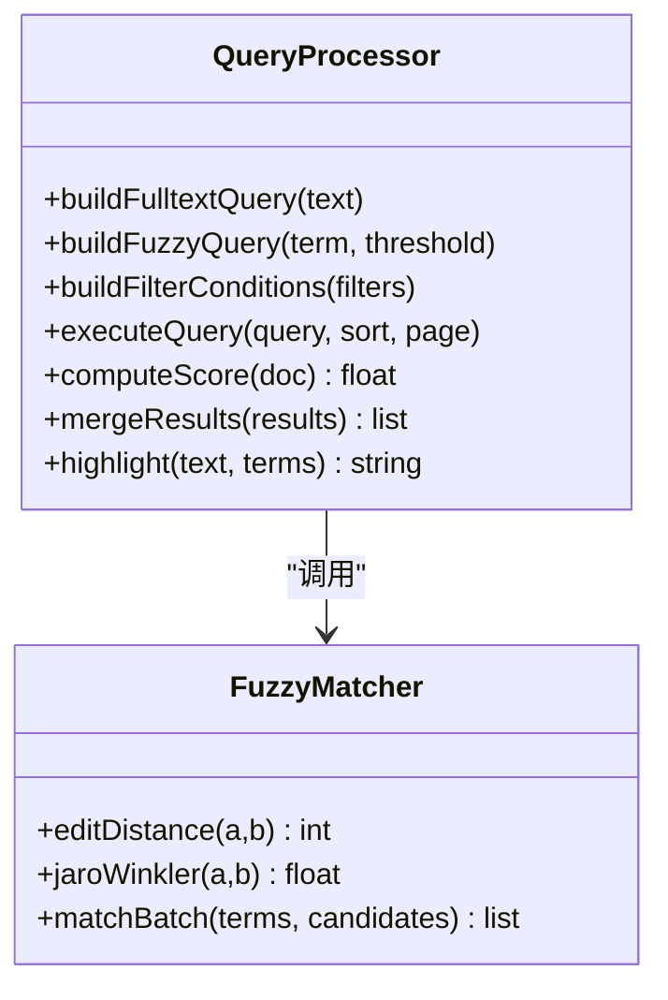
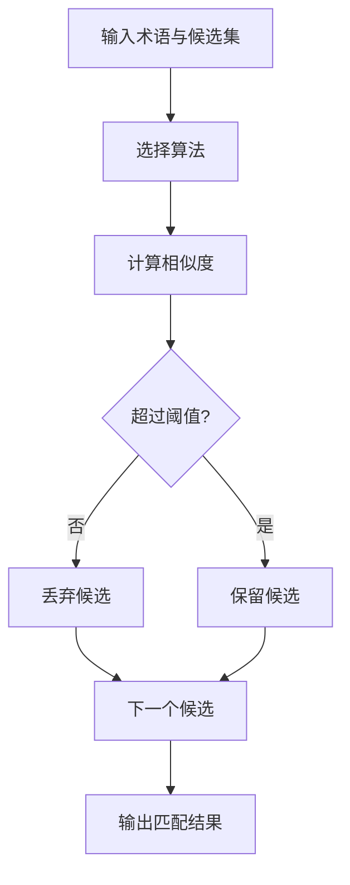
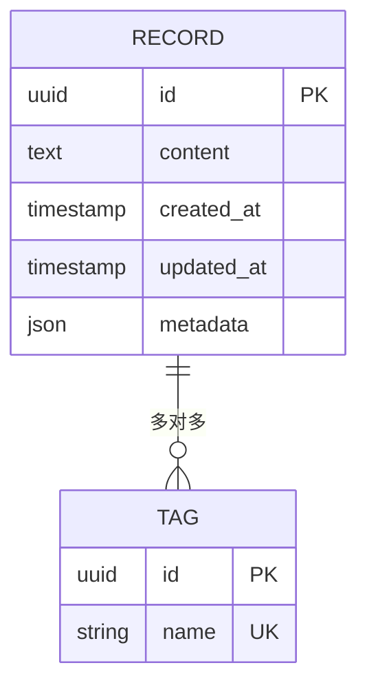
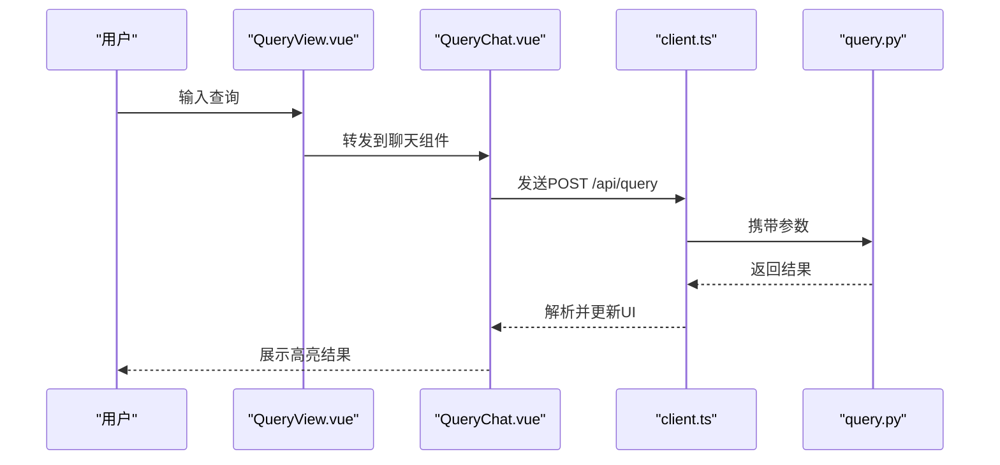
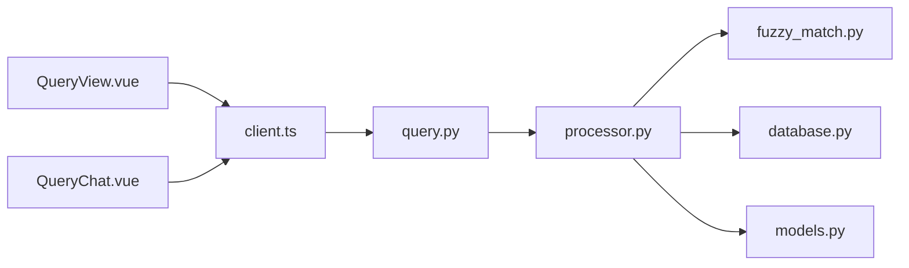

# 查询API

<cite>
**本文引用的文件**   
- [backend/routers/query.py](file://backend/routers/query.py)
- [backend/services/fuzzy_match.py](file://backend/services/fuzzy_match.py)
- [backend/services/processor.py](file://backend/services/processor.py)
- [backend/database.py](file://backend/database.py)
- [backend/models.py](file://backend/models.py)
- [backend/schemas.py](file://backend/schemas.py)
- [frontend/src/api/client.ts](file://frontend/src/api/client.ts)
- [frontend/src/components/QueryChat.vue](file://frontend/src/components/QueryChat.vue)
- [frontend/src/views/QueryView.vue](file://frontend/src/views/QueryView.vue)
</cite>

## 目录
1. [简介](#简介)
2. [项目结构](#项目结构)
3. [核心组件](#核心组件)
4. [架构总览](#架构总览)
5. [详细组件分析](#详细组件分析)
6. [依赖关系分析](#依赖关系分析)
7. [性能考量](#性能考量)
8. [故障排查指南](#故障排查指南)
9. [结论](#结论)
10. [附录](#附录)

## 简介
本文件面向后端与前端开发者，系统化说明“查询API”的能力与实现要点，覆盖全文搜索、模糊匹配、条件筛选与高级查询接口。文档重点包括：
- 查询语法与参数规范（关键词、短语、布尔组合、范围过滤、时间区间等）
- 索引机制与排序策略（相关性评分、权重、分页）
- 自然语言查询处理（分词、去噪、同义词扩展、语义检索）
- 关键词提取与语义搜索能力
- 典型查询示例与最佳实践
- 性能优化建议与常见问题定位

## 项目结构
查询功能涉及后端路由、服务层、数据模型与数据库访问，以及前端的调用与交互组件。整体组织如下：
- 路由层：定义HTTP接口，解析请求参数，调度服务层方法
- 服务层：封装查询逻辑（全文检索、模糊匹配、条件筛选、排序与分页）
- 数据层：模型定义与数据库操作（连接、事务、查询构建）
- 前端：API客户端封装与页面组件，负责用户输入与结果展示

**图表来源** 
- [backend/routers/query.py](file://backend/routers/query.py)
- [backend/services/processor.py](file://backend/services/processor.py)
- [backend/services/fuzzy_match.py](file://backend/services/fuzzy_match.py)
- [backend/database.py](file://backend/database.py)
- [backend/models.py](file://backend/models.py)
- [frontend/src/api/client.ts](file://frontend/src/api/client.ts)
- [frontend/src/components/QueryChat.vue](file://frontend/src/components/QueryChat.vue)
- [frontend/src/views/QueryView.vue](file://frontend/src/views/QueryView.vue)

**章节来源**
- [backend/routers/query.py](file://backend/routers/query.py)
- [backend/services/processor.py](file://backend/services/processor.py)
- [backend/services/fuzzy_match.py](file://backend/services/fuzzy_match.py)
- [backend/database.py](file://backend/database.py)
- [backend/models.py](file://backend/models.py)
- [backend/schemas.py](file://backend/schemas.py)
- [frontend/src/api/client.ts](file://frontend/src/api/client.ts)
- [frontend/src/components/QueryChat.vue](file://frontend/src/components/QueryChat.vue)
- [frontend/src/views/QueryView.vue](file://frontend/src/views/QueryView.vue)

## 核心组件
- 查询路由（routers/query.py）
  - 职责：接收HTTP请求，校验参数，调用服务层执行查询，返回统一响应格式
  - 关键点：支持全文搜索、模糊匹配、条件筛选、排序与分页；错误码与异常处理
- 查询服务（services/processor.py）
  - 职责：构建查询条件、执行检索、合并结果、计算相关性评分、排序与分页
  - 关键点：自然语言处理（分词、去停用词、同义词扩展）、关键词提取、语义向量检索（可选）
- 模糊匹配服务（services/fuzzy_match.py）
  - 职责：字符串相似度计算、编辑距离、近似匹配、候选召回
  - 关键点：阈值控制、批量匹配、性能优化（缓存、预索引）
- 数据模型与数据库（models.py, database.py）
  - 职责：ORM模型定义、连接管理、事务、查询构建器
  - 关键点：索引字段设计、全文索引配置、聚合与排序
- 前端API客户端（frontend/src/api/client.ts）
  - 职责：封装HTTP请求、参数序列化、错误重试、分页加载
- 前端组件（QueryView.vue, QueryChat.vue）
  - 职责：查询表单、自然语言输入、结果列表、高亮显示、导出

**章节来源**
- [backend/routers/query.py](file://backend/routers/query.py)
- [backend/services/processor.py](file://backend/services/processor.py)
- [backend/services/fuzzy_match.py](file://backend/services/fuzzy_match.py)
- [backend/database.py](file://backend/database.py)
- [backend/models.py](file://backend/models.py)
- [backend/schemas.py](file://backend/schemas.py)
- [frontend/src/api/client.ts](file://frontend/src/api/client.ts)
- [frontend/src/components/QueryChat.vue](file://frontend/src/components/QueryChat.vue)
- [frontend/src/views/QueryView.vue](file://frontend/src/views/QueryView.vue)

## 架构总览
查询API采用分层架构：前端通过API客户端发起请求，路由层进行参数校验与权限检查后，交由服务层完成查询逻辑，最终通过数据库层获取数据并返回。

**图表来源** 
- [frontend/src/views/QueryView.vue](file://frontend/src/views/QueryView.vue)
- [frontend/src/api/client.ts](file://frontend/src/api/client.ts)
- [backend/routers/query.py](file://backend/routers/query.py)
- [backend/services/processor.py](file://backend/services/processor.py)
- [backend/services/fuzzy_match.py](file://backend/services/fuzzy_match.py)
- [backend/database.py](file://backend/database.py)

## 详细组件分析

### 查询路由（routers/query.py）
- 接口设计
  - 全文搜索：支持关键词、短语、布尔组合（AND/OR/NOT）
  - 模糊匹配：编辑距离阈值、近似匹配、候选召回
  - 条件筛选：字段过滤、范围查询、时间区间、多值匹配
  - 高级查询：排序字段与方向、分页参数、高亮标记、聚合统计
- 参数校验与错误处理
  - 必填字段校验、类型转换、边界检查
  - 统一错误码与消息，便于前端提示
- 调用服务层
  - 将请求参数映射为服务层方法调用
  - 处理超时与异常，返回标准响应体

**图表来源** 
- [backend/routers/query.py](file://backend/routers/query.py)

**章节来源**
- [backend/routers/query.py](file://backend/routers/query.py)

### 查询服务（services/processor.py）
- 查询构建
  - 全文检索：分词、去停用词、同义词扩展、短语匹配
  - 模糊匹配：编辑距离、Jaro-Winkler、Levenshtein等算法选择
  - 条件筛选：字段级过滤、范围与时间区间、多值IN查询
  - 排序与分页：按相关性评分、时间戳、自定义权重排序；分页游标或偏移
- 相关性评分
  - TF-IDF或BM25思想（若使用），结合字段权重、命中次数、位置邻近度
  - 语义向量相似度（可选）：余弦相似度、Top-K召回
- 结果合并与高亮
  - 多路召回合并（全文+模糊+条件），去重与重排
  - 高亮片段生成，提升可读性

**图表来源** 
- [backend/services/processor.py](file://backend/services/processor.py)
- [backend/services/fuzzy_match.py](file://backend/services/fuzzy_match.py)

**章节来源**
- [backend/services/processor.py](file://backend/services/processor.py)
- [backend/services/fuzzy_match.py](file://backend/services/fuzzy_match.py)

### 模糊匹配服务（services/fuzzy_match.py）
- 算法选择
  - 编辑距离（Levenshtein）：适用于短文本近似匹配
  - Jaro-Winkler：对前缀敏感，适合人名、地名
  - 阈值控制：根据业务场景调整相似度阈值
- 性能优化
  - 预索引候选集合，减少全表扫描
  - 批量匹配与并行处理
  - 缓存热点查询结果

**图表来源** 
- [backend/services/fuzzy_match.py](file://backend/services/fuzzy_match.py)

**章节来源**
- [backend/services/fuzzy_match.py](file://backend/services/fuzzy_match.py)

### 数据模型与数据库（models.py, database.py）
- 模型定义
  - 实体字段、索引字段、全文索引配置
  - 关联关系与外键约束
- 数据库访问
  - 连接池与事务管理
  - 查询构建器：动态拼接WHERE、JOIN、ORDER BY、LIMIT/OFFSET
  - 性能优化：索引设计、查询计划分析、慢查询日志

**图表来源** 
- [backend/models.py](file://backend/models.py)

**章节来源**
- [backend/models.py](file://backend/models.py)
- [backend/database.py](file://backend/database.py)

### 前端API客户端与组件（client.ts, QueryView.vue, QueryChat.vue）
- API客户端
  - 封装HTTP请求，统一错误处理与重试
  - 参数序列化（查询条件、分页、排序）
- 查询视图与聊天组件
  - 自然语言输入框、历史查询、结果列表
  - 高亮显示、分页加载、导出功能

**图表来源** 
- [frontend/src/api/client.ts](file://frontend/src/api/client.ts)
- [frontend/src/components/QueryChat.vue](file://frontend/src/components/QueryChat.vue)
- [frontend/src/views/QueryView.vue](file://frontend/src/views/QueryView.vue)
- [backend/routers/query.py](file://backend/routers/query.py)

**章节来源**
- [frontend/src/api/client.ts](file://frontend/src/api/client.ts)
- [frontend/src/components/QueryChat.vue](file://frontend/src/components/QueryChat.vue)
- [frontend/src/views/QueryView.vue](file://frontend/src/views/QueryView.vue)

## 依赖关系分析
- 模块耦合
  - 路由层依赖服务层，服务层依赖数据库层
  - 模糊匹配服务被查询服务按需调用
- 外部依赖
  - 数据库驱动、ORM框架、全文检索引擎（如适用）
  - 自然语言处理库（分词、停用词、同义词）
- 潜在循环依赖
  - 确保服务层不反向依赖路由层，保持单向依赖

**图表来源** 
- [backend/routers/query.py](file://backend/routers/query.py)
- [backend/services/processor.py](file://backend/services/processor.py)
- [backend/services/fuzzy_match.py](file://backend/services/fuzzy_match.py)
- [backend/database.py](file://backend/database.py)
- [backend/models.py](file://backend/models.py)
- [frontend/src/api/client.ts](file://frontend/src/api/client.ts)
- [frontend/src/components/QueryChat.vue](file://frontend/src/components/QueryChat.vue)
- [frontend/src/views/QueryView.vue](file://frontend/src/views/QueryView.vue)

**章节来源**
- [backend/routers/query.py](file://backend/routers/query.py)
- [backend/services/processor.py](file://backend/services/processor.py)
- [backend/services/fuzzy_match.py](file://backend/services/fuzzy_match.py)
- [backend/database.py](file://backend/database.py)
- [backend/models.py](file://backend/models.py)
- [frontend/src/api/client.ts](file://frontend/src/api/client.ts)
- [frontend/src/components/QueryChat.vue](file://frontend/src/components/QueryChat.vue)
- [frontend/src/views/QueryView.vue](file://frontend/src/views/QueryView.vue)

## 性能考量
- 索引设计
  - 全文索引：对高频查询字段建立FTS索引
  - 条件字段：为常用过滤字段添加B-tree索引
  - 复合索引：针对常见排序与过滤组合
- 查询优化
  - 避免SELECT *，仅选择必要字段
  - 合理使用LIMIT/OFFSET或使用游标分页
  - 避免N+1查询，使用JOIN或批量加载
- 缓存策略
  - 热点查询结果缓存（TTL）
  - 模糊匹配候选集预计算与缓存
- 并发与限流
  - 连接池大小调优
  - 接口限流与降级策略

[本节为通用指导，无需特定文件引用]

## 故障排查指南
- 常见问题
  - 参数校验失败：检查必填字段、类型与边界
  - 查询超时：分析慢查询日志，优化索引与SQL
  - 模糊匹配不准确：调整相似度阈值与算法
  - 结果排序异常：确认权重与排序字段
- 调试手段
  - 启用详细日志，记录查询构建过程
  - 使用数据库EXPLAIN分析执行计划
  - 前端网络面板检查请求与响应

**章节来源**
- [backend/routers/query.py](file://backend/routers/query.py)
- [backend/services/processor.py](file://backend/services/processor.py)
- [backend/services/fuzzy_match.py](file://backend/services/fuzzy_match.py)
- [backend/database.py](file://backend/database.py)

## 结论
查询API通过清晰的分层设计与完善的查询能力，满足全文搜索、模糊匹配、条件筛选与高级查询需求。合理的索引与排序策略、自然语言处理与语义搜索能力，以及前端良好的交互体验，共同构成高效可靠的查询系统。建议在业务演进中持续优化索引、缓存与查询构建，以提升性能与用户体验。

[本节为总结性内容，无需特定文件引用]

## 附录
- 查询语法参考
  - 全文搜索：关键词、短语、布尔组合（AND/OR/NOT）
  - 模糊匹配：编辑距离阈值、近似匹配
  - 条件筛选：字段过滤、范围、时间区间、多值匹配
  - 排序与分页：按相关性、时间、自定义权重；分页参数
- 最佳实践
  - 优先使用精确条件缩小结果集
  - 合理设置分页大小，避免过大OFFSET
  - 对高频查询字段建立索引
  - 使用缓存降低重复查询开销
- 示例场景
  - 自然语言查询：“最近一周关于AI的会议记录”
  - 模糊匹配：“人工智能”近似匹配“人工智障”
  - 条件筛选：时间区间+主题标签+作者
  - 高级查询：按相关性排序+高亮+导出CSV

[本节为概念性内容，无需特定文件引用]