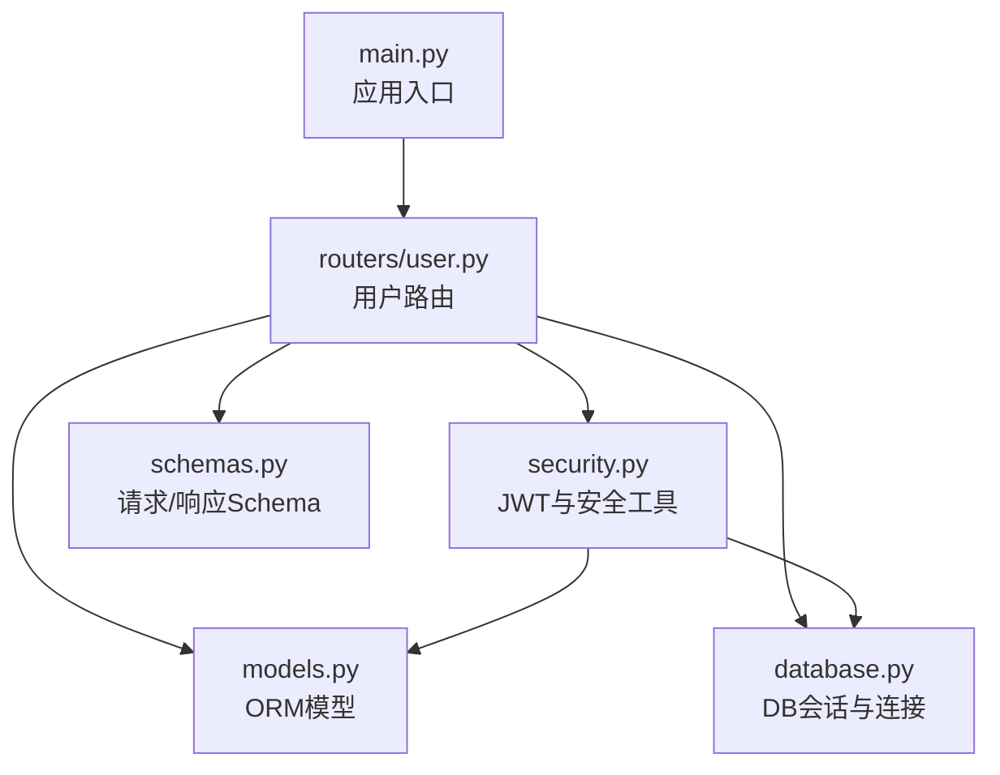
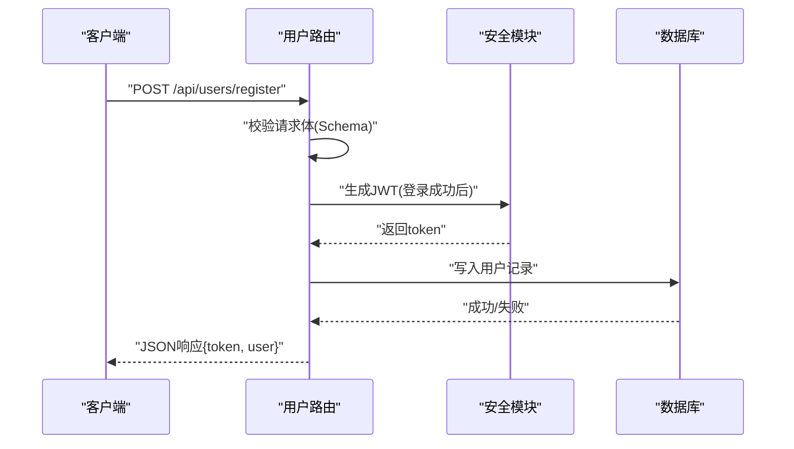
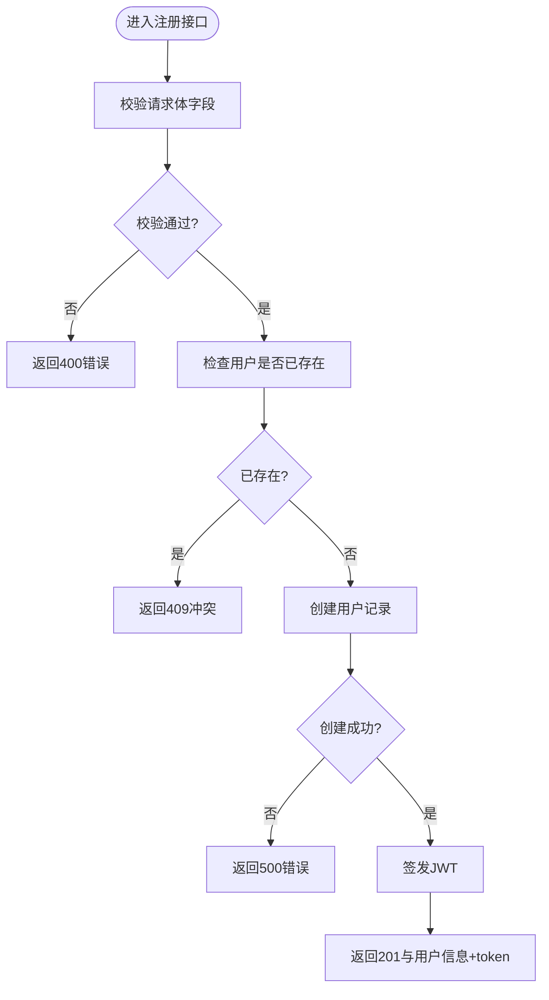
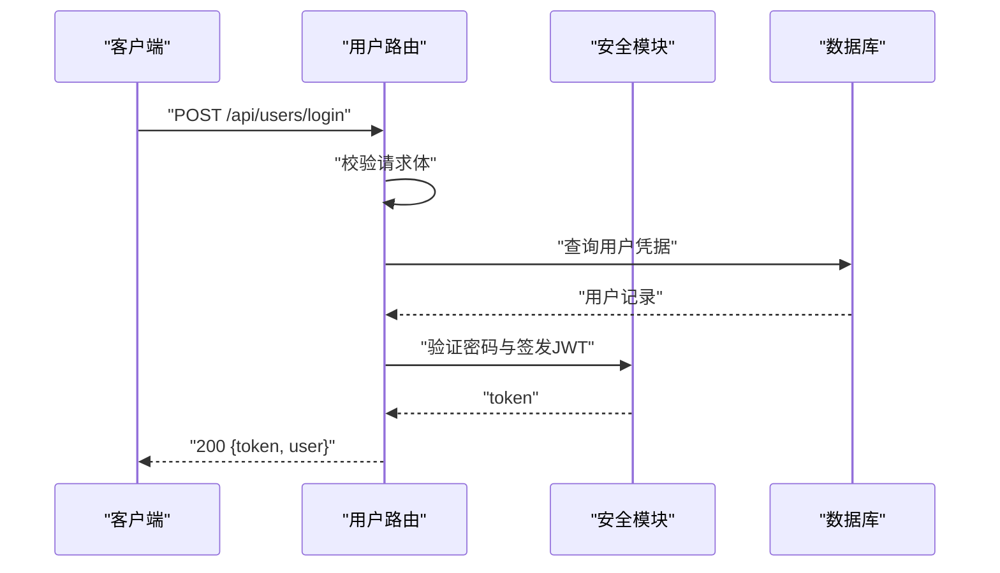
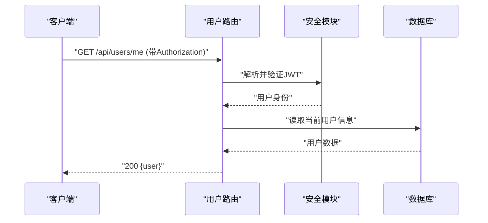
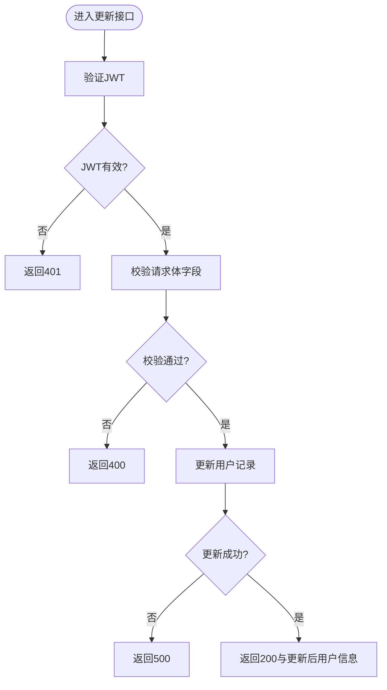
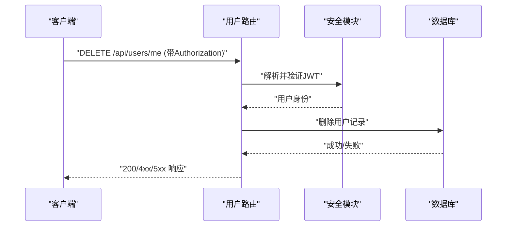
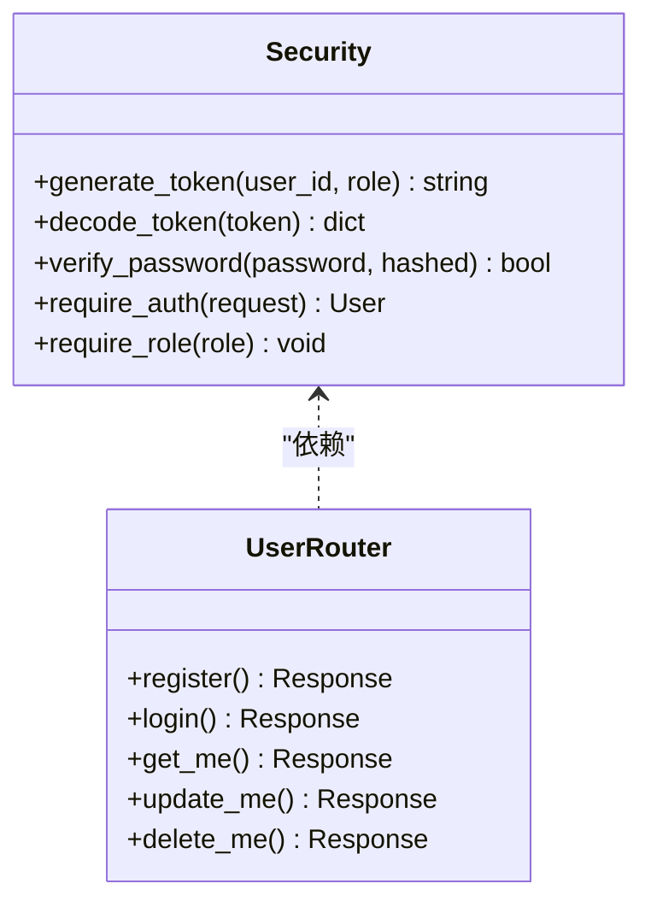
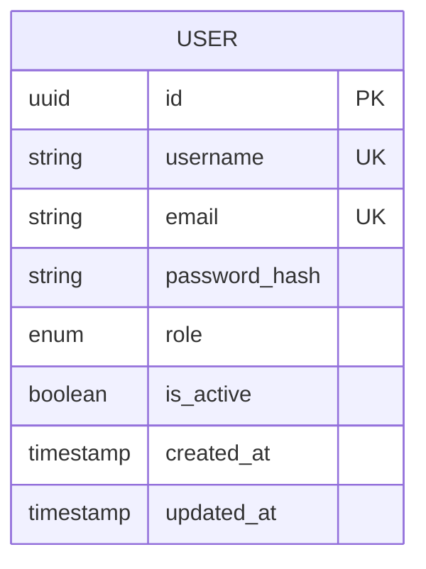
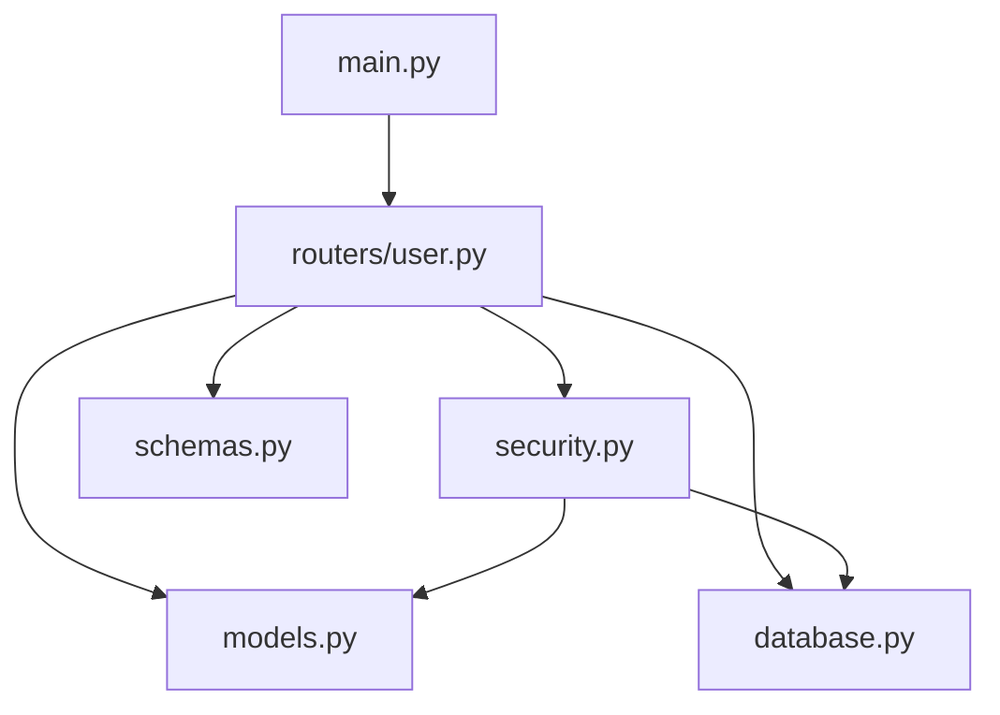

# 用户管理API

<cite>
**本文引用的文件**   
- [backend/routers/user.py](file://backend/routers/user.py)
- [backend/security.py](file://backend/security.py)
- [backend/models.py](file://backend/models.py)
- [backend/schemas.py](file://backend/schemas.py)
- [backend/database.py](file://backend/database.py)
- [backend/main.py](file://backend/main.py)
</cite>

## 目录
1. [简介](#简介)
2. [项目结构](#项目结构)
3. [核心组件](#核心组件)
4. [架构总览](#架构总览)
5. [详细组件分析](#详细组件分析)
6. [依赖关系分析](#依赖关系分析)
7. [性能考虑](#性能考虑)
8. [故障排查指南](#故障排查指南)
9. [结论](#结论)
10. [附录](#附录)

## 简介
本文件为用户管理API的完整技术文档，覆盖用户注册、登录、信息查询、更新与删除等RESTful端点。文档包含每个端点的HTTP方法、URL路径、请求参数、响应格式与错误码说明；同时阐述JWT认证机制的实现细节、权限验证逻辑以及用户状态管理策略。文末提供完整的请求/响应示例与数据模型字段校验规则，便于前后端联调与集成。

## 项目结构
后端采用模块化分层：路由层定义REST端点，服务与安全模块处理认证与鉴权，数据模型与Schema负责数据结构与校验，数据库模块封装持久化操作，主应用装配路由与中间件。

**图示来源** 
- [backend/main.py](file://backend/main.py)
- [backend/routers/user.py](file://backend/routers/user.py)
- [backend/security.py](file://backend/security.py)
- [backend/models.py](file://backend/models.py)
- [backend/schemas.py](file://backend/schemas.py)
- [backend/database.py](file://backend/database.py)

**章节来源**
- [backend/main.py](file://backend/main.py)
- [backend/routers/user.py](file://backend/routers/user.py)

## 核心组件
- 路由层（用户）：集中实现用户相关REST端点，包括注册、登录、信息获取、更新、删除等。
- 安全模块：负责JWT令牌签发、解析与校验，以及基于角色的访问控制（RBAC）。
- 数据模型：定义用户实体及其字段约束，映射到数据库表结构。
- Schema：定义请求体与响应体的结构与校验规则，确保输入合法性与输出一致性。
- 数据库：封装会话管理与事务边界，保证数据一致性与并发安全。

**章节来源**
- [backend/routers/user.py](file://backend/routers/user.py)
- [backend/security.py](file://backend/security.py)
- [backend/models.py](file://backend/models.py)
- [backend/schemas.py](file://backend/schemas.py)
- [backend/database.py](file://backend/database.py)

## 架构总览
下图展示用户管理API的请求处理流程：客户端通过HTTP调用路由，路由解析并校验请求体，调用安全模块进行认证与授权，随后访问数据库完成CRUD操作，最终返回标准化响应。

**图示来源** 
- [backend/routers/user.py](file://backend/routers/user.py)
- [backend/security.py](file://backend/security.py)
- [backend/models.py](file://backend/models.py)
- [backend/schemas.py](file://backend/schemas.py)
- [backend/database.py](file://backend/database.py)

## 详细组件分析

### 用户注册
- HTTP方法与路径：POST /api/users/register
- 请求体字段：用户名、邮箱、密码（长度、格式、唯一性校验）
- 响应格式：成功返回用户基本信息与JWT token；失败返回错误码与消息
- 错误码：400（参数校验失败）、409（重复注册）

**图示来源** 
- [backend/routers/user.py](file://backend/routers/user.py)
- [backend/schemas.py](file://backend/schemas.py)
- [backend/models.py](file://backend/models.py)
- [backend/security.py](file://backend/security.py)
- [backend/database.py](file://backend/database.py)

**章节来源**
- [backend/routers/user.py](file://backend/routers/user.py)
- [backend/schemas.py](file://backend/schemas.py)
- [backend/models.py](file://backend/models.py)
- [backend/security.py](file://backend/security.py)
- [backend/database.py](file://backend/database.py)

### 用户登录
- HTTP方法与路径：POST /api/users/login
- 请求体字段：邮箱或用户名、密码
- 响应格式：成功返回JWT token与用户基本信息；失败返回错误码与消息
- 错误码：400（参数缺失）、401（凭证无效）

**图示来源** 
- [backend/routers/user.py](file://backend/routers/user.py)
- [backend/security.py](file://backend/security.py)
- [backend/models.py](file://backend/models.py)
- [backend/database.py](file://backend/database.py)

**章节来源**
- [backend/routers/user.py](file://backend/routers/user.py)
- [backend/security.py](file://backend/security.py)
- [backend/models.py](file://backend/models.py)
- [backend/database.py](file://backend/database.py)

### 获取当前用户信息
- HTTP方法与路径：GET /api/users/me
- 认证要求：需携带有效JWT
- 响应格式：返回当前用户的基本信息与状态
- 错误码：401（未认证）、403（无权限）

**图示来源** 
- [backend/routers/user.py](file://backend/routers/user.py)
- [backend/security.py](file://backend/security.py)
- [backend/models.py](file://backend/models.py)
- [backend/database.py](file://backend/database.py)

**章节来源**
- [backend/routers/user.py](file://backend/routers/user.py)
- [backend/security.py](file://backend/security.py)
- [backend/models.py](file://backend/models.py)
- [backend/database.py](file://backend/database.py)

### 更新用户信息
- HTTP方法与路径：PUT /api/users/me
- 认证要求：需携带有效JWT
- 请求体字段：可更新的字段（如昵称、头像、偏好设置等），含字段校验
- 响应格式：返回更新后的用户信息
- 错误码：400（参数校验失败）、401（未认证）、403（无权限）

**图示来源** 
- [backend/routers/user.py](file://backend/routers/user.py)
- [backend/schemas.py](file://backend/schemas.py)
- [backend/security.py](file://backend/security.py)
- [backend/models.py](file://backend/models.py)
- [backend/database.py](file://backend/database.py)

**章节来源**
- [backend/routers/user.py](file://backend/routers/user.py)
- [backend/schemas.py](file://backend/schemas.py)
- [backend/security.py](file://backend/security.py)
- [backend/models.py](file://backend/models.py)
- [backend/database.py](file://backend/database.py)

### 删除用户账户
- HTTP方法与路径：DELETE /api/users/me
- 认证要求：需携带有效JWT
- 响应格式：成功返回确认消息；失败返回错误码与消息
- 错误码：401（未认证）、403（无权限）、404（用户不存在）

**图示来源** 
- [backend/routers/user.py](file://backend/routers/user.py)
- [backend/security.py](file://backend/security.py)
- [backend/models.py](file://backend/models.py)
- [backend/database.py](file://backend/database.py)

**章节来源**
- [backend/routers/user.py](file://backend/routers/user.py)
- [backend/security.py](file://backend/security.py)
- [backend/models.py](file://backend/models.py)
- [backend/database.py](file://backend/database.py)

### JWT认证与权限验证
- 签发：登录成功后由安全模块签发JWT，包含用户标识与角色信息，设置过期时间。
- 校验：受保护端点通过中间件或依赖注入解析Authorization头中的Bearer Token，验证签名与有效期。
- 权限：基于角色（如普通用户、管理员）进行访问控制，限制敏感操作。

**图示来源** 
- [backend/security.py](file://backend/security.py)
- [backend/routers/user.py](file://backend/routers/user.py)

**章节来源**
- [backend/security.py](file://backend/security.py)
- [backend/routers/user.py](file://backend/routers/user.py)

### 用户数据模型与字段校验
- 模型字段：用户ID、用户名、邮箱、密码哈希、角色、状态、创建时间、更新时间等。
- 校验规则：邮箱格式、密码强度、用户名唯一性、必填字段校验、数值范围限制等。
- 响应结构：统一包装成功/失败状态、数据对象与错误消息。

**图示来源** 
- [backend/models.py](file://backend/models.py)
- [backend/schemas.py](file://backend/schemas.py)

**章节来源**
- [backend/models.py](file://backend/models.py)
- [backend/schemas.py](file://backend/schemas.py)

## 依赖关系分析
用户路由依赖安全模块进行认证与授权，依赖数据模型与Schema进行数据校验与转换，依赖数据库模块进行持久化操作。主应用装配路由并提供全局配置。

**图示来源** 
- [backend/main.py](file://backend/main.py)
- [backend/routers/user.py](file://backend/routers/user.py)
- [backend/security.py](file://backend/security.py)
- [backend/models.py](file://backend/models.py)
- [backend/schemas.py](file://backend/schemas.py)
- [backend/database.py](file://backend/database.py)

**章节来源**
- [backend/main.py](file://backend/main.py)
- [backend/routers/user.py](file://backend/routers/user.py)
- [backend/security.py](file://backend/security.py)
- [backend/models.py](file://backend/models.py)
- [backend/schemas.py](file://backend/schemas.py)
- [backend/database.py](file://backend/database.py)

## 性能考虑
- 数据库索引：对用户名、邮箱建立唯一索引以加速查询与冲突检测。
- 缓存策略：对频繁读取的用户信息可引入缓存层降低数据库压力。
- 令牌刷新：支持短期JWT与刷新令牌机制，减少重认证开销。
- 批量操作：避免在用户更新中执行过多I/O，合并必要的数据写入。

[本节为通用指导，不直接分析具体文件]

## 故障排查指南
- 401未认证：检查Authorization头是否正确携带Bearer Token，确认Token未过期且签名有效。
- 403无权限：确认用户角色是否具备所需权限，检查权限校验逻辑。
- 400参数错误：核对请求体字段是否符合Schema校验规则，补齐必填项。
- 409冲突：注册时用户名或邮箱已存在，建议前端提示用户修改。
- 500服务器错误：查看后端日志定位异常堆栈，检查数据库连接与事务状态。

**章节来源**
- [backend/routers/user.py](file://backend/routers/user.py)
- [backend/security.py](file://backend/security.py)
- [backend/schemas.py](file://backend/schemas.py)
- [backend/database.py](file://backend/database.py)

## 结论
用户管理API围绕注册、登录、信息查询、更新与删除等核心功能构建，采用JWT认证与基于角色的权限控制保障安全性与可扩展性。通过清晰的Schema校验与统一的错误码体系，提升前后端协作效率与系统稳定性。建议在生产环境启用缓存、限流与审计日志，进一步优化性能与可观测性。

[本节为总结性内容，不直接分析具体文件]

## 附录

### 端点清单与示例
- 注册
  - POST /api/users/register
  - 请求体：用户名、邮箱、密码
  - 响应：201 成功，包含用户信息与JWT
  - 错误：400、409
- 登录
  - POST /api/users/login
  - 请求体：邮箱或用户名、密码
  - 响应：200 成功，包含JWT与用户信息
  - 错误：400、401
- 获取当前用户
  - GET /api/users/me
  - 认证：Bearer Token
  - 响应：200 用户信息
  - 错误：401、403
- 更新当前用户
  - PUT /api/users/me
  - 认证：Bearer Token
  - 请求体：可更新字段
  - 响应：200 更新后用户信息
  - 错误：400、401、403
- 删除当前用户
  - DELETE /api/users/me
  - 认证：Bearer Token
  - 响应：200 确认消息
  - 错误：401、403、404

[本节为概念性示例，不直接分析具体文件]