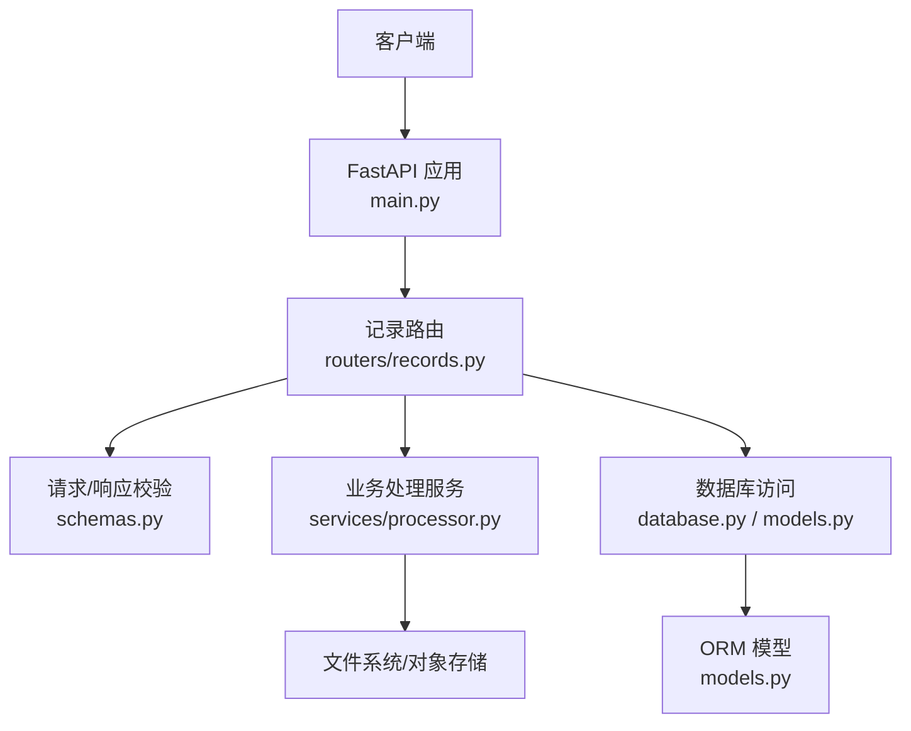
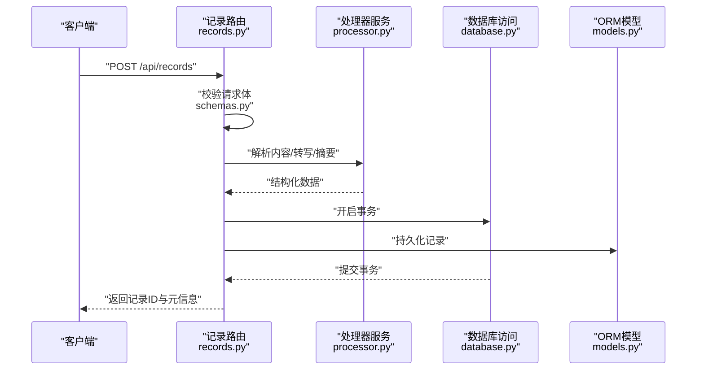
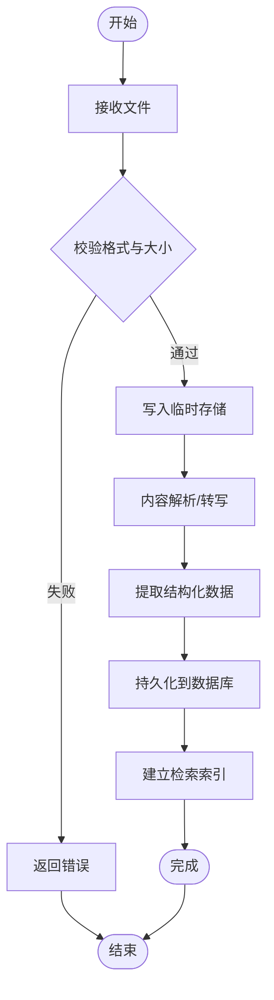
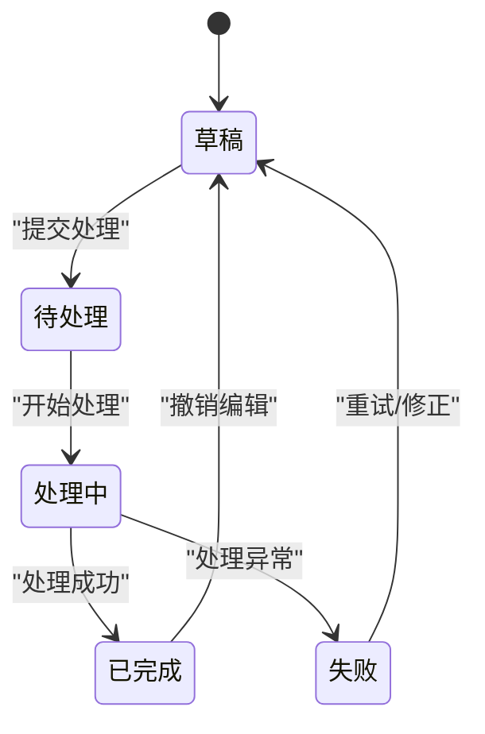
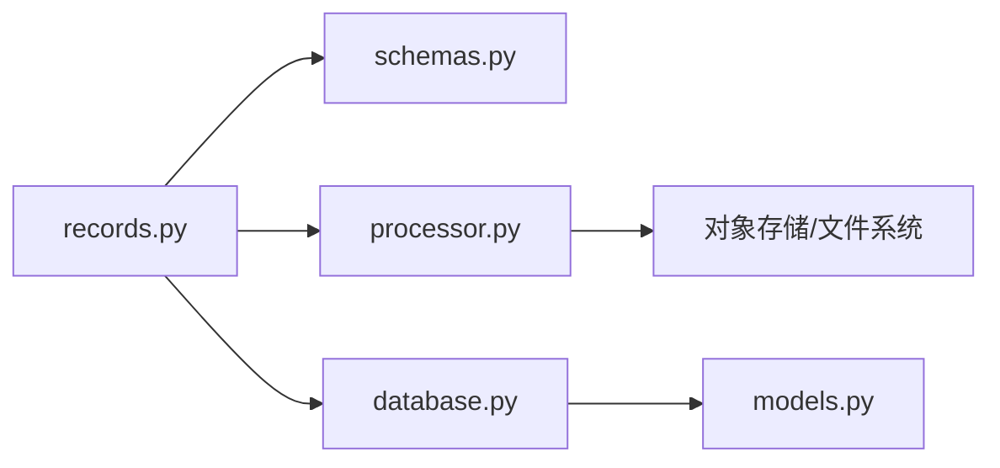

# 记录处理API

<cite>
**本文引用的文件**   
- [backend/routers/records.py](file://backend/routers/records.py)
- [backend/models.py](file://backend/models.py)
- [backend/schemas.py](file://backend/schemas.py)
- [backend/database.py](file://backend/database.py)
- [backend/services/processor.py](file://backend/services/processor.py)
- [backend/main.py](file://backend/main.py)
</cite>

## 目录
1. [简介](#简介)
2. [项目结构](#项目结构)
3. [核心组件](#核心组件)
4. [架构总览](#架构总览)
5. [详细组件分析](#详细组件分析)
6. [依赖关系分析](#依赖关系分析)
7. [性能考虑](#性能考虑)
8. [故障排查指南](#故障排查指南)
9. [结论](#结论)
10. [附录](#附录)

## 简介
本文件为“记录处理API”的完整技术文档，覆盖记录的创建、读取、更新、删除与批量操作接口；详细说明记录的数据结构、字段定义、验证规则与业务逻辑；并包含文件上传处理、内容解析、存储策略与检索功能。文档提供请求/响应示例（以路径与字段说明为主），展示记录的生命周期管理与状态变更流程，帮助开发者快速集成与排障。

## 项目结构
后端采用模块化路由与服务分离的设计：
- 路由层：按功能划分模块，记录相关接口位于 records.py
- 模型与数据访问：models.py 定义ORM模型，database.py 管理连接与会话
- 校验与序列化：schemas.py 使用 Pydantic 进行输入输出校验
- 业务服务：services/processor.py 负责内容解析、转写、摘要等处理
- 应用入口：main.py 注册路由、中间件与全局配置

图表来源
- [backend/main.py](file://backend/main.py)
- [backend/routers/records.py](file://backend/routers/records.py)
- [backend/schemas.py](file://backend/schemas.py)
- [backend/services/processor.py](file://backend/services/processor.py)
- [backend/database.py](file://backend/database.py)
- [backend/models.py](file://backend/models.py)

章节来源
- [backend/main.py](file://backend/main.py)
- [backend/routers/records.py](file://backend/routers/records.py)
- [backend/schemas.py](file://backend/schemas.py)
- [backend/services/processor.py](file://backend/services/processor.py)
- [backend/database.py](file://backend/database.py)
- [backend/models.py](file://backend/models.py)

## 核心组件
- 记录路由（records.py）：暴露 RESTful 接口，处理请求参数校验、调用服务层、返回统一响应
- 数据模型（models.py）：定义记录实体、关联关系与索引
- 数据访问（database.py）：封装会话、事务、分页查询与并发控制
- 校验模式（schemas.py）：定义请求体、查询参数、响应体的字段与约束
- 处理器（services/processor.py）：实现内容解析、转写、摘要、标签提取、去重与合并

章节来源
- [backend/routers/records.py](file://backend/routers/records.py)
- [backend/models.py](file://backend/models.py)
- [backend/database.py](file://backend/database.py)
- [backend/schemas.py](file://backend/schemas.py)
- [backend/services/processor.py](file://backend/services/processor.py)

## 架构总览
记录处理API遵循分层架构：
- 表现层：FastAPI 路由，负责鉴权、参数校验、错误映射
- 领域层：处理器服务，封装业务规则与外部能力（如ASR、NLP）
- 数据层：ORM模型与数据库访问，保证一致性与事务性

图表来源
- [backend/routers/records.py](file://backend/routers/records.py)
- [backend/services/processor.py](file://backend/services/processor.py)
- [backend/database.py](file://backend/database.py)
- [backend/models.py](file://backend/models.py)
- [backend/schemas.py](file://backend/schemas.py)

## 详细组件分析

### 记录数据模型与字段定义
- 记录主键：唯一标识，自增或UUID
- 标题：字符串，非空，长度限制
- 内容：文本或富文本，支持Markdown/HTML
- 类型：枚举（文本、音频、图片、视频、混合）
- 状态：枚举（草稿、待处理、处理中、已完成、失败）
- 来源：字符串（手动、导入、同步、自动抓取）
- 时间戳：创建时间、更新时间、处理完成时间
- 附件：JSON数组，存储文件URL、大小、MIME类型、哈希
- 标签：字符串数组，用于分类与检索
- 摘要：字符串，由处理器生成
- 扩展字段：JSON，预留扩展

章节来源
- [backend/models.py](file://backend/models.py)
- [backend/schemas.py](file://backend/schemas.py)

### 请求与响应校验（schemas.py）
- 创建记录：标题、内容、类型、来源、标签、附件等必填项校验
- 更新记录：部分字段可选，状态变更需符合状态机规则
- 查询参数：分页、排序、过滤（类型、状态、标签、时间范围）、全文搜索
- 响应体：记录对象、分页元数据、错误码与消息

章节来源
- [backend/schemas.py](file://backend/schemas.py)

### 文件上传与内容解析（processor.py）
- 支持格式：文本、音频、图片、视频及常见压缩格式
- 上传流程：分片上传、完整性校验、病毒扫描、临时存储
- 内容解析：OCR、语音转写、图像描述、视频关键帧提取
- 结构化输出：标题、正文、摘要、标签、时间戳、媒体元数据
- 存储策略：原始文件落盘/对象存储，解析结果入库，建立索引

图表来源
- [backend/services/processor.py](file://backend/services/processor.py)
- [backend/schemas.py](file://backend/schemas.py)

### 记录生命周期与状态机
- 初始状态：草稿
- 触发处理：进入待处理/处理中
- 成功完成：标记已完成，生成摘要与标签
- 异常失败：回滚至草稿或失败状态，保留错误日志
- 可撤销：允许从已完成退回草稿（受权限控制）

图表来源
- [backend/routers/records.py](file://backend/routers/records.py)
- [backend/schemas.py](file://backend/schemas.py)

### 接口清单与示例

#### 创建记录
- 方法：POST
- 路径：/api/records
- 请求体：标题、内容、类型、来源、标签、附件
- 响应：记录ID、状态、时间戳、处理任务ID（异步）
- 错误：参数校验失败、文件过大、类型不支持

章节来源
- [backend/routers/records.py](file://backend/routers/records.py)
- [backend/schemas.py](file://backend/schemas.py)

#### 读取记录
- 方法：GET
- 路径：/api/records/{id}
- 响应：记录详情、附件列表、处理状态、摘要
- 错误：记录不存在、权限不足

章节来源
- [backend/routers/records.py](file://backend/routers/records.py)
- [backend/schemas.py](file://backend/schemas.py)

#### 更新记录
- 方法：PUT/PATCH
- 路径：/api/records/{id}
- 请求体：可更新字段（标题、内容、标签、状态等）
- 响应：更新后的记录
- 错误：状态不允许变更、字段冲突

章节来源
- [backend/routers/records.py](file://backend/routers/records.py)
- [backend/schemas.py](file://backend/schemas.py)

#### 删除记录
- 方法：DELETE
- 路径：/api/records/{id}
- 响应：删除确认
- 错误：记录不存在、权限不足

章节来源
- [backend/routers/records.py](file://backend/routers/records.py)
- [backend/schemas.py](file://backend/schemas.py)

#### 批量操作
- 方法：POST
- 路径：/api/records/batch
- 请求体：操作类型（create/update/delete）、记录ID集合、字段映射
- 响应：批量结果统计、失败明细
- 错误：部分失败、权限不足

章节来源
- [backend/routers/records.py](file://backend/routers/records.py)
- [backend/schemas.py](file://backend/schemas.py)

#### 查询与检索
- 方法：GET
- 路径：/api/records
- 查询参数：分页、排序、过滤（类型、状态、标签、时间）、全文搜索
- 响应：记录列表、分页元数据、高亮片段（搜索）
- 错误：参数非法、数据库超时

章节来源
- [backend/routers/records.py](file://backend/routers/records.py)
- [backend/schemas.py](file://backend/schemas.py)

#### 文件上传与解析
- 方法：POST
- 路径：/api/records/{id}/upload
- 请求体：multipart/form-data，文件流
- 响应：上传进度、解析任务ID、预计完成时间
- 错误：格式不支持、大小超限、解析失败

章节来源
- [backend/routers/records.py](file://backend/routers/records.py)
- [backend/services/processor.py](file://backend/services/processor.py)

### 业务逻辑与处理流程
- 创建流程：校验 -> 解析 -> 持久化 -> 索引 -> 通知
- 更新流程：差异校验 -> 状态机检查 -> 增量更新 -> 重新索引
- 删除流程：软删除标记 -> 清理索引 -> 归档
- 批量流程：事务包裹 -> 分批执行 -> 汇总结果

章节来源
- [backend/routers/records.py](file://backend/routers/records.py)
- [backend/services/processor.py](file://backend/services/processor.py)
- [backend/database.py](file://backend/database.py)

## 依赖关系分析
- 路由依赖校验模式（schemas.py）确保输入合法性
- 路由调用处理器服务（processor.py）完成复杂业务
- 路由通过数据库访问（database.py）与ORM模型（models.py）交互
- 处理器可能依赖外部服务（ASR、OCR、NLP）与对象存储

图表来源
- [backend/routers/records.py](file://backend/routers/records.py)
- [backend/schemas.py](file://backend/schemas.py)
- [backend/services/processor.py](file://backend/services/processor.py)
- [backend/database.py](file://backend/database.py)
- [backend/models.py](file://backend/models.py)

章节来源
- [backend/routers/records.py](file://backend/routers/records.py)
- [backend/schemas.py](file://backend/schemas.py)
- [backend/services/processor.py](file://backend/services/processor.py)
- [backend/database.py](file://backend/database.py)
- [backend/models.py](file://backend/models.py)

## 性能考虑
- 分页与游标：避免大结果集一次性加载
- 索引优化：对常用查询字段建立复合索引
- 异步处理：文件解析与转写走队列，减少阻塞
- 缓存策略：热点记录与搜索结果短期缓存
- 连接池：数据库连接复用与限流

[本节为通用指导，不直接分析具体文件]

## 故障排查指南
- 参数校验失败：检查请求体字段类型、必填项、长度限制
- 文件上传失败：确认格式、大小、网络稳定性与临时存储配额
- 解析异常：查看处理器日志、外部服务可用性、资源占用
- 数据库错误：检查连接池、事务锁、慢查询与索引命中
- 状态不一致：核对状态机流转、幂等性设计与重试机制

章节来源
- [backend/routers/records.py](file://backend/routers/records.py)
- [backend/services/processor.py](file://backend/services/processor.py)
- [backend/database.py](file://backend/database.py)

## 结论
记录处理API通过清晰的分层与职责划分，实现了完整的CRUD与批量操作能力，结合文件上传、内容解析与检索功能，满足多样化记录管理需求。建议在生产环境启用异步处理、缓存与监控，以提升稳定性与性能。

[本节为总结性内容，不直接分析具体文件]

## 附录
- 术语表：记录、附件、摘要、标签、状态机、索引
- 最佳实践：幂等设计、错误码规范、审计日志、灰度发布
- 参考实现：路由注册、校验模式、处理器模板、数据库会话管理

[本节为补充信息，不直接分析具体文件]