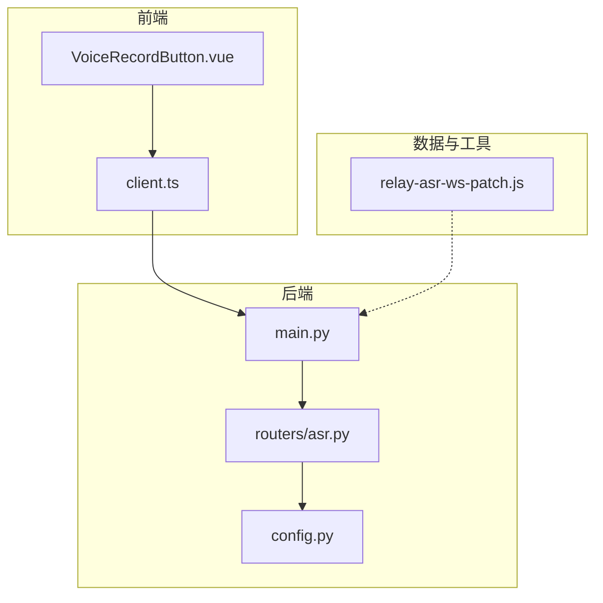
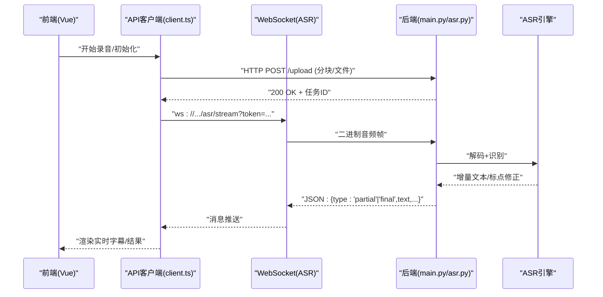
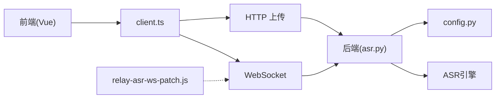

# 语音识别API

<cite>
**本文引用的文件**   
- [backend/main.py](file://backend/main.py)
- [backend/routers/asr.py](file://backend/routers/asr.py)
- [backend/config.py](file://backend/config.py)
- [data/relay-asr-ws-patch.js](file://data/relay-asr-ws-patch.js)
- [frontend/src/components/VoiceRecordButton.vue](file://frontend/src/components/VoiceRecordButton.vue)
- [frontend/src/api/client.ts](file://frontend/src/api/client.ts)
</cite>

## 目录
1. [简介](#简介)
2. [项目结构](#项目结构)
3. [核心组件](#核心组件)
4. [架构总览](#架构总览)
5. [详细组件分析](#详细组件分析)
6. [依赖关系分析](#依赖关系分析)
7. [性能考量](#性能考量)
8. [故障排查指南](#故障排查指南)
9. [结论](#结论)
10. [附录](#附录)

## 简介
本文件为语音识别（ASR）API 的完整技术文档，覆盖以下能力与要求：
- 音频文件上传接口
- 实时语音流处理（WebSocket）
- 转录结果返回机制
- 支持的音频格式、采样率、编码标准与传输协议
- WebSocket 连接管理、实时数据传输、错误重试机制与性能监控
- 前端录音与后端处理的集成示例说明

## 项目结构
本项目采用前后端分离架构：
- 后端使用 Python Web 框架提供 REST 与 WebSocket 接口
- 前端基于 Vue 实现录音与实时交互界面
- 数据层包含 ASR 路由、配置、模型与数据库等模块
- 辅助脚本用于 WebSocket 中继与补丁

图表来源
- [backend/main.py](file://backend/main.py)
- [backend/routers/asr.py](file://backend/routers/asr.py)
- [backend/config.py](file://backend/config.py)
- [data/relay-asr-ws-patch.js](file://data/relay-asr-ws-patch.js)
- [frontend/src/components/VoiceRecordButton.vue](file://frontend/src/components/VoiceRecordButton.vue)
- [frontend/src/api/client.ts](file://frontend/src/api/client.ts)

章节来源
- [backend/main.py](file://backend/main.py)
- [backend/routers/asr.py](file://backend/routers/asr.py)
- [backend/config.py](file://backend/config.py)
- [data/relay-asr-ws-patch.js](file://data/relay-asr-ws-patch.js)
- [frontend/src/components/VoiceRecordButton.vue](file://frontend/src/components/VoiceRecordButton.vue)
- [frontend/src/api/client.ts](file://frontend/src/api/client.ts)

## 核心组件
- 后端主应用入口：负责注册路由、中间件、生命周期事件与全局配置
- ASR 路由：定义文件上传与 WebSocket 实时转写接口
- 配置模块：集中管理端口、CORS、日志、限流、队列与外部服务地址
- 前端录音组件：封装浏览器 MediaRecorder 与分片上传逻辑
- 前端 API 客户端：统一封装 HTTP 与 WebSocket 调用
- WebSocket 中继脚本：用于转发或调试实时流

章节来源
- [backend/main.py](file://backend/main.py)
- [backend/routers/asr.py](file://backend/routers/asr.py)
- [backend/config.py](file://backend/config.py)
- [frontend/src/components/VoiceRecordButton.vue](file://frontend/src/components/VoiceRecordButton.vue)
- [frontend/src/api/client.ts](file://frontend/src/api/client.ts)
- [data/relay-asr-ws-patch.js](file://data/relay-asr-ws-patch.js)

## 架构总览
整体流程包括：
- 前端通过 MediaRecorder 采集音频并分片发送
- 后端通过 REST 接口接收文件上传，或通过 WebSocket 接收实时帧
- 后端将音频送入 ASR 引擎进行解码与识别
- 识别结果以增量文本或最终结果的形式回传前端
- 可选的中继脚本用于代理或调试

图表来源
- [backend/main.py](file://backend/main.py)
- [backend/routers/asr.py](file://backend/routers/asr.py)
- [frontend/src/api/client.ts](file://frontend/src/api/client.ts)
- [frontend/src/components/VoiceRecordButton.vue](file://frontend/src/components/VoiceRecordButton.vue)

## 详细组件分析

### 后端主应用（main.py）
职责：
- 启动 Web 服务器，挂载路由与中间件
- 加载配置、初始化日志、CORS、限流与健康检查
- 暴露健康状态与系统指标，便于监控

关键点：
- 路由注册：ASR 相关路由由 asr.py 提供
- 生命周期：启动时校验配置，关闭时释放资源
- 可观测性：暴露健康端点与指标收集钩子

章节来源
- [backend/main.py](file://backend/main.py)

### ASR 路由（routers/asr.py）
职责：
- 定义文件上传接口（REST）
- 定义实时转写接口（WebSocket）
- 校验音频参数、鉴权与会话管理
- 调度识别任务与结果回推

接口约定（建议）：
- 文件上传
  - 路径：POST /api/asr/upload
  - 内容类型：multipart/form-data
  - 字段：audio(file), language(string), model(string), sample_rate(int, 可选)
  - 响应：{task_id, status}
- 实时转写
  - 路径：WS /api/asr/stream
  - 查询参数：token(string), language(string), model(string)
  - 消息方向：
    - 客户端→服务端：二进制音频帧（PCM/Opus/FLAC），或控制消息（start/stop/reset）
    - 服务端→客户端：JSON 文本片段（partial/final）、状态码、错误信息

音频格式与编码（建议）：
- 支持格式：PCM（16bit）、Opus、FLAC、WAV（无压缩）
- 采样率：16kHz（推荐）、48kHz（高保真）
- 声道：单声道（mono）
- 帧大小：10–60ms（例如 16000Hz 下 160–960 样本）
- 传输协议：
  - REST：HTTPS + multipart/form-data
  - 实时：WSS（生产环境强制加密）

章节来源
- [backend/routers/asr.py](file://backend/routers/asr.py)

### 配置模块（config.py）
职责：
- 集中管理运行参数：端口、CORS、日志级别、限流策略
- 外部服务地址：ASR 引擎、对象存储、消息队列
- 运行时开关：是否启用中继、是否开启调试模式

关键项（示例）：
- 服务：host、port、debug、log_level
- 安全：cors_origins、auth_token_prefix
- ASR：engine_url、model_name、sample_rate_default、chunk_ms
- 队列：broker_url、queue_name、max_retries
- 监控：metrics_enabled、tracing_endpoint

章节来源
- [backend/config.py](file://backend/config.py)

### 前端录音组件（VoiceRecordButton.vue）
职责：
- 调用浏览器媒体接口采集音频
- 按帧分片并选择合适编码（PCM/Opus）
- 通过 REST 上传文件或通过 WebSocket 推送实时帧
- 展示实时转写文本与最终结果

要点：
- 权限申请与兼容性检测
- 动态切换采样率与编码
- 断线重连与退避重试
- 节流与背压控制，避免阻塞 UI

章节来源
- [frontend/src/components/VoiceRecordButton.vue](file://frontend/src/components/VoiceRecordButton.vue)

### 前端 API 客户端（client.ts）
职责：
- 统一封装 HTTP 请求（文件上传、状态查询）
- 封装 WebSocket 连接、心跳、重连与消息编解码
- 错误分类与重试策略（网络错误、鉴权失败、服务过载）

要点：
- 连接建立前鉴权 token 注入
- 心跳包维持长连接
- 错误码映射与用户提示
- 可插拔的拦截器（日志、埋点）

章节来源
- [frontend/src/api/client.ts](file://frontend/src/api/client.ts)

### WebSocket 中继脚本（relay-asr-ws-patch.js）
用途：
- 本地调试时转发 WSS 到本地 ASR 服务
- 记录/回放消息，辅助定位问题
- 在受限网络环境下做代理与缓存

注意：
- 仅用于开发/测试，生产环境应直连后端
- 需保证消息顺序与时间戳一致性

章节来源
- [data/relay-asr-ws-patch.js](file://data/relay-asr-ws-patch.js)

## 依赖关系分析
- 前端依赖浏览器媒体 API 与 WebSocket
- 后端依赖 Web 框架、ASR 引擎 SDK、对象存储与消息队列
- 中继脚本依赖 Node.js 运行时与 WebSocket 库

图表来源
- [frontend/src/api/client.ts](file://frontend/src/api/client.ts)
- [backend/routers/asr.py](file://backend/routers/asr.py)
- [backend/config.py](file://backend/config.py)
- [data/relay-asr-ws-patch.js](file://data/relay-asr-ws-patch.js)

章节来源
- [frontend/src/api/client.ts](file://frontend/src/api/client.ts)
- [backend/routers/asr.py](file://backend/routers/asr.py)
- [backend/config.py](file://backend/config.py)
- [data/relay-asr-ws-patch.js](file://data/relay-asr-ws-patch.js)

## 性能考量
- 音频分片大小：10–60ms 平衡延迟与开销
- 编码选择：Opus 在带宽受限场景更优；PCM 适合低延迟内网
- 采样率：16kHz 满足大多数对话场景；48kHz 用于高保真
- 并发与队列：异步处理识别任务，避免阻塞 I/O
- 背压与限流：客户端根据服务端负载调整发送速率
- 缓存与去重：对短静音段进行合并，减少无效帧
- 监控指标：QPS、P95/P99 延迟、丢帧率、错误率、GPU/CPU 利用率

[本节为通用指导，不直接分析具体文件]

## 故障排查指南
常见问题与处理：
- 连接失败
  - 检查 CORS、TLS 证书、防火墙与代理设置
  - 确认 token 有效且未过期
- 音频无法识别
  - 校验采样率、编码与帧大小是否符合约定
  - 检查输入设备权限与浏览器兼容性
- 实时文本不更新
  - 检查心跳与重连逻辑
  - 查看服务端日志与队列堆积情况
- 性能抖动
  - 观察 CPU/GPU 使用率与内存占用
  - 调整分片大小与并发度

章节来源
- [backend/routers/asr.py](file://backend/routers/asr.py)
- [frontend/src/api/client.ts](file://frontend/src/api/client.ts)
- [data/relay-asr-ws-patch.js](file://data/relay-asr-ws-patch.js)

## 结论
本方案通过 REST 与 WebSocket 双通道提供稳定高效的语音识别能力。前端负责高质量采集与可靠传输，后端负责解析、识别与结果回推。配合配置化与可观测性设计，可在不同网络与设备条件下获得一致的体验。建议在生产环境启用 WSS、限流与监控，确保稳定性与可维护性。

[本节为总结性内容，不直接分析具体文件]

## 附录

### 集成示例（前端录音与后端对接）
- 步骤概览
  - 初始化：获取麦克风权限，选择采样率与编码
  - 录制：按帧捕获音频，生成二进制帧
  - 上传：REST 上传整文件或分块；或建立 WebSocket 实时推送
  - 接收：订阅 partial/final 文本，渲染到 UI
  - 结束：发送 stop 控制消息，清理资源
- 注意事项
  - 错误重试：指数退避与最大重试次数
  - 断线恢复：自动重连与状态同步
  - 隐私合规：本地处理优先，必要时脱敏上传

章节来源
- [frontend/src/components/VoiceRecordButton.vue](file://frontend/src/components/VoiceRecordButton.vue)
- [frontend/src/api/client.ts](file://frontend/src/api/client.ts)
- [backend/routers/asr.py](file://backend/routers/asr.py)