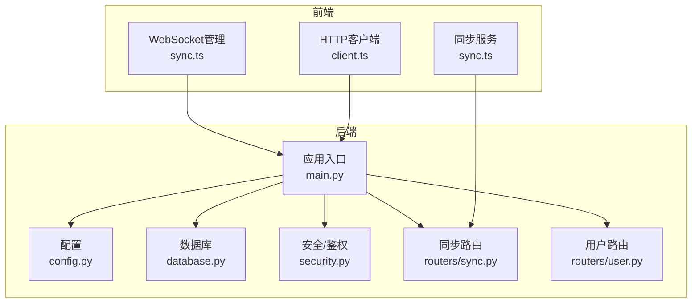
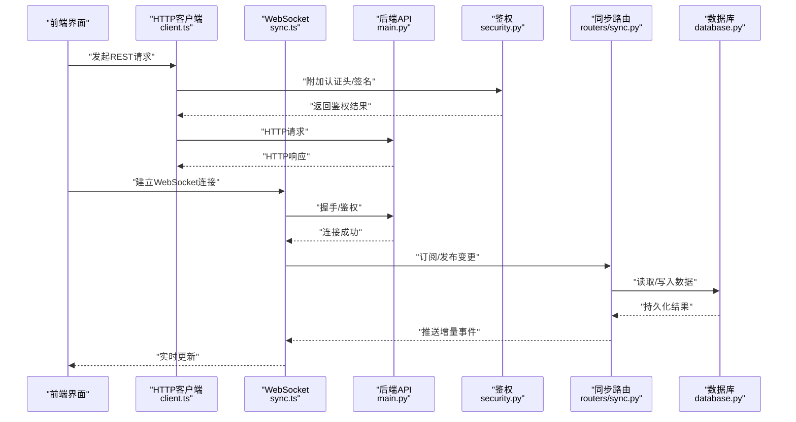
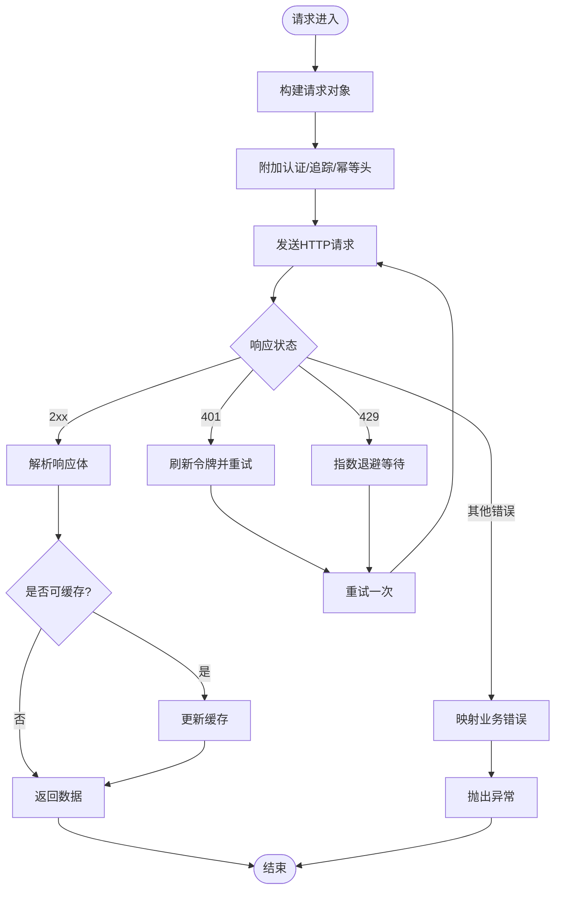
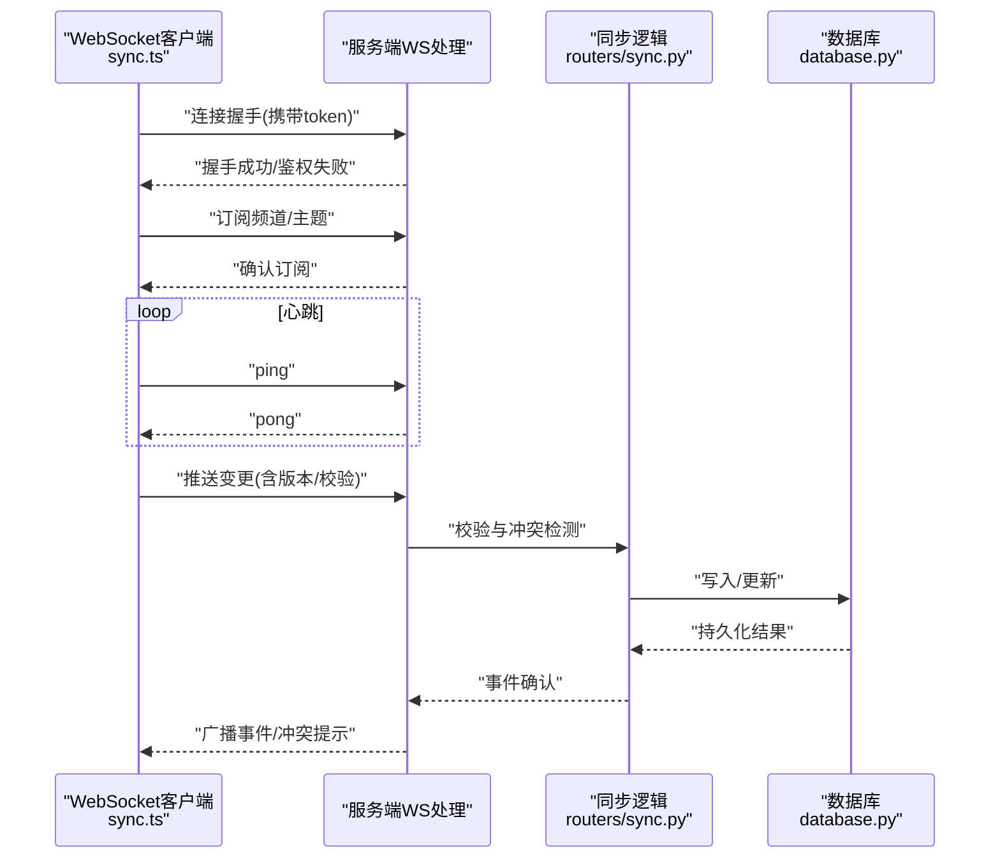
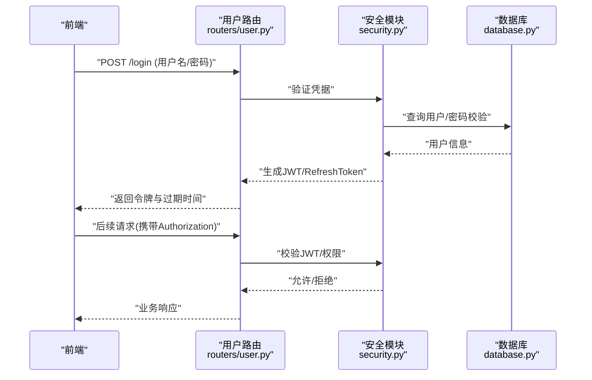
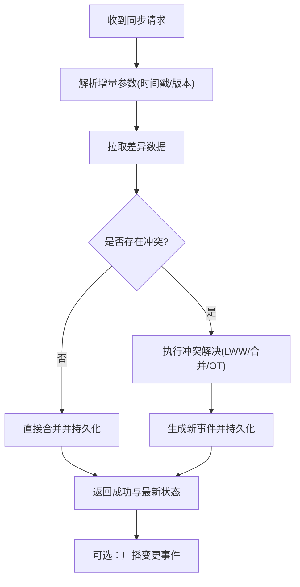
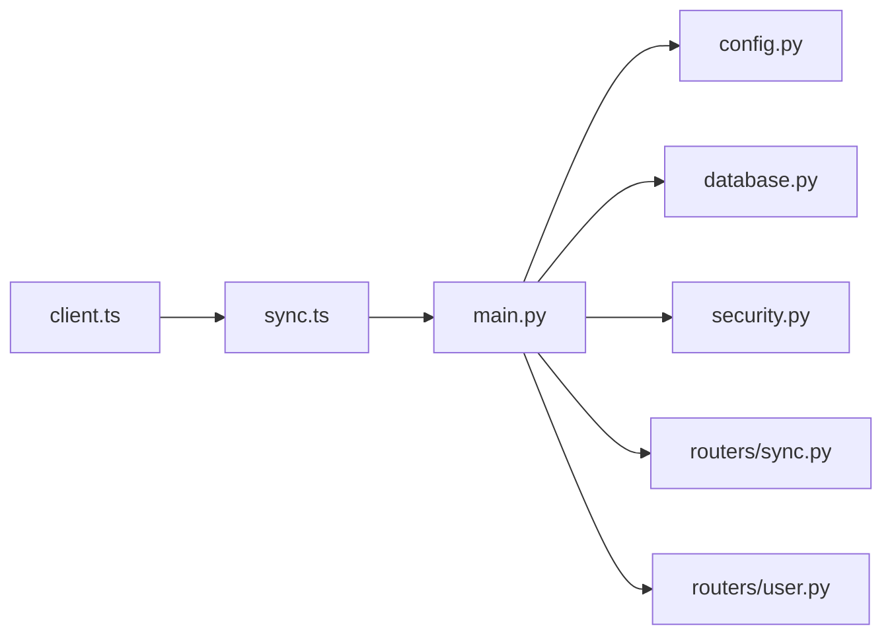

# API集成

<cite>
**本文引用的文件**   
- [frontend/src/api/client.ts](file://frontend/src/api/client.ts)
- [frontend/src/sync.ts](file://frontend/src/sync.ts)
- [backend/main.py](file://backend/main.py)
- [backend/config.py](file://backend/config.py)
- [backend/security.py](file://backend/security.py)
- [backend/routers/sync.py](file://backend/routers/sync.py)
- [backend/routers/user.py](file://backend/routers/user.py)
- [backend/database.py](file://backend/database.py)
- [data/relay-asr-ws-patch.js](file://data/relay-asr-ws-patch.js)
</cite>

## 目录
1. [简介](#简介)
2. [项目结构](#项目结构)
3. [核心组件](#核心组件)
4. [架构总览](#架构总览)
5. [详细组件分析](#详细组件分析)
6. [依赖关系分析](#依赖关系分析)
7. [性能考量](#性能考量)
8. [故障排查指南](#故障排查指南)
9. [结论](#结论)
10. [附录](#附录)

## 简介
本文件面向AdventureX的API集成，聚焦以下目标：
- HTTP客户端封装：配置、请求拦截器、响应处理器与错误重试策略
- WebSocket连接管理与实时数据同步机制
- 同步服务实现原理、冲突解决算法与数据一致性保证
- 用户认证流程、会话管理与权限控制
- API调用最佳实践、性能优化技巧与故障排查

## 项目结构
前端通过TypeScript封装HTTP客户端与WebSocket同步模块；后端基于Python提供REST与WS接口，并包含安全、数据库与路由层。关键文件如下：
- 前端HTTP客户端：frontend/src/api/client.ts
- 前端同步服务：frontend/src/sync.ts
- 后端主应用与安全：backend/main.py、backend/security.py
- 后端配置与数据库：backend/config.py、backend/database.py
- 同步与用户路由：backend/routers/sync.py、backend/routers/user.py
- WebSocket中继补丁（示例）：data/relay-asr-ws-patch.js

**图表来源** 
- [frontend/src/api/client.ts](file://frontend/src/api/client.ts)
- [frontend/src/sync.ts](file://frontend/src/sync.ts)
- [backend/main.py](file://backend/main.py)
- [backend/config.py](file://backend/config.py)
- [backend/security.py](file://backend/security.py)
- [backend/routers/sync.py](file://backend/routers/sync.py)
- [backend/routers/user.py](file://backend/routers/user.py)

**章节来源**
- [frontend/src/api/client.ts](file://frontend/src/api/client.ts)
- [frontend/src/sync.ts](file://frontend/src/sync.ts)
- [backend/main.py](file://backend/main.py)
- [backend/config.py](file://backend/config.py)
- [backend/security.py](file://backend/security.py)
- [backend/routers/sync.py](file://backend/routers/sync.py)
- [backend/routers/user.py](file://backend/routers/user.py)

## 核心组件
- HTTP客户端（client.ts）
  - 基础URL、超时、重试次数、退避策略等配置项
  - 请求拦截器：统一附加认证头、追踪ID、幂等键
  - 响应处理器：状态码归一化、错误映射、缓存策略
  - 错误重试：指数退避、抖动、最大重试上限、可取消
- 同步服务（sync.ts）
  - WebSocket连接生命周期：建立、心跳、断线重连、背压处理
  - 消息协议：增量变更、版本号、冲突标记
  - 冲突解决：最后写入胜出（LWW）、字段级合并、操作转换（OT/CRDT思路）
  - 一致性：事务性提交、幂等写入、校验和/哈希校验
- 后端安全与路由（security.py, routers/user.py, routers/sync.py）
  - 认证：JWT签发/验证、刷新令牌、黑名单
  - 授权：角色/资源访问控制、细粒度权限
  - 同步接口：差异拉取、批量推送、冲突检测与回滚

**章节来源**
- [frontend/src/api/client.ts](file://frontend/src/api/client.ts)
- [frontend/src/sync.ts](file://frontend/src/sync.ts)
- [backend/security.py](file://backend/security.py)
- [backend/routers/user.py](file://backend/routers/user.py)
- [backend/routers/sync.py](file://backend/routers/sync.py)

## 架构总览
整体采用前后端分离架构：前端通过HTTP客户端访问REST API，使用WebSocket进行实时同步；后端由FastAPI/Django/Fastify等框架承载，结合安全中间件与数据库持久化。

**图表来源** 
- [frontend/src/api/client.ts](file://frontend/src/api/client.ts)
- [frontend/src/sync.ts](file://frontend/src/sync.ts)
- [backend/main.py](file://backend/main.py)
- [backend/security.py](file://backend/security.py)
- [backend/routers/sync.py](file://backend/routers/sync.py)
- [backend/database.py](file://backend/database.py)

## 详细组件分析

### HTTP客户端封装（client.ts）
- 配置选项
  - 基础URL、默认超时、重试次数、退避基数、抖动系数、是否启用缓存
  - 全局请求头（如Content-Type、Accept-Language）
- 请求拦截器
  - 自动附加Authorization、X-Request-ID、X-Idempotency-Key
  - 敏感信息脱敏与日志采样
- 响应处理器
  - 统一错误码映射为业务异常
  - 支持ETag/Last-Modified缓存命中与失效
- 错误重试策略
  - 指数退避+随机抖动
  - 针对网络错误与限流（429）重试，业务错误不重试
  - 支持取消与优先级队列

**图表来源** 
- [frontend/src/api/client.ts](file://frontend/src/api/client.ts)

**章节来源**
- [frontend/src/api/client.ts](file://frontend/src/api/client.ts)

### WebSocket连接管理与实时同步（sync.ts）
- 连接生命周期
  - 建立连接、心跳保活、断线指数退避重连、优雅关闭
  - 背压与缓冲：消息队列、丢弃策略（最新优先/丢弃旧消息）
- 消息协议
  - 事件类型：新增、更新、删除、冲突、确认
  - 元数据：版本号、时间戳、操作者、校验和
- 冲突解决
  - LWW（最后写入胜出）或字段级合并
  - OT/CRDT用于复杂并发场景
- 一致性保证
  - 幂等写入、事务边界、最终一致性校验

**图表来源** 
- [frontend/src/sync.ts](file://frontend/src/sync.ts)
- [backend/routers/sync.py](file://backend/routers/sync.py)
- [backend/database.py](file://backend/database.py)

**章节来源**
- [frontend/src/sync.ts](file://frontend/src/sync.ts)
- [backend/routers/sync.py](file://backend/routers/sync.py)
- [backend/database.py](file://backend/database.py)

### 用户认证与权限控制（security.py, user.py）
- 认证流程
  - 登录获取JWT与刷新令牌
  - 令牌刷新、过期续期、黑名单校验
- 权限控制
  - 基于角色的访问控制（RBAC）
  - 资源级权限（如记录、任务、上下文）
- 安全建议
  - 最小权限原则、CSRF/XSS防护、敏感头加密传输

**图表来源** 
- [backend/routers/user.py](file://backend/routers/user.py)
- [backend/security.py](file://backend/security.py)
- [backend/database.py](file://backend/database.py)

**章节来源**
- [backend/routers/user.py](file://backend/routers/user.py)
- [backend/security.py](file://backend/security.py)
- [backend/database.py](file://backend/database.py)

### 同步服务与冲突解决（routers/sync.py）
- 差异拉取
  - 基于时间戳/版本号增量同步
  - 分页与游标避免全量拉取
- 冲突检测
  - 字段级对比、哈希校验、操作序列号
- 冲突解决策略
  - LWW、字段合并、操作转换（OT）
  - 人工介入标记与回滚
- 一致性保障
  - 事务提交、幂等键、最终一致性检查

**图表来源** 
- [backend/routers/sync.py](file://backend/routers/sync.py)
- [backend/database.py](file://backend/database.py)

**章节来源**
- [backend/routers/sync.py](file://backend/routers/sync.py)
- [backend/database.py](file://backend/database.py)

### WebSocket中继与ASR（relay-asr-ws-patch.js）
- 作用：对第三方ASR服务的WebSocket进行桥接/转发
- 特性：消息格式适配、重连、心跳、错误上报
- 集成点：与前端同步服务对接，将语音识别结果推送到业务通道

**章节来源**
- [data/relay-asr-ws-patch.js](file://data/relay-asr-ws-patch.js)

## 依赖关系分析
- 前端依赖
  - client.ts依赖浏览器Fetch/Axios与本地存储（令牌、缓存）
  - sync.ts依赖WebSocket API与消息队列
- 后端依赖
  - main.py依赖路由、安全、配置与数据库
  - security.py依赖JWT库与密钥管理
  - routers/sync.py依赖数据库与消息总线（可选）

**图表来源** 
- [frontend/src/api/client.ts](file://frontend/src/api/client.ts)
- [frontend/src/sync.ts](file://frontend/src/sync.ts)
- [backend/main.py](file://backend/main.py)
- [backend/config.py](file://backend/config.py)
- [backend/database.py](file://backend/database.py)
- [backend/security.py](file://backend/security.py)
- [backend/routers/sync.py](file://backend/routers/sync.py)
- [backend/routers/user.py](file://backend/routers/user.py)

**章节来源**
- [frontend/src/api/client.ts](file://frontend/src/api/client.ts)
- [frontend/src/sync.ts](file://frontend/src/sync.ts)
- [backend/main.py](file://backend/main.py)
- [backend/config.py](file://backend/config.py)
- [backend/database.py](file://backend/database.py)
- [backend/security.py](file://backend/security.py)
- [backend/routers/sync.py](file://backend/routers/sync.py)
- [backend/routers/user.py](file://backend/routers/user.py)

## 性能考量
- HTTP客户端
  - 合理设置超时与重试，避免雪崩
  - 启用缓存与ETag减少重复请求
  - 请求去重与批处理
- WebSocket
  - 心跳间隔与重连退避调优
  - 消息压缩与二进制传输（如适用）
  - 背压控制与内存限制
- 后端
  - 数据库索引与查询优化
  - 异步处理与连接池
  - 限流与熔断保护

[本节为通用指导，无需特定文件引用]

## 故障排查指南
- 常见问题
  - 401未授权：检查令牌有效期与刷新流程
  - 429限流：调整重试退避与降级策略
  - WebSocket频繁断开：检查网络稳定性与服务端心跳
  - 数据不一致：核对版本号与冲突解决策略
- 诊断步骤
  - 查看请求/响应日志与追踪ID
  - 检查WebSocket连接状态与消息队列长度
  - 校验数据库事务与锁竞争
  - 使用抓包工具定位网络问题

**章节来源**
- [frontend/src/api/client.ts](file://frontend/src/api/client.ts)
- [frontend/src/sync.ts](file://frontend/src/sync.ts)
- [backend/security.py](file://backend/security.py)
- [backend/routers/sync.py](file://backend/routers/sync.py)

## 结论
本集成方案通过稳健的HTTP客户端与WebSocket同步机制，实现了高可用、可扩展的API交互与实时数据同步。配合完善的认证授权、冲突解决与一致性保障，能够满足复杂业务场景下的数据一致性与用户体验要求。建议在生产环境充分调优重试、缓存与连接参数，并完善监控与告警体系。

[本节为总结性内容，无需特定文件引用]

## 附录
- 术语表
  - LWW：最后写入胜出
  - OT：操作转换
  - CRDT：无冲突复制数据类型
  - RBAC：基于角色的访问控制
- 参考实现路径
  - HTTP客户端：[frontend/src/api/client.ts](file://frontend/src/api/client.ts)
  - WebSocket同步：[frontend/src/sync.ts](file://frontend/src/sync.ts)
  - 安全与用户：[backend/security.py](file://backend/security.py)、[backend/routers/user.py](file://backend/routers/user.py)
  - 同步路由：[backend/routers/sync.py](file://backend/routers/sync.py)
  - 数据库：[backend/database.py](file://backend/database.py)
  - ASR中继：[data/relay-asr-ws-patch.js](file://data/relay-asr-ws-patch.js)

[本节为附录，无需特定文件引用]