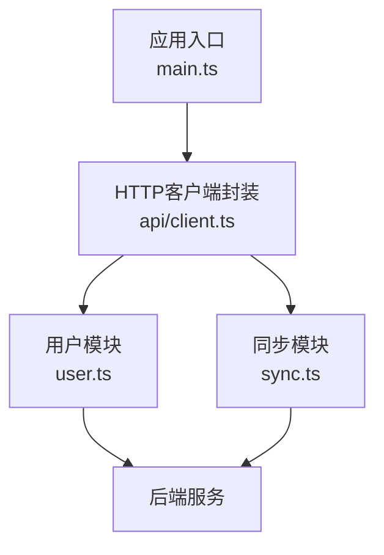
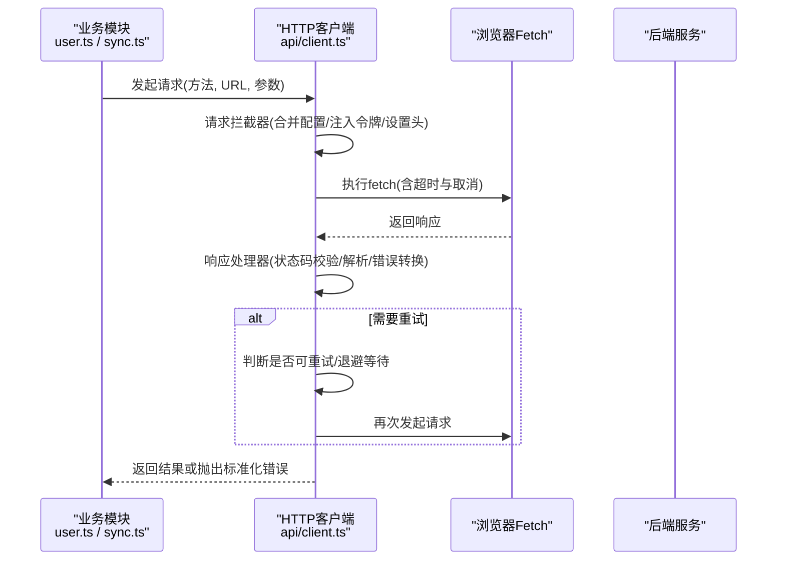
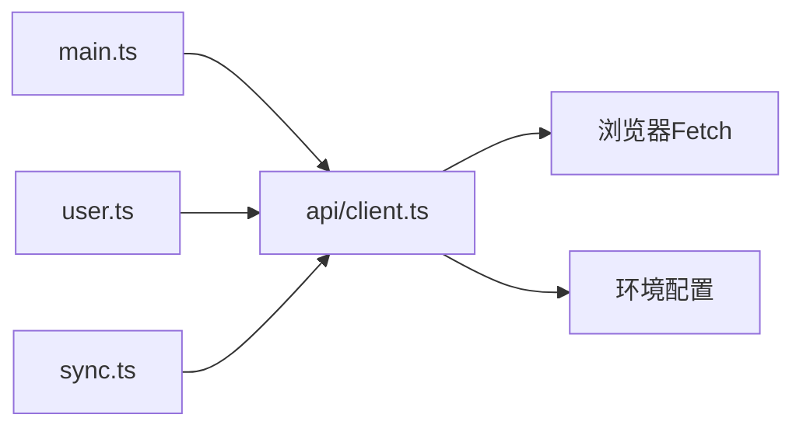

# HTTP客户端封装

<cite>
**本文引用的文件**   
- [frontend/src/api/client.ts](file://frontend/src/api/client.ts)
- [frontend/src/main.ts](file://frontend/src/main.ts)
- [frontend/src/user.ts](file://frontend/src/user.ts)
- [frontend/src/sync.ts](file://frontend/src/sync.ts)
- [frontend/package.json](file://frontend/package.json)
</cite>

## 目录
1. [简介](#简介)
2. [项目结构](#项目结构)
3. [核心组件](#核心组件)
4. [架构总览](#架构总览)
5. [详细组件分析](#详细组件分析)
6. [依赖关系分析](#依赖关系分析)
7. [性能考虑](#性能考虑)
8. [故障排查指南](#故障排查指南)
9. [结论](#结论)
10. [附录](#附录)

## 简介
本文件面向AdventureX前端工程中的HTTP客户端封装，围绕基于Fetch API的HTTP请求能力进行系统化说明。内容涵盖：
- 请求拦截器与响应处理器
- 错误重试机制与超时配置
- 基础URL、请求头设置、认证令牌管理与CORS处理
- 请求取消、缓存策略与性能优化技巧
- 完整的API调用示例（GET、POST、PUT、DELETE）
- 错误处理策略、网络异常恢复与降级方案

该文档旨在帮助开发者快速理解并正确使用HTTP客户端，同时提供可操作的排错与优化建议。

## 项目结构
HTTP客户端位于前端工程的src/api目录下，被应用入口与各业务模块引用。典型调用路径包括：
- 应用初始化时加载环境配置与全局设置
- 用户相关接口通过client封装发起请求
- 同步任务通过client封装进行数据交互

图表来源
- [frontend/src/main.ts](file://frontend/src/main.ts)
- [frontend/src/api/client.ts](file://frontend/src/api/client.ts)
- [frontend/src/user.ts](file://frontend/src/user.ts)
- [frontend/src/sync.ts](file://frontend/src/sync.ts)

章节来源
- [frontend/src/api/client.ts](file://frontend/src/api/client.ts)
- [frontend/src/main.ts](file://frontend/src/main.ts)
- [frontend/src/user.ts](file://frontend/src/user.ts)
- [frontend/src/sync.ts](file://frontend/src/sync.ts)

## 核心组件
- 基础URL与默认配置：集中管理API基础地址、默认请求头、超时时间等
- 请求拦截器：在发送前统一注入认证令牌、追踪ID、内容类型等
- 响应处理器：统一解析响应体、处理状态码、转换错误为标准化错误对象
- 重试机制：对可重试错误（如网络抖动、服务端5xx）进行指数退避重试
- 取消支持：基于AbortController实现请求取消
- 缓存策略：针对幂等GET请求提供可选的内存缓存与失效策略
- 错误处理与降级：区分网络错误、超时、业务错误，提供降级返回或提示

章节来源
- [frontend/src/api/client.ts](file://frontend/src/api/client.ts)

## 架构总览
下图展示了从业务模块到HTTP客户端再到后端的整体流程，包含拦截器、处理器、重试与取消的关键节点。

图表来源
- [frontend/src/api/client.ts](file://frontend/src/api/client.ts)
- [frontend/src/user.ts](file://frontend/src/user.ts)
- [frontend/src/sync.ts](file://frontend/src/sync.ts)

## 详细组件分析

### 基础URL与默认配置
- 基础URL：通过环境变量或配置文件集中设置，便于多环境切换
- 默认请求头：Content-Type、Accept、语言偏好等
- 超时：为所有请求设置统一的超时阈值，避免长时间挂起
- CORS：确保跨域请求的预检与凭据传递正确配置

章节来源
- [frontend/src/api/client.ts](file://frontend/src/api/client.ts)

### 请求拦截器
- 合并用户传入的配置与默认配置
- 注入认证令牌（如Authorization头），支持令牌刷新逻辑
- 添加通用请求头（如追踪ID、版本信息）
- 序列化请求体（JSON）与参数编码（查询串）

章节来源
- [frontend/src/api/client.ts](file://frontend/src/api/client.ts)

### 响应处理器
- 根据HTTP状态码分支处理成功与失败
- 解析响应体（JSON/文本/二进制），统一转换为业务可用结构
- 将非标准错误转换为标准化错误对象，包含错误码、消息与上下文
- 记录必要的日志用于问题定位

章节来源
- [frontend/src/api/client.ts](file://frontend/src/api/client.ts)

### 错误重试机制
- 可重试条件：网络错误、超时、服务端5xx
- 退避策略：指数退避+抖动，限制最大重试次数
- 幂等性检查：仅对幂等方法（GET/HEAD/OPTIONS/PUT/DELETE）启用自动重试
- 取消优先：若请求已取消则跳过重试

章节来源
- [frontend/src/api/client.ts](file://frontend/src/api/client.ts)

### 超时与取消
- 超时：使用AbortController设置超时，触发AbortError
- 取消：暴露取消函数供上层在组件卸载或用户操作时调用
- 资源清理：确保监听器与定时器在取消时释放

章节来源
- [frontend/src/api/client.ts](file://frontend/src/api/client.ts)

### 缓存策略
- 适用场景：幂等GET请求且数据时效性允许
- 缓存键：由URL与查询参数生成稳定键
- 失效策略：按时间TTL或手动失效；支持按需刷新
- 并发控制：同一键的重复请求合并为一次网络请求

章节来源
- [frontend/src/api/client.ts](file://frontend/src/api/client.ts)

### 认证令牌管理
- 令牌注入：在请求拦截器中附加Authorization头
- 令牌刷新：当收到401时尝试刷新令牌并重试一次
- 安全存储：建议使用安全的本地存储或内存变量，避免泄露

章节来源
- [frontend/src/api/client.ts](file://frontend/src/api/client.ts)

### CORS处理
- 预检请求：确保OPTIONS响应头正确
- 凭据：如需携带Cookie或授权头，需服务端允许指定Origin与Credentials
- 调试：利用浏览器开发者工具检查预检与实际请求头

章节来源
- [frontend/src/api/client.ts](file://frontend/src/api/client.ts)

### API调用示例（概念说明）
- GET：获取列表或详情，可启用缓存与超时
- POST：提交表单或创建资源，注意请求体序列化与错误映射
- PUT：更新资源，幂等性保证与冲突处理
- DELETE：删除资源，确认与失败回滚策略

章节来源
- [frontend/src/user.ts](file://frontend/src/user.ts)
- [frontend/src/sync.ts](file://frontend/src/sync.ts)

### 错误处理策略与降级方案
- 分类：网络错误、超时、业务错误、权限错误
- 降级：离线或弱网下返回缓存数据或友好提示
- 反馈：向用户展示可读的错误信息，并提供重试入口
- 监控：上报关键错误与耗时，辅助定位问题

章节来源
- [frontend/src/api/client.ts](file://frontend/src/api/client.ts)

## 依赖关系分析
HTTP客户端作为基础设施被多个业务模块依赖，形成清晰的单向依赖关系。

图表来源
- [frontend/src/main.ts](file://frontend/src/main.ts)
- [frontend/src/api/client.ts](file://frontend/src/api/client.ts)
- [frontend/src/user.ts](file://frontend/src/user.ts)
- [frontend/src/sync.ts](file://frontend/src/sync.ts)

章节来源
- [frontend/src/api/client.ts](file://frontend/src/api/client.ts)
- [frontend/src/user.ts](file://frontend/src/user.ts)
- [frontend/src/sync.ts](file://frontend/src/sync.ts)

## 性能考虑
- 合理设置超时与重试次数，避免雪崩效应
- 对高频GET请求启用缓存，减少网络开销
- 合并重复请求，降低并发压力
- 压缩与分页：服务端配合Gzip/分页，客户端按需加载
- 监控与度量：统计成功率、延迟分布与错误率

[本节为通用指导，不直接分析具体文件]

## 故障排查指南
- 常见问题
  - 401未授权：检查令牌是否存在与有效期，确认刷新逻辑
  - CORS错误：核对预检响应头与允许的Origin/Credentials
  - 超时频繁：检查网络质量与服务端响应时间，调整超时阈值
  - 重复请求：确认缓存键唯一性与并发合并是否生效
- 诊断步骤
  - 打开浏览器开发者工具，查看Network面板的请求与响应
  - 检查控制台错误堆栈与自定义错误对象
  - 验证环境变量与基础URL是否正确
- 修复建议
  - 修正请求头与凭据配置
  - 增加重试与退避策略
  - 完善错误提示与降级逻辑

章节来源
- [frontend/src/api/client.ts](file://frontend/src/api/client.ts)

## 结论
通过对HTTP客户端的拦截器、处理器、重试、超时、取消、缓存与认证的统一封装，AdventureX在前端侧获得了稳定、高效且易用的网络层能力。结合合理的错误处理与降级策略，可在复杂网络环境下保持良好用户体验。建议在业务模块中遵循幂等性与缓存最佳实践，持续监控与优化网络性能。

[本节为总结性内容，不直接分析具体文件]

## 附录
- 配置项参考
  - 基础URL：用于拼接相对路径
  - 默认请求头：Content-Type、Accept、语言等
  - 超时时间：毫秒单位
  - 重试次数与退避策略：最大重试次数、初始间隔、抖动范围
  - 缓存TTL与失效策略：秒级或事件驱动失效
- 集成要点
  - 在应用入口初始化客户端与环境配置
  - 在各业务模块中通过client封装发起请求
  - 统一捕获与展示错误信息

章节来源
- [frontend/src/main.ts](file://frontend/src/main.ts)
- [frontend/src/api/client.ts](file://frontend/src/api/client.ts)
- [frontend/package.json](file://frontend/package.json)