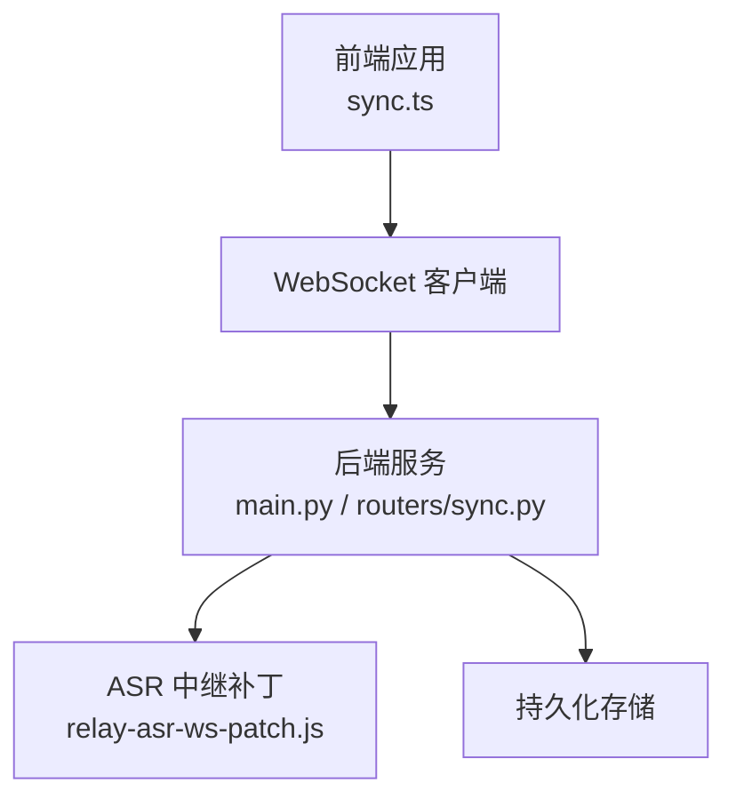
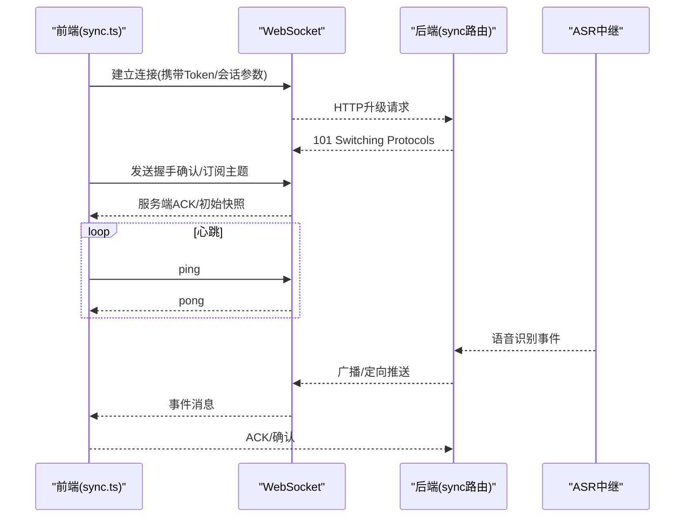
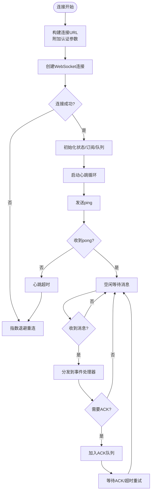
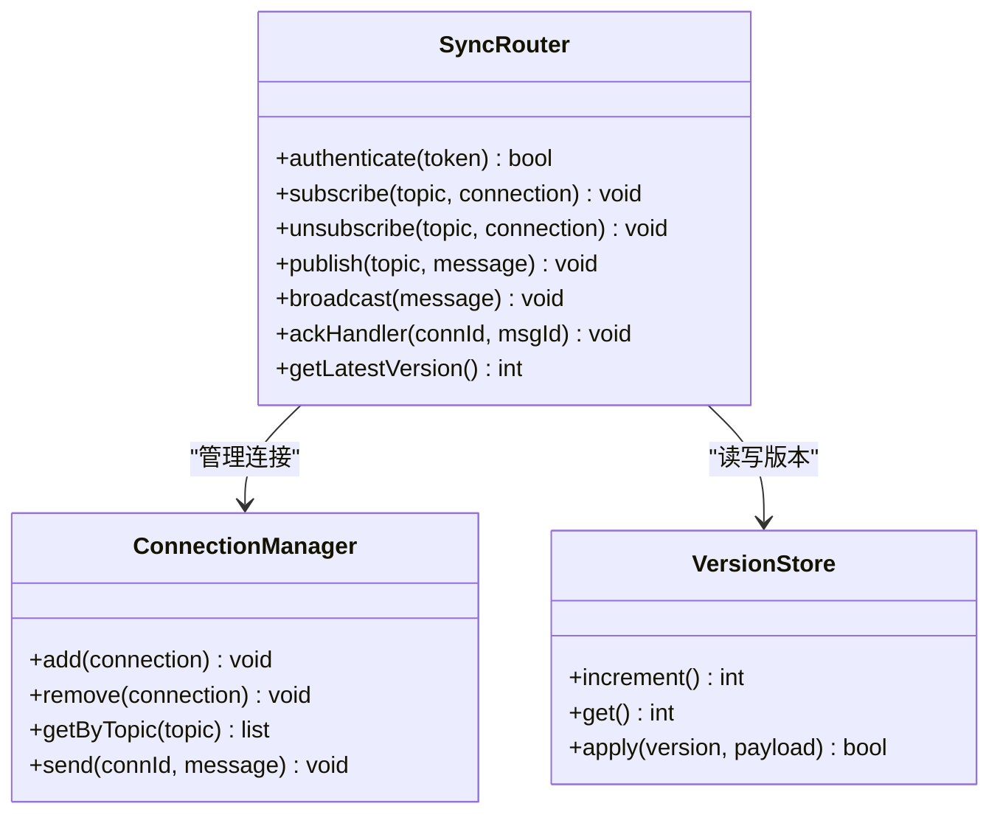
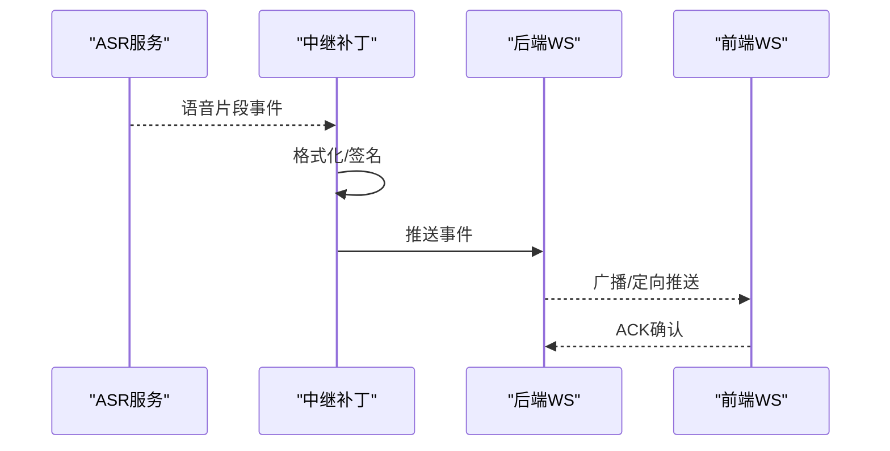
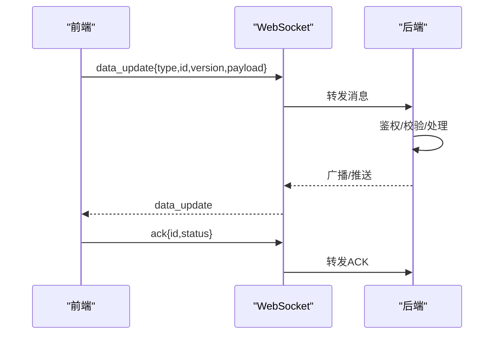
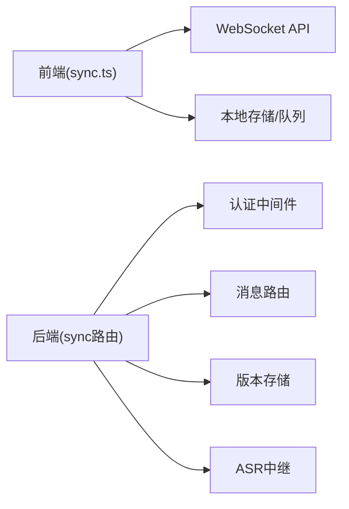

# WebSocket实时同步

<cite>
**本文引用的文件**   
- [frontend/src/sync.ts](file://frontend/src/sync.ts)
- [backend/main.py](file://backend/main.py)
- [backend/routers/sync.py](file://backend/routers/sync.py)
- [data/relay-asr-ws-patch.js](file://data/relay-asr-ws-patch.js)
</cite>

## 目录
1. [简介](#简介)
2. [项目结构](#项目结构)
3. [核心组件](#核心组件)
4. [架构总览](#架构总览)
5. [详细组件分析](#详细组件分析)
6. [依赖分析](#依赖分析)
7. [性能考虑](#性能考虑)
8. [故障排查指南](#故障排查指南)
9. [结论](#结论)
10. [附录](#附录)

## 简介
本文件面向AdventureX的WebSocket实时数据同步子系统，系统性阐述连接建立、心跳检测、断线重连与消息队列机制；定义实时同步协议、消息格式与事件处理流程；说明冲突解决算法、数据一致性保证与版本控制策略；并给出连接状态管理、错误恢复与性能监控的实现要点。同时覆盖前后端通信协议、安全验证与数据加密机制的设计建议与落地方案。

## 项目结构
- 前端实现位于 frontend/src/sync.ts，负责WebSocket生命周期管理、心跳、重连、消息队列与事件分发。
- 后端服务入口在 backend/main.py，路由模块包含 backend/routers/sync.py，用于处理同步相关接口与WebSocket握手。
- data/relay-asr-ws-patch.js 提供ASR（语音识别）WebSocket中继补丁，用于转发或适配第三方ASR服务的WS通道。

图表来源
- [frontend/src/sync.ts](file://frontend/src/sync.ts)
- [backend/main.py](file://backend/main.py)
- [backend/routers/sync.py](file://backend/routers/sync.py)
- [data/relay-asr-ws-patch.js](file://data/relay-asr-ws-patch.js)

章节来源
- [frontend/src/sync.ts](file://frontend/src/sync.ts)
- [backend/main.py](file://backend/main.py)
- [backend/routers/sync.py](file://backend/routers/sync.py)
- [data/relay-asr-ws-patch.js](file://data/relay-asr-ws-patch.js)

## 核心组件
- WebSocket客户端（前端）：封装连接、心跳、重连、消息队列与事件总线，确保高可用与低延迟的数据同步。
- 同步路由（后端）：处理认证、鉴权、订阅/发布、消息路由与ACK确认。
- ASR中继（可选）：桥接外部ASR服务，将语音流转换为文本事件并通过WS推送给前端。

章节来源
- [frontend/src/sync.ts](file://frontend/src/sync.ts)
- [backend/routers/sync.py](file://backend/routers/sync.py)
- [data/relay-asr-ws-patch.js](file://data/relay-asr-ws-patch.js)

## 架构总览
整体采用“前端WS客户端 + 后端WS路由 + 可选ASR中继”的架构。前端维护连接状态机，按心跳周期发送ping，收到pong后重置计时器；当网络异常或服务端关闭时触发指数退避重连。后端对每个连接进行会话管理，校验令牌，按主题路由消息，并对关键操作返回ACK以保障可靠性。

图表来源
- [frontend/src/sync.ts](file://frontend/src/sync.ts)
- [backend/routers/sync.py](file://backend/routers/sync.py)
- [data/relay-asr-ws-patch.js](file://data/relay-asr-ws-patch.js)

## 详细组件分析

### 前端WebSocket客户端（sync.ts）
- 连接建立
  - 使用URL与配置构建连接，支持查询参数传递认证信息（如token）。
  - 连接成功后初始化订阅列表与消息队列，启动心跳定时器。
- 心跳检测
  - 定时发送ping，若超过阈值未收到pong则判定为超时，触发重连。
  - 心跳间隔与超时阈值可配置，避免频繁抖动。
- 断线重连
  - 基于指数退避策略计算下一次重连时间，限制最大重试次数与最大等待时间。
  - 重连前清理临时状态，保留必要上下文（如最后序列号、订阅主题）。
- 消息队列
  - 入队顺序写入，出队按FIFO；在网络不可用时缓存，连接恢复后批量发送。
  - 对关键消息要求ACK，未收到ACK的重试策略与去重由版本号/ID保证。
- 事件处理
  - 统一事件分发器，按类型路由到对应处理器（如数据更新、提示、错误）。
  - 支持订阅/取消订阅主题，减少无关消息。

图表来源
- [frontend/src/sync.ts](file://frontend/src/sync.ts)

章节来源
- [frontend/src/sync.ts](file://frontend/src/sync.ts)

### 后端同步路由（routers/sync.py）
- 认证与鉴权
  - 解析WS握手中的认证参数，校验令牌有效性，绑定用户会话。
  - 失败则拒绝升级并返回错误码。
- 订阅与发布
  - 维护连接到主题的映射，支持多主题订阅。
  - 根据主题路由消息，支持广播与点对点推送。
- 可靠性与ACK
  - 对写操作返回ACK，客户端需回传确认；服务端维护未ACK队列，超时重发。
- 版本与一致性
  - 消息携带版本号/序列号，客户端合并时按版本策略处理冲突。
  - 服务端记录最新全局版本，用于增量同步与回放。

图表来源
- [backend/routers/sync.py](file://backend/routers/sync.py)

章节来源
- [backend/routers/sync.py](file://backend/routers/sync.py)

### ASR中继（relay-asr-ws-patch.js）
- 作用
  - 对接第三方ASR服务，将语音流识别结果转换为文本事件，通过WebSocket推送给后端或直接到前端。
- 行为
  - 监听ASR事件，格式化消息体，附加会话ID与时间戳。
  - 支持断线重连与重试，保证事件不丢失。

图表来源
- [data/relay-asr-ws-patch.js](file://data/relay-asr-ws-patch.js)
- [backend/routers/sync.py](file://backend/routers/sync.py)

章节来源
- [data/relay-asr-ws-patch.js](file://data/relay-asr-ws-patch.js)

### 实时同步协议与消息格式
- 连接阶段
  - 握手参数：token、client_id、version等。
  - 响应：握手成功/失败，附带服务端能力与默认主题。
- 心跳
  - ping/pong：无负载或轻量负载，用于保活与延迟测量。
- 业务消息
  - 字段建议：type、id、version、payload、timestamp、ack_required。
  - type示例：data_update、snapshot、ack、error、subscribe/unsubscribe。
- 确认机制
  - ack_required=true时需回传ack，包含msg_id与status。

章节来源
- [frontend/src/sync.ts](file://frontend/src/sync.ts)
- [backend/routers/sync.py](file://backend/routers/sync.py)

### 事件处理流程
- 前端
  - 接收消息 -> 校验签名/版本 -> 分发到处理器 -> 生成ACK（如需）-> 入队发送。
- 后端
  - 接收消息 -> 鉴权 -> 路由到处理器 -> 更新状态/版本 -> 广播/推送 -> 记录日志。

图表来源
- [frontend/src/sync.ts](file://frontend/src/sync.ts)
- [backend/routers/sync.py](file://backend/routers/sync.py)

章节来源
- [frontend/src/sync.ts](file://frontend/src/sync.ts)
- [backend/routers/sync.py](file://backend/routers/sync.py)

### 冲突解决算法、一致性与版本控制
- 冲突解决
  - 基于版本号/时间戳的合并策略：较新版本覆盖旧版本；对并发修改采用CRDT或操作转换（OT）思路。
  - 字段级合并：对可合并字段做增量更新，对互斥字段采用“最后写入胜”或协商策略。
- 一致性保证
  - 强一致：写路径串行化，返回确认后生效。
  - 最终一致：允许短暂不一致，通过版本拉取与增量同步收敛。
- 版本控制
  - 全局单调递增版本，客户端携带last_version进行增量同步。
  - 服务端维护版本索引，支持回溯与回放。

章节来源
- [backend/routers/sync.py](file://backend/routers/sync.py)
- [frontend/src/sync.ts](file://frontend/src/sync.ts)

### 连接状态管理、错误恢复与性能监控
- 连接状态机
  - 状态：Idle、Connecting、Connected、Reconnecting、Closed。
  - 事件：open、message、error、close、pong。
- 错误恢复
  - 网络错误：指数退避重连，上限与退避因子可配置。
  - 服务端错误：降级策略（如切换主题、拉取快照）。
- 性能监控
  - 指标：连接时长、心跳RTT、消息吞吐、丢包率、重连次数。
  - 上报：周期性上报至监控服务，便于告警与容量规划。

章节来源
- [frontend/src/sync.ts](file://frontend/src/sync.ts)

### 安全验证与数据加密
- 认证与授权
  - Token校验（JWT或短期会话），防重放（nonce/timestamp）。
  - 权限控制：按主题/资源粒度授权。
- 传输安全
  - 强制使用wss://，TLS终止于反向代理或网关。
  - 敏感载荷可选端到端加密（E2EE），密钥协商通过安全通道完成。
- 审计与风控
  - 记录握手、订阅、消息收发与错误日志，支持溯源。

章节来源
- [backend/routers/sync.py](file://backend/routers/sync.py)
- [frontend/src/sync.ts](file://frontend/src/sync.ts)

## 依赖分析
- 前端依赖
  - WebSocket原生API或封装库，用于连接与事件处理。
  - 本地状态管理与队列存储（内存/IndexedDB）。
- 后端依赖
  - Web框架（如FastAPI/Starlette）提供WS支持。
  - 认证中间件、消息路由与版本存储（内存/数据库）。
- 外部依赖
  - ASR服务（可选），通过中继补丁集成。

图表来源
- [frontend/src/sync.ts](file://frontend/src/sync.ts)
- [backend/routers/sync.py](file://backend/routers/sync.py)
- [data/relay-asr-ws-patch.js](file://data/relay-asr-ws-patch.js)

章节来源
- [frontend/src/sync.ts](file://frontend/src/sync.ts)
- [backend/routers/sync.py](file://backend/routers/sync.py)
- [data/relay-asr-ws-patch.js](file://data/relay-asr-ws-patch.js)

## 性能考虑
- 心跳与超时
  - 合理设置心跳间隔与超时阈值，平衡保活与资源消耗。
- 消息批处理
  - 批量发送与压缩，降低带宽占用与序列化开销。
- 背压与限流
  - 客户端侧对高频消息进行节流与合并；服务端对单连接限速。
- 连接池与会话复用
  - 后端维护连接池，避免频繁创建销毁；前端复用连接减少握手开销。
- 监控与调优
  - 采集关键指标，结合A/B测试优化参数（如重连退避、批量大小）。

[本节为通用指导，无需具体文件引用]

## 故障排查指南
- 连接失败
  - 检查证书与域名解析，确认wss端口开放；查看握手错误码与原因。
- 心跳超时
  - 观察网络质量与服务端负载；调整心跳间隔与超时阈值。
- 消息丢失
  - 核对ACK机制是否启用；检查队列与重试逻辑；定位丢包点。
- 版本冲突
  - 比对客户端与服务端版本；必要时拉取全量快照重新同步。
- 性能瓶颈
  - 分析吞吐与延迟指标；优化序列化、压缩与路由策略。

章节来源
- [frontend/src/sync.ts](file://frontend/src/sync.ts)
- [backend/routers/sync.py](file://backend/routers/sync.py)

## 结论
本方案通过稳健的WS客户端与后端路由协作，实现了高可用的实时数据同步。借助心跳、重连、ACK与版本控制，系统在弱网与高并发场景下仍能保证一致性与可靠性。配合ASR中继，可扩展语音识别场景。建议在生产环境完善监控、审计与安全加固，持续优化性能与稳定性。

[本节为总结性内容，无需具体文件引用]

## 附录
- 术语
  - WS：WebSocket
  - ACK：确认
  - CRDT：无冲突复制数据类型
  - OT：操作转换
- 最佳实践
  - 始终使用wss；最小化消息体积；幂等处理；灰度发布变更。

[本节为补充信息，无需具体文件引用]