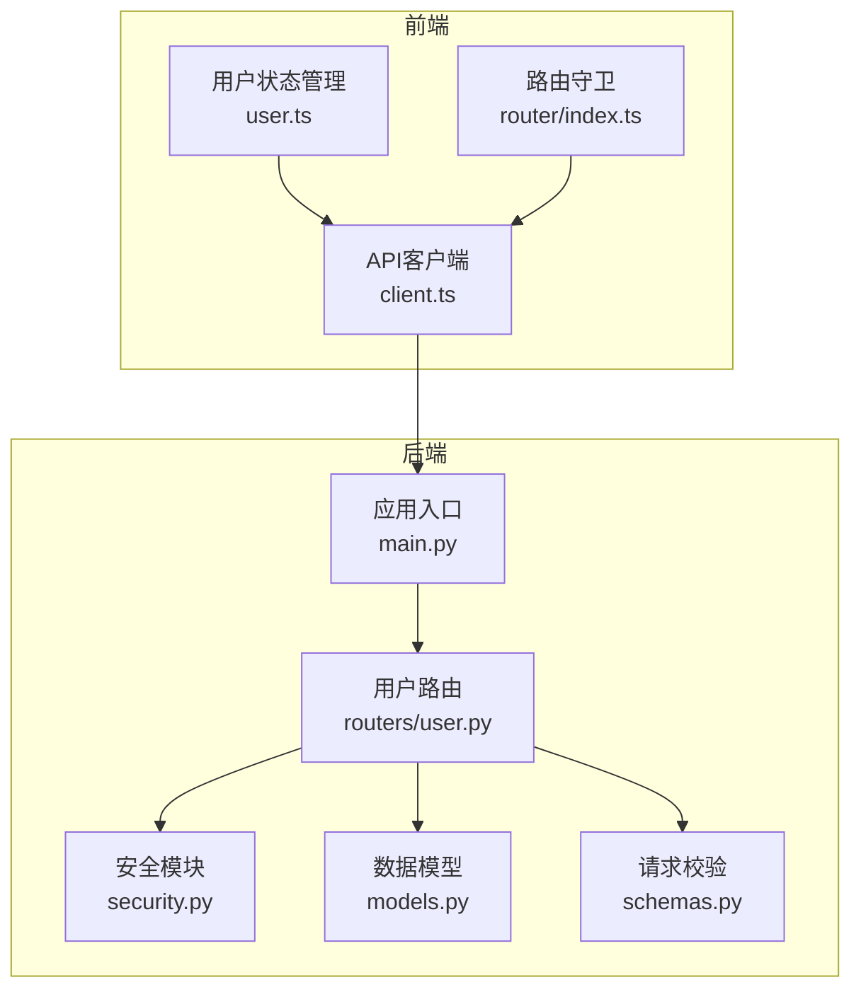
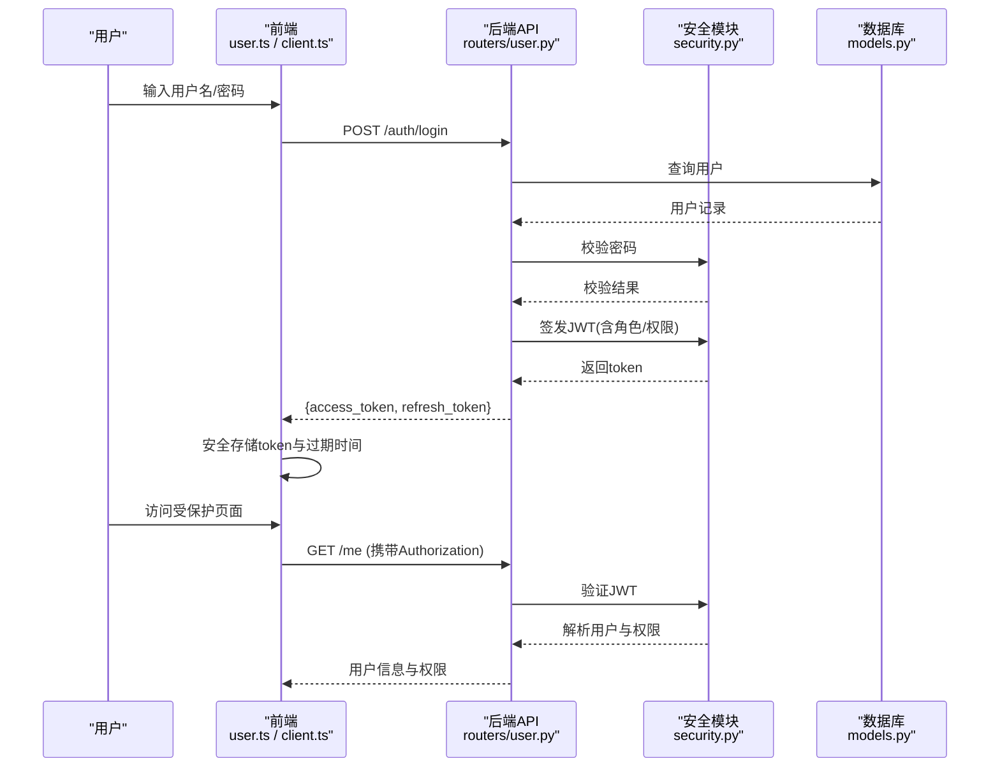
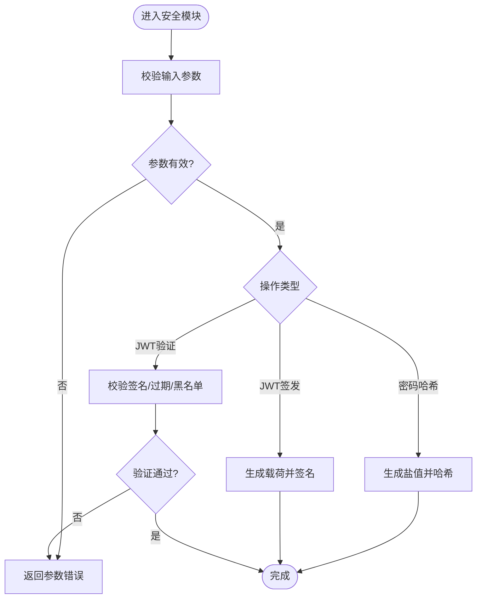
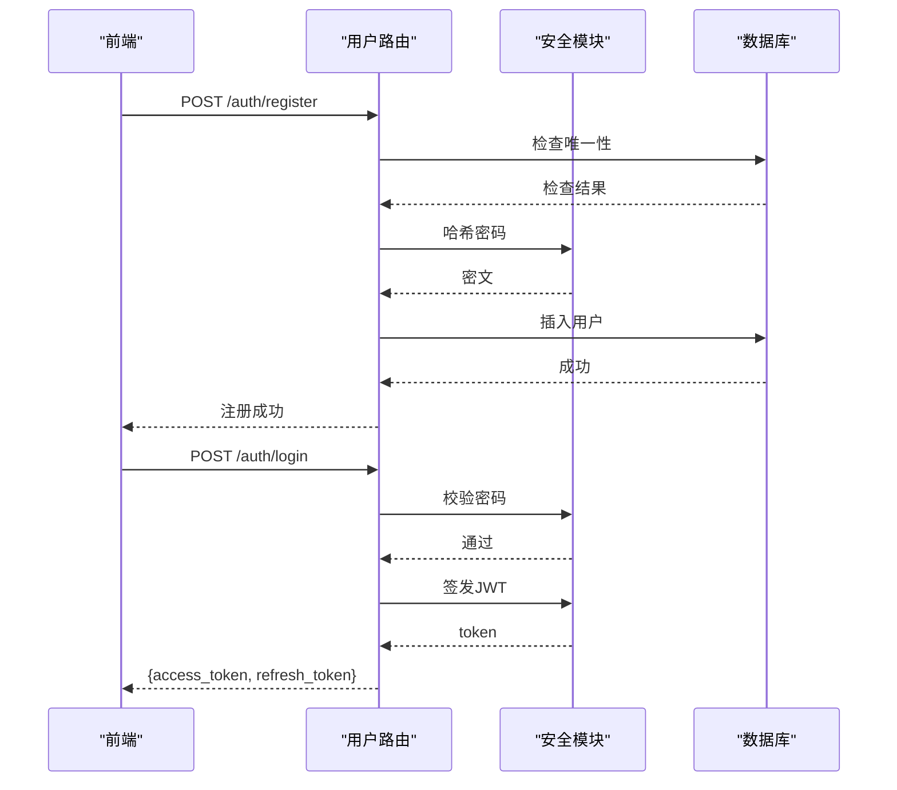
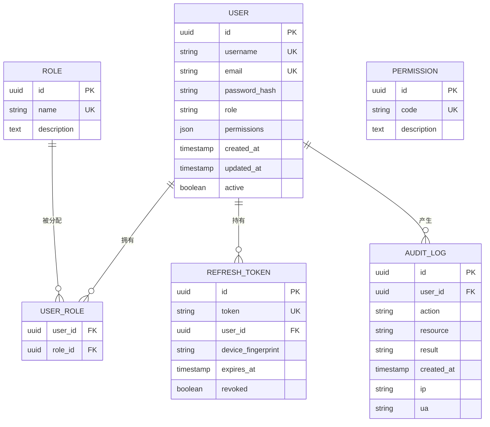
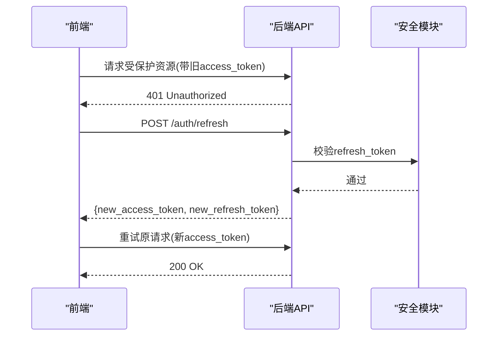
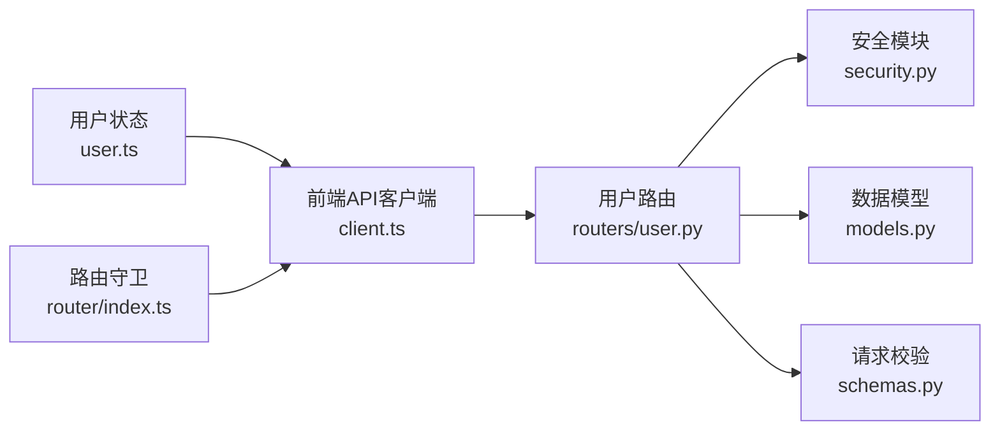

# 用户认证管理

<cite>
**本文引用的文件**   
- [backend/main.py](file://backend/main.py)
- [backend/security.py](file://backend/security.py)
- [backend/models.py](file://backend/models.py)
- [backend/schemas.py](file://backend/schemas.py)
- [backend/routers/user.py](file://backend/routers/user.py)
- [frontend/src/api/client.ts](file://frontend/src/api/client.ts)
- [frontend/src/user.ts](file://frontend/src/user.ts)
- [frontend/src/router/index.ts](file://frontend/src/router/index.ts)
</cite>

## 目录
1. [简介](#简介)
2. [项目结构](#项目结构)
3. [核心组件](#核心组件)
4. [架构总览](#架构总览)
5. [详细组件分析](#详细组件分析)
6. [依赖关系分析](#依赖关系分析)
7. [性能考虑](#性能考虑)
8. [故障排查指南](#故障排查指南)
9. [结论](#结论)
10. [附录](#附录)

## 简介
本文件面向AdventureX项目的用户认证与授权子系统，围绕登录、注册、会话管理、权限控制、JWT令牌生命周期（生成、验证、刷新）、安全存储与跨域处理、角色权限系统、访问控制与操作审计、用户状态与自动登出/会话超时、密码加密与安全传输、防攻击措施以及用户信息同步与偏好设置等主题进行系统化说明。文档以“从前端到后端”的端到端视角展开，既提供高层架构图，也给出关键流程时序图与数据流图，帮助读者快速理解并落地实现。

## 项目结构
本项目采用前后端分离架构：
- 后端基于Python框架，提供REST API，包含路由层、模型层、安全模块与配置。
- 前端基于Vue生态，提供API客户端、用户状态管理、路由守卫与本地持久化。

**图示来源** 
- [backend/main.py](file://backend/main.py)
- [backend/routers/user.py](file://backend/routers/user.py)
- [backend/security.py](file://backend/security.py)
- [backend/models.py](file://backend/models.py)
- [backend/schemas.py](file://backend/schemas.py)
- [frontend/src/api/client.ts](file://frontend/src/api/client.ts)
- [frontend/src/user.ts](file://frontend/src/user.ts)
- [frontend/src/router/index.ts](file://frontend/src/router/index.ts)

**章节来源**
- [backend/main.py](file://backend/main.py)
- [backend/routers/user.py](file://backend/routers/user.py)
- [backend/security.py](file://backend/security.py)
- [backend/models.py](file://backend/models.py)
- [backend/schemas.py](file://backend/schemas.py)
- [frontend/src/api/client.ts](file://frontend/src/api/client.ts)
- [frontend/src/user.ts](file://frontend/src/user.ts)
- [frontend/src/router/index.ts](file://frontend/src/router/index.ts)

## 核心组件
- 安全模块（后端）：负责密码哈希、JWT签发与验签、令牌刷新策略、黑名单/撤销机制、速率限制与输入校验集成。
- 用户路由（后端）：暴露注册、登录、登出、获取当前用户、更新个人信息、偏好设置等接口；统一鉴权装饰器与审计日志。
- 数据模型（后端）：用户实体、角色/权限表、会话/令牌记录、审计日志表等。
- 请求校验（后端）：Pydantic模型用于登录、注册、更新等请求体的字段校验与默认值。
- 前端API客户端：封装HTTP请求、拦截器（附加Authorization头、错误处理、重试）、Token刷新逻辑。
- 前端用户状态：集中管理登录态、用户信息、角色权限、自动登出与超时处理。
- 前端路由守卫：根据登录态与角色权限控制页面访问。

**章节来源**
- [backend/security.py](file://backend/security.py)
- [backend/routers/user.py](file://backend/routers/user.py)
- [backend/models.py](file://backend/models.py)
- [backend/schemas.py](file://backend/schemas.py)
- [frontend/src/api/client.ts](file://frontend/src/api/client.ts)
- [frontend/src/user.ts](file://frontend/src/user.ts)
- [frontend/src/router/index.ts](file://frontend/src/router/index.ts)

## 架构总览
下图展示从前端发起登录到后端签发JWT，再到受保护资源访问的完整交互流程。

**图示来源** 
- [frontend/src/api/client.ts](file://frontend/src/api/client.ts)
- [frontend/src/user.ts](file://frontend/src/user.ts)
- [backend/routers/user.py](file://backend/routers/user.py)
- [backend/security.py](file://backend/security.py)
- [backend/models.py](file://backend/models.py)

## 详细组件分析

### 安全模块（后端）
- 密码加密：使用强哈希算法对密码进行不可逆加密，盐值随机化，支持参数调优以提升抗暴力破解能力。
- JWT签发与验证：
  - 签发：将用户ID、角色、权限集合、签发时间、过期时间写入载荷，使用服务端密钥签名。
  - 验证：校验签名、过期时间、可选黑名单/撤销列表；失败则拒绝访问。
- 令牌刷新：
  - 提供独立刷新接口，校验refresh_token有效性，必要时轮换或绑定设备指纹。
  - 支持一次性使用与滑动窗口过期策略。
- 安全策略：
  - 速率限制：针对登录/注册/刷新接口限流，防止暴力破解与枚举。
  - 输入校验：与schemas配合，严格校验长度、格式、白名单字符。
  - 敏感信息脱敏：响应中避免回显敏感字段。

**图示来源** 
- [backend/security.py](file://backend/security.py)
- [backend/schemas.py](file://backend/schemas.py)

**章节来源**
- [backend/security.py](file://backend/security.py)
- [backend/schemas.py](file://backend/schemas.py)

### 用户路由（后端）
- 注册：
  - 校验用户名唯一性、密码强度、邮箱格式等。
  - 创建用户记录，分配默认角色与权限。
  - 返回最小必要信息，不泄露敏感数据。
- 登录：
  - 校验凭据，成功后签发access_token与refresh_token。
  - 记录登录审计事件（IP、UA、时间）。
- 登出：
  - 支持主动失效refresh_token或加入黑名单。
  - 清理前端状态（由前端负责）。
- 获取当前用户/更新信息：
  - 需要鉴权，仅允许本人修改。
  - 支持更新头像、昵称、语言、时区等偏好。
- 权限控制：
  - 基于角色的访问控制（RBAC），在路由层校验角色与操作权限。
  - 审计日志记录敏感操作（增删改）。

**图示来源** 
- [backend/routers/user.py](file://backend/routers/user.py)
- [backend/security.py](file://backend/security.py)
- [backend/models.py](file://backend/models.py)

**章节来源**
- [backend/routers/user.py](file://backend/routers/user.py)
- [backend/models.py](file://backend/models.py)
- [backend/schemas.py](file://backend/schemas.py)

### 数据模型（后端）
- 用户表：主键、用户名、邮箱、密码哈希、角色、权限集合、创建/更新时间、状态。
- 角色与权限表：角色定义、权限点、角色-权限映射。
- 会话/令牌表：refresh_token、绑定信息（如设备指纹）、过期时间、是否已撤销。
- 审计日志表：操作人、动作、资源、结果、时间、IP、UA。

**图示来源** 
- [backend/models.py](file://backend/models.py)

**章节来源**
- [backend/models.py](file://backend/models.py)

### 请求校验（后端）
- 使用结构化Schema对登录、注册、更新等请求体进行字段校验、默认值填充与错误提示。
- 支持自定义校验规则（如密码复杂度、邮箱格式、用户名白名单）。

**章节来源**
- [backend/schemas.py](file://backend/schemas.py)

### 前端API客户端
- 统一基础URL、超时、重试策略。
- 请求拦截器：自动附加Authorization头（Bearer Token），处理401/403跳转与错误提示。
- 响应拦截器：处理网络异常、业务错误码、消息提示。
- Token刷新：当收到401且存在refresh_token时，调用刷新接口并更新本地存储，然后重试原请求。

**图示来源** 
- [frontend/src/api/client.ts](file://frontend/src/api/client.ts)
- [backend/routers/user.py](file://backend/routers/user.py)
- [backend/security.py](file://backend/security.py)

**章节来源**
- [frontend/src/api/client.ts](file://frontend/src/api/client.ts)

### 前端用户状态管理
- 登录态维护：保存access_token、refresh_token、过期时间戳、用户信息、角色与权限。
- 自动登出：
  - 监听token过期或无效，触发登出流程，清除本地存储并跳转至登录页。
  - 支持心跳保活与静默刷新。
- 偏好设置：本地缓存语言、主题、时区等，与后端同步。

**章节来源**
- [frontend/src/user.ts](file://frontend/src/user.ts)

### 前端路由守卫
- 未登录拦截：重定向到登录页。
- 角色/权限拦截：根据路由元信息校验用户角色与权限，无权限则显示403或跳转。
- 动态菜单：根据权限渲染可用菜单项。

**章节来源**
- [frontend/src/router/index.ts](file://frontend/src/router/index.ts)

## 依赖关系分析
- 前端依赖后端API进行认证与授权，依赖本地存储维持会话。
- 后端路由依赖安全模块进行密码与JWT处理，依赖模型进行数据存取，依赖Schema进行输入校验。
- 安全模块可能依赖外部库（如加密库、JWT库），需确保版本兼容与密钥管理。

**图示来源** 
- [frontend/src/api/client.ts](file://frontend/src/api/client.ts)
- [frontend/src/user.ts](file://frontend/src/user.ts)
- [frontend/src/router/index.ts](file://frontend/src/router/index.ts)
- [backend/routers/user.py](file://backend/routers/user.py)
- [backend/security.py](file://backend/security.py)
- [backend/models.py](file://backend/models.py)
- [backend/schemas.py](file://backend/schemas.py)

**章节来源**
- [frontend/src/api/client.ts](file://frontend/src/api/client.ts)
- [frontend/src/user.ts](file://frontend/src/user.ts)
- [frontend/src/router/index.ts](file://frontend/src/router/index.ts)
- [backend/routers/user.py](file://backend/routers/user.py)
- [backend/security.py](file://backend/security.py)
- [backend/models.py](file://backend/models.py)
- [backend/schemas.py](file://backend/schemas.py)

## 性能考虑
- JWT无状态特性减少服务器会话存储压力，但需注意载荷大小与频繁解析开销。
- 刷新令牌应设置合理过期时间与频率限制，避免频繁刷新造成额外负载。
- 数据库索引优化：对用户唯一字段（用户名、邮箱）、外键（user_id）、审计日志时间字段建立索引。
- 前端请求合并与去抖：避免重复登录/刷新请求。
- 缓存热点数据：如角色权限映射可短期缓存，降低数据库压力。

[本节为通用指导，不涉及具体文件]

## 故障排查指南
- 登录失败：
  - 检查密码哈希与输入是否正确，查看后端校验日志。
  - 确认账号状态是否为激活。
- 401未授权：
  - 检查access_token是否存在、是否过期、是否被篡改。
  - 若refresh_token失效，检查刷新接口与黑名单策略。
- 403禁止访问：
  - 检查用户角色与权限是否满足路由要求。
  - 确认权限集合是否包含所需操作点。
- 跨域问题：
  - 检查后端CORS配置是否允许前端域名、方法与头部。
- 审计日志缺失：
  - 确认敏感操作是否开启审计记录，检查日志写入权限。

**章节来源**
- [backend/routers/user.py](file://backend/routers/user.py)
- [backend/security.py](file://backend/security.py)
- [frontend/src/api/client.ts](file://frontend/src/api/client.ts)

## 结论
本方案通过前后端协同实现了完整的用户认证与授权体系：后端以安全模块为核心，结合模型与校验保障数据安全与一致性；前端通过API客户端与状态管理实现流畅的用户体验与健壮的错误处理。建议在生产环境强化密钥管理、启用HTTPS、实施严格的速率限制与审计监控，并持续进行安全测试与渗透评估。

[本节为总结性内容，不涉及具体文件]

## 附录
- 术语表：
  - JWT：JSON Web Token，用于身份与权限传递的无状态令牌。
  - RBAC：基于角色的访问控制，通过角色与权限映射实现细粒度控制。
  - CORS：跨域资源共享，浏览器安全策略下的跨域通信机制。
- 最佳实践：
  - 使用强密码策略与多因素认证（可选）。
  - 定期轮换JWT签名密钥与刷新令牌策略。
  - 最小化敏感信息回显，遵循隐私合规。
  - 全链路日志与审计，便于追踪与取证。

[本节为补充信息，不涉及具体文件]