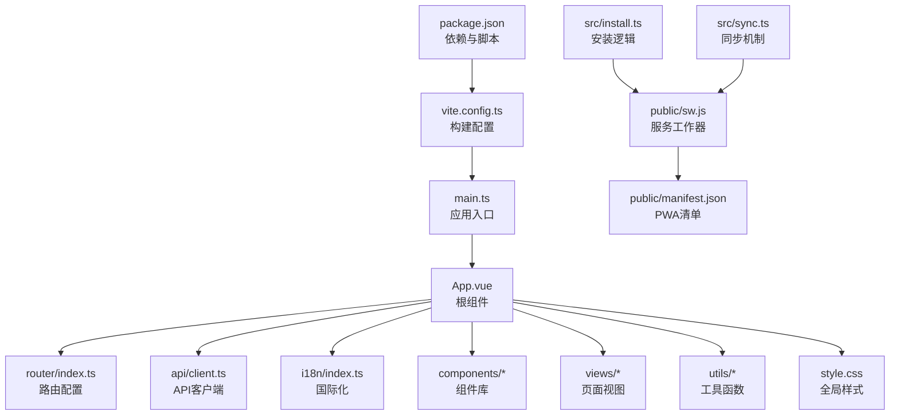
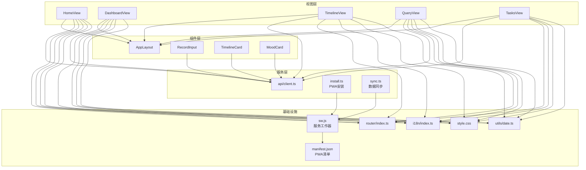
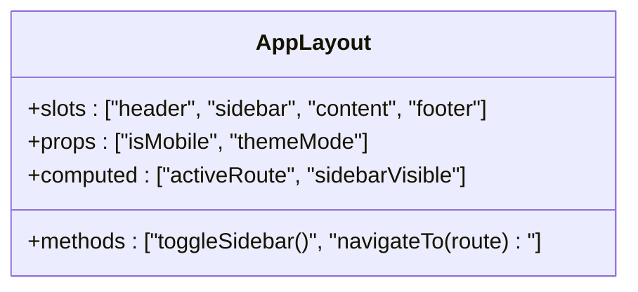
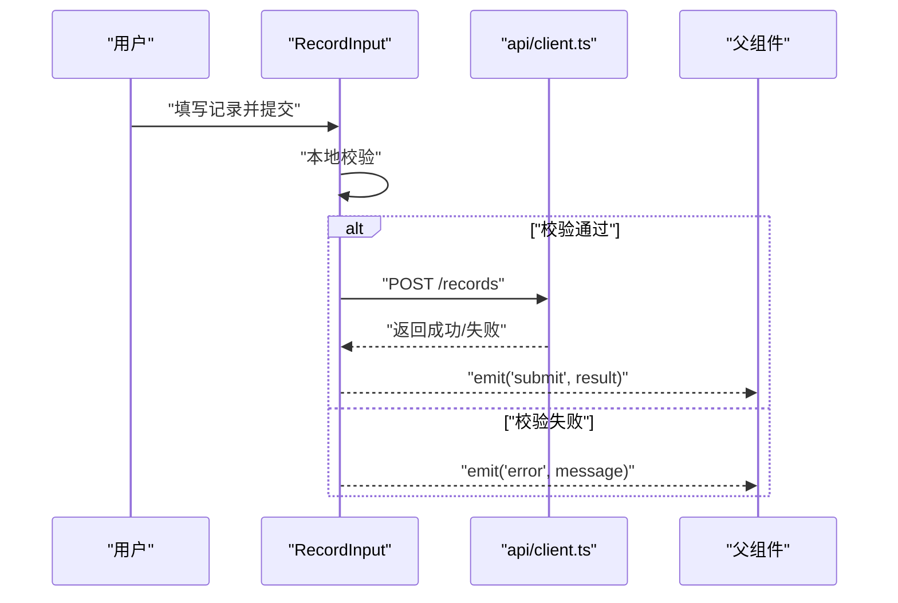
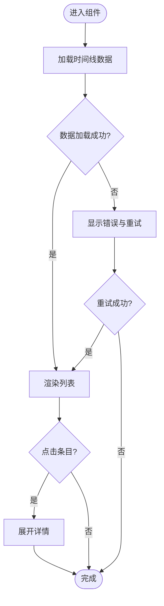
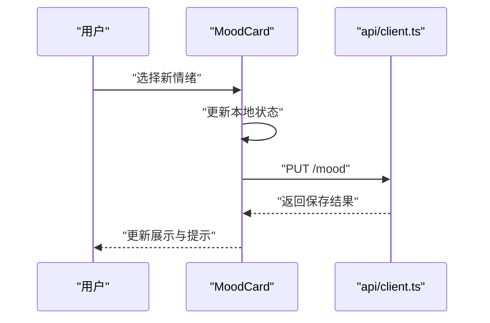
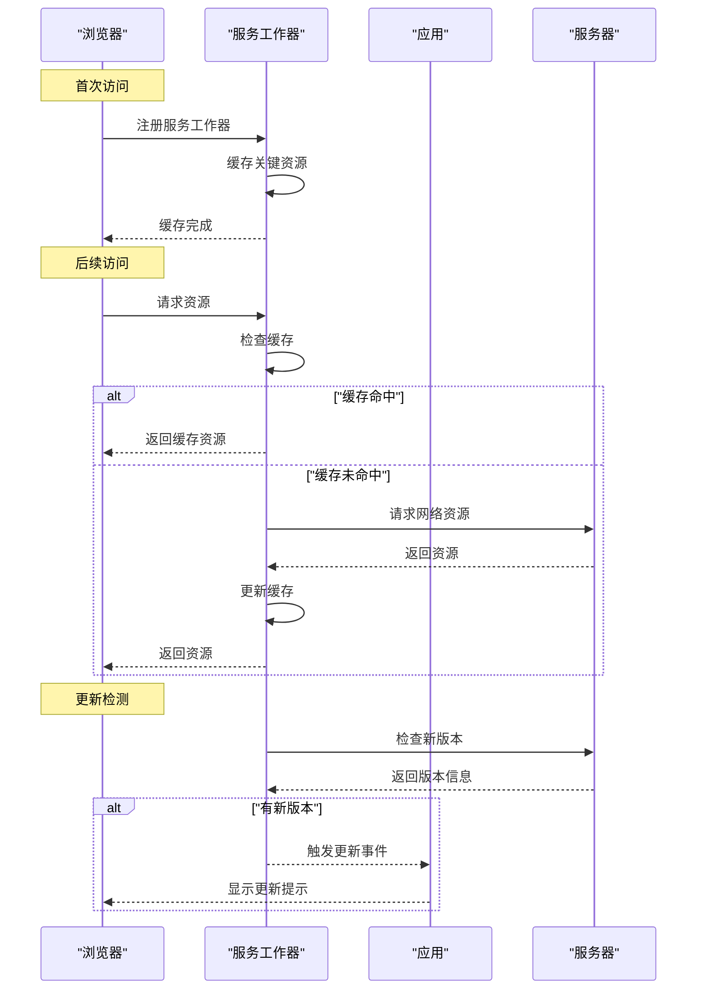
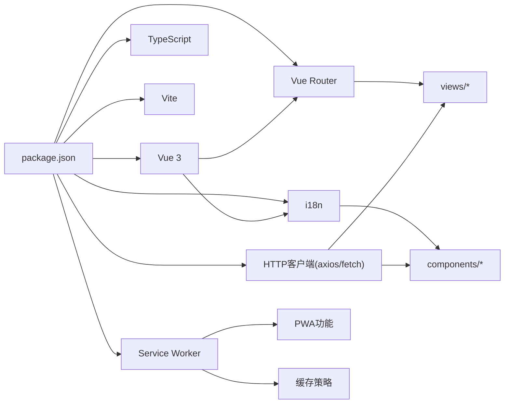

# 前端开发

<cite>
**本文引用的文件**   
- [frontend/src/main.ts](file://frontend/src/main.ts)
- [frontend/src/App.vue](file://frontend/src/App.vue)
- [frontend/src/router/index.ts](file://frontend/src/router/index.ts)
- [frontend/src/api/client.ts](file://frontend/src/api/client.ts)
- [frontend/src/i18n/index.ts](file://frontend/src/i18n/index.ts)
- [frontend/src/i18n/locales/en.ts](file://frontend/src/i18n/locales/en.ts)
- [frontend/src/i18n/locales/zh-CN.ts](file://frontend/src/i18n/locales/zh-CN.ts)
- [frontend/src/components/AppLayout.vue](file://frontend/src/components/AppLayout.vue)
- [frontend/src/components/RecordInput.vue](file://frontend/src/components/RecordInput.vue)
- [frontend/src/components/TimelineCard.vue](file://frontend/src/components/TimelineCard.vue)
- [frontend/src/components/MoodCard.vue](file://frontend/src/components/MoodCard.vue)
- [frontend/src/views/HomeView.vue](file://frontend/src/views/HomeView.vue)
- [frontend/src/views/DashboardView.vue](file://frontend/src/views/DashboardView.vue)
- [frontend/src/views/TimelineView.vue](file://frontend/src/views/TimelineView.vue)
- [frontend/src/views/QueryView.vue](file://frontend/src/views/QueryView.vue)
- [frontend/src/views/TasksView.vue](file://frontend/src/views/TasksView.vue)
- [frontend/src/utils/date.ts](file://frontend/src/utils/date.ts)
- [frontend/src/style.css](file://frontend/src/style.css)
- [frontend/vite.config.ts](file://frontend/vite.config.ts)
- [frontend/package.json](file://frontend/package.json)
- [frontend/public/sw.js](file://frontend/public/sw.js)
- [frontend/public/manifest.json](file://frontend/public/manifest.json)
- [frontend/src/install.ts](file://frontend/src/install.ts)
</cite>

## 更新摘要
**所做更改**
- 新增PWA服务工作者的配置与集成说明
- 添加自动更新功能的实现细节
- 扩展项目结构部分以包含PWA相关文件
- 更新架构总览以反映PWA能力
- 新增PWA相关章节，包括服务工作者注册、缓存策略和更新机制

## 目录
1. [简介](#简介)
2. [项目结构](#项目结构)
3. [核心组件](#核心组件)
4. [架构总览](#架构总览)
5. [详细组件分析](#详细组件分析)
6. [PWA功能集成](#pwa功能集成)
7. [依赖关系分析](#依赖关系分析)
8. [性能考量](#性能考量)
9. [故障排查指南](#故障排查指南)
10. [结论](#结论)
11. [附录](#附录)

## 简介
本文件面向AdventureX前端开发的工程化与实现细节，基于Vue 3 + TypeScript技术栈，系统性说明以下方面：
- 组件结构设计：布局、业务卡片、输入控件等
- 页面路由配置：视图组织与导航策略
- API客户端封装：请求拦截、错误处理、类型安全
- 国际化支持：多语言资源与切换机制
- 样式管理系统：全局样式与主题扩展
- 状态管理策略：组件内状态与跨组件数据流
- 事件处理机制：用户交互与异步流程编排
- 响应式设计：移动端优先与自适应布局
- PWA功能：服务工作者的配置、离线支持和自动更新
- 开发规范与最佳实践：代码组织、命名约定、可维护性建议

## 项目结构
前端采用Vite构建，Vue 3单页应用。关键目录与职责如下：
- src/main.ts：应用入口，初始化Vue实例、插件与根组件挂载
- src/App.vue：根组件，承载全局布局与基础样式
- src/router/index.ts：路由定义与导航守卫（如有）
- src/api/client.ts：HTTP客户端封装，统一请求/响应处理
- src/i18n/*：国际化资源与i18n实例初始化
- src/components/*：可复用UI组件（布局、卡片、输入、工具提示等）
- src/views/*：页面级视图组件
- src/utils/*：通用工具函数（如日期格式化）
- src/style.css：全局样式与主题变量
- public/*：静态资源，包括PWA配置文件和服务工作者
- vite.config.ts：构建与开发服务器配置
- package.json：依赖与脚本命令

**图表来源**
- [frontend/src/main.ts](file://frontend/src/main.ts)
- [frontend/src/App.vue](file://frontend/src/App.vue)
- [frontend/src/router/index.ts](file://frontend/src/router/index.ts)
- [frontend/src/api/client.ts](file://frontend/src/api/client.ts)
- [frontend/src/i18n/index.ts](file://frontend/src/i18n/index.ts)
- [frontend/public/sw.js](file://frontend/public/sw.js)
- [frontend/public/manifest.json](file://frontend/public/manifest.json)
- [frontend/src/install.ts](file://frontend/src/install.ts)
- [frontend/src/sync.ts](file://frontend/src/sync.ts)

**章节来源**
- [frontend/src/main.ts](file://frontend/src/main.ts)
- [frontend/src/App.vue](file://frontend/src/App.vue)
- [frontend/src/router/index.ts](file://frontend/src/router/index.ts)
- [frontend/src/api/client.ts](file://frontend/src/api/client.ts)
- [frontend/src/i18n/index.ts](file://frontend/src/i18n/index.ts)
- [frontend/src/style.css](file://frontend/src/style.css)
- [frontend/vite.config.ts](file://frontend/vite.config.ts)
- [frontend/package.json](file://frontend/package.json)
- [frontend/public/sw.js](file://frontend/public/sw.js)
- [frontend/public/manifest.json](file://frontend/public/manifest.json)
- [frontend/src/install.ts](file://frontend/src/install.ts)

## 核心组件
- AppLayout：应用主布局容器，负责顶部导航、侧边栏（可选）、内容区与底部信息展示；提供插槽以嵌入不同页面视图
- RecordInput：记录输入组件，支持文本输入、语音录制按钮、提交与校验反馈
- TimelineCard：时间线条目卡片，展示事件标题、时间与摘要，支持点击展开详情
- MoodCard：情绪卡片，展示当前或历史情绪标签、评分与趋势指示

使用要点：
- 通过props传递数据与行为回调，避免在子组件直接修改父级状态
- 使用事件emit通知父组件用户操作结果（如提交成功、错误提示）
- 结合i18n进行文案国际化，确保所有用户可见文本均走翻译键

**章节来源**
- [frontend/src/components/AppLayout.vue](file://frontend/src/components/AppLayout.vue)
- [frontend/src/components/RecordInput.vue](file://frontend/src/components/RecordInput.vue)
- [frontend/src/components/TimelineCard.vue](file://frontend/src/components/TimelineCard.vue)
- [frontend/src/components/MoodCard.vue](file://frontend/src/components/MoodCard.vue)

## 架构总览
整体采用"视图层 + 组件层 + 服务层"的分层设计：
- 视图层（views）：页面级组合，负责数据装配与交互编排
- 组件层（components）：原子化UI能力，保持高内聚低耦合
- 服务层（api/client）：网络请求封装，统一错误处理与重试策略
- 国际化（i18n）：集中式文案管理，运行时切换语言
- 样式系统（style.css）：CSS变量与主题适配，响应式断点统一管理
- PWA层（sw.js, manifest.json）：服务工作者与离线缓存，支持离线访问和自动更新

**图表来源**
- [frontend/src/views/HomeView.vue](file://frontend/src/views/HomeView.vue)
- [frontend/src/views/DashboardView.vue](file://frontend/src/views/DashboardView.vue)
- [frontend/src/views/TimelineView.vue](file://frontend/src/views/TimelineView.vue)
- [frontend/src/views/QueryView.vue](file://frontend/src/views/QueryView.vue)
- [frontend/src/views/TasksView.vue](file://frontend/src/views/TasksView.vue)
- [frontend/src/components/AppLayout.vue](file://frontend/src/components/AppLayout.vue)
- [frontend/src/components/RecordInput.vue](file://frontend/src/components/RecordInput.vue)
- [frontend/src/components/TimelineCard.vue](file://frontend/src/components/TimelineCard.vue)
- [frontend/src/components/MoodCard.vue](file://frontend/src/components/MoodCard.vue)
- [frontend/src/api/client.ts](file://frontend/src/api/client.ts)
- [frontend/src/router/index.ts](file://frontend/src/router/index.ts)
- [frontend/src/i18n/index.ts](file://frontend/src/i18n/index.ts)
- [frontend/src/utils/date.ts](file://frontend/src/utils/date.ts)
- [frontend/src/style.css](file://frontend/src/style.css)
- [frontend/public/sw.js](file://frontend/public/sw.js)
- [frontend/public/manifest.json](file://frontend/public/manifest.json)
- [frontend/src/install.ts](file://frontend/src/install.ts)
- [frontend/src/sync.ts](file://frontend/src/sync.ts)

## 详细组件分析

### AppLayout 组件
职责：
- 提供应用级布局骨架（头部、侧边栏、内容区、底部）
- 集成路由视图渲染区域
- 承载全局导航与主题切换入口
- 暴露插槽供各视图注入内容

交互与状态：
- 通过路由参数控制激活项高亮
- 响应式侧边栏折叠/展开（移动端优先）
- 与i18n联动更新导航文案

**图表来源**
- [frontend/src/components/AppLayout.vue](file://frontend/src/components/AppLayout.vue)

**章节来源**
- [frontend/src/components/AppLayout.vue](file://frontend/src/components/AppLayout.vue)

### RecordInput 组件
职责：
- 提供记录输入表单（文本、附件、语音）
- 本地校验与即时反馈
- 调用API提交并处理成功/失败状态

数据流：
- 接收初始值与默认选项
- 通过事件向父组件上报提交结果与错误信息

**图表来源**
- [frontend/src/components/RecordInput.vue](file://frontend/src/components/RecordInput.vue)
- [frontend/src/api/client.ts](file://frontend/src/api/client.ts)

**章节来源**
- [frontend/src/components/RecordInput.vue](file://frontend/src/components/RecordInput.vue)
- [frontend/src/api/client.ts](file://frontend/src/api/client.ts)

### TimelineCard 组件
职责：
- 展示时间线条目（标题、时间、摘要）
- 支持展开/收起详情
- 与后端时间线接口对接，获取最新数据

交互逻辑：
- 点击条目触发详情加载
- 错误时显示重试按钮

**图表来源**
- [frontend/src/components/TimelineCard.vue](file://frontend/src/components/TimelineCard.vue)
- [frontend/src/api/client.ts](file://frontend/src/api/client.ts)

**章节来源**
- [frontend/src/components/TimelineCard.vue](file://frontend/src/components/TimelineCard.vue)
- [frontend/src/api/client.ts](file://frontend/src/api/client.ts)

### MoodCard 组件
职责：
- 展示情绪标签、评分与趋势
- 支持选择新情绪并同步到后端
- 根据用户偏好显示不同颜色与图标

数据绑定：
- 双向绑定当前情绪值
- 监听变化并触发保存

**图表来源**
- [frontend/src/components/MoodCard.vue](file://frontend/src/components/MoodCard.vue)
- [frontend/src/api/client.ts](file://frontend/src/api/client.ts)

**章节来源**
- [frontend/src/components/MoodCard.vue](file://frontend/src/components/MoodCard.vue)
- [frontend/src/api/client.ts](file://frontend/src/api/client.ts)

### 视图组件概览
- HomeView：首页入口，聚合常用功能入口与快捷操作
- DashboardView：仪表盘，汇总统计与关键指标
- TimelineView：时间线浏览与筛选
- QueryView：查询对话界面，与后端AI问答接口交互
- TasksView：任务管理与进度跟踪

**章节来源**
- [frontend/src/views/HomeView.vue](file://frontend/src/views/HomeView.vue)
- [frontend/src/views/DashboardView.vue](file://frontend/src/views/DashboardView.vue)
- [frontend/src/views/TimelineView.vue](file://frontend/src/views/TimelineView.vue)
- [frontend/src/views/QueryView.vue](file://frontend/src/views/QueryView.vue)
- [frontend/src/views/TasksView.vue](file://frontend/src/views/TasksView.vue)

## PWA功能集成

### 服务工作器配置
PWA（渐进式Web应用）功能通过服务工作器（Service Worker）实现，主要特性包括：
- 离线缓存：预缓存关键资源，支持无网络环境下的基本功能
- 后台同步：在网络恢复后自动同步数据
- 推送通知：支持消息推送和用户提醒
- 自动更新：检测新版本并提示用户更新

服务工作器文件位于 `public/sw.js`，负责：
- 注册缓存策略和版本管理
- 处理网络请求的缓存命中和回退
- 管理应用的生命周期事件

### PWA清单配置
PWA清单文件 `public/manifest.json` 定义了应用的元数据：
- 应用名称、描述和图标
- 启动URL和显示模式
- 主题颜色和屏幕方向
- 相关权限和分类

### 安装与更新机制
应用通过 `src/install.ts` 实现PWA的安装提示和更新检测：
- 检测浏览器对PWA的支持
- 显示安装提示对话框
- 监听服务工作器的更新事件
- 提供手动刷新和强制更新选项

**图表来源**
- [frontend/public/sw.js](file://frontend/public/sw.js)
- [frontend/public/manifest.json](file://frontend/public/manifest.json)
- [frontend/src/install.ts](file://frontend/src/install.ts)

### 缓存策略
服务工作器实现了智能缓存策略：
- 静态资源：长期缓存，带版本号
- API响应：短期缓存，带过期时间
- 页面资源：网络优先，缓存回退
- 字体和图片：按需加载，懒缓存

### 离线支持
应用支持基本的离线功能：
- 查看已缓存的时间线和记录
- 编辑新的记录（待网络恢复后同步）
- 查看缓存的仪表板数据
- 基本的导航和界面交互

**章节来源**
- [frontend/public/sw.js](file://frontend/public/sw.js)
- [frontend/public/manifest.json](file://frontend/public/manifest.json)
- [frontend/src/install.ts](file://frontend/src/install.ts)
- [frontend/src/sync.ts](file://frontend/src/sync.ts)

## 依赖关系分析
- Vue 3 + TypeScript：组件类型安全与编译期检查
- Vite：快速开发与构建优化
- Vue Router：页面路由与导航守卫
- Axios/Fetch（由client封装）：HTTP请求与拦截器
- i18n：多语言资源与动态切换
- CSS变量与媒体查询：主题与响应式布局
- Service Worker：PWA功能，离线支持和自动更新

**图表来源**
- [frontend/package.json](file://frontend/package.json)
- [frontend/src/router/index.ts](file://frontend/src/router/index.ts)
- [frontend/src/api/client.ts](file://frontend/src/api/client.ts)
- [frontend/src/i18n/index.ts](file://frontend/src/i18n/index.ts)
- [frontend/public/sw.js](file://frontend/public/sw.js)

**章节来源**
- [frontend/package.json](file://frontend/package.json)
- [frontend/src/router/index.ts](file://frontend/src/router/index.ts)
- [frontend/src/api/client.ts](file://frontend/src/api/client.ts)
- [frontend/src/i18n/index.ts](file://frontend/src/i18n/index.ts)
- [frontend/public/sw.js](file://frontend/public/sw.js)

## 性能考量
- 组件懒加载：按路由拆分视图，减少首屏体积
- 请求去重与缓存：对频繁读取的只读数据启用短期缓存
- 虚拟滚动：长列表场景下按需渲染条目
- 图片与字体优化：按需加载与CDN加速
- 样式隔离：使用CSS变量与模块化样式，避免全局污染
- 内存管理：及时解绑事件监听与清理定时器
- PWA缓存优化：智能缓存策略，减少重复下载
- 服务工作器优化：后台同步和增量更新

## 故障排查指南
常见问题与定位方法：
- 路由跳转异常：检查路由配置与权限守卫逻辑
- API请求失败：查看client拦截器日志与错误码映射
- 国际化缺失：确认翻译键是否存在且路径正确
- 样式错乱：检查CSS变量覆盖与媒体查询断点
- 组件状态不同步：核对props与事件流向，避免直接修改父状态
- PWA更新问题：检查工作器版本和缓存清理
- 离线功能异常：验证缓存策略和资源可用性

**章节来源**
- [frontend/src/router/index.ts](file://frontend/src/router/index.ts)
- [frontend/src/api/client.ts](file://frontend/src/api/client.ts)
- [frontend/src/i18n/index.ts](file://frontend/src/i18n/index.ts)
- [frontend/src/style.css](file://frontend/src/style.css)
- [frontend/public/sw.js](file://frontend/public/sw.js)

## 结论
AdventureX前端以Vue 3 + TypeScript为核心，结合Vite构建与Vue Router路由管理，形成清晰的分层架构。通过统一的API客户端与i18n体系，提升可维护性与用户体验。组件设计遵循单一职责与高内聚原则，配合响应式与主题系统，满足多端适配需求。PWA功能的集成进一步增强了应用的离线能力和用户体验。建议在后续迭代中持续完善错误监控、性能分析与自动化测试，进一步提升工程质量。

## 附录
- 开发环境搭建：安装依赖后运行开发服务器，访问本地端口
- 构建与部署：执行构建命令生成静态资源，部署至目标环境
- PWA部署要求：HTTPS环境和正确的MIME类型配置
- 代码规范：ESLint与Prettier统一风格，提交前自动格式化
- 最佳实践：
  - 组件命名采用大驼峰，文件与组件名一致
  - 状态尽量局部化，必要时使用轻量状态管理
  - API调用统一封装，错误信息标准化
  - 国际化文案集中管理，避免硬编码字符串
  - PWA缓存策略合理设置，平衡性能和数据一致性
  - 服务工作器版本管理，确保平滑更新