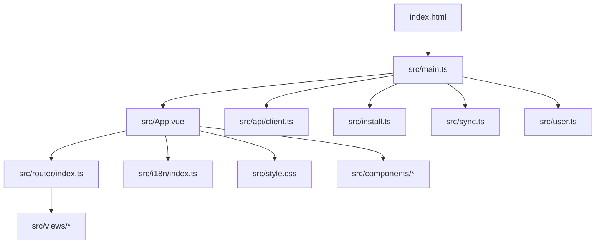
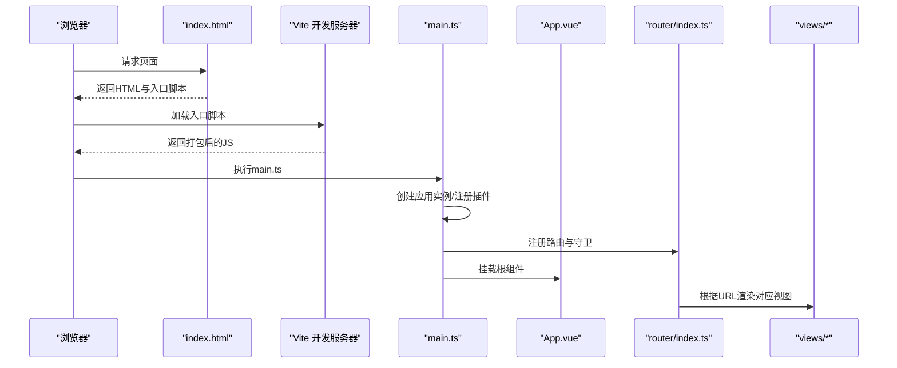
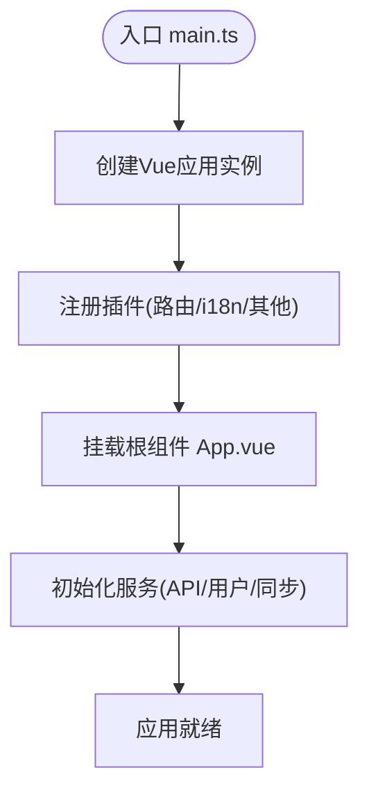
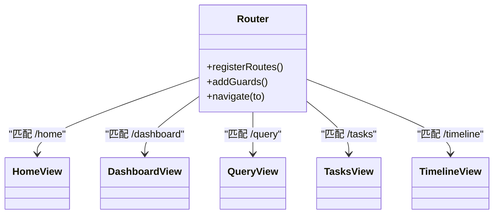
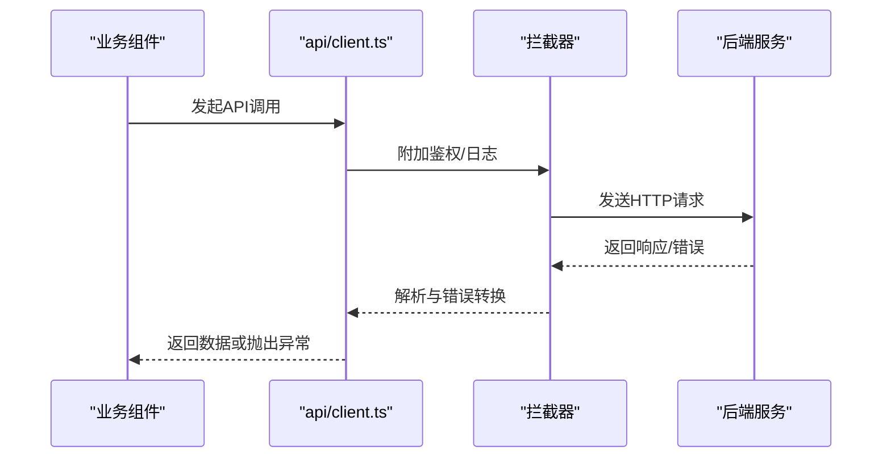
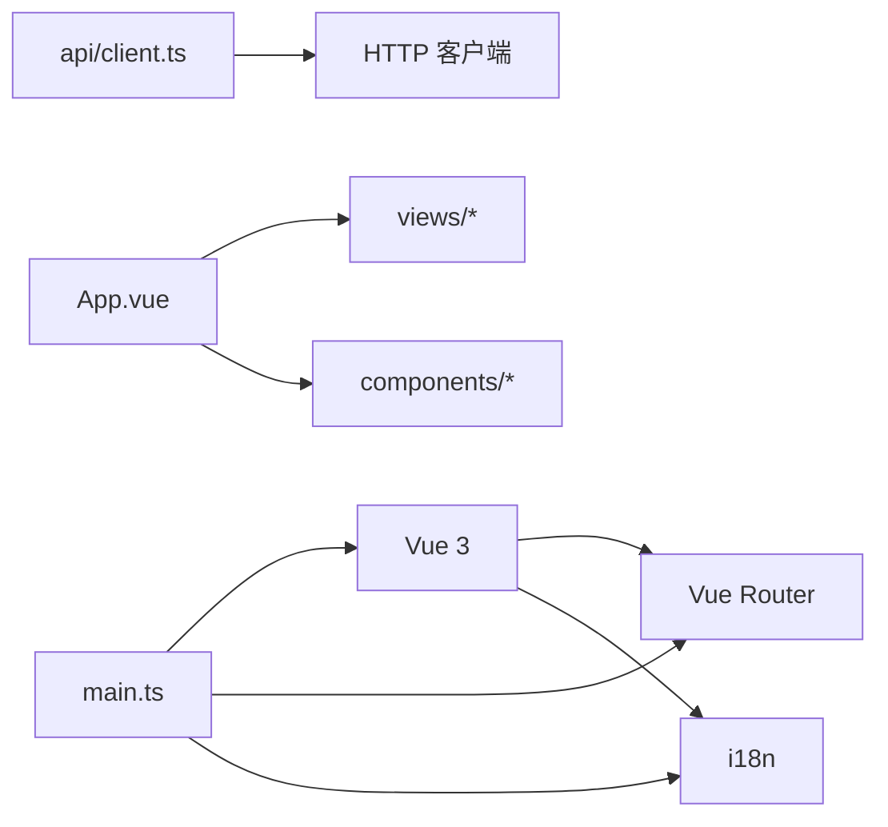

# 前端架构设计

<cite>
**本文引用的文件**   
- [frontend/package.json](file://frontend/package.json)
- [frontend/vite.config.ts](file://frontend/vite.config.ts)
- [frontend/tsconfig.json](file://frontend/tsconfig.json)
- [frontend/tsconfig.app.json](file://frontend/tsconfig.app.json)
- [frontend/tsconfig.node.json](file://frontend/tsconfig.node.json)
- [frontend/index.html](file://frontend/index.html)
- [frontend/src/main.ts](file://frontend/src/main.ts)
- [frontend/src/App.vue](file://frontend/src/App.vue)
- [frontend/src/router/index.ts](file://frontend/src/router/index.ts)
- [frontend/src/api/client.ts](file://frontend/src/api/client.ts)
- [frontend/src/i18n/index.ts](file://frontend/src/i18n/index.ts)
- [frontend/src/env.d.ts](file://frontend/src/env.d.ts)
- [frontend/src/install.ts](file://frontend/src/install.ts)
- [frontend/src/sync.ts](file://frontend/src/sync.ts)
- [frontend/src/user.ts](file://frontend/src/user.ts)
- [frontend/src/utils/date.ts](file://frontend/src/utils/date.ts)
- [frontend/src/style.css](file://frontend/src/style.css)
- [frontend/src/components/AppLayout.vue](file://frontend/src/components/AppLayout.vue)
- [frontend/src/views/HomeView.vue](file://frontend/src/views/HomeView.vue)
- [frontend/src/views/DashboardView.vue](file://frontend/src/views/DashboardView.vue)
- [frontend/src/views/QueryView.vue](file://frontend/src/views/QueryView.vue)
- [frontend/src/views/TasksView.vue](file://frontend/src/views/TasksView.vue)
- [frontend/src/views/TimelineView.vue](file://frontend/src/views/TimelineView.vue)
</cite>

## 目录
1. [简介](#简介)
2. [项目结构](#项目结构)
3. [核心组件](#核心组件)
4. [架构总览](#架构总览)
5. [详细组件分析](#详细组件分析)
6. [依赖分析](#依赖分析)
7. [性能考虑](#性能考虑)
8. [故障排查指南](#故障排查指南)
9. [结论](#结论)
10. [附录](#附录)

## 简介
本文件面向AdventureX前端（Vue 3 + TypeScript + Vite）的架构设计与实现，覆盖项目初始化、构建配置、TypeScript环境、模块组织原则、应用入口与全局配置、依赖注入机制、模块化设计模式、组件树结构与状态管理策略，以及开发环境搭建、构建优化与性能监控。文档以“从宏观到微观”的方式展开，既提供整体视图，也给出关键路径的代码级说明与图示，帮助读者快速理解并扩展系统。

## 项目结构
前端工程位于 frontend 目录，采用按功能域划分的目录组织：
- src/api：网络请求封装与客户端抽象
- src/components：可复用UI组件
- src/views：页面级视图组件
- src/router：路由配置
- src/i18n：国际化资源与初始化
- src/utils：通用工具函数
- 根级配置文件：package.json、vite.config.ts、tsconfig.*、index.html

图表来源
- [frontend/index.html:1-200](file://frontend/index.html#L1-L200)
- [frontend/src/main.ts:1-200](file://frontend/src/main.ts#L1-L200)
- [frontend/src/App.vue:1-200](file://frontend/src/App.vue#L1-L200)
- [frontend/src/router/index.ts:1-200](file://frontend/src/router/index.ts#L1-L200)
- [frontend/src/i18n/index.ts:1-200](file://frontend/src/i18n/index.ts#L1-L200)
- [frontend/src/style.css:1-200](file://frontend/src/style.css#L1-L200)
- [frontend/src/api/client.ts:1-200](file://frontend/src/api/client.ts#L1-L200)
- [frontend/src/install.ts:1-200](file://frontend/src/install.ts#L1-L200)
- [frontend/src/sync.ts:1-200](file://frontend/src/sync.ts#L1-L200)
- [frontend/src/user.ts:1-200](file://frontend/src/user.ts#L1-L200)

章节来源
- [frontend/package.json:1-200](file://frontend/package.json#L1-L200)
- [frontend/vite.config.ts:1-200](file://frontend/vite.config.ts#L1-L200)
- [frontend/tsconfig.json:1-200](file://frontend/tsconfig.json#L1-L200)
- [frontend/tsconfig.app.json:1-200](file://frontend/tsconfig.app.json#L1-L200)
- [frontend/tsconfig.node.json:1-200](file://frontend/tsconfig.node.json#L1-L200)
- [frontend/index.html:1-200](file://frontend/index.html#L1-L200)

## 核心组件
- 应用入口与挂载：main.ts 负责创建Vue应用实例、注册插件、挂载路由与i18n、加载全局样式与主题，并启动服务生命周期钩子。
- 根组件：App.vue 作为顶层布局容器，承载路由出口与全局上下文。
- 路由：router/index.ts 定义页面路由与导航守卫，支撑多页面切换与权限控制。
- API客户端：api/client.ts 封装HTTP请求、错误处理、拦截器与类型定义。
- 国际化：i18n/index.ts 初始化语言包与默认语言设置。
- 安装与同步：install.ts 与 sync.ts 分别负责PWA安装提示与数据同步逻辑。
- 用户上下文：user.ts 维护用户状态与鉴权信息。
- 工具函数：utils/date.ts 提供日期格式化等常用方法。

章节来源
- [frontend/src/main.ts:1-200](file://frontend/src/main.ts#L1-L200)
- [frontend/src/App.vue:1-200](file://frontend/src/App.vue#L1-L200)
- [frontend/src/router/index.ts:1-200](file://frontend/src/router/index.ts#L1-L200)
- [frontend/src/api/client.ts:1-200](file://frontend/src/api/client.ts#L1-L200)
- [frontend/src/i18n/index.ts:1-200](file://frontend/src/i18n/index.ts#L1-L200)
- [frontend/src/install.ts:1-200](file://frontend/src/install.ts#L1-L200)
- [frontend/src/sync.ts:1-200](file://frontend/src/sync.ts#L1-L200)
- [frontend/src/user.ts:1-200](file://frontend/src/user.ts#L1-L200)
- [frontend/src/utils/date.ts:1-200](file://frontend/src/utils/date.ts#L1-L200)

## 架构总览
下图展示了前端在浏览器中的运行流程：HTML入口加载Vite引导脚本，main.ts初始化Vue应用，注册路由、i18n、API客户端与全局插件，随后渲染App.vue并通过路由分发至具体视图组件。

图表来源
- [frontend/index.html:1-200](file://frontend/index.html#L1-L200)
- [frontend/src/main.ts:1-200](file://frontend/src/main.ts#L1-L200)
- [frontend/src/App.vue:1-200](file://frontend/src/App.vue#L1-L200)
- [frontend/src/router/index.ts:1-200](file://frontend/src/router/index.ts#L1-L200)

## 详细组件分析

### 应用入口与全局初始化（main.ts）
- 职责：创建Vue应用实例、挂载路由与i18n、引入全局样式、注册第三方插件、暴露应用实例供外部使用。
- 关键点：
  - 应用实例的生命周期钩子用于启动后台任务（如同步、定时刷新）。
  - 通过依赖注入将API客户端、用户上下文等能力提供给组件。
  - 统一错误边界与日志上报入口。

图表来源
- [frontend/src/main.ts:1-200](file://frontend/src/main.ts#L1-L200)

章节来源
- [frontend/src/main.ts:1-200](file://frontend/src/main.ts#L1-L200)

### 根组件与布局（App.vue）
- 职责：提供全局布局框架、承载路由出口、集成全局通知与主题。
- 关键点：
  - 使用组合式API组织状态与副作用。
  - 通过插槽或具名插槽为不同页面定制头部/侧边栏。
  - 与用户上下文交互，展示登录态与权限相关UI。

章节来源
- [frontend/src/App.vue:1-200](file://frontend/src/App.vue#L1-L200)

### 路由与页面（router/index.ts 与 views/*）
- 职责：定义页面路由、懒加载、导航守卫与元信息。
- 关键点：
  - 路由懒加载减少首屏体积。
  - 导航守卫实现鉴权与访问控制。
  - 页面组件按功能域拆分，保持高内聚低耦合。

图表来源
- [frontend/src/router/index.ts:1-200](file://frontend/src/router/index.ts#L1-L200)
- [frontend/src/views/HomeView.vue:1-200](file://frontend/src/views/HomeView.vue#L1-L200)
- [frontend/src/views/DashboardView.vue:1-200](file://frontend/src/views/DashboardView.vue#L1-L200)
- [frontend/src/views/QueryView.vue:1-200](file://frontend/src/views/QueryView.vue#L1-L200)
- [frontend/src/views/TasksView.vue:1-200](file://frontend/src/views/TasksView.vue#L1-L200)
- [frontend/src/views/TimelineView.vue:1-200](file://frontend/src/views/TimelineView.vue#L1-L200)

章节来源
- [frontend/src/router/index.ts:1-200](file://frontend/src/router/index.ts#L1-L200)
- [frontend/src/views/HomeView.vue:1-200](file://frontend/src/views/HomeView.vue#L1-L200)
- [frontend/src/views/DashboardView.vue:1-200](file://frontend/src/views/DashboardView.vue#L1-L200)
- [frontend/src/views/QueryView.vue:1-200](file://frontend/src/views/QueryView.vue#L1-L200)
- [frontend/src/views/TasksView.vue:1-200](file://frontend/src/views/TasksView.vue#L1-L200)
- [frontend/src/views/TimelineView.vue:1-200](file://frontend/src/views/TimelineView.vue#L1-L200)

### API客户端与网络层（api/client.ts）
- 职责：封装HTTP请求、统一错误处理、请求/响应拦截、类型安全。
- 关键点：
  - 基于Fetch/Axios的统一封装，支持重试、超时与取消。
  - 拦截器处理鉴权头、Token刷新与错误码映射。
  - 导出强类型接口，便于组件调用与IDE提示。

图表来源
- [frontend/src/api/client.ts:1-200](file://frontend/src/api/client.ts#L1-L200)

章节来源
- [frontend/src/api/client.ts:1-200](file://frontend/src/api/client.ts#L1-L200)

### 国际化（i18n/index.ts）
- 职责：初始化语言包、设置默认语言、动态切换语言。
- 关键点：
  - 按需加载语言资源，减小包体。
  - 与路由或用户偏好联动，持久化语言选择。

章节来源
- [frontend/src/i18n/index.ts:1-200](file://frontend/src/i18n/index.ts#L1-L200)

### 安装与同步（install.ts 与 sync.ts）
- install.ts：处理PWA安装提示、缓存策略与离线体验。
- sync.ts：管理数据同步任务、冲突解决与增量更新。

章节来源
- [frontend/src/install.ts:1-200](file://frontend/src/install.ts#L1-L200)
- [frontend/src/sync.ts:1-200](file://frontend/src/sync.ts#L1-L200)

### 用户上下文（user.ts）
- 职责：维护用户身份、权限与本地存储同步。
- 关键点：
  - 提供响应式状态与便捷API。
  - 与路由守卫协作实现鉴权。

章节来源
- [frontend/src/user.ts:1-200](file://frontend/src/user.ts#L1-L200)

### 工具函数（utils/date.ts）
- 职责：日期格式化、时区处理、时间差计算等。
- 关键点：
  - 纯函数设计，无副作用，易于测试。

章节来源
- [frontend/src/utils/date.ts:1-200](file://frontend/src/utils/date.ts#L1-L200)

### 组件库与布局（components/AppLayout.vue 与 components/*）
- AppLayout.vue：提供统一的页面骨架（头部、侧边栏、内容区、底部）。
- 其他组件：MoodCard、TaskCard、TimelineCard、RecordInput、VoiceRecordButton等，遵循单一职责与可组合性。

章节来源
- [frontend/src/components/AppLayout.vue:1-200](file://frontend/src/components/AppLayout.vue#L1-L200)

## 依赖分析
- 运行时依赖：Vue 3、Vue Router、i18n、HTTP客户端、工具库等。
- 构建依赖：Vite、TypeScript、CSS预处理器、代码检查与格式化。
- 模块组织：按功能域划分（api、components、views、router、i18n、utils），避免循环依赖。

图表来源
- [frontend/package.json:1-200](file://frontend/package.json#L1-L200)
- [frontend/src/main.ts:1-200](file://frontend/src/main.ts#L1-L200)
- [frontend/src/App.vue:1-200](file://frontend/src/App.vue#L1-L200)

章节来源
- [frontend/package.json:1-200](file://frontend/package.json#L1-L200)

## 性能考虑
- 构建优化：
  - 使用Vite进行快速开发与生产构建，开启Tree Shaking与代码分割。
  - 路由与大型组件懒加载，减少首屏体积。
  - 静态资源压缩与CDN部署。
- 运行时优化：
  - 合理使用响应式数据，避免不必要的重渲染。
  - 列表虚拟化、图片懒加载与Web Worker处理耗时任务。
- 监控与诊断：
  - 接入性能埋点（FCP/LCP/CLS）、错误上报与日志采集。
  - 使用浏览器开发者工具与Vite插件进行调试。

[本节为通用指导，不直接分析具体文件]

## 故障排查指南
- 常见问题定位：
  - 路由跳转失败：检查路由配置与守卫逻辑。
  - API请求错误：查看拦截器与错误码映射，确认鉴权头与Token有效性。
  - 国际化缺失：确认语言包是否加载与键值是否存在。
  - PWA安装失败：检查manifest与服务工作者配置。
- 调试建议：
  - 启用Vite调试模式与Source Map。
  - 在main.ts中集中打印关键生命周期事件。
  - 使用浏览器Network面板与Console过滤错误。

章节来源
- [frontend/src/router/index.ts:1-200](file://frontend/src/router/index.ts#L1-L200)
- [frontend/src/api/client.ts:1-200](file://frontend/src/api/client.ts#L1-L200)
- [frontend/src/i18n/index.ts:1-200](file://frontend/src/i18n/index.ts#L1-L200)
- [frontend/src/install.ts:1-200](file://frontend/src/install.ts#L1-L200)

## 结论
AdventureX前端采用Vue 3 + TypeScript + Vite的现代技术栈，以功能域组织模块，结合路由懒加载、API客户端封装、国际化与PWA能力，构建了可扩展、易维护的前端架构。通过清晰的入口初始化、依赖注入与组件树结构，团队可以快速迭代与扩展新功能。建议在后续演进中持续完善性能监控、错误治理与自动化测试，进一步提升稳定性与交付效率。

[本节为总结性内容，不直接分析具体文件]

## 附录
- 环境变量与类型声明：env.d.ts 提供Vite环境变量类型定义，确保类型安全。
- 构建配置：vite.config.ts 定义开发/生产环境差异、插件与优化选项。
- TypeScript配置：tsconfig.json、tsconfig.app.json、tsconfig.node.json 分别管理应用与Node端编译选项。

章节来源
- [frontend/src/env.d.ts:1-200](file://frontend/src/env.d.ts#L1-L200)
- [frontend/vite.config.ts:1-200](file://frontend/vite.config.ts#L1-L200)
- [frontend/tsconfig.json:1-200](file://frontend/tsconfig.json#L1-L200)
- [frontend/tsconfig.app.json:1-200](file://frontend/tsconfig.app.json#L1-L200)
- [frontend/tsconfig.node.json:1-200](file://frontend/tsconfig.node.json#L1-L200)