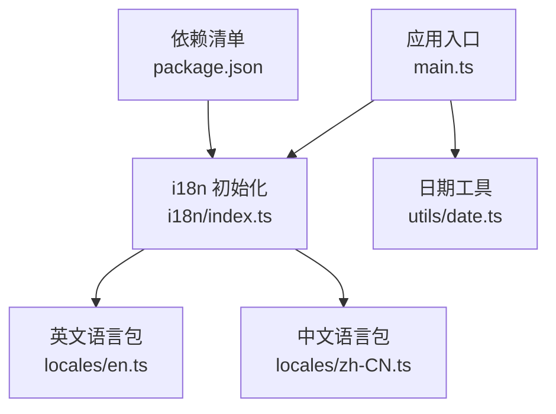
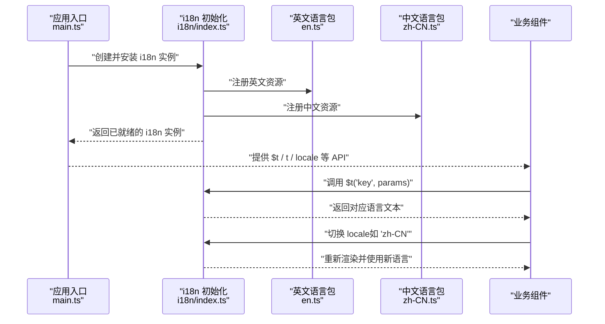
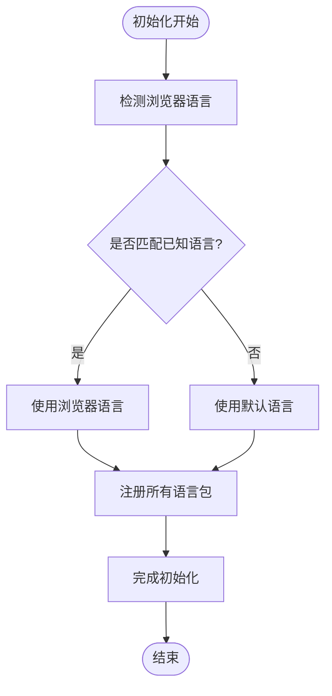
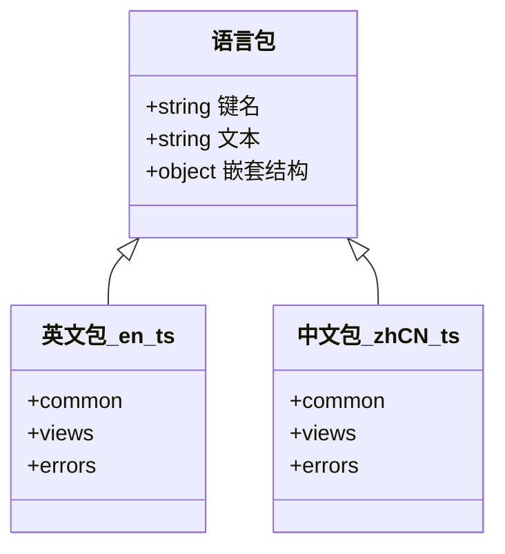
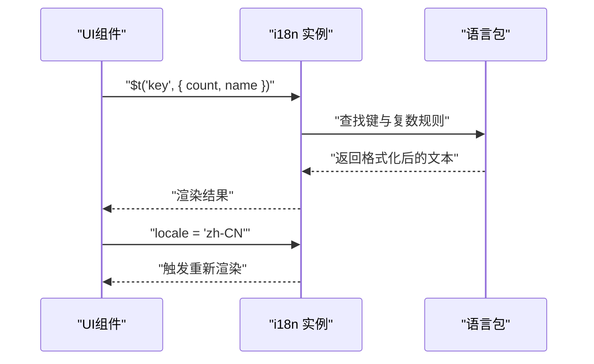
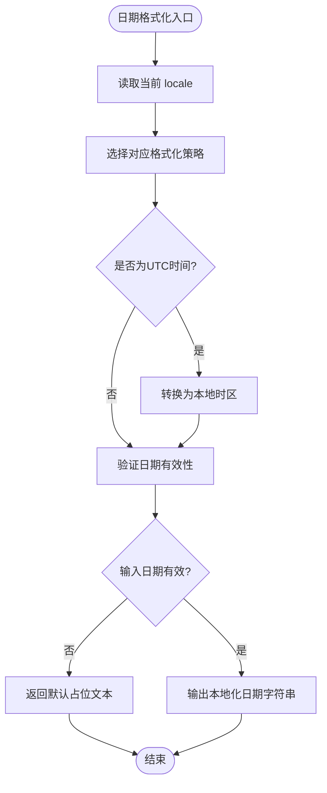
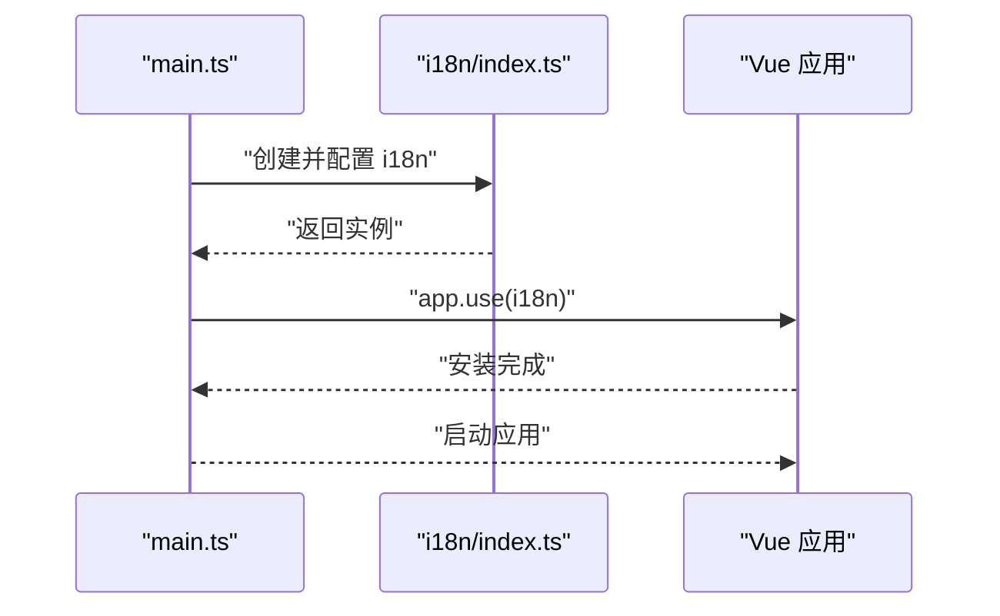
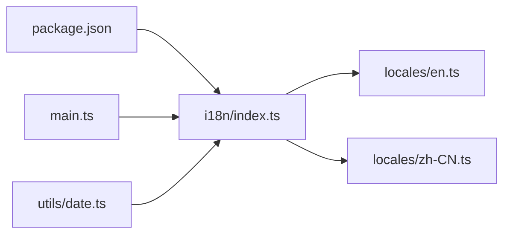

# 国际化支持

<cite>
**本文引用的文件**   
- [frontend/src/i18n/index.ts](file://frontend/src/i18n/index.ts)
- [frontend/src/i18n/locales/en.ts](file://frontend/src/i18n/locales/en.ts)
- [frontend/src/i18n/locales/zh-CN.ts](file://frontend/src/i18n/locales/zh-CN.ts)
- [frontend/src/main.ts](file://frontend/src/main.ts)
- [frontend/package.json](file://frontend/package.json)
- [frontend/src/utils/date.ts](file://frontend/src/utils/date.ts)
</cite>

## 更新摘要
**变更内容**   
- 更新了日期时间本地化部分，重点说明UTC时间处理修复
- 增强了全球用户群体的时区兼容性说明
- 完善了日期格式化工具的时区处理机制

## 目录
1. [简介](#简介)
2. [项目结构](#项目结构)
3. [核心组件](#核心组件)
4. [架构总览](#架构总览)
5. [详细组件分析](#详细组件分析)
6. [依赖关系分析](#依赖关系分析)
7. [性能考虑](#性能考虑)
8. [故障排查指南](#故障排查指南)
9. [结论](#结论)
10. [附录](#附录)

## 简介
本文件面向AdventureX项目的国际化（i18n）能力，系统性说明多语言环境的配置方法、翻译文件的组织结构与本地化策略；详述i18n库的使用方式、动态语言切换与消息格式化；解释翻译键值管理、复数形式处理与日期时间本地化；并提供新增语言的步骤、翻译工作流程与质量检查机制。文档同时给出最佳实践与常见问题解决方案，帮助开发者快速上手并长期维护高质量的国际化内容。

**最新更新**：针对全球用户群体，特别强化了UTC时间处理与时区兼容性，确保应用程序在不同时区环境下都能正确显示日期时间信息。

## 项目结构
前端采用基于Vue的模块化组织，i18n相关代码集中在frontend/src/i18n目录下：
- i18n入口与初始化：frontend/src/i18n/index.ts
- 语言包：frontend/src/i18n/locales/en.ts、frontend/src/i18n/locales/zh-CN.ts
- 应用启动时挂载i18n插件：frontend/src/main.ts
- 日期时间本地化工具：frontend/src/utils/date.ts
- 依赖声明：frontend/package.json

**图表来源** 
- [frontend/src/main.ts](file://frontend/src/main.ts)
- [frontend/src/i18n/index.ts](file://frontend/src/i18n/index.ts)
- [frontend/src/i18n/locales/en.ts](file://frontend/src/i18n/locales/en.ts)
- [frontend/src/i18n/locales/zh-CN.ts](file://frontend/src/i18n/locales/zh-CN.ts)
- [frontend/src/utils/date.ts](file://frontend/src/utils/date.ts)
- [frontend/package.json](file://frontend/package.json)

**章节来源**
- [frontend/src/i18n/index.ts](file://frontend/src/i18n/index.ts)
- [frontend/src/i18n/locales/en.ts](file://frontend/src/i18n/locales/en.ts)
- [frontend/src/i18n/locales/zh-CN.ts](file://frontend/src/i18n/locales/zh-CN.ts)
- [frontend/src/main.ts](file://frontend/src/main.ts)
- [frontend/package.json](file://frontend/package.json)
- [frontend/src/utils/date.ts](file://frontend/src/utils/date.ts)

## 核心组件
- i18n初始化模块：负责创建i18n实例、注册语言包、设置默认语言与检测浏览器语言、暴露$t等API供组件使用。
- 语言包：按语言分文件组织，包含界面文案、提示语、表单校验信息等，建议以命名空间或层级键组织，便于检索与维护。
- 应用集成：在应用启动阶段安装i18n插件，确保全局可用。
- 日期时间本地化：封装日期格式化工具，结合当前语言环境输出符合区域习惯的日期时间字符串，**现已增强UTC时间处理能力**。

**章节来源**
- [frontend/src/i18n/index.ts](file://frontend/src/i18n/index.ts)
- [frontend/src/i18n/locales/en.ts](file://frontend/src/i18n/locales/en.ts)
- [frontend/src/i18n/locales/zh-CN.ts](file://frontend/src/i18n/locales/zh-CN.ts)
- [frontend/src/utils/date.ts](file://frontend/src/utils/date.ts)

## 架构总览
下图展示了从应用启动到语言资源加载与使用的整体流程，以及组件如何获取翻译与进行动态切换。

**图表来源** 
- [frontend/src/main.ts](file://frontend/src/main.ts)
- [frontend/src/i18n/index.ts](file://frontend/src/i18n/index.ts)
- [frontend/src/i18n/locales/en.ts](file://frontend/src/i18n/locales/en.ts)
- [frontend/src/i18n/locales/zh-CN.ts](file://frontend/src/i18n/locales/zh-CN.ts)

## 详细组件分析

### i18n 初始化与配置
- 职责：创建i18n实例、注册语言包、设置默认语言、根据浏览器语言自动选择、导出$t/t/locale等API。
- 关键点：
  - 语言包注册：为每种语言定义独立的资源对象，避免键冲突。
  - 默认语言与回退：当检测到未知语言或缺失键时，应回退到默认语言。
  - 运行时切换：通过修改locale属性实现即时切换，组件响应式更新。
  - 调试模式：开发环境下可开启缺失键提示，便于发现未翻译内容。

**图表来源** 
- [frontend/src/i18n/index.ts](file://frontend/src/i18n/index.ts)

**章节来源**
- [frontend/src/i18n/index.ts](file://frontend/src/i18n/index.ts)

### 语言包结构与组织
- 文件划分：按语言拆分文件，如en.ts、zh-CN.ts，便于独立维护与增量更新。
- 键值设计：建议使用层级化键名（如“common.xxx”、“views.dashboard.xxx”），提高可读性与定位效率。
- 内容范围：涵盖界面文案、提示信息、错误信息、占位符、按钮文本等。
- 版本与迁移：新增字段需同步至所有语言包，缺失键应在开发期告警。

**图表来源** 
- [frontend/src/i18n/locales/en.ts](file://frontend/src/i18n/locales/en.ts)
- [frontend/src/i18n/locales/zh-CN.ts](file://frontend/src/i18n/locales/zh-CN.ts)

**章节来源**
- [frontend/src/i18n/locales/en.ts](file://frontend/src/i18n/locales/en.ts)
- [frontend/src/i18n/locales/zh-CN.ts](file://frontend/src/i18n/locales/zh-CN.ts)

### 动态语言切换与消息格式化
- 切换流程：组件调用locale setter，触发响应式更新，所有使用$t/t的组件立即刷新显示。
- 参数化文本：支持在翻译键中插入变量（如用户名称、数量），通过参数对象注入。
- 复数形式：根据数值自动选择单复数表达，避免硬编码分支逻辑。
- 条件文本：根据布尔或枚举值选择不同文案，保持模板简洁。

**图表来源** 
- [frontend/src/i18n/index.ts](file://frontend/src/i18n/index.ts)
- [frontend/src/i18n/locales/en.ts](file://frontend/src/i18n/locales/en.ts)
- [frontend/src/i18n/locales/zh-CN.ts](file://frontend/src/i18n/locales/zh-CN.ts)

**章节来源**
- [frontend/src/i18n/index.ts](file://frontend/src/i18n/index.ts)
- [frontend/src/i18n/locales/en.ts](file://frontend/src/i18n/locales/en.ts)
- [frontend/src/i18n/locales/zh-CN.ts](file://frontend/src/i18n/locales/zh-CN.ts)

### 日期时间本地化

**更新**：增强了UTC时间处理功能，改进了应用程序中的日期/时间处理，这对全球用户群体至关重要。

- 目标：根据当前语言环境输出符合区域习惯的日期时间格式（如年月日顺序、分隔符、星期名称）。
- 实现要点：
  - 统一封装日期格式化函数，内部根据locale选择格式化策略。
  - **新增UTC时间处理**：支持UTC时间的正确解析和转换，确保跨时区一致性。
  - 支持相对时间、绝对时间与自定义格式。
  - 对无效日期进行容错处理，避免崩溃。
  - **时区兼容性**：自动检测用户时区并转换为本地时间显示。

**图表来源** 
- [frontend/src/utils/date.ts](file://frontend/src/utils/date.ts)

**章节来源**
- [frontend/src/utils/date.ts](file://frontend/src/utils/date.ts)

### 应用集成与入口挂载
- 在应用启动时安装i18n插件，确保全局可用。
- 将i18n实例挂载到Vue应用上下文，使组件可通过$t/t访问翻译API。
- 可选：在路由守卫或页面级组件中根据用户偏好或后端配置切换语言。

**图表来源** 
- [frontend/src/main.ts](file://frontend/src/main.ts)
- [frontend/src/i18n/index.ts](file://frontend/src/i18n/index.ts)

**章节来源**
- [frontend/src/main.ts](file://frontend/src/main.ts)
- [frontend/src/i18n/index.ts](file://frontend/src/i18n/index.ts)

## 依赖关系分析
- 运行时依赖：i18n库由package.json声明，确保版本稳定与兼容性。
- 模块依赖：i18n初始化模块依赖各语言包；应用入口依赖i18n初始化模块；日期工具依赖当前locale。
- 潜在风险：若语言包缺失键或键名不一致，可能导致运行时回退或显示异常；建议在开发期启用缺失键检测。

**图表来源** 
- [frontend/package.json](file://frontend/package.json)
- [frontend/src/i18n/index.ts](file://frontend/src/i18n/index.ts)
- [frontend/src/i18n/locales/en.ts](file://frontend/src/i18n/locales/en.ts)
- [frontend/src/i18n/locales/zh-CN.ts](file://frontend/src/i18n/locales/zh-CN.ts)
- [frontend/src/main.ts](file://frontend/src/main.ts)
- [frontend/src/utils/date.ts](file://frontend/src/utils/date.ts)

**章节来源**
- [frontend/package.json](file://frontend/package.json)
- [frontend/src/i18n/index.ts](file://frontend/src/i18n/index.ts)
- [frontend/src/main.ts](file://frontend/src/main.ts)
- [frontend/src/utils/date.ts](file://frontend/src/utils/date.ts)

## 性能考虑
- 按需加载语言包：对于大型应用，可按路由或功能模块懒加载语言资源，减少首屏体积。
- 缓存策略：对常用翻译键进行内存缓存，避免重复解析。
- 避免频繁切换：批量更新locale，减少不必要的重渲染。
- 日期格式化优化：复用格式化器实例，避免重复创建。
- **UTC处理优化**：缓存时区转换结果，减少重复计算开销。

[本节为通用指导，不直接分析具体文件]

## 故障排查指南
- 症状：界面显示原始键名或未翻译文本
  - 可能原因：语言包未注册、键名拼写错误、运行时locale未正确设置
  - 解决步骤：检查i18n初始化是否成功；确认语言包中包含该键；验证locale值是否为已知语言
- 症状：切换语言后部分组件未更新
  - 可能原因：非响应式数据绑定、静态文本未使用$t/t
  - 解决步骤：确保所有文案通过$t/t获取；检查数据绑定是否为响应式
- 症状：日期时间格式不符合预期
  - 可能原因：locale未生效、日期工具未传入正确参数、**UTC时间处理异常**
  - 解决步骤：确认当前locale；检查日期工具的调用方式与参数；验证UTC时间转换逻辑
- **新增问题**：跨时区显示错误
  - 可能原因：UTC时间未正确转换、时区信息丢失
  - 解决步骤：检查日期对象的时区属性；验证时区转换函数的调用

**章节来源**
- [frontend/src/i18n/index.ts](file://frontend/src/i18n/index.ts)
- [frontend/src/utils/date.ts](file://frontend/src/utils/date.ts)

## 结论
本文件系统梳理了AdventureX前端的国际化实现与使用方式，涵盖配置、组织、动态切换、格式化与日期本地化等关键环节。**最新版本的UTC时间处理修复显著提升了全球用户的时区兼容性**，确保应用程序在不同地区都能正确显示日期时间信息。遵循本文档的最佳实践与工作流，可有效提升多语言内容的质量与可维护性，降低国际化带来的开发与运维成本。

[本节为总结性内容，不直接分析具体文件]

## 附录

### 新增语言步骤
- 创建语言包文件：在locales目录下新增对应语言的文件（如ja.ts）。
- 注册语言包：在i18n初始化模块中导入并注册新语言包。
- 设置默认语言与检测：如需支持自动检测，更新语言检测逻辑。
- 同步键值：确保新语言包包含所有必要键，缺失键在开发期告警。
- 测试验证：切换语言并检查界面显示与行为是否符合预期。

**章节来源**
- [frontend/src/i18n/index.ts](file://frontend/src/i18n/index.ts)
- [frontend/src/i18n/locales/en.ts](file://frontend/src/i18n/locales/en.ts)
- [frontend/src/i18n/locales/zh-CN.ts](file://frontend/src/i18n/locales/zh-CN.ts)

### 翻译工作流程
- 需求评审：确定需要国际化的文案范围与优先级。
- 键值设计：制定统一的键名规范与层级结构。
- 翻译执行：按语言包分工翻译，确保术语一致。
- 代码集成：在组件中使用$t/t替换硬编码文本。
- 质量检查：运行缺失键检测与视觉走查，修复问题。
- 发布上线：合并变更并进行回归测试。

[本节为流程性内容，不直接分析具体文件]

### 质量检查机制
- 缺失键检测：在开发模式下启用缺失键提示，及时发现问题。
- 一致性校验：对比不同语言包的键集合，确保同步。
- 自动化脚本：编写脚本扫描未使用或冗余的键，清理历史遗留。
- 人工审查：关键文案需经母语者审核，保证表达自然准确。

**章节来源**
- [frontend/src/i18n/index.ts](file://frontend/src/i18n/index.ts)

### 国际化最佳实践
- 键名清晰：使用语义化、层级化的键名，避免缩写与歧义。
- 参数化：尽量使用参数化文本，减少分支与重复。
- 复数与性别：利用i18n库的复数与性别规则，避免硬编码。
- 文化适配：注意数字、货币、日期时间的区域差异。
- 渐进式推进：优先覆盖核心路径，逐步扩展至长尾页面。
- **时区处理**：始终使用UTC存储时间，在展示时转换为本地时区。

[本节为通用指导，不直接分析具体文件]

### 常见问题解决方案
- 问：如何在不重启应用的情况下切换语言？
  - 答：直接修改locale属性，组件会响应式更新。
- 问：如何处理动态内容（如用户生成内容）的本地化？
  - 答：在后端返回多语言字段或在客户端根据locale选择展示。
- 问：如何避免首屏加载过大？
  - 答：采用按需加载语言包与路由级懒加载。
- **问：如何处理跨时区的日期时间显示？**
  - 答：使用UTC时间存储，在前端根据用户时区转换为本地时间显示。
- **问：UTC时间转换出现错误怎么办？**
  - 答：检查日期对象的时区属性，确保使用正确的时区转换函数。

[本节为通用问答，不直接分析具体文件]