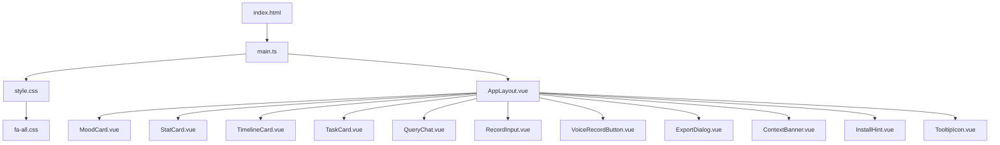
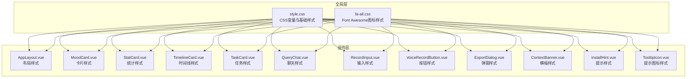
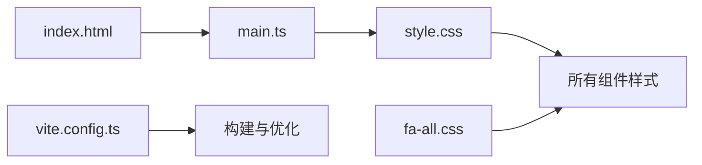

# 样式主题

<cite>
**本文引用的文件**   
- [frontend/src/style.css](file://frontend/src/style.css)
- [frontend/src/assets/fa-all.css](file://frontend/src/assets/fa-all.css)
- [frontend/index.html](file://frontend/index.html)
- [frontend/src/main.ts](file://frontend/src/main.ts)
- [frontend/package.json](file://frontend/package.json)
- [frontend/vite.config.ts](file://frontend/vite.config.ts)
- [frontend/src/components/AppLayout.vue](file://frontend/src/components/AppLayout.vue)
- [frontend/src/components/MoodCard.vue](file://frontend/src/components/MoodCard.vue)
- [frontend/src/components/StatCard.vue](file://frontend/src/components/StatCard.vue)
- [frontend/src/components/TimelineCard.vue](file://frontend/src/components/TimelineCard.vue)
- [frontend/src/components/TaskCard.vue](file://frontend/src/components/TaskCard.vue)
- [frontend/src/components/QueryChat.vue](file://frontend/src/components/QueryChat.vue)
- [frontend/src/components/RecordInput.vue](file://frontend/src/components/RecordInput.vue)
- [frontend/src/components/VoiceRecordButton.vue](file://frontend/src/components/VoiceRecordButton.vue)
- [frontend/src/components/ExportDialog.vue](file://frontend/src/components/ExportDialog.vue)
- [frontend/src/components/ContextBanner.vue](file://frontend/src/components/ContextBanner.vue)
- [frontend/src/components/InstallHint.vue](file://frontend/src/components/InstallHint.vue)
- [frontend/src/components/TooltipIcon.vue](file://frontend/src/components/TooltipIcon.vue)
</cite>

## 目录
1. [简介](#简介)
2. [项目结构](#项目结构)
3. [核心组件](#核心组件)
4. [架构总览](#架构总览)
5. [详细组件分析](#详细组件分析)
6. [依赖分析](#依赖分析)
7. [性能考虑](#性能考虑)
8. [故障排查指南](#故障排查指南)
9. [结论](#结论)
10. [附录](#附录)

## 简介
本文件面向AdventureX前端项目的样式主题体系，系统性阐述CSS架构设计、样式组织原则与主题定制方案。内容覆盖全局样式变量、组件样式规范、响应式设计策略、Font Awesome图标库使用、自定义样式开发、浏览器兼容性处理、样式性能优化、CSS模块化方案以及主题切换机制。同时提供样式开发规范与调试技巧，帮助开发者快速上手并高效维护主题。

## 项目结构
前端采用Vite + Vue工程化方案，样式以CSS为主，结合Vue单文件组件的scoped样式进行模块化管理。关键样式相关文件如下：
- 全局样式入口：frontend/src/style.css
- Font Awesome图标样式：frontend/src/assets/fa-all.css
- 应用入口与资源引入：frontend/index.html、frontend/src/main.ts
- Vite构建配置：frontend/vite.config.ts
- 业务组件样式：各组件.vue中的<style>块

**图表来源** 
- [frontend/index.html](file://frontend/index.html)
- [frontend/src/main.ts](file://frontend/src/main.ts)
- [frontend/src/style.css](file://frontend/src/style.css)
- [frontend/src/assets/fa-all.css](file://frontend/src/assets/fa-all.css)
- [frontend/src/components/AppLayout.vue](file://frontend/src/components/AppLayout.vue)

**章节来源**
- [frontend/index.html](file://frontend/index.html)
- [frontend/src/main.ts](file://frontend/src/main.ts)
- [frontend/src/style.css](file://frontend/src/style.css)
- [frontend/src/assets/fa-all.css](file://frontend/src/assets/fa-all.css)
- [frontend/vite.config.ts](file://frontend/vite.config.ts)

## 核心组件
以下组件承担页面布局与主要交互，其样式通过scoped CSS实现模块隔离，便于主题定制与维护：
- AppLayout：应用整体布局容器，定义栅格、边距、导航与主内容区
- MoodCard：情绪卡片，展示情绪信息与视觉反馈
- StatCard：统计卡片，用于数据概览
- TimelineCard：时间线卡片，呈现事件序列
- TaskCard：任务卡片，展示任务状态与操作
- QueryChat：查询对话界面，包含输入与消息列表
- RecordInput：录音输入控件，支持语音采集
- VoiceRecordButton：录音按钮，提供录制控制
- ExportDialog：导出对话框，管理导出选项
- ContextBanner：上下文横幅，显示提示或状态信息
- InstallHint：安装提示，引导用户安装PWA
- TooltipIcon：工具提示图标，提供辅助说明

这些组件的样式遵循统一的设计令牌（颜色、字号、间距、圆角、阴影等），并通过CSS变量在主题层集中管理。

**章节来源**
- [frontend/src/components/AppLayout.vue](file://frontend/src/components/AppLayout.vue)
- [frontend/src/components/MoodCard.vue](file://frontend/src/components/MoodCard.vue)
- [frontend/src/components/StatCard.vue](file://frontend/src/components/StatCard.vue)
- [frontend/src/components/TimelineCard.vue](file://frontend/src/components/TimelineCard.vue)
- [frontend/src/components/TaskCard.vue](file://frontend/src/components/TaskCard.vue)
- [frontend/src/components/QueryChat.vue](file://frontend/src/components/QueryChat.vue)
- [frontend/src/components/RecordInput.vue](file://frontend/src/components/RecordInput.vue)
- [frontend/src/components/VoiceRecordButton.vue](file://frontend/src/components/VoiceRecordButton.vue)
- [frontend/src/components/ExportDialog.vue](file://frontend/src/components/ExportDialog.vue)
- [frontend/src/components/ContextBanner.vue](file://frontend/src/components/ContextBanner.vue)
- [frontend/src/components/InstallHint.vue](file://frontend/src/components/InstallHint.vue)
- [frontend/src/components/TooltipIcon.vue](file://frontend/src/components/TooltipIcon.vue)

## 架构总览
样式架构采用“全局变量 + 组件scoped样式”的分层模式：
- 全局层：定义CSS变量（颜色、字体、间距、断点等）与基础重置样式
- 组件层：每个组件使用scoped样式，避免样式泄漏，提升可维护性
- 图标层：通过Font Awesome统一图标风格，确保跨组件一致性
- 构建层：Vite负责样式资源的打包与优化

**图表来源** 
- [frontend/src/style.css](file://frontend/src/style.css)
- [frontend/src/assets/fa-all.css](file://frontend/src/assets/fa-all.css)
- [frontend/src/components/AppLayout.vue](file://frontend/src/components/AppLayout.vue)
- [frontend/src/components/MoodCard.vue](file://frontend/src/components/MoodCard.vue)
- [frontend/src/components/StatCard.vue](file://frontend/src/components/StatCard.vue)
- [frontend/src/components/TimelineCard.vue](file://frontend/src/components/TimelineCard.vue)
- [frontend/src/components/TaskCard.vue](file://frontend/src/components/TaskCard.vue)
- [frontend/src/components/QueryChat.vue](file://frontend/src/components/QueryChat.vue)
- [frontend/src/components/RecordInput.vue](file://frontend/src/components/RecordInput.vue)
- [frontend/src/components/VoiceRecordButton.vue](file://frontend/src/components/VoiceRecordButton.vue)
- [frontend/src/components/ExportDialog.vue](file://frontend/src/components/ExportDialog.vue)
- [frontend/src/components/ContextBanner.vue](file://frontend/src/components/ContextBanner.vue)
- [frontend/src/components/InstallHint.vue](file://frontend/src/components/InstallHint.vue)
- [frontend/src/components/TooltipIcon.vue](file://frontend/src/components/TooltipIcon.vue)

## 详细组件分析
### 全局样式与主题变量
- 设计令牌：在style.css中集中定义颜色、字体、间距、圆角、阴影、过渡等变量，供组件复用
- 基础重置：统一浏览器默认样式差异，保证一致渲染
- 响应式断点：通过媒体查询定义移动端、平板、桌面等断点，支撑自适应布局

**章节来源**
- [frontend/src/style.css](file://frontend/src/style.css)

### Font Awesome图标使用
- 图标样式由fa-all.css提供，所有组件通过统一的类名引用图标
- 建议将图标作为独立样式层，避免与业务样式耦合
- 按需加载：若体积过大，可在后续优化为按需引入以减少包体

**章节来源**
- [frontend/src/assets/fa-all.css](file://frontend/src/assets/fa-all.css)

### 组件样式规范
- 命名约定：组件样式使用BEM或类似命名法，保持可读性与可维护性
- Scoped样式：每个组件使用scoped，防止样式污染
- 主题适配：组件内不直接写死颜色值，而是引用CSS变量，便于主题切换

**章节来源**
- [frontend/src/components/AppLayout.vue](file://frontend/src/components/AppLayout.vue)
- [frontend/src/components/MoodCard.vue](file://frontend/src/components/MoodCard.vue)
- [frontend/src/components/StatCard.vue](file://frontend/src/components/StatCard.vue)
- [frontend/src/components/TimelineCard.vue](file://frontend/src/components/TimelineCard.vue)
- [frontend/src/components/TaskCard.vue](file://frontend/src/components/TaskCard.vue)
- [frontend/src/components/QueryChat.vue](file://frontend/src/components/QueryChat.vue)
- [frontend/src/components/RecordInput.vue](file://frontend/src/components/RecordInput.vue)
- [frontend/src/components/VoiceRecordButton.vue](file://frontend/src/components/VoiceRecordButton.vue)
- [frontend/src/components/ExportDialog.vue](file://frontend/src/components/ExportDialog.vue)
- [frontend/src/components/ContextBanner.vue](file://frontend/src/components/ContextBanner.vue)
- [frontend/src/components/InstallHint.vue](file://frontend/src/components/InstallHint.vue)
- [frontend/src/components/TooltipIcon.vue](file://frontend/src/components/TooltipIcon.vue)

### 响应式设计策略
- 移动优先：从移动端布局出发，逐步增强到平板与桌面端
- 弹性布局：使用flex/grid实现自适应排列
- 媒体查询：在style.css中统一定义断点，组件内仅做局部微调

**章节来源**
- [frontend/src/style.css](file://frontend/src/style.css)

### 主题切换机制
- 变量驱动：通过CSS变量集中管理主题色、背景、文字等，运行时切换根节点class或data属性即可生效
- 持久化：可将主题选择保存到本地存储，页面加载时恢复
- 平滑过渡：为常用属性添加transition，提升切换体验

**章节来源**
- [frontend/src/style.css](file://frontend/src/style.css)

## 依赖分析
样式依赖关系清晰，全局样式被所有组件共享，Font Awesome图标样式作为独立层被广泛引用。Vite构建流程将样式资源打包并优化。

**图表来源** 
- [frontend/src/style.css](file://frontend/src/style.css)
- [frontend/src/assets/fa-all.css](file://frontend/src/assets/fa-all.css)
- [frontend/src/main.ts](file://frontend/src/main.ts)
- [frontend/index.html](file://frontend/index.html)
- [frontend/vite.config.ts](file://frontend/vite.config.ts)

**章节来源**
- [frontend/package.json](file://frontend/package.json)
- [frontend/vite.config.ts](file://frontend/vite.config.ts)

## 性能考虑
- 减少重复样式：通过CSS变量与公共类复用样式，降低冗余
- 按需加载图标：评估是否可从全量图标切换到按需引入，减小首屏体积
- 压缩与缓存：利用Vite构建优化，启用CSS压缩与长期缓存策略
- 避免过度嵌套：保持选择器简洁，提高渲染性能
- 懒加载非关键样式：对非首屏可见的组件样式进行延迟加载

[本节为通用指导，无需特定文件来源]

## 故障排查指南
- 样式未生效：检查组件是否正确使用scoped，确认CSS变量作用域与继承
- 图标不显示：确认fa-all.css已正确引入，检查类名拼写与字体路径
- 主题切换无效：验证根节点class或data属性是否正确更新，检查变量覆盖优先级
- 响应式异常：检查媒体查询断点与组件布局冲突，使用浏览器开发者工具调试

**章节来源**
- [frontend/src/style.css](file://frontend/src/style.css)
- [frontend/src/assets/fa-all.css](file://frontend/src/assets/fa-all.css)

## 结论
AdventureX的样式主题体系以CSS变量为核心，结合组件scoped样式与Font Awesome图标库，实现了清晰的分层与良好的可维护性。通过统一的设计令牌与响应式策略，主题定制与多端适配得以高效实现。建议在后续迭代中进一步优化图标加载与样式体积，持续提升性能与用户体验。

[本节为总结性内容，无需特定文件来源]

## 附录
- 样式开发规范：统一命名、变量优先、避免硬编码、保持选择器简洁
- 调试技巧：使用浏览器开发者工具检查样式计算、变量值与作用域；通过控制台动态修改CSS变量预览效果
- 主题定制步骤：定义新变量集 → 切换根节点标识 → 验证组件表现 → 持久化设置

[本节为补充说明，无需特定文件来源]