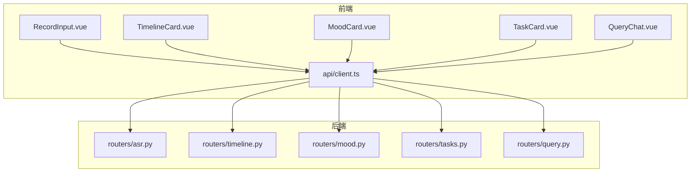
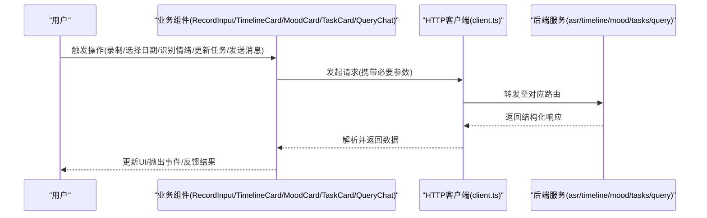
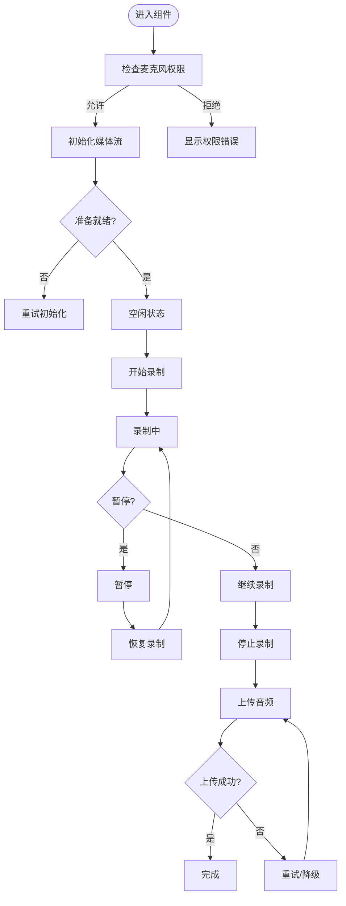
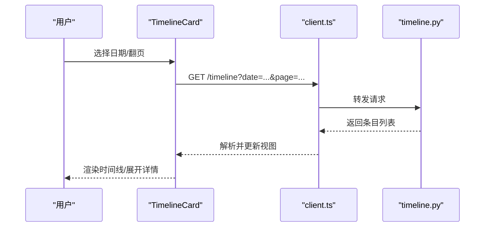
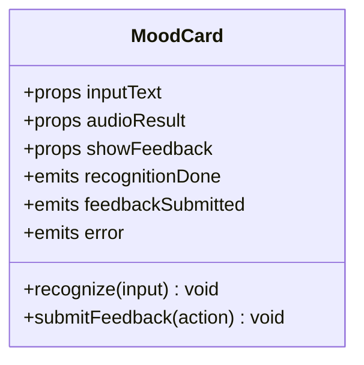
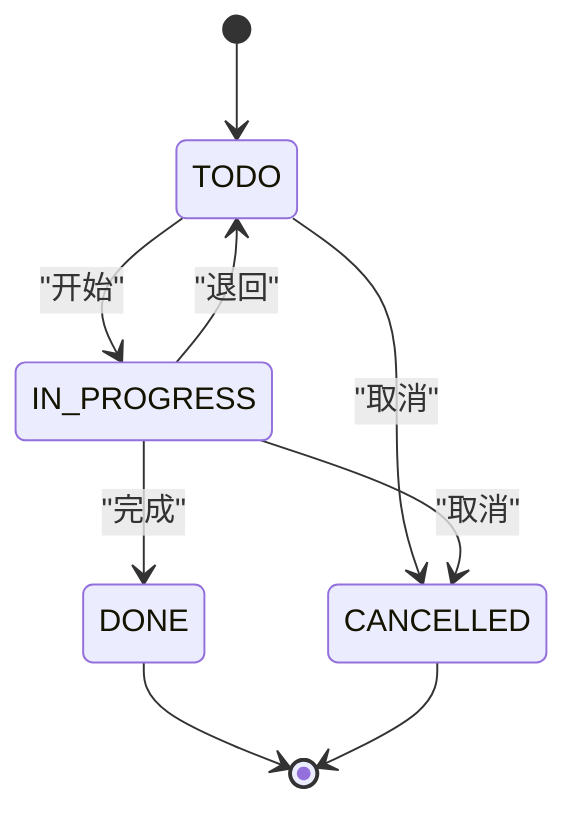
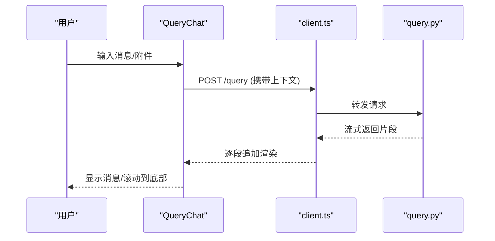
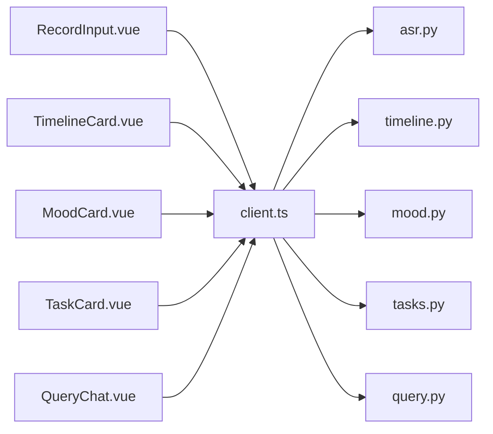

# 业务组件

<cite>
**本文引用的文件**   
- [RecordInput.vue](file://frontend/src/components/RecordInput.vue)
- [TimelineCard.vue](file://frontend/src/components/TimelineCard.vue)
- [MoodCard.vue](file://frontend/src/components/MoodCard.vue)
- [TaskCard.vue](file://frontend/src/components/TaskCard.vue)
- [QueryChat.vue](file://frontend/src/components/QueryChat.vue)
- [client.ts](file://frontend/src/api/client.ts)
- [asr.py](file://backend/routers/asr.py)
- [timeline.py](file://backend/routers/timeline.py)
- [mood.py](file://backend/routers/mood.py)
- [tasks.py](file://backend/routers/tasks.py)
- [query.py](file://backend/routers/query.py)
</cite>

## 目录
1. [简介](#简介)
2. [项目结构](#项目结构)
3. [核心组件](#核心组件)
4. [架构总览](#架构总览)
5. [详细组件分析](#详细组件分析)
6. [依赖分析](#依赖分析)
7. [性能考虑](#性能考虑)
8. [故障排查指南](#故障排查指南)
9. [结论](#结论)
10. [附录](#附录)

## 简介
本文件面向AdventureX的前端业务组件与后端API，系统性说明以下五个核心组件的功能、接口、事件、数据绑定与使用方式：
- RecordInput（录音输入）：音频录制、波形显示、状态管理
- TimelineCard（时间线卡片）：日期展示、内容组织、交互逻辑
- MoodCard（情绪卡片）：情绪识别、可视化展示、用户反馈
- TaskCard（任务卡片）：任务管理、进度跟踪、状态变更
- QueryChat（查询聊天）：对话界面、消息处理、实时交互

文档同时给出前后端交互流程、错误处理策略与性能优化建议，帮助开发者快速集成与扩展。

## 项目结构
前端采用Vue单文件组件组织业务功能，通过统一的HTTP客户端访问后端REST API；后端以路由模块划分领域能力，提供ASR、时间线、情绪、任务、查询等接口。

图表来源
- [RecordInput.vue](file://frontend/src/components/RecordInput.vue)
- [TimelineCard.vue](file://frontend/src/components/TimelineCard.vue)
- [MoodCard.vue](file://frontend/src/components/MoodCard.vue)
- [TaskCard.vue](file://frontend/src/components/TaskCard.vue)
- [QueryChat.vue](file://frontend/src/components/QueryChat.vue)
- [client.ts](file://frontend/src/api/client.ts)
- [asr.py](file://backend/routers/asr.py)
- [timeline.py](file://backend/routers/timeline.py)
- [mood.py](file://backend/routers/mood.py)
- [tasks.py](file://backend/routers/tasks.py)
- [query.py](file://backend/routers/query.py)

章节来源
- [RecordInput.vue](file://frontend/src/components/RecordInput.vue)
- [TimelineCard.vue](file://frontend/src/components/TimelineCard.vue)
- [MoodCard.vue](file://frontend/src/components/MoodCard.vue)
- [TaskCard.vue](file://frontend/src/components/TaskCard.vue)
- [QueryChat.vue](file://frontend/src/components/QueryChat.vue)
- [client.ts](file://frontend/src/api/client.ts)
- [asr.py](file://backend/routers/asr.py)
- [timeline.py](file://backend/routers/timeline.py)
- [mood.py](file://backend/routers/mood.py)
- [tasks.py](file://backend/routers/tasks.py)
- [query.py](file://backend/routers/query.py)

## 核心组件
本节概述各组件的职责边界与对外暴露的契约（Props、Emits、方法、事件），并指出关键的数据流与状态点。

- RecordInput
  - 职责：采集麦克风音频、生成波形、上传音频片段、维护录制状态
  - 关键状态：是否正在录制、是否暂停、波形数据、错误信息
  - 对外事件：开始录制、停止录制、上传完成、错误回调
  - 数据绑定：波形数组、录音时长、音频URL或二进制数据

- TimelineCard
  - 职责：按日期聚合展示条目、支持展开/折叠、点击跳转详情
  - 关键状态：当前日期、条目列表、加载态、错误态
  - 对外事件：选择日期、切换条目、请求刷新
  - 数据绑定：日期字符串、条目数组、分页参数

- MoodCard
  - 职责：基于文本或语音结果识别情绪、渲染可视化、收集用户反馈
  - 关键状态：情绪标签、置信度、可视化配置、反馈结果
  - 对外事件：识别完成、反馈提交、错误回调
  - 数据绑定：情绪对象、可视化数据、反馈字段

- TaskCard
  - 职责：展示任务项、更新进度、切换状态、触发提醒
  - 关键状态：任务元数据、进度百分比、状态枚举、操作历史
  - 对外事件：进度更新、状态变更、删除确认
  - 数据绑定：任务ID、标题、描述、截止日期、进度、状态

- QueryChat
  - 职责：构建对话界面、发送消息、接收回复、流式渲染
  - 关键状态：消息列表、输入框内容、发送中、错误提示
  - 对外事件：发送消息、收到回复、错误通知
  - 数据绑定：会话上下文、消息数组、滚动位置

章节来源
- [RecordInput.vue](file://frontend/src/components/RecordInput.vue)
- [TimelineCard.vue](file://frontend/src/components/TimelineCard.vue)
- [MoodCard.vue](file://frontend/src/components/MoodCard.vue)
- [TaskCard.vue](file://frontend/src/components/TaskCard.vue)
- [QueryChat.vue](file://frontend/src/components/QueryChat.vue)

## 架构总览
下图展示了从UI到后端的核心调用路径，以及数据在组件间的流转关系。

图表来源
- [client.ts](file://frontend/src/api/client.ts)
- [asr.py](file://backend/routers/asr.py)
- [timeline.py](file://backend/routers/timeline.py)
- [mood.py](file://backend/routers/mood.py)
- [tasks.py](file://backend/routers/tasks.py)
- [query.py](file://backend/routers/query.py)

## 详细组件分析

### RecordInput（录音输入）
- 功能要点
  - 音频录制：获取麦克风权限、采样率设置、分段录制
  - 波形显示：将PCM/AudioBuffer转换为幅度序列，绘制波形图
  - 状态管理：空闲/录制中/暂停/上传中/错误等状态机
  - 上传策略：分片上传或一次性上传，失败重试与断点续传
- 关键数据结构
  - 录制状态：isRecording、isPaused、uploading、error
  - 波形数据：amplitude[]、sampleRate、duration
  - 音频数据：blob/url、chunkId、retryCount
- 对外API与事件
  - Props：autoUpload、maxDuration、waveformSampleRate
  - Emits：start、stop、uploadSuccess、error
  - Methods：startRecord()、pauseRecord()、resumeRecord()、stopRecord()、uploadChunk()
- 错误处理
  - 权限拒绝、设备不可用、网络超时、服务端校验失败
- 性能优化
  - 按需采样降低CPU占用、Web Worker离线计算波形、节流上传频率

图表来源
- [RecordInput.vue](file://frontend/src/components/RecordInput.vue)
- [asr.py](file://backend/routers/asr.py)

章节来源
- [RecordInput.vue](file://frontend/src/components/RecordInput.vue)
- [asr.py](file://backend/routers/asr.py)

### TimelineCard（时间线卡片）
- 功能要点
  - 日期展示：年/月/日分组，默认展开当天
  - 内容组织：条目类型区分（记录/备注/任务），排序规则
  - 交互逻辑：点击展开详情、筛选类型、分页加载
- 关键数据结构
  - 日期键：YYYY-MM-DD
  - 条目：id、type、title、content、createdAt、tags
  - 分页：page、pageSize、hasMore
- 对外API与事件
  - Props：date、filterType、pageSize
  - Emits：selectItem、refresh、loadMore
  - Methods：fetchItems(date)、toggleExpand(id)、loadNextPage()
- 错误处理
  - 空数据、网络异常、分页越界
- 性能优化
  - 虚拟滚动长列表、缓存已加载日期、合并重复请求

图表来源
- [TimelineCard.vue](file://frontend/src/components/TimelineCard.vue)
- [client.ts](file://frontend/src/api/client.ts)
- [timeline.py](file://backend/routers/timeline.py)

章节来源
- [TimelineCard.vue](file://frontend/src/components/TimelineCard.vue)
- [timeline.py](file://backend/routers/timeline.py)

### MoodCard（情绪卡片）
- 功能要点
  - 情绪识别：基于文本或ASR结果进行情感分类
  - 可视化展示：仪表盘/色块/趋势图，展示置信度
  - 用户反馈：点赞/踩、修正标签、保存偏好
- 关键数据结构
  - 情绪：label、score、confidence、timestamp
  - 可视化：color、icon、trend[]
  - 反馈：userId、action、reason
- 对外API与事件
  - Props：inputText、audioResult、showFeedback
  - Emits：recognitionDone、feedbackSubmitted、error
  - Methods：recognize(text/audio)、submitFeedback(action)
- 错误处理
  - 模型不可用、输入为空、反馈冲突
- 性能优化
  - 本地缓存最近识别结果、防抖频繁识别、增量更新可视化

图表来源
- [MoodCard.vue](file://frontend/src/components/MoodCard.vue)
- [mood.py](file://backend/routers/mood.py)

章节来源
- [MoodCard.vue](file://frontend/src/components/MoodCard.vue)
- [mood.py](file://backend/routers/mood.py)

### TaskCard（任务卡片）
- 功能要点
  - 任务管理：创建/编辑/删除、附件与备注
  - 进度跟踪：百分比、里程碑、阻塞原因
  - 状态变更：待办/进行中/已完成/已取消，带审计日志
- 关键数据结构
  - 任务：id、title、description、dueDate、progress、status、history[]
  - 状态枚举：TODO、IN_PROGRESS、DONE、CANCELLED
- 对外API与事件
  - Props：taskId、readOnly
  - Emits：progressUpdate、statusChange、deleteConfirm
  - Methods：updateProgress(pct)、changeStatus(status)、deleteTask()
- 错误处理
  - 并发修改冲突、校验失败、权限不足
- 性能优化
  - 乐观更新+回滚、批量提交变更、去抖保存

图表来源
- [TaskCard.vue](file://frontend/src/components/TaskCard.vue)
- [tasks.py](file://backend/routers/tasks.py)

章节来源
- [TaskCard.vue](file://frontend/src/components/TaskCard.vue)
- [tasks.py](file://backend/routers/tasks.py)

### QueryChat（查询聊天）
- 功能要点
  - 对话界面：气泡样式、头像、时间戳、引用回复
  - 消息处理：发送文本/文件、富文本渲染、Markdown预览
  - 实时交互：流式输出、打字指示器、中断与重连
- 关键数据结构
  - 消息：role、content、attachments、timestamp、status
  - 会话：context、history、cursor
- 对外API与事件
  - Props：sessionId、autoScroll、streaming
  - Emits：sendMessage、receiveMessage、error
  - Methods：send(text/file)、appendChunk(chunk)、clearHistory()
- 错误处理
  - 连接断开、消息过大、格式不合法
- 性能优化
  - 虚拟列表渲染长对话、增量拼接流式数据、压缩附件传输

图表来源
- [QueryChat.vue](file://frontend/src/components/QueryChat.vue)
- [client.ts](file://frontend/src/api/client.ts)
- [query.py](file://backend/routers/query.py)

章节来源
- [QueryChat.vue](file://frontend/src/components/QueryChat.vue)
- [query.py](file://backend/routers/query.py)

## 依赖分析
组件间通过HTTP客户端统一访问后端路由，避免直接耦合。各组件仅依赖自身状态与API契约，便于替换实现与单元测试。

图表来源
- [RecordInput.vue](file://frontend/src/components/RecordInput.vue)
- [TimelineCard.vue](file://frontend/src/components/TimelineCard.vue)
- [MoodCard.vue](file://frontend/src/components/MoodCard.vue)
- [TaskCard.vue](file://frontend/src/components/TaskCard.vue)
- [QueryChat.vue](file://frontend/src/components/QueryChat.vue)
- [client.ts](file://frontend/src/api/client.ts)
- [asr.py](file://backend/routers/asr.py)
- [timeline.py](file://backend/routers/timeline.py)
- [mood.py](file://backend/routers/mood.py)
- [tasks.py](file://backend/routers/tasks.py)
- [query.py](file://backend/routers/query.py)

章节来源
- [client.ts](file://frontend/src/api/client.ts)
- [asr.py](file://backend/routers/asr.py)
- [timeline.py](file://backend/routers/timeline.py)
- [mood.py](file://backend/routers/mood.py)
- [tasks.py](file://backend/routers/tasks.py)
- [query.py](file://backend/routers/query.py)

## 性能考虑
- 录音与波形
  - 使用Web Audio API的AnalyserNode进行低延迟波形计算
  - 控制采样率与缓冲区大小，平衡精度与CPU占用
  - 大文件分片上传，配合断点续传提升稳定性
- 时间线与列表
  - 虚拟滚动减少DOM节点数量
  - 分页与懒加载，避免一次性拉取大量数据
  - 请求去抖与合并，降低服务器压力
- 情绪识别
  - 本地缓存最近结果，减少重复推理
  - 增量更新可视化，避免全量重绘
- 任务状态
  - 乐观更新与冲突检测，改善交互体验
  - 批量提交变更，减少网络往返
- 聊天对话
  - 流式渲染与增量拼接，降低首屏延迟
  - 虚拟列表与内存回收，防止长对话卡顿

[本节为通用指导，无需特定文件来源]

## 故障排查指南
- 录音相关
  - 权限被拒：检查浏览器授权与HTTPS环境
  - 设备不可用：切换默认设备或重启浏览器
  - 上传失败：检查网络、分片大小与服务端限制
- 时间线加载
  - 空数据：确认日期范围与过滤条件
  - 分页异常：校验page/pageSize与后端一致性
- 情绪识别
  - 输入为空：确保文本或音频有效
  - 模型不可用：检查后端服务健康状态
- 任务状态
  - 并发冲突：引入版本号或时间戳解决
  - 权限不足：核对用户角色与资源归属
- 聊天交互
  - 连接断开：实现自动重连与消息队列
  - 消息过大：压缩或分片传输

章节来源
- [RecordInput.vue](file://frontend/src/components/RecordInput.vue)
- [TimelineCard.vue](file://frontend/src/components/TimelineCard.vue)
- [MoodCard.vue](file://frontend/src/components/MoodCard.vue)
- [TaskCard.vue](file://frontend/src/components/TaskCard.vue)
- [QueryChat.vue](file://frontend/src/components/QueryChat.vue)

## 结论
上述五个业务组件覆盖了录音、时间线、情绪、任务与查询五大场景，形成完整的前端业务能力闭环。通过统一的HTTP客户端与清晰的事件契约，组件之间松耦合、易测试、可扩展。建议在后续迭代中持续完善错误处理、可观测性与国际化支持，以提升用户体验与系统稳定性。

[本节为总结性内容，无需特定文件来源]

## 附录
- 使用示例（概念性步骤）
  - RecordInput：挂载组件→绑定事件→监听上传完成→错误回退
  - TimelineCard：传入日期→监听选择事件→分页加载→展开详情
  - MoodCard：传入文本/音频→识别完成→展示可视化→收集反馈
  - TaskCard：传入任务ID→更新进度/状态→提交变更→审计记录
  - QueryChat：传入会话上下文→发送消息→流式渲染→错误重连

[本节为概念性说明，无需特定文件来源]