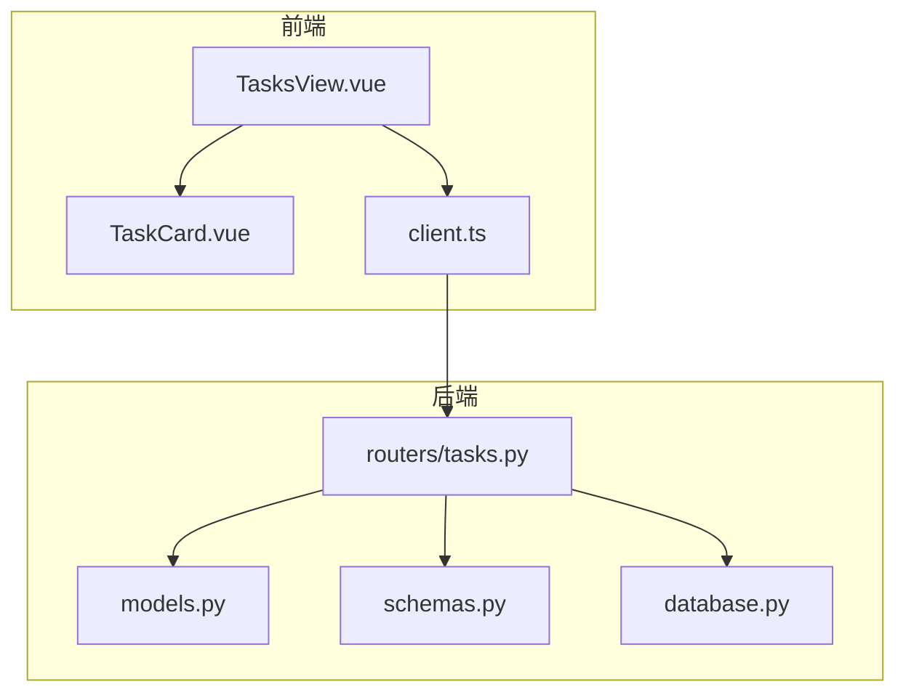
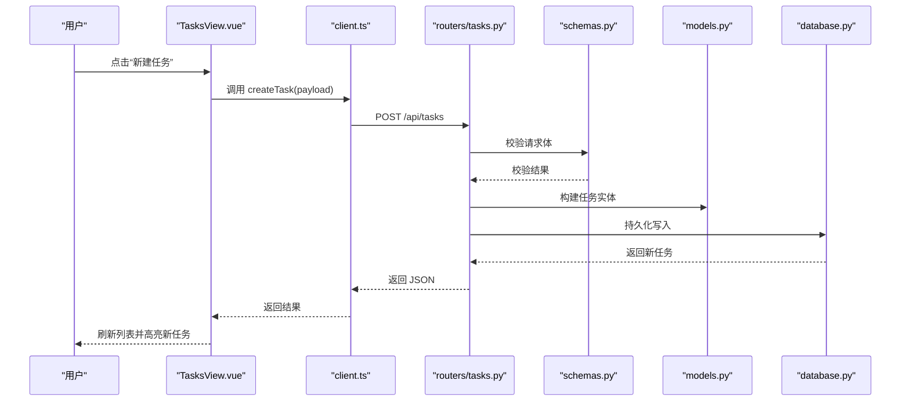
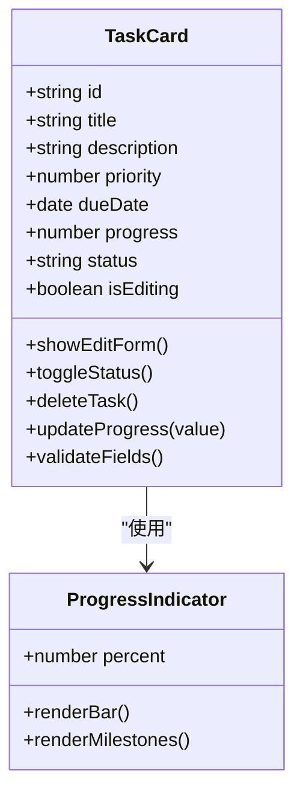
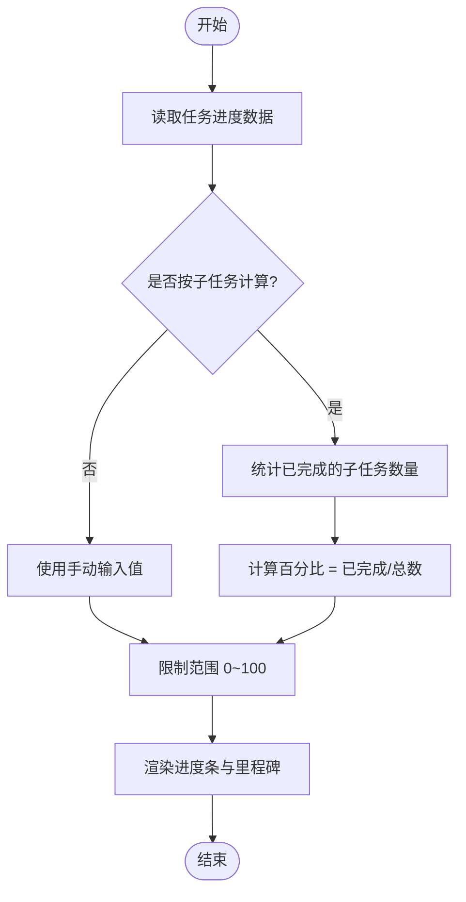
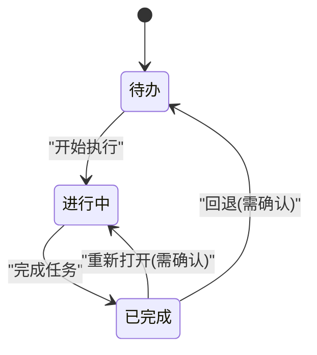
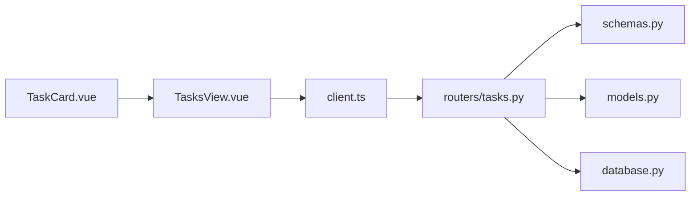

# 任务卡片组件

<cite>
**本文引用的文件**   
- [TaskCard.vue](file://frontend/src/components/TaskCard.vue)
- [TasksView.vue](file://frontend/src/views/TasksView.vue)
- [client.ts](file://frontend/src/api/client.ts)
- [tasks.py](file://backend/routers/tasks.py)
- [models.py](file://backend/models.py)
- [schemas.py](file://backend/schemas.py)
- [database.py](file://backend/database.py)
</cite>

## 目录
1. [简介](#简介)
2. [项目结构](#项目结构)
3. [核心组件](#核心组件)
4. [架构总览](#架构总览)
5. [详细组件分析](#详细组件分析)
6. [依赖关系分析](#依赖关系分析)
7. [性能考量](#性能考量)
8. [故障排查指南](#故障排查指南)
9. [结论](#结论)
10. [附录](#附录)

## 简介
本文件围绕 TaskCard 任务卡片组件，系统化阐述任务管理功能（创建、编辑、删除、完成状态管理）、进度跟踪机制（进度条显示、百分比计算、里程碑标记）、状态流转规则（待办、进行中、已完成等）、用户交互设计（拖拽、批量处理、快捷操作）、数据验证与错误处理（必填字段、格式校验、异常恢复），以及与后端任务系统的数据同步机制。文档面向不同技术背景的读者，提供从高层到代码级的完整说明。

## 项目结构
前端以 Vue 单文件组件组织，TaskCard 位于 components 目录；任务列表视图 TasksView 负责聚合与交互编排；API 客户端 client.ts 封装 HTTP 请求；后端路由 tasks.py 暴露任务相关接口，models.py 定义数据库模型，schemas.py 定义请求/响应结构，database.py 提供数据库连接与事务支持。

图表来源
- [TaskCard.vue](file://frontend/src/components/TaskCard.vue)
- [TasksView.vue](file://frontend/src/views/TasksView.vue)
- [client.ts](file://frontend/src/api/client.ts)
- [tasks.py](file://backend/routers/tasks.py)
- [models.py](file://backend/models.py)
- [schemas.py](file://backend/schemas.py)
- [database.py](file://backend/database.py)

章节来源
- [TaskCard.vue](file://frontend/src/components/TaskCard.vue)
- [TasksView.vue](file://frontend/src/views/TasksView.vue)
- [client.ts](file://frontend/src/api/client.ts)
- [tasks.py](file://backend/routers/tasks.py)
- [models.py](file://backend/models.py)
- [schemas.py](file://backend/schemas.py)
- [database.py](file://backend/database.py)

## 核心组件
- TaskCard：单个任务的展示与交互单元，包含标题、描述、优先级、截止日期、进度条、状态标签、操作按钮（编辑、删除、完成/取消完成）等。
- TasksView：任务列表容器，负责渲染多个 TaskCard、批量操作、排序/筛选、新增任务入口、与后端同步。
- client.ts：统一的前端 API 调用封装，包括获取任务、创建/更新/删除任务、批量更新等。
- 后端 tasks.py：RESTful 接口实现，包含任务 CRUD、状态变更、批量更新、进度更新等。
- models.py：任务实体模型，包含字段定义、约束、默认值、关联关系等。
- schemas.py：Pydantic 模型，用于请求参数校验与响应序列化。
- database.py：数据库连接、会话管理、事务控制。

章节来源
- [TaskCard.vue](file://frontend/src/components/TaskCard.vue)
- [TasksView.vue](file://frontend/src/views/TasksView.vue)
- [client.ts](file://frontend/src/api/client.ts)
- [tasks.py](file://backend/routers/tasks.py)
- [models.py](file://backend/models.py)
- [schemas.py](file://backend/schemas.py)
- [database.py](file://backend/database.py)

## 架构总览
任务卡片采用前后端分离的 REST 架构。前端通过 client.ts 发起 HTTP 请求，后端由 FastAPI（或同类框架）路由处理，读写数据库并返回结构化 JSON。TaskCard 作为 UI 原子组件，被 TasksView 组合使用，支持本地状态与远端数据的双向同步。

图表来源
- [TasksView.vue](file://frontend/src/views/TasksView.vue)
- [client.ts](file://frontend/src/api/client.ts)
- [tasks.py](file://backend/routers/tasks.py)
- [schemas.py](file://backend/schemas.py)
- [models.py](file://backend/models.py)
- [database.py](file://backend/database.py)

## 详细组件分析

### TaskCard 组件分析
TaskCard 是任务的最小可交互单元，承担以下职责：
- 展示任务基本信息（标题、描述、优先级、截止日期、创建/更新时间）。
- 进度跟踪：根据子任务完成数或自定义进度字段计算百分比，渲染进度条与里程碑标记。
- 状态管理：支持待办、进行中、已完成等状态切换，并提供快捷操作（如一键完成）。
- 编辑与删除：进入编辑模式后修改字段，提交保存；支持删除确认与撤销提示。
- 交互体验：键盘快捷键、拖拽排序（在 TasksView 中协调）、批量选择（由父组件驱动）。

图表来源
- [TaskCard.vue](file://frontend/src/components/TaskCard.vue)

章节来源
- [TaskCard.vue](file://frontend/src/components/TaskCard.vue)

#### 进度跟踪机制
- 进度条显示：基于当前进度值与最大值计算百分比，渲染线性进度条。
- 百分比计算：支持按子任务计数或手动输入；当存在里程碑时，里程碑点会在进度条上标注。
- 里程碑标记：里程碑为关键节点（如 25%、50%、75%、100%），达到阈值时触发视觉反馈与可选通知。

图表来源
- [TaskCard.vue](file://frontend/src/components/TaskCard.vue)

#### 状态变更逻辑
- 状态枚举：待办、进行中、已完成。
- 流转规则：
  - 待办 → 进行中：开始执行，自动记录开始时间。
  - 进行中 → 已完成：完成所有必填项与前置条件，记录完成时间。
  - 已完成 → 待办/进行中：回退需二次确认，并保留审计日志。
- 快捷操作：在卡片上直接切换状态，减少跳转成本。

图表来源
- [TaskCard.vue](file://frontend/src/components/TaskCard.vue)

#### 用户交互设计
- 拖拽操作：在 TasksView 中启用拖拽排序，TaskCard 提供拖拽手柄与占位符。
- 批量处理：多选任务进行批量状态变更、批量删除、批量导出。
- 快捷操作：键盘快捷键（如 Enter 编辑、Esc 取消、Space 切换状态）、右键菜单。

章节来源
- [TaskCard.vue](file://frontend/src/components/TaskCard.vue)
- [TasksView.vue](file://frontend/src/views/TasksView.vue)

### 任务列表与集成（TasksView）
TasksView 负责：
- 渲染任务列表，加载与分页。
- 提供新增、搜索、筛选、排序。
- 协调拖拽排序与批量操作。
- 与后端同步数据，处理乐观/悲观更新策略。

章节来源
- [TasksView.vue](file://frontend/src/views/TasksView.vue)

### API 客户端（client.ts）
- 封装任务相关接口：获取任务列表、创建任务、更新任务、删除任务、批量更新、进度更新。
- 统一错误处理：网络异常、业务错误码映射、重试与降级。
- 请求拦截：添加认证头、超时控制、请求去抖。

章节来源
- [client.ts](file://frontend/src/api/client.ts)

### 后端路由（tasks.py）
- 提供 RESTful 接口：GET/POST/PUT/DELETE、PATCH 状态变更、批量更新。
- 权限校验：鉴权中间件、角色权限控制。
- 数据校验：使用 schemas.py 校验入参，返回标准化错误信息。
- 事务处理：确保多步操作的原子性。

章节来源
- [tasks.py](file://backend/routers/tasks.py)

### 数据模型（models.py）
- 任务实体：包含 id、title、description、priority、due_date、progress、status、created_at、updated_at 等字段。
- 约束与默认值：非空校验、范围限制、时间戳自动更新。
- 关联关系：与子任务、评论、附件等扩展表关联。

章节来源
- [models.py](file://backend/models.py)

### 请求/响应结构（schemas.py）
- 定义 Pydantic 模型：CreateTaskRequest、UpdateTaskRequest、TaskResponse、BatchUpdateRequest 等。
- 校验规则：必填字段、格式校验（日期、邮箱、URL）、枚举值限制。
- 序列化：统一响应格式，包含 code、message、data。

章节来源
- [schemas.py](file://backend/schemas.py)

### 数据库访问（database.py）
- 连接管理：连接池、会话生命周期。
- 事务控制：begin/commit/rollback。
- 查询优化：索引建议、分页查询、批量插入/更新。

章节来源
- [database.py](file://backend/database.py)

## 依赖关系分析
- 前端依赖：TaskCard 被 TasksView 组合；TasksView 依赖 client.ts 进行数据同步。
- 后端依赖：tasks.py 依赖 schemas.py 进行校验，依赖 models.py 进行 ORM 操作，依赖 database.py 进行持久化。
- 外部依赖：HTTP 客户端、数据库驱动、认证服务。

图表来源
- [TaskCard.vue](file://frontend/src/components/TaskCard.vue)
- [TasksView.vue](file://frontend/src/views/TasksView.vue)
- [client.ts](file://frontend/src/api/client.ts)
- [tasks.py](file://backend/routers/tasks.py)
- [schemas.py](file://backend/schemas.py)
- [models.py](file://backend/models.py)
- [database.py](file://backend/database.py)

章节来源
- [TaskCard.vue](file://frontend/src/components/TaskCard.vue)
- [TasksView.vue](file://frontend/src/views/TasksView.vue)
- [client.ts](file://frontend/src/api/client.ts)
- [tasks.py](file://backend/routers/tasks.py)
- [schemas.py](file://backend/schemas.py)
- [models.py](file://backend/models.py)
- [database.py](file://backend/database.py)

## 性能考量
- 前端渲染：虚拟滚动或分页加载大量任务；按需渲染 TaskCard 属性。
- 网络请求：合并批量更新、请求去抖与节流、缓存热点数据。
- 后端优化：数据库索引（status、due_date、priority）、分页查询、批量写入。
- 内存管理：及时释放事件监听器与定时器，避免内存泄漏。

## 故障排查指南
- 常见问题：
  - 任务无法保存：检查必填字段与格式校验，查看后端返回的错误消息。
  - 进度不更新：确认进度计算逻辑与里程碑阈值设置。
  - 状态切换失败：检查权限与状态流转规则，查看审计日志。
  - 拖拽失效：确认 DOM 结构与事件绑定，检查浏览器兼容性。
- 调试技巧：
  - 前端：使用浏览器开发者工具查看网络请求与状态变化。
  - 后端：开启详细日志，捕获异常堆栈，检查数据库事务状态。
- 恢复策略：
  - 乐观更新失败时回滚本地状态。
  - 网络超时重试与降级策略。
  - 数据不一致时触发全量同步。

章节来源
- [client.ts](file://frontend/src/api/client.ts)
- [tasks.py](file://backend/routers/tasks.py)
- [schemas.py](file://backend/schemas.py)

## 结论
TaskCard 组件作为任务管理的核心 UI 单元，结合 TasksView 与后端 API，实现了完整的任务生命周期管理。通过清晰的进度跟踪、状态流转与用户交互设计，提升了用户体验与开发效率。建议在后续迭代中进一步优化性能与可访问性，并增强错误恢复与审计能力。

## 附录
- 术语表：
  - 任务卡片：单个任务的可视化与交互单元。
  - 进度条：显示任务完成百分比的图形控件。
  - 里程碑：关键进度节点，用于标记重要阶段。
  - 状态流转：任务在不同状态之间的转换规则。
- 最佳实践：
  - 保持组件单一职责，复杂逻辑下沉至父组件或服务层。
  - 使用统一的错误处理与日志记录。
  - 对敏感操作增加二次确认与审计追踪。