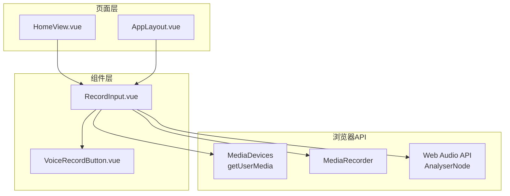
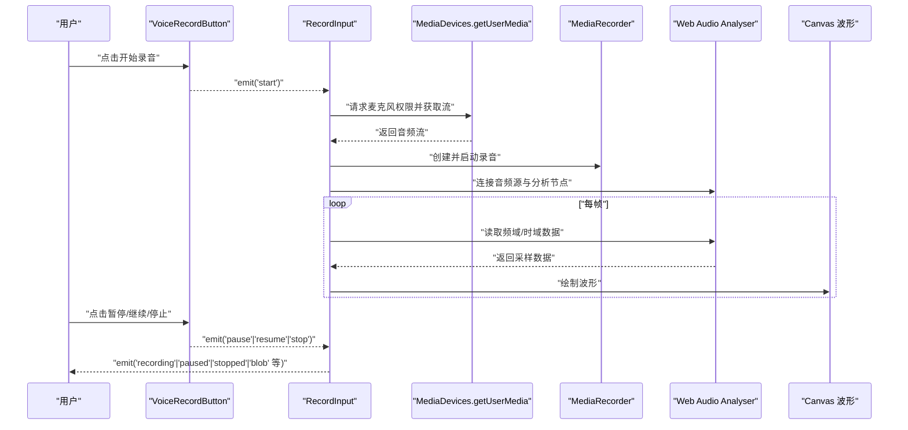
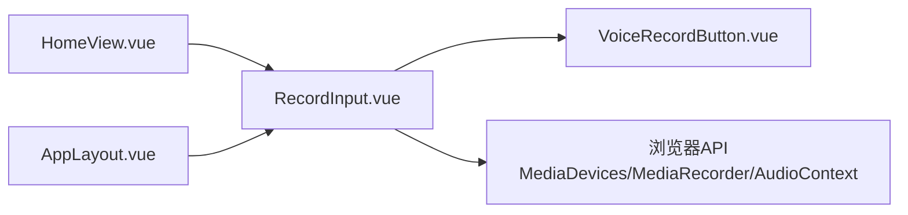

# 录音输入组件

<cite>
**本文档引用的文件**   
- [RecordInput.vue](file://frontend/src/components/RecordInput.vue)
- [VoiceRecordButton.vue](file://frontend/src/components/VoiceRecordButton.vue)
- [AppLayout.vue](file://frontend/src/components/AppLayout.vue)
- [HomeView.vue](file://frontend/src/views/HomeView.vue)
</cite>

## 目录
1. [简介](#简介)
2. [项目结构](#项目结构)
3. [核心组件](#核心组件)
4. [架构总览](#架构总览)
5. [详细组件分析](#详细组件分析)
6. [依赖关系分析](#依赖关系分析)
7. [性能考虑](#性能考虑)
8. [故障排查指南](#故障排查指南)
9. [结论](#结论)
10. [附录](#附录)

## 简介
本文件为“RecordInput 录音输入组件”的完整技术文档，聚焦以下方面：
- 音频录制实现：基于 Web Audio API 与 MediaRecorder，涵盖麦克风权限处理、音频流生命周期管理。
- 波形可视化：实时音频波形绘制、动画效果与性能优化策略。
- 状态管理：录制状态机（空闲/录制中/暂停/完成）、错误处理与用户反馈。
- 组件 API：props 配置、事件发射、数据绑定约定。
- 使用示例与最佳实践：在父组件中的集成方式、常见问题定位与解决方案。

## 项目结构
前端采用 Vue 单文件组件组织，录音相关能力集中在 RecordInput 与 VoiceRecordButton 两个组件中，页面级视图通过 AppLayout 或具体 View 引入并使用。

图表来源
- [HomeView.vue](file://frontend/src/views/HomeView.vue)
- [AppLayout.vue](file://frontend/src/components/AppLayout.vue)
- [RecordInput.vue](file://frontend/src/components/RecordInput.vue)
- [VoiceRecordButton.vue](file://frontend/src/components/VoiceRecordButton.vue)

章节来源
- [RecordInput.vue](file://frontend/src/components/RecordInput.vue)
- [VoiceRecordButton.vue](file://frontend/src/components/VoiceRecordButton.vue)
- [AppLayout.vue](file://frontend/src/components/AppLayout.vue)
- [HomeView.vue](file://frontend/src/views/HomeView.vue)

## 核心组件
- RecordInput.vue：封装完整的录音流程、波形绘制、状态管理与对外 API。
- VoiceRecordButton.vue：提供录音按钮交互（开始/暂停/停止），向 RecordInput 暴露控制入口。

章节来源
- [RecordInput.vue](file://frontend/src/components/RecordInput.vue)
- [VoiceRecordButton.vue](file://frontend/src/components/VoiceRecordButton.vue)

## 架构总览
RecordInput 作为容器组件，协调媒体设备访问、录音编码与波形分析；VoiceRecordButton 仅负责交互触发。整体遵循“职责分离 + 单向数据流”原则，通过 props 下发配置，通过事件向上汇报状态与结果。

图表来源
- [RecordInput.vue](file://frontend/src/components/RecordInput.vue)
- [VoiceRecordButton.vue](file://frontend/src/components/VoiceRecordButton.vue)

## 详细组件分析

### RecordInput 组件
职责
- 管理麦克风权限与音频流生命周期。
- 驱动 MediaRecorder 进行录音与分段收集。
- 通过 Web Audio API 的 AnalyserNode 获取实时数据并绘制波形。
- 维护内部状态（空闲/录制中/暂停/完成）并向父组件广播事件。
- 提供可配置的 props（如最小时长、最大时长、输出格式、是否自动上传等）。

关键实现要点
- 权限与流管理
  - 使用 MediaDevices.getUserMedia 获取麦克风权限与音频流。
  - 捕获权限拒绝、设备不可用等异常，统一转换为错误事件上报。
  - 在组件销毁或录音结束时释放流与资源，避免内存泄漏。
- 录音与分片
  - 使用 MediaRecorder 启动录音，按时间切片收集 Blob 片段。
  - 支持设置 mimeType、timeslice、bufferSize 等参数以平衡质量与性能。
  - 将片段合并为最终音频 Blob，并通过事件回传给父组件。
- 波形绘制
  - 构建 AudioContext 与 AnalyserNode，连接媒体流。
  - 使用 requestAnimationFrame 循环读取时域数据，渲染到 Canvas。
  - 根据设备像素比缩放画布，减少模糊；按需降低采样频率以提升性能。
- 状态机
  - 状态包括：idle、recording、paused、stopped、error。
  - 各状态间转换受用户操作与系统回调约束，确保一致性。
- 事件模型
  - 向外发射：start、pause、resume、stop、blob、error、duration-change 等。
  - 父组件监听这些事件更新 UI 或执行业务逻辑（如上传、转写）。

建议的 Props 设计（概念性说明）
- minDuration / maxDuration：限制最短/最长录音时长。
- format：期望的输出格式（如 webm/mp4/ogg）。
- autoUpload：是否在录音结束后自动上传。
- showWaveform：是否显示波形。
- sampleRate：音频采样率（影响音质与性能）。
- bufferSize：分析器缓冲区大小（影响波形平滑度与性能）。

建议的事件列表（概念性说明）
- start：开始录音成功。
- pause：进入暂停。
- resume：恢复录制。
- stop：停止录制，附带最终 Blob。
- blob：分段 Blob 推送（用于增量处理）。
- error：错误信息（权限、设备、编码等）。
- duration-change：当前录制时长变化。

章节来源
- [RecordInput.vue](file://frontend/src/components/RecordInput.vue)

### VoiceRecordButton 组件
职责
- 提供简洁的录音按钮 UI（开始/暂停/停止）。
- 将用户操作转化为事件，交由 RecordInput 处理。
- 可选地展示录制时长与状态提示。

交互流程
- 点击“开始”：触发 RecordInput.start。
- 点击“暂停/继续”：切换 RecordInput.pause/resume。
- 点击“停止”：触发 RecordInput.stop 并清理 UI。

章节来源
- [VoiceRecordButton.vue](file://frontend/src/components/VoiceRecordButton.vue)

### 页面集成（HomeView / AppLayout）
- 在页面中引入 RecordInput，绑定必要 props 与事件。
- 监听 blob 事件，调用后端接口进行语音识别或存储。
- 根据 error 事件展示用户友好的提示信息。

章节来源
- [HomeView.vue](file://frontend/src/views/HomeView.vue)
- [AppLayout.vue](file://frontend/src/components/AppLayout.vue)

## 依赖关系分析
- RecordInput 依赖浏览器原生 API：MediaDevices、MediaRecorder、AudioContext、AnalyserNode、Canvas。
- VoiceRecordButton 仅依赖 UI 框架（Vue）与样式库。
- 页面层通过事件与 RecordInput 解耦，便于替换实现或扩展功能。

图表来源
- [HomeView.vue](file://frontend/src/views/HomeView.vue)
- [AppLayout.vue](file://frontend/src/components/AppLayout.vue)
- [RecordInput.vue](file://frontend/src/components/RecordInput.vue)
- [VoiceRecordButton.vue](file://frontend/src/components/VoiceRecordButton.vue)

章节来源
- [RecordInput.vue](file://frontend/src/components/RecordInput.vue)
- [VoiceRecordButton.vue](file://frontend/src/components/VoiceRecordButton.vue)
- [HomeView.vue](file://frontend/src/views/HomeView.vue)
- [AppLayout.vue](file://frontend/src/components/AppLayout.vue)

## 性能考虑
- 波形绘制
  - 使用 requestAnimationFrame 保证流畅动画。
  - 合理设置 AnalyserNode 的 fftSize 与采样间隔，避免每帧都重绘。
  - 针对高 DPI 屏幕按比例缩放 Canvas，减少像素计算量。
- 录音编码
  - 选择合适的 mimeType 与 timeslice，平衡体积与延迟。
  - 大文件分段上传或边录边传，降低内存占用。
- 资源释放
  - 在组件卸载或录音结束时关闭 AudioContext、释放 MediaStream。
  - 避免重复创建实例，复用已存在的上下文对象。

[本节为通用指导，不直接分析具体文件]

## 故障排查指南
常见问题与定位思路
- 无法获取麦克风权限
  - 检查 HTTPS 环境、浏览器安全策略与用户授权弹窗。
  - 捕获 getUserMedia 拒绝错误，提示用户开启权限。
- 波形不显示或卡顿
  - 确认 AudioContext 已正确创建且未处于挂起状态。
  - 降低采样频率或增大分析间隔，观察是否改善。
- 录音无声或音量过低
  - 检查系统音量、麦克风选择与浏览器权限。
  - 增加增益或提示用户使用外置麦克风。
- 导出失败或格式不支持
  - 校验 mimeType 兼容性，必要时降级为更通用的格式。
  - 检查后端接收端对音频格式的解码支持。

章节来源
- [RecordInput.vue](file://frontend/src/components/RecordInput.vue)

## 结论
RecordInput 组件通过清晰的职责划分与稳健的状态管理，实现了可靠的录音与波形可视化能力。结合 Web Audio API 与 MediaRecorder，既保证了跨平台兼容性，又提供了良好的用户体验。建议在集成时严格遵循事件契约，做好错误处理与资源释放，以获得稳定高效的录音体验。

[本节为总结性内容，不直接分析具体文件]

## 附录
- 集成步骤建议
  - 在页面中引入 RecordInput 与 VoiceRecordButton。
  - 绑定 props 与事件，监听 blob 与 error 事件。
  - 在 stop 事件中触发上传或转写流程。
- 最佳实践
  - 始终在 HTTPS 环境下运行。
  - 提供明确的错误提示与重试机制。
  - 对移动端做触摸友好与横竖屏适配。
  - 对长录音启用分段上传与断点续传。

[本节为补充信息，不直接分析具体文件]