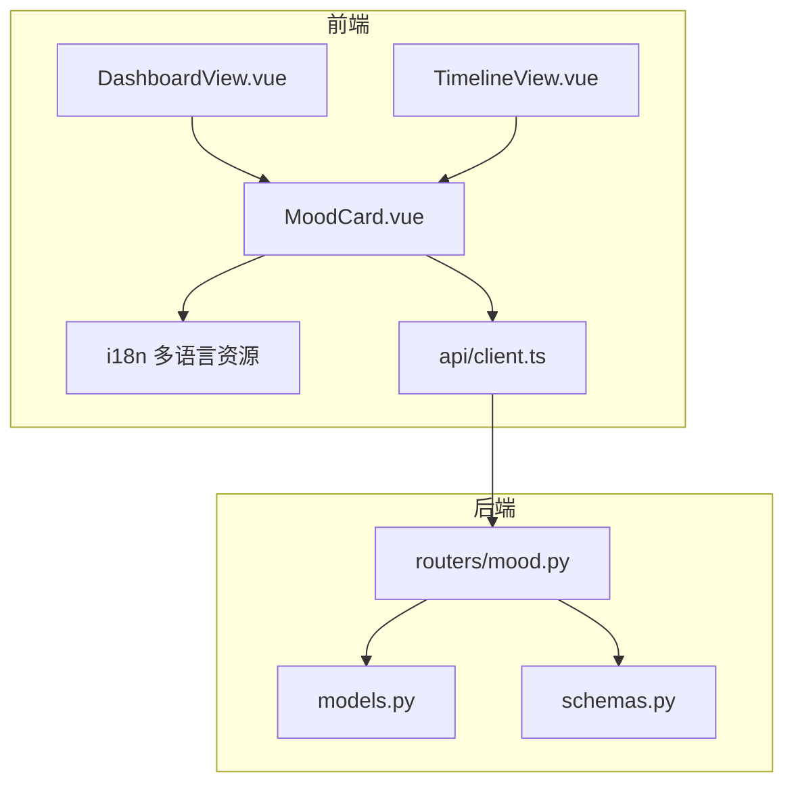
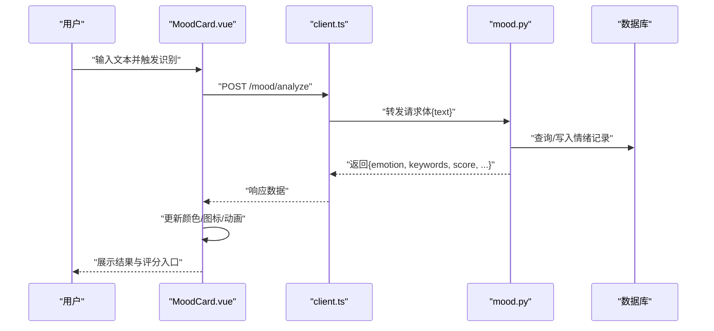
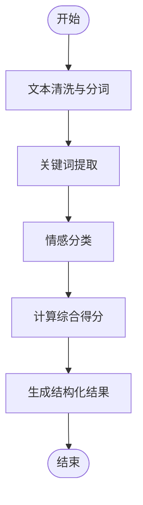
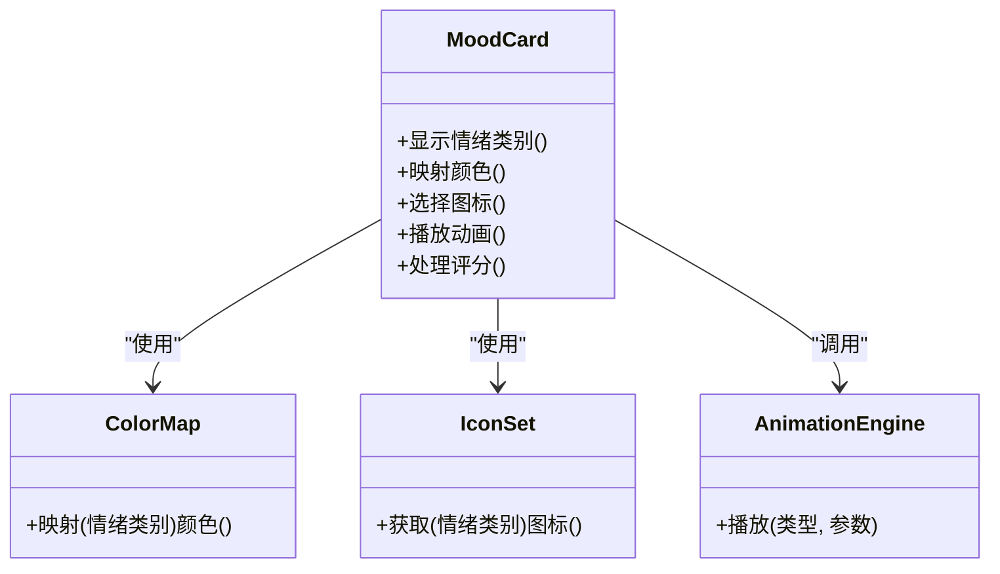
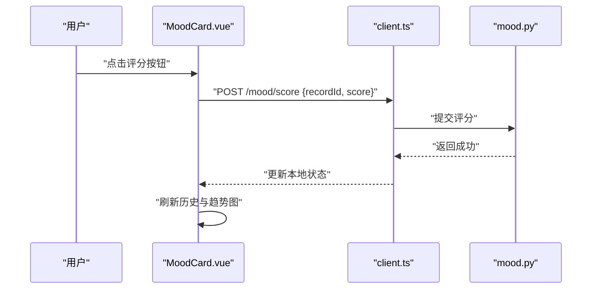
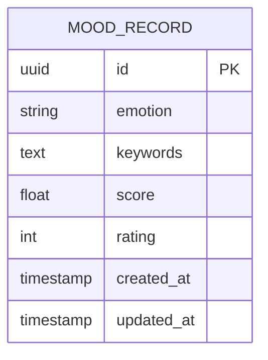
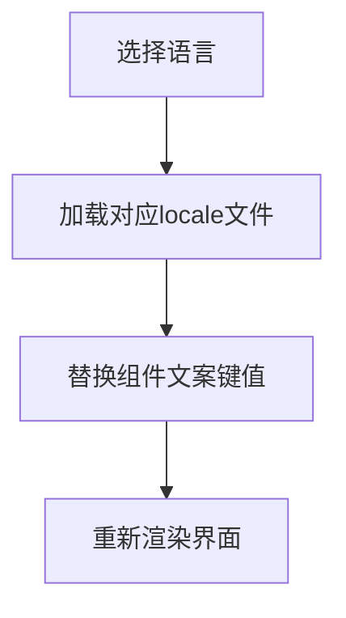
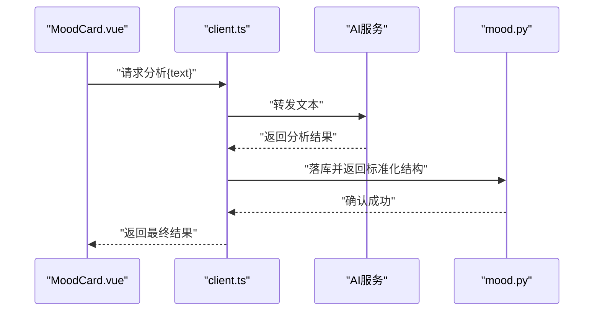
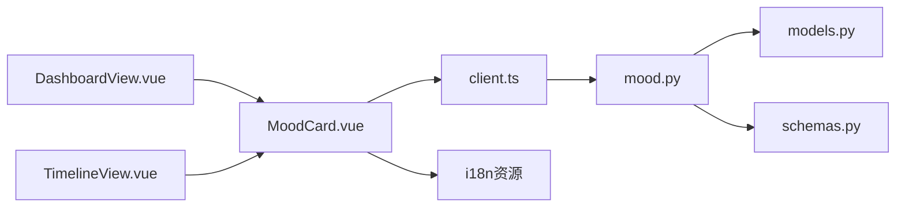

# 情绪卡片组件

<cite>
**本文档引用的文件**   
- [MoodCard.vue](file://frontend/src/components/MoodCard.vue)
- [mood.py](file://backend/routers/mood.py)
- [models.py](file://backend/models.py)
- [schemas.py](file://backend/schemas.py)
- [client.ts](file://frontend/src/api/client.ts)
- [en.ts](file://frontend/src/i18n/locales/en.ts)
- [zh-CN.ts](file://frontend/src/i18n/locales/zh-CN.ts)
- [DashboardView.vue](file://frontend/src/views/DashboardView.vue)
- [TimelineView.vue](file://frontend/src/views/TimelineView.vue)
</cite>

## 目录
1. [简介](#简介)
2. [项目结构](#项目结构)
3. [核心组件](#核心组件)
4. [架构总览](#架构总览)
5. [详细组件分析](#详细组件分析)
6. [依赖关系分析](#依赖关系分析)
7. [性能考虑](#性能考虑)
8. [故障排查指南](#故障排查指南)
9. [结论](#结论)
10. [附录](#附录)

## 简介
本文件围绕“情绪卡片（MoodCard）”组件，系统性阐述其前端展示、后端情绪识别与存储、数据绑定与状态管理、国际化支持以及AI服务集成的实现方式。文档面向不同技术背景的读者，既提供高层概览，也给出代码级细节与可视化图示，帮助快速理解并扩展该功能。

## 项目结构
- 前端采用Vue单页应用，情绪卡片位于components目录，视图层通过DashboardView和TimelineView集成；国际化文案在i18n/locales下维护中英文资源。
- 后端基于Python框架，情绪相关路由集中在routers/mood.py，数据模型与请求响应Schema分别定义于models.py与schemas.py；API客户端在前端src/api/client.ts中封装。

**图表来源** 
- [MoodCard.vue](file://frontend/src/components/MoodCard.vue)
- [DashboardView.vue](file://frontend/src/views/DashboardView.vue)
- [TimelineView.vue](file://frontend/src/views/TimelineView.vue)
- [client.ts](file://frontend/src/api/client.ts)
- [mood.py](file://backend/routers/mood.py)
- [models.py](file://backend/models.py)
- [schemas.py](file://backend/schemas.py)

**章节来源**
- [MoodCard.vue](file://frontend/src/components/MoodCard.vue)
- [DashboardView.vue](file://frontend/src/views/DashboardView.vue)
- [TimelineView.vue](file://frontend/src/views/TimelineView.vue)
- [client.ts](file://frontend/src/api/client.ts)
- [mood.py](file://backend/routers/mood.py)
- [models.py](file://backend/models.py)
- [schemas.py](file://backend/schemas.py)

## 核心组件
- 情绪卡片（MoodCard）：负责用户输入文本的情绪识别结果展示、颜色映射、图标选择、动画过渡、评分交互、历史记录查看与趋势图联动。
- 情绪识别后端（mood.py）：接收文本输入，执行关键词提取与情感分类，返回结构化结果供前端渲染。
- 数据模型与Schema（models.py, schemas.py）：定义情绪记录的数据结构与接口契约。
- 前端API客户端（client.ts）：统一封装情绪识别与查询的HTTP调用。
- 国际化（en.ts, zh-CN.ts）：提供多语言文案，支撑界面提示、标签与说明。

**章节来源**
- [MoodCard.vue](file://frontend/src/components/MoodCard.vue)
- [mood.py](file://backend/routers/mood.py)
- [models.py](file://backend/models.py)
- [schemas.py](file://backend/schemas.py)
- [client.ts](file://frontend/src/api/client.ts)
- [en.ts](file://frontend/src/i18n/locales/en.ts)
- [zh-CN.ts](file://frontend/src/i18n/locales/zh-CN.ts)

## 架构总览
情绪卡片的前后端交互流程如下：用户在卡片中输入文本，前端调用API进行情绪识别；后端解析文本、提取关键词并进行情感分类，返回结果；前端根据结果更新UI（颜色、图标、动画），并提供评分与历史查看入口；历史与趋势数据由后端持久化存储并通过API读取。

**图表来源** 
- [MoodCard.vue](file://frontend/src/components/MoodCard.vue)
- [client.ts](file://frontend/src/api/client.ts)
- [mood.py](file://backend/routers/mood.py)
- [models.py](file://backend/models.py)
- [schemas.py](file://backend/schemas.py)

## 详细组件分析

### 情绪识别算法（文本分析、关键词提取、情感分类）
- 文本分析：对输入文本进行清洗与分词，去除停用词与噪声，保留有效语义单元。
- 关键词提取：基于词频或TF-IDF等策略抽取关键情绪词，结合领域词典增强召回。
- 情感分类：将关键词与规则/模型映射到情绪类别（如积极、消极、中性等），输出置信度与得分。
- 结果结构：包含情绪类别、关键词列表、综合得分、时间戳等字段，便于前端渲染与统计。

**图表来源** 
- [mood.py](file://backend/routers/mood.py)
- [models.py](file://backend/models.py)
- [schemas.py](file://backend/schemas.py)

**章节来源**
- [mood.py](file://backend/routers/mood.py)
- [models.py](file://backend/models.py)
- [schemas.py](file://backend/schemas.py)

### 可视化展示效果（颜色映射、图标选择、动画过渡）
- 颜色映射：根据情绪类别映射到预设色板（如积极为暖色、消极为冷色、中性为灰色），确保对比度与可访问性。
- 图标选择：为每个情绪类别配置对应图标，提升直观性与识别效率。
- 动画过渡：在结果变化时添加平滑过渡（如淡入、缩放、位移），增强用户体验。
- 交互反馈：点击评分按钮触发评分提交，卡片即时刷新显示最新评分与趋势。

**图表来源** 
- [MoodCard.vue](file://frontend/src/components/MoodCard.vue)

**章节来源**
- [MoodCard.vue](file://frontend/src/components/MoodCard.vue)

### 用户反馈机制（评分系统、历史记录、趋势分析）
- 评分系统：用户可对当前情绪结果进行打分，分数与时间戳关联，形成时间序列。
- 历史记录：支持按日期范围筛选查看历史情绪记录，提供分页与排序。
- 趋势分析：基于历史数据绘制折线或柱状图，展示情绪波动与周期特征。

**图表来源** 
- [MoodCard.vue](file://frontend/src/components/MoodCard.vue)
- [client.ts](file://frontend/src/api/client.ts)
- [mood.py](file://backend/routers/mood.py)

**章节来源**
- [MoodCard.vue](file://frontend/src/components/MoodCard.vue)
- [client.ts](file://frontend/src/api/client.ts)
- [mood.py](file://backend/routers/mood.py)

### 数据绑定与状态管理（情绪数据模型、实时更新、持久化存储）
- 数据模型：定义情绪记录的字段（类别、关键词、得分、评分、时间戳等），前后端保持一致。
- 实时更新：通过WebSocket或轮询机制保持前端状态与后端同步，避免重复请求。
- 持久化存储：后端将情绪记录写入数据库，支持查询、聚合与导出。

**图表来源** 
- [models.py](file://backend/models.py)
- [schemas.py](file://backend/schemas.py)

**章节来源**
- [models.py](file://backend/models.py)
- [schemas.py](file://backend/schemas.py)

### 国际化支持（多语言文案、区域化格式）
- 多语言文案：在i18n资源文件中维护中英文键值对，覆盖提示、标签、错误信息等。
- 区域化格式：日期、数字、货币等按区域设置格式化显示。
- 动态切换：运行时切换语言，组件即时更新文案而不刷新页面。

**图表来源** 
- [en.ts](file://frontend/src/i18n/locales/en.ts)
- [zh-CN.ts](file://frontend/src/i18n/locales/zh-CN.ts)

**章节来源**
- [en.ts](file://frontend/src/i18n/locales/en.ts)
- [zh-CN.ts](file://frontend/src/i18n/locales/zh-CN.ts)

### 与AI服务的集成方式和响应数据处理
- 集成方式：通过HTTP API调用AI服务进行文本分析与情感分类，支持超时与重试策略。
- 响应处理：校验返回结构，提取关键字段，异常时降级为默认情绪或提示用户重试。
- 缓存策略：对相同输入进行短期缓存，减少重复计算与网络开销。

**图表来源** 
- [client.ts](file://frontend/src/api/client.ts)
- [mood.py](file://backend/routers/mood.py)

**章节来源**
- [client.ts](file://frontend/src/api/client.ts)
- [mood.py](file://backend/routers/mood.py)

## 依赖关系分析
- 前端依赖：MoodCard依赖API客户端与国际化资源；视图层（DashboardView、TimelineView）嵌入卡片以展示整体仪表盘与时间线。
- 后端依赖：mood路由依赖数据模型与Schema，确保接口契约一致；与数据库交互完成持久化。
- 外部依赖：AI服务作为黑盒模块，通过HTTP接口接入，需关注超时、错误码与降级策略。

**图表来源** 
- [MoodCard.vue](file://frontend/src/components/MoodCard.vue)
- [client.ts](file://frontend/src/api/client.ts)
- [DashboardView.vue](file://frontend/src/views/DashboardView.vue)
- [TimelineView.vue](file://frontend/src/views/TimelineView.vue)
- [mood.py](file://backend/routers/mood.py)
- [models.py](file://backend/models.py)
- [schemas.py](file://backend/schemas.py)

**章节来源**
- [MoodCard.vue](file://frontend/src/components/MoodCard.vue)
- [client.ts](file://frontend/src/api/client.ts)
- [DashboardView.vue](file://frontend/src/views/DashboardView.vue)
- [TimelineView.vue](file://frontend/src/views/TimelineView.vue)
- [mood.py](file://backend/routers/mood.py)
- [models.py](file://backend/models.py)
- [schemas.py](file://backend/schemas.py)

## 性能考虑
- 前端渲染优化：避免频繁重绘，使用虚拟滚动或分页加载历史；动画使用CSS硬件加速。
- 网络请求优化：合并请求、启用缓存、设置合理超时与重试；对高频输入做去抖处理。
- 后端计算优化：关键词提取与分类可异步化，热点数据缓存；批量写入与索引优化查询性能。
- 内存与带宽：压缩传输数据，限制单次返回记录数量，按需加载详情。

[本节为通用指导，不直接分析具体文件]

## 故障排查指南
- 常见问题
  - 情绪识别失败：检查AI服务可用性、请求体格式与权限；查看后端日志定位错误。
  - 颜色或图标不匹配：确认情绪类别与映射表一致；检查国际化键是否存在。
  - 评分未生效：验证评分接口返回状态；检查本地状态更新逻辑。
- 调试建议
  - 前端：打开开发者工具查看网络请求与响应；打印组件状态变化。
  - 后端：启用详细日志，记录输入文本、中间结果与异常堆栈。
  - 数据一致性：核对数据库记录与前端展示是否一致，必要时重置缓存。

**章节来源**
- [mood.py](file://backend/routers/mood.py)
- [client.ts](file://frontend/src/api/client.ts)
- [MoodCard.vue](file://frontend/src/components/MoodCard.vue)

## 结论
情绪卡片组件通过前后端协作实现了从文本输入到情绪识别、可视化展示、用户反馈与历史趋势分析的完整闭环。合理的架构设计、清晰的接口契约与完善的国际化支持，使其具备良好的可扩展性与用户体验。未来可引入更先进的NLP模型、增强实时同步能力，并优化性能与可访问性。

[本节为总结性内容，不直接分析具体文件]

## 附录
- 术语表
  - 情绪类别：积极、消极、中性等分类标签。
  - 关键词：反映情绪的核心词汇集合。
  - 评分：用户对情绪结果的量化反馈。
- 参考文件
  - 前端组件与视图：MoodCard.vue、DashboardView.vue、TimelineView.vue
  - API客户端：client.ts
  - 后端路由与模型：mood.py、models.py、schemas.py
  - 国际化资源：en.ts、zh-CN.ts

[本节为补充信息，不直接分析具体文件]