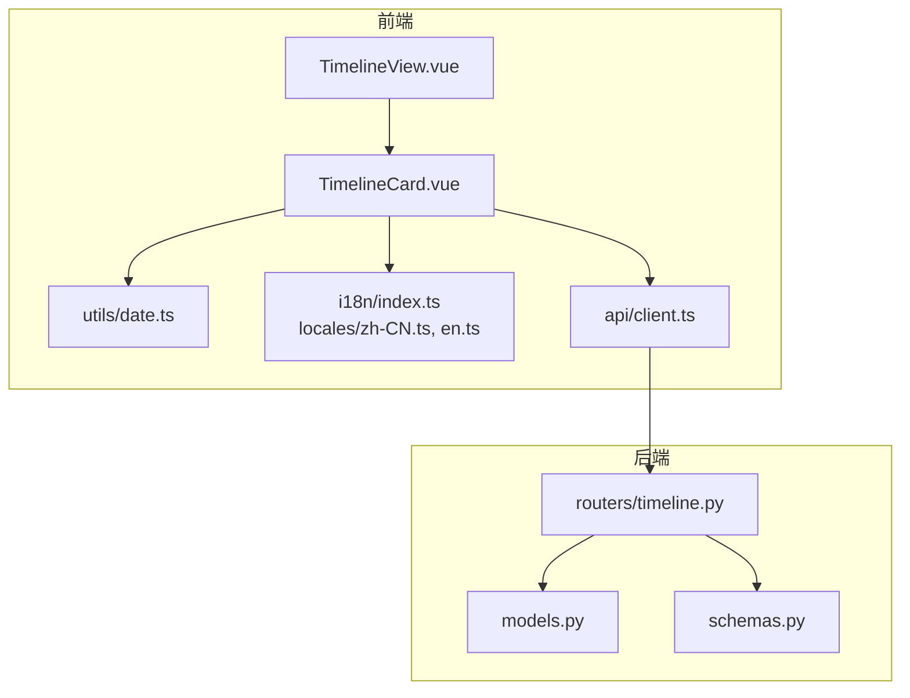
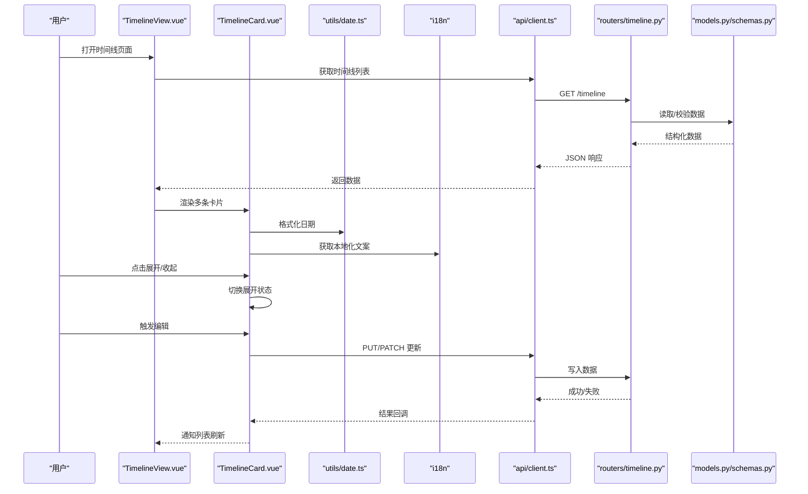
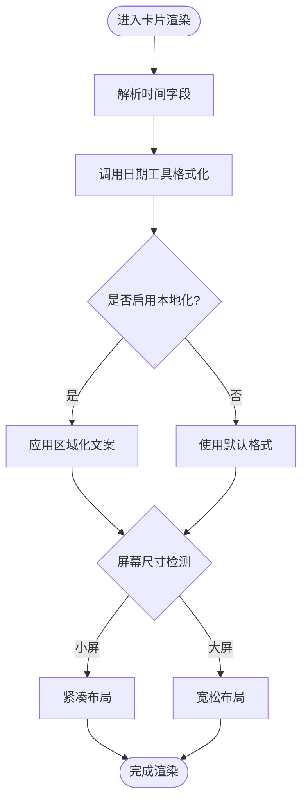
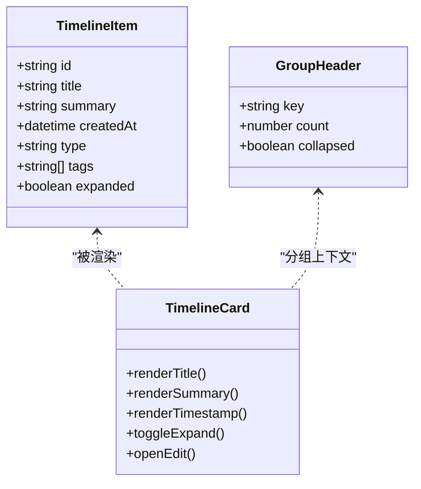
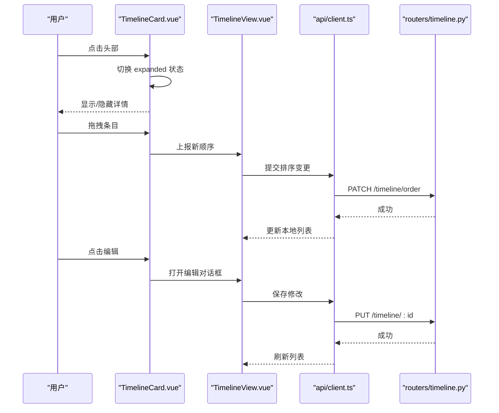
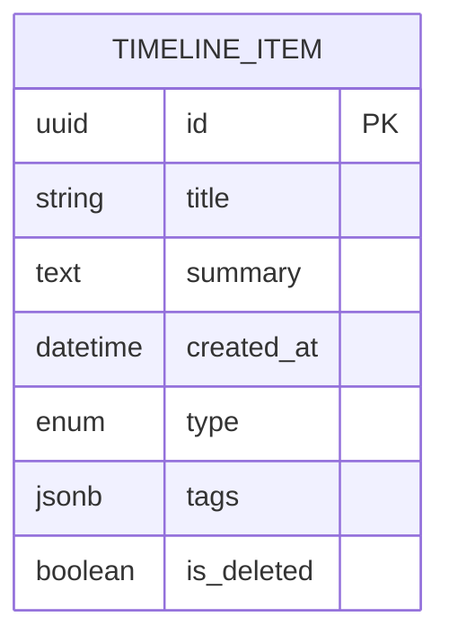
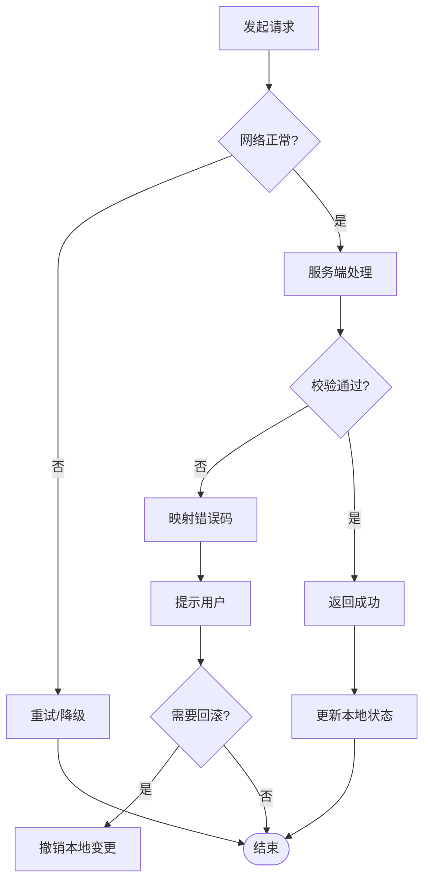
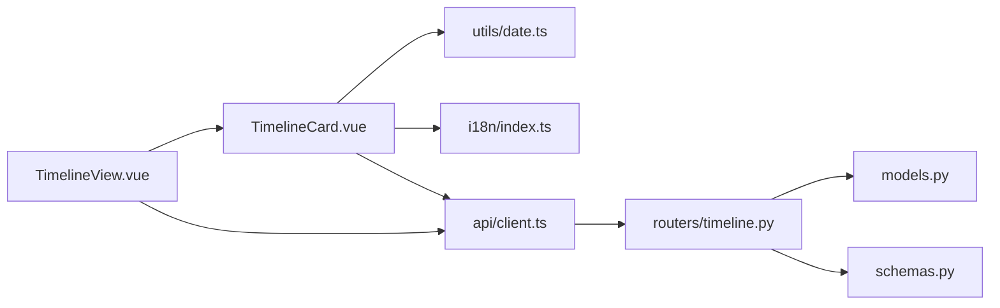

# 时间线卡片组件

<cite>
**本文档引用的文件**   
- [TimelineCard.vue](file://frontend/src/components/TimelineCard.vue)
- [TimelineView.vue](file://frontend/src/views/TimelineView.vue)
- [date.ts](file://frontend/src/utils/date.ts)
- [client.ts](file://frontend/src/api/client.ts)
- [timeline.py](file://backend/routers/timeline.py)
- [models.py](file://backend/models.py)
- [schemas.py](file://backend/schemas.py)
- [index.ts](file://frontend/src/i18n/index.ts)
- [zh-CN.ts](file://frontend/src/i18n/locales/zh-CN.ts)
- [en.ts](file://frontend/src/i18n/locales/en.ts)
</cite>

## 目录
1. [简介](#简介)
2. [项目结构](#项目结构)
3. [核心组件](#核心组件)
4. [架构总览](#架构总览)
5. [详细组件分析](#详细组件分析)
6. [依赖关系分析](#依赖关系分析)
7. [性能考虑](#性能考虑)
8. [故障排查指南](#故障排查指南)
9. [结论](#结论)
10. [附录](#附录)

## 简介
本文件为 TimelineCard 时间线卡片的完整技术文档，覆盖日期展示（格式化、本地化、响应式）、内容组织（排序、分组、视觉层次）、交互逻辑（展开收起、拖拽排序、编辑）、数据模型与状态管理、样式定制（主题、动画、可访问性）以及前后端集成与错误处理策略。读者无需深入前端或后端细节即可理解该组件的设计与使用方式。

## 项目结构
TimelineCard 位于前端组件层，配合视图层 TimelineView 进行渲染与编排；日期工具函数在 utils/date.ts 中实现；国际化配置在 i18n 模块；后端通过 routers/timeline.py 暴露接口，数据模型与校验由 models.py 和 schemas.py 定义。API 客户端封装在 api/client.ts。

图表来源
- [TimelineView.vue](file://frontend/src/views/TimelineView.vue)
- [TimelineCard.vue](file://frontend/src/components/TimelineCard.vue)
- [date.ts](file://frontend/src/utils/date.ts)
- [index.ts](file://frontend/src/i18n/index.ts)
- [zh-CN.ts](file://frontend/src/i18n/locales/zh-CN.ts)
- [en.ts](file://frontend/src/i18n/locales/en.ts)
- [client.ts](file://frontend/src/api/client.ts)
- [timeline.py](file://backend/routers/timeline.py)
- [models.py](file://backend/models.py)
- [schemas.py](file://backend/schemas.py)

章节来源
- [TimelineCard.vue](file://frontend/src/components/TimelineCard.vue)
- [TimelineView.vue](file://frontend/src/views/TimelineView.vue)
- [date.ts](file://frontend/src/utils/date.ts)
- [client.ts](file://frontend/src/api/client.ts)
- [timeline.py](file://backend/routers/timeline.py)
- [models.py](file://backend/models.py)
- [schemas.py](file://backend/schemas.py)
- [index.ts](file://frontend/src/i18n/index.ts)
- [zh-CN.ts](file://frontend/src/i18n/locales/zh-CN.ts)
- [en.ts](file://frontend/src/i18n/locales/en.ts)

## 核心组件
- TimelineCard：时间线条目卡片，负责单条记录的展示、展开/收起、编辑入口、日期格式化与本地化文案、响应式布局适配。
- TimelineView：时间线页面容器，负责列表加载、分组与排序、拖拽排序、批量操作与错误提示。
- date.ts：日期格式化与本地化工具，提供统一的时间显示格式。
- client.ts：HTTP 客户端封装，统一请求/响应处理与错误映射。
- timeline.py：后端时间线路由，提供查询、更新、删除等接口。
- models.py / schemas.py：数据库模型与请求/响应数据校验。
- i18n：多语言资源与切换机制。

章节来源
- [TimelineCard.vue](file://frontend/src/components/TimelineCard.vue)
- [TimelineView.vue](file://frontend/src/views/TimelineView.vue)
- [date.ts](file://frontend/src/utils/date.ts)
- [client.ts](file://frontend/src/api/client.ts)
- [timeline.py](file://backend/routers/timeline.py)
- [models.py](file://backend/models.py)
- [schemas.py](file://backend/schemas.py)
- [index.ts](file://frontend/src/i18n/index.ts)
- [zh-CN.ts](file://frontend/src/i18n/locales/zh-CN.ts)
- [en.ts](file://frontend/src/i18n/locales/en.ts)

## 架构总览
TimelineCard 作为 UI 原子组件，向上被 TimelineView 组合；向下依赖日期工具、国际化与 API 客户端。后端通过 RESTful 接口提供数据读写，前端以异步请求驱动视图更新。

图表来源
- [TimelineView.vue](file://frontend/src/views/TimelineView.vue)
- [TimelineCard.vue](file://frontend/src/components/TimelineCard.vue)
- [date.ts](file://frontend/src/utils/date.ts)
- [index.ts](file://frontend/src/i18n/index.ts)
- [client.ts](file://frontend/src/api/client.ts)
- [timeline.py](file://backend/routers/timeline.py)
- [models.py](file://backend/models.py)
- [schemas.py](file://backend/schemas.py)

## 详细组件分析

### 日期展示功能
- 时间格式化：通过统一的日期工具函数将原始时间戳/字符串转换为可读文本，支持相对时间、绝对时间与自定义格式。
- 本地化支持：借助 i18n 模块获取区域化文案（如“今天”、“昨天”、“刚刚”），并随语言切换动态更新。
- 响应式布局：在小屏设备上自动调整日期位置、字号与间距，保证信息密度与可读性。

图表来源
- [date.ts](file://frontend/src/utils/date.ts)
- [index.ts](file://frontend/src/i18n/index.ts)
- [zh-CN.ts](file://frontend/src/i18n/locales/zh-CN.ts)
- [en.ts](file://frontend/src/i18n/locales/en.ts)
- [TimelineCard.vue](file://frontend/src/components/TimelineCard.vue)

章节来源
- [date.ts](file://frontend/src/utils/date.ts)
- [index.ts](file://frontend/src/i18n/index.ts)
- [zh-CN.ts](file://frontend/src/i18n/locales/zh-CN.ts)
- [en.ts](file://frontend/src/i18n/locales/en.ts)
- [TimelineCard.vue](file://frontend/src/components/TimelineCard.vue)

### 内容组织结构
- 条目排序：默认按时间倒序排列，支持按标题、类型或标签排序。
- 分组逻辑：可按日期（天/周/月）或类型进行分组，组头显示分组键与数量。
- 视觉层次：主标题加粗、摘要行弱化、时间戳靠右对齐；展开后显示详情区块，保持清晰的层级对比。

图表来源
- [TimelineCard.vue](file://frontend/src/components/TimelineCard.vue)
- [TimelineView.vue](file://frontend/src/views/TimelineView.vue)

章节来源
- [TimelineCard.vue](file://frontend/src/components/TimelineCard.vue)
- [TimelineView.vue](file://frontend/src/views/TimelineView.vue)

### 交互逻辑实现
- 点击展开/收起：卡片头部点击切换详情区块的可见性，附带过渡动画。
- 拖拽排序：支持按住拖拽改变顺序，实时更新本地数组并在必要时同步到后端。
- 编辑操作：点击编辑按钮进入编辑模式，保存后触发局部刷新或全局重渲染。

图表来源
- [TimelineCard.vue](file://frontend/src/components/TimelineCard.vue)
- [TimelineView.vue](file://frontend/src/views/TimelineView.vue)
- [client.ts](file://frontend/src/api/client.ts)
- [timeline.py](file://backend/routers/timeline.py)

章节来源
- [TimelineCard.vue](file://frontend/src/components/TimelineCard.vue)
- [TimelineView.vue](file://frontend/src/views/TimelineView.vue)
- [client.ts](file://frontend/src/api/client.ts)
- [timeline.py](file://backend/routers/timeline.py)

### 数据模型设计
- 时间线数据结构：包含唯一标识、标题、摘要、创建时间、类型、标签、扩展字段等。
- 状态管理：前端维护展开状态、编辑态、排序顺序；后端持久化核心字段。
- 更新机制：局部更新优先，必要时全量刷新；乐观更新结合失败回滚。

图表来源
- [models.py](file://backend/models.py)
- [schemas.py](file://backend/schemas.py)

章节来源
- [models.py](file://backend/models.py)
- [schemas.py](file://backend/schemas.py)
- [TimelineCard.vue](file://frontend/src/components/TimelineCard.vue)
- [TimelineView.vue](file://frontend/src/views/TimelineView.vue)

### 样式定制选项
- 主题适配：支持明暗主题切换，颜色变量集中管理，确保对比度符合 WCAG 标准。
- 动画效果：展开/收起使用过渡动画，拖拽时提供高亮与占位反馈。
- 可访问性：键盘导航支持、ARIA 属性标注、焦点管理与语义化标签。

章节来源
- [TimelineCard.vue](file://frontend/src/components/TimelineCard.vue)
- [style.css](file://frontend/src/style.css)

### 与后端 API 的集成与错误处理
- 集成方式：通过 HTTP 客户端发起 GET/PUT/PATCH/DELETE 请求，统一处理鉴权与重试。
- 错误处理：网络异常、服务端校验失败、权限不足等场景均给出用户友好提示，并提供重试或回退路径。
- 数据一致性：采用乐观更新+失败回滚，确保界面与服务器状态一致。

图表来源
- [client.ts](file://frontend/src/api/client.ts)
- [timeline.py](file://backend/routers/timeline.py)
- [schemas.py](file://backend/schemas.py)

章节来源
- [client.ts](file://frontend/src/api/client.ts)
- [timeline.py](file://backend/routers/timeline.py)
- [schemas.py](file://backend/schemas.py)

## 依赖关系分析
TimelineCard 依赖日期工具、国际化与 API 客户端；TimelineView 依赖 TimelineCard 与 API 客户端；后端路由依赖数据模型与校验 schema。

图表来源
- [TimelineCard.vue](file://frontend/src/components/TimelineCard.vue)
- [TimelineView.vue](file://frontend/src/views/TimelineView.vue)
- [date.ts](file://frontend/src/utils/date.ts)
- [index.ts](file://frontend/src/i18n/index.ts)
- [client.ts](file://frontend/src/api/client.ts)
- [timeline.py](file://backend/routers/timeline.py)
- [models.py](file://backend/models.py)
- [schemas.py](file://backend/schemas.py)

章节来源
- [TimelineCard.vue](file://frontend/src/components/TimelineCard.vue)
- [TimelineView.vue](file://frontend/src/views/TimelineView.vue)
- [date.ts](file://frontend/src/utils/date.ts)
- [index.ts](file://frontend/src/i18n/index.ts)
- [client.ts](file://frontend/src/api/client.ts)
- [timeline.py](file://backend/routers/timeline.py)
- [models.py](file://backend/models.py)
- [schemas.py](file://backend/schemas.py)

## 性能考虑
- 虚拟滚动：当时间线条目较多时，建议引入虚拟滚动以减少 DOM 节点数量。
- 懒加载：按需加载详情内容，避免首屏过重。
- 防抖与节流：对搜索、筛选与拖拽事件进行节流，降低频繁重排。
- 缓存策略：对只读数据实施短期缓存，减少重复请求。

[本节为通用指导，不直接分析具体文件]

## 故障排查指南
- 日期显示异常：检查日期工具函数的输入格式与区域设置是否正确。
- 本地化未生效：确认当前语言包已加载且键名匹配。
- 拖拽失效：检查事件监听器绑定与浏览器兼容性。
- 编辑保存失败：查看网络请求与后端校验错误码，定位字段缺失或类型不符。
- 列表不同步：确认乐观更新回滚逻辑与后端返回状态码处理。

章节来源
- [date.ts](file://frontend/src/utils/date.ts)
- [index.ts](file://frontend/src/i18n/index.ts)
- [client.ts](file://frontend/src/api/client.ts)
- [timeline.py](file://backend/routers/timeline.py)
- [schemas.py](file://backend/schemas.py)

## 结论
TimelineCard 通过清晰的数据流、完善的本地化与响应式设计，提供了稳定易用的时间线展示能力。配合 TimelineView 的分组与排序、API 客户端的错误处理与后端模型的强校验，整体具备良好可扩展性与可维护性。建议在大数据量场景下引入虚拟滚动与懒加载，进一步提升性能体验。

[本节为总结性内容，不直接分析具体文件]

## 附录
- 常用 API 端点
  - GET /timeline：获取时间线列表
  - PUT /timeline/:id：更新单条记录
  - PATCH /timeline/order：批量更新排序
  - DELETE /timeline/:id：删除记录
- 关键状态字段
  - expanded：控制详情展开/收起
  - editing：控制编辑模式
  - order：记录当前排序顺序

章节来源
- [timeline.py](file://backend/routers/timeline.py)
- [client.ts](file://frontend/src/api/client.ts)
- [TimelineCard.vue](file://frontend/src/components/TimelineCard.vue)
- [TimelineView.vue](file://frontend/src/views/TimelineView.vue)