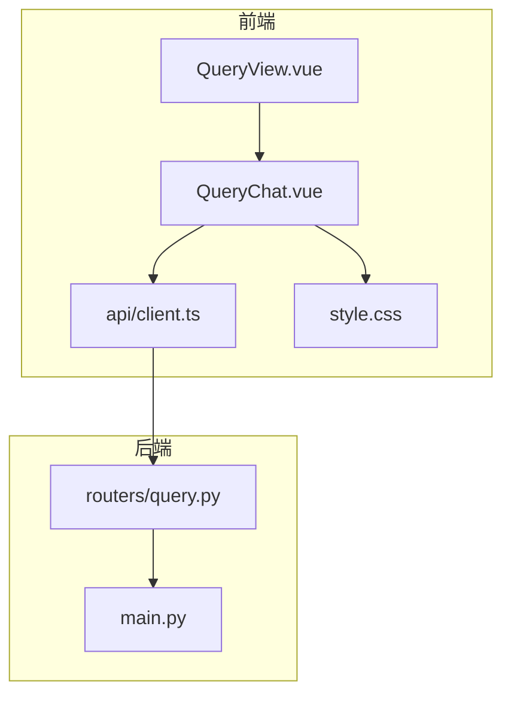
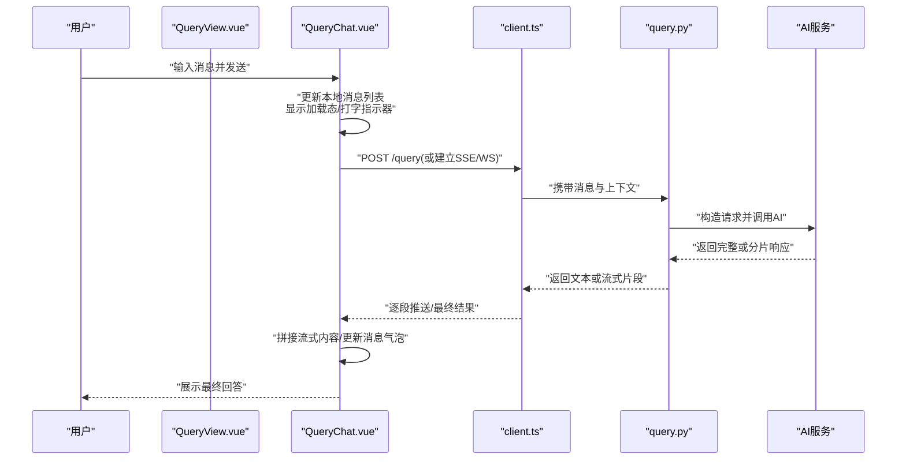
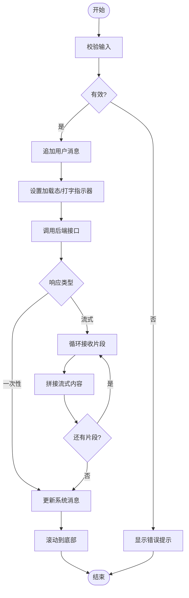
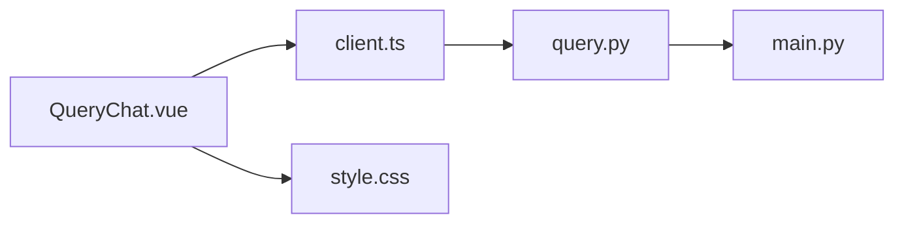

# 查询聊天组件

<cite>
**本文引用的文件**   
- [QueryChat.vue](file://frontend/src/components/QueryChat.vue)
- [QueryView.vue](file://frontend/src/views/QueryView.vue)
- [client.ts](file://frontend/src/api/client.ts)
- [query.py](file://backend/routers/query.py)
- [main.py](file://backend/main.py)
- [styles.css](file://frontend/src/style.css)
</cite>

## 目录
1. [简介](#简介)
2. [项目结构](#项目结构)
3. [核心组件](#核心组件)
4. [架构总览](#架构总览)
5. [详细组件分析](#详细组件分析)
6. [依赖关系分析](#依赖关系分析)
7. [性能考量](#性能考量)
8. [故障排查指南](#故障排查指南)
9. [结论](#结论)
10. [附录](#附录)

## 简介
本文件围绕 QueryChat 查询聊天组件，系统性阐述对话界面的实现与交互机制。内容覆盖消息气泡样式、滚动行为与自适应布局；消息发送/接收、加载状态与错误提示；实时交互（打字指示器、自动回复、流式输出）；上下文管理（会话历史、记忆保持、状态清理）；AI 服务集成（请求构建、响应解析、流式处理）；以及用户体验优化（键盘导航、快捷键、无障碍访问）。文档同时提供架构图、时序图与流程图，帮助读者快速理解并高效使用或扩展该组件。

## 项目结构
前端以 Vue 单文件组件组织，QueryChat 位于 components 目录，页面入口在 views/QueryView.vue，API 客户端封装于 api/client.ts。后端路由 query.py 暴露查询接口，由 main.py 挂载到应用。样式集中在 style.css 中，便于统一主题与响应式适配。

图表来源
- [QueryView.vue](file://frontend/src/views/QueryView.vue)
- [QueryChat.vue](file://frontend/src/components/QueryChat.vue)
- [client.ts](file://frontend/src/api/client.ts)
- [query.py](file://backend/routers/query.py)
- [main.py](file://backend/main.py)
- [styles.css](file://frontend/src/style.css)

章节来源
- [QueryView.vue](file://frontend/src/views/QueryView.vue)
- [QueryChat.vue](file://frontend/src/components/QueryChat.vue)
- [client.ts](file://frontend/src/api/client.ts)
- [query.py](file://backend/routers/query.py)
- [main.py](file://backend/main.py)
- [styles.css](file://frontend/src/style.css)

## 核心组件
- QueryChat.vue：对话界面主体，负责消息列表渲染、输入框、发送逻辑、滚动定位、加载态、错误提示、打字指示器、流式输出拼接、上下文管理与键盘交互。
- QueryView.vue：页面容器，承载 QueryChat 并提供页面级状态（如会话标识、权限等）。
- client.ts：HTTP/WebSocket 客户端封装，统一请求头、错误处理、流式读取。
- query.py：后端查询路由，处理用户消息、调用 AI 服务、返回文本或流式片段。
- main.py：应用启动与路由挂载。
- style.css：全局样式与组件样式，包含消息气泡、滚动条、响应式断点等。

章节来源
- [QueryChat.vue](file://frontend/src/components/QueryChat.vue)
- [QueryView.vue](file://frontend/src/views/QueryView.vue)
- [client.ts](file://frontend/src/api/client.ts)
- [query.py](file://backend/routers/query.py)
- [main.py](file://backend/main.py)
- [styles.css](file://frontend/src/style.css)

## 架构总览
QueryChat 通过前端 API 客户端向后端 query 路由发起请求，后端根据配置调用 AI 服务并返回结果。支持两种模式：一次性响应与流式响应。前端对消息进行本地缓存与会话历史管理，确保刷新后仍可恢复上下文。

图表来源
- [QueryChat.vue](file://frontend/src/components/QueryChat.vue)
- [client.ts](file://frontend/src/api/client.ts)
- [query.py](file://backend/routers/query.py)
- [main.py](file://backend/main.py)

## 详细组件分析

### 对话界面与布局
- 消息气泡样式：区分用户与系统消息，采用不同背景色、圆角与对齐方式；长文本自动换行，图片/链接预览。
- 滚动行为：新消息到达时自动滚动到底部；支持手动上滚查看历史；虚拟滚动可选以提升大数据量性能。
- 自适应布局：移动端与桌面端分别优化输入区高度、按钮尺寸与消息宽度；侧边栏/工具栏折叠策略。

章节来源
- [QueryChat.vue](file://frontend/src/components/QueryChat.vue)
- [styles.css](file://frontend/src/style.css)

### 消息处理机制
- 发送流程：校验输入、追加用户消息、进入加载态、调用后端、接收响应、更新系统消息。
- 接收流程：支持一次性返回与流式增量；流式模式下按片段拼接，避免闪烁。
- 加载状态：首次请求显示骨架屏或“正在思考”；流式期间显示打字指示器。
- 错误提示：网络异常、超时、服务端错误均给出友好提示，并提供重试入口。

图表来源
- [QueryChat.vue](file://frontend/src/components/QueryChat.vue)
- [client.ts](file://frontend/src/api/client.ts)

章节来源
- [QueryChat.vue](file://frontend/src/components/QueryChat.vue)
- [client.ts](file://frontend/src/api/client.ts)

### 实时交互功能
- 打字指示器：在等待后端响应或流式传输期间显示动态省略号或光标动画。
- 自动回复：当检测到特定关键词或空输入时触发预设快捷回复。
- 流式输出：基于 SSE/WS 的增量推送，前端逐段渲染，提升感知速度。

章节来源
- [QueryChat.vue](file://frontend/src/components/QueryChat.vue)
- [client.ts](file://frontend/src/api/client.ts)

### 上下文管理
- 会话历史：维护消息数组，支持持久化（localStorage/sessionStorage），刷新后恢复。
- 记忆保持：将最近 N 条消息作为上下文发送给后端，控制长度与权重。
- 状态清理：退出页面或切换会话时清理临时状态，防止内存泄漏。

章节来源
- [QueryChat.vue](file://frontend/src/components/QueryChat.vue)
- [QueryView.vue](file://frontend/src/views/QueryView.vue)

### AI 服务集成
- 请求构建：封装消息体、上下文、模型参数与鉴权头。
- 响应解析：兼容 JSON 与流式数据，统一为前端消息对象。
- 流式处理：使用 ReadableStream/SSE/WS 接收片段，合并为完整文本。

章节来源
- [client.ts](file://frontend/src/api/client.ts)
- [query.py](file://backend/routers/query.py)
- [main.py](file://backend/main.py)

### 用户体验优化
- 键盘导航：Enter 发送、Shift+Enter 换行、Esc 清空输入、Tab 聚焦输入框。
- 快捷键支持：Ctrl/Cmd+K 打开搜索历史、Ctrl/Cmd+L 清空会话。
- 无障碍访问：ARIA 标签、语义化元素、焦点管理、屏幕阅读器友好。

章节来源
- [QueryChat.vue](file://frontend/src/components/QueryChat.vue)
- [styles.css](file://frontend/src/style.css)

## 依赖关系分析
- 组件内聚：QueryChat 自包含 UI 与交互逻辑，仅依赖 client.ts 进行通信。
- 页面耦合：QueryView 负责路由与页面级状态，QueryChat 复用性强。
- 前后端契约：client.ts 与 query.py 定义一致的请求/响应格式。
- 外部依赖：浏览器 WebSocket/SSE、存储 API、国际化库（如需）。

图表来源
- [QueryChat.vue](file://frontend/src/components/QueryChat.vue)
- [client.ts](file://frontend/src/api/client.ts)
- [query.py](file://backend/routers/query.py)
- [main.py](file://backend/main.py)
- [styles.css](file://frontend/src/style.css)

章节来源
- [QueryChat.vue](file://frontend/src/components/QueryChat.vue)
- [client.ts](file://frontend/src/api/client.ts)
- [query.py](file://backend/routers/query.py)
- [main.py](file://backend/main.py)
- [styles.css](file://frontend/src/style.css)

## 性能考量
- 流式渲染：减少首屏延迟，提升交互流畅度。
- 消息虚拟化：大量历史消息时使用虚拟列表降低 DOM 压力。
- 去抖节流：输入监听与频繁操作防抖，避免重复请求。
- 资源压缩：静态资源与字体按需加载，减小包体积。
- 缓存策略：合理缓存只读数据，减少重复请求。

[本节为通用指导，不直接分析具体文件]

## 故障排查指南
- 网络连接失败：检查代理、跨域、证书与后端可达性；查看控制台网络面板。
- 流式中断：确认服务端是否持续推送；前端需具备重连与断点续传。
- 内存泄漏：确保事件监听移除、定时器清理、订阅取消。
- 样式错乱：检查响应式断点与容器高度限制，避免溢出。
- 无障碍问题：验证焦点顺序、ARIA 属性与键盘可操作路径。

章节来源
- [client.ts](file://frontend/src/api/client.ts)
- [QueryChat.vue](file://frontend/src/components/QueryChat.vue)
- [styles.css](file://frontend/src/style.css)

## 结论
QueryChat 组件以清晰的职责划分与稳健的交互设计，实现了高可用、易扩展的对话界面。通过流式输出、上下文管理与完善的错误处理，兼顾性能与体验。建议在生产环境结合监控与日志，持续优化响应时间与稳定性。

[本节为总结性内容，不直接分析具体文件]

## 附录
- 术语表
  - 流式输出：服务端分片推送，客户端增量渲染。
  - 上下文：用于维持对话连贯性的历史消息集合。
  - 打字指示器：表示系统正在处理的视觉反馈。
- 最佳实践
  - 明确错误边界与重试策略。
  - 优先使用语义化标签与 ARIA。
  - 对敏感信息进行脱敏与加密传输。

[本节为补充信息，不直接分析具体文件]