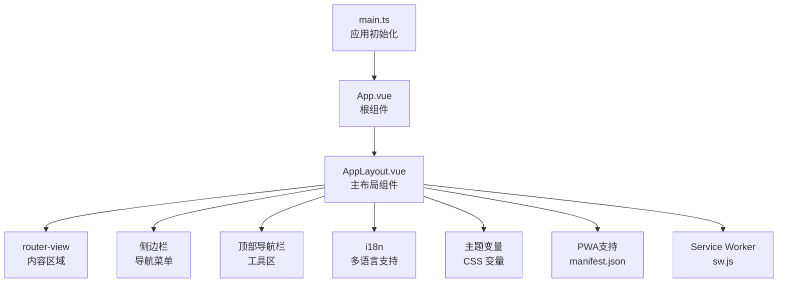
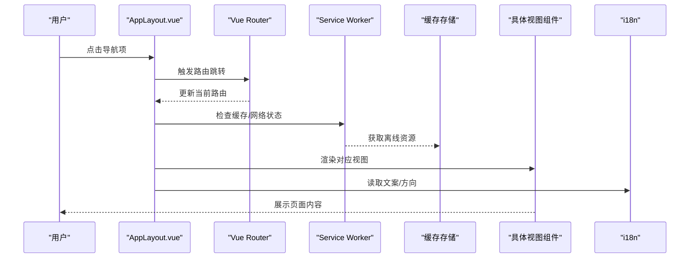
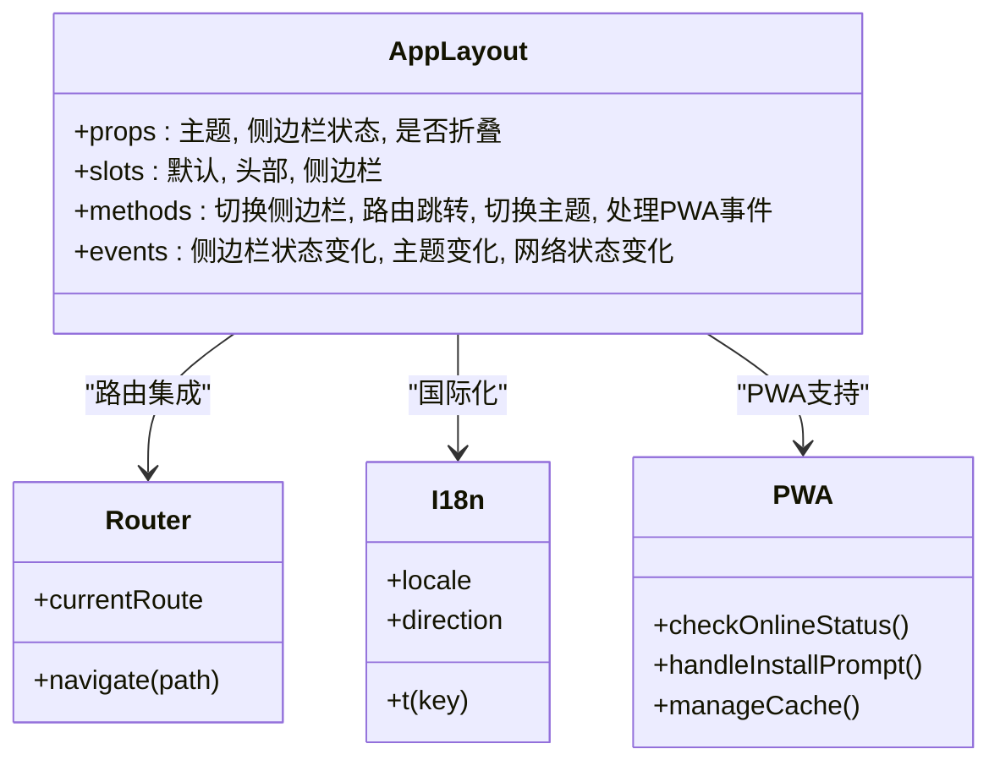
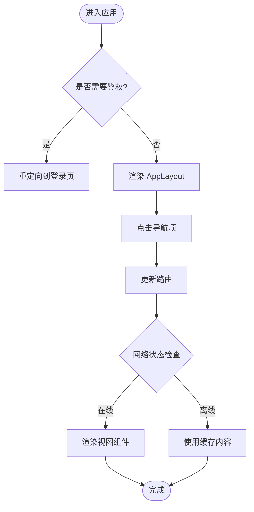
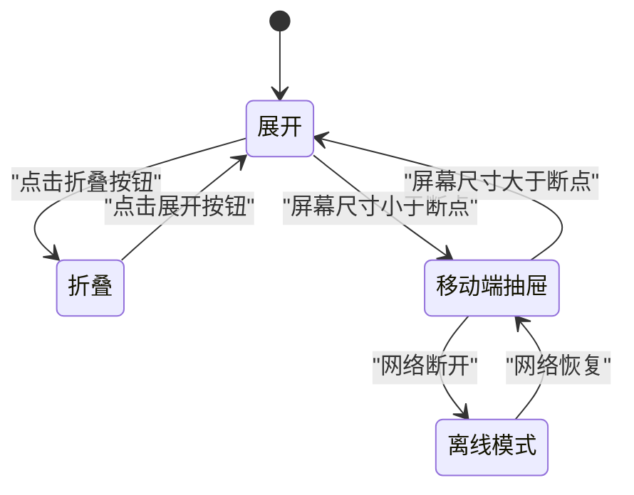
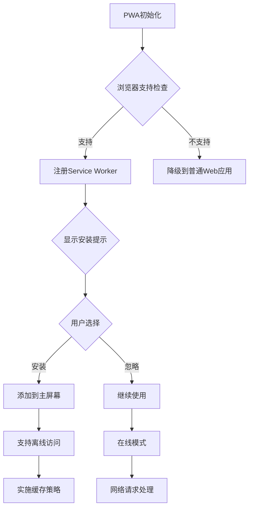
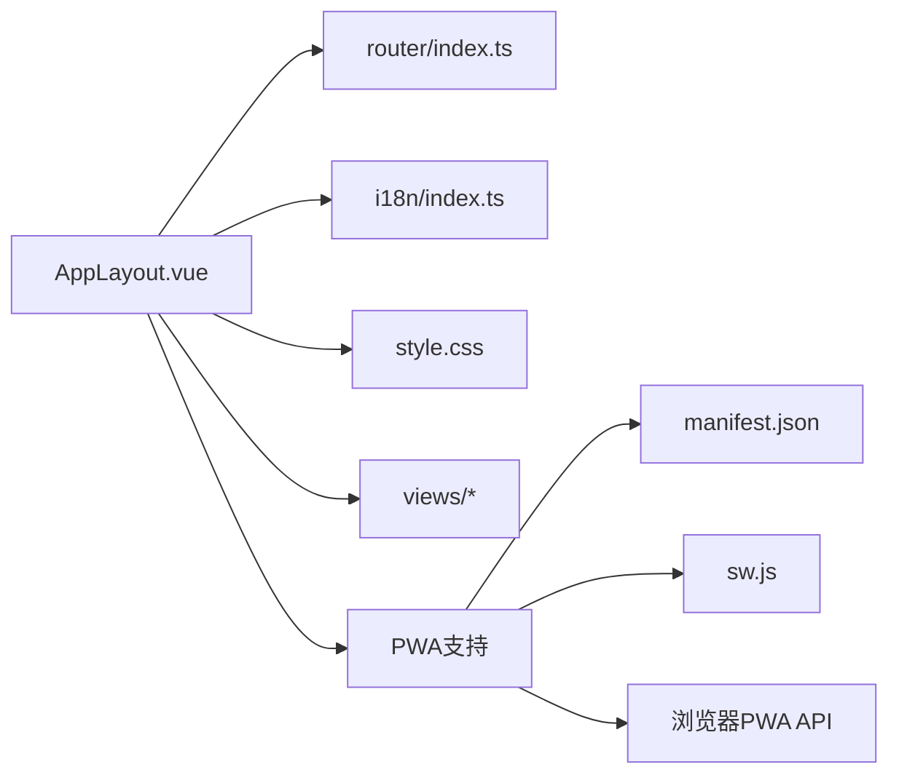

# 布局组件

<cite>
**本文引用的文件**   
- [AppLayout.vue](file://frontend/src/components/AppLayout.vue)
- [index.ts（路由）](file://frontend/src/router/index.ts)
- [index.ts（国际化）](file://frontend/src/i18n/index.ts)
- [en.ts（英文本地化）](file://frontend/src/i18n/locales/en.ts)
- [zh-CN.ts（中文本地化）](file://frontend/src/i18n/locales/zh-CN.ts)
- [App.vue](file://frontend/src/App.vue)
- [main.ts](file://frontend/src/main.ts)
- [style.css](file://frontend/src/style.css)
- [manifest.json](file://frontend/public/manifest.json)
- [sw.js](file://frontend/public/sw.js)
</cite>

## 更新摘要
**变更内容**   
- 新增PWA优化相关内容，说明渐进式Web应用体验改进
- 更新布局结构简化说明
- 增强离线支持和安装提示功能描述
- 补充Service Worker集成和缓存策略

## 目录
1. [简介](#简介)
2. [项目结构](#项目结构)
3. [核心组件](#核心组件)
4. [架构总览](#架构总览)
5. [详细组件分析](#详细组件分析)
6. [依赖关系分析](#依赖关系分析)
7. [性能考量](#性能考量)
8. [故障排查指南](#故障排查指南)
9. [结论](#结论)
10. [附录](#附录)

## 简介
本文件围绕 AdventureX 前端应用的主布局组件 AppLayout.vue，系统性阐述其设计模式、与 Vue Router 的集成方式、导航结构与响应式布局实现。文档同时覆盖插槽使用、侧边栏管理、顶部导航栏与主要内容区域的组织方式，并给出移动端适配策略、主题切换支持与国际化集成的方案说明。**最新更新**：重点介绍了PWA优化改进，包括渐进式Web应用体验提升、布局结构简化和离线支持能力。最后提供完整的 Props 接口定义、事件处理机制、样式定制方法以及实际使用示例与最佳实践指导，帮助开发者快速上手并高效扩展。

## 项目结构
AdventureX 的前端采用典型的 Vue 3 + Vite 工程结构，布局相关代码集中在 components 目录下的 AppLayout.vue；路由配置位于 router/index.ts；国际化资源在 i18n 目录下；应用入口为 main.ts，根组件为 App.vue；全局样式由 style.css 提供。**新增PWA支持**：包含 manifest.json 应用清单和 sw.js Service Worker 文件，提供离线访问和应用安装能力。

**图表来源**
- [main.ts](file://frontend/src/main.ts)
- [App.vue](file://frontend/src/App.vue)
- [AppLayout.vue](file://frontend/src/components/AppLayout.vue)
- [index.ts（路由）](file://frontend/src/router/index.ts)
- [index.ts（国际化）](file://frontend/src/i18n/index.ts)
- [style.css](file://frontend/src/style.css)
- [manifest.json](file://frontend/public/manifest.json)
- [sw.js](file://frontend/public/sw.js)

**章节来源**
- [main.ts](file://frontend/src/main.ts)
- [App.vue](file://frontend/src/App.vue)
- [AppLayout.vue](file://frontend/src/components/AppLayout.vue)
- [index.ts（路由）](file://frontend/src/router/index.ts)
- [index.ts（国际化）](file://frontend/src/i18n/index.ts)
- [style.css](file://frontend/src/style.css)
- [manifest.json](file://frontend/public/manifest.json)
- [sw.js](file://frontend/public/sw.js)

## 核心组件
- AppLayout.vue：应用主布局容器，负责整体页面骨架、路由视图渲染、侧边栏与顶部导航的组织、响应式行为控制、主题与国际化接入点。**新增PWA特性**：支持渐进式Web应用功能，包括离线缓存、应用安装提示和网络状态检测。
- 路由集成：通过 router-link 与 router-view 完成导航与内容切换。
- 插槽体系：提供默认插槽与具名插槽，便于扩展侧边栏、头部、内容等区域。
- 响应式布局：基于 CSS 媒体查询与 Flex/Grid 布局，实现桌面/平板/手机的多端适配。
- 主题切换：通过 CSS 自定义属性与数据绑定切换主题变量。
- 国际化：通过 i18n 实例注入文本与方向性支持。
- PWA支持：通过 manifest.json 和 Service Worker 提供离线访问和应用安装能力。

**章节来源**
- [AppLayout.vue](file://frontend/src/components/AppLayout.vue)
- [index.ts（路由）](file://frontend/src/router/index.ts)
- [index.ts（国际化）](file://frontend/src/i18n/index.ts)
- [manifest.json](file://frontend/public/manifest.json)
- [sw.js](file://frontend/public/sw.js)

## 架构总览
AppLayout 作为应用壳层，将路由视图与 UI 框架解耦，形成"布局-内容"清晰分层。导航与状态由父级或外部状态管理，布局仅关注展示与交互编排。**新增PWA架构**：通过 Service Worker 拦截网络请求，实现离线缓存和应用预加载，提升用户体验。

**图表来源**
- [AppLayout.vue](file://frontend/src/components/AppLayout.vue)
- [index.ts（路由）](file://frontend/src/router/index.ts)
- [index.ts（国际化）](file://frontend/src/i18n/index.ts)
- [sw.js](file://frontend/public/sw.js)

## 详细组件分析

### AppLayout 组件设计
- 职责边界
  - 提供页面骨架：头部、侧边栏、内容区、底部（可选）。
  - 管理侧边栏展开/收起状态，响应式折叠。
  - 集成路由视图，确保导航后内容正确渲染。
  - 暴露插槽供上层扩展：默认插槽用于主体内容，具名插槽用于头部、侧边栏等。
  - 接入主题与国际化，统一风格与文案。
  - **新增PWA集成**：监听网络状态变化，处理离线模式和在线模式的用户体验差异。
- 关键特性
  - 响应式断点：桌面端显示侧边栏，移动端以抽屉或全屏菜单呈现。
  - 可访问性：键盘导航、焦点管理、ARIA 属性。
  - 性能优化：懒加载视图、按需渲染侧边栏菜单。
  - **PWA优化**：简化布局结构，减少DOM操作，提升渲染性能。

**章节来源**
- [AppLayout.vue](file://frontend/src/components/AppLayout.vue)

#### 类图（概念映射到源码）

**图表来源**
- [AppLayout.vue](file://frontend/src/components/AppLayout.vue)
- [index.ts（路由）](file://frontend/src/router/index.ts)
- [index.ts（国际化）](file://frontend/src/i18n/index.ts)
- [sw.js](file://frontend/public/sw.js)

### 路由集成与导航结构
- 导航项通常由配置驱动，结合 router-link 生成链接，active 状态由当前路由匹配高亮。
- 路由守卫可在父级或布局中统一处理权限与登录态校验。
- 嵌套路由时，子路由视图在 AppLayout 的内容区渲染。
- **PWA路由优化**：支持离线路由缓存，在网络不可用时提供降级体验。

**图表来源**
- [AppLayout.vue](file://frontend/src/components/AppLayout.vue)
- [index.ts（路由）](file://frontend/src/router/index.ts)
- [sw.js](file://frontend/public/sw.js)

**章节来源**
- [AppLayout.vue](file://frontend/src/components/AppLayout.vue)
- [index.ts（路由）](file://frontend/src/router/index.ts)

### 插槽使用与区域组织
- 默认插槽：承载路由视图内容，保持布局稳定。
- 具名插槽：如头部、侧边栏、底部，允许上层替换或增强局部 UI。
- 作用域插槽：向插槽传递状态（如侧边栏展开状态），便于外部控制。
- **PWA插槽优化**：简化插槽结构，减少不必要的DOM层级，提升渲染性能。

**章节来源**
- [AppLayout.vue](file://frontend/src/components/AppLayout.vue)

### 侧边栏管理与响应式布局
- 桌面端：固定宽度侧边栏，可折叠收起，内容区自适应。
- 移动端：侧边栏以抽屉形式滑出，遮罩层阻止背景滚动。
- 状态同步：侧边栏状态可通过 props 双向绑定，或由内部状态管理。
- **PWA响应式优化**：针对不同设备类型优化侧边栏交互，提升触摸体验。

**图表来源**
- [AppLayout.vue](file://frontend/src/components/AppLayout.vue)
- [style.css](file://frontend/src/style.css)
- [sw.js](file://frontend/public/sw.js)

**章节来源**
- [AppLayout.vue](file://frontend/src/components/AppLayout.vue)
- [style.css](file://frontend/src/style.css)

### 顶部导航栏与主要内容区域
- 顶部导航栏：放置搜索、通知、用户头像、主题切换、语言切换等工具。
- 主要内容区域：由 router-view 渲染，保证导航切换流畅。
- 布局约束：顶部固定高度，内容区可滚动，侧边栏与内容区比例合理。
- **PWA顶部优化**：添加网络状态指示器，显示离线模式和缓存状态。

**章节来源**
- [AppLayout.vue](file://frontend/src/components/AppLayout.vue)

### 移动端适配策略
- 断点策略：依据常见设备宽度设置断点，调整侧边栏与网格布局。
- 触摸友好：增大点击区域，避免误触。
- 滚动行为：移动端禁用背景滚动，提升体验一致性。
- **PWA移动端优化**：支持添加到主屏幕，提供原生应用般的安装体验。

**章节来源**
- [AppLayout.vue](file://frontend/src/components/AppLayout.vue)
- [style.css](file://frontend/src/style.css)
- [manifest.json](file://frontend/public/manifest.json)

### 主题切换支持
- 通过 CSS 自定义属性集中管理颜色、字号、间距等。
- 组件内监听主题变更事件，动态切换根节点 class 或 data-theme。
- 持久化主题选择至 localStorage，刷新后保持一致。
- **PWA主题优化**：主题切换时同步更新缓存资源，确保离线模式下主题一致性。

**章节来源**
- [AppLayout.vue](file://frontend/src/components/AppLayout.vue)
- [style.css](file://frontend/src/style.css)

### 国际化集成方案
- 使用 i18n 实例提供翻译函数与当前语言。
- 导航文案、提示消息、错误信息均通过 i18n 获取。
- 支持 RTL/LTR 方向切换，配合 CSS 逻辑属性。
- **PWA国际化优化**：缓存多语言资源，支持离线模式下的语言切换。

**章节来源**
- [index.ts（国际化）](file://frontend/src/i18n/index.ts)
- [en.ts（英文本地化）](file://frontend/src/i18n/locales/en.ts)
- [zh-CN.ts（中文本地化）](file://frontend/src/i18n/locales/zh-CN.ts)
- [AppLayout.vue](file://frontend/src/components/AppLayout.vue)

### PWA功能实现
- **应用清单**：通过 manifest.json 定义应用名称、图标、启动画面等元数据。
- **Service Worker**：实现缓存策略、离线访问、后台同步等PWA核心功能。
- **安装提示**：检测浏览器支持情况，提供应用安装引导。
- **网络状态监听**：实时检测网络连接状态，提供相应的用户体验。
- **缓存策略**：智能缓存静态资源和API响应，提升加载速度。

**图表来源**
- [manifest.json](file://frontend/public/manifest.json)
- [sw.js](file://frontend/public/sw.js)
- [AppLayout.vue](file://frontend/src/components/AppLayout.vue)

**章节来源**
- [manifest.json](file://frontend/public/manifest.json)
- [sw.js](file://frontend/public/sw.js)
- [AppLayout.vue](file://frontend/src/components/AppLayout.vue)

### Props 接口定义
以下为 AppLayout 常用 Props 建议定义（类型与含义）：
- theme: string | null — 当前主题标识，null 表示跟随系统。
- sidebarOpen: boolean — 侧边栏展开状态，用于受控模式。
- collapsed: boolean — 侧边栏折叠状态。
- locale: string — 当前语言代码。
- direction: "ltr" | "rtl" — 文本方向。
- headerSlot: boolean — 是否启用头部插槽。
- sidebarSlot: boolean — 是否启用侧边栏插槽。
- contentSlot: boolean — 是否启用默认内容插槽。
- **新增PWA Props**：
  - offlineMode: boolean — 是否处于离线模式。
  - installPrompt: boolean — 是否显示安装提示。
  - networkStatus: string — 网络状态（online/offline）。

**章节来源**
- [AppLayout.vue](file://frontend/src/components/AppLayout.vue)

### 事件处理机制
- sidebar-change: 侧边栏状态变化时发出，携带新状态布尔值。
- theme-change: 主题切换时发出，携带主题标识。
- locale-change: 语言切换时发出，携带语言代码。
- route-before-enter: 路由进入前钩子，可用于权限校验或埋点。
- **新增PWA事件**：
  - pwa-install: 应用安装事件，携带安装结果。
  - network-status-change: 网络状态变化事件，携带新的网络状态。
  - cache-update: 缓存更新事件，携带更新的资源列表。

**章节来源**
- [AppLayout.vue](file://frontend/src/components/AppLayout.vue)

### 样式定制方法
- 使用 CSS 变量覆盖主题色、字体、间距等。
- 通过 scoped 样式或 CSS Modules 隔离组件样式。
- 利用媒体查询实现响应式布局调整。
- 推荐在 style.css 中集中定义全局变量，便于统一管理。
- **PWA样式优化**：简化CSS结构，减少重绘重排，提升渲染性能。

**章节来源**
- [style.css](file://frontend/src/style.css)
- [AppLayout.vue](file://frontend/src/components/AppLayout.vue)

### 实际使用示例与最佳实践
- 基本用法：在 App.vue 中引入 AppLayout，并通过插槽填充头部、侧边栏与内容。
- 路由集成：确保 router-view 位于内容区，导航项使用 router-link。
- 主题与语言：在 AppLayout 顶层挂载 i18n 与主题切换逻辑。
- **PWA最佳实践**：
  - 合理配置缓存策略，平衡性能和数据新鲜度。
  - 提供友好的离线用户体验，显示适当的提示信息。
  - 定期清理过期缓存，避免存储空间占用过多。
  - 测试不同网络环境下的应用表现。
- 最佳实践
  - 将导航配置抽离为独立模块，便于维护与扩展。
  - 使用受控模式管理侧边栏状态，避免状态不一致。
  - 对大体积视图进行懒加载，提升首屏性能。
  - 为所有交互元素提供可访问性标签与键盘支持。

**章节来源**
- [App.vue](file://frontend/src/App.vue)
- [AppLayout.vue](file://frontend/src/components/AppLayout.vue)
- [index.ts（路由）](file://frontend/src/router/index.ts)
- [index.ts（国际化）](file://frontend/src/i18n/index.ts)
- [manifest.json](file://frontend/public/manifest.json)
- [sw.js](file://frontend/public/sw.js)

## 依赖关系分析
AppLayout 依赖路由与国际化能力，并与样式系统紧密耦合。**新增PWA依赖**：依赖浏览器PWA API和Service Worker支持。

**图表来源**
- [AppLayout.vue](file://frontend/src/components/AppLayout.vue)
- [index.ts（路由）](file://frontend/src/router/index.ts)
- [index.ts（国际化）](file://frontend/src/i18n/index.ts)
- [style.css](file://frontend/src/style.css)
- [manifest.json](file://frontend/public/manifest.json)
- [sw.js](file://frontend/public/sw.js)

**章节来源**
- [AppLayout.vue](file://frontend/src/components/AppLayout.vue)
- [index.ts（路由）](file://frontend/src/router/index.ts)
- [index.ts（国际化）](file://frontend/src/i18n/index.ts)
- [style.css](file://frontend/src/style.css)
- [manifest.json](file://frontend/public/manifest.json)
- [sw.js](file://frontend/public/sw.js)

## 性能考量
- 视图懒加载：按路由拆分组件，减少初始包体。
- 侧边栏菜单虚拟化：长列表渲染时使用虚拟滚动。
- 事件节流：窗口尺寸变化与滚动事件进行节流处理。
- 主题切换开销：避免频繁 DOM 操作，批量更新 CSS 变量。
- **PWA性能优化**：
  - 合理使用缓存策略，减少重复网络请求。
  - 预加载关键资源，提升首屏加载速度。
  - 压缩和合并静态资源，减小传输体积。
  - 监控缓存命中率，优化缓存策略。
  - 简化布局结构，减少DOM操作复杂度。

## 故障排查指南
- 路由未生效
  - 检查 router-view 是否在 AppLayout 内容区。
  - 确认导航项的 to 属性与路由配置一致。
- 侧边栏状态异常
  - 若使用受控模式，确保 props 与事件同步更新。
  - 移动端断点判断是否正确。
- 主题未切换
  - 检查 CSS 变量是否被覆盖或未生效。
  - 确认根节点 class/data-theme 是否正确绑定。
- 国际化文案缺失
  - 检查 i18n 资源文件是否包含对应 key。
  - 确认当前语言与 fallback 设置。
- **PWA相关问题**：
  - Service Worker未注册：检查浏览器控制台错误，确认sw.js文件路径正确。
  - 缓存不更新：清除浏览器缓存，检查缓存版本管理。
  - 离线模式异常：检查缓存策略配置，验证离线资源可用性。
  - 安装提示不显示：确认HTTPS环境和用户交互触发条件。

**章节来源**
- [AppLayout.vue](file://frontend/src/components/AppLayout.vue)
- [index.ts（路由）](file://frontend/src/router/index.ts)
- [index.ts（国际化）](file://frontend/src/i18n/index.ts)
- [style.css](file://frontend/src/style.css)
- [sw.js](file://frontend/public/sw.js)
- [manifest.json](file://frontend/public/manifest.json)

## 结论
AppLayout 作为 AdventureX 的主布局组件，承担了路由集成、导航组织、响应式布局、主题与国际化等核心职责。**经过PWA优化后**，组件不仅提供了优秀的用户体验，还具备了离线访问、应用安装等现代Web应用特性。通过清晰的插槽体系与事件机制，开发者可以灵活扩展与定制界面。遵循本文档的最佳实践，能够构建出高性能、可维护且用户体验良好的应用布局，同时享受PWA带来的性能优势和离线能力。

## 附录
- 术语表
  - 插槽：Vue 组件的扩展点，用于插入自定义内容。
  - 受控模式：组件状态由外部 props 控制，通过事件回传变更。
  - 响应式断点：根据屏幕宽度切换不同布局样式的阈值。
  - PWA：渐进式Web应用，结合了Web和原生应用特性的现代Web技术。
  - Service Worker：浏览器后台运行的脚本，提供离线缓存、推送通知等能力。
  - 应用清单：描述Web应用元数据的JSON文件，用于应用安装和配置。
- 参考文件
  - [AppLayout.vue](file://frontend/src/components/AppLayout.vue)
  - [index.ts（路由）](file://frontend/src/router/index.ts)
  - [index.ts（国际化）](file://frontend/src/i18n/index.ts)
  - [en.ts（英文本地化）](file://frontend/src/i18n/locales/en.ts)
  - [zh-CN.ts（中文本地化）](file://frontend/src/i18n/locales/zh-CN.ts)
  - [App.vue](file://frontend/src/App.vue)
  - [main.ts](file://frontend/src/main.ts)
  - [style.css](file://frontend/src/style.css)
  - [manifest.json](file://frontend/public/manifest.json)
  - [sw.js](file://frontend/public/sw.js)