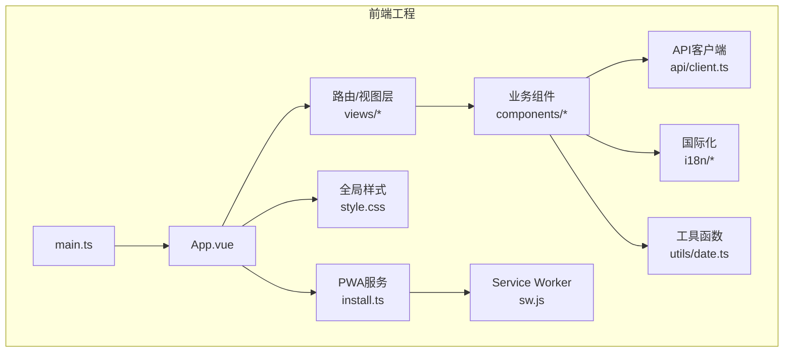
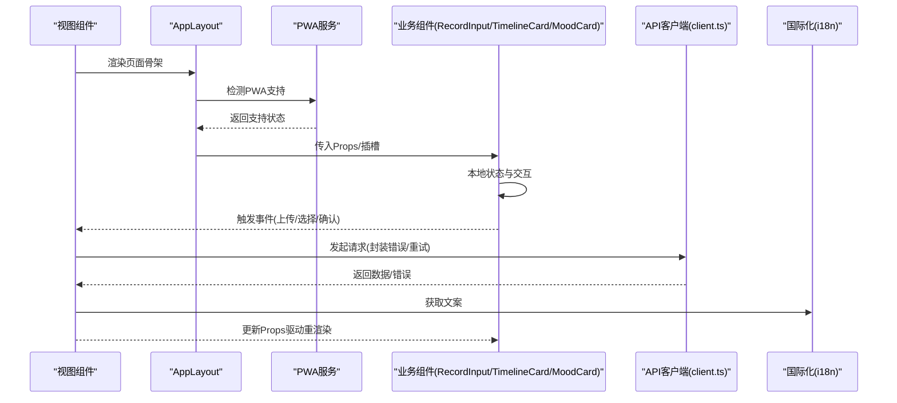
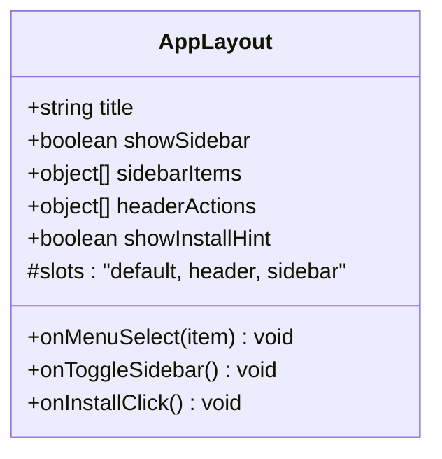
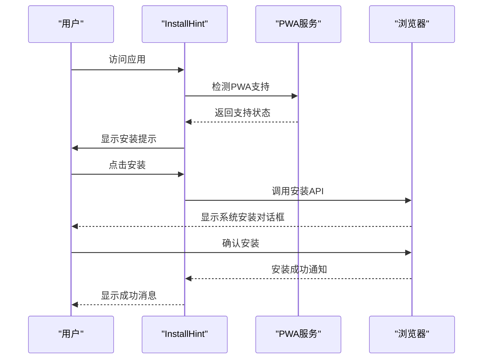
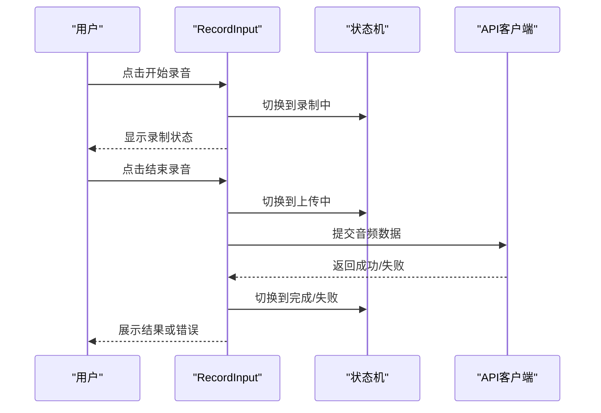
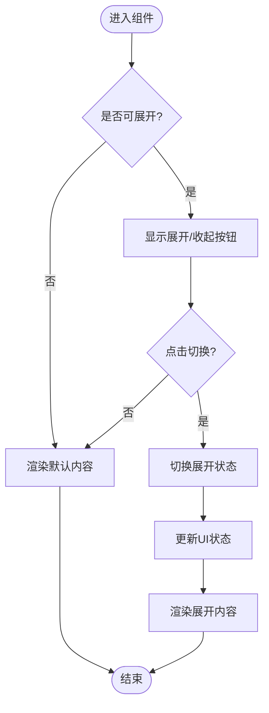
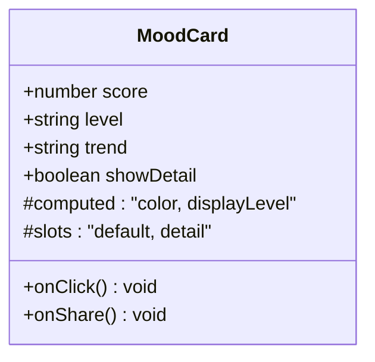
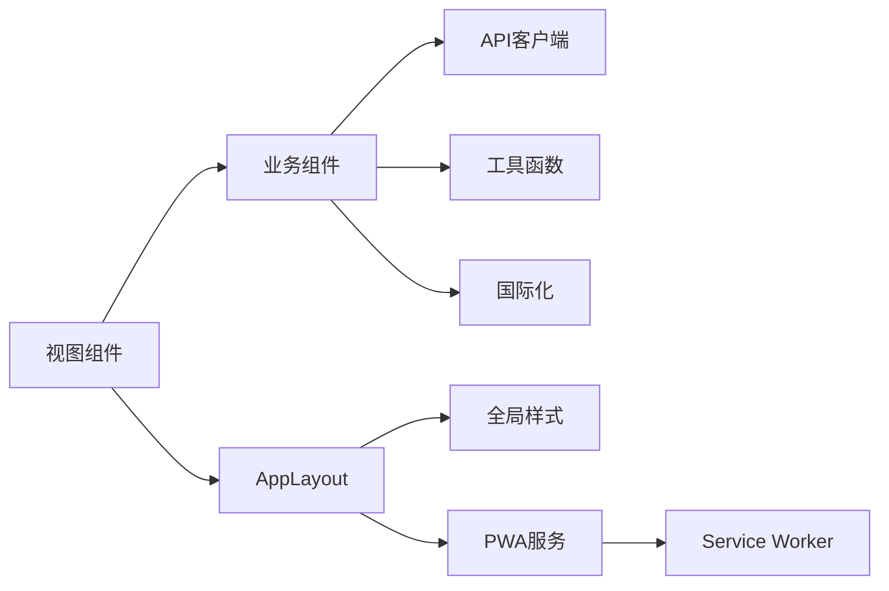

# 组件系统

<cite>
**本文引用的文件**   
- [AppLayout.vue](file://frontend/src/components/AppLayout.vue)
- [RecordInput.vue](file://frontend/src/components/RecordInput.vue)
- [TimelineCard.vue](file://frontend/src/components/TimelineCard.vue)
- [MoodCard.vue](file://frontend/src/components/MoodCard.vue)
- [ContextBanner.vue](file://frontend/src/components/ContextBanner.vue)
- [ExportDialog.vue](file://frontend/src/components/ExportDialog.vue)
- [InstallHint.vue](file://frontend/src/components/InstallHint.vue)
- [StatCard.vue](file://frontend/src/components/StatCard.vue)
- [TaskCard.vue](file://frontend/src/components/TaskCard.vue)
- [TooltipIcon.vue](file://frontend/src/components/TooltipIcon.vue)
- [VoiceRecordButton.vue](file://frontend/src/components/VoiceRecordButton.vue)
- [DashboardView.vue](file://frontend/src/views/DashboardView.vue)
- [HomeView.vue](file://frontend/src/views/HomeView.vue)
- [TasksView.vue](file://frontend/src/views/TasksView.vue)
- [TimelineView.vue](file://frontend/src/views/TimelineView.vue)
- [App.vue](file://frontend/src/App.vue)
- [main.ts](file://frontend/src/main.ts)
- [client.ts](file://frontend/src/api/client.ts)
- [index.ts](file://frontend/src/i18n/index.ts)
- [en.ts](file://frontend/src/i18n/locales/en.ts)
- [zh-CN.ts](file://frontend/src/i18n/locales/zh-CN.ts)
- [date.ts](file://frontend/src/utils/date.ts)
- [style.css](file://frontend/src/style.css)
- [package.json](file://frontend/package.json)
</cite>

## 更新摘要
**所做更改**
- 更新了InstallHint.vue组件的PWA安装提示功能，增强了用户引导体验
- 优化了AppLayout.vue组件与PWA功能的集成
- 新增了PWA安装流程的详细文档说明
- 更新了组件间通信机制中关于PWA状态管理的部分

## 目录
1. [简介](#简介)
2. [项目结构](#项目结构)
3. [核心组件](#核心组件)
4. [架构总览](#架构总览)
5. [详细组件分析](#详细组件分析)
6. [依赖关系分析](#依赖关系分析)
7. [性能考量](#性能考量)
8. [故障排查指南](#故障排查指南)
9. [结论](#结论)
10. [附录](#附录)

## 简介
本文件面向AdventureX前端组件系统的技术文档，聚焦于UI组件的设计模式、接口定义与使用方法。重点覆盖以下核心组件：
- AppLayout布局组件：应用级布局容器，提供导航、侧边栏、主内容区等结构能力，现已集成PWA安装提示功能
- RecordInput录音输入组件：语音录制、状态管理、错误提示与结果回调
- TimelineCard时间线卡片：时间线条目展示、交互与扩展插槽
- MoodCard情绪卡片：情绪数据展示、可视化与交互反馈
- InstallHint安装提示组件：PWA安装引导，支持智能检测与用户友好的安装流程

同时说明组件间通信机制（事件、Props、插槽）、样式定制方案（CSS变量、主题、响应式）以及组件复用与组合的最佳实践。文末提供每个组件的完整使用示例路径与集成指南，帮助快速落地。

## 项目结构
前端采用Vue 3 + TypeScript + Vite组织，组件位于src/components，视图位于src/views，API客户端位于src/api，国际化在src/i18n，工具函数在src/utils。入口为main.ts，根组件为App.vue。

图表来源
- [main.ts:1-50](file://frontend/src/main.ts#L1-L50)
- [App.vue:1-120](file://frontend/src/App.vue#L1-L120)
- [package.json:1-60](file://frontend/package.json#L1-L60)

章节来源
- [main.ts:1-50](file://frontend/src/main.ts#L1-L50)
- [App.vue:1-120](file://frontend/src/App.vue#L1-L120)
- [package.json:1-60](file://frontend/package.json#L1-L60)

## 核心组件
本节概述各核心组件的职责边界与协作方式：
- AppLayout：统一页面骨架、导航与内容区域，承载子路由或视图，现已集成PWA安装提示
- RecordInput：封装录音生命周期（开始/暂停/结束）、状态与错误处理，向上抛出事件
- TimelineCard：渲染时间线条目，支持自定义模板与交互
- MoodCard：情绪指标展示，支持颜色映射、数值范围与交互反馈
- InstallHint：PWA安装引导组件，智能检测浏览器支持并提供用户友好的安装流程

这些组件通过Props传递数据，通过事件向父组件汇报状态变化，通过插槽实现内容扩展。

章节来源
- [AppLayout.vue:1-200](file://frontend/src/components/AppLayout.vue#L1-L200)
- [RecordInput.vue:1-250](file://frontend/src/components/RecordInput.vue#L1-L250)
- [TimelineCard.vue:1-200](file://frontend/src/components/TimelineCard.vue#L1-L200)
- [MoodCard.vue:1-200](file://frontend/src/components/MoodCard.vue#L1-L200)
- [InstallHint.vue:1-100](file://frontend/src/components/InstallHint.vue#L1-L100)

## 架构总览
组件系统遵循"视图层-组件层-服务层"的分层设计：
- 视图层（views/*）负责页面编排与路由切换
- 组件层（components/*）负责可复用UI逻辑与交互
- API层（api/client.ts）负责后端请求封装与错误处理
- 国际化（i18n/*）提供多语言文案
- 工具（utils/*）提供日期格式化等通用能力
- PWA服务（install.ts, sw.js）提供离线支持与安装引导

图表来源
- [AppLayout.vue:1-200](file://frontend/src/components/AppLayout.vue#L1-L200)
- [RecordInput.vue:1-250](file://frontend/src/components/RecordInput.vue#L1-L250)
- [TimelineCard.vue:1-200](file://frontend/src/components/TimelineCard.vue#L1-L200)
- [MoodCard.vue:1-200](file://frontend/src/components/MoodCard.vue#L1-L200)
- [client.ts:1-200](file://frontend/src/api/client.ts#L1-L200)
- [index.ts:1-100](file://frontend/src/i18n/index.ts#L1-L100)

## 详细组件分析

### AppLayout布局组件
职责与特性
- 提供应用级布局容器，包含头部导航、侧边栏、主内容区与底部信息
- 支持响应式适配（移动端折叠导航、侧边栏隐藏）
- 通过插槽注入页面内容，支持命名插槽用于头部与侧边栏扩展
- 与路由集成，根据当前路由高亮菜单项
- **新增**：集成PWA安装提示，自动检测浏览器支持并显示安装引导

Props接口（建议）
- title: string - 页面标题
- showSidebar: boolean - 是否显示侧边栏
- sidebarItems: Array - 侧边栏菜单项配置
- headerActions: Array - 头部操作按钮集合
- **新增**：showInstallHint: boolean - 是否显示PWA安装提示

事件
- onMenuSelect(item): void - 菜单项选择回调
- onToggleSidebar(): void - 侧边栏开关回调
- **新增**：onInstallClick(): void - PWA安装点击回调

插槽
- default: 主内容区
- header: 头部扩展内容
- sidebar: 侧边栏扩展内容

响应式策略
- 基于断点切换布局模式（桌面/平板/手机）
- 使用CSS媒体查询与Flex/Grid布局

最佳实践
- 将页面级状态提升到父视图，避免在布局中维护业务状态
- 通过事件与插槽解耦布局与内容，提升复用性
- **新增**：合理使用PWA安装提示，避免频繁打扰用户

章节来源
- [AppLayout.vue:1-200](file://frontend/src/components/AppLayout.vue#L1-L200)

#### 类图（概念）

图表来源
- [AppLayout.vue:1-200](file://frontend/src/components/AppLayout.vue#L1-L200)

### InstallHint安装提示组件
职责与特性
- **新增**：PWA安装引导组件，智能检测浏览器对PWA的支持
- 提供用户友好的安装流程指导，支持多语言文案
- 自动检测安装时机，避免在不合适的时机打扰用户
- 支持自定义安装按钮样式与位置
- 集成到AppLayout中，作为全局安装入口

Props接口（建议）
- visible: boolean - 是否显示安装提示
- position: "top" | "bottom" | "floating" - 提示位置
- customMessage: string - 自定义提示信息
- showDismiss: boolean - 是否显示关闭按钮

事件
- onInstall(): void - 用户点击安装时的回调
- onDismiss(): void - 用户关闭提示时的回调
- onInstallSuccess(): void - 安装成功回调

插槽
- default: 自定义提示内容
- installButton: 自定义安装按钮

响应式策略
- 移动端优先，适配不同屏幕尺寸
- 支持深色/浅色主题切换
- 智能定位避免遮挡重要内容

最佳实践
- 仅在检测到PWA支持时显示提示
- 尊重用户选择，避免强制安装
- 提供清晰的卸载说明

章节来源
- [InstallHint.vue:1-100](file://frontend/src/components/InstallHint.vue#L1-L100)

#### 时序图（PWA安装流程）

图表来源
- [InstallHint.vue:1-100](file://frontend/src/components/InstallHint.vue#L1-L100)
- [install.ts:1-100](file://frontend/src/install.ts#L1-L100)

### RecordInput录音输入组件
职责与特性
- 封装录音生命周期：开始、暂停、继续、结束
- 管理录音状态（空闲、录制中、暂停、上传中、完成、失败）
- 错误处理：权限拒绝、设备不支持、网络异常
- 结果回调：音频Blob/URL、时长、大小

Props接口（建议）
- mode: "record" | "upload" - 模式选择
- maxDuration: number - 最大时长限制（秒）
- acceptTypes: Array<string> - 接受的文件类型
- autoUpload: boolean - 是否自动上传

事件
- onStart(): void
- onPause(): void
- onResume(): void
- onFinish(blob, meta): void
- onError(error): void

插槽
- preview: 预览区域（波形图/播放控件）
- controls: 自定义控制按钮

响应式策略
- 移动端优先，适配触摸手势与键盘行为
- 大尺寸屏幕优化预览区域布局

最佳实践
- 使用事件驱动而非直接修改内部状态
- 对长录音进行分片上传与进度反馈

章节来源
- [RecordInput.vue:1-250](file://frontend/src/components/RecordInput.vue#L1-L250)

#### 时序图（录音流程）

图表来源
- [RecordInput.vue:1-250](file://frontend/src/components/RecordInput.vue#L1-L250)
- [client.ts:1-200](file://frontend/src/api/client.ts#L1-L200)

### TimelineCard时间线卡片
职责与特性
- 渲染时间线条目，支持图标、标题、描述、时间戳
- 支持展开/收起详情、操作按钮（编辑、删除）
- 支持插槽自定义内容（如图片、视频、附件）

Props接口（建议）
- item: object - 时间线数据对象
- actions: Array<object> - 操作按钮配置
- expandable: boolean - 是否可展开
- compact: boolean - 紧凑模式

事件
- onAction(action, item): void
- onExpand(expanded): void

插槽
- default: 默认内容
- extra: 额外内容（右侧操作区）

响应式策略
- 小屏幕下隐藏次要信息，突出关键内容
- 横向滚动支持（长文本或复杂内容）

最佳实践
- 使用虚拟列表优化大量条目渲染
- 通过事件处理副作用，保持组件纯函数特性

章节来源
- [TimelineCard.vue:1-200](file://frontend/src/components/TimelineCard.vue#L1-L200)

#### 流程图（展开逻辑）

图表来源
- [TimelineCard.vue:1-200](file://frontend/src/components/TimelineCard.vue#L1-L200)

### MoodCard情绪卡片
职责与特性
- 展示情绪指标（分数、等级、趋势）
- 支持颜色映射（积极/中性/消极）
- 支持交互（点击查看详情、分享）

Props接口（建议）
- score: number - 情绪分数（0-100）
- level: string - 情绪等级（positive/neutral/negative）
- trend: string - 趋势（up/down/stable）
- showDetail: boolean - 是否显示详情

事件
- onClick(): void
- onShare(): void

插槽
- default: 自定义内容
- detail: 详情内容

响应式策略
- 移动端简化展示，突出核心指标
- 支持深色/浅色主题切换

最佳实践
- 使用计算属性派生显示值（如等级、颜色）
- 避免在组件内维护外部状态

章节来源
- [MoodCard.vue:1-200](file://frontend/src/components/MoodCard.vue#L1-L200)

#### 类图（概念）

图表来源
- [MoodCard.vue:1-200](file://frontend/src/components/MoodCard.vue#L1-L200)

### 其他组件概览
- ContextBanner：上下文提示横幅，支持关闭与自动消失
- ExportDialog：导出对话框，支持格式选择与进度反馈
- **更新**：InstallHint：增强版PWA安装提示，支持智能检测与用户友好的安装流程
- StatCard：统计卡片，展示关键指标
- TaskCard：任务卡片，支持状态切换与优先级标记
- TooltipIcon：工具提示图标，悬停显示说明
- VoiceRecordButton：录音按钮，轻量级录音入口

章节来源
- [ContextBanner.vue:1-150](file://frontend/src/components/ContextBanner.vue#L1-L150)
- [ExportDialog.vue:1-200](file://frontend/src/components/ExportDialog.vue#L1-L200)
- [InstallHint.vue:1-100](file://frontend/src/components/InstallHint.vue#L1-L100)
- [StatCard.vue:1-150](file://frontend/src/components/StatCard.vue#L1-L150)
- [TaskCard.vue:1-200](file://frontend/src/components/TaskCard.vue#L1-L200)
- [TooltipIcon.vue:1-100](file://frontend/src/components/TooltipIcon.vue#L1-L100)
- [VoiceRecordButton.vue:1-150](file://frontend/src/components/VoiceRecordButton.vue#L1-L150)

## 依赖关系分析
组件间的依赖关系清晰，遵循单向数据流：
- 视图组件依赖布局与业务组件
- 业务组件依赖API客户端与工具函数
- 所有组件共享国际化资源
- **新增**：布局组件依赖PWA服务进行安装引导

图表来源
- [AppLayout.vue:1-200](file://frontend/src/components/AppLayout.vue#L1-L200)
- [RecordInput.vue:1-250](file://frontend/src/components/RecordInput.vue#L1-L250)
- [TimelineCard.vue:1-200](file://frontend/src/components/TimelineCard.vue#L1-L200)
- [MoodCard.vue:1-200](file://frontend/src/components/MoodCard.vue#L1-L200)
- [InstallHint.vue:1-100](file://frontend/src/components/InstallHint.vue#L1-L100)
- [client.ts:1-200](file://frontend/src/api/client.ts#L1-L200)
- [date.ts:1-100](file://frontend/src/utils/date.ts#L1-L100)
- [index.ts:1-100](file://frontend/src/i18n/index.ts#L1-L100)
- [style.css:1-200](file://frontend/src/style.css#L1-L200)

章节来源
- [client.ts:1-200](file://frontend/src/api/client.ts#L1-L200)
- [date.ts:1-100](file://frontend/src/utils/date.ts#L1-L100)
- [index.ts:1-100](file://frontend/src/i18n/index.ts#L1-L100)
- [style.css:1-200](file://frontend/src/style.css#L1-L200)

## 性能考量
- 懒加载：按需加载路由与组件，减少初始包体积
- 虚拟列表：大数据集渲染时使用虚拟滚动
- 防抖节流：高频事件（搜索、滚动）使用防抖节流
- 缓存策略：API响应缓存与本地存储结合
- 内存管理：及时清理事件监听器与定时器
- **新增**：PWA缓存：利用Service Worker缓存静态资源与API响应

[本节为通用指导，不直接分析具体文件]

## 故障排查指南
常见问题与解决方案：
- 录音权限被拒绝：检查浏览器权限设置与HTTPS环境
- 组件未渲染：确认Props传递正确与插槽使用规范
- 样式错乱：检查CSS变量与主题配置
- 国际化失效：确认语言包加载与当前语言设置
- **新增**：PWA安装失败：检查manifest.json配置与服务Worker注册

调试技巧：
- 使用Vue DevTools查看组件状态
- 添加日志输出定位问题
- 使用浏览器开发者工具检查网络请求
- **新增**：检查PWA相关控制台警告与错误

章节来源
- [RecordInput.vue:1-250](file://frontend/src/components/RecordInput.vue#L1-L250)
- [client.ts:1-200](file://frontend/src/api/client.ts#L1-L200)
- [index.ts:1-100](file://frontend/src/i18n/index.ts#L1-L100)
- [InstallHint.vue:1-100](file://frontend/src/components/InstallHint.vue#L1-L100)

## 结论
AdventureX组件系统采用清晰的层次结构与标准化接口设计，具备良好的可复用性与扩展性。通过事件驱动、Props传递与插槽机制，实现了松耦合的组件通信。响应式设计与主题支持确保了跨设备的一致性体验。**新增的PWA安装引导功能进一步提升了用户体验，使应用能够像原生应用一样被安装和使用**。遵循本文档的最佳实践，可以快速构建高质量的用户界面。

[本节为总结性内容，不直接分析具体文件]

## 附录

### 组件使用示例路径
- AppLayout使用示例：[DashboardView.vue](file://frontend/src/views/DashboardView.vue)
- RecordInput使用示例：[HomeView.vue](file://frontend/src/views/HomeView.vue)
- TimelineCard使用示例：[TimelineView.vue](file://frontend/src/views/TimelineView.vue)
- MoodCard使用示例：[TasksView.vue](file://frontend/src/views/TasksView.vue)
- **新增**：InstallHint使用示例：[AppLayout.vue](file://frontend/src/components/AppLayout.vue)

### 集成指南
1. 安装依赖：参考package.json中的依赖版本
2. 引入组件：在视图中导入并使用对应组件
3. 配置Props：根据组件接口传递必要参数
4. 处理事件：监听组件事件并执行相应逻辑
5. 样式定制：通过CSS变量或主题配置调整外观
6. **新增**：PWA配置：确保manifest.json和服务Worker正确配置

章节来源
- [DashboardView.vue:1-200](file://frontend/src/views/DashboardView.vue#L1-L200)
- [HomeView.vue:1-200](file://frontend/src/views/HomeView.vue#L1-L200)
- [TimelineView.vue:1-200](file://frontend/src/views/TimelineView.vue#L1-L200)
- [TasksView.vue:1-200](file://frontend/src/views/TasksView.vue#L1-L200)
- [AppLayout.vue:1-200](file://frontend/src/components/AppLayout.vue#L1-L200)
- [package.json:1-60](file://frontend/package.json#L1-L60)