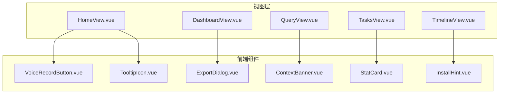
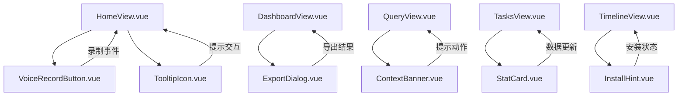
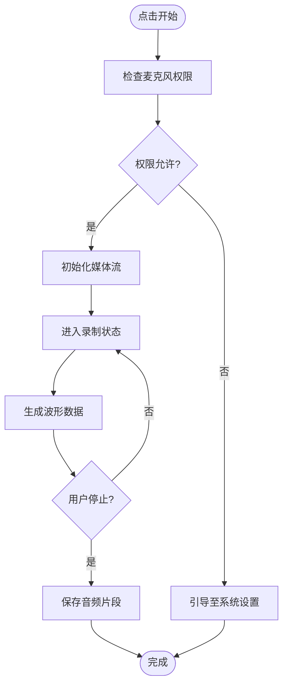
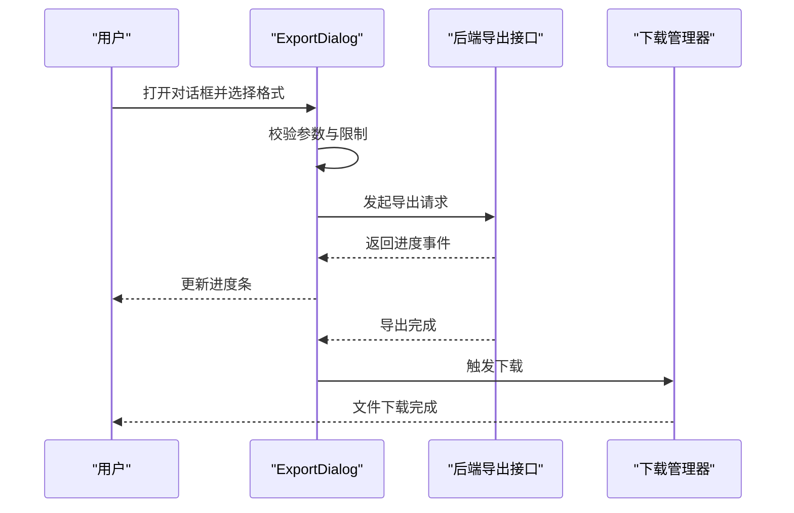
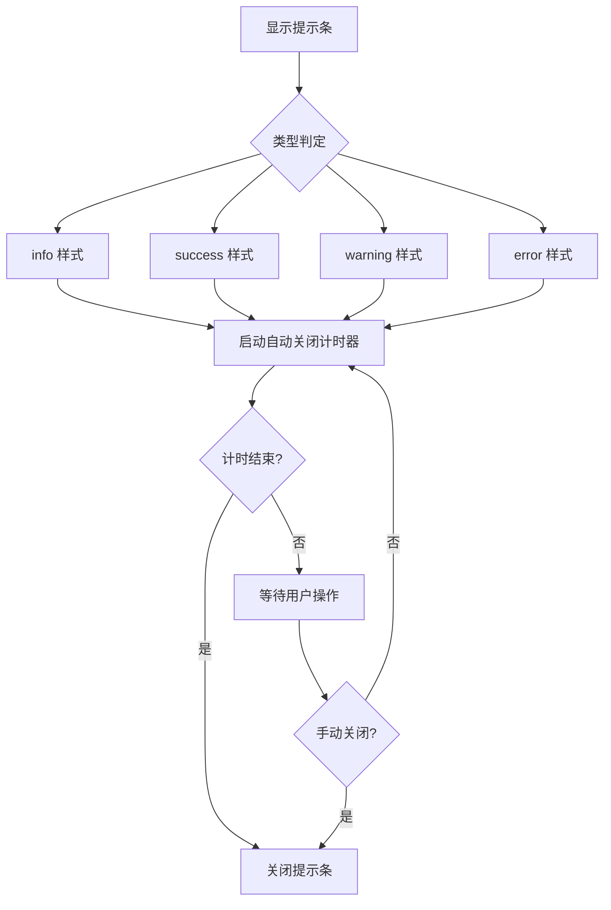
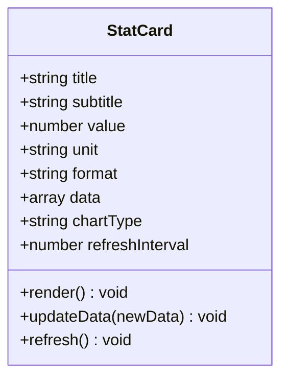
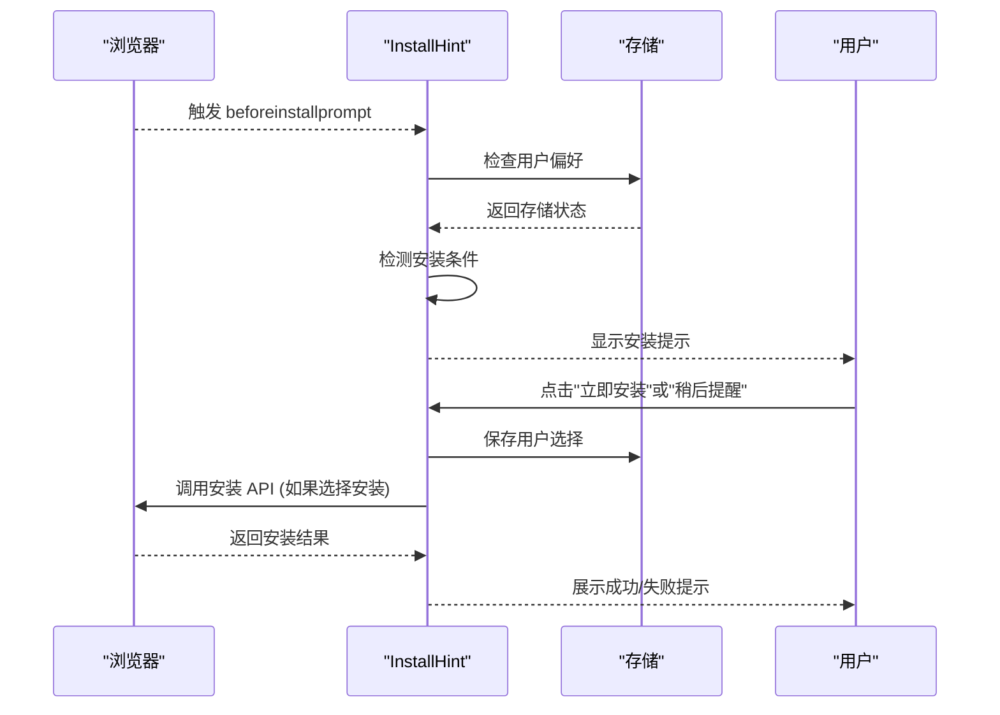
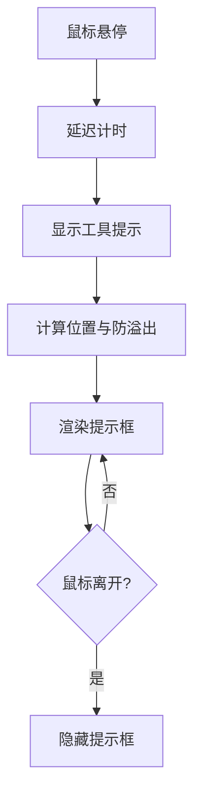
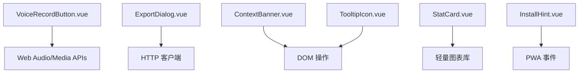

# 通用组件

<cite>
**本文引用的文件**   
- [VoiceRecordButton.vue](file://frontend/src/components/VoiceRecordButton.vue)
- [ExportDialog.vue](file://frontend/src/components/ExportDialog.vue)
- [ContextBanner.vue](file://frontend/src/components/ContextBanner.vue)
- [StatCard.vue](file://frontend/src/components/StatCard.vue)
- [InstallHint.vue](file://frontend/src/components/InstallHint.vue)
- [TooltipIcon.vue](file://frontend/src/components/TooltipIcon.vue)
</cite>

## 更新摘要
**所做更改**   
- 更新了 InstallHint 组件分析部分，反映 PWA 安装提示功能的增强
- 增强了 PWA 检测、安装引导和用户交互的详细描述
- 更新了相关配置选项和事件回调的说明

## 目录
1. [简介](#简介)
2. [项目结构](#项目结构)
3. [核心组件](#核心组件)
4. [架构总览](#架构总览)
5. [详细组件分析](#详细组件分析)
6. [依赖分析](#依赖分析)
7. [性能考虑](#性能考虑)
8. [故障排查指南](#故障排查指南)
9. [结论](#结论)
10. [附录](#附录)

## 简介
本文件为 AdventureX 前端通用组件的详细文档，聚焦以下六个组件：
- VoiceRecordButton：语音录制按钮，涵盖音频权限处理、录制状态管理与用户交互。
- ExportDialog：导出对话框，支持文件格式选择、进度显示与下载处理。
- ContextBanner：上下文提示条，负责信息展示、自动消失与自定义样式。
- StatCard：统计卡片，用于数值展示、图表集成与数据更新。
- InstallHint：安装提示，实现 PWA 检测、安装引导与用户操作。
- TooltipIcon：工具提示图标，提供悬停显示、位置计算与内容定制。

每个组件均给出配置项、事件回调与样式定制方法，帮助开发者快速集成与扩展。

## 项目结构
这些通用组件位于前端 src/components 目录下，采用按功能划分的组织方式，便于在视图层按需引入与复用。

## 核心组件
本节概述各组件的职责边界与对外接口风格（Props、Emits、Slots、样式钩子），并说明其在应用中的典型使用场景。

- VoiceRecordButton
  - 职责：管理麦克风权限、开始/停止录制、时长与波形可视化、错误提示。
  - 关键能力：权限请求与降级提示；录制状态机（空闲/请求中/已授权/录制中/暂停/错误）；媒体流生命周期管理。
  - 事件：onStart、onStop、onError、onDurationChange、onWaveformUpdate。
  - 样式：按钮尺寸、颜色、禁用态、录音动画、错误边框等。

- ExportDialog
  - 职责：封装导出流程，包括格式选择、参数校验、后端调用、进度反馈与下载触发。
  - 关键能力：多格式支持（如 CSV/JSON/PDF）、并发控制、取消与重试、错误回退。
  - 事件：onProgress、onSuccess、onError、onCancel。
  - 样式：模态框尺寸、进度条样式、按钮组布局。

- ContextBanner
  - 职责：在页面顶部或指定区域展示上下文提示，支持自动消失与手动关闭。
  - 关键能力：消息类型（info/success/warning/error）、自动计时器、可定制图标与动作按钮。
  - 事件：onClose、onAction。
  - 样式：背景色、文字色、圆角、阴影、定位偏移。

- StatCard
  - 职责：展示关键指标数值，并可嵌入轻量图表（折线/柱状/环形）。
  - 关键能力：数值格式化、单位与精度控制、图表数据源绑定、刷新策略。
  - 事件：onRefresh、onDataChange。
  - 样式：卡片尺寸、标题/副标题排版、图表容器高度、主题色。

- InstallHint
  - 职责：检测 PWA 可用性，引导用户安装到桌面或应用列表。
  - 关键能力：beforeinstallprompt 事件监听、安装时机判断、失败回退文案、用户偏好记忆。
  - 事件：onInstalled、onDismiss、onError。
  - 样式：提示条位置、图标、按钮样式、移动端适配。

- TooltipIcon
  - 职责：以图标形式提供辅助说明，鼠标悬停时显示工具提示。
  - 关键能力：位置计算（上下左右）、防溢出、延迟显示、内容插槽。
  - 事件：onShow、onHide。
  - 样式：提示框背景、箭头方向、最大宽度、字体大小。

**章节来源**
- [VoiceRecordButton.vue](file://frontend/src/components/VoiceRecordButton.vue)
- [ExportDialog.vue](file://frontend/src/components/ExportDialog.vue)
- [ContextBanner.vue](file://frontend/src/components/ContextBanner.vue)
- [StatCard.vue](file://frontend/src/components/StatCard.vue)
- [InstallHint.vue](file://frontend/src/components/InstallHint.vue)
- [TooltipIcon.vue](file://frontend/src/components/TooltipIcon.vue)

## 架构总览
下图展示了各组件在视图层中的协作关系与数据流向。组件之间保持松耦合，通过事件与 Props 进行通信。

## 详细组件分析

### VoiceRecordButton 组件分析
- 权限处理
  - 首次点击触发权限请求，若拒绝则引导用户至系统设置。
  - 浏览器不支持时提供降级提示与替代方案。
- 录制状态管理
  - 状态机：空闲 → 请求中 → 已授权 → 录制中 → 暂停/结束 → 错误。
  - 使用 MediaRecorder 与 AudioContext 管理媒体流与波形。
- 用户交互
  - 长按/点击切换录制；实时时长与波形反馈；错误时抖动与提示。
- 配置选项
  - 按钮尺寸、颜色、是否启用波形、自动停止阈值、错误提示文案。
- 事件回调
  - onStart、onStop、onError、onDurationChange、onWaveformUpdate。
- 样式定制
  - 覆盖按钮类名、录音动画、错误边框、禁用态样式。

**图示来源**
- [VoiceRecordButton.vue](file://frontend/src/components/VoiceRecordButton.vue)

**章节来源**
- [VoiceRecordButton.vue](file://frontend/src/components/VoiceRecordButton.vue)

### ExportDialog 组件分析
- 文件格式选择
  - 支持多种格式（CSV/JSON/PDF），根据选择动态渲染表单字段。
- 进度显示
  - 使用进度条与百分比文本，支持分段进度与中断恢复。
- 下载处理
  - 成功后触发浏览器下载；失败时提供重试与错误详情。
- 配置选项
  - 默认格式、最大文件大小、是否允许取消、下载文件名模板。
- 事件回调
  - onProgress、onSuccess、onError、onCancel。
- 样式定制
  - 模态框尺寸、进度条颜色、按钮布局、错误提示样式。

**图示来源**
- [ExportDialog.vue](file://frontend/src/components/ExportDialog.vue)

**章节来源**
- [ExportDialog.vue](file://frontend/src/components/ExportDialog.vue)

### ContextBanner 组件分析
- 信息展示
  - 支持不同类型（info/success/warning/error），自动匹配图标与配色。
- 自动消失
  - 可配置延时自动关闭；支持手动关闭与动作按钮。
- 自定义样式
  - 背景色、文字色、圆角、阴影、定位偏移、最大宽度。
- 配置选项
  - 消息文本、类型、是否自动关闭、延时时长、是否显示关闭按钮。
- 事件回调
  - onClose、onAction。
- 使用建议
  - 在路由切换或异步操作完成后展示，避免频繁闪烁。

**图示来源**
- [ContextBanner.vue](file://frontend/src/components/ContextBanner.vue)

**章节来源**
- [ContextBanner.vue](file://frontend/src/components/ContextBanner.vue)

### StatCard 组件分析
- 数值展示
  - 支持整数、小数、百分比、货币等单位与精度格式化。
- 图表集成
  - 内置轻量图表（折线/柱状/环形），支持数据源绑定与刷新。
- 数据更新
  - 响应式数据更新，防抖刷新策略，避免频繁重绘。
- 配置选项
  - 标题、副标题、数值格式、图表类型、数据数组、刷新间隔。
- 事件回调
  - onRefresh、onDataChange。
- 样式定制
  - 卡片尺寸、标题排版、图表容器高度、主题色。

**图示来源**
- [StatCard.vue](file://frontend/src/components/StatCard.vue)

**章节来源**
- [StatCard.vue](file://frontend/src/components/StatCard.vue)

### InstallHint 组件分析
**更新** 该组件经过大幅增强，改进了 PWA 安装提示功能，新增了更完善的用户交互和错误处理机制。

- PWA 检测
  - 监听 beforeinstallprompt 事件，判断是否可安装。
  - 支持多次检测与缓存机制，避免重复检测开销。
  - 兼容不同浏览器的 PWA 支持差异。
- 安装引导
  - 提供明确的操作步骤与按钮，失败时显示回退文案。
  - 支持多语言文案与本地化支持。
  - 智能显示时机，避免干扰用户体验。
- 用户操作
  - 支持"稍后提醒"与"立即安装"，记录用户选择。
  - 用户偏好持久化存储，避免重复提示。
  - 支持安装状态跟踪与反馈。
- 配置选项
  - 提示文案、按钮文案、是否显示"稍后提醒"、检测频率、本地化配置。
- 事件回调
  - onInstalled、onDismiss、onError、onPreferenceChange。
- 样式定制
  - 提示条位置、图标、按钮样式、移动端适配、主题色。

**图示来源**
- [InstallHint.vue](file://frontend/src/components/InstallHint.vue)

**章节来源**
- [InstallHint.vue](file://frontend/src/components/InstallHint.vue)

### TooltipIcon 组件分析
- 悬停显示
  - 鼠标悬停或触摸时显示工具提示，支持延迟与防抖。
- 位置计算
  - 自动计算上下左右位置，避免溢出视口。
- 内容定制
  - 支持插槽插入富文本或组件。
- 配置选项
  - 提示内容、位置、延迟时间、最大宽度、是否跟随滚动。
- 事件回调
  - onShow、onHide。
- 样式定制
  - 提示框背景、箭头方向、字体大小、阴影。

**图示来源**
- [TooltipIcon.vue](file://frontend/src/components/TooltipIcon.vue)

**章节来源**
- [TooltipIcon.vue](file://frontend/src/components/TooltipIcon.vue)

## 依赖分析
各组件主要依赖浏览器原生 API（如 MediaRecorder、beforeinstallprompt）与前端框架的响应式机制。组件间无强耦合，通过事件与 Props 通信，便于独立测试与替换。

**章节来源**
- [VoiceRecordButton.vue](file://frontend/src/components/VoiceRecordButton.vue)
- [ExportDialog.vue](file://frontend/src/components/ExportDialog.vue)
- [ContextBanner.vue](file://frontend/src/components/ContextBanner.vue)
- [StatCard.vue](file://frontend/src/components/StatCard.vue)
- [InstallHint.vue](file://frontend/src/components/InstallHint.vue)
- [TooltipIcon.vue](file://frontend/src/components/TooltipIcon.vue)

## 性能考虑
- VoiceRecordButton
  - 波形数据采样率与帧率需平衡，避免主线程阻塞；建议使用 OffscreenCanvas 或 Web Worker 处理。
  - 媒体流释放要及时，防止内存泄漏。
- ExportDialog
  - 大文件导出应分片与断点续传；进度事件节流更新 UI。
- ContextBanner
  - 自动关闭计时器应在组件销毁时清理；避免频繁创建/销毁实例。
- StatCard
  - 图表数据更新使用增量更新与防抖；避免全量重绘。
- InstallHint
  - PWA 检测仅在必要时执行，避免重复监听事件；用户偏好缓存减少存储访问。
  - 智能显示时机，避免不必要的 DOM 操作。
- TooltipIcon
  - 位置计算与渲染应防抖；大量提示时使用虚拟列表或懒加载。

## 故障排查指南
- VoiceRecordButton
  - 权限被拒：检查浏览器设置与 HTTPS 环境；提供降级路径。
  - 录制无声：确认设备输入选择与权限；检查 AudioContext 状态。
- ExportDialog
  - 导出失败：查看网络状态与后端日志；增加重试与错误码映射。
  - 进度卡住：检查进度事件是否持续；添加超时与取消逻辑。
- ContextBanner
  - 不消失：检查计时器是否被清理；确保组件卸载时移除监听。
  - 样式错乱：检查 CSS 优先级与容器布局。
- StatCard
  - 图表不更新：确认数据源变更与响应式绑定；检查图表库版本兼容性。
  - 数值异常：验证格式化函数与单位转换。
- InstallHint
  - 无法安装：确认 PWA 清单与服务工作者配置；检查域名与协议。
  - 提示不显示：检查 beforeinstallprompt 事件是否触发；验证用户偏好存储。
  - 重复提示：检查用户偏好是否正确保存与读取。
- TooltipIcon
  - 位置错误：检查视口尺寸变化监听；确保防溢出逻辑生效。
  - 内容截断：调整最大宽度与换行策略。

**章节来源**
- [VoiceRecordButton.vue](file://frontend/src/components/VoiceRecordButton.vue)
- [ExportDialog.vue](file://frontend/src/components/ExportDialog.vue)
- [ContextBanner.vue](file://frontend/src/components/ContextBanner.vue)
- [StatCard.vue](file://frontend/src/components/StatCard.vue)
- [InstallHint.vue](file://frontend/src/components/InstallHint.vue)
- [TooltipIcon.vue](file://frontend/src/components/TooltipIcon.vue)

## 结论
上述六个通用组件覆盖了音频录制、数据导出、提示展示、统计展示、PWA 安装与工具提示等常见场景。通过清晰的配置项、事件回调与样式定制方法，开发者可以快速集成并满足多样化需求。建议在项目中统一封装与主题化，以提升一致性与可维护性。特别是 InstallHint 组件的增强，为 PWA 安装提供了更加完善和友好的用户体验。

## 附录
- 最佳实践
  - 组件拆分：将复杂逻辑拆分为子组件或组合式函数。
  - 错误处理：统一错误边界与用户友好提示。
  - 国际化：文案抽离至 i18n 文件，便于多语言支持。
  - 可访问性：确保键盘导航与屏幕阅读器兼容。
  - 用户偏好：合理存储用户选择，提升用户体验。
- 参考资源
  - Web Audio API 文档
  - MediaRecorder 规范
  - PWA 安装指南
  - 轻量图表库文档
  - beforeinstallprompt API 文档