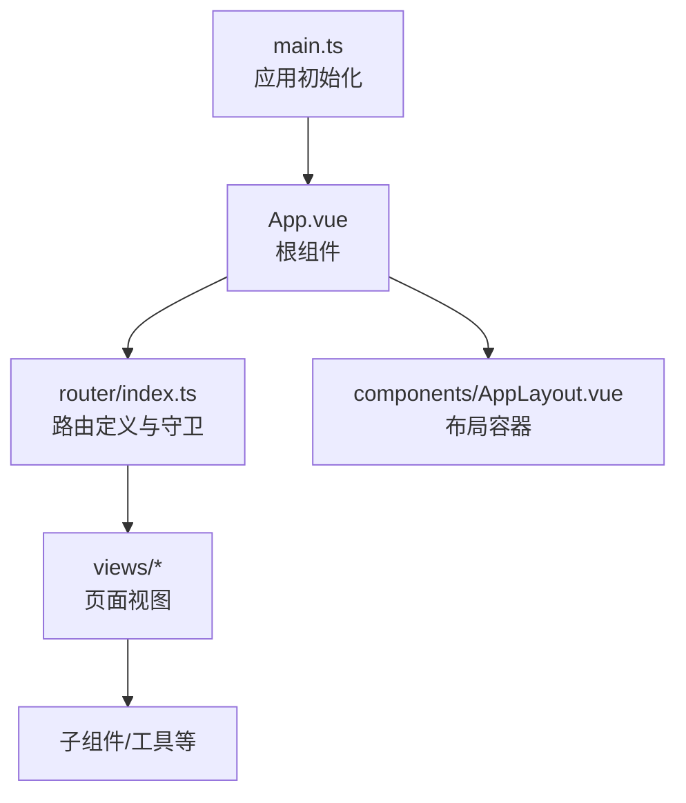
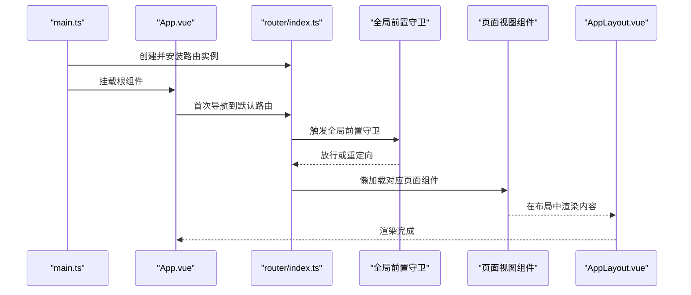
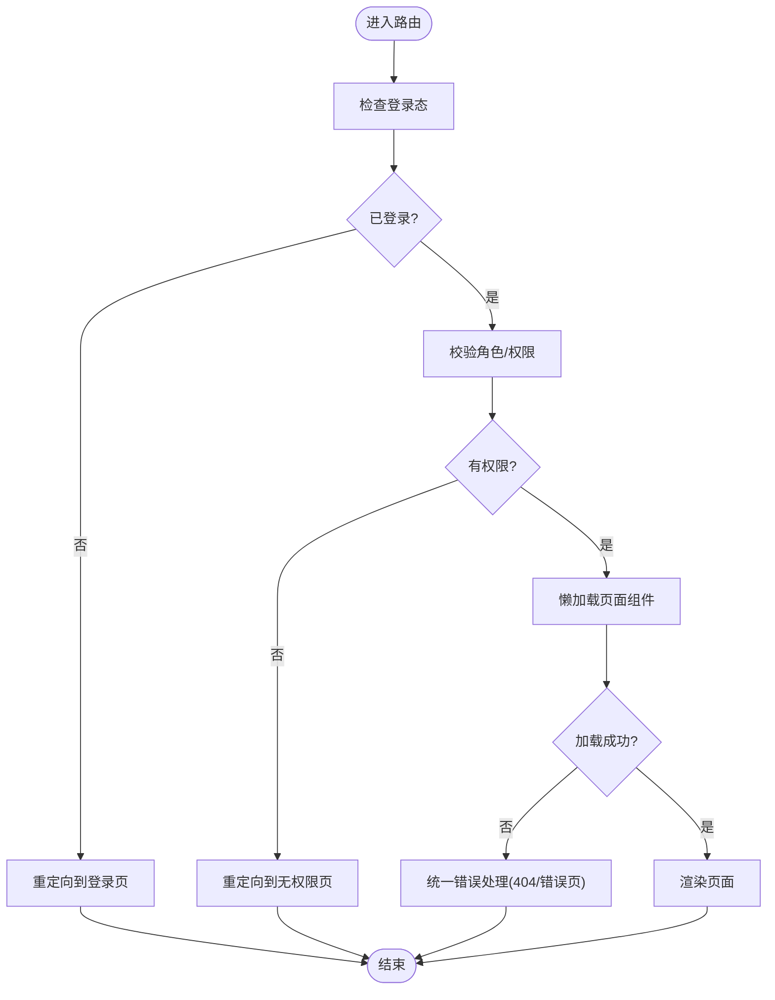
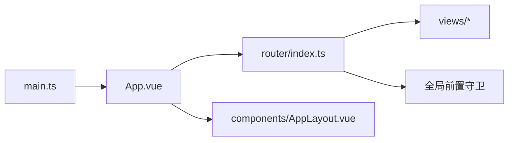

# 路由导航

<cite>
**本文引用的文件**   
- [frontend/src/router/index.ts](file://frontend/src/router/index.ts)
- [frontend/src/main.ts](file://frontend/src/main.ts)
- [frontend/src/App.vue](file://frontend/src/App.vue)
- [frontend/src/views/HomeView.vue](file://frontend/src/views/HomeView.vue)
- [frontend/src/views/DashboardView.vue](file://frontend/src/views/DashboardView.vue)
- [frontend/src/views/QueryView.vue](file://frontend/src/views/QueryView.vue)
- [frontend/src/views/TasksView.vue](file://frontend/src/views/TasksView.vue)
- [frontend/src/views/TimelineView.vue](file://frontend/src/views/TimelineView.vue)
- [frontend/src/components/AppLayout.vue](file://frontend/src/components/AppLayout.vue)
- [frontend/package.json](file://frontend/package.json)
</cite>

## 目录
1. [简介](#简介)
2. [项目结构](#项目结构)
3. [核心组件](#核心组件)
4. [架构总览](#架构总览)
5. [详细组件分析](#详细组件分析)
6. [依赖关系分析](#依赖关系分析)
7. [性能考虑](#性能考虑)
8. [故障排查指南](#故障排查指南)
9. [结论](#结论)
10. [附录](#附录)

## 简介
本文件围绕 AdventureX 前端的路由导航体系，系统性说明 Vue Router 的配置方法、路由守卫实现与导航逻辑设计。文档覆盖路由元信息配置、动态路由生成、嵌套路由结构、懒加载与缓存策略、性能优化方案，以及导航守卫的使用场景、权限验证流程与错误处理机制，并给出路由设计规范与安全建议，帮助读者快速理解与扩展项目的路由系统。

## 项目结构
AdventureX 前端采用基于功能模块的目录组织方式：视图按页面划分在 views 目录，通用布局与业务组件位于 components，路由定义集中在 router 目录，应用入口在 main.ts，根组件为 App.vue。该结构便于维护路由与页面的一一对应关系，也利于后续扩展子路由与权限控制。

图表来源 
- [frontend/src/main.ts](file://frontend/src/main.ts)
- [frontend/src/App.vue](file://frontend/src/App.vue)
- [frontend/src/router/index.ts](file://frontend/src/router/index.ts)
- [frontend/src/components/AppLayout.vue](file://frontend/src/components/AppLayout.vue)

章节来源
- [frontend/src/main.ts](file://frontend/src/main.ts)
- [frontend/src/App.vue](file://frontend/src/App.vue)
- [frontend/src/router/index.ts](file://frontend/src/router/index.ts)

## 核心组件
- 路由定义与守卫：集中管理所有路由表、元信息与全局前置守卫，统一处理鉴权、跳转与错误提示。
- 页面视图：各业务页面以独立组件形式存在，按需通过懒加载引入，减少首屏体积。
- 布局组件：提供统一的页面外壳（侧边栏、头部、内容区），配合嵌套路由渲染子页面。
- 应用入口：创建并挂载路由实例，确保在应用启动时完成路由注册与守卫绑定。

章节来源
- [frontend/src/router/index.ts](file://frontend/src/router/index.ts)
- [frontend/src/main.ts](file://frontend/src/main.ts)
- [frontend/src/App.vue](file://frontend/src/App.vue)
- [frontend/src/components/AppLayout.vue](file://frontend/src/components/AppLayout.vue)

## 架构总览
下图展示了从应用启动到页面渲染的关键路径，包括路由实例创建、全局守卫执行、页面组件懒加载与布局渲染。

图表来源 
- [frontend/src/main.ts](file://frontend/src/main.ts)
- [frontend/src/App.vue](file://frontend/src/App.vue)
- [frontend/src/router/index.ts](file://frontend/src/router/index.ts)
- [frontend/src/components/AppLayout.vue](file://frontend/src/components/AppLayout.vue)

## 详细组件分析

### 路由定义与守卫（router/index.ts）
- 路由表组织：按功能域分组，使用 path、name、component、meta 描述每个路由；对需要权限控制的页面在 meta 中标注角色或权限标识。
- 动态路由生成：根据用户角色或后端返回的菜单数据，动态构建可访问路由集合，避免硬编码敏感路由。
- 嵌套路由：通过 children 字段将公共布局与子页面组合，提升复用性与一致性。
- 懒加载：使用函数式 component() 或 import() 语法按需加载页面组件，降低初始包体。
- 全局前置守卫：在进入路由前校验登录态、角色权限、参数合法性；未授权时重定向至登录页或无权限提示页。
- 错误处理：捕获未知路由、网络异常与组件加载失败，统一跳转到 404 或错误页，并在控制台输出调试信息。

图表来源 
- [frontend/src/router/index.ts](file://frontend/src/router/index.ts)

章节来源
- [frontend/src/router/index.ts](file://frontend/src/router/index.ts)

### 页面视图（views/*）
- HomeView：首页入口，通常作为默认路由或欢迎页。
- DashboardView：仪表盘，展示关键指标与概览。
- QueryView：查询界面，支持搜索与结果展示。
- TasksView：任务列表与管理。
- TimelineView：时间线视图，用于记录与回顾。

这些页面组件通过路由懒加载引入，仅在访问时加载，有助于提升首屏性能。

章节来源
- [frontend/src/views/HomeView.vue](file://frontend/src/views/HomeView.vue)
- [frontend/src/views/DashboardView.vue](file://frontend/src/views/DashboardView.vue)
- [frontend/src/views/QueryView.vue](file://frontend/src/views/QueryView.vue)
- [frontend/src/views/TasksView.vue](file://frontend/src/views/TasksView.vue)
- [frontend/src/views/TimelineView.vue](file://frontend/src/views/TimelineView.vue)

### 布局组件（components/AppLayout.vue）
- 提供统一的头部、侧边栏与内容区域，配合嵌套路由渲染子页面。
- 与路由联动：根据当前路由高亮菜单项，响应式适配移动端布局。
- 权限可见性：结合路由元信息控制菜单显示与隐藏。

章节来源
- [frontend/src/components/AppLayout.vue](file://frontend/src/components/AppLayout.vue)

### 应用入口（main.ts）
- 创建 Vue 应用实例，安装插件（如路由、状态管理等）。
- 挂载根组件 App.vue，确保路由在应用生命周期早期可用。
- 可选：在应用启动时预取必要数据或初始化全局配置。

章节来源
- [frontend/src/main.ts](file://frontend/src/main.ts)

### 根组件（App.vue）
- 承载全局布局与路由出口 <router-view>。
- 可放置全局通知、主题切换、国际化等横切关注点。

章节来源
- [frontend/src/App.vue](file://frontend/src/App.vue)

## 依赖关系分析
- 运行时依赖：Vue Router 负责路由管理与导航；页面组件按需加载，减少初始包大小。
- 组件耦合：路由与视图解耦，通过元信息与命名路由进行弱耦合；布局组件与视图通过插槽或 props 通信。
- 外部集成：可与认证服务、权限接口、埋点统计等集成，在守卫中调用。

图表来源 
- [frontend/src/main.ts](file://frontend/src/main.ts)
- [frontend/src/App.vue](file://frontend/src/App.vue)
- [frontend/src/router/index.ts](file://frontend/src/router/index.ts)
- [frontend/src/components/AppLayout.vue](file://frontend/src/components/AppLayout.vue)

章节来源
- [frontend/package.json](file://frontend/package.json)

## 性能考虑
- 路由懒加载：对非首屏页面使用懒加载，显著降低初始包体积与解析时间。
- 代码分割：利用框架与打包工具的代码分割能力，按路由维度拆分 chunk。
- 缓存策略：对频繁访问且变化不频繁的页面可使用 keep-alive 缓存组件实例，避免重复渲染。
- 预加载与预取：在空闲时机预取下一页资源，提升导航体验。
- 路由层级扁平化：避免过深的嵌套路由，减少渲染开销。
- 监控与度量：接入性能监控，跟踪路由切换耗时与错误率。

[本节为通用指导，无需引用具体文件]

## 故障排查指南
- 常见症状
  - 白屏或空白页面：检查路由是否匹配、组件是否懒加载成功、是否存在循环依赖。
  - 权限拦截导致无法进入：确认登录态与角色权限是否正确设置。
  - 404 错误：检查路由名称与路径是否一致，是否存在通配符路由覆盖问题。
- 定位步骤
  - 打开浏览器开发者工具，查看 Network 面板是否有组件加载失败。
  - 在控制台查看路由守卫抛出的错误日志。
  - 检查路由元信息与菜单配置是否与实际权限一致。
- 修复建议
  - 为未知路由添加兜底 404 路由。
  - 在守卫中增加更详细的错误提示与降级逻辑。
  - 对关键页面启用缓存与错误边界，提升鲁棒性。

章节来源
- [frontend/src/router/index.ts](file://frontend/src/router/index.ts)

## 结论
AdventureX 的前端路由系统以清晰的结构与完善的守卫机制为核心，结合懒加载与缓存策略，实现了良好的性能与可维护性。通过规范化的路由元信息设计与安全的权限校验流程，项目能够在复杂业务场景下保持稳定的导航体验。建议在后续迭代中持续完善错误边界、埋点监控与动态菜单能力，进一步提升用户体验与可观测性。

[本节为总结性内容，无需引用具体文件]

## 附录
- 路由设计规范
  - 使用语义化的 path 与 name，避免硬编码字符串。
  - 通过 meta 标注权限、标题、图标等元信息，统一治理。
  - 优先使用命名路由进行跳转，便于后期重构。
- 安全考虑
  - 前端权限仅做体验优化，关键权限需在后端再次校验。
  - 避免在路由元信息中暴露敏感信息。
  - 对动态生成的路由进行白名单校验，防止注入风险。

[本节为通用指导，无需引用具体文件]