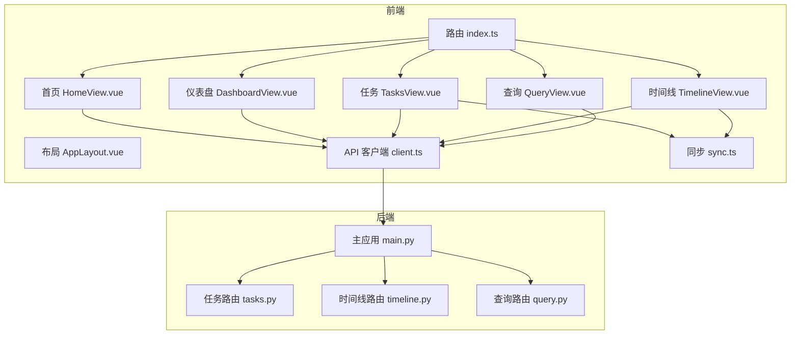
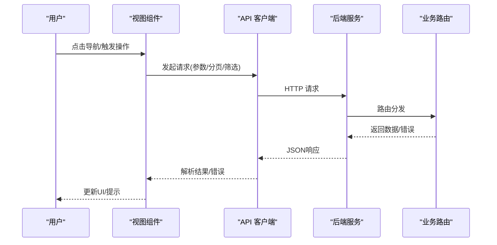
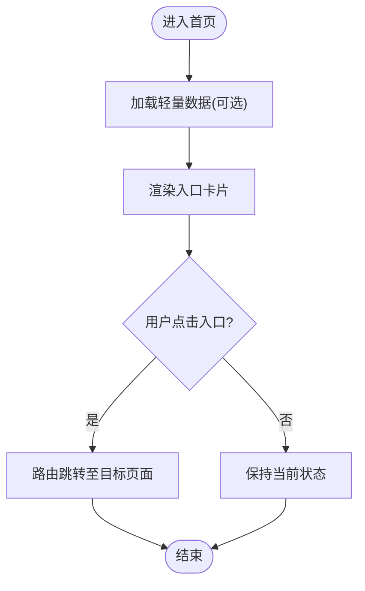
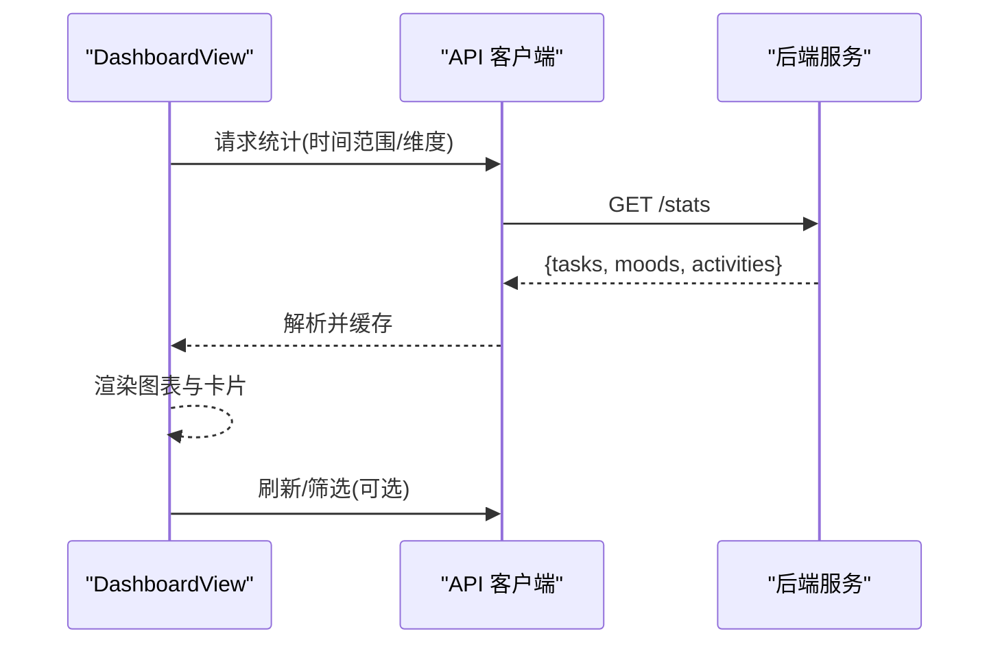
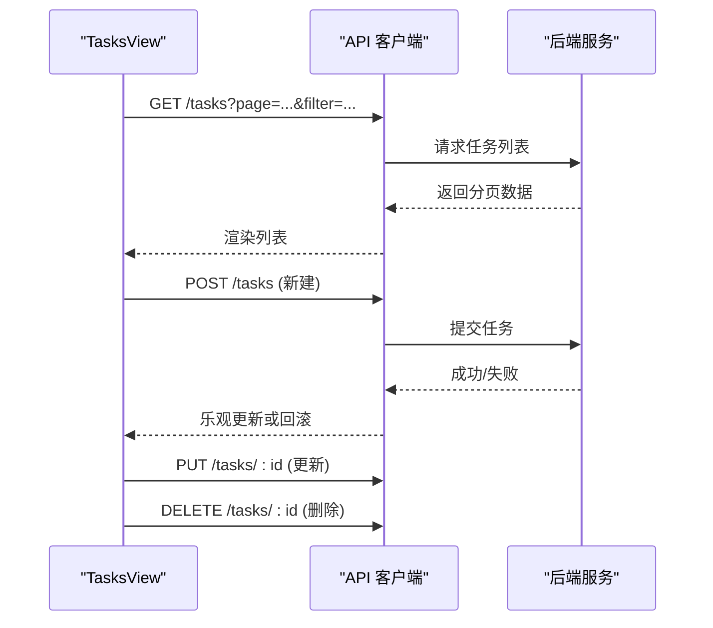
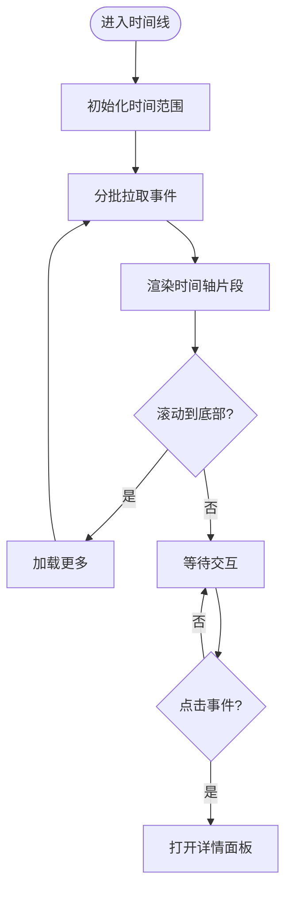
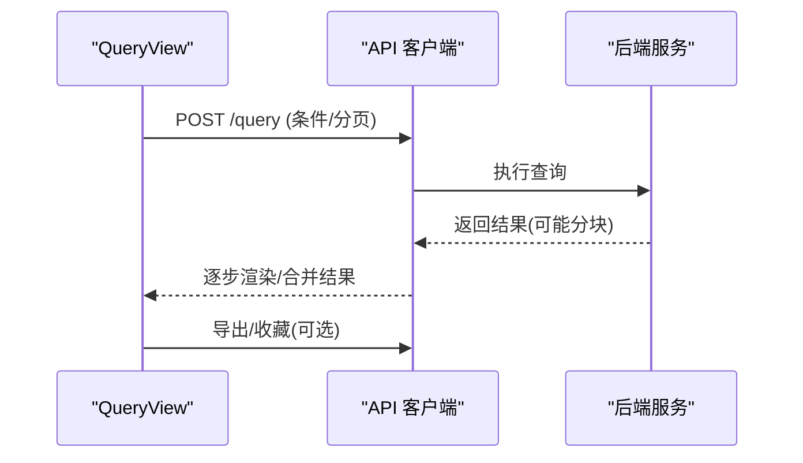
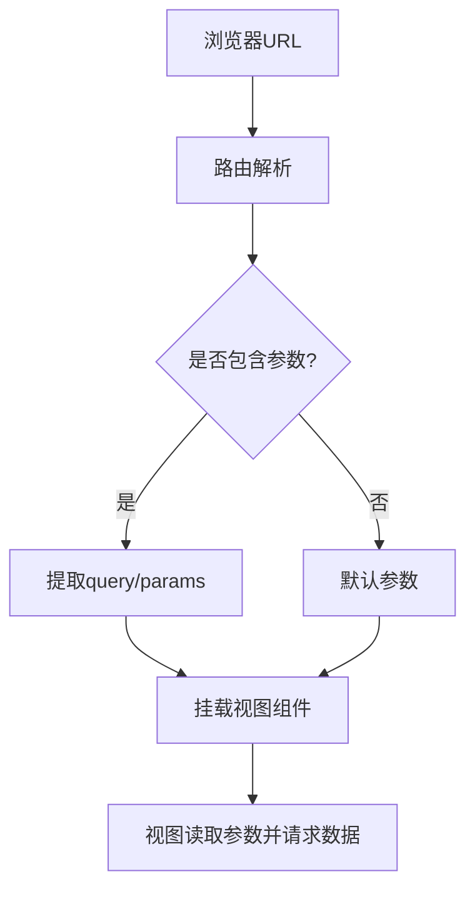
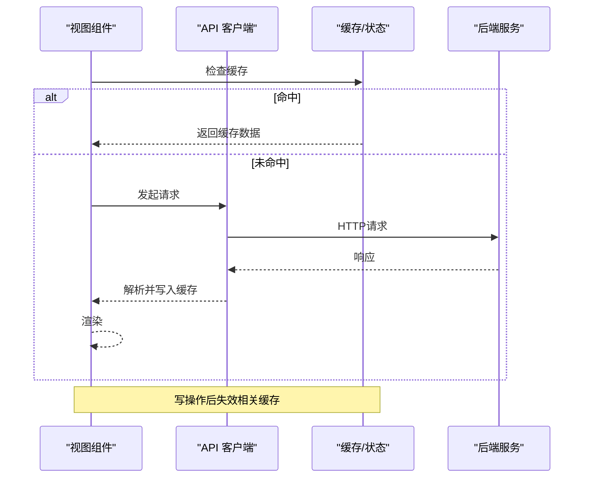
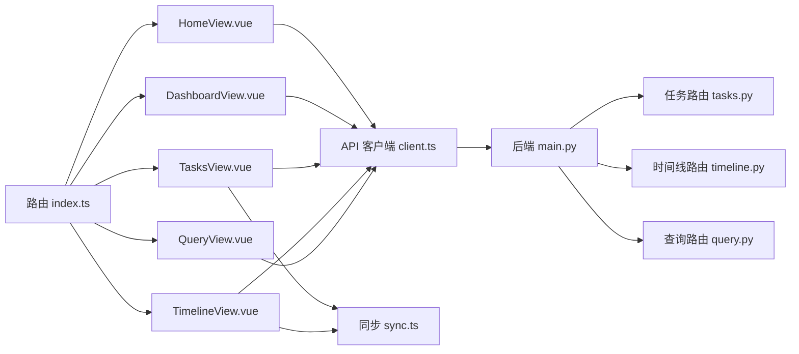

# 页面视图

<cite>
**本文引用的文件**   
- [frontend/src/router/index.ts](file://frontend/src/router/index.ts)
- [frontend/src/views/HomeView.vue](file://frontend/src/views/HomeView.vue)
- [frontend/src/views/DashboardView.vue](file://frontend/src/views/DashboardView.vue)
- [frontend/src/views/TasksView.vue](file://frontend/src/views/TasksView.vue)
- [frontend/src/views/TimelineView.vue](file://frontend/src/views/TimelineView.vue)
- [frontend/src/views/QueryView.vue](file://frontend/src/views/QueryView.vue)
- [frontend/src/components/AppLayout.vue](file://frontend/src/components/AppLayout.vue)
- [frontend/src/api/client.ts](file://frontend/src/api/client.ts)
- [frontend/src/sync.ts](file://frontend/src/sync.ts)
- [backend/main.py](file://backend/main.py)
- [backend/routers/tasks.py](file://backend/routers/tasks.py)
- [backend/routers/timeline.py](file://backend/routers/timeline.py)
- [backend/routers/query.py](file://backend/routers/query.py)
</cite>

## 目录
1. [简介](#简介)
2. [项目结构](#项目结构)
3. [核心组件](#核心组件)
4. [架构总览](#架构总览)
5. [详细组件分析](#详细组件分析)
6. [依赖分析](#依赖分析)
7. [性能考虑](#性能考虑)
8. [故障排查指南](#故障排查指南)
9. [结论](#结论)
10. [附录](#附录)

## 简介
本文件面向AdventureX前端页面视图系统，系统化说明HomeView首页、DashboardView仪表盘、TasksView任务管理、TimelineView时间线、QueryView查询界面的职责边界、数据流与用户交互流程。文档同时覆盖路由配置、参数传递、数据获取与状态同步机制，并给出页面级状态管理、错误处理策略、性能优化方案以及开发规范与调试技巧，帮助开发者快速定位问题并高效扩展功能。

## 项目结构
前端采用Vue 3 + TypeScript + Vue Router组织页面视图，API客户端封装在统一模块中，后端通过FastAPI提供REST接口。页面视图位于views目录，路由定义于router/index.ts，布局由AppLayout统一管理。

图表来源
- [frontend/src/router/index.ts](file://frontend/src/router/index.ts)
- [frontend/src/views/HomeView.vue](file://frontend/src/views/HomeView.vue)
- [frontend/src/views/DashboardView.vue](file://frontend/src/views/DashboardView.vue)
- [frontend/src/views/TasksView.vue](file://frontend/src/views/TasksView.vue)
- [frontend/src/views/TimelineView.vue](file://frontend/src/views/TimelineView.vue)
- [frontend/src/views/QueryView.vue](file://frontend/src/views/QueryView.vue)
- [frontend/src/components/AppLayout.vue](file://frontend/src/components/AppLayout.vue)
- [frontend/src/api/client.ts](file://frontend/src/api/client.ts)
- [frontend/src/sync.ts](file://frontend/src/sync.ts)
- [backend/main.py](file://backend/main.py)
- [backend/routers/tasks.py](file://backend/routers/tasks.py)
- [backend/routers/timeline.py](file://backend/routers/timeline.py)
- [backend/routers/query.py](file://backend/routers/query.py)

章节来源
- [frontend/src/router/index.ts](file://frontend/src/router/index.ts)
- [frontend/src/components/AppLayout.vue](file://frontend/src/components/AppLayout.vue)

## 核心组件
- 路由层：集中声明页面路由、嵌套路由与守卫逻辑，负责URL到视图的映射与参数解析。
- 视图层：各页面视图负责渲染UI、收集用户输入、调用API、维护本地状态与错误提示。
- 布局层：AppLayout提供全局导航、侧边栏、头部信息、主题与国际化等公共能力。
- API层：client.ts统一封装HTTP请求、错误转换、重试与缓存策略。
- 同步层：sync.ts负责跨标签页或前后端的状态同步（如任务完成、时间线更新）。

章节来源
- [frontend/src/router/index.ts](file://frontend/src/router/index.ts)
- [frontend/src/components/AppLayout.vue](file://frontend/src/components/AppLayout.vue)
- [frontend/src/api/client.ts](file://frontend/src/api/client.ts)
- [frontend/src/sync.ts](file://frontend/src/sync.ts)

## 架构总览
页面视图通过路由进入，布局组件承载导航与全局状态；视图组件调用API客户端发起请求，后端路由将业务逻辑暴露为REST接口；必要时通过同步模块实现多端状态一致性。

图表来源
- [frontend/src/api/client.ts](file://frontend/src/api/client.ts)
- [backend/main.py](file://backend/main.py)
- [backend/routers/tasks.py](file://backend/routers/tasks.py)
- [backend/routers/timeline.py](file://backend/routers/timeline.py)
- [backend/routers/query.py](file://backend/routers/query.py)

## 详细组件分析

### 首页 HomeView
- 职责：展示欢迎信息与快捷入口，引导用户进入仪表盘、任务、时间线与查询界面。
- 数据流：通常无需强依赖后端数据，可加载轻量配置或统计摘要。
- 交互：点击卡片跳转对应路由，支持语言切换与主题切换。
- 状态：本地状态为主，必要时从API拉取轻量数据。
- 错误处理：网络异常时降级显示静态内容，避免阻断用户。

章节来源
- [frontend/src/views/HomeView.vue](file://frontend/src/views/HomeView.vue)
- [frontend/src/router/index.ts](file://frontend/src/router/index.ts)

### 仪表盘 DashboardView
- 职责：聚合关键指标（如任务数、情绪趋势、最近活动），提供概览与快捷操作。
- 数据流：批量拉取统计数据，支持刷新与定时轮询。
- 交互：点击指标卡片跳转到详情页面；支持下拉刷新与筛选。
- 状态：本地缓存+服务端最新数据；失败时回退到缓存。
- 错误处理：部分接口失败不影响整体渲染，局部占位提示。

图表来源
- [frontend/src/views/DashboardView.vue](file://frontend/src/views/DashboardView.vue)
- [frontend/src/api/client.ts](file://frontend/src/api/client.ts)

章节来源
- [frontend/src/views/DashboardView.vue](file://frontend/src/views/DashboardView.vue)
- [frontend/src/api/client.ts](file://frontend/src/api/client.ts)

### 任务管理 TasksView
- 职责：任务的增删改查、状态流转、批量操作与导出。
- 数据流：列表分页加载、搜索过滤、排序；新增/编辑后实时同步。
- 交互：创建任务表单、编辑弹窗、勾选批量删除、拖拽排序（若实现）。
- 状态：本地乐观更新+后端确认；冲突时回滚并提示。
- 错误处理：校验失败即时反馈；网络失败重试与降级。

图表来源
- [frontend/src/views/TasksView.vue](file://frontend/src/views/TasksView.vue)
- [frontend/src/api/client.ts](file://frontend/src/api/client.ts)
- [backend/routers/tasks.py](file://backend/routers/tasks.py)

章节来源
- [frontend/src/views/TasksView.vue](file://frontend/src/views/TasksView.vue)
- [frontend/src/api/client.ts](file://frontend/src/api/client.ts)
- [backend/routers/tasks.py](file://backend/routers/tasks.py)

### 时间线 TimelineView
- 职责：按时间轴展示事件/记录，支持筛选、缩放与详情查看。
- 数据流：按时间段拉取事件，增量加载历史；支持关键词检索。
- 交互：滚动加载、点击事件查看详情、时间范围选择器。
- 状态：本地时间窗口缓存；断网时显示最后可用快照。
- 错误处理：分段加载失败跳过该段并继续；整体失败提示重试。

图表来源
- [frontend/src/views/TimelineView.vue](file://frontend/src/views/TimelineView.vue)
- [frontend/src/api/client.ts](file://frontend/src/api/client.ts)
- [backend/routers/timeline.py](file://backend/routers/timeline.py)

章节来源
- [frontend/src/views/TimelineView.vue](file://frontend/src/views/TimelineView.vue)
- [frontend/src/api/client.ts](file://frontend/src/api/client.ts)
- [backend/routers/timeline.py](file://backend/routers/timeline.py)

### 查询界面 QueryView
- 职责：自然语言或结构化查询，返回相关记录与摘要。
- 数据流：构建查询条件，调用查询接口，流式或分块返回结果。
- 交互：输入框、历史查询、结果高亮与导出。
- 状态：查询历史本地存储；大结果集分页展示。
- 错误处理：超时重试、空结果友好提示、敏感词过滤。

图表来源
- [frontend/src/views/QueryView.vue](file://frontend/src/views/QueryView.vue)
- [frontend/src/api/client.ts](file://frontend/src/api/client.ts)
- [backend/routers/query.py](file://backend/routers/query.py)

章节来源
- [frontend/src/views/QueryView.vue](file://frontend/src/views/QueryView.vue)
- [frontend/src/api/client.ts](file://frontend/src/api/client.ts)
- [backend/routers/query.py](file://backend/routers/query.py)

### 路由配置与参数传递
- 路由定义：集中注册页面路由，支持命名路由与路径参数。
- 参数传递：使用query与params两种模式，query用于筛选与分页，params用于资源标识。
- 导航：编程式导航与声明式导航结合，确保状态重置与缓存命中。
- 守卫：可在路由层进行权限校验与登录态检查（按需）。

图表来源
- [frontend/src/router/index.ts](file://frontend/src/router/index.ts)

章节来源
- [frontend/src/router/index.ts](file://frontend/src/router/index.ts)

### 数据获取与状态同步机制
- 数据获取：统一通过client.ts发起请求，内置错误码映射、超时控制与重试策略。
- 状态同步：sync.ts监听跨标签页消息或后端推送，保证任务状态、时间线更新的一致性。
- 缓存策略：对只读数据启用短期缓存，写操作后失效相关缓存。
- 并发控制：对高频操作做防抖与节流，避免重复请求。

图表来源
- [frontend/src/api/client.ts](file://frontend/src/api/client.ts)
- [frontend/src/sync.ts](file://frontend/src/sync.ts)

章节来源
- [frontend/src/api/client.ts](file://frontend/src/api/client.ts)
- [frontend/src/sync.ts](file://frontend/src/sync.ts)

## 依赖分析
- 视图与路由：视图通过路由参数驱动数据加载，路由变更触发组件重建或生命周期钩子。
- 视图与API：所有网络请求经client.ts统一封装，便于拦截、重试与错误归一化。
- 视图与同步：TasksView与TimelineView依赖sync.ts进行状态同步，确保多端一致。
- 后端依赖：main.py聚合路由，具体业务在routers下模块化。

图表来源
- [frontend/src/router/index.ts](file://frontend/src/router/index.ts)
- [frontend/src/views/HomeView.vue](file://frontend/src/views/HomeView.vue)
- [frontend/src/views/DashboardView.vue](file://frontend/src/views/DashboardView.vue)
- [frontend/src/views/TasksView.vue](file://frontend/src/views/TasksView.vue)
- [frontend/src/views/TimelineView.vue](file://frontend/src/views/TimelineView.vue)
- [frontend/src/views/QueryView.vue](file://frontend/src/views/QueryView.vue)
- [frontend/src/api/client.ts](file://frontend/src/api/client.ts)
- [frontend/src/sync.ts](file://frontend/src/sync.ts)
- [backend/main.py](file://backend/main.py)
- [backend/routers/tasks.py](file://backend/routers/tasks.py)
- [backend/routers/timeline.py](file://backend/routers/timeline.py)
- [backend/routers/query.py](file://backend/routers/query.py)

章节来源
- [frontend/src/router/index.ts](file://frontend/src/router/index.ts)
- [frontend/src/api/client.ts](file://frontend/src/api/client.ts)
- [frontend/src/sync.ts](file://frontend/src/sync.ts)
- [backend/main.py](file://backend/main.py)

## 性能考虑
- 列表与时间线：分页加载、虚拟滚动（大数据量）、增量更新与去重。
- 请求优化：合并请求、防抖/节流、缓存与ETag（若后端支持）。
- 渲染优化：懒加载组件、按需引入图标与样式、减少不必要的重渲染。
- 内存管理：及时清理定时器与订阅，避免泄漏。
- 错误恢复：离线缓存与重试队列，提升用户体验。

[本节为通用指导，不直接分析具体文件]

## 故障排查指南
- 路由问题：检查路由定义与参数命名，确认导航方式与参数传递是否正确。
- 数据加载：查看API客户端日志与错误映射，确认后端路由是否正常返回。
- 状态不同步：检查sync.ts的消息监听与事件触发，确认缓存失效策略。
- UI卡顿：排查大量DOM操作与频繁重渲染，考虑虚拟化与批处理。
- 常见错误：网络超时、权限不足、参数校验失败，需在前端给出明确提示。

章节来源
- [frontend/src/api/client.ts](file://frontend/src/api/client.ts)
- [frontend/src/sync.ts](file://frontend/src/sync.ts)

## 结论
AdventureX页面视图以清晰的分层与统一的API封装为基础，实现了首页、仪表盘、任务、时间线与查询等核心功能。通过路由参数驱动、缓存与同步机制，保证了数据一致性与用户体验。建议遵循本文档的开发规范与性能优化策略，持续完善错误处理与可观测性，提升系统的稳定性与可维护性。

[本节为总结，不直接分析具体文件]

## 附录
- 页面开发规范
  - 单一职责：每个视图聚焦一个业务域，复杂逻辑下沉到组件或服务。
  - 参数约定：query用于筛选与分页，params用于资源标识，保持一致性。
  - 错误处理：统一错误映射与用户提示，避免裸抛异常。
  - 可测试性：为关键函数编写单元测试，模拟API与同步事件。
- 调试技巧
  - 使用浏览器Network面板观察请求与响应，关注状态码与耗时。
  - 在API客户端添加日志打印，追踪错误堆栈与重试次数。
  - 利用Vue DevTools检查组件状态与响应式更新。
  - 针对同步问题，监听storage事件或自定义消息通道。

[本节为通用指导，不直接分析具体文件]