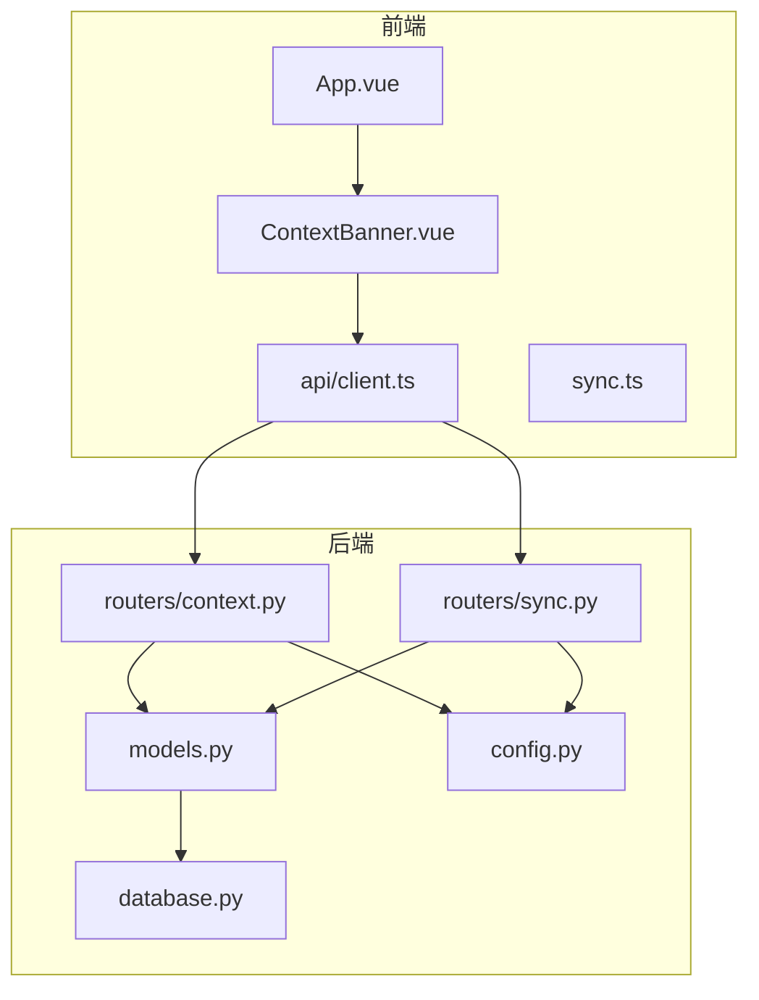
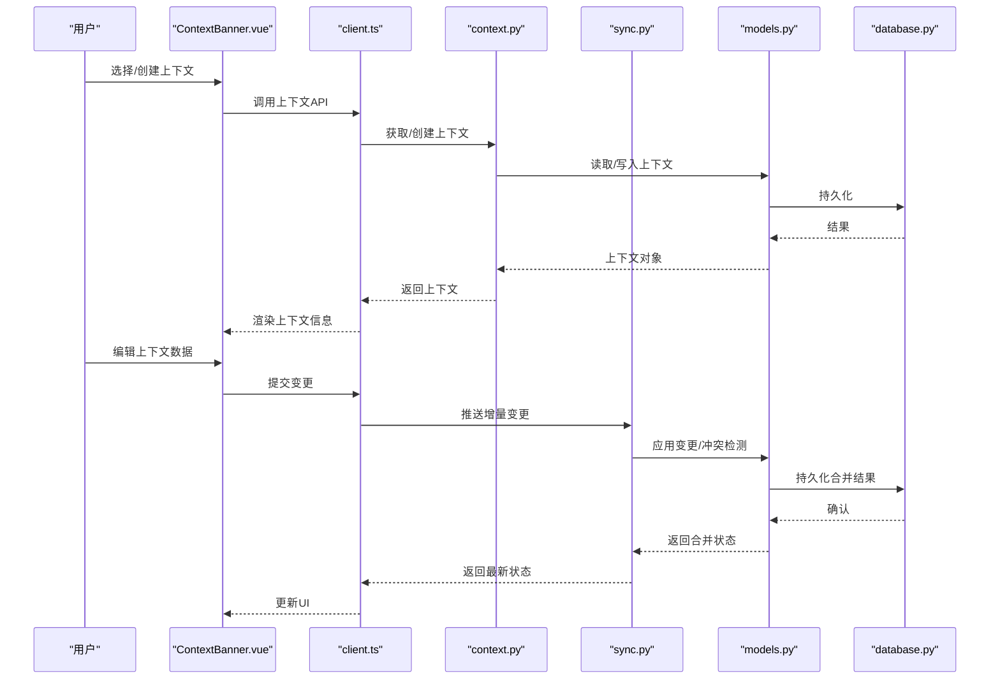
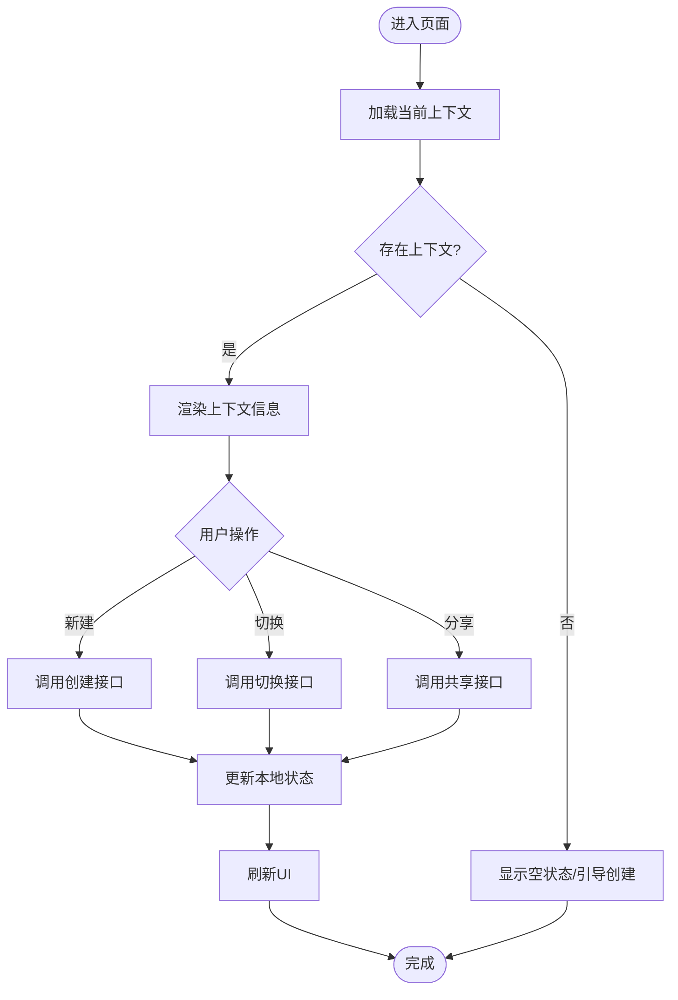
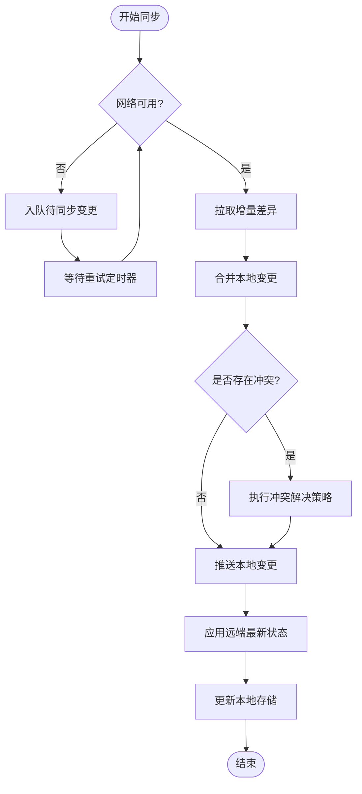
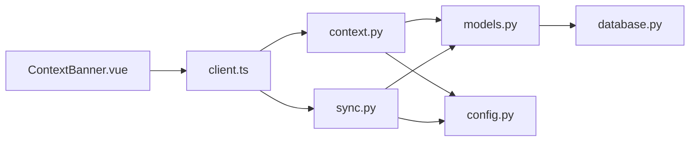

# 上下文管理功能

<cite>
**本文引用的文件**   
- [backend/routers/context.py](file://backend/routers/context.py)
- [backend/routers/sync.py](file://backend/routers/sync.py)
- [backend/models.py](file://backend/models.py)
- [backend/database.py](file://backend/database.py)
- [backend/config.py](file://backend/config.py)
- [frontend/src/components/ContextBanner.vue](file://frontend/src/components/ContextBanner.vue)
- [frontend/src/sync.ts](file://frontend/src/sync.ts)
- [frontend/src/api/client.ts](file://frontend/src/api/client.ts)
- [frontend/src/App.vue](file://frontend/src/App.vue)
</cite>

## 目录
1. [简介](#简介)
2. [项目结构](#项目结构)
3. [核心组件](#核心组件)
4. [架构总览](#架构总览)
5. [详细组件分析](#详细组件分析)
6. [依赖关系分析](#依赖关系分析)
7. [性能考虑](#性能考虑)
8. [故障排查指南](#故障排查指南)
9. [结论](#结论)
10. [附录](#附录)

## 简介
本指南聚焦于“上下文管理”能力，围绕 ContextBanner 组件、上下文切换机制、数据同步与状态管理展开。内容涵盖上下文的创建、配置与共享，多用户协作与一致性保证；后端 sync 服务的同步策略、冲突解决与离线数据处理；以及上下文组织最佳实践、数据同步优化与故障恢复方案。读者可据此快速上手并高效使用上下文管理能力。

## 项目结构
本项目采用前后端分离架构：
- 后端提供 REST API，包含上下文路由与同步路由，配合数据库模型与配置模块。
- 前端通过 Vue 组件（如 ContextBanner）与 API 客户端交互，并通过同步模块协调本地与远端状态。

图表来源
- [frontend/src/components/ContextBanner.vue](file://frontend/src/components/ContextBanner.vue)
- [frontend/src/api/client.ts](file://frontend/src/api/client.ts)
- [frontend/src/sync.ts](file://frontend/src/sync.ts)
- [backend/routers/context.py](file://backend/routers/context.py)
- [backend/routers/sync.py](file://backend/routers/sync.py)
- [backend/models.py](file://backend/models.py)
- [backend/database.py](file://backend/database.py)
- [backend/config.py](file://backend/config.py)

章节来源
- [backend/routers/context.py](file://backend/routers/context.py)
- [backend/routers/sync.py](file://backend/routers/sync.py)
- [backend/models.py](file://backend/models.py)
- [backend/database.py](file://backend/database.py)
- [backend/config.py](file://backend/config.py)
- [frontend/src/components/ContextBanner.vue](file://frontend/src/components/ContextBanner.vue)
- [frontend/src/api/client.ts](file://frontend/src/api/client.ts)
- [frontend/src/sync.ts](file://frontend/src/sync.ts)
- [frontend/src/App.vue](file://frontend/src/App.vue)

## 核心组件
- ContextBanner 组件：用于展示当前上下文、切换上下文、触发上下文相关操作（如新建、编辑、分享）。
- 同步服务（sync.ts）：负责本地与远端的增量同步、冲突检测与合并、离线队列与重试。
- 上下文路由（context.py）：提供上下文的 CRUD、权限与共享接口。
- 同步路由（sync.py）：提供增量拉取、推送、冲突处理与版本控制接口。
- 数据模型（models.py）：定义上下文实体、成员关系、变更记录等。
- 数据库访问（database.py）：封装连接、事务与查询。
- 配置（config.py）：集中管理同步策略、超时、重试次数等参数。

章节来源
- [frontend/src/components/ContextBanner.vue](file://frontend/src/components/ContextBanner.vue)
- [frontend/src/sync.ts](file://frontend/src/sync.ts)
- [backend/routers/context.py](file://backend/routers/context.py)
- [backend/routers/sync.py](file://backend/routers/sync.py)
- [backend/models.py](file://backend/models.py)
- [backend/database.py](file://backend/database.py)
- [backend/config.py](file://backend/config.py)

## 架构总览
上下文管理的端到端流程如下：
- 用户在 ContextBanner 中切换或创建上下文，前端调用 client.ts 发起请求。
- 后端 context.py 路由处理上下文业务逻辑，读写 models.py 定义的实体，经由 database.py 持久化。
- 当发生数据变更时，前端 sync.ts 将变更入队，按策略推送到后端 sync.py 路由。
- 后端根据版本号与时间戳进行冲突检测与合并，返回合并结果与最新状态。
- 前端接收响应后更新本地状态，并刷新 UI。

图表来源
- [frontend/src/components/ContextBanner.vue](file://frontend/src/components/ContextBanner.vue)
- [frontend/src/api/client.ts](file://frontend/src/api/client.ts)
- [backend/routers/context.py](file://backend/routers/context.py)
- [backend/routers/sync.py](file://backend/routers/sync.py)
- [backend/models.py](file://backend/models.py)
- [backend/database.py](file://backend/database.py)

## 详细组件分析

### ContextBanner 组件
职责与行为
- 显示当前上下文名称、成员列表、权限标识。
- 支持创建新上下文、切换上下文、打开上下文设置与分享面板。
- 在切换或创建成功后，触发全局状态更新，确保其他组件感知变化。

关键交互
- 点击“新建上下文”：调用 client.ts 的创建接口，成功后刷新上下文列表并选中新上下文。
- 点击“切换上下文”：调用 client.ts 的切换接口，更新本地存储与全局状态。
- 打开“分享”：调用 client.ts 的共享接口，邀请成员并更新成员列表。

状态管理
- 本地缓存当前上下文 ID 与元数据，避免频繁请求。
- 监听上下文变更事件，驱动 UI 重渲染。

图表来源
- [frontend/src/components/ContextBanner.vue](file://frontend/src/components/ContextBanner.vue)
- [frontend/src/api/client.ts](file://frontend/src/api/client.ts)

章节来源
- [frontend/src/components/ContextBanner.vue](file://frontend/src/components/ContextBanner.vue)
- [frontend/src/api/client.ts](file://frontend/src/api/client.ts)

### 同步服务（sync.ts）
职责与行为
- 维护本地变更队列，按策略批量推送至后端。
- 实现增量同步：基于版本号/时间戳拉取差异，减少带宽消耗。
- 冲突检测与合并：比较本地与远端变更，生成合并策略（以远端为准、以本地为准、手动合并）。
- 离线处理：网络不可用时缓存变更，恢复后自动重试。

同步策略
- 拉取策略：定时轮询 + 事件触发拉取。
- 推送策略：批量合并 + 去重 + 幂等键。
- 冲突策略：字段级合并、最后写入优先（LWW）、或提示用户选择。

图表来源
- [frontend/src/sync.ts](file://frontend/src/sync.ts)
- [backend/routers/sync.py](file://backend/routers/sync.py)

章节来源
- [frontend/src/sync.ts](file://frontend/src/sync.ts)
- [backend/routers/sync.py](file://backend/routers/sync.py)

### 后端上下文路由（context.py）
职责与行为
- 提供上下文的创建、读取、更新、删除接口。
- 校验权限与成员关系，支持共享链接与邀请。
- 返回统一的上下文数据结构，供前端渲染与同步。

关键流程
- 创建上下文：校验输入、初始化默认成员、写入数据库。
- 切换上下文：校验用户权限、更新会话上下文。
- 共享上下文：生成共享令牌、记录成员关系。

章节来源
- [backend/routers/context.py](file://backend/routers/context.py)
- [backend/models.py](file://backend/models.py)
- [backend/database.py](file://backend/database.py)

### 后端同步路由（sync.py）
职责与行为
- 提供增量拉取与推送接口，支持版本控制与冲突检测。
- 实现合并策略：字段级合并、时间戳比较、冲突回退或提示。
- 保障事务一致性与幂等性，防止重复提交。

关键流程
- 拉取差异：根据客户端提供的 last_version 或 timestamp 计算差异集。
- 推送变更：校验变更顺序与依赖，应用变更并返回合并结果。
- 冲突处理：若检测到冲突，返回冲突详情与建议策略。

章节来源
- [backend/routers/sync.py](file://backend/routers/sync.py)
- [backend/models.py](file://backend/models.py)
- [backend/database.py](file://backend/database.py)

### 数据模型（models.py）
职责与行为
- 定义上下文实体、成员关系、变更记录、共享令牌等。
- 提供数据验证与约束，确保数据完整性。

关键实体
- 上下文：ID、名称、描述、创建者、更新时间戳。
- 成员：用户ID、角色、加入时间。
- 变更记录：操作类型、目标实体、旧值、新值、操作者、时间戳。

章节来源
- [backend/models.py](file://backend/models.py)

### 数据库访问（database.py）
职责与行为
- 管理数据库连接池、事务边界、查询封装。
- 提供统一错误处理与重试机制。

章节来源
- [backend/database.py](file://backend/database.py)

### 配置（config.py）
职责与行为
- 集中管理同步策略参数：拉取间隔、推送批次大小、重试次数、超时时间。
- 提供运行时可覆盖的配置项，便于不同环境部署。

章节来源
- [backend/config.py](file://backend/config.py)

## 依赖关系分析
- 前端 ContextBanner 依赖 client.ts 进行 API 调用。
- client.ts 依赖后端 context.py 与 sync.py 路由。
- 后端路由依赖 models.py 与 database.py。
- sync.ts 依赖 sync.py 进行增量同步与冲突处理。

图表来源
- [frontend/src/components/ContextBanner.vue](file://frontend/src/components/ContextBanner.vue)
- [frontend/src/api/client.ts](file://frontend/src/api/client.ts)
- [backend/routers/context.py](file://backend/routers/context.py)
- [backend/routers/sync.py](file://backend/routers/sync.py)
- [backend/models.py](file://backend/models.py)
- [backend/database.py](file://backend/database.py)
- [backend/config.py](file://backend/config.py)

章节来源
- [frontend/src/components/ContextBanner.vue](file://frontend/src/components/ContextBanner.vue)
- [frontend/src/api/client.ts](file://frontend/src/api/client.ts)
- [backend/routers/context.py](file://backend/routers/context.py)
- [backend/routers/sync.py](file://backend/routers/sync.py)
- [backend/models.py](file://backend/models.py)
- [backend/database.py](file://backend/database.py)
- [backend/config.py](file://backend/config.py)

## 性能考虑
- 增量同步：仅传输差异数据，降低带宽与解析开销。
- 批量推送：合并多次变更为一次请求，减少网络往返。
- 缓存策略：前端缓存上下文元数据与常用数据，减少重复请求。
- 幂等设计：使用唯一操作ID避免重复提交导致的数据不一致。
- 连接池与事务：后端使用连接池与短事务，提升并发与一致性。

[本节为通用指导，不直接分析具体文件]

## 故障排查指南
常见问题与定位步骤
- 上下文切换失败：检查权限校验与会话状态，确认后端返回的错误码与消息。
- 同步延迟或丢失：查看本地变更队列长度与重试次数，检查网络状态与后端同步接口可用性。
- 冲突频发：确认冲突解决策略是否合理，必要时引入手动合并界面。
- 数据不一致：核对版本号与时间戳，检查事务是否成功提交。

排查要点
- 前端日志：记录 API 请求/响应、同步队列状态、冲突详情。
- 后端日志：记录上下文操作、同步处理、冲突检测结果。
- 数据库审计：查看变更记录与事务日志，定位异常点。

章节来源
- [frontend/src/sync.ts](file://frontend/src/sync.ts)
- [backend/routers/sync.py](file://backend/routers/sync.py)
- [backend/routers/context.py](file://backend/routers/context.py)

## 结论
上下文管理功能通过 ContextBanner 组件与前后端协同，实现了灵活的上下文切换、创建与共享；同步服务保障了多用户协作下的数据一致性与离线可用性。遵循本文的最佳实践与优化建议，可有效提升系统稳定性与用户体验。

[本节为总结性内容，不直接分析具体文件]

## 附录
- 最佳实践
  - 明确上下文边界：每个上下文对应一个独立的工作域，避免跨域耦合。
  - 合理使用共享：最小权限原则，按需授予成员角色。
  - 监控与告警：对同步失败、冲突率、延迟等指标建立监控。
- 数据同步优化
  - 调整拉取间隔与批次大小，平衡实时性与资源消耗。
  - 启用压缩与分页，减少大对象传输。
- 故障恢复方案
  - 本地队列持久化，重启后自动恢复。
  - 冲突回滚与人工干预通道，确保数据最终一致。

[本节为补充说明，不直接分析具体文件]