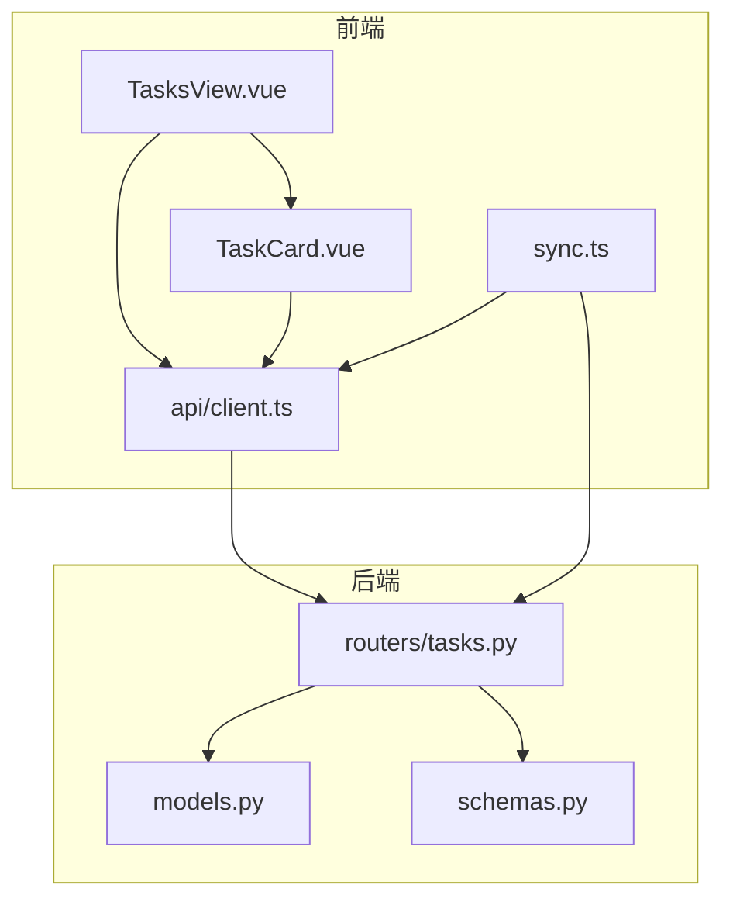
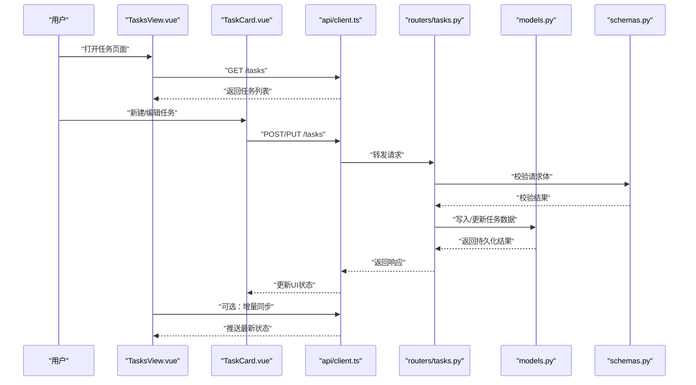
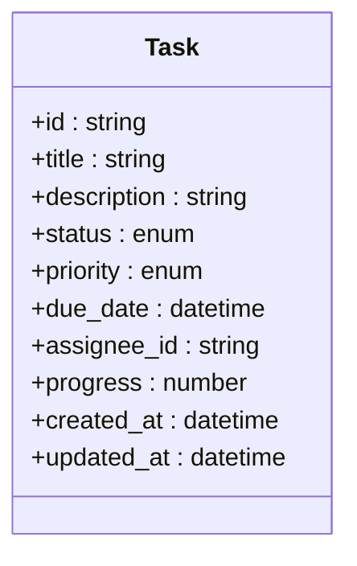
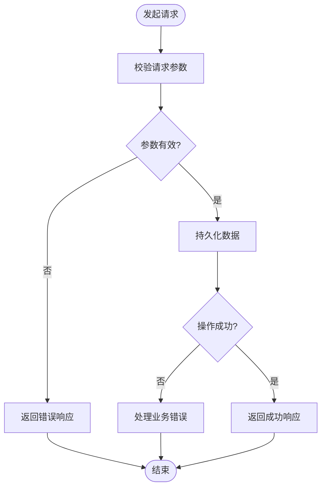
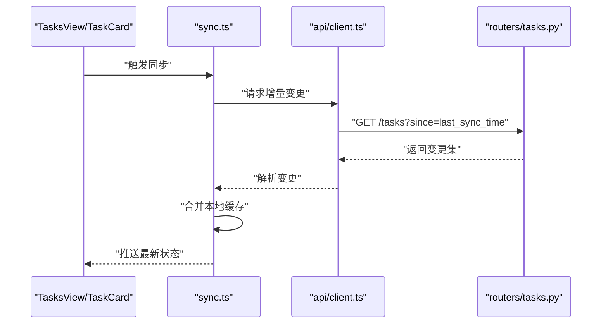
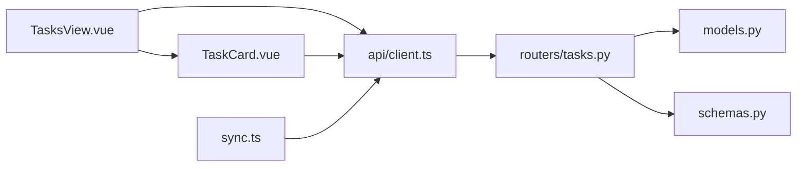

# 任务管理功能

<cite>
**本文引用的文件**   
- [backend/routers/tasks.py](file://backend/routers/tasks.py)
- [backend/models.py](file://backend/models.py)
- [backend/schemas.py](file://backend/schemas.py)
- [frontend/src/views/TasksView.vue](file://frontend/src/views/TasksView.vue)
- [frontend/src/components/TaskCard.vue](file://frontend/src/components/TaskCard.vue)
- [frontend/src/api/client.ts](file://frontend/src/api/client.ts)
- [frontend/src/sync.ts](file://frontend/src/sync.ts)
</cite>

## 目录
1. [简介](#简介)
2. [项目结构](#项目结构)
3. [核心组件](#核心组件)
4. [架构总览](#架构总览)
5. [详细组件分析](#详细组件分析)
6. [依赖关系分析](#依赖关系分析)
7. [性能考虑](#性能考虑)
8. [故障排查指南](#故障排查指南)
9. [结论](#结论)
10. [附录](#附录)

## 简介
本指南面向使用与开发“任务管理”功能的用户与工程师，系统阐述 TasksView 界面的操作方法、TaskCard 组件的使用方式，以及任务的创建、分配与跟踪流程。文档覆盖任务状态管理、优先级设置、截止日期提醒与进度追踪，并解释后端数据模型、API 接口调用与实时状态同步机制。最后提供任务组织最佳实践、团队协作技巧与效率提升方法，帮助团队高效协作与持续交付。

## 项目结构
任务管理功能由前端视图与组件、API 客户端、后端路由与数据模型共同构成：
- 前端
  - 视图层：TasksView 负责任务列表展示、筛选、排序与批量操作入口。
  - 组件层：TaskCard 负责单条任务的渲染与交互（编辑、完成、删除等）。
  - API 客户端：client.ts 封装对后端 /tasks 相关接口的调用。
  - 同步层：sync.ts 负责本地缓存与后端状态的增量同步。
- 后端
  - 路由层：routers/tasks.py 暴露任务相关的 REST 接口。
  - 数据模型：models.py 定义任务实体与关联关系。
  - 请求/响应模式：schemas.py 定义输入输出校验与序列化格式。

**图表来源** 
- [frontend/src/views/TasksView.vue](file://frontend/src/views/TasksView.vue)
- [frontend/src/components/TaskCard.vue](file://frontend/src/components/TaskCard.vue)
- [frontend/src/api/client.ts](file://frontend/src/api/client.ts)
- [frontend/src/sync.ts](file://frontend/src/sync.ts)
- [backend/routers/tasks.py](file://backend/routers/tasks.py)
- [backend/models.py](file://backend/models.py)
- [backend/schemas.py](file://backend/schemas.py)

**章节来源**
- [frontend/src/views/TasksView.vue](file://frontend/src/views/TasksView.vue)
- [frontend/src/components/TaskCard.vue](file://frontend/src/components/TaskCard.vue)
- [frontend/src/api/client.ts](file://frontend/src/api/client.ts)
- [frontend/src/sync.ts](file://frontend/src/sync.ts)
- [backend/routers/tasks.py](file://backend/routers/tasks.py)
- [backend/models.py](file://backend/models.py)
- [backend/schemas.py](file://backend/schemas.py)

## 核心组件
- TasksView
  - 职责：任务列表的加载、筛选、分页、排序与批量操作；提供新建任务入口与状态切换入口。
  - 关键能力：按状态/优先级/截止日期筛选；点击卡片进入 TaskCard 编辑态；支持全选与批量更新。
- TaskCard
  - 职责：单条任务的可视化与交互，包括标题、描述、状态、优先级、截止日期、负责人、进度等字段展示与编辑。
  - 关键能力：快速切换状态、修改优先级、设置截止日期、更新进度、删除任务。
- API 客户端
  - 职责：统一封装任务相关 HTTP 请求，处理错误与重试策略，返回标准化数据结构。
- 同步模块
  - 职责：维护本地缓存与后端一致性，支持增量更新与冲突解决。

**章节来源**
- [frontend/src/views/TasksView.vue](file://frontend/src/views/TasksView.vue)
- [frontend/src/components/TaskCard.vue](file://frontend/src/components/TaskCard.vue)
- [frontend/src/api/client.ts](file://frontend/src/api/client.ts)
- [frontend/src/sync.ts](file://frontend/src/sync.ts)

## 架构总览
任务管理的端到端流程如下：
- 用户在 TasksView 中执行操作（创建、编辑、删除、筛选、排序）。
- 操作通过 TaskCard 或 TasksView 调用 API 客户端。
- API 客户端向后端 /tasks 路由发起请求。
- 后端根据 schemas 校验请求体，持久化到 models 定义的数据库表。
- 同步模块在必要时拉取增量变更，保持本地与后端一致。

**图表来源** 
- [frontend/src/views/TasksView.vue](file://frontend/src/views/TasksView.vue)
- [frontend/src/components/TaskCard.vue](file://frontend/src/components/TaskCard.vue)
- [frontend/src/api/client.ts](file://frontend/src/api/client.ts)
- [backend/routers/tasks.py](file://backend/routers/tasks.py)
- [backend/models.py](file://backend/models.py)
- [backend/schemas.py](file://backend/schemas.py)

## 详细组件分析

### TasksView 界面使用方法
- 列表展示
  - 显示任务标题、状态、优先级、截止日期、负责人、进度等信息。
  - 支持按状态、优先级、截止日期进行筛选与排序。
- 新建任务
  - 点击“新建”按钮，弹出表单或进入编辑态，填写必填字段后提交。
- 编辑与删除
  - 点击任务卡片进入编辑态，可修改状态、优先级、截止日期、负责人、进度等。
  - 支持删除任务，需二次确认。
- 批量操作
  - 支持多选任务，批量更新状态或优先级。
- 刷新与同步
  - 手动刷新列表；后台增量同步保证数据一致性。

**章节来源**
- [frontend/src/views/TasksView.vue](file://frontend/src/views/TasksView.vue)

### TaskCard 组件使用方式
- 字段说明
  - 标题、描述、状态、优先级、截止日期、负责人、进度等。
- 交互行为
  - 快速切换状态（如待办、进行中、已完成）。
  - 修改优先级（高/中/低）与截止日期。
  - 更新进度百分比。
  - 删除任务（带确认）。
- 事件与回调
  - 对外暴露保存、删除、状态变更等事件，供父组件处理。
- 样式与可访问性
  - 不同状态与优先级使用视觉差异提示；键盘导航与屏幕阅读器友好。

**章节来源**
- [frontend/src/components/TaskCard.vue](file://frontend/src/components/TaskCard.vue)

### 任务数据模型
- 实体字段
  - 标识符、标题、描述、状态、优先级、截止日期、负责人、进度、创建时间、更新时间等。
- 关系与约束
  - 状态枚举、优先级枚举、截止日期非空校验、负责人关联等。
- 索引与查询优化
  - 针对状态、优先级、截止日期建立索引以提升筛选与排序性能。

**图表来源** 
- [backend/models.py](file://backend/models.py)

**章节来源**
- [backend/models.py](file://backend/models.py)

### API 接口调用
- 常用接口
  - 获取任务列表：GET /tasks，支持筛选、分页、排序参数。
  - 创建任务：POST /tasks，提交任务数据。
  - 更新任务：PUT /tasks/{id}，提交更新字段。
  - 删除任务：DELETE /tasks/{id}。
  - 批量更新：PATCH /tasks/batch，提交任务ID集合与更新字段。
- 请求与响应
  - 请求体遵循 schemas 定义的结构与校验规则。
  - 响应包含任务对象或错误信息，统一错误码与消息。
- 错误处理
  - 网络异常、校验失败、权限不足等错误在前端统一提示与重试。

**图表来源** 
- [frontend/src/api/client.ts](file://frontend/src/api/client.ts)
- [backend/routers/tasks.py](file://backend/routers/tasks.py)
- [backend/schemas.py](file://backend/schemas.py)

**章节来源**
- [frontend/src/api/client.ts](file://frontend/src/api/client.ts)
- [backend/routers/tasks.py](file://backend/routers/tasks.py)
- [backend/schemas.py](file://backend/schemas.py)

### 实时状态同步机制
- 触发时机
  - 页面加载、任务操作完成后、定时轮询或 WebSocket 推送（若启用）。
- 同步策略
  - 增量同步：仅拉取变更的任务，减少带宽与计算开销。
  - 冲突解决：以服务端为准，合并本地未提交的更改。
- 本地缓存
  - 维护任务列表与详情缓存，提高交互流畅度。
- 错误恢复
  - 网络中断时自动重试，失败时提示用户并允许手动重试。

**图表来源** 
- [frontend/src/sync.ts](file://frontend/src/sync.ts)
- [frontend/src/api/client.ts](file://frontend/src/api/client.ts)
- [backend/routers/tasks.py](file://backend/routers/tasks.py)

**章节来源**
- [frontend/src/sync.ts](file://frontend/src/sync.ts)
- [frontend/src/api/client.ts](file://frontend/src/api/client.ts)
- [backend/routers/tasks.py](file://backend/routers/tasks.py)

### 任务状态管理与优先级设置
- 状态流转
  - 典型状态：待办、进行中、已完成；支持自定义扩展。
  - 状态变更需记录审计日志（可选），便于追溯。
- 优先级策略
  - 高/中/低三级，影响排序与提醒策略。
  - 高优先级任务默认置顶显示。
- 截止日期提醒
  - 基于 due_date 与当前时间计算剩余天数，临近截止时发出提醒。
  - 支持邮件或站内通知（可扩展）。

**章节来源**
- [backend/models.py](file://backend/models.py)
- [backend/schemas.py](file://backend/schemas.py)
- [frontend/src/components/TaskCard.vue](file://frontend/src/components/TaskCard.vue)

### 进度追踪
- 进度字段
  - 百分比形式，支持小数精度。
- 更新规则
  - 随状态推进自动调整（如进行中设为 50%，完成设为 100%）。
  - 支持手动修正，保留变更记录。
- 可视化
  - 进度条与数值双显，便于快速识别。

**章节来源**
- [backend/models.py](file://backend/models.py)
- [frontend/src/components/TaskCard.vue](file://frontend/src/components/TaskCard.vue)

## 依赖关系分析
- 前端依赖
  - TasksView 依赖 TaskCard 与 API 客户端。
  - TaskCard 依赖 API 客户端与同步模块。
- 后端依赖
  - routers/tasks.py 依赖 models.py 与 schemas.py。
- 外部集成
  - 可选：通知服务（邮件/站内信）、日历集成（导出截止日期）。

**图表来源** 
- [frontend/src/views/TasksView.vue](file://frontend/src/views/TasksView.vue)
- [frontend/src/components/TaskCard.vue](file://frontend/src/components/TaskCard.vue)
- [frontend/src/api/client.ts](file://frontend/src/api/client.ts)
- [frontend/src/sync.ts](file://frontend/src/sync.ts)
- [backend/routers/tasks.py](file://backend/routers/tasks.py)
- [backend/models.py](file://backend/models.py)
- [backend/schemas.py](file://backend/schemas.py)

**章节来源**
- [frontend/src/views/TasksView.vue](file://frontend/src/views/TasksView.vue)
- [frontend/src/components/TaskCard.vue](file://frontend/src/components/TaskCard.vue)
- [frontend/src/api/client.ts](file://frontend/src/api/client.ts)
- [frontend/src/sync.ts](file://frontend/src/sync.ts)
- [backend/routers/tasks.py](file://backend/routers/tasks.py)
- [backend/models.py](file://backend/models.py)
- [backend/schemas.py](file://backend/schemas.py)

## 性能考虑
- 前端
  - 虚拟滚动与分页加载，避免一次性渲染大量任务。
  - 防抖与节流：搜索与筛选输入防抖，减少频繁请求。
  - 本地缓存：缓存最近访问的任务详情，降低重复请求。
- 后端
  - 索引优化：对状态、优先级、截止日期建立复合索引。
  - 分页与过滤：限制返回数量，支持游标分页。
  - 增量同步：仅返回变更数据，减少传输体积。
- 网络
  - 压缩响应体，启用 HTTP 缓存头。
  - 重试与退避策略，提升弱网环境稳定性。

[本节为通用指导，不直接分析具体文件]

## 故障排查指南
- 常见问题
  - 列表加载失败：检查网络连接与 API 地址配置。
  - 任务无法保存：核对请求体结构与必填字段。
  - 状态不同步：查看同步模块日志与增量时间戳。
- 调试步骤
  - 浏览器开发者工具：查看网络请求与响应。
  - 后端日志：定位校验失败与数据库错误。
  - 本地缓存清理：重置 sync.ts 缓存后重试。
- 恢复措施
  - 手动重试：提供重试按钮与自动重试机制。
  - 回滚操作：支持撤销最近一次任务更新。

**章节来源**
- [frontend/src/api/client.ts](file://frontend/src/api/client.ts)
- [frontend/src/sync.ts](file://frontend/src/sync.ts)
- [backend/routers/tasks.py](file://backend/routers/tasks.py)

## 结论
任务管理功能通过清晰的前后端分离与模块化设计，提供了完整的任务创建、分配、跟踪与同步能力。合理使用 TasksView 与 TaskCard，结合状态管理、优先级设置与截止日期提醒，可显著提升团队协作效率。建议遵循本文的最佳实践与性能优化建议，确保系统在大规模任务场景下稳定运行。

[本节为总结性内容，不直接分析具体文件]

## 附录
- 任务组织最佳实践
  - 明确任务粒度：每个任务聚焦单一目标，避免过大过杂。
  - 合理设置优先级：高优先级任务优先处理，定期复盘。
  - 设定截止日期：为每个任务设定合理且可执行的截止时间。
  - 进度透明：及时更新进度，便于团队成员了解进展。
- 团队协作技巧
  - 明确负责人：每个任务指定唯一负责人，避免责任分散。
  - 沟通规范：在任务描述中记录关键决策与变更原因。
  - 定期同步：每日站会或周报同步任务状态与阻塞问题。
- 效率提升方法
  - 模板化任务：常用任务类型使用模板快速创建。
  - 自动化提醒：利用截止日期提醒与状态变更通知。
  - 数据分析：统计任务完成率与平均耗时，持续改进流程。

[本节为概念性内容，不直接分析具体文件]