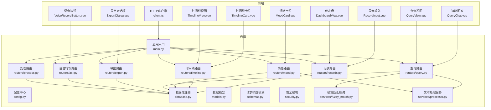
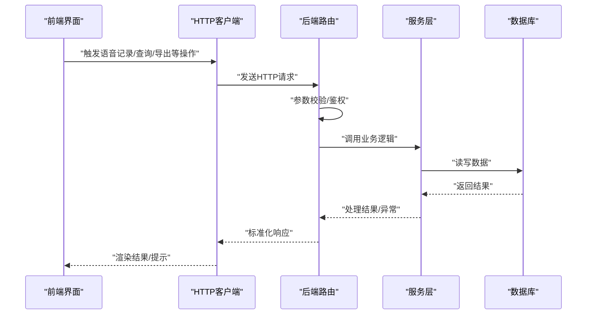
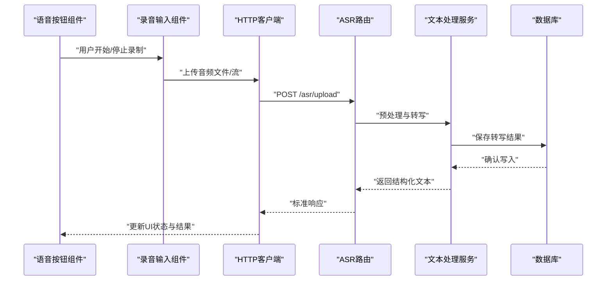
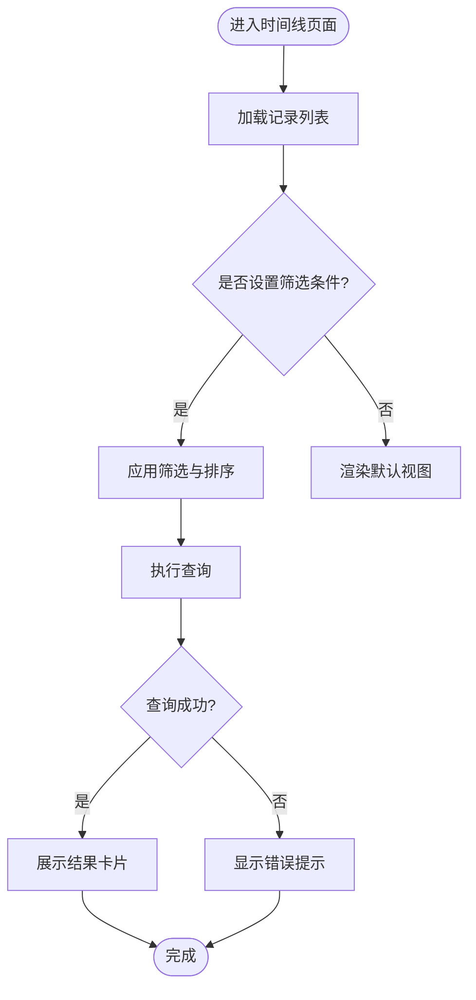
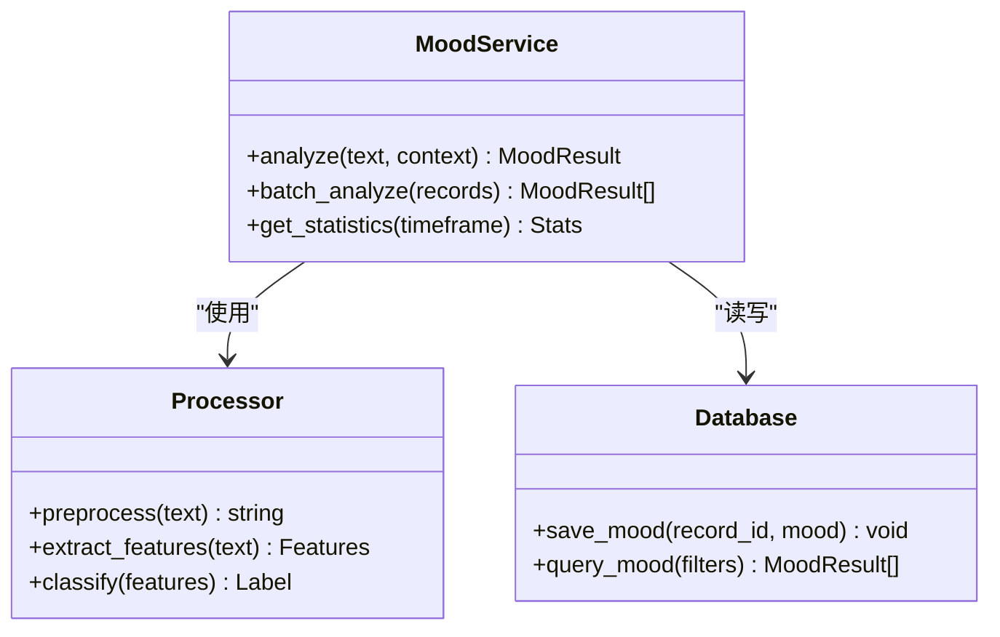
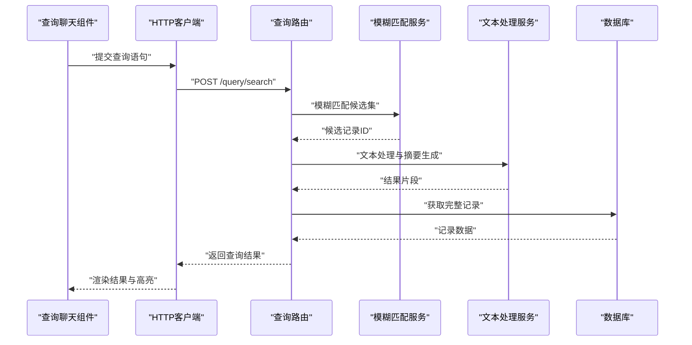
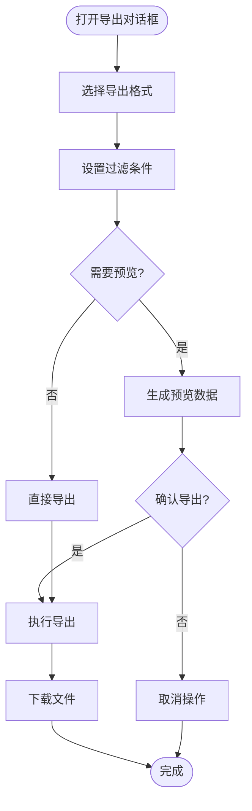
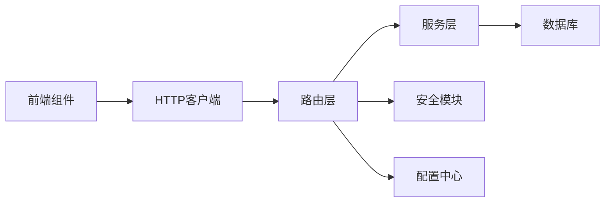

# 功能指南

<cite>
**本文引用的文件**   
- [backend/main.py](file://backend/main.py)
- [backend/config.py](file://backend/config.py)
- [backend/database.py](file://backend/database.py)
- [backend/models.py](file://backend/models.py)
- [backend/schemas.py](file://backend/schemas.py)
- [backend/security.py](file://backend/security.py)
- [backend/routers/records.py](file://backend/routers/records.py)
- [backend/routers/timeline.py](file://backend/routers/timeline.py)
- [backend/routers/mood.py](file://backend/routers/mood.py)
- [backend/routers/query.py](file://backend/routers/query.py)
- [backend/routers/export.py](file://backend/routers/export.py)
- [backend/routers/asr.py](file://backend/routers/asr.py)
- [backend/routers/process.py](file://backend/routers/process.py)
- [backend/services/fuzzy_match.py](file://backend/services/fuzzy_match.py)
- [backend/services/processor.py](file://backend/services/processor.py)
- [frontend/src/api/client.ts](file://frontend/src/api/client.ts)
- [frontend/src/components/VoiceRecordButton.vue](file://frontend/src/components/VoiceRecordButton.vue)
- [frontend/src/components/RecordInput.vue](file://frontend/src/components/RecordInput.vue)
- [frontend/src/components/TimelineCard.vue](file://frontend/src/components/TimelineCard.vue)
- [frontend/src/components/MoodCard.vue](file://frontend/src/components/MoodCard.vue)
- [frontend/src/components/QueryChat.vue](file://frontend/src/components/QueryChat.vue)
- [frontend/src/components/ExportDialog.vue](file://frontend/src/components/ExportDialog.vue)
- [frontend/src/views/TimelineView.vue](file://frontend/src/views/TimelineView.vue)
- [frontend/src/views/QueryView.vue](file://frontend/src/views/QueryView.vue)
- [frontend/src/views/DashboardView.vue](file://frontend/src/views/DashboardView.vue)
</cite>

## 目录
1. [简介](#简介)
2. [项目结构](#项目结构)
3. [核心组件](#核心组件)
4. [架构总览](#架构总览)
5. [详细组件分析](#详细组件分析)
6. [依赖关系分析](#依赖关系分析)
7. [性能考虑](#性能考虑)
8. [故障排查指南](#故障排查指南)
9. [结论](#结论)
10. [附录](#附录)

## 简介
本指南面向AdventureX的使用者与开发者，系统阐述语音记录、时间线管理、情感分析、智能查询与导出等核心功能的使用方法、界面操作、配置选项与高级用法。文档同时解释AI驱动的文本处理流程、模糊匹配算法与情感识别机制，并提供实际使用场景的最佳实践与性能优化建议，帮助你在不同规模的数据与并发下稳定高效地使用系统。

## 项目结构
AdventureX采用前后端分离架构：
- 后端基于Python（FastAPI）提供REST API与异步任务处理能力，包含路由层、服务层、数据模型与数据库访问。
- 前端基于Vue 3 + TypeScript，提供录音、时间线浏览、情感可视化、智能问答与导出等功能。

图表来源
- [backend/main.py](file://backend/main.py)
- [backend/routers/records.py](file://backend/routers/records.py)
- [backend/routers/timeline.py](file://backend/routers/timeline.py)
- [backend/routers/mood.py](file://backend/routers/mood.py)
- [backend/routers/query.py](file://backend/routers/query.py)
- [backend/routers/export.py](file://backend/routers/export.py)
- [backend/routers/asr.py](file://backend/routers/asr.py)
- [backend/routers/process.py](file://backend/routers/process.py)
- [backend/services/fuzzy_match.py](file://backend/services/fuzzy_match.py)
- [backend/services/processor.py](file://backend/services/processor.py)
- [frontend/src/api/client.ts](file://frontend/src/api/client.ts)
- [frontend/src/components/VoiceRecordButton.vue](file://frontend/src/components/VoiceRecordButton.vue)
- [frontend/src/components/RecordInput.vue](file://frontend/src/components/RecordInput.vue)
- [frontend/src/components/TimelineCard.vue](file://frontend/src/components/TimelineCard.vue)
- [frontend/src/components/MoodCard.vue](file://frontend/src/components/MoodCard.vue)
- [frontend/src/components/QueryChat.vue](file://frontend/src/components/QueryChat.vue)
- [frontend/src/components/ExportDialog.vue](file://frontend/src/components/ExportDialog.vue)
- [frontend/src/views/TimelineView.vue](file://frontend/src/views/TimelineView.vue)
- [frontend/src/views/QueryView.vue](file://frontend/src/views/QueryView.vue)
- [frontend/src/views/DashboardView.vue](file://frontend/src/views/DashboardView.vue)

章节来源
- [backend/main.py](file://backend/main.py)
- [frontend/src/api/client.ts](file://frontend/src/api/client.ts)

## 核心组件
- 语音记录与转写
  - 前端通过语音按钮或录音输入组件采集音频，调用后端ASR接口进行转写，得到结构化文本并入库。
  - 支持实时状态反馈、错误重试与断点续录。
- 时间线管理
  - 按时间维度聚合记录，支持筛选、排序、分页与批量操作；提供可视化卡片展示关键信息。
- 情感分析
  - 对文本进行情感极性判断与强度评分，结合上下文生成情感标签与趋势统计。
- 智能查询
  - 自然语言查询，结合模糊匹配与语义处理，返回相关记录片段与摘要。
- 导出功能
  - 支持多种格式导出（如CSV、JSON），可自定义字段与过滤条件，支持增量导出。

章节来源
- [backend/routers/records.py](file://backend/routers/records.py)
- [backend/routers/timeline.py](file://backend/routers/timeline.py)
- [backend/routers/mood.py](file://backend/routers/mood.py)
- [backend/routers/query.py](file://backend/routers/query.py)
- [backend/routers/export.py](file://backend/routers/export.py)
- [backend/routers/asr.py](file://backend/routers/asr.py)
- [frontend/src/components/VoiceRecordButton.vue](file://frontend/src/components/VoiceRecordButton.vue)
- [frontend/src/components/RecordInput.vue](file://frontend/src/components/RecordInput.vue)
- [frontend/src/components/TimelineCard.vue](file://frontend/src/components/TimelineCard.vue)
- [frontend/src/components/MoodCard.vue](file://frontend/src/components/MoodCard.vue)
- [frontend/src/components/QueryChat.vue](file://frontend/src/components/QueryChat.vue)
- [frontend/src/components/ExportDialog.vue](file://frontend/src/components/ExportDialog.vue)

## 架构总览
系统遵循“前端交互—后端路由—服务处理—数据持久化”的分层设计：
- 前端通过HTTP客户端统一发起请求，封装错误处理与重试策略。
- 后端路由负责参数校验、权限控制与业务编排。
- 服务层实现核心算法（模糊匹配、文本处理、情感分析）。
- 数据层通过ORM/驱动访问数据库，保证事务一致性与索引优化。

图表来源
- [backend/main.py](file://backend/main.py)
- [backend/routers/records.py](file://backend/routers/records.py)
- [backend/routers/query.py](file://backend/routers/query.py)
- [backend/routers/export.py](file://backend/routers/export.py)
- [backend/services/fuzzy_match.py](file://backend/services/fuzzy_match.py)
- [backend/services/processor.py](file://backend/services/processor.py)
- [frontend/src/api/client.ts](file://frontend/src/api/client.ts)

## 详细组件分析

### 语音记录与转写（ASR）
- 界面操作
  - 点击语音按钮开始录制，再次点击结束；支持暂停/继续与时长限制。
  - 录音输入组件允许粘贴音频文件或拖拽上传，自动检测格式与大小。
- 后端流程
  - ASR路由接收音频流，调用转写服务，生成文本与元数据（时长、采样率、置信度）。
  - 文本入库后触发后续处理（如分词、去噪、情感分析）。
- 配置选项
  - 转写引擎参数（语言、模型版本）、超时与重试次数、存储路径与压缩策略。
- 高级用法
  - 批量导入历史录音，设置批次大小与并发数；启用增量转写避免重复处理。
  - 自定义噪声抑制与静音切分阈值，提升长录音的准确率。

图表来源
- [backend/routers/asr.py](file://backend/routers/asr.py)
- [backend/services/processor.py](file://backend/services/processor.py)
- [frontend/src/components/VoiceRecordButton.vue](file://frontend/src/components/VoiceRecordButton.vue)
- [frontend/src/components/RecordInput.vue](file://frontend/src/components/RecordInput.vue)
- [frontend/src/api/client.ts](file://frontend/src/api/client.ts)

章节来源
- [backend/routers/asr.py](file://backend/routers/asr.py)
- [backend/services/processor.py](file://backend/services/processor.py)
- [frontend/src/components/VoiceRecordButton.vue](file://frontend/src/components/VoiceRecordButton.vue)
- [frontend/src/components/RecordInput.vue](file://frontend/src/components/RecordInput.vue)

### 时间线管理
- 界面操作
  - 时间线视图展示记录卡片，支持按日期范围筛选、关键词搜索、情感颜色标记。
  - 点击卡片查看详情，支持编辑、删除与批量操作。
- 后端流程
  - 时间线路由提供分页、排序与聚合接口；支持按标签、情感、来源分类。
  - 大数据量时启用缓存与预计算，减少查询延迟。
- 配置选项
  - 分页大小、默认排序字段、缓存过期时间、索引策略。
- 高级用法
  - 自定义时间粒度（日/周/月）聚合；联动导出功能生成时间序列报告。

图表来源
- [backend/routers/timeline.py](file://backend/routers/timeline.py)
- [frontend/src/views/TimelineView.vue](file://frontend/src/views/TimelineView.vue)
- [frontend/src/components/TimelineCard.vue](file://frontend/src/components/TimelineCard.vue)

章节来源
- [backend/routers/timeline.py](file://backend/routers/timeline.py)
- [frontend/src/views/TimelineView.vue](file://frontend/src/views/TimelineView.vue)
- [frontend/src/components/TimelineCard.vue](file://frontend/src/components/TimelineCard.vue)

### 情感分析
- 界面操作
  - 情感卡片展示每条记录的极性（积极/消极/中性）与强度分数；支持按情感筛选与统计。
- 后端流程
  - 情感路由调用文本处理服务，提取情感特征并打分；支持上下文窗口与多轮对话增强。
  - 结果入库后可用于仪表盘统计与趋势图。
- 配置选项
  - 情感模型版本、阈值设定、上下文长度、输出字段。
- 高级用法
  - 自定义情感词典与规则；批量离线分析历史数据，生成情感报告。

图表来源
- [backend/routers/mood.py](file://backend/routers/mood.py)
- [backend/services/processor.py](file://backend/services/processor.py)
- [backend/database.py](file://backend/database.py)

章节来源
- [backend/routers/mood.py](file://backend/routers/mood.py)
- [backend/services/processor.py](file://backend/services/processor.py)
- [frontend/src/components/MoodCard.vue](file://frontend/src/components/MoodCard.vue)

### 智能查询
- 界面操作
  - 查询视图提供自然语言输入框，实时显示匹配结果与高亮片段；支持保存常用查询。
- 后端流程
  - 查询路由解析意图，调用模糊匹配与文本处理服务，返回相关记录与摘要。
  - 支持多条件组合、权重调整与结果重排序。
- 配置选项
  - 模糊阈值、最大匹配数、索引类型、缓存策略。
- 高级用法
  - 自定义查询语法与别名映射；结合时间线与情感过滤，构建复杂检索场景。

图表来源
- [backend/routers/query.py](file://backend/routers/query.py)
- [backend/services/fuzzy_match.py](file://backend/services/fuzzy_match.py)
- [backend/services/processor.py](file://backend/services/processor.py)
- [frontend/src/components/QueryChat.vue](file://frontend/src/components/QueryChat.vue)
- [frontend/src/api/client.ts](file://frontend/src/api/client.ts)

章节来源
- [backend/routers/query.py](file://backend/routers/query.py)
- [backend/services/fuzzy_match.py](file://backend/services/fuzzy_match.py)
- [backend/services/processor.py](file://backend/services/processor.py)
- [frontend/src/components/QueryChat.vue](file://frontend/src/components/QueryChat.vue)

### 导出功能
- 界面操作
  - 导出对话框支持选择格式（CSV/JSON）、字段映射、时间范围与过滤条件；提供预览与下载。
- 后端流程
  - 导出路由根据参数生成数据流，支持分页与流式输出，避免内存溢出。
  - 可选压缩与加密传输，确保数据安全。
- 配置选项
  - 默认导出模板、字符编码、压缩级别、访问权限控制。
- 高级用法
  - 定时任务定期导出增量数据；集成外部系统API进行自动化同步。

图表来源
- [backend/routers/export.py](file://backend/routers/export.py)
- [frontend/src/components/ExportDialog.vue](file://frontend/src/components/ExportDialog.vue)

章节来源
- [backend/routers/export.py](file://backend/routers/export.py)
- [frontend/src/components/ExportDialog.vue](file://frontend/src/components/ExportDialog.vue)

### 文本处理与AI驱动
- 文本处理服务
  - 负责清洗、分词、去噪、实体识别与摘要生成；支持多语言与领域词典扩展。
- 模糊匹配服务
  - 实现相似度计算与候选召回，支持阈值调节与权重策略；适用于拼写错误与口语化表达。
- 最佳实践
  - 合理设置分词粒度与停用词表；为高频查询建立倒排索引；定期更新情感词典与模型版本。

章节来源
- [backend/services/processor.py](file://backend/services/processor.py)
- [backend/services/fuzzy_match.py](file://backend/services/fuzzy_match.py)

## 依赖关系分析
- 模块耦合
  - 路由层依赖服务层与数据层，服务层之间通过接口解耦；前端通过HTTP客户端与后端通信。
- 外部依赖
  - 数据库驱动、ASR引擎、缓存与消息队列（可选）；安全模块提供鉴权与令牌管理。
- 潜在循环依赖
  - 服务层应避免相互调用，必要时引入事件总线或消息中间件。

图表来源
- [backend/main.py](file://backend/main.py)
- [backend/security.py](file://backend/security.py)
- [backend/config.py](file://backend/config.py)
- [frontend/src/api/client.ts](file://frontend/src/api/client.ts)

章节来源
- [backend/main.py](file://backend/main.py)
- [backend/security.py](file://backend/security.py)
- [backend/config.py](file://backend/config.py)
- [frontend/src/api/client.ts](file://frontend/src/api/client.ts)

## 性能考虑
- 前端优化
  - 懒加载与虚拟滚动提升大列表渲染性能；防抖与节流减少频繁请求。
- 后端优化
  - 数据库索引与查询优化；异步任务处理耗时操作；缓存热点数据与结果集。
- 网络优化
  - 启用Gzip压缩与HTTP/2；合理设置超时与重试策略；使用CDN加速静态资源。
- 监控与告警
  - 记录关键指标（QPS、延迟、错误率）；设置阈值告警与日志聚合。

[本节为通用指导，不直接分析具体文件]

## 故障排查指南
- 常见问题
  - 语音转写失败：检查音频格式、网络状态与ASR服务可用性；查看错误码与日志。
  - 查询无结果：调整模糊阈值与关键词；确认索引是否重建。
  - 导出卡顿：减小分页大小或启用流式输出；检查磁盘空间与权限。
- 调试技巧
  - 启用详细日志与追踪ID；使用浏览器开发者工具与后端日志关联定位问题。
  - 单元测试与集成测试覆盖关键路径；模拟异常场景验证容错能力。

章节来源
- [backend/routers/asr.py](file://backend/routers/asr.py)
- [backend/routers/query.py](file://backend/routers/query.py)
- [backend/routers/export.py](file://backend/routers/export.py)

## 结论
AdventureX通过清晰的分层架构与模块化设计，提供了完整的语音记录、时间线管理、情感分析、智能查询与导出能力。遵循本指南的操作与配置建议，可在不同使用场景下获得稳定高效的体验。持续优化算法与基础设施，将进一步提升系统的准确性与性能。

## 附录
- 术语表
  - ASR：自动语音识别
  - 模糊匹配：基于相似度的文本检索技术
  - 情感分析：对文本情感倾向进行量化评估
- 参考链接
  - 前端README与部署说明
  - 后端依赖与环境配置清单

[本节为补充信息，不直接分析具体文件]