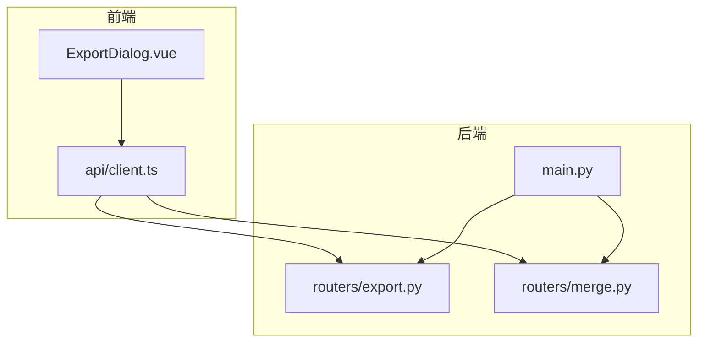
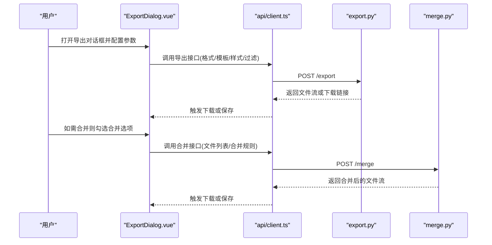
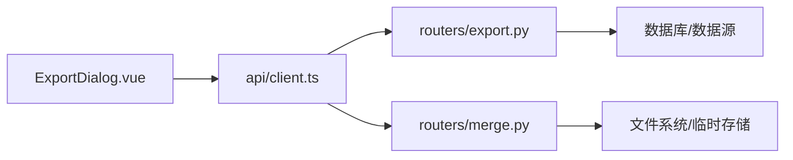

# 导出功能

<cite>
**本文引用的文件**   
- [ExportDialog.vue](file://frontend/src/components/ExportDialog.vue)
- [export.py](file://backend/routers/export.py)
- [merge.py](file://backend/routers/merge.py)
- [client.ts](file://frontend/src/api/client.ts)
- [main.py](file://backend/main.py)
</cite>

## 目录
1. [简介](#简介)
2. [项目结构](#项目结构)
3. [核心组件](#核心组件)
4. [架构总览](#架构总览)
5. [详细组件分析](#详细组件分析)
6. [依赖关系分析](#依赖关系分析)
7. [性能考虑](#性能考虑)
8. [故障排查指南](#故障排查指南)
9. [结论](#结论)
10. [附录](#附录)

## 简介
本指南聚焦于系统的“导出”能力，覆盖前端 ExportDialog 组件的使用方式、支持的导出格式、文件合并与批量处理选项；后端 export 路由的接口行为、数据转换流程与输出质量控制；以及 merge 服务在文件合并中的逻辑。同时提供导出性能优化技巧、大文件处理策略和自动化导出方案，帮助开发者与使用者高效、稳定地完成导出任务。

## 项目结构
导出相关的前后端代码分布如下：
- 前端：导出对话框组件与 API 客户端封装
- 后端：导出路由与合并路由，应用入口挂载路由

图表来源
- [ExportDialog.vue](file://frontend/src/components/ExportDialog.vue)
- [client.ts](file://frontend/src/api/client.ts)
- [export.py](file://backend/routers/export.py)
- [merge.py](file://backend/routers/merge.py)
- [main.py](file://backend/main.py)

章节来源
- [ExportDialog.vue](file://frontend/src/components/ExportDialog.vue)
- [client.ts](file://frontend/src/api/client.ts)
- [export.py](file://backend/routers/export.py)
- [merge.py](file://backend/routers/merge.py)
- [main.py](file://backend/main.py)

## 核心组件
- 前端导出对话框（ExportDialog）
  - 负责展示导出配置面板（格式选择、模板设置、样式定制、合并开关等）
  - 收集用户输入并调用 API 客户端发起导出或合并请求
  - 处理加载状态、错误提示与下载结果反馈
- 后端导出路由（export）
  - 接收导出参数（格式、模板、样式、过滤条件等）
  - 执行数据查询与转换，生成目标文件（PDF/Word/Excel 等）
  - 返回文件流或下载链接
- 后端合并路由（merge）
  - 接收多个文件路径或内容，按规则合并为单一文件
  - 支持不同格式的合并策略（如表格追加、文档拼接）
  - 输出合并后的文件流或临时文件地址

章节来源
- [ExportDialog.vue](file://frontend/src/components/ExportDialog.vue)
- [export.py](file://backend/routers/export.py)
- [merge.py](file://backend/routers/merge.py)

## 架构总览
导出流程从前端的导出对话框开始，通过 API 客户端向后端导出路由发起请求；后端根据参数进行数据转换与文件生成，必要时调用合并服务将多份数据整合后输出。

图表来源
- [ExportDialog.vue](file://frontend/src/components/ExportDialog.vue)
- [client.ts](file://frontend/src/api/client.ts)
- [export.py](file://backend/routers/export.py)
- [merge.py](file://backend/routers/merge.py)

## 详细组件分析

### ExportDialog 组件使用指南
- 基本用法
  - 在页面中引入并渲染导出对话框
  - 绑定导出事件回调，用于处理下载完成或失败
- 支持的导出格式
  - PDF：适合打印与归档，支持页眉页脚、分页控制
  - Word：适合编辑与二次加工，支持标题层级与段落样式
  - Excel：适合数据分析与报表，支持多工作表与列宽自适应
- 模板设置
  - 可选择内置模板或自定义模板
  - 模板包含布局、字段映射、排序规则等
- 样式定制
  - 主题色、字体、边距、对齐方式等
  - 针对 PDF/Word/Excel 分别设置渲染样式
- 批量处理选项
  - 多选记录导出
  - 分批导出（避免单次过大请求）
  - 合并导出（将多个结果文件合并为一个）

章节来源
- [ExportDialog.vue](file://frontend/src/components/ExportDialog.vue)

### 导出接口与数据转换流程（export.py）
- 接口职责
  - 解析前端传入的导出参数
  - 查询业务数据并进行格式转换
  - 生成目标文件并返回下载流
- 数据转换流程
  - 参数校验与默认值填充
  - 数据过滤与排序
  - 模板渲染与样式应用
  - 文件编码与分块传输
- 输出质量控制
  - 字符集与编码一致性检查
  - 特殊字符转义与富文本处理
  - 文件大小限制与超时保护

章节来源
- [export.py](file://backend/routers/export.py)

### 合并服务逻辑（merge.py）
- 合并输入
  - 支持文件路径列表或二进制内容数组
  - 支持指定合并顺序与去重策略
- 合并规则
  - PDF：按页码顺序拼接，保留书签与目录
  - Word：按段落与章节边界拼接，统一样式
  - Excel：按行追加或按列合并，处理表头与数据类型
- 输出与质量
  - 生成临时文件并清理
  - 校验合并结果完整性
  - 返回合并后的文件流或下载地址

章节来源
- [merge.py](file://backend/routers/merge.py)

### API 客户端封装（client.ts）
- 导出请求封装
  - 统一构建导出参数对象
  - 处理响应流与下载触发
- 合并请求封装
  - 上传多个文件或传递文件引用
  - 处理合并进度与错误回调
- 错误处理
  - 网络异常重试与降级
  - 服务端错误码映射与提示

章节来源
- [client.ts](file://frontend/src/api/client.ts)

### 路由挂载与应用入口（main.py）
- 路由注册
  - 将导出与合并路由挂载到应用根路径
- 中间件与全局配置
  - 跨域、日志、限流等
- 健康检查与监控
  - 导出任务统计与耗时指标

章节来源
- [main.py](file://backend/main.py)

## 依赖关系分析
导出功能涉及前后端模块之间的依赖与协作：

图表来源
- [ExportDialog.vue](file://frontend/src/components/ExportDialog.vue)
- [client.ts](file://frontend/src/api/client.ts)
- [export.py](file://backend/routers/export.py)
- [merge.py](file://backend/routers/merge.py)

章节来源
- [ExportDialog.vue](file://frontend/src/components/ExportDialog.vue)
- [client.ts](file://frontend/src/api/client.ts)
- [export.py](file://backend/routers/export.py)
- [merge.py](file://backend/routers/merge.py)

## 性能考虑
- 前端优化
  - 懒加载导出对话框与模板资源
  - 批量导出时分片提交，降低内存占用
  - 取消重复请求与防抖处理
- 后端优化
  - 数据查询分页与索引优化
  - 流式生成文件，避免一次性加载至内存
  - 合并任务异步化与队列处理
- 大文件处理策略
  - 分块传输与断点续传
  - 压缩与增量更新
  - 临时文件自动清理与磁盘监控
- 自动化导出方案
  - 定时任务触发导出与合并
  - 事件驱动（新增数据即触发导出）
  - 与消息队列集成实现高吞吐

[本节为通用指导，不直接分析具体文件]

## 故障排查指南
- 常见问题
  - 导出失败：检查参数校验、模板是否存在、权限与路径
  - 合并失败：确认文件格式一致、顺序正确、无冲突字段
  - 下载中断：检查网络稳定性与服务端超时设置
- 调试建议
  - 启用详细日志与请求追踪
  - 使用最小数据集复现问题
  - 检查临时文件与磁盘空间
- 恢复措施
  - 重试机制与降级策略
  - 回滚到上一版本模板
  - 清理残留临时文件

章节来源
- [export.py](file://backend/routers/export.py)
- [merge.py](file://backend/routers/merge.py)

## 结论
导出功能通过 ExportDialog 提供直观的配置界面，结合后端 export 与 merge 路由实现灵活的格式支持与文件合并。遵循本文的性能优化与大文件处理策略，可显著提升导出效率与稳定性。建议在生产环境启用异步合并与监控告警，确保大规模导出任务的可靠性。

[本节为总结性内容，不直接分析具体文件]

## 附录
- 术语说明
  - 导出：将系统数据转换为指定格式的文件
  - 合并：将多个文件按规则整合为单一文件
  - 模板：定义导出内容与样式的配置
- 最佳实践
  - 明确导出范围与过滤条件
  - 选择合适的模板与样式
  - 合理设置并发与批大小
  - 定期清理临时文件与缓存

[本节为补充信息，不直接分析具体文件]