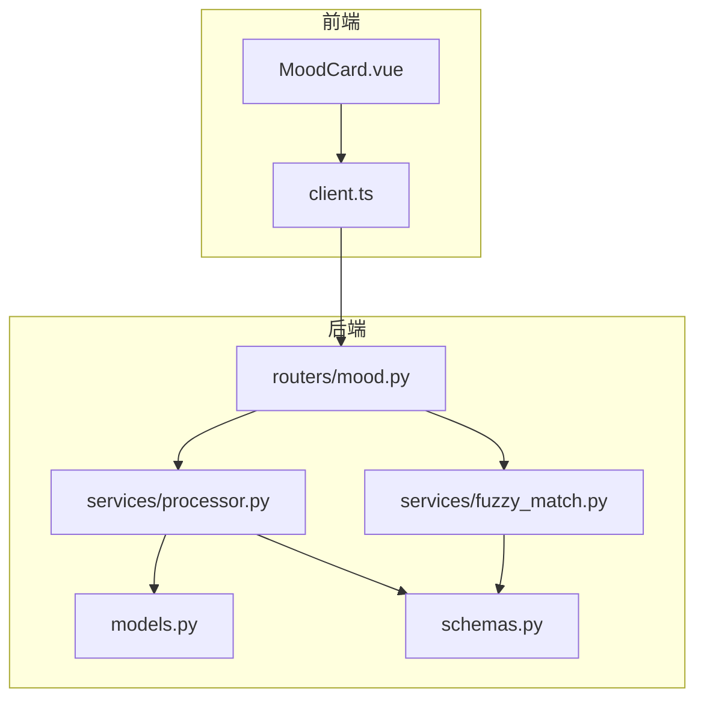
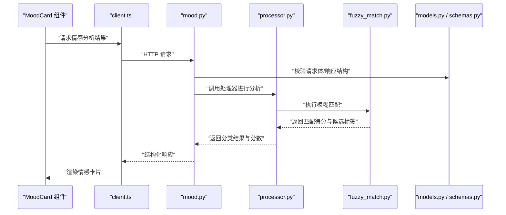
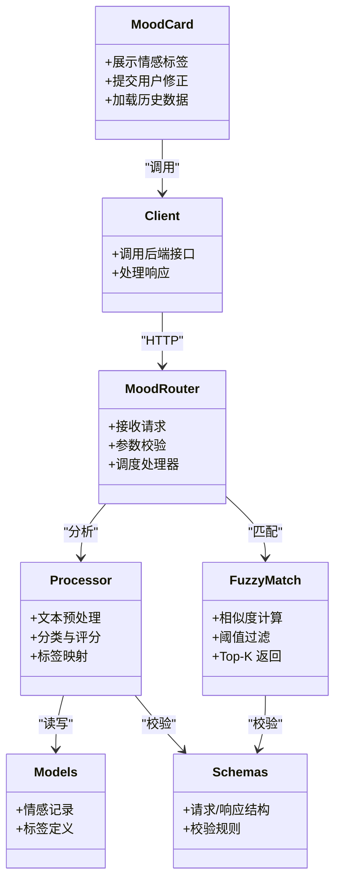

# 情感分析功能

<cite>
**本文引用的文件**   
- [MoodCard.vue](file://frontend/src/components/MoodCard.vue)
- [mood.py](file://backend/routers/mood.py)
- [fuzzy_match.py](file://backend/services/fuzzy_match.py)
- [processor.py](file://backend/services/processor.py)
- [models.py](file://backend/models.py)
- [schemas.py](file://backend/schemas.py)
- [client.ts](file://frontend/src/api/client.ts)
</cite>

## 目录
1. [简介](#简介)
2. [项目结构](#项目结构)
3. [核心组件](#核心组件)
4. [架构总览](#架构总览)
5. [详细组件分析](#详细组件分析)
6. [依赖关系分析](#依赖关系分析)
7. [性能考虑](#性能考虑)
8. [故障排查指南](#故障排查指南)
9. [结论](#结论)
10. [附录](#附录)

## 简介
本指南面向希望使用与扩展“情感分析”功能的开发者与产品人员，重点覆盖以下方面：
- MoodCard 组件的使用方法与数据绑定
- 情感状态识别算法与分类规则
- 模糊匹配机制（fuzzy_match）的实现原理、精度调优与性能优化
- 情感标签管理（自定义标签设置、分类映射、可视化展示）
- 准确性提升技巧与批量处理方法

本指南以代码仓库中的前端组件与后端服务为依据，提供从接口到实现的端到端说明。

## 项目结构
与情感分析相关的核心文件分布如下：
- 前端
  - 组件：MoodCard.vue（情感卡片展示与交互）
  - API 客户端：client.ts（调用后端接口）
- 后端
  - 路由：routers/mood.py（情感相关接口）
  - 服务：services/fuzzy_match.py（模糊匹配）、services/processor.py（处理逻辑）
  - 模型与模式：models.py、schemas.py（数据结构与校验）

图表来源
- [MoodCard.vue](file://frontend/src/components/MoodCard.vue)
- [client.ts](file://frontend/src/api/client.ts)
- [mood.py](file://backend/routers/mood.py)
- [fuzzy_match.py](file://backend/services/fuzzy_match.py)
- [processor.py](file://backend/services/processor.py)
- [models.py](file://backend/models.py)
- [schemas.py](file://backend/schemas.py)

章节来源
- [MoodCard.vue](file://frontend/src/components/MoodCard.vue)
- [client.ts](file://frontend/src/api/client.ts)
- [mood.py](file://backend/routers/mood.py)
- [fuzzy_match.py](file://backend/services/fuzzy_match.py)
- [processor.py](file://backend/services/processor.py)
- [models.py](file://backend/models.py)
- [schemas.py](file://backend/schemas.py)

## 核心组件
- MoodCard 组件
  - 负责展示当前情感标签、分数与简要描述
  - 支持用户手动修正或确认系统推荐的情感标签
  - 通过 client.ts 调用后端接口获取或提交情感分析结果
- 后端路由 mood.py
  - 暴露情感分析相关接口（如创建、更新、查询情感记录）
  - 协调 processor.py 与 fuzzy_match.py 完成分析与匹配
- 服务层
  - processor.py：封装情感分析主流程（文本预处理、分类、评分、标签映射）
  - fuzzy_match.py：实现模糊匹配，用于将输入文本与候选标签集合进行相似度计算
- 数据模型与模式
  - models.py：定义数据库实体（如情感记录、标签等）
  - schemas.py：定义请求/响应结构与校验规则

章节来源
- [MoodCard.vue](file://frontend/src/components/MoodCard.vue)
- [client.ts](file://frontend/src/api/client.ts)
- [mood.py](file://backend/routers/mood.py)
- [processor.py](file://backend/services/processor.py)
- [fuzzy_match.py](file://backend/services/fuzzy_match.py)
- [models.py](file://backend/models.py)
- [schemas.py](file://backend/schemas.py)

## 架构总览
情感分析的整体流程如下：
- 前端 MoodCard 发起请求（获取或提交情感数据）
- 后端路由接收请求并校验参数
- 处理器执行文本预处理、分类与评分
- 模糊匹配服务对候选标签进行相似度计算与排序
- 返回结构化结果供前端渲染

图表来源
- [MoodCard.vue](file://frontend/src/components/MoodCard.vue)
- [client.ts](file://frontend/src/api/client.ts)
- [mood.py](file://backend/routers/mood.py)
- [processor.py](file://backend/services/processor.py)
- [fuzzy_match.py](file://backend/services/fuzzy_match.py)
- [models.py](file://backend/models.py)
- [schemas.py](file://backend/schemas.py)

## 详细组件分析

### MoodCard 组件使用方法
- 数据绑定
  - 展示字段：情感标签、分数、时间戳、备注
  - 事件：用户点击确认/修改后触发保存或更新
- 交互流程
  - 初始化时调用 client.ts 获取默认情感建议
  - 用户可调整标签或分数，确认后调用后端接口持久化
- 可视化
  - 根据分数区间显示不同颜色或图标（由样式控制）
  - 支持切换历史条目查看趋势

章节来源
- [MoodCard.vue](file://frontend/src/components/MoodCard.vue)
- [client.ts](file://frontend/src/api/client.ts)

### 情感状态识别算法与分类规则
- 文本预处理
  - 清洗噪声、分词、去停用词、标准化表达
- 特征提取
  - 基于关键词词典与权重打分
  - 可选语义向量（若集成 NLP 模型）
- 分类决策
  - 多类别判定（如积极、中性、消极等）
  - 输出置信度分数与候选标签列表
- 标签映射
  - 将原始分类映射为业务可用的情感标签
  - 支持自定义标签与别名映射表

章节来源
- [processor.py](file://backend/services/processor.py)
- [schemas.py](file://backend/schemas.py)

### 模糊匹配机制（fuzzy_match）实现原理
- 候选集构建
  - 维护情感标签库（含别名、同义词、常见变体）
- 相似度计算
  - 字符串编辑距离（如 Levenshtein）
  - 字符级 n-gram 重叠
  - 可选加权评分（按标签热度、领域相关性）
- 阈值与排序
  - 设定最低匹配阈值过滤低质量结果
  - 按得分降序返回 Top-K 候选
- 回退策略
  - 当无高置信匹配时，返回最接近的通用标签或提示人工标注

章节来源
- [fuzzy_match.py](file://backend/services/fuzzy_match.py)
- [schemas.py](file://backend/schemas.py)

### 情感标签管理
- 标签体系
  - 基础标签：积极、中性、消极等
  - 细分标签：焦虑、愉悦、疲惫、专注等
- 自定义设置
  - 新增标签、别名与权重
  - 导入/导出标签库（CSV/JSON）
- 分类规则配置
  - 关键词词典与权重
  - 规则优先级与冲突消解策略

章节来源
- [schemas.py](file://backend/schemas.py)
- [models.py](file://backend/models.py)

### 分析结果可视化
- 卡片展示
  - 当前情感标签、分数、时间
  - 最近变化趋势（折线或柱状图）
- 交互增强
  - 点击标签查看详情与历史记录
  - 支持快速修正与反馈收集

章节来源
- [MoodCard.vue](file://frontend/src/components/MoodCard.vue)

## 依赖关系分析
- 前端依赖
  - MoodCard 依赖 client.ts 进行网络请求
- 后端依赖
  - mood.py 路由依赖 processor.py 与 fuzzy_match.py
  - processor.py 依赖 models.py 与 schemas.py 进行数据建模与校验
  - fuzzy_match.py 依赖 schemas.py 确保输入输出一致性

图表来源
- [MoodCard.vue](file://frontend/src/components/MoodCard.vue)
- [client.ts](file://frontend/src/api/client.ts)
- [mood.py](file://backend/routers/mood.py)
- [processor.py](file://backend/services/processor.py)
- [fuzzy_match.py](file://backend/services/fuzzy_match.py)
- [models.py](file://backend/models.py)
- [schemas.py](file://backend/schemas.py)

章节来源
- [mood.py](file://backend/routers/mood.py)
- [processor.py](file://backend/services/processor.py)
- [fuzzy_match.py](file://backend/services/fuzzy_match.py)
- [models.py](file://backend/models.py)
- [schemas.py](file://backend/schemas.py)

## 性能考虑
- 模糊匹配优化
  - 预计算标签指纹（n-gram 索引）
  - 使用近似最近邻（ANN）加速大规模候选检索
  - 限制 Top-K 数量减少后续计算
- 批处理策略
  - 合并多次请求为批量接口，降低网络开销
  - 异步队列处理耗时任务，避免阻塞主线程
- 缓存与复用
  - 缓存常用标签与词典
  - 对相同输入进行结果缓存（短 TTL）
- 资源控制
  - 限制单次处理文本长度
  - 合理设置并发与超时

章节来源
- [fuzzy_match.py](file://backend/services/fuzzy_match.py)
- [processor.py](file://backend/services/processor.py)

## 故障排查指南
- 常见问题
  - 匹配结果为空或置信度过低：检查阈值设置与候选标签库完整性
  - 分类不准确：审查关键词词典权重与规则优先级
  - 接口报错：核对 schemas.py 定义的请求/响应结构是否一致
- 调试建议
  - 打印中间结果（预处理后的文本、候选标签、得分）
  - 增加日志级别，定位瓶颈与异常路径
  - 使用单元测试验证边界情况（空文本、特殊字符、极端长度）

章节来源
- [schemas.py](file://backend/schemas.py)
- [fuzzy_match.py](file://backend/services/fuzzy_match.py)
- [processor.py](file://backend/services/processor.py)

## 结论
本指南系统梳理了情感分析功能的前后端实现与使用要点。通过合理配置分类规则与模糊匹配策略，并结合批处理与缓存优化，可在保证准确性的同时提升整体性能。建议持续迭代标签库与规则，结合用户反馈闭环优化。

## 附录
- 最佳实践
  - 定期更新标签库与词典
  - 建立 A/B 测试评估不同策略效果
  - 监控关键指标（准确率、召回率、延迟）
- 扩展方向
  - 引入更强大的语义模型（如嵌入向量）
  - 多模态输入（语音转文本后的情感分析）
  - 个性化标签与用户画像融合