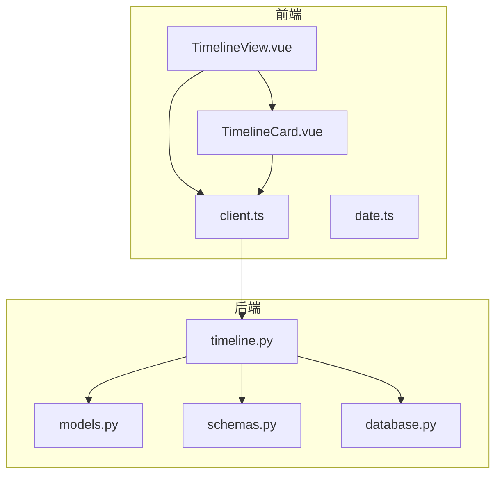
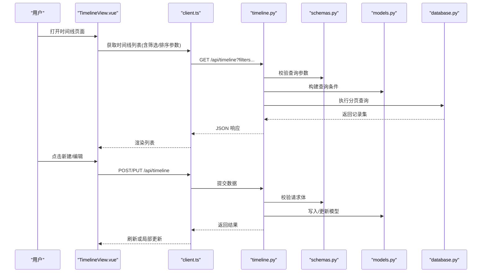
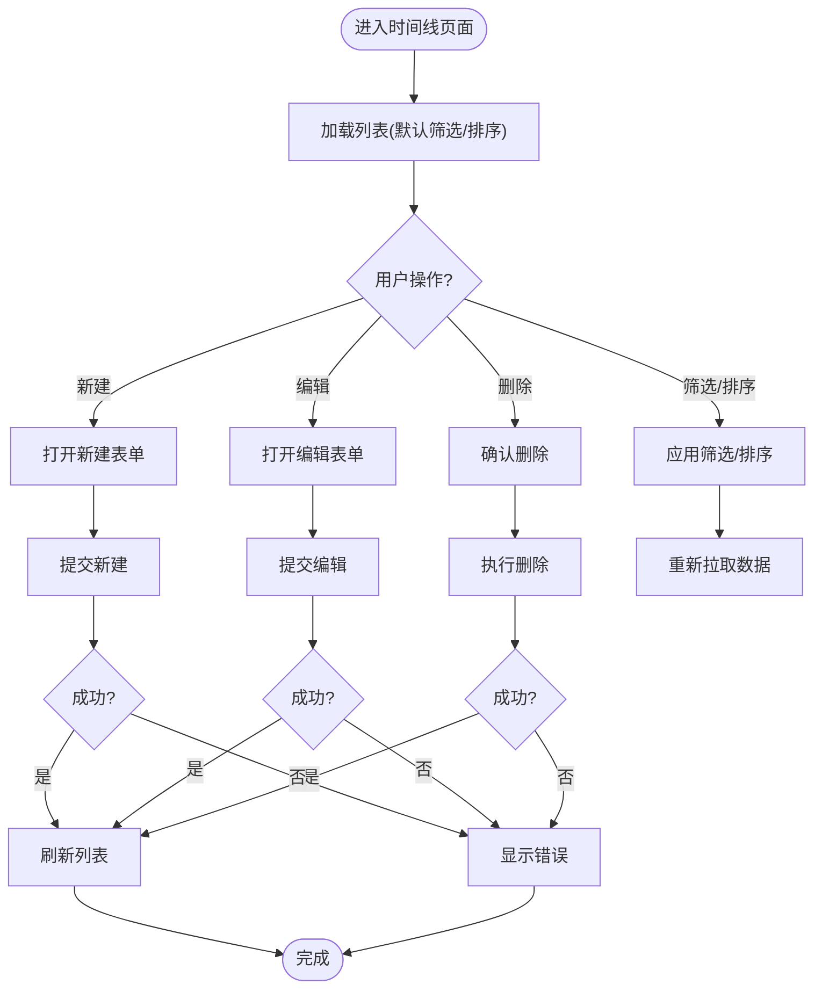
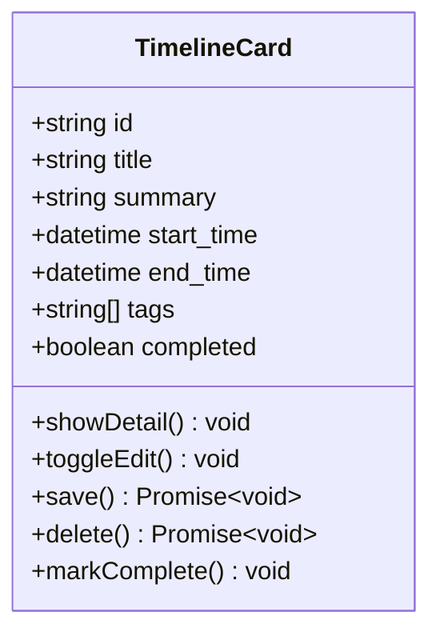
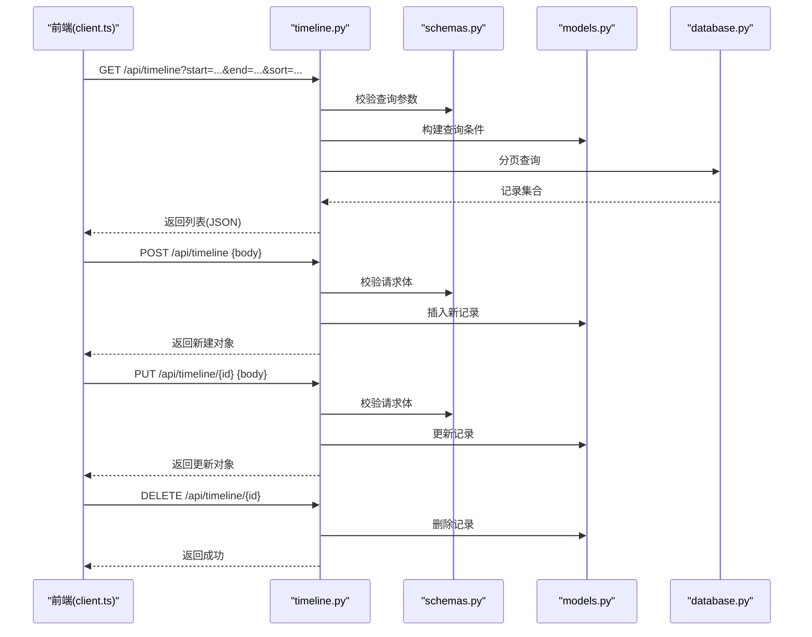
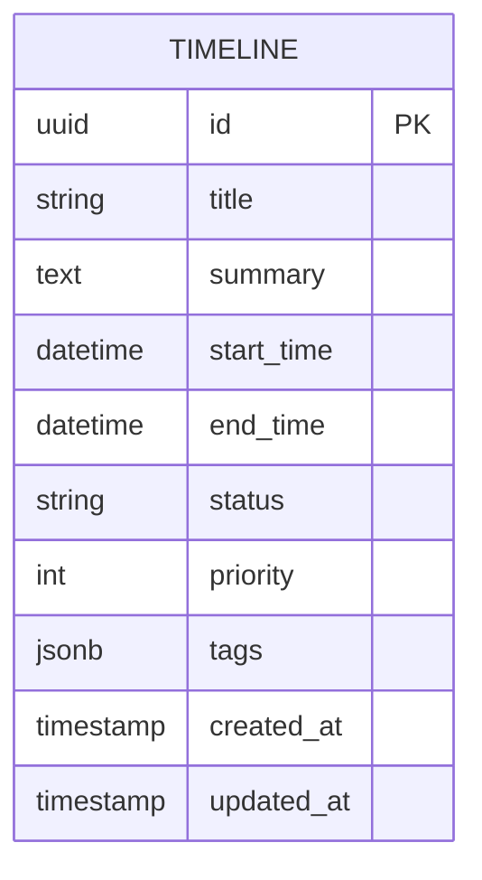
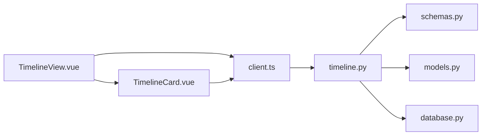

# 时间线管理

<cite>
**本文引用的文件**   
- [frontend/src/views/TimelineView.vue](file://frontend/src/views/TimelineView.vue)
- [frontend/src/components/TimelineCard.vue](file://frontend/src/components/TimelineCard.vue)
- [backend/routers/timeline.py](file://backend/routers/timeline.py)
- [backend/models.py](file://backend/models.py)
- [backend/schemas.py](file://backend/schemas.py)
- [backend/database.py](file://backend/database.py)
- [frontend/src/api/client.ts](file://frontend/src/api/client.ts)
- [frontend/src/utils/date.ts](file://frontend/src/utils/date.ts)
</cite>

## 目录
1. [简介](#简介)
2. [项目结构](#项目结构)
3. [核心组件](#核心组件)
4. [架构总览](#架构总览)
5. [详细组件分析](#详细组件分析)
6. [依赖关系分析](#依赖关系分析)
7. [性能考虑](#性能考虑)
8. [故障排查指南](#故障排查指南)
9. [结论](#结论)
10. [附录](#附录)

## 简介
本指南面向使用“时间线管理”功能的用户与开发者，系统讲解时间线视图的界面操作、TimelineCard 组件使用方法、时间轴数据的展示与交互能力。内容涵盖：
- 时间线的创建、编辑、删除操作
- 日期筛选与时间排序
- 数据模型、API 接口调用与前后端数据同步机制
- 高效组织与管理技巧
- 大数据量下的性能优化建议

## 项目结构
时间线功能由前端视图与组件、后端路由与数据模型共同组成：
- 前端
  - TimelineView.vue：时间线页面视图，负责列表渲染、筛选、排序、分页与交互入口
  - TimelineCard.vue：单条时间线卡片组件，负责详情展示与行内编辑/删除等交互
  - client.ts：HTTP 客户端封装，统一调用后端 API
  - date.ts：日期工具函数，用于格式化与比较
- 后端
  - timeline.py：时间线相关 REST 路由（CRUD、筛选、排序）
  - models.py：数据库模型定义（时间线实体字段）
  - schemas.py：请求/响应数据结构校验
  - database.py：数据库连接与查询执行

**图表来源** 
- [frontend/src/views/TimelineView.vue](file://frontend/src/views/TimelineView.vue)
- [frontend/src/components/TimelineCard.vue](file://frontend/src/components/TimelineCard.vue)
- [frontend/src/api/client.ts](file://frontend/src/api/client.ts)
- [backend/routers/timeline.py](file://backend/routers/timeline.py)
- [backend/models.py](file://backend/models.py)
- [backend/schemas.py](file://backend/schemas.py)
- [backend/database.py](file://backend/database.py)

**章节来源**
- [frontend/src/views/TimelineView.vue](file://frontend/src/views/TimelineView.vue)
- [frontend/src/components/TimelineCard.vue](file://frontend/src/components/TimelineCard.vue)
- [frontend/src/api/client.ts](file://frontend/src/api/client.ts)
- [frontend/src/utils/date.ts](file://frontend/src/utils/date.ts)
- [backend/routers/timeline.py](file://backend/routers/timeline.py)
- [backend/models.py](file://backend/models.py)
- [backend/schemas.py](file://backend/schemas.py)
- [backend/database.py](file://backend/database.py)

## 核心组件
- TimelineView.vue
  - 职责：时间线列表页，提供创建、筛选、排序、分页、批量操作入口；维护本地状态并与后端同步
  - 关键能力：日期范围筛选、按时间排序、搜索关键词过滤、分页加载、错误提示
- TimelineCard.vue
  - 职责：单条时间线条目展示与交互，支持展开详情、编辑、删除、快速标记完成等
  - 关键能力：字段只读/编辑切换、表单校验、乐观更新、失败回滚

**章节来源**
- [frontend/src/views/TimelineView.vue](file://frontend/src/views/TimelineView.vue)
- [frontend/src/components/TimelineCard.vue](file://frontend/src/components/TimelineCard.vue)

## 架构总览
时间线功能采用前后端分离架构，前端通过 HTTP 客户端调用后端 REST API，后端基于 ORM 模型与数据库进行持久化。

**图表来源** 
- [frontend/src/views/TimelineView.vue](file://frontend/src/views/TimelineView.vue)
- [frontend/src/api/client.ts](file://frontend/src/api/client.ts)
- [backend/routers/timeline.py](file://backend/routers/timeline.py)
- [backend/schemas.py](file://backend/schemas.py)
- [backend/models.py](file://backend/models.py)
- [backend/database.py](file://backend/database.py)

## 详细组件分析

### TimelineView.vue（时间线视图）
- 界面操作
  - 新建：弹出表单，填写标题、描述、开始/结束时间、标签等，提交后刷新列表
  - 筛选：支持按日期范围、关键词、标签等维度组合筛选
  - 排序：支持按时间升/降序、按创建时间、按优先级等
  - 分页：支持页码与每页数量设置，减少首屏负载
- 数据流
  - 初始化时拉取默认筛选条件下的数据
  - 用户修改筛选/排序条件时，触发重新请求并合并到本地缓存
  - 新增/编辑/删除成功后，增量更新本地列表，保持 UI 一致性
- 错误处理
  - 网络异常与服务端校验错误均给出友好提示
  - 失败时保留用户输入，便于重试

**图表来源** 
- [frontend/src/views/TimelineView.vue](file://frontend/src/views/TimelineView.vue)

**章节来源**
- [frontend/src/views/TimelineView.vue](file://frontend/src/views/TimelineView.vue)

### TimelineCard.vue（时间线卡片）
- 展示与交互
  - 只读模式：展示标题、摘要、时间、标签、状态等
  - 编辑模式：可编辑关键字段，支持必填校验与格式校验
  - 快捷操作：一键完成/取消完成、删除、复制、分享等
- 数据同步
  - 编辑提交后优先进行乐观更新，失败则回滚至上次有效状态
  - 删除前二次确认，避免误删
- 性能优化
  - 虚拟滚动（当列表项较多时启用）
  - 懒加载详情（按需展开）

**图表来源** 
- [frontend/src/components/TimelineCard.vue](file://frontend/src/components/TimelineCard.vue)

**章节来源**
- [frontend/src/components/TimelineCard.vue](file://frontend/src/components/TimelineCard.vue)

### 后端 API（timeline.py）
- 主要接口
  - 列表查询：GET /api/timeline，支持筛选与排序参数
  - 创建：POST /api/timeline
  - 更新：PUT /api/timeline/{id}
  - 删除：DELETE /api/timeline/{id}
- 参数校验与响应
  - 使用 schemas.py 对请求体与查询参数进行严格校验
  - 返回统一的 JSON 结构与状态码

**图表来源** 
- [backend/routers/timeline.py](file://backend/routers/timeline.py)
- [backend/schemas.py](file://backend/schemas.py)
- [backend/models.py](file://backend/models.py)
- [backend/database.py](file://backend/database.py)

**章节来源**
- [backend/routers/timeline.py](file://backend/routers/timeline.py)
- [backend/schemas.py](file://backend/schemas.py)

### 数据模型（models.py）
- 时间线实体字段
  - 标识：主键 ID
  - 基础信息：标题、摘要、描述
  - 时间信息：开始时间、结束时间、时区
  - 分类与状态：标签、优先级、完成状态
  - 审计字段：创建时间、更新时间、创建者/更新者
- 索引与约束
  - 为常用筛选字段建立索引（如开始时间、标签、状态）
  - 非空字段约束与唯一性约束（如标题在特定范围内唯一）

**图表来源** 
- [backend/models.py](file://backend/models.py)

**章节来源**
- [backend/models.py](file://backend/models.py)

### 前端客户端（client.ts）
- 职责
  - 统一封装 HTTP 请求，处理鉴权头、超时、重试、错误映射
  - 提供类型化的方法：getTimelineList、createTimeline、updateTimeline、deleteTimeline
- 最佳实践
  - 请求去抖（筛选输入）
  - 失败自动重试（幂等请求）
  - 统一错误提示与日志上报

**章节来源**
- [frontend/src/api/client.ts](file://frontend/src/api/client.ts)

### 日期工具（date.ts）
- 职责
  - 日期格式化（YYYY-MM-DD、相对时间）
  - 时区转换与比较
  - 日期范围计算（起止边界、间隔）
- 使用场景
  - 筛选面板展示
  - 排序与分页中的时间边界处理

**章节来源**
- [frontend/src/utils/date.ts](file://frontend/src/utils/date.ts)

## 依赖关系分析
- 前端依赖
  - TimelineView.vue 依赖 TimelineCard.vue 进行条目渲染
  - TimelineView.vue 与 TimelineCard.vue 均依赖 client.ts 发起网络请求
  - 日期展示与筛选依赖 date.ts
- 后端依赖
  - timeline.py 依赖 schemas.py 做参数校验
  - timeline.py 依赖 models.py 进行数据建模与查询
  - timeline.py 依赖 database.py 执行 SQL/ORM 查询

**图表来源** 
- [frontend/src/views/TimelineView.vue](file://frontend/src/views/TimelineView.vue)
- [frontend/src/components/TimelineCard.vue](file://frontend/src/components/TimelineCard.vue)
- [frontend/src/api/client.ts](file://frontend/src/api/client.ts)
- [backend/routers/timeline.py](file://backend/routers/timeline.py)
- [backend/schemas.py](file://backend/schemas.py)
- [backend/models.py](file://backend/models.py)
- [backend/database.py](file://backend/database.py)

**章节来源**
- [frontend/src/views/TimelineView.vue](file://frontend/src/views/TimelineView.vue)
- [frontend/src/components/TimelineCard.vue](file://frontend/src/components/TimelineCard.vue)
- [frontend/src/api/client.ts](file://frontend/src/api/client.ts)
- [backend/routers/timeline.py](file://backend/routers/timeline.py)
- [backend/schemas.py](file://backend/schemas.py)
- [backend/models.py](file://backend/models.py)
- [backend/database.py](file://backend/database.py)

## 性能考虑
- 前端优化
  - 列表虚拟化：当条目超过一定阈值（如 200）时启用虚拟滚动，仅渲染可视区域
  - 请求去抖：筛选输入框增加 200-300ms 去抖，减少频繁请求
  - 分页与预取：合理设置每页大小（如 20-50），下一页预取提升体验
  - 局部更新：编辑/删除后仅更新受影响条目，避免全量重绘
- 后端优化
  - 索引策略：为筛选与排序字段建立复合索引（如 start_time, status）
  - 查询优化：使用投影只返回必要字段，避免大对象传输
  - 缓存层：热点数据（如最近 7 天时间线）加入 Redis 缓存，降低数据库压力
  - 分页限制：限制最大页大小，防止恶意大页导致内存溢出
- 网络与容错
  - 超时与重试：短超时+指数退避重试，提升弱网稳定性
  - 错误降级：服务不可用时返回空列表与友好提示

[本节为通用指导，不直接分析具体文件]

## 故障排查指南
- 常见问题
  - 列表为空：检查筛选条件是否过严、分页参数是否正确、后端服务是否可用
  - 编辑失败：查看请求体是否符合 schemas 校验规则，关注必填字段与格式
  - 删除无效：确认权限与资源存在性，检查事务是否回滚
  - 日期异常：核对时区设置与日期格式化逻辑
- 定位步骤
  - 前端：打开浏览器开发者工具，查看 Network 与 Console 日志
  - 后端：查看服务端日志与数据库慢查询
  - 数据一致性：对比前后端时间戳与状态字段

**章节来源**
- [frontend/src/api/client.ts](file://frontend/src/api/client.ts)
- [backend/routers/timeline.py](file://backend/routers/timeline.py)
- [backend/schemas.py](file://backend/schemas.py)

## 结论
时间线管理功能通过清晰的前后端分层与严格的参数校验，提供了稳定高效的 CRUD、筛选与排序能力。结合虚拟化、去抖、分页与缓存等优化手段，可在大数据量下保持良好的用户体验。建议在后续迭代中持续完善索引策略与缓存命中率监控，进一步提升性能与可用性。

[本节为总结性内容，不直接分析具体文件]

## 附录
- 使用技巧
  - 合理使用标签与优先级，配合筛选与排序快速定位任务
  - 利用日期范围筛选聚焦近期工作，减少干扰
  - 批量操作前先预览变更，避免误改
- 最佳实践
  - 前端：统一错误提示与加载态，保证一致体验
  - 后端：严格校验与幂等设计，保障数据安全
  - 运维：监控接口耗时与错误率，及时扩容与优化

[本节为补充说明，不直接分析具体文件]