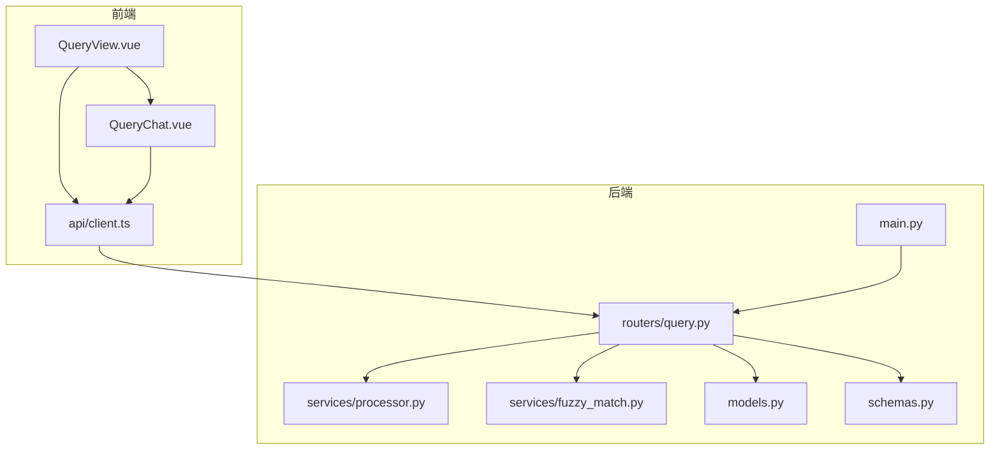
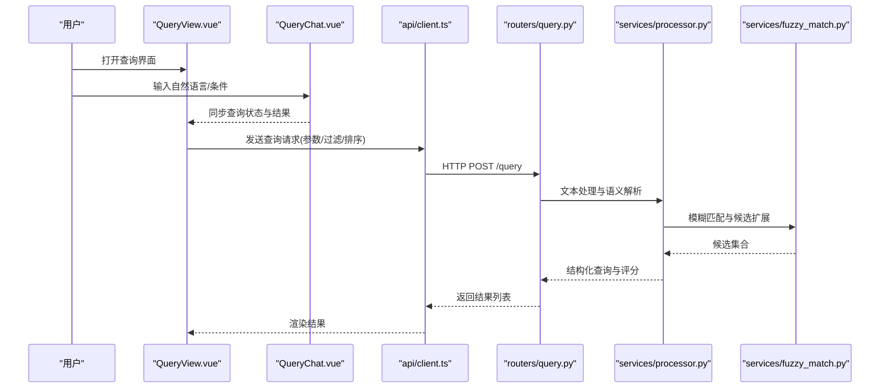
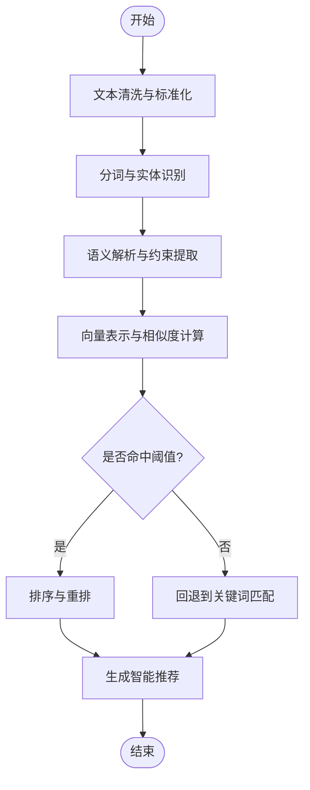
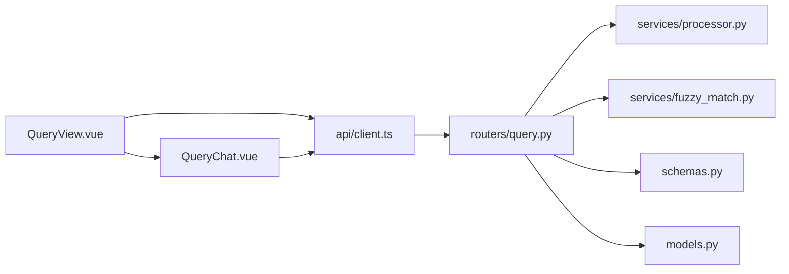

# 智能查询功能

<cite>
**本文引用的文件**   
- [QueryView.vue](file://frontend/src/views/QueryView.vue)
- [QueryChat.vue](file://frontend/src/components/QueryChat.vue)
- [client.ts](file://frontend/src/api/client.ts)
- [query.py](file://backend/routers/query.py)
- [processor.py](file://backend/services/processor.py)
- [fuzzy_match.py](file://backend/services/fuzzy_match.py)
- [main.py](file://backend/main.py)
- [models.py](file://backend/models.py)
- [schemas.py](file://backend/schemas.py)
</cite>

## 目录
1. [简介](#简介)
2. [项目结构](#项目结构)
3. [核心组件](#核心组件)
4. [架构总览](#架构总览)
5. [详细组件分析](#详细组件分析)
6. [依赖关系分析](#依赖关系分析)
7. [性能考虑](#性能考虑)
8. [故障排查指南](#故障排查指南)
9. [结论](#结论)
10. [附录](#附录)

## 简介
本指南面向使用“智能查询”功能的用户与开发者，系统讲解 QueryView 界面的使用方法、QueryChat 对话式查询、自然语言处理与语义搜索能力。文档涵盖查询语法、过滤条件设置、结果排序选项，并深入解释后端 processor 服务的文本处理流程、AI 驱动的内容理解与智能推荐机制。同时提供高效查询技巧、复杂查询构建方法与查询性能优化策略，帮助用户快速上手并获得最佳体验。

## 项目结构
智能查询功能横跨前端与后端：
- 前端
  - 视图层：QueryView 负责展示查询界面与结果列表
  - 交互层：QueryChat 提供对话式输入、历史消息与快捷建议
  - API 客户端：封装对后端的请求与响应处理
- 后端
  - 路由层：query 路由暴露查询接口，接收查询参数与返回结果
  - 服务层：processor 负责文本预处理、语义解析与推荐；fuzzy_match 提供模糊匹配能力
  - 数据模型与模式：models 与 schemas 定义数据结构与校验规则
  - 应用入口：main 注册路由与中间件

图表来源
- [QueryView.vue](file://frontend/src/views/QueryView.vue)
- [QueryChat.vue](file://frontend/src/components/QueryChat.vue)
- [client.ts](file://frontend/src/api/client.ts)
- [main.py](file://backend/main.py)
- [query.py](file://backend/routers/query.py)
- [processor.py](file://backend/services/processor.py)
- [fuzzy_match.py](file://backend/services/fuzzy_match.py)
- [models.py](file://backend/models.py)
- [schemas.py](file://backend/schemas.py)

章节来源
- [QueryView.vue](file://frontend/src/views/QueryView.vue)
- [QueryChat.vue](file://frontend/src/components/QueryChat.vue)
- [client.ts](file://frontend/src/api/client.ts)
- [query.py](file://backend/routers/query.py)
- [processor.py](file://backend/services/processor.py)
- [fuzzy_match.py](file://backend/services/fuzzy_match.py)
- [main.py](file://backend/main.py)
- [models.py](file://backend/models.py)
- [schemas.py](file://backend/schemas.py)

## 核心组件
- QueryView（查询视图）
  - 作用：承载查询入口、过滤面板、结果列表与分页控制
  - 关键行为：接收用户输入、拼装查询参数、调用 API、渲染结果、支持排序与筛选
- QueryChat（对话式查询）
  - 作用：以对话形式收集意图、上下文与约束，自动转换为结构化查询
  - 关键行为：维护消息历史、生成建议、错误提示、重试与取消
- 处理器服务（processor）
  - 作用：文本清洗、分词、实体识别、语义向量计算、意图分类与推荐生成
  - 关键行为：多阶段流水线、可插拔模块、缓存命中与降级
- 模糊匹配（fuzzy_match）
  - 作用：近似匹配、拼写纠错、同义词扩展
  - 关键行为：相似度阈值、候选集裁剪、性能优化

章节来源
- [QueryView.vue](file://frontend/src/views/QueryView.vue)
- [QueryChat.vue](file://frontend/src/components/QueryChat.vue)
- [processor.py](file://backend/services/processor.py)
- [fuzzy_match.py](file://backend/services/fuzzy_match.py)

## 架构总览
智能查询的整体流程如下：用户在 QueryView 或 QueryChat 中输入自然语言或结构化条件，前端通过 client.ts 发起请求至后端 query 路由。后端 processor 服务对输入进行文本处理与语义理解，结合 fuzzy_match 进行近似匹配与扩展，最终返回排序后的结果。

图表来源
- [QueryView.vue](file://frontend/src/views/QueryView.vue)
- [QueryChat.vue](file://frontend/src/components/QueryChat.vue)
- [client.ts](file://frontend/src/api/client.ts)
- [query.py](file://backend/routers/query.py)
- [processor.py](file://backend/services/processor.py)
- [fuzzy_match.py](file://backend/services/fuzzy_match.py)

## 详细组件分析

### QueryView 界面使用指南
- 界面组成
  - 查询输入区：支持自然语言与简单语法
  - 过滤面板：按时间、类型、标签等维度筛选
  - 结果列表：显示匹配项、摘要与元信息
  - 排序与分页：按相关性、时间、自定义字段排序，支持翻页
- 使用方法
  - 直接输入关键词或短语，系统自动进行语义检索
  - 使用过滤条件限定范围，减少无关结果
  - 选择排序方式提升定位效率
  - 点击结果查看详情或进一步操作
- 常用技巧
  - 组合多个过滤条件提高精确度
  - 使用短而明确的关键词获得更好语义匹配
  - 利用排序中的“相关性”优先获取最相关结果

章节来源
- [QueryView.vue](file://frontend/src/views/QueryView.vue)

### QueryChat 对话式查询
- 对话流程
  - 用户以自然语言描述需求，系统逐步澄清意图与约束
  - 聊天历史用于上下文延续，避免重复输入
  - 系统自动生成建议与快捷命令，降低输入成本
- 交互要点
  - 明确表达时间、类型、标签等关键约束
  - 使用否定或排除词缩小范围
  - 遇到不相关结果时，追加限定条件或调整措辞
- 错误处理
  - 输入歧义时，系统会提示补充信息
  - 网络异常或超时，支持重试与取消

章节来源
- [QueryChat.vue](file://frontend/src/components/QueryChat.vue)

### 查询语法与过滤条件
- 查询语法
  - 自然语言优先：系统理解常见表达方式
  - 简单语法：支持关键词、布尔逻辑与基本运算符
  - 结构化片段：如日期范围、数值区间、标签集合
- 过滤条件
  - 时间：起止时间、相对时间（最近一天/一周）
  - 类型：内容类型、来源、状态
  - 标签/分类：单个或多个标签的交集/并集
  - 其他：作者、设备、地理位置等（依数据模型而定）
- 排序选项
  - 相关性：基于语义与匹配度评分
  - 时间：最新或最早
  - 自定义字段：按指定字段升序/降序

章节来源
- [query.py](file://backend/routers/query.py)
- [schemas.py](file://backend/schemas.py)

### 结果排序与分页
- 排序策略
  - 相关性排序：综合关键词匹配、语义相似度与权重
  - 时间排序：按创建或更新时间倒序/正序
  - 字段排序：按业务字段（如评分、热度）排序
- 分页控制
  - 页大小：合理设置以减少传输与渲染开销
  - 游标/偏移：根据后端实现选择高效分页方式

章节来源
- [query.py](file://backend/routers/query.py)
- [schemas.py](file://backend/schemas.py)

### 处理器服务（processor）文本处理流程
- 文本清洗
  - 去除噪声、标准化格式、统一编码
- 分词与实体识别
  - 中文分词、专有名词抽取、时间/地点识别
- 语义解析
  - 意图分类、约束提取、参数归一化
- 向量计算与检索
  - 将查询转为向量，与索引库进行相似度检索
- 推荐生成
  - 基于上下文与历史生成下一步建议与扩展查询

图表来源
- [processor.py](file://backend/services/processor.py)

章节来源
- [processor.py](file://backend/services/processor.py)

### 模糊匹配（fuzzy_match）
- 功能说明
  - 近似匹配：容忍拼写误差与口语化表达
  - 同义词扩展：扩大召回面，提升覆盖率
  - 候选裁剪：基于相似度阈值与业务规则过滤
- 使用场景
  - 用户输入存在错别字或方言表达
  - 需要扩展关键词以获得更全面的搜索结果

章节来源
- [fuzzy_match.py](file://backend/services/fuzzy_match.py)

### 数据模型与模式（models 与 schemas）
- models
  - 定义查询结果的数据结构与关联关系
- schemas
  - 定义请求与响应的校验规则、默认值与枚举值

章节来源
- [models.py](file://backend/models.py)
- [schemas.py](file://backend/schemas.py)

## 依赖关系分析
- 前端依赖
  - QueryView 依赖 QueryChat 与 API 客户端
  - QueryChat 依赖 API 客户端进行异步请求
- 后端依赖
  - query 路由依赖 processor 与 fuzzy_match
  - processor 依赖分词、实体识别与向量检索模块
  - schemas 与 models 贯穿前后端的数据契约

图表来源
- [QueryView.vue](file://frontend/src/views/QueryView.vue)
- [QueryChat.vue](file://frontend/src/components/QueryChat.vue)
- [client.ts](file://frontend/src/api/client.ts)
- [query.py](file://backend/routers/query.py)
- [processor.py](file://backend/services/processor.py)
- [fuzzy_match.py](file://backend/services/fuzzy_match.py)
- [schemas.py](file://backend/schemas.py)
- [models.py](file://backend/models.py)

章节来源
- [query.py](file://backend/routers/query.py)
- [processor.py](file://backend/services/processor.py)
- [fuzzy_match.py](file://backend/services/fuzzy_match.py)
- [schemas.py](file://backend/schemas.py)
- [models.py](file://backend/models.py)

## 性能考虑
- 前端优化
  - 合理设置分页大小，避免一次性加载过多数据
  - 防抖与节流：在输入频繁变化时减少请求频率
  - 缓存常用查询结果，缩短二次查询时间
- 后端优化
  - 索引优化：为高频过滤字段建立索引
  - 向量检索：使用近似最近邻算法与批量查询
  - 缓存与降级：热点查询缓存，失败时回退到关键词匹配
  - 并行处理：分词、实体识别与向量计算可并行执行

[本节为通用指导，无需特定文件引用]

## 故障排查指南
- 常见问题
  - 查询无结果：检查过滤条件是否过严、关键词是否准确
  - 结果不相关：尝试调整排序方式或增加限定条件
  - 响应缓慢：减少分页大小、检查网络与后端负载
- 调试步骤
  - 查看浏览器控制台与网络请求，确认参数是否正确
  - 在后端日志中定位 processor 与模糊匹配的中间输出
  - 逐步简化查询，定位问题所在环节

章节来源
- [query.py](file://backend/routers/query.py)
- [processor.py](file://backend/services/processor.py)
- [fuzzy_match.py](file://backend/services/fuzzy_match.py)

## 结论
智能查询功能通过前端对话式交互与后端文本处理、语义理解及模糊匹配，为用户提供高效、精准的检索体验。掌握查询语法、过滤与排序方法，并结合性能优化策略，可以显著提升查询效果与系统稳定性。建议在复杂场景中采用结构化约束与分步澄清，以获得更准确的语义解析与推荐结果。

[本节为总结性内容，无需特定文件引用]

## 附录
- 最佳实践清单
  - 使用简洁明确的关键词
  - 合理组合过滤条件
  - 选择合适的排序方式
  - 关注分页与缓存策略
- 参考路径
  - 前端视图与组件：QueryView.vue、QueryChat.vue
  - API 客户端：client.ts
  - 后端路由与服务：query.py、processor.py、fuzzy_match.py
  - 数据契约：schemas.py、models.py

[本节为附录内容，无需特定文件引用]