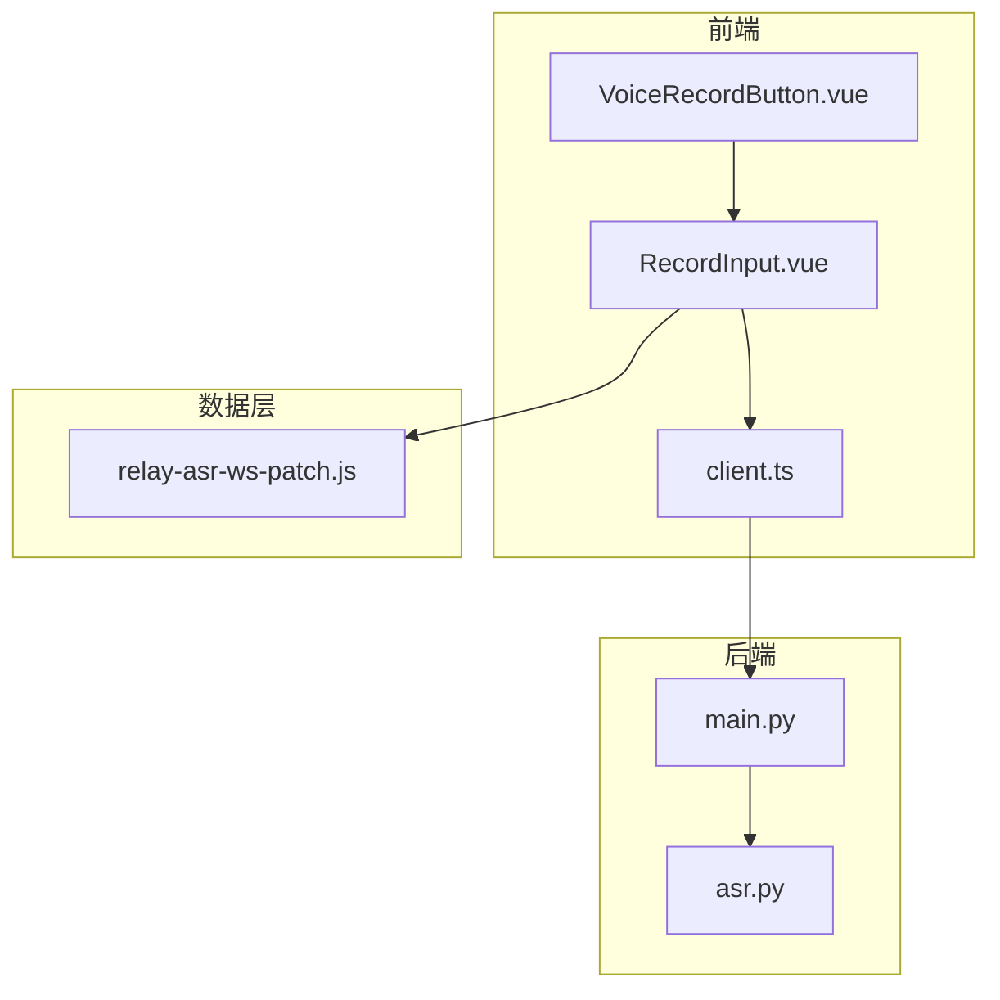
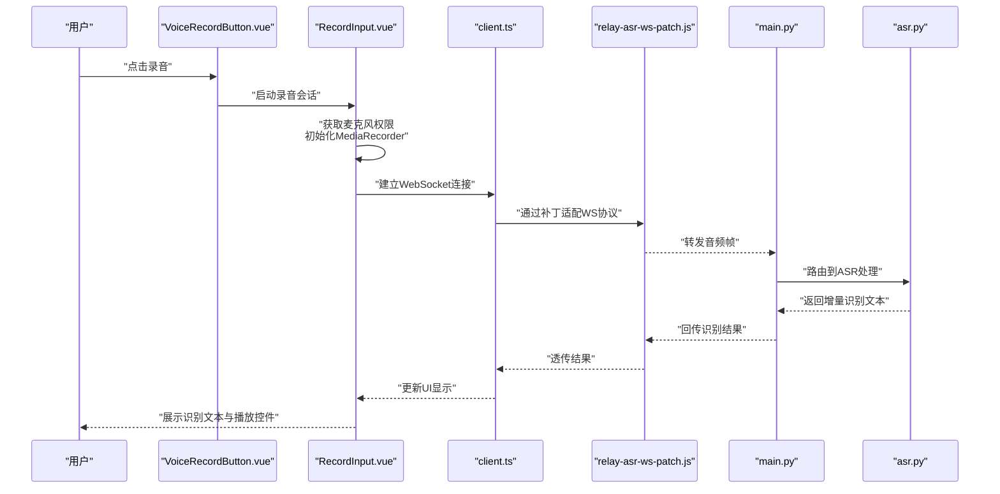
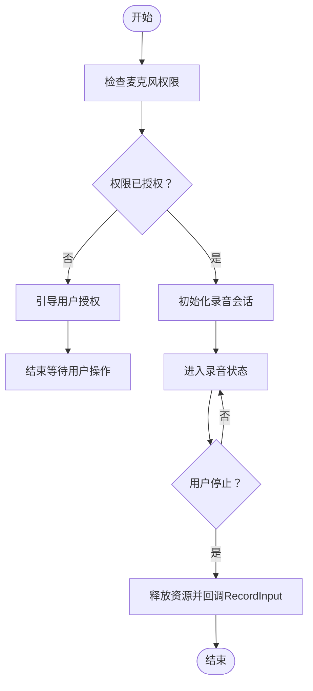
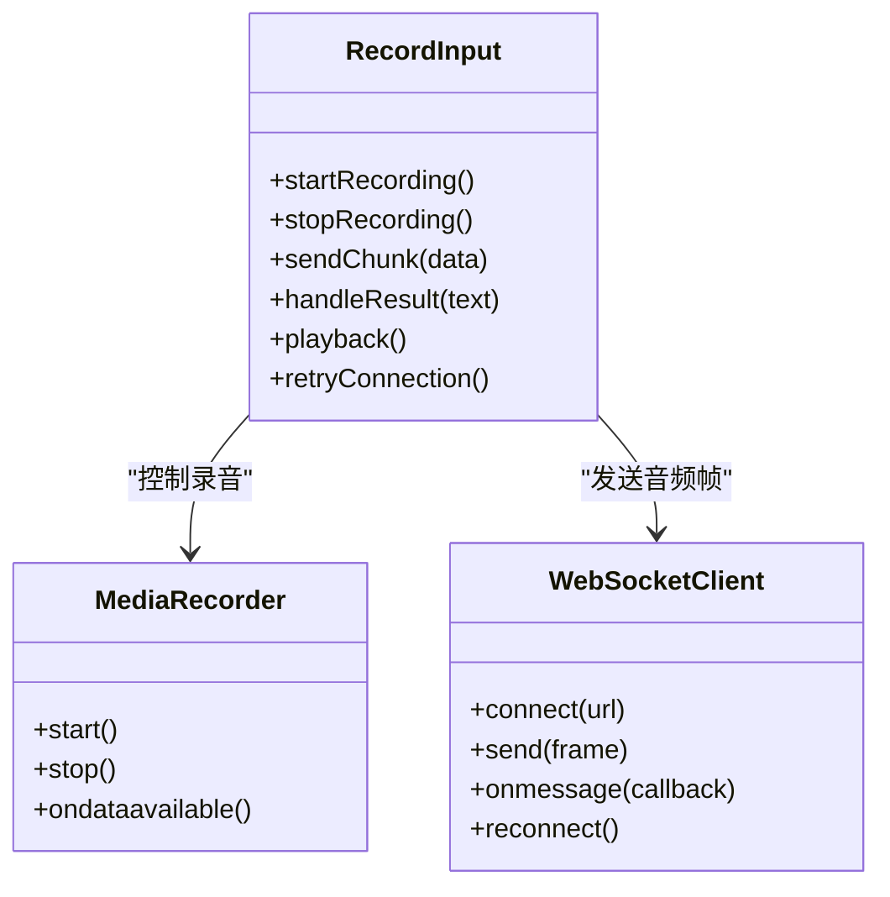
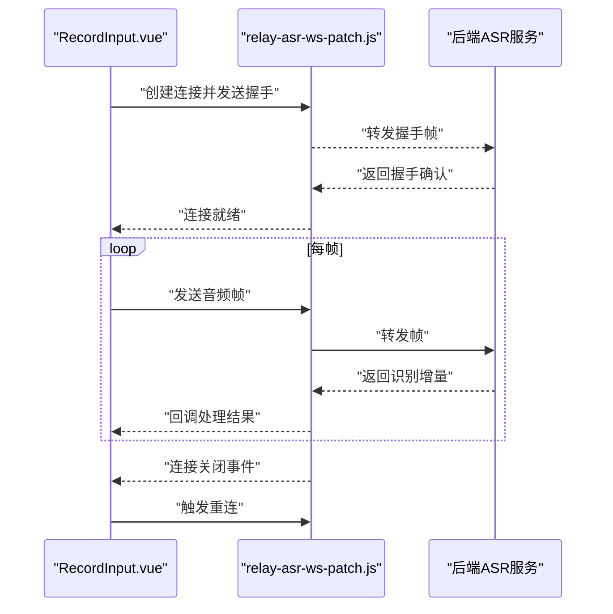
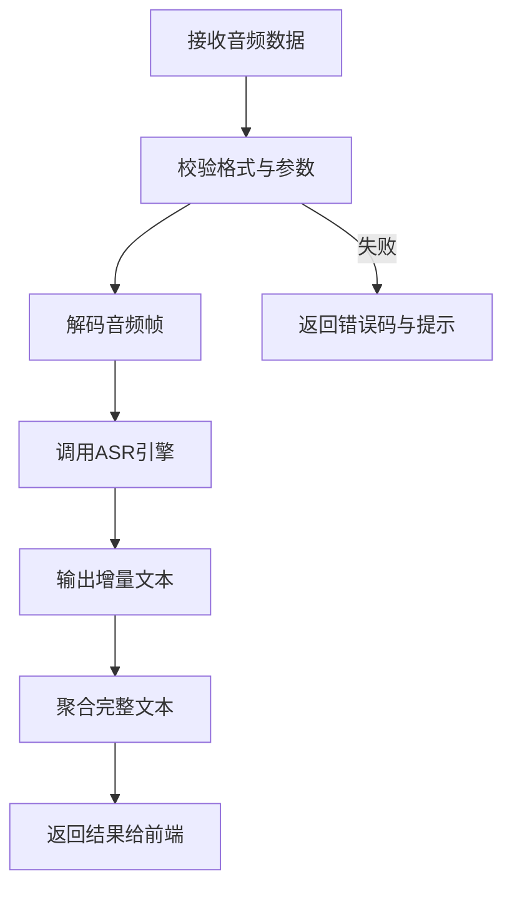
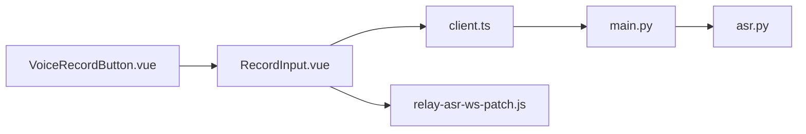

# 语音记录功能

<cite>
**本文引用的文件**   
- [VoiceRecordButton.vue](file://frontend/src/components/VoiceRecordButton.vue)
- [RecordInput.vue](file://frontend/src/components/RecordInput.vue)
- [relay-asr-ws-patch.js](file://data/relay-asr-ws-patch.js)
- [asr.py](file://backend/routers/asr.py)
- [main.py](file://backend/main.py)
- [client.ts](file://frontend/src/api/client.ts)
</cite>

## 目录
1. [简介](#简介)
2. [项目结构](#项目结构)
3. [核心组件](#核心组件)
4. [架构总览](#架构总览)
5. [详细组件分析](#详细组件分析)
6. [依赖关系分析](#依赖关系分析)
7. [性能考虑](#性能考虑)
8. [故障排查指南](#故障排查指南)
9. [结论](#结论)
10. [附录](#附录)

## 简介
本指南面向需要在前端集成“语音记录”功能的开发者与产品人员，围绕以下目标展开：
- 语音输入组件的使用方法（VoiceRecordButton、RecordInput）
- 实时录音与音频流处理流程
- ASR（自动语音识别）集成方式与WebSocket连接处理
- 音频格式支持与兼容性策略
- 语音转文本的技术实现路径
- 错误处理机制与常见问题的解决方案
- 性能优化策略与最佳实践

## 项目结构
与语音记录相关的前后端代码分布如下：
- 前端组件
  - VoiceRecordButton.vue：提供一键录音按钮与状态管理
  - RecordInput.vue：封装录音输入框、播放控制与结果展示
  - client.ts：API客户端，负责与后端通信（含可能的WebSocket封装）
- 数据层补丁
  - relay-asr-ws-patch.js：用于ASR WebSocket流的转发或适配
- 后端服务
  - asr.py：ASR路由，处理音频上传/流式识别请求
  - main.py：应用入口，挂载路由与中间件

**图表来源** 
- [VoiceRecordButton.vue](file://frontend/src/components/VoiceRecordButton.vue)
- [RecordInput.vue](file://frontend/src/components/RecordInput.vue)
- [relay-asr-ws-patch.js](file://data/relay-asr-ws-patch.js)
- [asr.py](file://backend/routers/asr.py)
- [main.py](file://backend/main.py)
- [client.ts](file://frontend/src/api/client.ts)

**章节来源**
- [VoiceRecordButton.vue](file://frontend/src/components/VoiceRecordButton.vue)
- [RecordInput.vue](file://frontend/src/components/RecordInput.vue)
- [relay-asr-ws-patch.js](file://data/relay-asr-ws-patch.js)
- [asr.py](file://backend/routers/asr.py)
- [main.py](file://backend/main.py)
- [client.ts](file://frontend/src/api/client.ts)

## 核心组件
- VoiceRecordButton
  - 职责：触发录音、显示录音状态（准备中/录音中/停止）、错误提示
  - 关键能力：权限检查、媒体设备访问、与RecordInput联动
- RecordInput
  - 职责：录制音频片段、实时流式传输（可选）、播放回放、显示识别结果
  - 关键能力：MediaRecorder控制、分片上传/流式发送、结果渲染与重试

**章节来源**
- [VoiceRecordButton.vue](file://frontend/src/components/VoiceRecordButton.vue)
- [RecordInput.vue](file://frontend/src/components/RecordInput.vue)

## 架构总览
语音记录的端到端流程如下：
- 用户点击录音按钮，前端申请麦克风权限并初始化录音
- 通过RecordInput进行音频采集，按帧或时间片切分音频数据
- 使用WebSocket将音频片段发送至后端ASR服务（或通过HTTP分块上传）
- 后端接收音频片段，调用ASR引擎进行识别，返回增量文本
- 前端聚合识别结果并展示，支持编辑与提交

**图表来源** 
- [VoiceRecordButton.vue](file://frontend/src/components/VoiceRecordButton.vue)
- [RecordInput.vue](file://frontend/src/components/RecordInput.vue)
- [client.ts](file://frontend/src/api/client.ts)
- [relay-asr-ws-patch.js](file://data/relay-asr-ws-patch.js)
- [main.py](file://backend/main.py)
- [asr.py](file://backend/routers/asr.py)

## 详细组件分析

### VoiceRecordButton 组件
- 配置项建议
  - 是否启用实时识别（默认开启）
  - 录音时长限制与静音检测阈值
  - 错误提示文案与重试策略
- 交互流程
  - 首次点击：检查浏览器权限，若未授权则引导用户授权
  - 录音中：禁用重复点击，显示计时器与波形反馈
  - 结束录音：释放资源，通知RecordInput完成一次录制
- 错误处理
  - 权限拒绝：提示用户手动开启麦克风权限
  - 设备不可用：提示切换设备或刷新页面重试
  - 网络异常：降级为本地缓存或离线模式

**图表来源** 
- [VoiceRecordButton.vue](file://frontend/src/components/VoiceRecordButton.vue)

**章节来源**
- [VoiceRecordButton.vue](file://frontend/src/components/VoiceRecordButton.vue)

### RecordInput 组件
- 功能要点
  - 音频采集：基于MediaRecorder或Web Audio API
  - 流式传输：按帧或时间片发送音频数据至后端
  - 结果展示：增量文本拼接、光标定位、编辑与撤销
  - 播放回放：生成Blob URL进行本地播放
- 配置项建议
  - 采样率与编码格式（如PCM、Opus、AAC）
  - 分片大小与超时重连策略
  - 识别语言与热词配置
- 错误处理
  - 断线重连：指数退避与队列缓冲
  - 解码失败：回退到备用编码器或提示用户
  - 识别超时：提示网络问题或切换轻量模型

**图表来源** 
- [RecordInput.vue](file://frontend/src/components/RecordInput.vue)
- [client.ts](file://frontend/src/api/client.ts)

**章节来源**
- [RecordInput.vue](file://frontend/src/components/RecordInput.vue)
- [client.ts](file://frontend/src/api/client.ts)

### WebSocket 连接处理（relay-asr-ws-patch.js）
- 作用
  - 对原生WebSocket进行补丁，适配特定ASR协议的帧格式
  - 处理心跳、保活、断线重连与消息序列化
- 关键点
  - 帧打包：将音频片段封装为二进制或Base64载荷
  - 协议适配：根据后端期望的头部字段与分隔符调整
  - 错误恢复：捕获异常并触发重连逻辑

**图表来源** 
- [RecordInput.vue](file://frontend/src/components/RecordInput.vue)
- [relay-asr-ws-patch.js](file://data/relay-asr-ws-patch.js)

**章节来源**
- [relay-asr-ws-patch.js](file://data/relay-asr-ws-patch.js)

### 后端 ASR 路由（asr.py）
- 职责
  - 接收前端音频流或分块上传
  - 调用ASR引擎进行识别，返回增量文本
  - 处理鉴权、限流与日志记录
- 关键点
  - 流式处理：边收边识，降低延迟
  - 格式兼容：支持多种音频编码与采样率
  - 错误码规范：区分网络、解码、引擎错误

**图表来源** 
- [asr.py](file://backend/routers/asr.py)

**章节来源**
- [asr.py](file://backend/routers/asr.py)

### 应用入口（main.py）
- 职责
  - 挂载路由（包括ASR路由）
  - 配置中间件（CORS、认证、日志）
  - 启动服务与监听端口
- 关键点
  - 路由注册顺序影响请求分发
  - 环境变量注入（如ASR服务地址、密钥）

**章节来源**
- [main.py](file://backend/main.py)

### API 客户端（client.ts）
- 职责
  - 封装HTTP与WebSocket调用
  - 统一错误处理与重试策略
  - 提供类型定义与接口契约
- 关键点
  - 连接池与并发控制
  - 拦截器用于添加请求头与响应解析

**章节来源**
- [client.ts](file://frontend/src/api/client.ts)

## 依赖关系分析
- 前端组件依赖
  - VoiceRecordButton 依赖 RecordInput 的录音能力
  - RecordInput 依赖 client.ts 的网络抽象与 relay-asr-ws-patch.js 的协议适配
- 后端服务依赖
  - main.py 挂载 asr.py 的路由
  - asr.py 依赖外部ASR引擎（可能通过SDK或HTTP调用）

**图表来源** 
- [VoiceRecordButton.vue](file://frontend/src/components/VoiceRecordButton.vue)
- [RecordInput.vue](file://frontend/src/components/RecordInput.vue)
- [client.ts](file://frontend/src/api/client.ts)
- [relay-asr-ws-patch.js](file://data/relay-asr-ws-patch.js)
- [main.py](file://backend/main.py)
- [asr.py](file://backend/routers/asr.py)

**章节来源**
- [VoiceRecordButton.vue](file://frontend/src/components/VoiceRecordButton.vue)
- [RecordInput.vue](file://frontend/src/components/RecordInput.vue)
- [client.ts](file://frontend/src/api/client.ts)
- [relay-asr-ws-patch.js](file://data/relay-asr-ws-patch.js)
- [main.py](file://backend/main.py)
- [asr.py](file://backend/routers/asr.py)

## 性能考虑
- 前端优化
  - 使用合适的采样率与编码格式，平衡音质与带宽
  - 合理设置分片大小，避免过大导致延迟或过小导致开销
  - 启用增量识别，减少首字延迟
  - 本地缓存与离线模式，提升弱网体验
- 后端优化
  - 流式识别，边收边算，降低内存占用
  - 连接池与异步处理，提高并发能力
  - 缓存热点结果，减少重复计算
- 网络优化
  - WebSocket心跳与保活，避免空闲断开
  - 指数退避重连，避免雪崩效应
  - CDN与边缘节点部署，缩短传输距离

[本节为通用指导，不直接分析具体文件]

## 故障排查指南
- 常见问题
  - 无法获取麦克风权限：检查浏览器设置与HTTPS环境
  - 录音无声或杂音：检查设备选择与音量设置
  - 识别结果乱码：检查编码格式与采样率一致性
  - WebSocket频繁断开：检查网络稳定性与服务端负载
  - 识别延迟高：检查分片大小与后端处理能力
- 排查步骤
  - 前端：打开控制台查看错误日志与网络请求
  - 后端：查看ASR服务日志与资源使用情况
  - 网络：使用抓包工具分析帧结构与丢包情况
- 恢复策略
  - 自动重试与降级方案
  - 用户提示与引导
  - 监控告警与容量扩容

**章节来源**
- [client.ts](file://frontend/src/api/client.ts)
- [relay-asr-ws-patch.js](file://data/relay-asr-ws-patch.js)
- [asr.py](file://backend/routers/asr.py)

## 结论
语音记录功能涉及前端录音、网络传输与后端ASR处理的完整链路。通过合理的组件设计、协议适配与性能优化，可以实现低延迟、高可用的语音转文本体验。建议在生产环境中加强监控与容错，确保用户体验稳定可靠。

[本节为总结性内容，不直接分析具体文件]

## 附录
- 最佳实践
  - 始终在HTTPS环境下运行，确保麦克风权限可用
  - 提供清晰的错误提示与用户引导
  - 针对不同设备与浏览器进行兼容性测试
  - 定期评估ASR引擎效果与成本
- 参考实现
  - 前端组件：VoiceRecordButton.vue、RecordInput.vue
  - 协议适配：relay-asr-ws-patch.js
  - 后端路由：asr.py
  - 应用入口：main.py
  - API客户端：client.ts

[本节为补充信息，不直接分析具体文件]