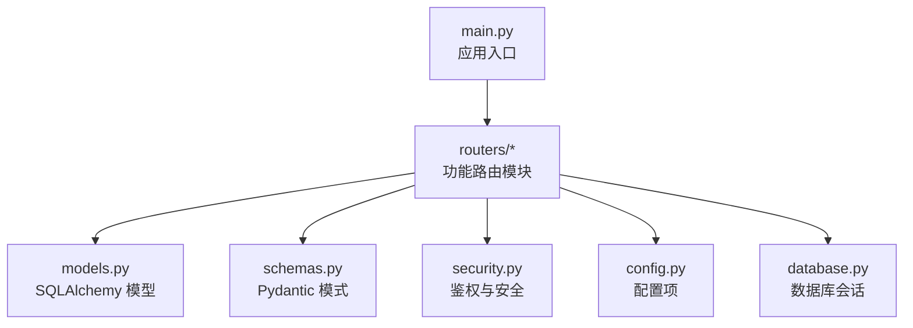
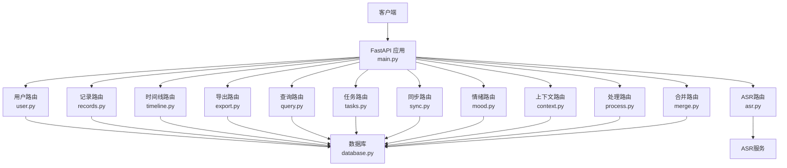
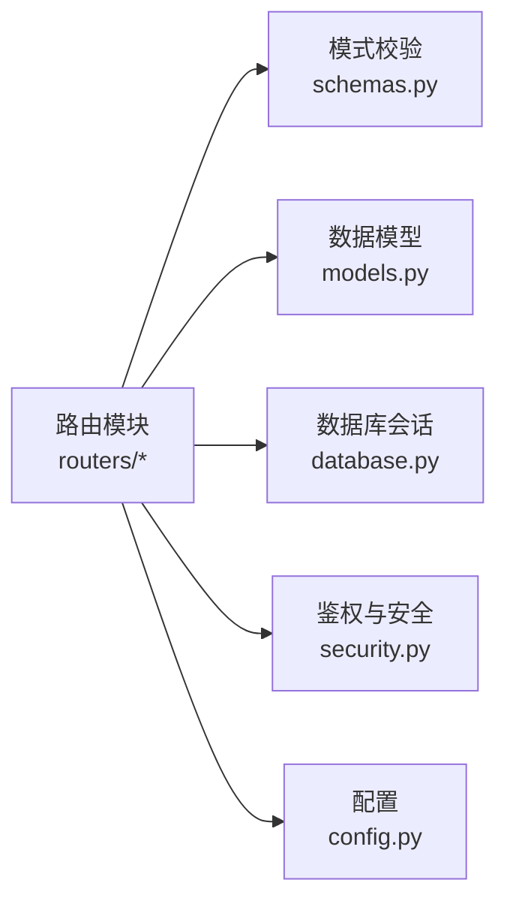

# API路由模块

<cite>
**本文档引用的文件**   
- [backend/main.py](file://backend/main.py)
- [backend/routers/user.py](file://backend/routers/user.py)
- [backend/routers/records.py](file://backend/routers/records.py)
- [backend/routers/timeline.py](file://backend/routers/timeline.py)
- [backend/routers/export.py](file://backend/routers/export.py)
- [backend/routers/query.py](file://backend/routers/query.py)
- [backend/routers/tasks.py](file://backend/routers/tasks.py)
- [backend/routers/sync.py](file://backend/routers/sync.py)
- [backend/routers/asr.py](file://backend/routers/asr.py)
- [backend/routers/mood.py](file://backend/routers/mood.py)
- [backend/routers/context.py](file://backend/routers/context.py)
- [backend/routers/process.py](file://backend/routers/process.py)
- [backend/routers/merge.py](file://backend/routers/merge.py)
- [backend/models.py](file://backend/models.py)
- [backend/schemas.py](file://backend/schemas.py)
- [backend/security.py](file://backend/security.py)
- [backend/config.py](file://backend/config.py)
- [backend/database.py](file://backend/database.py)
</cite>

## 目录
1. [简介](#简介)
2. [项目结构](#项目结构)
3. [核心组件](#核心组件)
4. [架构总览](#架构总览)
5. [详细组件分析](#详细组件分析)
6. [依赖关系分析](#依赖关系分析)
7. [性能考虑](#性能考虑)
8. [故障排查指南](#故障排查指南)
9. [结论](#结论)
10. [附录](#附录)

## 简介
本文件为 AdventureX 后端 API 路由模块的全面技术文档，覆盖 RESTful 端点设计、请求参数与响应格式、错误码与权限验证、调用示例与最佳实践。功能范围包括用户管理、记录处理、时间线管理、导出、查询、任务调度、数据同步、音频处理、ASR 语音识别、情绪分析与上下文管理等。

## 项目结构
后端采用 FastAPI 框架，路由按功能拆分至 backend/routers 下的独立模块；模型与 Pydantic 模式分别位于 models.py 与 schemas.py；安全与配置在 security.py 与 config.py；数据库连接在 database.py；应用入口在 main.py。

图表来源
- [backend/main.py](file://backend/main.py)
- [backend/routers/user.py](file://backend/routers/user.py)
- [backend/routers/records.py](file://backend/routers/records.py)
- [backend/routers/timeline.py](file://backend/routers/timeline.py)
- [backend/routers/export.py](file://backend/routers/export.py)
- [backend/routers/query.py](file://backend/routers/query.py)
- [backend/routers/tasks.py](file://backend/routers/tasks.py)
- [backend/routers/sync.py](file://backend/routers/sync.py)
- [backend/routers/asr.py](file://backend/routers/asr.py)
- [backend/routers/mood.py](file://backend/routers/mood.py)
- [backend/routers/context.py](file://backend/routers/context.py)
- [backend/routers/process.py](file://backend/routers/process.py)
- [backend/routers/merge.py](file://backend/routers/merge.py)
- [backend/models.py](file://backend/models.py)
- [backend/schemas.py](file://backend/schemas.py)
- [backend/security.py](file://backend/security.py)
- [backend/config.py](file://backend/config.py)
- [backend/database.py](file://backend/database.py)

章节来源
- [backend/main.py](file://backend/main.py)
- [backend/config.py](file://backend/config.py)

## 核心组件
- 路由层：按业务域拆分的 FastAPI Router，定义 HTTP 端点、路径参数、查询参数、请求体与响应模型。
- 模型与模式：SQLAlchemy 模型描述持久化结构；Pydantic 模式用于请求/响应校验与序列化。
- 安全与鉴权：基于令牌或会话的认证与授权中间件，保护敏感接口。
- 数据库访问：统一会话管理与事务封装，确保一致性。
- 配置：集中化管理环境变量与运行时配置。

章节来源
- [backend/models.py](file://backend/models.py)
- [backend/schemas.py](file://backend/schemas.py)
- [backend/security.py](file://backend/security.py)
- [backend/database.py](file://backend/database.py)
- [backend/config.py](file://backend/config.py)

## 架构总览
下图展示从客户端到各路由模块及底层服务的调用关系。

图表来源
- [backend/main.py](file://backend/main.py)
- [backend/routers/user.py](file://backend/routers/user.py)
- [backend/routers/records.py](file://backend/routers/records.py)
- [backend/routers/timeline.py](file://backend/routers/timeline.py)
- [backend/routers/export.py](file://backend/routers/export.py)
- [backend/routers/query.py](file://backend/routers/query.py)
- [backend/routers/tasks.py](file://backend/routers/tasks.py)
- [backend/routers/sync.py](file://backend/routers/sync.py)
- [backend/routers/asr.py](file://backend/routers/asr.py)
- [backend/routers/mood.py](file://backend/routers/mood.py)
- [backend/routers/context.py](file://backend/routers/context.py)
- [backend/routers/process.py](file://backend/routers/process.py)
- [backend/routers/merge.py](file://backend/routers/merge.py)
- [backend/database.py](file://backend/database.py)

## 详细组件分析

### 用户管理（user.py）
- 典型端点
  - 注册/登录：创建用户、签发令牌、刷新令牌
  - 个人资料：获取/更新当前用户信息
  - 密码管理：修改密码、重置密码
- 权限
  - 注册/登录：公开
  - 其他操作：需有效令牌或会话
- 请求参数
  - 注册/登录：用户名、邮箱、密码等
  - 个人资料：字段增量更新
  - 密码：旧密码与新密码
- 响应格式
  - 成功：用户对象或令牌
  - 失败：标准错误结构（含错误码与消息）
- 错误码
  - 400：参数校验失败
  - 401：未认证或令牌无效
  - 409：资源冲突（如重复邮箱）
  - 500：服务器内部错误
- 调用示例
  - POST /api/users/register {username, email, password}
  - POST /api/users/login {email, password}
  - GET /api/users/me
  - PUT /api/users/me/password {old_password, new_password}

章节来源
- [backend/routers/user.py](file://backend/routers/user.py)
- [backend/schemas.py](file://backend/schemas.py)
- [backend/security.py](file://backend/security.py)

### 记录处理（records.py）
- 典型端点
  - 创建记录：新增文本/音频关联记录
  - 批量导入：上传 CSV/JSON 批量写入
  - 更新/删除：按 ID 修改或删除
  - 列表查询：分页、过滤、排序
- 权限
  - 读：公开或受限（依配置）
  - 写：需认证
- 请求参数
  - 创建：标题、内容、标签、时间戳、音频ID等
  - 批量：数组形式的记录对象
  - 查询：page、size、keyword、date_range、tag
- 响应格式
  - 单条：记录对象
  - 列表：{items, total, page, size}
- 错误码
  - 400：参数校验失败
  - 404：记录不存在
  - 409：冲突（如唯一约束）
  - 500：服务器错误
- 调用示例
  - POST /api/records {title, content, tags, timestamp}
  - POST /api/records/batch [{...}, {...}]
  - GET /api/records?page=1&size=20&keyword=关键词

章节来源
- [backend/routers/records.py](file://backend/routers/records.py)
- [backend/schemas.py](file://backend/schemas.py)
- [backend/models.py](file://backend/models.py)

### 时间线管理（timeline.py）
- 典型端点
  - 获取时间线：按日期聚合记录
  - 事件增删改：添加/编辑/删除时间线事件
  - 视图切换：日/周/月视图
- 权限
  - 读：公开或受限
  - 写：需认证
- 请求参数
  - 查询：start_date、end_date、view_type
  - 事件：event_type、content、timestamp
- 响应格式
  - 时间线：按天/周/月的条目数组
  - 事件：事件对象
- 错误码
  - 400：参数非法
  - 404：事件不存在
  - 500：服务器错误
- 调用示例
  - GET /api/timeline?start_date=YYYY-MM-DD&end_date=YYYY-MM-DD&view_type=day

章节来源
- [backend/routers/timeline.py](file://backend/routers/timeline.py)
- [backend/schemas.py](file://backend/schemas.py)

### 导出功能（export.py）
- 典型端点
  - 导出记录：CSV/JSON/PDF
  - 导出时间线：结构化快照
  - 异步导出：生成任务并下载链接
- 权限
  - 需认证
- 请求参数
  - 导出类型、时间范围、筛选条件
- 响应格式
  - 同步：二进制流或 JSON
  - 异步：任务ID与状态查询
- 错误码
  - 400：参数非法
  - 401：未认证
  - 500：服务器错误
- 调用示例
  - GET /api/export/records?format=csv&start_date=...&end_date=...
  - POST /api/export/async {format, filters}

章节来源
- [backend/routers/export.py](file://backend/routers/export.py)
- [backend/schemas.py](file://backend/schemas.py)

### 查询接口（query.py）
- 典型端点
  - 全文检索：关键词匹配
  - 高级查询：多字段组合、模糊匹配
  - 统计摘要：计数、分布
- 权限
  - 读：公开或受限
- 请求参数
  - q、filters、aggregations、limit
- 响应格式
  - 结果集与可选聚合统计
- 错误码
  - 400：参数非法
  - 500：服务器错误
- 调用示例
  - GET /api/query?q=关键词&filters={tags:[]}

章节来源
- [backend/routers/query.py](file://backend/routers/query.py)
- [backend/schemas.py](file://backend/schemas.py)

### 任务调度（tasks.py）
- 典型端点
  - 创建任务：后台作业（导出、清洗、索引）
  - 查询任务：状态、进度、结果
  - 取消任务：终止运行中任务
- 权限
  - 写：需认证
  - 读：按角色控制
- 请求参数
  - 任务类型、参数、优先级
- 响应格式
  - 任务对象：id、status、progress、result_url
- 错误码
  - 400：参数非法
  - 404：任务不存在
  - 500：服务器错误
- 调用示例
  - POST /api/tasks {type, params}
  - GET /api/tasks/{task_id}

章节来源
- [backend/routers/tasks.py](file://backend/routers/tasks.py)
- [backend/schemas.py](file://backend/schemas.py)

### 数据同步（sync.py）
- 典型端点
  - 拉取远端数据：增量/全量
  - 推送本地变更：冲突解决策略
  - 同步状态：差异报告
- 权限
  - 需认证
- 请求参数
  - 源/目标标识、策略、过滤条件
- 响应格式
  - 同步结果：新增/更新/删除计数、错误列表
- 错误码
  - 400：参数非法
  - 409：冲突
  - 500：服务器错误
- 调用示例
  - POST /api/sync/pull {source, strategy}
  - POST /api/sync/push {target, conflict_resolution}

章节来源
- [backend/routers/sync.py](file://backend/routers/sync.py)
- [backend/schemas.py](file://backend/schemas.py)

### 音频处理（process.py）
- 典型端点
  - 上传音频：分片/直传
  - 转码/降噪：格式转换、质量优化
  - 元数据提取：时长、采样率、声道
- 权限
  - 写：需认证
- 请求参数
  - 音频文件、处理选项
- 响应格式
  - 处理任务ID与结果URL
- 错误码
  - 400：参数非法
  - 413：文件过大
  - 500：服务器错误
- 调用示例
  - POST /api/process/audio/upload {file, options}

章节来源
- [backend/routers/process.py](file://backend/routers/process.py)
- [backend/schemas.py](file://backend/schemas.py)

### ASR 语音识别（asr.py）
- 典型端点
  - 提交音频：识别请求
  - 查询结果：识别文本、置信度、分段
  - 批量识别：队列处理
- 权限
  - 写：需认证
- 请求参数
  - 音频文件、语言、模型版本
- 响应格式
  - 识别结果：文本、segments、confidence
- 错误码
  - 400：参数非法
  - 413：文件过大
  - 500：服务器错误
- 调用示例
  - POST /api/asr/transcribe {audio_file, language}
  - GET /api/asr/results/{job_id}

章节来源
- [backend/routers/asr.py](file://backend/routers/asr.py)
- [backend/schemas.py](file://backend/schemas.py)

### 情绪分析（mood.py）
- 典型端点
  - 分析文本：情感极性、强度、维度
  - 批量分析：多段文本
  - 历史趋势：时间序列情绪
- 权限
  - 读：公开或受限
  - 写：需认证
- 请求参数
  - 文本、分析维度、时间范围
- 响应格式
  - 情绪分数、分类、解释
- 错误码
  - 400：参数非法
  - 500：服务器错误
- 调用示例
  - POST /api/mood/analyze {texts: [...]}
  - GET /api/mood/trend?start_date=...&end_date=...

章节来源
- [backend/routers/mood.py](file://backend/routers/mood.py)
- [backend/schemas.py](file://backend/schemas.py)

### 上下文管理（context.py）
- 典型端点
  - 上下文CRUD：创建、读取、更新、删除
  - 关联记录：将上下文绑定到记录
  - 检索上下文：按实体/主题检索
- 权限
  - 写：需认证
- 请求参数
  - 上下文键值对、实体ID、标签
- 响应格式
  - 上下文对象、关联关系
- 错误码
  - 400：参数非法
  - 404：上下文不存在
  - 500：服务器错误
- 调用示例
  - POST /api/context {entity_id, key, value, tags}
  - GET /api/context?entity_id=...

章节来源
- [backend/routers/context.py](file://backend/routers/context.py)
- [backend/schemas.py](file://backend/schemas.py)

### 合并与处理（merge.py, process.py）
- 合并策略
  - 去重：基于关键字段合并
  - 冲突解决：优先最新、自定义规则
- 处理流水线
  - 清洗、标准化、特征提取
- 权限
  - 写：需认证
- 请求参数
  - 输入集合、策略、输出格式
- 响应格式
  - 合并结果、统计信息
- 错误码
  - 400：参数非法
  - 500：服务器错误
- 调用示例
  - POST /api/merge/deduplicate {inputs, strategy}

章节来源
- [backend/routers/merge.py](file://backend/routers/merge.py)
- [backend/routers/process.py](file://backend/routers/process.py)
- [backend/schemas.py](file://backend/schemas.py)

## 依赖关系分析
- 路由层依赖 schemas.py 进行请求/响应校验
- 路由层通过 database.py 获取会话访问 models.py 定义的表结构
- 安全模块 security.py 提供鉴权装饰器/中间件
- 配置模块 config.py 提供运行时参数（如数据库连接、第三方服务密钥）

图表来源
- [backend/routers/user.py](file://backend/routers/user.py)
- [backend/routers/records.py](file://backend/routers/records.py)
- [backend/routers/timeline.py](file://backend/routers/timeline.py)
- [backend/routers/export.py](file://backend/routers/export.py)
- [backend/routers/query.py](file://backend/routers/query.py)
- [backend/routers/tasks.py](file://backend/routers/tasks.py)
- [backend/routers/sync.py](file://backend/routers/sync.py)
- [backend/routers/asr.py](file://backend/routers/asr.py)
- [backend/routers/mood.py](file://backend/routers/mood.py)
- [backend/routers/context.py](file://backend/routers/context.py)
- [backend/routers/process.py](file://backend/routers/process.py)
- [backend/routers/merge.py](file://backend/routers/merge.py)
- [backend/schemas.py](file://backend/schemas.py)
- [backend/models.py](file://backend/models.py)
- [backend/database.py](file://backend/database.py)
- [backend/security.py](file://backend/security.py)
- [backend/config.py](file://backend/config.py)

章节来源
- [backend/schemas.py](file://backend/schemas.py)
- [backend/models.py](file://backend/models.py)
- [backend/database.py](file://backend/database.py)
- [backend/security.py](file://backend/security.py)
- [backend/config.py](file://backend/config.py)

## 性能考虑
- 分页与限流：列表接口默认分页，避免大结果集；必要时启用速率限制。
- 异步任务：导出、ASR、批量处理使用任务队列，减少阻塞。
- 缓存热点：查询与统计结果可缓存，降低数据库压力。
- 文件上传：支持分片与断点续传，限制文件大小与类型。
- 数据库索引：对常用查询字段建立索引，提升检索性能。

[本节为通用指导，不直接分析具体文件]

## 故障排查指南
- 常见错误码
  - 400：参数校验失败，检查请求体结构与必填字段
  - 401：未认证或令牌过期，确认令牌有效性
  - 404：资源不存在，核对ID与路径
  - 409：冲突，检查唯一约束与并发更新
  - 413：文件过大，调整上传限制
  - 500：服务器错误，查看日志与依赖服务状态
- 调试建议
  - 开启详细日志，定位异常堆栈
  - 使用健康检查端点确认服务状态
  - 隔离问题模块，逐步缩小范围

章节来源
- [backend/security.py](file://backend/security.py)
- [backend/config.py](file://backend/config.py)

## 结论
AdventureX 的 API 路由模块以清晰的分层与模块化设计，覆盖了用户、记录、时间线、导出、查询、任务、同步、音频、ASR、情绪与上下文等核心能力。通过严格的模式校验、统一的错误处理与安全的鉴权机制，提供了稳定可扩展的接口体系。遵循本文的最佳实践与排障指南，可有效提升集成效率与系统稳定性。

## 附录
- 通用响应结构
  - 成功：{code, message, data}
  - 失败：{code, message, errors}
- 通用错误码
  - 200：成功
  - 400：参数错误
  - 401：未认证
  - 403：权限不足
  - 404：资源不存在
  - 409：冲突
  - 413：文件过大
  - 500：服务器错误

[本节为通用说明，不直接分析具体文件]