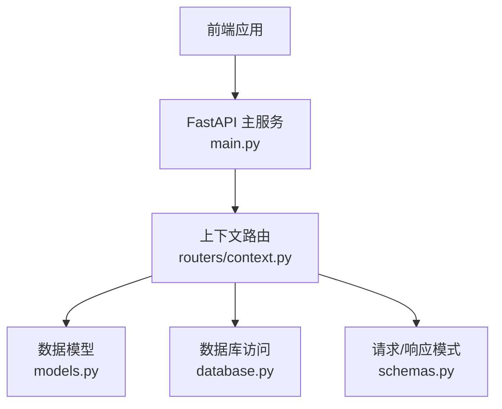
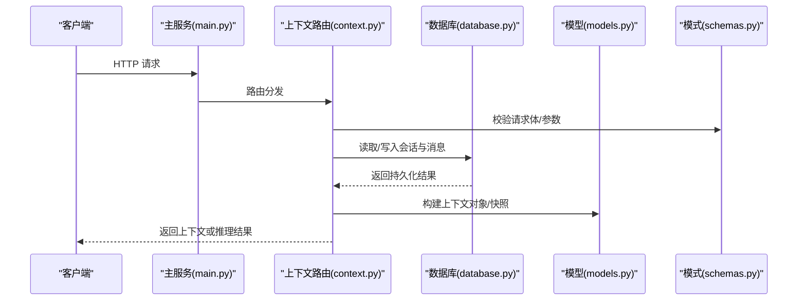
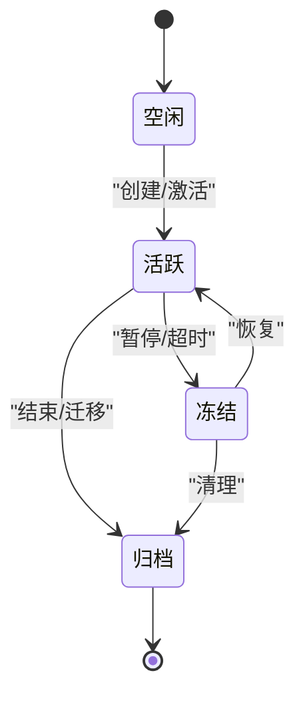
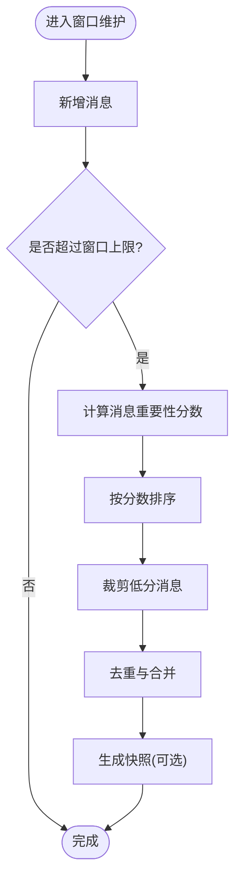
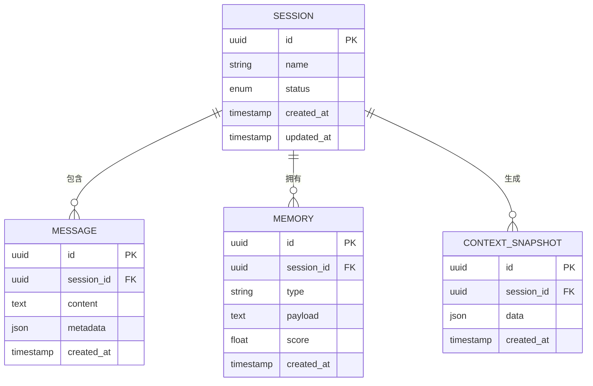
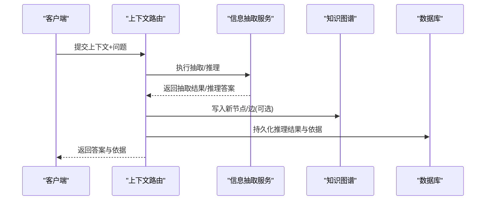
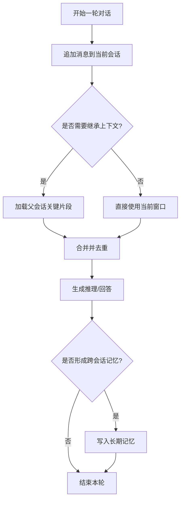
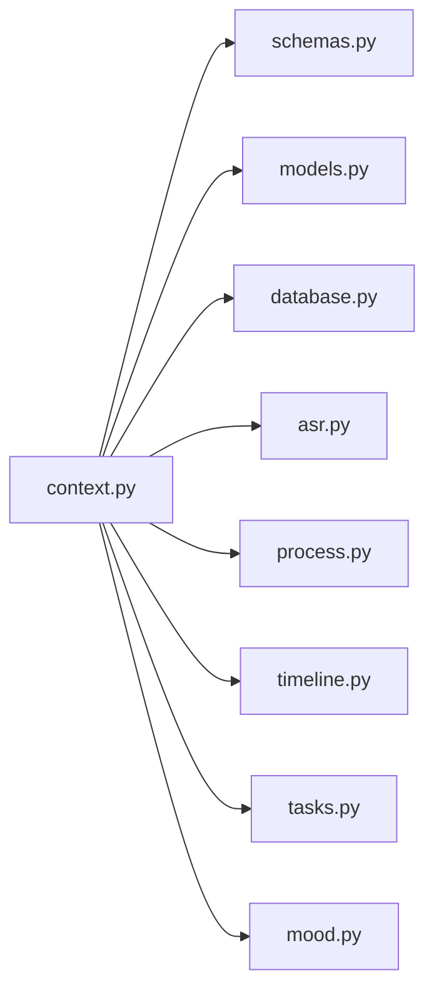

# 上下文管理路由

<cite>
**本文引用的文件**   
- [backend/routers/context.py](file://backend/routers/context.py)
- [backend/main.py](file://backend/main.py)
- [backend/models.py](file://backend/models.py)
- [backend/database.py](file://backend/database.py)
- [backend/schemas.py](file://backend/schemas.py)
</cite>

## 目录
1. [简介](#简介)
2. [项目结构](#项目结构)
3. [核心组件](#核心组件)
4. [架构总览](#架构总览)
5. [详细组件分析](#详细组件分析)
6. [依赖关系分析](#依赖关系分析)
7. [性能考量](#性能考量)
8. [故障排查指南](#故障排查指南)
9. [结论](#结论)
10. [附录：API参考与示例](#附录api参考与示例)

## 简介
本文件面向“上下文管理”相关API路由，系统性阐述对话上下文维护、状态管理、记忆存储与上下文推理等核心能力。内容覆盖会话生命周期管理、上下文窗口控制、信息抽取与知识图谱集成路径，并提供多轮对话、上下文继承与跨会话记忆等高级特性的操作示例与最佳实践。

## 项目结构
后端采用模块化路由设计，上下文管理功能集中在路由层，并通过数据模型与数据库访问层进行持久化与查询。前端通过HTTP接口与后端交互，实现对话界面与上下文可视化。

**图表来源** 
- [backend/main.py](file://backend/main.py)
- [backend/routers/context.py](file://backend/routers/context.py)
- [backend/models.py](file://backend/models.py)
- [backend/database.py](file://backend/database.py)
- [backend/schemas.py](file://backend/schemas.py)

**章节来源**
- [backend/main.py](file://backend/main.py)
- [backend/routers/context.py](file://backend/routers/context.py)

## 核心组件
- 上下文路由（Context Router）
  - 负责会话创建、切换、销毁；消息追加与裁剪；上下文快照与恢复；上下文推理入口；与外部服务（如ASR、处理管道、时间线、任务、情绪等）的协作点。
- 数据模型（Models）
  - 定义会话、消息、上下文片段、记忆条目、图谱节点/边等实体结构与约束。
- 数据库访问（Database）
  - 提供连接管理、事务、CRUD封装、分页与聚合查询。
- 模式定义（Schemas）
  - 统一请求体与响应体的字段校验与序列化。

**章节来源**
- [backend/routers/context.py](file://backend/routers/context.py)
- [backend/models.py](file://backend/models.py)
- [backend/database.py](file://backend/database.py)
- [backend/schemas.py](file://backend/schemas.py)

## 架构总览
上下文管理的整体流程围绕“会话—消息—上下文—推理”展开。用户发起请求后，路由层解析参数并调用领域逻辑，必要时与外部服务协作，最终将结果返回给前端。

**图表来源** 
- [backend/main.py](file://backend/main.py)
- [backend/routers/context.py](file://backend/routers/context.py)
- [backend/database.py](file://backend/database.py)
- [backend/models.py](file://backend/models.py)
- [backend/schemas.py](file://backend/schemas.py)

## 详细组件分析

### 会话与会话状态管理
- 会话生命周期
  - 创建会话：初始化会话元数据、默认上下文窗口策略、权限与标签。
  - 切换会话：加载目标会话的上下文快照，更新当前上下文指针。
  - 销毁会话：清理会话级缓存与临时记忆，归档必要审计日志。
- 状态机
  - 空闲、活跃、冻结、归档等状态转换，确保并发安全与一致性。

**图表来源** 
- [backend/routers/context.py](file://backend/routers/context.py)
- [backend/models.py](file://backend/models.py)

**章节来源**
- [backend/routers/context.py](file://backend/routers/context.py)
- [backend/models.py](file://backend/models.py)

### 上下文窗口控制
- 窗口策略
  - 固定长度、滑动窗口、重要性评分裁剪、去重与合并。
- 窗口维护
  - 新增消息入窗、过期消息出窗、关键信息保留（如实体、意图、结论）。
- 快照与恢复
  - 定期生成上下文快照，支持快速回滚与版本对比。

**图表来源** 
- [backend/routers/context.py](file://backend/routers/context.py)
- [backend/models.py](file://backend/models.py)

**章节来源**
- [backend/routers/context.py](file://backend/routers/context.py)
- [backend/models.py](file://backend/models.py)

### 记忆存储与检索
- 记忆类型
  - 短期记忆（会话内）、长期记忆（跨会话）、事实记忆（实体/关系）、过程记忆（步骤/决策）。
- 存储策略
  - 结构化存储（关系型表）与非结构化存储（向量/文本）结合，支持语义检索与关键词匹配。
- 检索机制
  - 基于时间衰减、相关性评分与用户偏好的混合检索。

**图表来源** 
- [backend/models.py](file://backend/models.py)
- [backend/database.py](file://backend/database.py)

**章节来源**
- [backend/models.py](file://backend/models.py)
- [backend/database.py](file://backend/database.py)

### 上下文推理与信息抽取
- 推理入口
  - 接收上下文与问题，调用推理服务，返回答案、依据与置信度。
- 信息抽取
  - 从对话中抽取实体、关系、事件与结论，更新知识图谱。
- 图谱集成
  - 将抽取结果以节点/边的形式写入图谱，支持后续推理与查询。

**图表来源** 
- [backend/routers/context.py](file://backend/routers/context.py)
- [backend/models.py](file://backend/models.py)

**章节来源**
- [backend/routers/context.py](file://backend/routers/context.py)
- [backend/models.py](file://backend/models.py)

### 多轮对话、上下文继承与跨会话记忆
- 多轮对话
  - 每轮追加消息到上下文窗口，保持历史连贯性。
- 上下文继承
  - 子会话可继承父会话的关键上下文片段，减少重复输入。
- 跨会话记忆
  - 将重要事实沉淀为长期记忆，供后续会话复用。

**图表来源** 
- [backend/routers/context.py](file://backend/routers/context.py)
- [backend/models.py](file://backend/models.py)

**章节来源**
- [backend/routers/context.py](file://backend/routers/context.py)
- [backend/models.py](file://backend/models.py)

## 依赖关系分析
- 路由依赖
  - context.py 依赖 schemas.py 进行参数校验，依赖 models.py 与 database.py 进行数据存取。
- 服务协作
  - 上下文路由可与 ASR、处理管道、时间线、任务、情绪等路由协作，形成完整的对话闭环。

**图表来源** 
- [backend/routers/context.py](file://backend/routers/context.py)
- [backend/schemas.py](file://backend/schemas.py)
- [backend/models.py](file://backend/models.py)
- [backend/database.py](file://backend/database.py)
- [backend/routers/asr.py](file://backend/routers/asr.py)
- [backend/routers/process.py](file://backend/routers/process.py)
- [backend/routers/timeline.py](file://backend/routers/timeline.py)
- [backend/routers/tasks.py](file://backend/routers/tasks.py)
- [backend/routers/mood.py](file://backend/routers/mood.py)

**章节来源**
- [backend/routers/context.py](file://backend/routers/context.py)

## 性能考量
- 上下文窗口裁剪
  - 使用重要性评分与去重降低冗余，避免窗口膨胀导致推理延迟。
- 快照与增量更新
  - 定期快照减少全量重建成本，增量更新提升写入效率。
- 并发与锁
  - 会话级读写锁保证一致性，避免竞态条件。
- 缓存策略
  - 热点上下文片段与常用推理结果可缓存，缩短响应时间。
- 批处理与异步
  - 批量写入消息与记忆，异步执行耗时抽取任务。

[本节为通用指导，不直接分析具体文件]

## 故障排查指南
- 常见问题
  - 会话状态异常：检查状态机转换与并发锁。
  - 上下文丢失：确认快照生成与恢复逻辑是否正确。
  - 推理失败：核查输入上下文完整性与抽取服务可用性。
  - 图谱不一致：验证节点/边写入事务与幂等性。
- 诊断建议
  - 启用详细日志，记录上下文窗口大小、裁剪比例与推理耗时。
  - 对关键操作添加重试与降级策略。
  - 定期校验数据一致性与索引健康。

**章节来源**
- [backend/routers/context.py](file://backend/routers/context.py)
- [backend/database.py](file://backend/database.py)

## 结论
上下文管理路由通过清晰的会话生命周期、灵活的窗口控制、稳健的记忆存储与高效的推理入口，构建了可扩展的多轮对话基础设施。结合知识图谱与外部服务协作，可实现更智能的信息抽取与推理能力。建议在工程实践中关注并发安全、性能优化与可观测性，持续提升系统稳定性与用户体验。

[本节为总结性内容，不直接分析具体文件]

## 附录：API参考与示例
- 典型端点
  - 创建/切换/销毁会话
  - 追加/裁剪/恢复上下文
  - 生成上下文快照与版本对比
  - 触发上下文推理与信息抽取
  - 写入/查询长期记忆
- 示例场景
  - 多轮对话：逐轮追加消息，维持上下文连贯。
  - 上下文继承：子会话继承父会话关键片段。
  - 跨会话记忆：沉淀事实记忆，供后续会话复用。
- 最佳实践
  - 合理设置窗口大小与裁剪阈值。
  - 使用快照进行版本管理与回滚。
  - 对抽取与推理任务进行异步与重试。
  - 对图谱写入进行事务与幂等保障。

[本节为概念性说明，不直接分析具体文件]