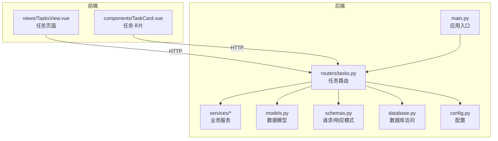
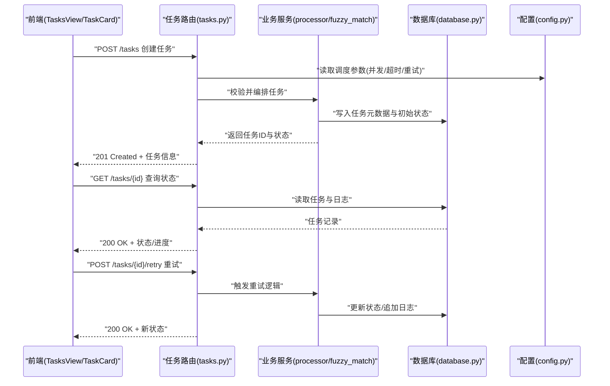
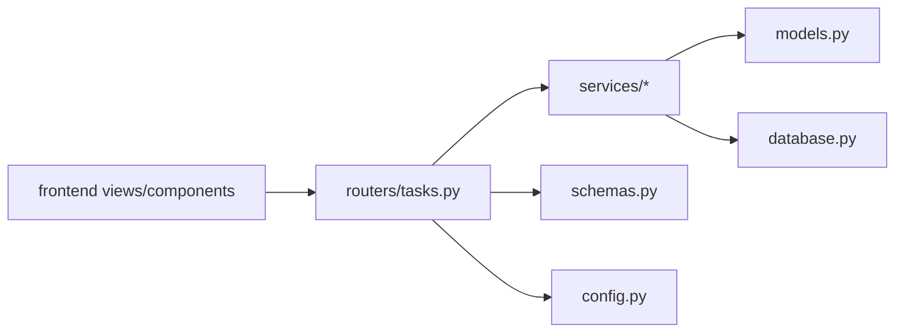

# 任务调度路由

<cite>
**本文引用的文件**   
- [backend/routers/tasks.py](file://backend/routers/tasks.py)
- [backend/main.py](file://backend/main.py)
- [backend/models.py](file://backend/models.py)
- [backend/schemas.py](file://backend/schemas.py)
- [backend/database.py](file://backend/database.py)
- [backend/config.py](file://backend/config.py)
- [frontend/src/views/TasksView.vue](file://frontend/src/views/TasksView.vue)
- [frontend/src/components/TaskCard.vue](file://frontend/src/components/TaskCard.vue)
</cite>

## 目录
1. [简介](#简介)
2. [项目结构](#项目结构)
3. [核心组件](#核心组件)
4. [架构总览](#架构总览)
5. [详细组件分析](#详细组件分析)
6. [依赖分析](#依赖分析)
7. [性能考虑](#性能考虑)
8. [故障排查指南](#故障排查指南)
9. [结论](#结论)
10. [附录](#附录)

## 简介
本文件面向“任务调度API路由”的完整文档，围绕异步任务管理、任务队列、优先级调度与执行监控等核心能力展开。内容覆盖任务创建、状态跟踪、重试机制、错误处理与资源管理等技术细节，并提供定时任务、批量任务与分布式任务调度的实践示例与最佳实践建议。读者无需深入源码即可理解系统如何组织任务生命周期与扩展点。

## 项目结构
后端采用模块化路由与服务分离的设计：
- 路由层：按功能划分，如 asr、export、merge、mood、process、query、records、sync、tasks、timeline、user 等。
- 服务层：封装业务逻辑（如 fuzzy_match、processor）。
- 数据模型与请求响应模式：通过 models.py 与 schemas.py 定义。
- 应用入口与中间件：main.py 负责注册路由、挂载中间件与全局配置。
- 数据库与配置：database.py 提供连接与会话管理；config.py 集中环境变量与运行时配置。

前端侧包含任务视图与卡片组件，用于展示任务列表、状态与操作。

图表来源
- [backend/main.py](file://backend/main.py)
- [backend/routers/tasks.py](file://backend/routers/tasks.py)
- [backend/services/processor.py](file://backend/services/processor.py)
- [backend/models.py](file://backend/models.py)
- [backend/schemas.py](file://backend/schemas.py)
- [backend/database.py](file://backend/database.py)
- [backend/config.py](file://backend/config.py)
- [frontend/src/views/TasksView.vue](file://frontend/src/views/TasksView.vue)
- [frontend/src/components/TaskCard.vue](file://frontend/src/components/TaskCard.vue)

章节来源
- [backend/main.py](file://backend/main.py)
- [backend/routers/tasks.py](file://backend/routers/tasks.py)
- [backend/models.py](file://backend/models.py)
- [backend/schemas.py](file://backend/schemas.py)
- [backend/database.py](file://backend/database.py)
- [backend/config.py](file://backend/config.py)
- [frontend/src/views/TasksView.vue](file://frontend/src/views/TasksView.vue)
- [frontend/src/components/TaskCard.vue](file://frontend/src/components/TaskCard.vue)

## 核心组件
- 任务路由模块：提供任务的创建、查询、更新、删除、重试、取消、批量操作与监控接口。
- 任务模型与模式：定义任务实体字段、状态枚举、优先级、调度策略与校验规则。
- 数据库访问：持久化任务元数据、执行日志与结果。
- 配置中心：控制并发度、队列大小、超时、重试策略、延迟与批大小等运行参数。
- 前端任务视图：渲染任务列表、状态标签、进度条与操作按钮，支持刷新与筛选。

章节来源
- [backend/routers/tasks.py](file://backend/routers/tasks.py)
- [backend/models.py](file://backend/models.py)
- [backend/schemas.py](file://backend/schemas.py)
- [backend/database.py](file://backend/database.py)
- [backend/config.py](file://backend/config.py)
- [frontend/src/views/TasksView.vue](file://frontend/src/views/TasksView.vue)
- [frontend/src/components/TaskCard.vue](file://frontend/src/components/TaskCard.vue)

## 架构总览
任务调度系统由“API 路由 → 业务服务 → 数据持久化 → 外部执行器/队列”组成。路由层暴露 RESTful 接口，服务层编排任务生命周期，数据库层存储任务与日志，配置层驱动调度行为。前端通过 HTTP 调用路由，实现可视化监控与管理。

图表来源
- [backend/routers/tasks.py](file://backend/routers/tasks.py)
- [backend/services/processor.py](file://backend/services/processor.py)
- [backend/database.py](file://backend/database.py)
- [backend/config.py](file://backend/config.py)
- [frontend/src/views/TasksView.vue](file://frontend/src/views/TasksView.vue)
- [frontend/src/components/TaskCard.vue](file://frontend/src/components/TaskCard.vue)

## 详细组件分析

### 任务路由（tasks.py）
- 职责：定义任务相关的所有HTTP端点，包括创建、查询、更新、删除、重试、取消、批量提交与监控。
- 关键流程：
  - 创建任务：接收请求体，校验输入，生成任务ID，设置初始状态与优先级，落库并返回。
  - 查询任务：按ID或条件过滤，返回任务详情与执行日志摘要。
  - 更新/取消：根据权限与当前状态进行变更，保证状态机一致性。
  - 重试：基于失败原因与退避策略重新入队或立即执行。
  - 批量：支持批量创建与批量状态更新，减少往返次数。
  - 监控：聚合任务统计、队列长度、失败率与耗时分布。
- 错误处理：统一异常捕获，返回标准错误码与消息，避免泄露内部堆栈。
- 幂等性：对创建与重试接口设计幂等键或去重策略，防止重复执行。

章节来源
- [backend/routers/tasks.py](file://backend/routers/tasks.py)

### 数据模型与模式（models.py, schemas.py）
- 任务模型：包含任务ID、类型、状态、优先级、调度策略、重试计数、超时、结果与时间戳等字段。
- 状态枚举：待处理、进行中、成功、失败、已取消、重试中等，确保状态迁移合法。
- 请求/响应模式：定义创建、更新、查询、批量操作的输入输出结构与校验规则。
- 复杂度：常用查询以索引字段为主（如任务ID、状态、创建时间），避免全表扫描。

章节来源
- [backend/models.py](file://backend/models.py)
- [backend/schemas.py](file://backend/schemas.py)

### 数据库访问（database.py）
- 职责：提供连接池、会话管理与事务封装，确保任务数据的读写一致性与高可用。
- 关键点：
  - 连接池：限制最大连接数，避免资源耗尽。
  - 事务：批量操作使用事务，保证原子性。
  - 索引：为高频查询字段建立索引，提升性能。
  - 健康检查：定期检测连接可用性，自动重连。

章节来源
- [backend/database.py](file://backend/database.py)

### 配置中心（config.py）
- 职责：集中管理调度参数，如并发度、队列容量、超时、重试策略、延迟、批大小、监控开关等。
- 关键点：
  - 环境变量优先，配置文件兜底。
  - 动态重载：支持热更新部分参数（如并发度、批大小）。
  - 安全：敏感信息不落地明文，使用密钥管理服务。

章节来源
- [backend/config.py](file://backend/config.py)

### 前端任务视图（TasksView.vue, TaskCard.vue）
- TasksView：展示任务列表、筛选、分页、刷新与批量操作；订阅状态变化并实时更新。
- TaskCard：渲染单个任务的状态、进度、错误信息与操作按钮（重试、取消、查看日志）。
- 交互：通过HTTP调用后端路由，处理加载态、错误提示与用户反馈。

章节来源
- [frontend/src/views/TasksView.vue](file://frontend/src/views/TasksView.vue)
- [frontend/src/components/TaskCard.vue](file://frontend/src/components/TaskCard.vue)

### 应用入口（main.py）
- 职责：注册路由、挂载中间件、初始化配置与数据库连接、启动服务。
- 关键点：
  - 路由挂载：将 tasks.py 等路由模块挂载到应用。
  - 中间件：鉴权、限流、日志、CORS、请求追踪。
  - 优雅关闭：处理信号量，停止任务执行与释放资源。

章节来源
- [backend/main.py](file://backend/main.py)

## 依赖分析
- 路由依赖服务：任务路由调用处理器与模糊匹配等服务完成具体业务。
- 服务依赖模型与数据库：通过模型抽象数据访问，使用数据库模块进行持久化。
- 配置影响行为：调度参数直接影响任务执行策略与资源占用。
- 前端依赖路由：前端通过HTTP与路由交互，无直接后端依赖。

图表来源
- [backend/routers/tasks.py](file://backend/routers/tasks.py)
- [backend/services/processor.py](file://backend/services/processor.py)
- [backend/models.py](file://backend/models.py)
- [backend/schemas.py](file://backend/schemas.py)
- [backend/database.py](file://backend/database.py)
- [backend/config.py](file://backend/config.py)
- [frontend/src/views/TasksView.vue](file://frontend/src/views/TasksView.vue)
- [frontend/src/components/TaskCard.vue](file://frontend/src/components/TaskCard.vue)

章节来源
- [backend/routers/tasks.py](file://backend/routers/tasks.py)
- [backend/main.py](file://backend/main.py)

## 性能考虑
- 并发与队列：合理设置并发度与队列容量，避免内存与CPU过载。
- 批处理：批量创建与更新减少网络往返与事务开销。
- 索引优化：为高频查询字段建立索引，降低查询延迟。
- 超时与重试：设置合理的超时与退避策略，避免雪崩效应。
- 监控与告警：采集任务耗时、失败率与队列长度，及时预警。

[本节为通用指导，不直接分析具体文件]

## 故障排查指南
- 常见问题：
  - 任务卡住：检查数据库连接、锁竞争与外部依赖可用性。
  - 频繁失败：查看错误日志与重试策略，确认输入合法性与依赖稳定性。
  - 性能下降：分析慢查询与资源占用，调整并发与批大小。
- 诊断步骤：
  - 查看任务状态与日志，定位失败阶段。
  - 检查配置参数是否合理，必要时动态调整。
  - 验证数据库健康与索引有效性。
  - 前端刷新与筛选，确认UI与后端状态一致。

章节来源
- [backend/routers/tasks.py](file://backend/routers/tasks.py)
- [backend/database.py](file://backend/database.py)
- [backend/config.py](file://backend/config.py)
- [frontend/src/views/TasksView.vue](file://frontend/src/views/TasksView.vue)

## 结论
任务调度路由通过清晰的分层设计与完善的配置、监控与错误处理机制，提供了稳定高效的异步任务管理能力。结合前端的可视化界面，可实现从创建到监控的全生命周期管理。建议在生产环境中加强监控与告警，持续优化并发与批处理策略，确保系统在高负载下的稳定性与可观测性。

[本节为总结性内容，不直接分析具体文件]

## 附录
- 高级特性示例（概念性说明）：
  - 定时任务：基于延迟与周期调度，支持表达式与日历规则。
  - 批量任务：分片与并行处理，支持断点续传与回滚。
  - 分布式调度：多实例协作，基于一致性协议协调任务分配与状态同步。
- 最佳实践：
  - 幂等设计：为创建与重试接口提供幂等键。
  - 状态机约束：严格限制状态迁移路径，避免非法转换。
  - 资源隔离：按任务类型或租户隔离资源，防止相互影响。
  - 可观测性：完善日志、指标与链路追踪，快速定位问题。

[本节为概念性内容，不直接分析具体文件]