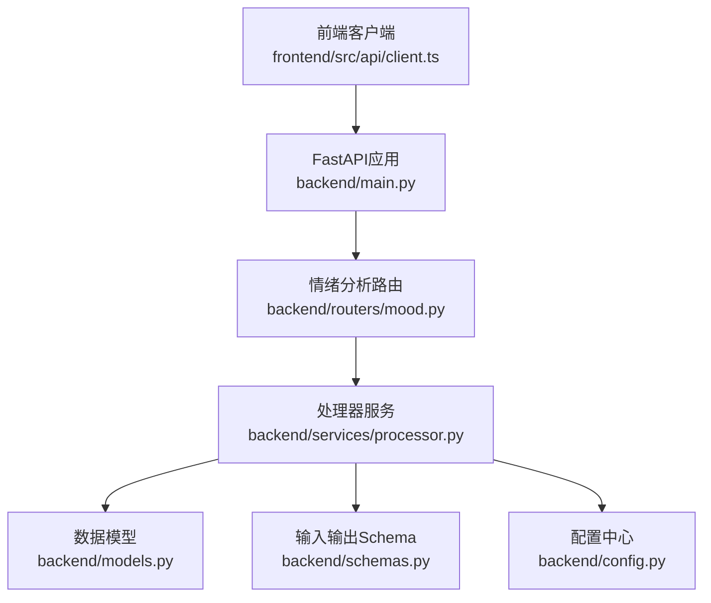
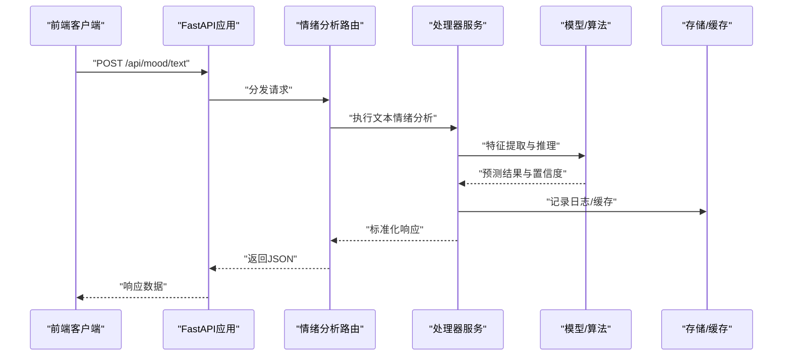
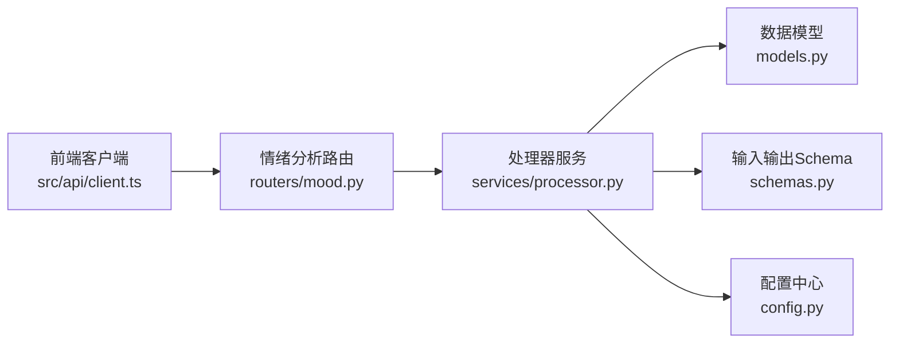

# 情绪分析路由

<cite>
**本文引用的文件**   
- [backend/routers/mood.py](file://backend/routers/mood.py)
- [backend/main.py](file://backend/main.py)
- [backend/models.py](file://backend/models.py)
- [backend/schemas.py](file://backend/schemas.py)
- [backend/services/processor.py](file://backend/services/processor.py)
- [backend/config.py](file://backend/config.py)
- [frontend/src/api/client.ts](file://frontend/src/api/client.ts)
</cite>

## 目录
1. [简介](#简介)
2. [项目结构](#项目结构)
3. [核心组件](#核心组件)
4. [架构总览](#架构总览)
5. [详细组件分析](#详细组件分析)
6. [依赖关系分析](#依赖关系分析)
7. [性能考量](#性能考量)
8. [故障排查指南](#故障排查指南)
9. [结论](#结论)
10. [附录](#附录)

## 简介
本文件面向“情绪分析API路由”的完整技术文档，覆盖基于文本与语音的情绪识别、情感分类、情绪趋势分析与个性化推荐等智能能力。内容涵盖NLP处理流程、机器学习模型集成点、特征工程策略、结果解释方法，并提供可操作的配置示例（自定义情绪标签、批量分析、实时反馈）与最佳实践建议。读者无需深入代码即可理解系统能力与使用方式。

## 项目结构
后端采用模块化路由与服务分离的设计：
- 路由层：定义REST API端点，负责请求校验、参数解析、调用服务层并返回响应。
- 服务层：封装业务逻辑，如文本预处理、语音转写、情绪识别、趋势计算与推荐生成。
- 数据模型与Schema：统一数据结构定义与输入输出校验。
- 前端客户端：封装HTTP调用，提供UI交互入口。

图表来源
- [backend/main.py](file://backend/main.py)
- [backend/routers/mood.py](file://backend/routers/mood.py)
- [backend/services/processor.py](file://backend/services/processor.py)
- [backend/models.py](file://backend/models.py)
- [backend/schemas.py](file://backend/schemas.py)
- [backend/config.py](file://backend/config.py)
- [frontend/src/api/client.ts](file://frontend/src/api/client.ts)

章节来源
- [backend/main.py](file://backend/main.py)
- [backend/routers/mood.py](file://backend/routers/mood.py)
- [backend/services/processor.py](file://backend/services/processor.py)
- [backend/models.py](file://backend/models.py)
- [backend/schemas.py](file://backend/schemas.py)
- [backend/config.py](file://backend/config.py)
- [frontend/src/api/client.ts](file://frontend/src/api/client.ts)

## 核心组件
- 情绪分析路由（mood.py）
  - 暴露REST接口：文本情绪分析、语音情绪分析、批量分析、趋势查询、个性化推荐。
  - 职责：参数校验、调用处理器服务、组装响应、错误映射。
- 处理器服务（processor.py）
  - 职责：文本清洗与分词、语音转写（ASR）、特征提取、模型推理、结果解释、趋势聚合、推荐策略。
- 数据模型与Schema（models.py, schemas.py）
  - 职责：统一输入输出结构、字段约束、枚举值定义（如情绪标签）。
- 配置中心（config.py）
  - 职责：加载环境配置（模型路径、阈值、并发、缓存开关等）。
- 前端客户端（client.ts）
  - 职责：封装API调用、错误处理、重试与流式响应支持。

章节来源
- [backend/routers/mood.py](file://backend/routers/mood.py)
- [backend/services/processor.py](file://backend/services/processor.py)
- [backend/models.py](file://backend/models.py)
- [backend/schemas.py](file://backend/schemas.py)
- [backend/config.py](file://backend/config.py)
- [frontend/src/api/client.ts](file://frontend/src/api/client.ts)

## 架构总览
整体流程从前端发起请求到后端路由，进入处理器服务完成NLP与模型推理，最终返回结构化结果。

图表来源
- [backend/main.py](file://backend/main.py)
- [backend/routers/mood.py](file://backend/routers/mood.py)
- [backend/services/processor.py](file://backend/services/processor.py)
- [backend/models.py](file://backend/models.py)
- [backend/schemas.py](file://backend/schemas.py)
- [backend/config.py](file://backend/config.py)

## 详细组件分析

### 情绪分析路由（mood.py）
- 功能要点
  - 文本情绪分析：接收文本与可选上下文，返回情绪类别、置信度、关键片段与解释。
  - 语音情绪分析：接收音频或音频URL，先进行ASR转写，再执行文本情绪分析。
  - 批量分析：接收多条文本或音频任务，异步处理并返回进度与结果。
  - 趋势分析：按时间窗口聚合历史情绪，生成趋势曲线与洞察。
  - 个性化推荐：基于用户历史情绪与偏好，生成干预建议或内容推荐。
- 设计模式
  - 分层解耦：路由仅做参数校验与调度，复杂逻辑下沉至服务层。
  - 错误映射：将底层异常转换为标准HTTP状态码与错误消息。
- 扩展点
  - 新增情绪标签：在Schema中扩展枚举，并在处理器中补充规则或模型输出映射。
  - 多模态输入：在路由层增加新的输入类型校验与转换逻辑。

章节来源
- [backend/routers/mood.py](file://backend/routers/mood.py)

### 处理器服务（processor.py）
- 功能要点
  - NLP处理：文本清洗、去噪、分词、句法/语义特征提取。
  - ASR集成：音频解码、转写、噪声抑制、说话人分离（可选）。
  - 特征工程：词频、情感词典匹配、上下文嵌入、时序特征。
  - 模型推理：调用预训练模型或在线服务，输出情绪类别与置信度。
  - 结果解释：生成自然语言解释、关键证据片段、置信度说明。
  - 趋势计算：滑动窗口统计、平滑滤波、异常检测。
  - 推荐策略：协同过滤、内容匹配、规则引擎组合。
- 复杂度与优化
  - 文本处理O(n)线性扫描；特征提取与模型推理为瓶颈，建议使用批处理与缓存。
  - 异步队列处理批量任务，避免阻塞主线程。
- 错误处理
  - 捕获ASR失败、模型超时、输入格式错误，返回明确错误信息。

章节来源
- [backend/services/processor.py](file://backend/services/processor.py)

### 数据模型与Schema（models.py, schemas.py）
- 数据模型
  - 情绪记录：包含时间戳、文本/音频标识、情绪类别、置信度、解释摘要。
  - 用户画像：历史情绪分布、偏好标签、干预策略开关。
- Schema定义
  - 输入：文本、音频URL、上下文、分析选项（是否开启解释、是否缓存）。
  - 输出：情绪类别、置信度、关键片段、解释、趋势指标、推荐项。
- 校验与约束
  - 必填字段校验、枚举值限制、长度与格式验证。

章节来源
- [backend/models.py](file://backend/models.py)
- [backend/schemas.py](file://backend/schemas.py)

### 配置中心（config.py）
- 配置项
  - 模型路径、阈值、并发数、缓存开关、ASR服务地址、日志级别。
- 动态更新
  - 支持热重载部分配置（如阈值、开关），无需重启服务。

章节来源
- [backend/config.py](file://backend/config.py)

### 前端客户端（client.ts）
- 功能要点
  - 封装REST调用，支持文本与音频上传、批量任务提交、流式响应读取。
  - 错误重试与超时控制，友好提示与降级策略。
- 集成建议
  - 使用WebSocket或SSE实现实时反馈；对大文件上传进行分片与进度上报。

章节来源
- [frontend/src/api/client.ts](file://frontend/src/api/client.ts)

## 依赖关系分析
模块间依赖清晰，路由依赖服务，服务依赖模型与Schema，配置集中管理。

图表来源
- [backend/routers/mood.py](file://backend/routers/mood.py)
- [backend/services/processor.py](file://backend/services/processor.py)
- [backend/models.py](file://backend/models.py)
- [backend/schemas.py](file://backend/schemas.py)
- [backend/config.py](file://backend/config.py)
- [frontend/src/api/client.ts](file://frontend/src/api/client.ts)

章节来源
- [backend/routers/mood.py](file://backend/routers/mood.py)
- [backend/services/processor.py](file://backend/services/processor.py)
- [backend/models.py](file://backend/models.py)
- [backend/schemas.py](file://backend/schemas.py)
- [backend/config.py](file://backend/config.py)
- [frontend/src/api/client.ts](file://frontend/src/api/client.ts)

## 性能考量
- 批处理与缓存
  - 对相似文本进行特征缓存，减少重复推理。
  - 批量分析使用异步队列，提升吞吐。
- 模型优化
  - 使用量化或蒸馏后的轻量模型，降低延迟。
  - 热点数据本地缓存，冷数据回源。
- I/O优化
  - 音频上传分片与并行处理。
  - 数据库读写分离与连接池。
- 监控与告警
  - 记录关键指标（QPS、延迟、错误率），设置阈值告警。

[本节为通用指导，不直接分析具体文件]

## 故障排查指南
- 常见问题
  - ASR失败：检查音频格式、网络连通性、服务可用性。
  - 模型超时：调整超时阈值、扩容实例、检查依赖服务健康。
  - 输入校验失败：确认字段类型、枚举值、长度限制。
- 调试建议
  - 启用详细日志，定位错误堆栈。
  - 使用Mock数据隔离问题域。
  - 逐步关闭功能开关，缩小范围。

章节来源
- [backend/services/processor.py](file://backend/services/processor.py)
- [backend/routers/mood.py](file://backend/routers/mood.py)

## 结论
本情绪分析路由通过清晰的分层架构与可扩展的服务设计，实现了文本与语音的多模态情绪识别、趋势分析与个性化推荐。结合合理的特征工程与模型集成策略，可在保证性能的同时提供高质量的结果解释与用户体验。建议在生产环境中完善监控、缓存与异步处理能力，以支撑高并发与大规模数据处理需求。

[本节为总结性内容，不直接分析具体文件]

## 附录

### 分析配置示例
- 自定义情绪标签
  - 在Schema中扩展情绪枚举，并在处理器中补充映射规则或模型输出对齐。
  - 建议在路由层增加标签校验与默认回退策略。
- 批量分析
  - 提交任务列表，服务端异步处理并返回任务ID与进度查询接口。
  - 前端轮询或使用事件推送获取结果。
- 实时反馈
  - 使用SSE或WebSocket推送中间结果，提升交互体验。
  - 对长音频进行分段处理，边转写边分析。

[本节为概念性说明，不直接分析具体文件]

### 结果解释与可视化
- 解释维度
  - 关键片段高亮、置信度说明、影响因素权重。
- 可视化建议
  - 情绪折线图、热力图、词云与时间轴。
  - 趋势拐点标注与异常提醒。

[本节为概念性说明，不直接分析具体文件]