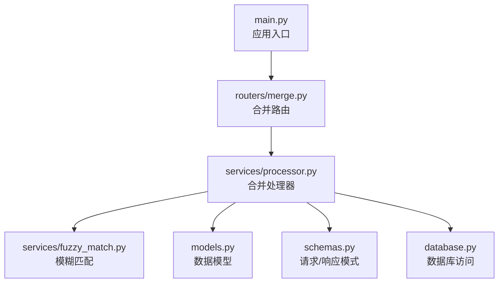
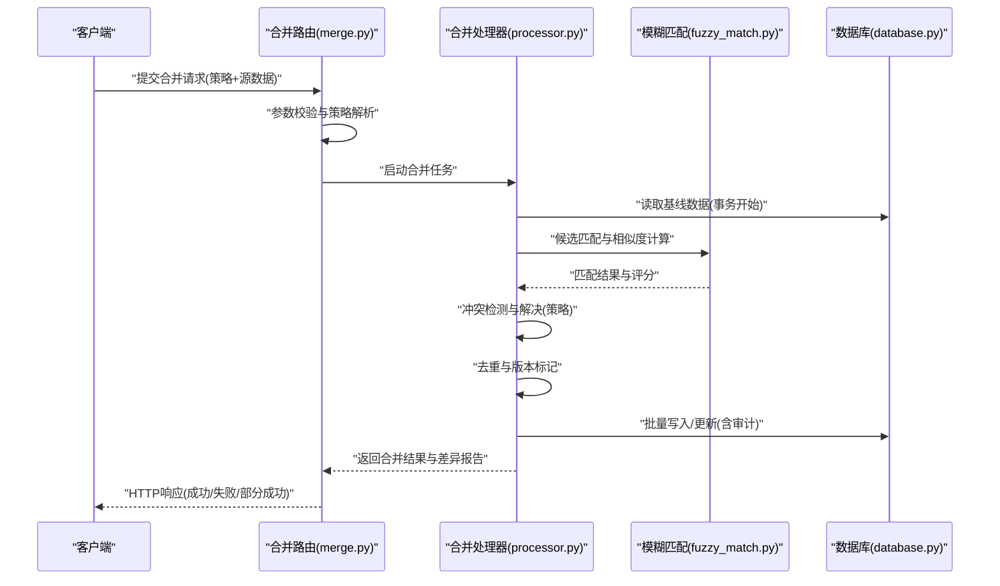
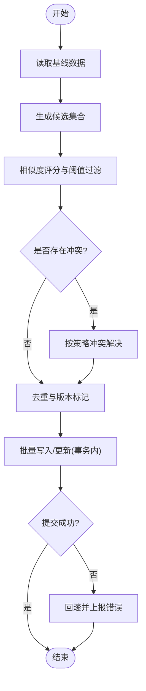
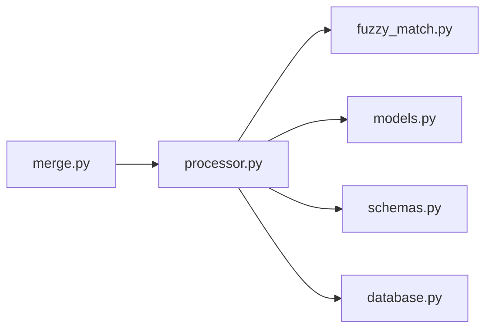

# 数据合并路由

<cite>
**本文引用的文件**   
- [backend/routers/merge.py](file://backend/routers/merge.py)
- [backend/services/processor.py](file://backend/services/processor.py)
- [backend/services/fuzzy_match.py](file://backend/services/fuzzy_match.py)
- [backend/models.py](file://backend/models.py)
- [backend/schemas.py](file://backend/schemas.py)
- [backend/database.py](file://backend/database.py)
- [backend/main.py](file://backend/main.py)
</cite>

## 目录
1. [简介](#简介)
2. [项目结构](#项目结构)
3. [核心组件](#核心组件)
4. [架构总览](#架构总览)
5. [详细组件分析](#详细组件分析)
6. [依赖关系分析](#依赖关系分析)
7. [性能考量](#性能考量)
8. [故障排查指南](#故障排查指南)
9. [结论](#结论)
10. [附录](#附录)

## 简介
本文件面向“数据合并API路由”的完整技术文档，围绕多源数据合并、冲突解决、数据去重与一致性保证等核心能力展开。文档涵盖合并策略配置、版本控制、事务处理与回滚机制的技术实现，并提供增量合并、全量合并与选择性合并等典型场景的最佳实践与操作示例说明。读者无需深入代码即可理解系统如何设计并落地这些能力。

## 项目结构
后端采用分层组织：路由层负责HTTP接口定义与参数校验；服务层封装业务逻辑（如处理器与模糊匹配）；模型与模式定义数据契约；数据库层提供持久化能力；主应用装配路由与中间件。

图表来源
- [backend/main.py](file://backend/main.py)
- [backend/routers/merge.py](file://backend/routers/merge.py)
- [backend/services/processor.py](file://backend/services/processor.py)
- [backend/services/fuzzy_match.py](file://backend/services/fuzzy_match.py)
- [backend/models.py](file://backend/models.py)
- [backend/schemas.py](file://backend/schemas.py)
- [backend/database.py](file://backend/database.py)

章节来源
- [backend/main.py](file://backend/main.py)
- [backend/routers/merge.py](file://backend/routers/merge.py)
- [backend/services/processor.py](file://backend/services/processor.py)
- [backend/services/fuzzy_match.py](file://backend/services/fuzzy_match.py)
- [backend/models.py](file://backend/models.py)
- [backend/schemas.py](file://backend/schemas.py)
- [backend/database.py](file://backend/database.py)

## 核心组件
- 合并路由（merge.py）
  - 职责：暴露数据合并的HTTP端点，接收合并任务描述、策略与源数据，返回执行结果与差异报告。
  - 关键能力：参数校验、策略解析、调用处理器、事务包装、错误映射。
- 合并处理器（processor.py）
  - 职责：编排多源数据的读取、对齐、冲突检测与解决、去重、版本标记与落库。
  - 关键能力：策略驱动的执行流程、冲突仲裁、幂等性保障、变更追踪。
- 模糊匹配（fuzzy_match.py）
  - 职责：对文本或标识进行相似度计算，辅助跨源记录关联与去重。
  - 关键能力：阈值控制、候选集生成、评分排序。
- 数据模型与模式（models.py, schemas.py）
  - 职责：统一数据结构定义、字段约束与序列化/反序列化规则。
  - 关键能力：合并请求体、策略对象、结果对象、差异报告的结构化定义。
- 数据库访问（database.py）
  - 职责：提供事务、查询与写入抽象，确保合并过程的一致性与可回滚。
  - 关键能力：事务边界、重试与超时、审计日志。

章节来源
- [backend/routers/merge.py](file://backend/routers/merge.py)
- [backend/services/processor.py](file://backend/services/processor.py)
- [backend/services/fuzzy_match.py](file://backend/services/fuzzy_match.py)
- [backend/models.py](file://backend/models.py)
- [backend/schemas.py](file://backend/schemas.py)
- [backend/database.py](file://backend/database.py)

## 架构总览
下图展示了从HTTP请求到数据落库的端到端流程，强调策略驱动、冲突解决、去重与事务一致性。

图表来源
- [backend/routers/merge.py](file://backend/routers/merge.py)
- [backend/services/processor.py](file://backend/services/processor.py)
- [backend/services/fuzzy_match.py](file://backend/services/fuzzy_match.py)
- [backend/database.py](file://backend/database.py)

## 详细组件分析

### 合并路由（merge.py）
- 功能要点
  - 定义合并相关的路由端点，支持多种合并模式（增量、全量、选择性）。
  - 对请求体进行严格校验，确保策略、源数据与目标范围合法。
  - 将任务委派给处理器执行，并以事务包裹以确保原子性。
  - 统一错误码与消息格式，便于前端与下游消费。
- 交互流程
  - 接收请求 → 校验与解析 → 调用处理器 → 事务提交/回滚 → 返回结果。
- 扩展点
  - 新增合并策略时，优先在处理器侧注册策略实现，路由仅做透传与校验。

章节来源
- [backend/routers/merge.py](file://backend/routers/merge.py)

### 合并处理器（processor.py）
- 功能要点
  - 基于策略驱动的流水线：读取基线 → 候选匹配 → 冲突检测 → 冲突解决 → 去重 → 版本化 → 落库。
  - 支持增量合并（仅变更）、全量合并（重建视图）、选择性合并（按字段/条件过滤）。
  - 维护版本与审计信息，确保可追溯与可回滚。
- 算法与数据结构
  - 使用索引与哈希表加速匹配与去重，时间复杂度近似O(n log n)或O(n)，取决于具体实现。
  - 冲突解决采用策略枚举（如“保留最新”、“合并字段”、“人工介入”），可扩展。
- 事务与一致性
  - 以事务为单位执行读写，异常触发回滚；长事务拆分为子事务以提升稳定性。
  - 幂等键与去重键避免重复合并导致的数据漂移。

图表来源
- [backend/services/processor.py](file://backend/services/processor.py)
- [backend/services/fuzzy_match.py](file://backend/services/fuzzy_match.py)
- [backend/database.py](file://backend/database.py)

章节来源
- [backend/services/processor.py](file://backend/services/processor.py)
- [backend/services/fuzzy_match.py](file://backend/services/fuzzy_match.py)

### 模糊匹配（fuzzy_match.py）
- 功能要点
  - 提供字符串/标识相似度计算，支持阈值与权重配置。
  - 输出候选列表及评分，供处理器进行后续冲突检测与选择。
- 性能优化
  - 预索引与分桶减少比较空间；批量化计算降低CPU抖动。
  - 可调阈值平衡召回率与准确率。

章节来源
- [backend/services/fuzzy_match.py](file://backend/services/fuzzy_match.py)

### 数据模型与模式（models.py, schemas.py）
- 模型（models.py）
  - 定义实体结构与关系，支撑合并过程中的读/写与审计。
- 模式（schemas.py）
  - 定义合并请求体、策略对象、结果对象与差异报告的JSON结构。
  - 包含必填字段、默认值、取值范围与校验规则。

章节来源
- [backend/models.py](file://backend/models.py)
- [backend/schemas.py](file://backend/schemas.py)

### 数据库访问（database.py）
- 功能要点
  - 封装事务、连接池、重试与超时策略。
  - 提供批量插入/更新接口，支持审计字段自动填充。
- 一致性保障
  - 通过事务边界与回滚语义保证合并操作的原子性。
  - 幂等键与唯一约束防止重复写入。

章节来源
- [backend/database.py](file://backend/database.py)

## 依赖关系分析
- 路由层依赖处理器与模式校验；处理器依赖模糊匹配、模型与数据库；数据库层为底层基础设施。
- 耦合度：路由与处理器松耦合，策略变化不影响路由；处理器与数据库通过抽象接口解耦。
- 外部依赖：无强外部依赖，主要依赖数据库与内存计算。

图表来源
- [backend/routers/merge.py](file://backend/routers/merge.py)
- [backend/services/processor.py](file://backend/services/processor.py)
- [backend/services/fuzzy_match.py](file://backend/services/fuzzy_match.py)
- [backend/models.py](file://backend/models.py)
- [backend/schemas.py](file://backend/schemas.py)
- [backend/database.py](file://backend/database.py)

章节来源
- [backend/routers/merge.py](file://backend/routers/merge.py)
- [backend/services/processor.py](file://backend/services/processor.py)
- [backend/services/fuzzy_match.py](file://backend/services/fuzzy_match.py)
- [backend/models.py](file://backend/models.py)
- [backend/schemas.py](file://backend/schemas.py)
- [backend/database.py](file://backend/database.py)

## 性能考量
- 匹配与去重
  - 使用索引与哈希加速，限制候选规模，设置合理阈值减少无效比较。
- 事务与批处理
  - 大事务拆分小批次提交，降低锁竞争与内存占用。
- 并发与限流
  - 合并任务可并行但需控制并发度，避免数据库拥塞。
- 缓存与幂等
  - 对热点数据进行只读缓存；通过幂等键避免重复计算与写入。

[本节为通用指导，不直接分析具体文件]

## 故障排查指南
- 常见错误
  - 参数校验失败：检查请求体结构与必填字段。
  - 匹配失败：调整模糊匹配阈值或候选生成策略。
  - 冲突未解决：确认冲突策略是否覆盖所有分支。
  - 事务失败：查看数据库日志与锁等待情况。
- 诊断步骤
  - 启用详细日志，定位失败阶段。
  - 回放相同请求，复现问题并对比差异报告。
  - 检查幂等键与去重键是否正确设置。
- 恢复建议
  - 对失败任务进行重试或降级为选择性合并。
  - 必要时回滚至最近稳定版本并重试。

章节来源
- [backend/routers/merge.py](file://backend/routers/merge.py)
- [backend/services/processor.py](file://backend/services/processor.py)
- [backend/database.py](file://backend/database.py)

## 结论
数据合并路由通过策略驱动的处理器、模糊匹配与事务化的数据库访问，实现了多源数据的高效合并、冲突解决、去重与一致性保障。结合增量、全量与选择性合并场景，可在保证正确性的同时提升性能与可维护性。建议在生产环境完善监控、审计与回滚策略，持续优化匹配阈值与批处理大小。

[本节为总结性内容，不直接分析具体文件]

## 附录

### 合并策略配置参考
- 策略类型
  - 保留最新：以时间戳或版本号决定胜出方。
  - 字段级合并：对不同字段分别选择来源或合并策略。
  - 人工介入：冲突交由人工审核后再决定。
- 配置项
  - 阈值：模糊匹配的相似度阈值。
  - 优先级：源数据优先级顺序。
  - 去重键：用于识别同一实体的关键字段组合。
  - 版本字段：用于版本控制与审计。

[本节为概念性说明，不直接分析具体文件]

### 典型合并场景与最佳实践
- 增量合并
  - 适用：频繁小批量更新。
  - 实践：仅拉取变更集，使用去重键与时间戳判断更新。
- 全量合并
  - 适用：周期性重建视图或修复不一致。
  - 实践：先快照基线，再全量比对与替换，注意事务拆分。
- 选择性合并
  - 适用：部分字段或条件过滤的合并。
  - 实践：明确筛选条件与字段白名单，避免误改。

[本节为概念性说明，不直接分析具体文件]

### 事务与回滚机制
- 事务边界
  - 以合并任务为单位开启事务，异常即回滚。
- 回滚策略
  - 失败时清理临时状态，保留审计日志以便回溯。
- 幂等性
  - 通过幂等键与唯一约束避免重复合并。

[本节为概念性说明，不直接分析具体文件]