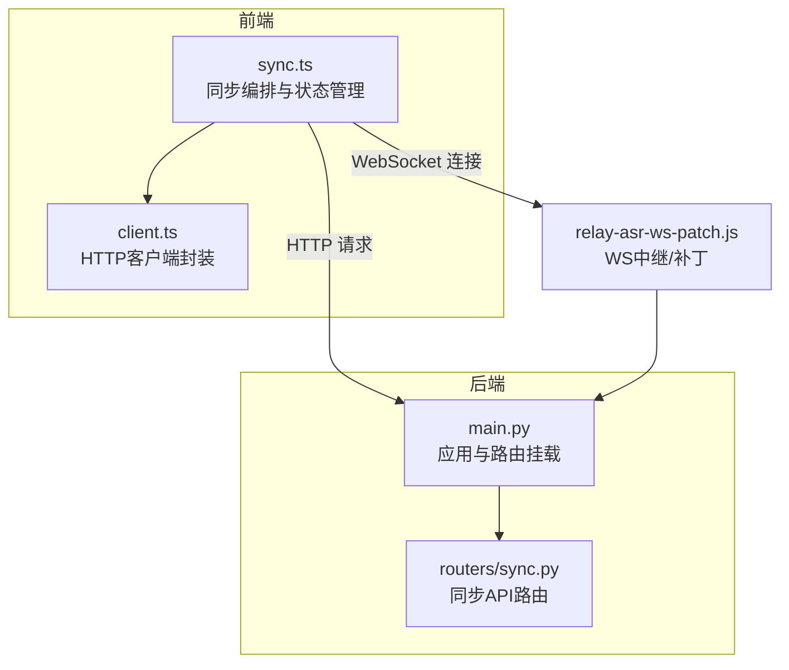
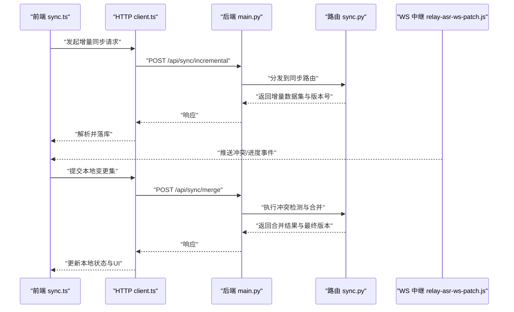
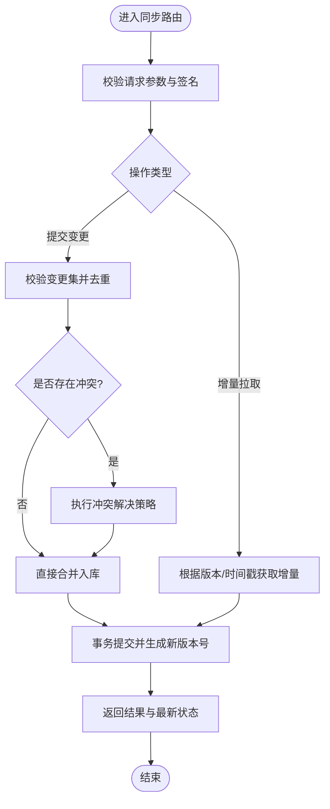
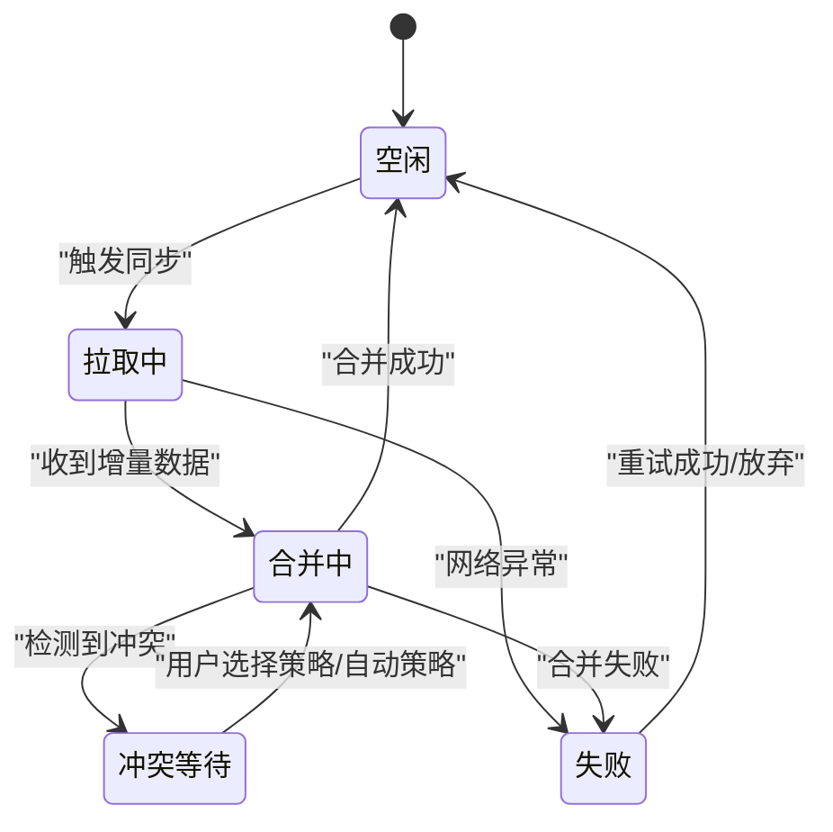
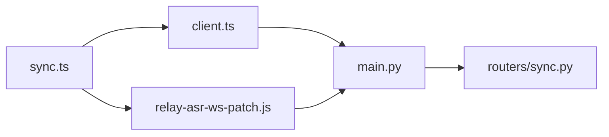

# 数据同步路由

<cite>
**本文引用的文件**   
- [backend/routers/sync.py](file://backend/routers/sync.py)
- [backend/main.py](file://backend/main.py)
- [frontend/src/sync.ts](file://frontend/src/sync.ts)
- [frontend/src/api/client.ts](file://frontend/src/api/client.ts)
- [data/relay-asr-ws-patch.js](file://data/relay-asr-ws-patch.js)
</cite>

## 目录
1. [简介](#简介)
2. [项目结构](#项目结构)
3. [核心组件](#核心组件)
4. [架构总览](#架构总览)
5. [详细组件分析](#详细组件分析)
6. [依赖关系分析](#依赖关系分析)
7. [性能考量](#性能考量)
8. [故障排查指南](#故障排查指南)
9. [结论](#结论)
10. [附录](#附录)

## 简介
本文件围绕“数据同步API路由”展开，系统梳理前后端数据同步、冲突解决、增量更新与版本控制等核心机制，并结合WebSocket实时通信、离线缓存、同步状态管理与网络异常处理进行技术说明。文档同时提供双向同步、部分同步与批量同步等策略示例，帮助读者快速理解并落地实现。

## 项目结构
后端采用模块化路由组织，其中数据同步相关能力集中在路由层；前端通过统一的HTTP客户端与同步模块对接后端接口，并通过WebSocket通道实现实时推送与事件驱动更新。关键路径如下：
- 后端同步路由：backend/routers/sync.py
- 应用入口与路由挂载：backend/main.py
- 前端同步逻辑：frontend/src/sync.ts
- 前端HTTP客户端封装：frontend/src/api/client.ts
- WebSocket补丁/中继脚本：data/relay-asr-ws-patch.js

**图表来源** 
- [backend/main.py](file://backend/main.py)
- [backend/routers/sync.py](file://backend/routers/sync.py)
- [frontend/src/sync.ts](file://frontend/src/sync.ts)
- [frontend/src/api/client.ts](file://frontend/src/api/client.ts)
- [data/relay-asr-ws-patch.js](file://data/relay-asr-ws-patch.js)

**章节来源**
- [backend/main.py](file://backend/main.py)
- [backend/routers/sync.py](file://backend/routers/sync.py)
- [frontend/src/sync.ts](file://frontend/src/sync.ts)
- [frontend/src/api/client.ts](file://frontend/src/api/client.ts)
- [data/relay-asr-ws-patch.js](file://data/relay-asr-ws-patch.js)

## 核心组件
- 同步路由（后端）：暴露REST接口用于触发增量/全量同步、查询同步状态、提交变更集与合并结果。
- 同步编排（前端）：维护本地缓存与同步状态机，协调HTTP与WebSocket通道，执行重试与幂等策略。
- HTTP客户端（前端）：统一封装请求、响应拦截、错误处理与重试。
- WebSocket中继（脚本）：转发或增强实时事件，支持断线重连与消息缓冲。

**章节来源**
- [backend/routers/sync.py](file://backend/routers/sync.py)
- [frontend/src/sync.ts](file://frontend/src/sync.ts)
- [frontend/src/api/client.ts](file://frontend/src/api/client.ts)
- [data/relay-asr-ws-patch.js](file://data/relay-asr-ws-patch.js)

## 架构总览
整体采用“HTTP为主、WebSocket为辅”的混合同步架构：
- HTTP负责结构化数据交换（增量拉取、变更提交、状态查询）。
- WebSocket负责低延迟事件通知（如新记录到达、冲突提示、进度推送）。
- 前端在离线时缓存变更，在线后按策略合并与上报。
- 后端对并发写入进行冲突检测与合并，返回可解析的合并结果。

**图表来源** 
- [frontend/src/sync.ts](file://frontend/src/sync.ts)
- [frontend/src/api/client.ts](file://frontend/src/api/client.ts)
- [backend/main.py](file://backend/main.py)
- [backend/routers/sync.py](file://backend/routers/sync.py)
- [data/relay-asr-ws-patch.js](file://data/relay-asr-ws-patch.js)

## 详细组件分析

### 后端同步路由（REST）
职责与要点：
- 增量同步接口：基于时间戳或版本号拉取差异数据，减少带宽与计算开销。
- 变更提交接口：接收前端提交的变更集，进行去重、校验与冲突检测。
- 合并与冲突解决：采用字段级合并或策略优先（如服务端优先、最后写入胜出、自定义规则）。
- 同步状态查询：返回当前服务器版本、待处理队列长度、最近同步时间等。
- 幂等性与一致性：通过唯一操作ID与事务保证重复提交不产生副作用。

建议的数据流与状态：
- 使用“版本号/时间戳”作为增量边界。
- 变更集包含新增、修改、删除三类操作，附带实体标识与元数据。
- 合并阶段输出“冲突清单”和“最终版本”，供前端展示与回滚。

**图表来源** 
- [backend/routers/sync.py](file://backend/routers/sync.py)

**章节来源**
- [backend/routers/sync.py](file://backend/routers/sync.py)

### 前端同步编排（sync.ts）
职责与要点：
- 状态机管理：维护空闲、拉取中、合并中、冲突等待、失败重试等状态。
- 增量与全量策略：首次全量，后续增量；网络异常时降级为全量或分批拉取。
- 离线缓存：将未同步变更持久化至IndexedDB/LocalStorage，恢复后自动补发。
- 冲突处理：展示冲突详情，支持用户选择保留策略或自动回退。
- 重试与退避：指数退避、最大重试次数、抖动随机化避免雪崩。

**图表来源** 
- [frontend/src/sync.ts](file://frontend/src/sync.ts)

**章节来源**
- [frontend/src/sync.ts](file://frontend/src/sync.ts)

### HTTP客户端（client.ts）
职责与要点：
- 统一请求封装：基础URL、超时、重试、取消令牌。
- 响应拦截：统一错误码映射、会话过期处理、加载态管理。
- 错误分类：网络错误、业务错误、超时、取消等，便于上层差异化处理。
- 幂等保障：对写操作附加唯一请求ID，避免重复提交。

**章节来源**
- [frontend/src/api/client.ts](file://frontend/src/api/client.ts)

### WebSocket中继（relay-asr-ws-patch.js）
职责与要点：
- 事件转发：将后端实时事件转发给前端，支持过滤与节流。
- 断线重连：指数退避重连、心跳保活、消息缓冲。
- 兼容性补丁：适配不同环境下的WebSocket行为差异。

**章节来源**
- [data/relay-asr-ws-patch.js](file://data/relay-asr-ws-patch.js)

## 依赖关系分析
- 前端同步编排依赖HTTP客户端与WebSocket中继，二者分别承担结构化数据交换与实时事件通道。
- 后端路由由应用入口挂载，对外暴露REST接口；内部可能依赖数据库与服务层（不在本文件范围内）。
- 各模块间通过明确定义的请求/响应结构与事件协议解耦。

**图表来源** 
- [frontend/src/sync.ts](file://frontend/src/sync.ts)
- [frontend/src/api/client.ts](file://frontend/src/api/client.ts)
- [data/relay-asr-ws-patch.js](file://data/relay-asr-ws-patch.js)
- [backend/main.py](file://backend/main.py)
- [backend/routers/sync.py](file://backend/routers/sync.py)

**章节来源**
- [frontend/src/sync.ts](file://frontend/src/sync.ts)
- [frontend/src/api/client.ts](file://frontend/src/api/client.ts)
- [data/relay-asr-ws-patch.js](file://data/relay-asr-ws-patch.js)
- [backend/main.py](file://backend/main.py)
- [backend/routers/sync.py](file://backend/routers/sync.py)

## 性能考量
- 增量同步优先：基于时间戳/版本号仅传输差异，降低带宽与CPU消耗。
- 分页与批处理：大集合分片拉取与合并，避免单次负载过大。
- 压缩与序列化优化：合理选择JSON/Protobuf等格式，必要时启用Gzip。
- 并发控制：限制并行请求数，避免阻塞主线程与资源竞争。
- 缓存策略：本地缓存热点数据，结合ETag/Last-Modified减少重复请求。
- WebSocket节流：对高频事件做聚合与去抖，降低渲染压力。

[本节为通用指导，无需特定文件引用]

## 故障排查指南
常见问题与定位步骤：
- 同步卡住或无响应：检查HTTP超时设置与重试策略；查看WebSocket心跳与重连日志。
- 数据不一致：核对版本号/时间戳是否单调递增；确认幂等ID是否唯一。
- 冲突频繁：审查冲突解决策略是否合理；增加字段级差异对比与审计日志。
- 离线数据丢失：验证本地存储容量与清理策略；确保恢复后能正确回放变更集。
- 网络异常：区分DNS/SSL/代理问题；启用降级模式（如只读或仅拉取）。

**章节来源**
- [frontend/src/sync.ts](file://frontend/src/sync.ts)
- [frontend/src/api/client.ts](file://frontend/src/api/client.ts)
- [data/relay-asr-ws-patch.js](file://data/relay-asr-ws-patch.js)
- [backend/routers/sync.py](file://backend/routers/sync.py)

## 结论
本方案以“HTTP+WebSocket”的混合通道实现稳定高效的数据同步，配合增量更新、冲突解决、离线缓存与状态机管理，满足多端一致性与用户体验要求。通过明确的策略与可观测性设计，可在复杂网络与高并发场景下保持鲁棒性。

[本节为总结性内容，无需特定文件引用]

## 附录

### 同步策略示例
- 双向同步：两端均可编辑，通过版本号与冲突清单协商合并；默认策略可为“服务端优先”或“用户选择”。
- 部分同步：按标签/范围筛选增量，适用于大数据集的分页与按需加载。
- 批量同步：将多次变更聚合成批次提交，减少往返次数与锁竞争。

[本节为概念性说明，无需特定文件引用]