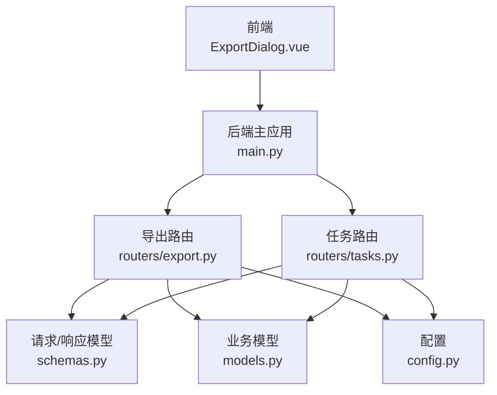
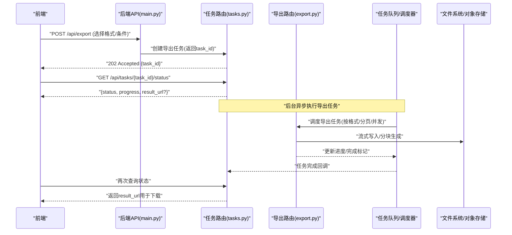
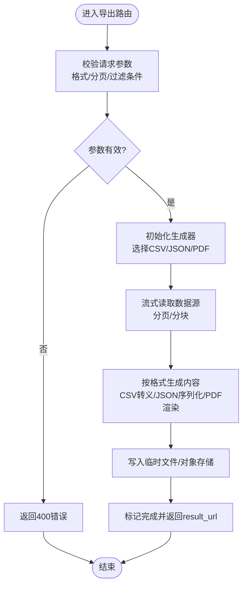
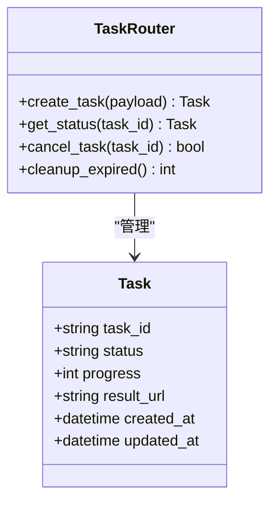
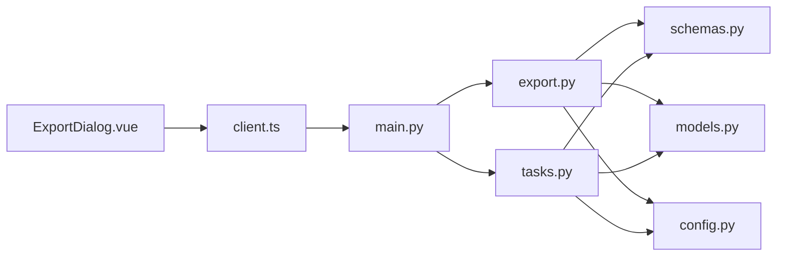

# 数据导出路由

<cite>
**本文档引用的文件**   
- [backend/routers/export.py](file://backend/routers/export.py)
- [backend/routers/tasks.py](file://backend/routers/tasks.py)
- [backend/main.py](file://backend/main.py)
- [backend/schemas.py](file://backend/schemas.py)
- [backend/models.py](file://backend/models.py)
- [backend/config.py](file://backend/config.py)
- [frontend/src/components/ExportDialog.vue](file://frontend/src/components/ExportDialog.vue)
- [frontend/src/api/client.ts](file://frontend/src/api/client.ts)
</cite>

## 目录
1. [简介](#简介)
2. [项目结构](#项目结构)
3. [核心组件](#核心组件)
4. [架构总览](#架构总览)
5. [详细组件分析](#详细组件分析)
6. [依赖关系分析](#依赖关系分析)
7. [性能考量](#性能考量)
8. [故障排查指南](#故障排查指南)
9. [结论](#结论)
10. [附录](#附录)

## 简介
本文件面向“数据导出”相关API路由，覆盖CSV、JSON、PDF等格式的生成与处理，以及导出任务管理、进度跟踪、批量处理与异步任务调度等关键能力。文档同时提供前端调用示例、大文件处理策略、内存优化建议与错误恢复机制说明，帮助开发者快速集成并稳定运行导出功能。

## 项目结构
后端采用模块化路由组织，导出功能位于 routers/export.py；任务管理与状态查询位于 routers/tasks.py；应用入口与路由注册在 main.py；请求/响应模型定义在 schemas.py；业务模型定义在 models.py；配置项在 config.py。前端通过 ExportDialog.vue 触发导出，client.ts 封装HTTP调用。

图表来源
- [backend/main.py](file://backend/main.py)
- [backend/routers/export.py](file://backend/routers/export.py)
- [backend/routers/tasks.py](file://backend/routers/tasks.py)
- [backend/schemas.py](file://backend/schemas.py)
- [backend/models.py](file://backend/models.py)
- [backend/config.py](file://backend/config.py)

章节来源
- [backend/main.py](file://backend/main.py)
- [backend/routers/export.py](file://backend/routers/export.py)
- [backend/routers/tasks.py](file://backend/routers/tasks.py)
- [backend/schemas.py](file://backend/schemas.py)
- [backend/models.py](file://backend/models.py)
- [backend/config.py](file://backend/config.py)

## 核心组件
- 导出路由（export.py）：提供多种格式导出接口，支持流式输出、分页/分块读取、并发控制与结果持久化。
- 任务路由（tasks.py）：负责创建、查询、取消导出任务，维护任务状态与进度回调。
- 模型与模式（models.py, schemas.py）：统一数据结构与校验规则，确保前后端契约一致。
- 配置（config.py）：集中管理导出路径、并发限制、超时、大小限制等运行时参数。
- 前端交互（ExportDialog.vue, client.ts）：封装导出表单、进度轮询、下载链接获取与错误提示。

章节来源
- [backend/routers/export.py](file://backend/routers/export.py)
- [backend/routers/tasks.py](file://backend/routers/tasks.py)
- [backend/schemas.py](file://backend/schemas.py)
- [backend/models.py](file://backend/models.py)
- [backend/config.py](file://backend/config.py)
- [frontend/src/components/ExportDialog.vue](file://frontend/src/components/ExportDialog.vue)
- [frontend/src/api/client.ts](file://frontend/src/api/client.ts)

## 架构总览
导出流程以“任务驱动+异步执行”为核心：前端发起导出请求后，后端立即返回任务ID，随后由后台任务队列异步生成数据并写入目标存储，前端通过任务ID轮询进度并在完成后提供下载。

图表来源
- [backend/main.py](file://backend/main.py)
- [backend/routers/tasks.py](file://backend/routers/tasks.py)
- [backend/routers/export.py](file://backend/routers/export.py)

## 详细组件分析

### 导出路由（export.py）
- 职责
  - 接收导出请求（格式：CSV/JSON/PDF，过滤条件、分页参数）。
  - 根据格式选择对应生成器，进行流式或分块处理，避免一次性加载到内存。
  - 将生成结果写入临时文件或对象存储，并返回可下载的URL。
- 关键特性
  - 流式输出：对大文件使用流式响应或分块写入，降低峰值内存。
  - 并发控制：限制同时进行的导出任务数，防止资源耗尽。
  - 错误恢复：失败时保留中间状态，支持断点续传或重试。
  - 格式适配：CSV转义与编码处理、JSON压缩、PDF分页与字体嵌入。
- 典型调用链
  - 前端提交导出表单 → 路由校验参数 → 生成器初始化 → 流式处理 → 落盘 → 返回下载链接。

图表来源
- [backend/routers/export.py](file://backend/routers/export.py)

章节来源
- [backend/routers/export.py](file://backend/routers/export.py)

### 任务路由（tasks.py）
- 职责
  - 创建导出任务，分配唯一task_id，记录初始状态。
  - 提供任务状态查询接口，返回进度百分比、当前阶段、结果URL等。
  - 支持取消任务、清理过期任务与结果文件。
- 关键特性
  - 状态机：pending → running → completed/failed/cancelled。
  - 进度回调：后台任务定期更新进度，前端轮询获取最新状态。
  - 生命周期管理：自动清理已完成且过期的结果文件，释放存储。
- 典型调用链
  - 创建任务 → 返回task_id → 轮询状态 → 获取result_url → 前端下载。

图表来源
- [backend/routers/tasks.py](file://backend/routers/tasks.py)
- [backend/models.py](file://backend/models.py)

章节来源
- [backend/routers/tasks.py](file://backend/routers/tasks.py)
- [backend/models.py](file://backend/models.py)

### 模型与模式（models.py, schemas.py）
- 职责
  - 定义导出请求/响应结构，包括格式枚举、分页参数、过滤条件、任务状态字段。
  - 提供数据校验与默认值，减少非法输入导致的异常。
- 关键特性
  - 强类型约束：确保前后端字段一致性。
  - 可扩展性：新增格式或字段时只需扩展schema。

章节来源
- [backend/schemas.py](file://backend/schemas.py)
- [backend/models.py](file://backend/models.py)

### 配置（config.py）
- 职责
  - 集中管理导出相关配置：最大文件大小、并发数、超时时间、临时目录、存储后端等。
- 关键特性
  - 环境变量注入：便于不同环境差异化配置。
  - 安全边界：限制单次导出规模，防止资源滥用。

章节来源
- [backend/config.py](file://backend/config.py)

### 前端交互（ExportDialog.vue, client.ts）
- 职责
  - 导出对话框收集用户选择的格式、过滤条件与分页范围。
  - 调用后端创建任务并轮询状态，展示进度条与错误信息。
  - 在任务完成后触发下载，支持失败重试。
- 关键特性
  - 用户体验：进度反馈、错误提示、取消操作。
  - 网络健壮性：重试与超时处理。

章节来源
- [frontend/src/components/ExportDialog.vue](file://frontend/src/components/ExportDialog.vue)
- [frontend/src/api/client.ts](file://frontend/src/api/client.ts)

## 依赖关系分析
- 路由层依赖：export.py 与 tasks.py 均依赖 schemas.py 进行参数校验，依赖 models.py 进行数据建模。
- 运行时依赖：config.py 为两个路由提供统一的配置访问。
- 前端依赖：ExportDialog.vue 通过 client.ts 调用后端API，形成稳定的前后端契约。

图表来源
- [backend/routers/export.py](file://backend/routers/export.py)
- [backend/routers/tasks.py](file://backend/routers/tasks.py)
- [backend/schemas.py](file://backend/schemas.py)
- [backend/models.py](file://backend/models.py)
- [backend/config.py](file://backend/config.py)
- [frontend/src/components/ExportDialog.vue](file://frontend/src/components/ExportDialog.vue)
- [frontend/src/api/client.ts](file://frontend/src/api/client.ts)
- [backend/main.py](file://backend/main.py)

章节来源
- [backend/routers/export.py](file://backend/routers/export.py)
- [backend/routers/tasks.py](file://backend/routers/tasks.py)
- [backend/schemas.py](file://backend/schemas.py)
- [backend/models.py](file://backend/models.py)
- [backend/config.py](file://backend/config.py)
- [frontend/src/components/ExportDialog.vue](file://frontend/src/components/ExportDialog.vue)
- [frontend/src/api/client.ts](file://frontend/src/api/client.ts)
- [backend/main.py](file://backend/main.py)

## 性能考量
- 流式处理：对CSV/JSON使用流式写入，PDF按需分页渲染，避免一次性加载全量数据。
- 分页与分块：数据库查询采用分页，导出过程按批次处理，降低内存峰值。
- 并发控制：限制同时运行的导出任务数量，结合队列实现背压。
- 缓存与复用：对重复查询结果进行短期缓存，减少重复计算。
- I/O优化：使用异步I/O与缓冲池，提升磁盘/对象存储读写效率。
- 压缩传输：对大体积响应启用压缩，降低带宽占用。

[本节为通用指导，不直接分析具体文件]

## 故障排查指南
- 常见问题
  - 参数校验失败：检查请求体是否符合schemas定义，确认必填字段与枚举值。
  - 任务卡住：查看任务状态是否为running且无进度更新，检查队列是否阻塞。
  - 内存溢出：确认是否启用了流式处理与分页，调整批次大小。
  - 下载失败：验证result_url是否有效，检查临时文件是否被清理。
- 定位步骤
  - 查看任务日志与状态变更轨迹。
  - 检查配置中的超时与大小限制。
  - 复现最小用例，逐步缩小问题范围。
- 恢复策略
  - 支持任务重试与断点续传。
  - 失败时保留中间产物以便诊断。

章节来源
- [backend/routers/tasks.py](file://backend/routers/tasks.py)
- [backend/routers/export.py](file://backend/routers/export.py)
- [backend/config.py](file://backend/config.py)

## 结论
本导出版本以任务驱动与异步调度为核心，结合流式处理与分页分块，实现了稳定高效的多格式数据导出能力。通过清晰的前后端契约与完善的错误恢复机制，能够满足大文件导出与高并发场景的需求。建议在后续迭代中持续优化并发策略与存储成本，并增强监控与告警能力。

[本节为总结性内容，不直接分析具体文件]

## 附录
- API调用示例（概念性）
  - 创建导出任务：POST /api/export，请求体包含格式、过滤条件与分页范围，返回task_id。
  - 查询任务状态：GET /api/tasks/{task_id}/status，返回status、progress与result_url（完成时）。
  - 下载结果：GET result_url，浏览器直接下载或前端Blob处理。
- 最佳实践
  - 始终使用流式处理与分页，避免一次性加载大数据集。
  - 合理设置并发与超时，结合队列实现削峰填谷。
  - 对敏感数据进行脱敏与权限校验。
  - 完善日志与监控，及时发现问题并恢复。

[本节为补充说明，不直接分析具体文件]