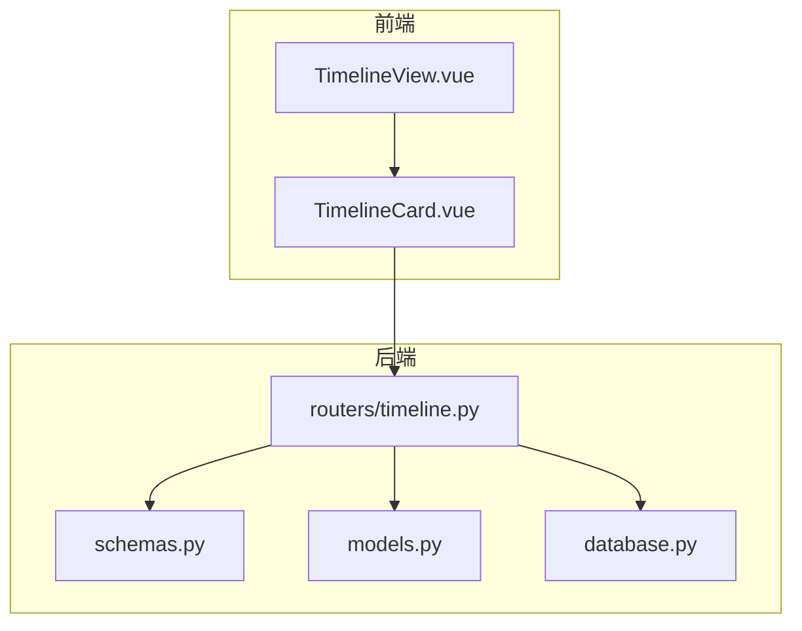
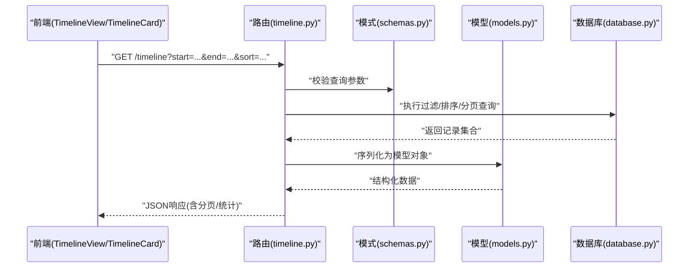
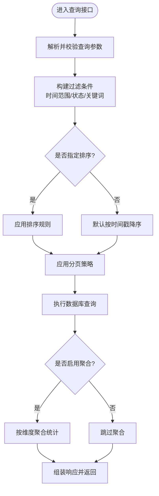
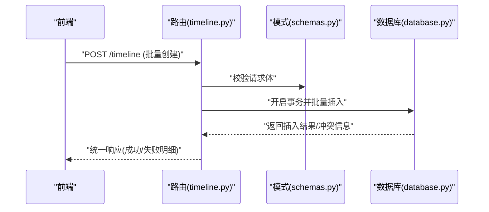
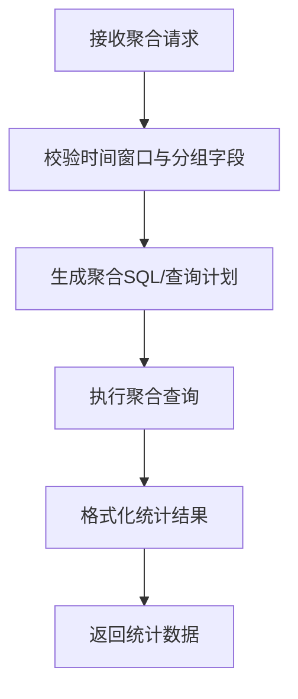
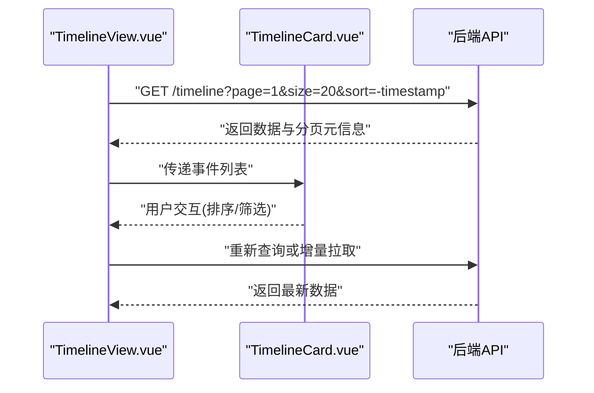
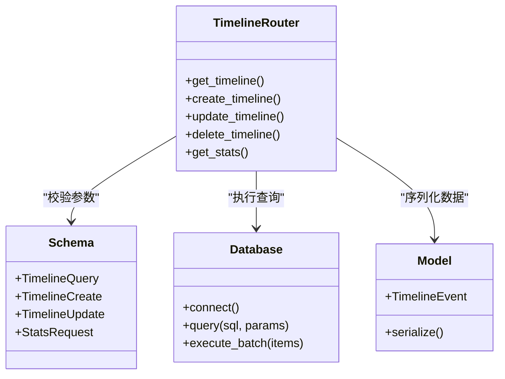

# 时间线管理路由

<cite>
**本文引用的文件**   
- [backend/routers/timeline.py](file://backend/routers/timeline.py)
- [backend/models.py](file://backend/models.py)
- [backend/schemas.py](file://backend/schemas.py)
- [backend/database.py](file://backend/database.py)
- [frontend/src/components/TimelineCard.vue](file://frontend/src/components/TimelineCard.vue)
- [frontend/src/views/TimelineView.vue](file://frontend/src/views/TimelineView.vue)
</cite>

## 目录
1. [简介](#简介)
2. [项目结构](#项目结构)
3. [核心组件](#核心组件)
4. [架构总览](#架构总览)
5. [详细组件分析](#详细组件分析)
6. [依赖关系分析](#依赖关系分析)
7. [性能考虑](#性能考虑)
8. [故障排查指南](#故障排查指南)
9. [结论](#结论)
10. [附录](#附录)

## 简介
本文件围绕“时间线管理”API路由进行系统化文档化，覆盖时间线数据的创建、查询、排序与可视化展示相关接口。重点说明时间范围筛选、事件聚合、状态管理与性能优化等关键技术点，并提供具体API使用示例，包括复杂查询条件构建、批量操作与实时数据同步等高级用法。读者无需深入代码即可理解接口设计与调用方式。

## 项目结构
后端采用模块化路由设计，时间线相关逻辑集中在 routers/timeline.py；数据模型与请求/响应模式分别定义在 models.py 与 schemas.py；数据库连接与访问封装于 database.py。前端通过 Vue 组件 TimelineCard.vue 和页面 TimelineView.vue 消费时间线数据，完成渲染与交互。

**图表来源** 
- [backend/routers/timeline.py](file://backend/routers/timeline.py)
- [backend/schemas.py](file://backend/schemas.py)
- [backend/models.py](file://backend/models.py)
- [backend/database.py](file://backend/database.py)
- [frontend/src/components/TimelineCard.vue](file://frontend/src/components/TimelineCard.vue)
- [frontend/src/views/TimelineView.vue](file://frontend/src/views/TimelineView.vue)

**章节来源**
- [backend/routers/timeline.py](file://backend/routers/timeline.py)
- [backend/schemas.py](file://backend/schemas.py)
- [backend/models.py](file://backend/models.py)
- [backend/database.py](file://backend/database.py)
- [frontend/src/components/TimelineCard.vue](file://frontend/src/components/TimelineCard.vue)
- [frontend/src/views/TimelineView.vue](file://frontend/src/views/TimelineView.vue)

## 核心组件
- 路由层（routers/timeline.py）：暴露RESTful接口，负责参数校验、业务编排与结果返回。
- 模式层（schemas.py）：定义请求体与响应体的字段约束、类型与默认值。
- 模型层（models.py）：描述时间线实体及其属性，支撑序列化与持久化。
- 数据访问层（database.py）：封装数据库连接、事务与查询执行。
- 前端组件（TimelineCard.vue、TimelineView.vue）：发起HTTP请求、处理分页与排序、渲染时间线视图。

**章节来源**
- [backend/routers/timeline.py](file://backend/routers/timeline.py)
- [backend/schemas.py](file://backend/schemas.py)
- [backend/models.py](file://backend/models.py)
- [backend/database.py](file://backend/database.py)
- [frontend/src/components/TimelineCard.vue](file://frontend/src/components/TimelineCard.vue)
- [frontend/src/views/TimelineView.vue](file://frontend/src/views/TimelineView.vue)

## 架构总览
时间线API遵循典型的前后端分离架构：前端通过HTTP调用后端路由，路由层基于Pydantic模式进行输入校验，调用模型与数据库层完成读写，最终将结构化数据返回给前端渲染。

**图表来源** 
- [backend/routers/timeline.py](file://backend/routers/timeline.py)
- [backend/schemas.py](file://backend/schemas.py)
- [backend/models.py](file://backend/models.py)
- [backend/database.py](file://backend/database.py)

## 详细组件分析

### 时间线查询与筛选（GET /timeline）
- 功能要点
  - 时间范围筛选：支持 start/end 参数，按毫秒或ISO字符串解析后转换为UTC时间戳进行区间过滤。
  - 排序：支持按时间戳升/降序，以及可选的次要排序键（如优先级）。
  - 分页：支持 page/page_size 或 cursor-based 分页，避免大结果集拖慢响应。
  - 聚合：可按维度（如类型、标签）聚合计数或统计指标。
  - 过滤：支持按状态、来源、关键词等多维过滤。
- 关键流程
  - 参数校验与规范化（schemas.py）
  - 构建查询条件（database.py）
  - 执行查询并返回（routers/timeline.py）

**图表来源** 
- [backend/routers/timeline.py](file://backend/routers/timeline.py)
- [backend/schemas.py](file://backend/schemas.py)
- [backend/database.py](file://backend/database.py)

**章节来源**
- [backend/routers/timeline.py](file://backend/routers/timeline.py)
- [backend/schemas.py](file://backend/schemas.py)
- [backend/database.py](file://backend/database.py)

### 时间线创建与更新（POST/PUT/PATCH /timeline）
- 功能要点
  - 创建：批量插入多条时间线事件，支持幂等键去重。
  - 更新：按ID或部分字段更新，支持并发控制（版本号/时间戳）。
  - 删除：软删除标记，保留审计轨迹。
- 关键流程
  - 请求体验证（schemas.py）
  - 事务写入（database.py）
  - 返回标准化响应（routers/timeline.py）

**图表来源** 
- [backend/routers/timeline.py](file://backend/routers/timeline.py)
- [backend/schemas.py](file://backend/schemas.py)
- [backend/database.py](file://backend/database.py)

**章节来源**
- [backend/routers/timeline.py](file://backend/routers/timeline.py)
- [backend/schemas.py](file://backend/schemas.py)
- [backend/database.py](file://backend/database.py)

### 事件聚合与统计（GET /timeline/stats）
- 功能要点
  - 按时间窗口（小时/天/周）聚合事件数量。
  - 按类型/标签分组统计占比。
  - 支持自定义聚合函数（计数、求和、平均）。
- 关键流程
  - 参数校验与窗口计算（schemas.py）
  - 聚合查询（database.py）
  - 结果格式化（routers/timeline.py）

**图表来源** 
- [backend/routers/timeline.py](file://backend/routers/timeline.py)
- [backend/schemas.py](file://backend/schemas.py)
- [backend/database.py](file://backend/database.py)

**章节来源**
- [backend/routers/timeline.py](file://backend/routers/timeline.py)
- [backend/schemas.py](file://backend/schemas.py)
- [backend/database.py](file://backend/database.py)

### 前端可视化与交互（TimelineView/TimelineCard）
- 功能要点
  - 列表渲染：分页加载、虚拟滚动（大数据量）。
  - 交互：排序切换、筛选面板、详情弹窗。
  - 实时同步：WebSocket或轮询增量拉取新事件。
- 关键流程
  - 发起查询（带分页/排序/筛选）
  - 渲染时间线卡片
  - 监听增量更新并合并到本地状态

**图表来源** 
- [frontend/src/views/TimelineView.vue](file://frontend/src/views/TimelineView.vue)
- [frontend/src/components/TimelineCard.vue](file://frontend/src/components/TimelineCard.vue)
- [backend/routers/timeline.py](file://backend/routers/timeline.py)

**章节来源**
- [frontend/src/views/TimelineView.vue](file://frontend/src/views/TimelineView.vue)
- [frontend/src/components/TimelineCard.vue](file://frontend/src/components/TimelineCard.vue)

## 依赖关系分析
- 路由层依赖模式层进行输入校验，依赖数据库层执行查询，依赖模型层进行数据转换。
- 前端组件依赖后端API提供的时间线数据，并通过状态管理维护UI状态。

**图表来源** 
- [backend/routers/timeline.py](file://backend/routers/timeline.py)
- [backend/schemas.py](file://backend/schemas.py)
- [backend/models.py](file://backend/models.py)
- [backend/database.py](file://backend/database.py)

**章节来源**
- [backend/routers/timeline.py](file://backend/routers/timeline.py)
- [backend/schemas.py](file://backend/schemas.py)
- [backend/models.py](file://backend/models.py)
- [backend/database.py](file://backend/database.py)

## 性能考虑
- 索引建议
  - 为时间戳字段建立B-Tree索引以加速范围查询与排序。
  - 对常用过滤字段（状态、类型、标签）建立复合索引。
- 分页策略
  - 优先使用游标分页替代偏移分页，避免深页性能退化。
- 查询优化
  - 按需选择字段投影，减少网络传输与内存占用。
  - 聚合查询尽量下推到数据库层，利用窗口函数与GROUP BY。
- 缓存与增量
  - 热点统计结果可短期缓存（TTL），降低重复计算。
  - 前端增量拉取结合后端变更流，减少全量刷新。
- 并发与一致性
  - 写操作使用事务与乐观锁，避免竞态条件。
  - 批量写入采用批处理与异步提交，提升吞吐。

[本节为通用性能指导，不直接分析具体文件]

## 故障排查指南
- 常见问题
  - 时间范围无效：检查时区与格式，确保start<=end且未超出系统允许范围。
  - 排序异常：确认排序字段存在且类型匹配，避免对文本字段做数值排序。
  - 分页错位：游标需严格单调递增，避免重复或遗漏。
  - 聚合结果异常：检查分组字段是否包含空值，必要时做NULL处理。
- 定位方法
  - 查看路由日志与错误堆栈，确认参数校验失败位置。
  - 打印生成的SQL或查询计划，验证索引命中情况。
  - 前端网络面板检查请求参数与响应结构是否符合schema。
- 恢复建议
  - 回滚事务，重试幂等操作。
  - 降级聚合复杂度，先返回基础列表再逐步增强。

**章节来源**
- [backend/routers/timeline.py](file://backend/routers/timeline.py)
- [backend/schemas.py](file://backend/schemas.py)
- [backend/database.py](file://backend/database.py)

## 结论
时间线管理API通过清晰的分层架构与严格的模式校验，提供了稳定高效的创建、查询、排序与聚合能力。配合前端组件可实现流畅的可视化与实时同步体验。在生产环境中，应重点关注索引设计、分页策略与缓存机制，以确保高并发下的性能与稳定性。

[本节为总结性内容，不直接分析具体文件]

## 附录
- API使用示例（概念性）
  - 时间范围筛选：GET /timeline?start=1710000000000&end=1710086400000
  - 排序与分页：GET /timeline?sort=-timestamp&page=1&page_size=50
  - 多维过滤：GET /timeline?status=active&type=task&tag=urgent
  - 聚合统计：GET /timeline/stats?window=day&group_by=type
  - 批量创建：POST /timeline (数组体，含幂等键)
  - 实时更新：WS /timeline/stream (增量事件推送)

[本节为概念性示例，不直接分析具体文件]