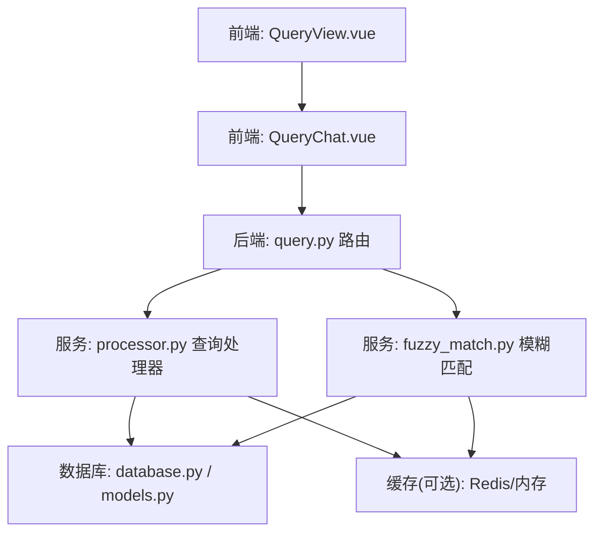
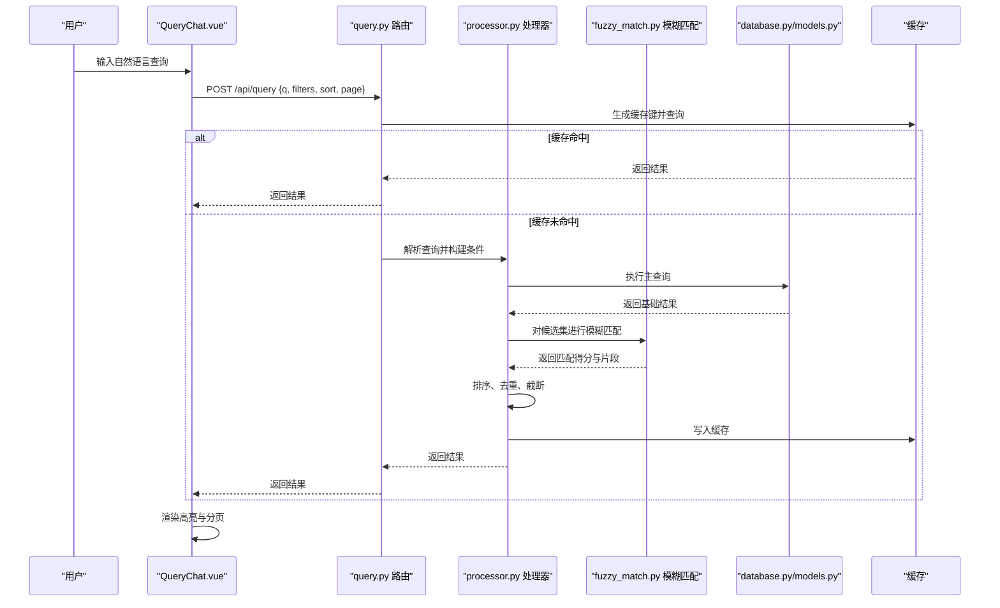
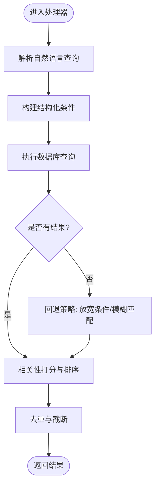
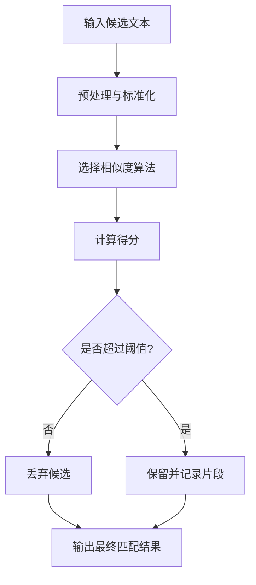
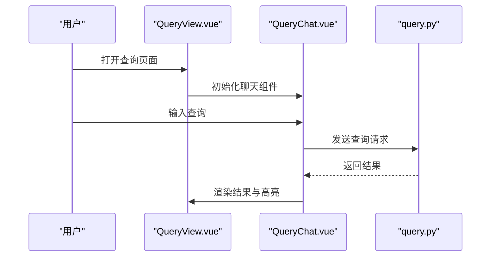
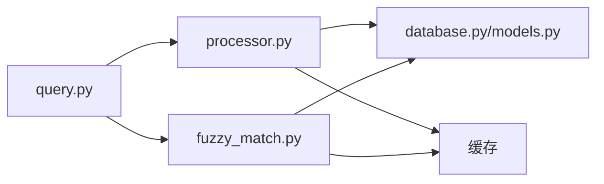

# 智能查询路由

<cite>
**本文引用的文件**   
- [backend/routers/query.py](file://backend/routers/query.py)
- [backend/services/fuzzy_match.py](file://backend/services/fuzzy_match.py)
- [backend/services/processor.py](file://backend/services/processor.py)
- [backend/models.py](file://backend/models.py)
- [backend/schemas.py](file://backend/schemas.py)
- [backend/database.py](file://backend/database.py)
- [frontend/src/components/QueryChat.vue](file://frontend/src/components/QueryChat.vue)
- [frontend/src/views/QueryView.vue](file://frontend/src/views/QueryView.vue)
</cite>

## 目录
1. [简介](#简介)
2. [项目结构](#项目结构)
3. [核心组件](#核心组件)
4. [架构总览](#架构总览)
5. [详细组件分析](#详细组件分析)
6. [依赖关系分析](#依赖关系分析)
7. [性能考虑](#性能考虑)
8. [故障排查指南](#故障排查指南)
9. [结论](#结论)
10. [附录](#附录)

## 简介
本文件面向“智能查询API路由”的完整实现与使用，覆盖自然语言查询、语义搜索、模糊匹配与结果排序等高级能力。文档从系统架构、数据流、处理逻辑到缓存与索引优化进行分层讲解，并提供可操作的查询语法示例、最佳实践以及常见问题定位方法，帮助开发者快速集成并调优查询体验。

## 项目结构
后端采用模块化设计：路由层负责请求解析与响应封装；服务层承载查询解析、模糊匹配与结果排序等业务逻辑；模型与数据库层提供数据访问与持久化；前端通过组件与视图调用查询接口并渲染高亮结果。

图表来源
- [backend/routers/query.py](file://backend/routers/query.py)
- [backend/services/processor.py](file://backend/services/processor.py)
- [backend/services/fuzzy_match.py](file://backend/services/fuzzy_match.py)
- [backend/database.py](file://backend/database.py)
- [backend/models.py](file://backend/models.py)
- [frontend/src/views/QueryView.vue](file://frontend/src/views/QueryView.vue)
- [frontend/src/components/QueryChat.vue](file://frontend/src/components/QueryChat.vue)

章节来源
- [backend/routers/query.py](file://backend/routers/query.py)
- [backend/services/processor.py](file://backend/services/processor.py)
- [backend/services/fuzzy_match.py](file://backend/services/fuzzy_match.py)
- [backend/database.py](file://backend/database.py)
- [backend/models.py](file://backend/models.py)
- [frontend/src/views/QueryView.vue](file://frontend/src/views/QueryView.vue)
- [frontend/src/components/QueryChat.vue](file://frontend/src/components/QueryChat.vue)

## 核心组件
- 查询路由（query.py）
  - 职责：接收HTTP请求，校验参数，调用查询处理器与模糊匹配服务，返回统一格式结果。
  - 关键点：分页、排序字段、过滤条件、高亮开关、缓存键生成。
- 查询处理器（processor.py）
  - 职责：解析自然语言查询，构建结构化查询条件，执行检索与排序，合并多源结果。
  - 关键点：分词、实体识别、条件组合、权重打分、去重与截断。
- 模糊匹配服务（fuzzy_match.py）
  - 职责：对文本片段进行相似度计算与近似匹配，支持编辑距离、N-gram或向量相似度策略。
  - 关键点：阈值控制、候选集裁剪、性能优化（预索引/并行）。
- 数据模型与数据库（models.py, database.py）
  - 职责：定义查询相关的数据结构与表映射，提供高效查询接口与连接池管理。
  - 关键点：索引设计、复合索引、全文索引、连接复用。
- 前端交互（QueryView.vue, QueryChat.vue）
  - 职责：用户输入、查询历史、结果展示与高亮渲染。
  - 关键点：防抖输入、增量加载、高亮片段提取、错误提示。

章节来源
- [backend/routers/query.py](file://backend/routers/query.py)
- [backend/services/processor.py](file://backend/services/processor.py)
- [backend/services/fuzzy_match.py](file://backend/services/fuzzy_match.py)
- [backend/models.py](file://backend/models.py)
- [backend/database.py](file://backend/database.py)
- [frontend/src/views/QueryView.vue](file://frontend/src/views/QueryView.vue)
- [frontend/src/components/QueryChat.vue](file://frontend/src/components/QueryChat.vue)

## 架构总览
下图展示了从前端发起查询到后端处理、检索与返回结果的完整流程，包括缓存命中、模糊匹配与结果排序的关键路径。

图表来源
- [backend/routers/query.py](file://backend/routers/query.py)
- [backend/services/processor.py](file://backend/services/processor.py)
- [backend/services/fuzzy_match.py](file://backend/services/fuzzy_match.py)
- [backend/database.py](file://backend/database.py)
- [backend/models.py](file://backend/models.py)
- [frontend/src/components/QueryChat.vue](file://frontend/src/components/QueryChat.vue)

## 详细组件分析

### 查询路由（query.py）
- 功能要点
  - 参数校验：查询字符串、过滤条件、排序字段、分页大小、是否启用高亮。
  - 缓存策略：基于查询内容、过滤与排序生成稳定缓存键，设置过期时间。
  - 错误处理：统一异常包装，返回标准错误码与消息。
- 关键流程
  - 接收请求 → 校验参数 → 检查缓存 → 调用处理器 → 组装响应。
- 性能建议
  - 合理设置分页上限，避免大结果集传输。
  - 对高频查询开启短TTL缓存，降低数据库压力。

章节来源
- [backend/routers/query.py](file://backend/routers/query.py)

### 查询处理器（processor.py）
- 功能要点
  - 自然语言解析：分词、实体抽取、意图识别，将自然语言转换为结构化查询条件。
  - 条件组合：支持AND/OR/NOT组合，字段级权重与范围过滤。
  - 排序与去重：按相关性得分排序，支持多字段排序与自定义权重。
- 算法流程

图表来源
- [backend/services/processor.py](file://backend/services/processor.py)

章节来源
- [backend/services/processor.py](file://backend/services/processor.py)

### 模糊匹配服务（fuzzy_match.py）
- 功能要点
  - 相似度计算：支持编辑距离、N-gram、向量相似度等多种策略。
  - 阈值控制：根据业务需求动态调整匹配阈值，平衡召回率与准确率。
  - 候选裁剪：先粗筛再精排，减少计算量。
- 典型流程

图表来源
- [backend/services/fuzzy_match.py](file://backend/services/fuzzy_match.py)

章节来源
- [backend/services/fuzzy_match.py](file://backend/services/fuzzy_match.py)

### 数据模型与数据库（models.py, database.py）
- 功能要点
  - 模型定义：查询结果实体、字段映射、约束与默认值。
  - 数据库操作：连接池、事务管理、索引优化、批量读写。
- 索引优化建议
  - 为常用过滤字段建立复合索引。
  - 对全文检索字段使用全文索引或倒排索引。
  - 避免过度索引导致写入性能下降。

章节来源
- [backend/models.py](file://backend/models.py)
- [backend/database.py](file://backend/database.py)

### 前端交互（QueryView.vue, QueryChat.vue）
- 功能要点
  - 输入处理：防抖、自动补全、历史记录。
  - 结果展示：分页、高亮片段、错误提示。
  - 性能优化：懒加载、虚拟滚动、增量更新。
- 交互流程

图表来源
- [frontend/src/views/QueryView.vue](file://frontend/src/views/QueryView.vue)
- [frontend/src/components/QueryChat.vue](file://frontend/src/components/QueryChat.vue)
- [backend/routers/query.py](file://backend/routers/query.py)

章节来源
- [frontend/src/views/QueryView.vue](file://frontend/src/views/QueryView.vue)
- [frontend/src/components/QueryChat.vue](file://frontend/src/components/QueryChat.vue)

## 依赖关系分析
- 模块耦合
  - 路由层依赖处理器与模糊匹配服务，低耦合便于扩展。
  - 处理器依赖数据库与缓存，需保证连接与缓存可用性。
- 外部依赖
  - 数据库驱动、缓存中间件、分词库、相似度计算库。
- 潜在风险
  - 循环依赖：确保服务层不反向依赖路由层。
  - 资源竞争：并发查询时需合理配置连接池与缓存锁。

图表来源
- [backend/routers/query.py](file://backend/routers/query.py)
- [backend/services/processor.py](file://backend/services/processor.py)
- [backend/services/fuzzy_match.py](file://backend/services/fuzzy_match.py)
- [backend/database.py](file://backend/database.py)
- [backend/models.py](file://backend/models.py)

章节来源
- [backend/routers/query.py](file://backend/routers/query.py)
- [backend/services/processor.py](file://backend/services/processor.py)
- [backend/services/fuzzy_match.py](file://backend/services/fuzzy_match.py)
- [backend/database.py](file://backend/database.py)
- [backend/models.py](file://backend/models.py)

## 性能考虑
- 查询解析优化
  - 预编译正则与模板，减少运行时开销。
  - 使用流式解析处理长文本，避免内存峰值。
- 索引优化
  - 针对高频查询字段建立复合索引。
  - 全文检索使用专用引擎或倒排索引。
- 缓存策略
  - 热点查询短TTL缓存，冷数据长TTL或归档。
  - 缓存键包含查询、过滤、排序与分页信息，避免脏读。
- 排序与分页
  - 限制最大分页大小，避免大结果集传输。
  - 使用游标分页替代偏移分页，提升大数据量性能。
- 模糊匹配优化
  - 先粗筛后精排，减少相似度计算次数。
  - 使用向量化或近似最近邻算法加速大规模匹配。

[本节为通用性能指导，无需特定文件引用]

## 故障排查指南
- 常见问题
  - 查询无结果：检查分词与实体识别是否正确，放宽条件或调整阈值。
  - 结果不准确：优化权重与排序策略，增加训练数据或调整相似度算法。
  - 性能瓶颈：监控数据库慢查询与缓存命中率，优化索引与缓存策略。
- 调试技巧
  - 启用详细日志，记录查询解析过程与SQL执行计划。
  - 使用A/B测试对比不同策略的效果。
  - 对模糊匹配进行单元测试，验证边界情况。

章节来源
- [backend/routers/query.py](file://backend/routers/query.py)
- [backend/services/processor.py](file://backend/services/processor.py)
- [backend/services/fuzzy_match.py](file://backend/services/fuzzy_match.py)

## 结论
智能查询路由通过自然语言解析、语义搜索、模糊匹配与结果排序等能力，为用户提供高效、准确的查询体验。通过合理的索引优化、缓存策略与性能调优，可在保证准确性的同时提升系统吞吐与响应速度。建议持续监控查询效果与系统指标，迭代优化算法与配置。

[本节为总结性内容，无需特定文件引用]

## 附录
- 查询语法示例
  - 基本查询：直接输入关键词，如“最近的项目进展”。
  - 条件组合：使用AND/OR/NOT组合条件，如“状态=进行中 AND 负责人=张三”。
  - 多字段搜索：指定字段与关键词，如“标题:会议 内容:预算”。
  - 模糊匹配：自动处理拼写错误与同义词，如“项木”匹配“项目”。
  - 结果排序：按时间、相关性或自定义权重排序，如“按时间降序”。
  - 高亮显示：在结果中高亮匹配片段，提升可读性。
- 最佳实践
  - 明确查询意图，使用简洁明确的关键词。
  - 合理使用过滤条件，避免过宽或过窄的查询。
  - 利用排序与分页控制结果范围。
  - 关注系统反馈，及时调整查询策略。

[本节为概念性内容，无需特定文件引用]