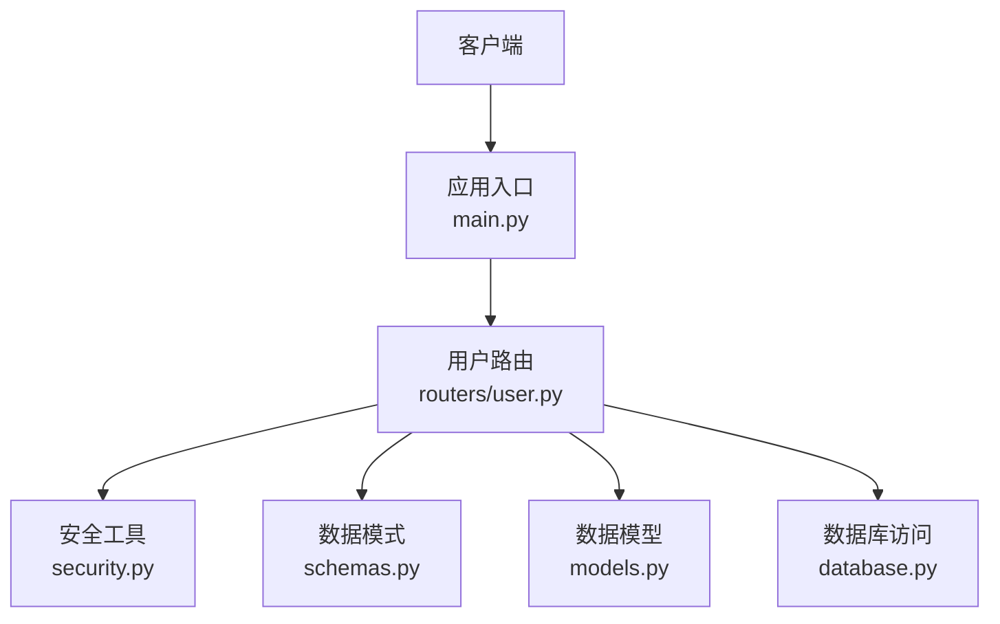
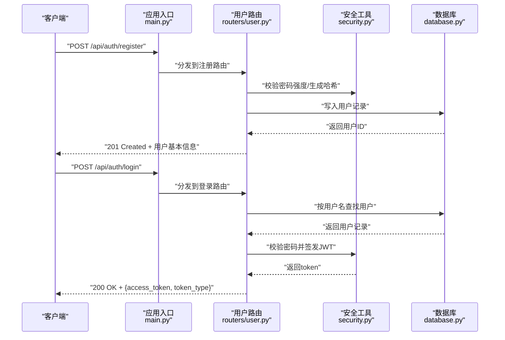
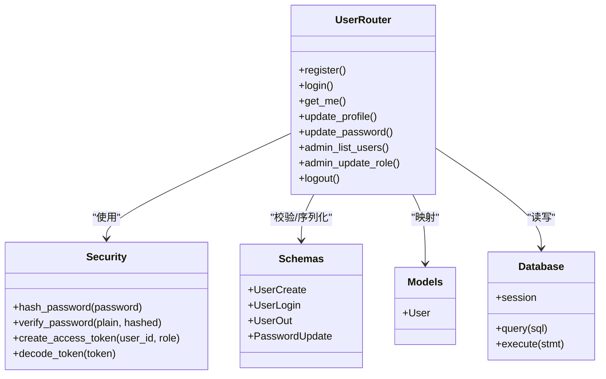

# 用户管理路由

<cite>
**本文引用的文件**   
- [backend/routers/user.py](file://backend/routers/user.py)
- [backend/security.py](file://backend/security.py)
- [backend/models.py](file://backend/models.py)
- [backend/schemas.py](file://backend/schemas.py)
- [backend/database.py](file://backend/database.py)
- [backend/main.py](file://backend/main.py)
</cite>

## 目录
1. [简介](#简介)
2. [项目结构](#项目结构)
3. [核心组件](#核心组件)
4. [架构总览](#架构总览)
5. [详细组件分析](#详细组件分析)
6. [依赖关系分析](#依赖关系分析)
7. [性能考虑](#性能考虑)
8. [故障排查指南](#故障排查指南)
9. [结论](#结论)
10. [附录](#附录)

## 简介
本文件面向后端用户管理API的路由与安全实现，聚焦用户注册、登录、身份验证与权限管理等核心能力。文档涵盖HTTP方法、URL路径、请求参数、响应格式、错误码处理与安全机制（JWT令牌、密码加密存储、会话/鉴权流程），并提供调用示例与最佳实践建议，帮助开发者快速集成与排障。

## 项目结构
用户管理相关代码主要位于后端模块中：
- 路由层：定义REST接口与请求处理逻辑
- 安全层：提供JWT签发/校验、密码哈希等工具
- 数据模型与Schema：定义数据库实体与请求/响应数据结构
- 数据库层：封装连接与会话管理
- 应用入口：挂载路由与中间件

图表来源
- [backend/main.py](file://backend/main.py)
- [backend/routers/user.py](file://backend/routers/user.py)
- [backend/security.py](file://backend/security.py)
- [backend/schemas.py](file://backend/schemas.py)
- [backend/models.py](file://backend/models.py)
- [backend/database.py](file://backend/database.py)

章节来源
- [backend/main.py](file://backend/main.py)
- [backend/routers/user.py](file://backend/routers/user.py)
- [backend/security.py](file://backend/security.py)
- [backend/schemas.py](file://backend/schemas.py)
- [backend/models.py](file://backend/models.py)
- [backend/database.py](file://backend/database.py)

## 核心组件
- 用户路由（routers/user.py）：暴露注册、登录、信息获取、密码更新、登出等接口；负责参数校验、业务编排与响应构造。
- 安全工具（security.py）：提供JWT签发与校验、密码哈希与比对、令牌过期策略等。
- 数据模式（schemas.py）：定义请求体与响应体的字段约束与类型。
- 数据模型（models.py）：定义用户表结构与ORM映射。
- 数据库（database.py）：封装连接、事务与查询执行。
- 应用入口（main.py）：注册路由、配置全局中间件（如CORS、认证中间件）。

章节来源
- [backend/routers/user.py](file://backend/routers/user.py)
- [backend/security.py](file://backend/security.py)
- [backend/schemas.py](file://backend/schemas.py)
- [backend/models.py](file://backend/models.py)
- [backend/database.py](file://backend/database.py)
- [backend/main.py](file://backend/main.py)

## 架构总览
下图展示从客户端到数据库的完整调用链路，以及JWT在鉴权中的流转。

图表来源
- [backend/main.py](file://backend/main.py)
- [backend/routers/user.py](file://backend/routers/user.py)
- [backend/security.py](file://backend/security.py)
- [backend/database.py](file://backend/database.py)

## 详细组件分析

### 用户注册接口
- HTTP方法与路径
  - POST /api/auth/register
- 请求体（参考 schemas.py）
  - username: 字符串，唯一
  - email: 字符串，邮箱格式
  - password: 字符串，最小长度限制
  - role: 可选，默认普通用户
- 响应
  - 成功：201 Created，返回用户基础信息（不含敏感字段）
  - 失败：400/409/500（见错误码说明）
- 安全机制
  - 密码使用强哈希算法存储（bcrypt/argon2）
  - 输入校验由Pydantic完成
- 典型调用示例
  - curl -X POST https://example.com/api/auth/register -H "Content-Type: application/json" -d '{"username":"alice","email":"alice@example.com","password":"StrongP@ss1"}'

章节来源
- [backend/routers/user.py](file://backend/routers/user.py)
- [backend/schemas.py](file://backend/schemas.py)
- [backend/security.py](file://backend/security.py)
- [backend/models.py](file://backend/models.py)
- [backend/database.py](file://backend/database.py)

### 用户登录接口
- HTTP方法与路径
  - POST /api/auth/login
- 请求体
  - username/email: 二选一
  - password: 字符串
- 响应
  - 成功：200 OK，返回 access_token、token_type（通常为Bearer）、expires_in
  - 失败：401 Unauthorized（凭证错误）、400 Bad Request（参数缺失）
- 安全机制
  - 密码比对使用安全哈希
  - JWT签发包含用户标识、角色、过期时间
  - 建议启用HTTPS与HttpOnly Cookie（若采用Cookie方案）
- 典型调用示例
  - curl -X POST https://example.com/api/auth/login -H "Content-Type: application/json" -d '{"username":"alice","password":"StrongP@ss1"}'

章节来源
- [backend/routers/user.py](file://backend/routers/user.py)
- [backend/security.py](file://backend/security.py)
- [backend/schemas.py](file://backend/schemas.py)
- [backend/database.py](file://backend/database.py)

### 获取当前用户信息
- HTTP方法与路径
  - GET /api/users/me
- 鉴权
  - 需要有效的Bearer Token
- 响应
  - 成功：200 OK，返回当前用户非敏感信息
  - 失败：401/403（未认证或无权限）
- 典型调用示例
  - curl -X GET https://example.com/api/users/me -H "Authorization: Bearer <token>"

章节来源
- [backend/routers/user.py](file://backend/routers/user.py)
- [backend/security.py](file://backend/security.py)

### 更新用户资料/密码
- HTTP方法与路径
  - PUT /api/users/me
  - PATCH /api/users/me/password
- 鉴权
  - 需要有效Token，且仅允许本人操作
- 请求体
  - 更新资料：name、avatar等可选字段
  - 修改密码：旧密码、新密码（需满足复杂度）
- 响应
  - 成功：200 OK，返回更新后的用户信息
  - 失败：400/401/403/409（冲突）
- 典型调用示例
  - curl -X PATCH https://example.com/api/users/me/password -H "Authorization: Bearer <token>" -H "Content-Type: application/json" -d '{"old_password":"OldP@ss1","new_password":"NewP@ss2!"}'

章节来源
- [backend/routers/user.py](file://backend/routers/user.py)
- [backend/schemas.py](file://backend/schemas.py)
- [backend/security.py](file://backend/security.py)

### 管理员权限管理（示例）
- HTTP方法与路径
  - GET /api/admin/users
  - PUT /api/admin/users/{user_id}/role
- 鉴权
  - 需要管理员角色（role=admin）
- 功能
  - 列出用户、变更用户角色
- 典型调用示例
  - curl -X PUT https://example.com/api/admin/users/123/role -H "Authorization: Bearer <admin_token>" -H "Content-Type: application/json" -d '{"role":"editor"}'

章节来源
- [backend/routers/user.py](file://backend/routers/user.py)
- [backend/security.py](file://backend/security.py)

### 登出接口
- HTTP方法与路径
  - POST /api/auth/logout
- 鉴权
  - 需要有效Token
- 行为
  - 服务端可维护黑名单或客户端主动丢弃Token
- 典型调用示例
  - curl -X POST https://example.com/api/auth/logout -H "Authorization: Bearer <token>"

章节来源
- [backend/routers/user.py](file://backend/routers/user.py)
- [backend/security.py](file://backend/security.py)

### 安全机制详解
- 密码存储
  - 使用不可逆哈希（bcrypt/argon2），禁止明文存储
- JWT令牌
  - 签发时包含子标识、角色、过期时间；建议短时效+刷新令牌
  - 传输建议使用HTTPS；前端可存于内存或HttpOnly Cookie
- 会话处理
  - 无状态鉴权为主；如需强制失效，可引入令牌黑名单或版本控制
- 输入校验
  - 使用Pydantic进行严格校验，避免注入与越权

章节来源
- [backend/security.py](file://backend/security.py)
- [backend/schemas.py](file://backend/schemas.py)

## 依赖关系分析
用户路由依赖安全工具、数据模式、数据模型与数据库层，应用入口统一挂载路由。

图表来源
- [backend/routers/user.py](file://backend/routers/user.py)
- [backend/security.py](file://backend/security.py)
- [backend/schemas.py](file://backend/schemas.py)
- [backend/models.py](file://backend/models.py)
- [backend/database.py](file://backend/database.py)

章节来源
- [backend/routers/user.py](file://backend/routers/user.py)
- [backend/security.py](file://backend/security.py)
- [backend/schemas.py](file://backend/schemas.py)
- [backend/models.py](file://backend/models.py)
- [backend/database.py](file://backend/database.py)

## 性能考虑
- 数据库索引
  - 对用户名、邮箱建立唯一索引，加速登录与注册查重
- 密码哈希
  - 合理设置bcrypt轮次，平衡安全性与CPU开销
- JWT
  - 短时效令牌配合刷新令牌，减少重放风险
- 限流与防暴力破解
  - 登录接口增加速率限制与账户锁定策略
- 缓存
  - 对频繁读取的用户信息可加短期缓存（注意一致性）

[本节为通用指导，不直接分析具体文件]

## 故障排查指南
- 常见错误码
  - 400 Bad Request：参数缺失或格式错误
  - 401 Unauthorized：未携带或无效Token、密码错误
  - 403 Forbidden：权限不足（非管理员访问管理接口）
  - 409 Conflict：用户名/邮箱已存在
  - 500 Internal Server Error：服务器内部错误
- 排查步骤
  - 检查请求头Authorization是否包含Bearer Token
  - 确认Token未过期且未被吊销
  - 核对密码复杂度与历史重复策略
  - 查看数据库唯一约束与索引
  - 开启调试日志定位异常堆栈

章节来源
- [backend/routers/user.py](file://backend/routers/user.py)
- [backend/security.py](file://backend/security.py)

## 结论
用户管理路由围绕注册、登录、鉴权与权限控制构建，结合JWT与密码哈希保障安全。通过严格的输入校验、合理的错误码与完善的鉴权中间件，形成稳定可靠的认证授权体系。建议在生产环境启用HTTPS、令牌黑名单、速率限制与审计日志，进一步提升安全性与可观测性。

## 附录

### API一览与调用要点
- 注册
  - POST /api/auth/register
  - 必填：username、email、password
  - 成功：201 Created
- 登录
  - POST /api/auth/login
  - 必填：username/email、password
  - 成功：200 OK，返回access_token
- 获取当前用户
  - GET /api/users/me
  - 鉴权：Bearer Token
- 更新资料
  - PUT /api/users/me
  - 鉴权：本人
- 修改密码
  - PATCH /api/users/me/password
  - 鉴权：本人
- 管理员列表用户
  - GET /api/admin/users
  - 鉴权：admin
- 管理员修改角色
  - PUT /api/admin/users/{user_id}/role
  - 鉴权：admin
- 登出
  - POST /api/auth/logout
  - 鉴权：Bearer Token

章节来源
- [backend/routers/user.py](file://backend/routers/user.py)
- [backend/schemas.py](file://backend/schemas.py)
- [backend/security.py](file://backend/security.py)