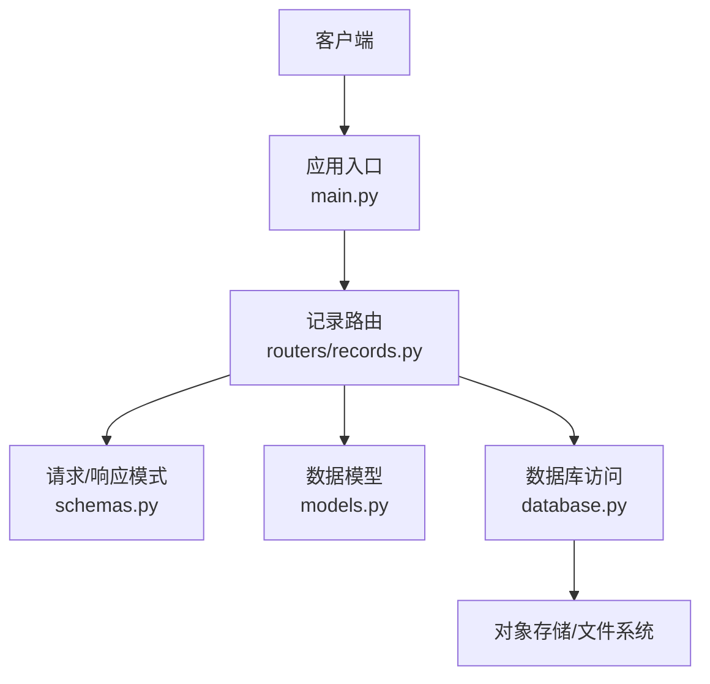
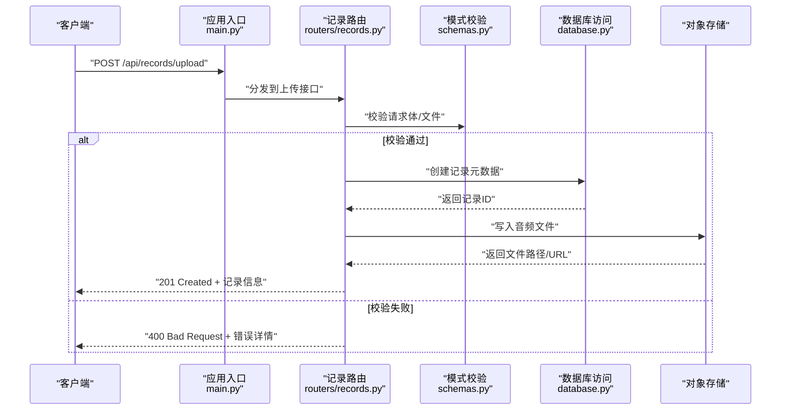
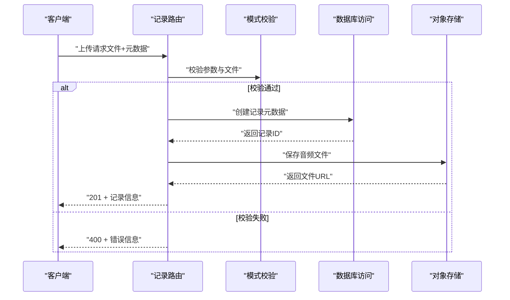
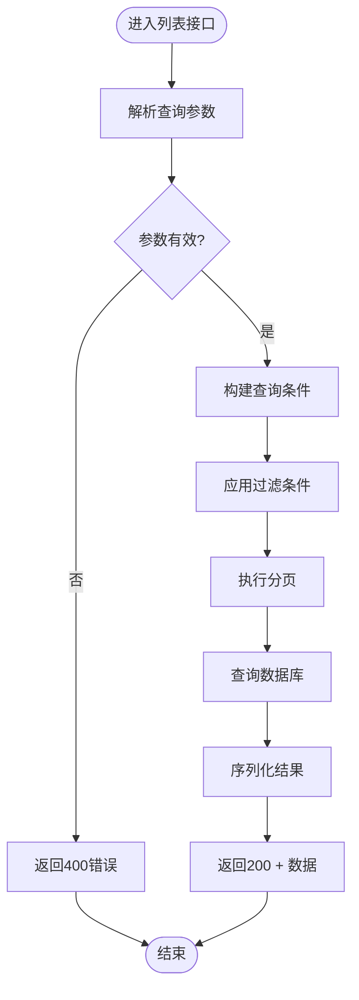
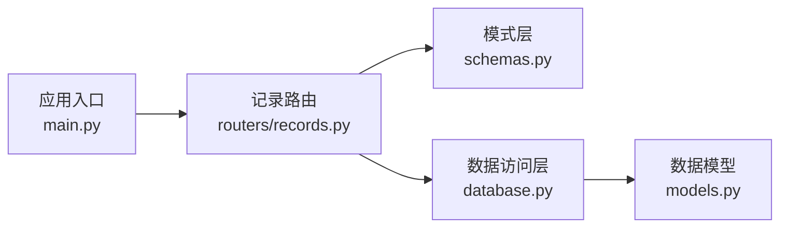

# 记录管理路由

<cite>
**本文档引用的文件**
- [backend/routers/records.py](file://backend/routers/records.py)
- [backend/models.py](file://backend/models.py)
- [backend/schemas.py](file://backend/schemas.py)
- [backend/database.py](file://backend/database.py)
- [backend/main.py](file://backend/main.py)
</cite>

## 目录
1. [简介](#简介)
2. [项目结构](#项目结构)
3. [核心组件](#核心组件)
4. [架构总览](#架构总览)
5. [详细组件分析](#详细组件分析)
6. [依赖关系分析](#依赖关系分析)
7. [性能考虑](#性能考虑)
8. [故障排查指南](#故障排查指南)
9. [结论](#结论)
10. [附录](#附录)

## 简介
本文件面向“记录管理”API，围绕音频记录的完整生命周期（上传、存储、检索、更新、删除）提供全面文档。内容涵盖：
- 文件上传处理与校验（格式、大小、类型）
- 元数据管理与持久化
- 搜索过滤与分页查询
- 更新与删除操作
- 错误处理策略与最佳实践

该API基于后端路由模块组织，结合数据模型、请求响应模式与数据库访问层实现端到端的数据流。

## 项目结构
记录管理相关代码主要位于后端模块中，关键文件如下：
- 路由定义：backend/routers/records.py
- 数据模型：backend/models.py
- 请求/响应模式：backend/schemas.py
- 数据库连接与会话：backend/database.py
- 应用入口与路由挂载：backend/main.py

图表来源
- [backend/main.py](file://backend/main.py)
- [backend/routers/records.py](file://backend/routers/records.py)
- [backend/schemas.py](file://backend/schemas.py)
- [backend/models.py](file://backend/models.py)
- [backend/database.py](file://backend/database.py)

章节来源
- [backend/routers/records.py](file://backend/routers/records.py)
- [backend/models.py](file://backend/models.py)
- [backend/schemas.py](file://backend/schemas.py)
- [backend/database.py](file://backend/database.py)
- [backend/main.py](file://backend/main.py)

## 核心组件
- 路由层（records.py）：定义RESTful接口，负责参数校验、业务编排、调用服务与返回结果。
- 模式层（schemas.py）：定义请求体与响应体的数据结构，用于Pydantic校验与序列化。
- 模型层（models.py）：定义数据库表结构与ORM映射。
- 数据访问层（database.py）：封装数据库连接、会话管理与事务控制。
- 应用入口（main.py）：注册路由、配置中间件与应用级设置。

章节来源
- [backend/routers/records.py](file://backend/routers/records.py)
- [backend/schemas.py](file://backend/schemas.py)
- [backend/models.py](file://backend/models.py)
- [backend/database.py](file://backend/database.py)
- [backend/main.py](file://backend/main.py)

## 架构总览
记录管理的整体流程从客户端发起HTTP请求开始，经应用入口路由到记录路由，路由层进行参数校验后调用数据访问层完成持久化或查询，最终将结果序列化为响应返回。

图表来源
- [backend/main.py](file://backend/main.py)
- [backend/routers/records.py](file://backend/routers/records.py)
- [backend/schemas.py](file://backend/schemas.py)
- [backend/database.py](file://backend/database.py)

## 详细组件分析

### 路由层：记录管理接口
- 上传接口
  - 方法：POST
  - 路径：/api/records/upload
  - 功能：接收音频文件与元数据，进行格式与大小校验，持久化元数据并存储文件，返回记录信息。
  - 输入：multipart/form-data，包含文件字段与可选元数据字段。
  - 输出：记录ID、文件URL、状态码201。
- 列表与搜索
  - 方法：GET
  - 路径：/api/records
  - 功能：支持按时间范围、标签、关键词等条件过滤，并提供分页。
  - 输入：查询参数（page、size、keyword、tags、date_from、date_to）。
  - 输出：记录集合、总数、分页信息。
- 详情获取
  - 方法：GET
  - 路径：/api/records/{id}
  - 功能：根据ID获取记录详情及文件下载链接。
- 更新
  - 方法：PUT/PATCH
  - 路径：/api/records/{id}
  - 功能：更新元数据（标题、描述、标签等），不覆盖文件。
- 删除
  - 方法：DELETE
  - 路径：/api/records/{id}
  - 功能：软删除或硬删除记录，并清理关联文件。

章节来源
- [backend/routers/records.py](file://backend/routers/records.py)

### 模式层：请求与响应结构
- 上传请求模式
  - 字段：file（二进制）、title（可选）、description（可选）、tags（可选数组）
  - 校验：必填字段、类型检查、长度限制
- 列表查询模式
  - 字段：page（默认1）、size（默认20）、keyword（可选）、tags（可选数组）、date_from（可选）、date_to（可选）
  - 校验：分页边界、日期格式
- 响应模式
  - 记录项：id、title、description、tags、created_at、updated_at、file_url
  - 分页：total、page、size、has_next、has_prev

章节来源
- [backend/schemas.py](file://backend/schemas.py)

### 模型层：数据表与关系
- 记录表
  - 字段：id（主键）、title、description、tags（JSON或关联表）、file_path、status、created_at、updated_at
- 索引与约束
  - 对常用查询字段建立索引（如created_at、tags）
  - 唯一性约束（如需要）

章节来源
- [backend/models.py](file://backend/models.py)

### 数据访问层：数据库与会话
- 连接管理
  - 初始化引擎、会话工厂
  - 上下文管理器确保会话关闭
- 事务控制
  - 提交与回滚策略
  - 异常捕获与日志记录
- 常用操作
  - 插入记录、更新元数据、删除记录
  - 条件查询与分页

章节来源
- [backend/database.py](file://backend/database.py)

### 应用入口：路由挂载与中间件
- 路由注册
  - 将记录路由挂载到/api前缀下
- 中间件
  - 全局异常处理、请求日志、跨域配置
- 配置项
  - 文件上传大小限制、存储路径、超时设置

章节来源
- [backend/main.py](file://backend/main.py)

### 上传流程时序图

图表来源
- [backend/routers/records.py](file://backend/routers/records.py)
- [backend/schemas.py](file://backend/schemas.py)
- [backend/database.py](file://backend/database.py)

### 列表与搜索流程图

图表来源
- [backend/routers/records.py](file://backend/routers/records.py)
- [backend/database.py](file://backend/database.py)

### 更新与删除流程
- 更新
  - 校验请求体
  - 查找记录
  - 更新元数据
  - 提交事务
  - 返回更新后的记录
- 删除
  - 校验ID存在
  - 软删除或硬删除
  - 清理关联文件
  - 返回成功或错误

章节来源
- [backend/routers/records.py](file://backend/routers/records.py)
- [backend/database.py](file://backend/database.py)

## 依赖关系分析
- 路由层依赖模式层进行参数校验
- 路由层依赖数据访问层进行CRUD操作
- 数据访问层依赖数据库连接与会话管理
- 应用入口统一注册路由与中间件

图表来源
- [backend/routers/records.py](file://backend/routers/records.py)
- [backend/schemas.py](file://backend/schemas.py)
- [backend/database.py](file://backend/database.py)
- [backend/models.py](file://backend/models.py)
- [backend/main.py](file://backend/main.py)

章节来源
- [backend/routers/records.py](file://backend/routers/records.py)
- [backend/schemas.py](file://backend/schemas.py)
- [backend/database.py](file://backend/database.py)
- [backend/models.py](file://backend/models.py)
- [backend/main.py](file://backend/main.py)

## 性能考虑
- 文件上传
  - 使用分块上传与断点续传提升大文件稳定性
  - 异步处理文件转码与缩略图生成
- 数据库查询
  - 为高频查询字段建立索引
  - 使用分页减少单次返回数据量
- 缓存策略
  - 热点记录与搜索结果缓存
  - 文件URL短期缓存
- 存储优化
  - 对象存储分桶与命名规范
  - 压缩与格式转换降低存储成本

[本节为通用指导，无需特定文件引用]

## 故障排查指南
- 上传失败
  - 检查文件格式与大小限制
  - 查看对象存储权限与路径
  - 确认数据库事务是否提交
- 查询无结果
  - 验证查询参数合法性
  - 检查索引与数据一致性
  - 确认分页参数范围
- 更新/删除异常
  - 核对记录ID是否存在
  - 检查并发冲突与锁机制
  - 查看日志中的错误堆栈

章节来源
- [backend/routers/records.py](file://backend/routers/records.py)
- [backend/database.py](file://backend/database.py)

## 结论
记录管理API提供了完整的音频记录生命周期管理能力，涵盖上传、存储、检索、更新与删除。通过清晰的分层架构与严格的参数校验，确保了系统的健壮性与可维护性。建议在生产环境中加强监控、备份与安全防护措施。

[本节为总结性内容，无需特定文件引用]

## 附录
- 常见错误码
  - 400：请求参数无效
  - 404：资源不存在
  - 413：文件过大
  - 500：服务器内部错误
- 最佳实践
  - 始终校验用户输入
  - 使用事务保证数据一致性
  - 记录关键操作日志
  - 定期备份与恢复演练

[本节为补充信息，无需特定文件引用]