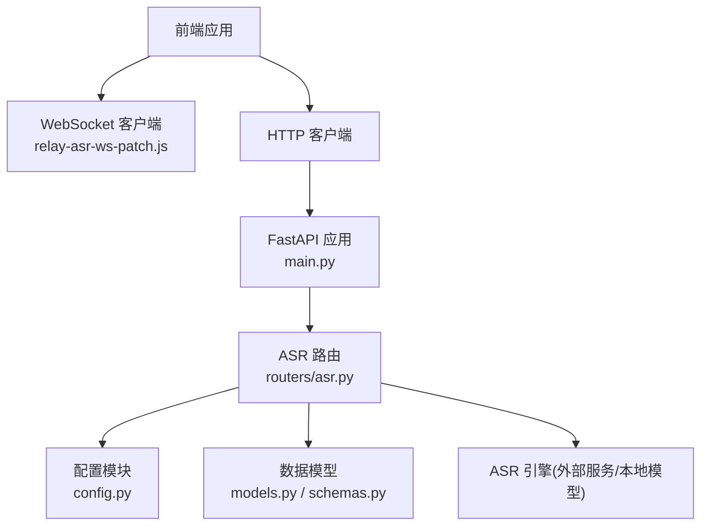
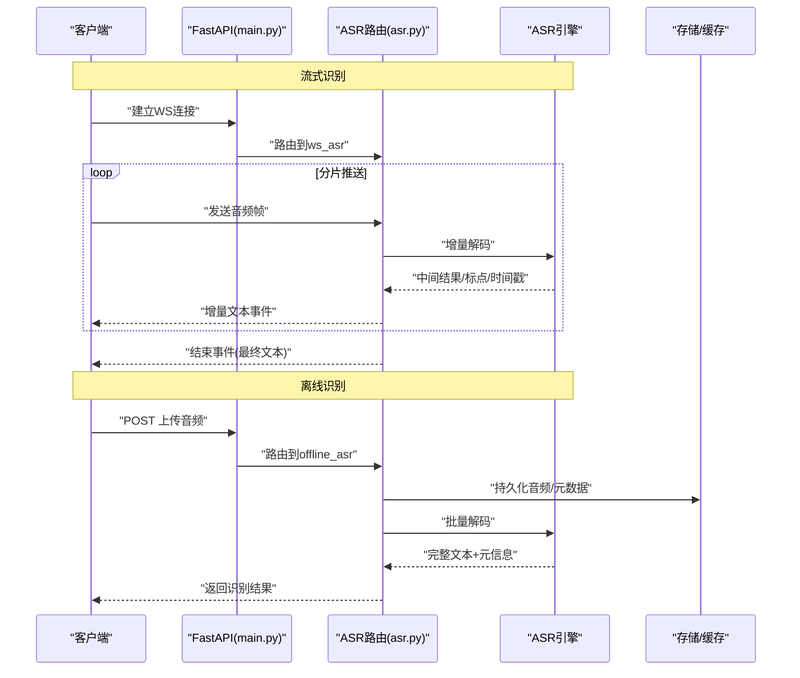
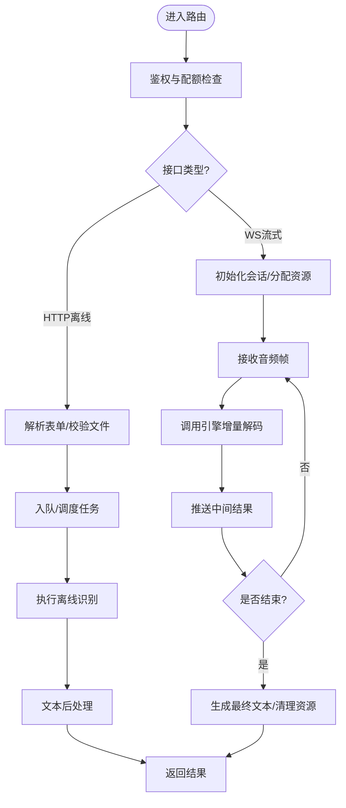
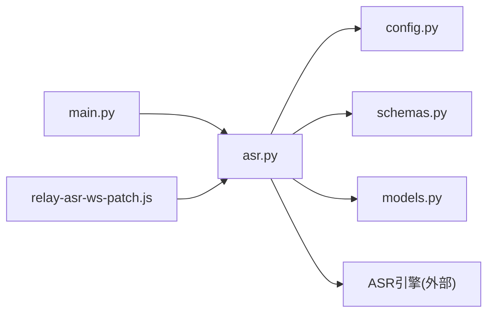

# 语音识别路由

<cite>
**本文引用的文件**   
- [backend/routers/asr.py](file://backend/routers/asr.py)
- [backend/main.py](file://backend/main.py)
- [backend/config.py](file://backend/config.py)
- [backend/models.py](file://backend/models.py)
- [backend/schemas.py](file://backend/schemas.py)
- [data/relay-asr-ws-patch.js](file://data/relay-asr-ws-patch.js)
</cite>

## 目录
1. [简介](#简介)
2. [项目结构](#项目结构)
3. [核心组件](#核心组件)
4. [架构总览](#架构总览)
5. [详细组件分析](#详细组件分析)
6. [依赖关系分析](#依赖关系分析)
7. [性能考量](#性能考量)
8. [故障排查指南](#故障排查指南)
9. [结论](#结论)
10. [附录](#附录)

## 简介
本文件面向后端 ASR（自动语音识别）API 路由，系统性说明实时流式转写、离线音频识别、多语言与方言支持、以及文本后处理等能力。文档同时覆盖音频预处理、声学模型与语言模型的集成点、配置项与使用示例，帮助开发者快速接入并优化识别效果。

## 项目结构
后端采用模块化路由设计，ASR 相关逻辑集中在路由层与配置/模型定义中；前端通过 WebSocket 补丁脚本与后端进行流式交互。关键文件如下：
- 路由入口与注册：backend/main.py、backend/routers/asr.py
- 配置与数据模型：backend/config.py、backend/models.py、backend/schemas.py
- 前端流式辅助：data/relay-asr-ws-patch.js

图表来源
- [backend/main.py](file://backend/main.py)
- [backend/routers/asr.py](file://backend/routers/asr.py)
- [backend/config.py](file://backend/config.py)
- [backend/models.py](file://backend/models.py)
- [backend/schemas.py](file://backend/schemas.py)
- [data/relay-asr-ws-patch.js](file://data/relay-asr-ws-patch.js)

章节来源
- [backend/main.py](file://backend/main.py)
- [backend/routers/asr.py](file://backend/routers/asr.py)
- [backend/config.py](file://backend/config.py)
- [backend/models.py](file://backend/models.py)
- [backend/schemas.py](file://backend/schemas.py)
- [data/relay-asr-ws-patch.js](file://data/relay-asr-ws-patch.js)

## 核心组件
- ASR 路由模块：提供 REST 与 WebSocket 接口，封装流式与离线识别流程，统一参数校验与错误返回。
- 配置模块：集中管理 ASR 引擎地址、超时、并发、采样率、VAD/降噪开关、热词与语言设置等。
- 数据模型与 Schema：定义请求/响应体结构、枚举值（如语言代码、任务类型）、字段约束与默认值。
- 前端 WebSocket 补丁：用于浏览器端稳定建立与转发 ASR 流式帧，处理重连与缓冲策略。

章节来源
- [backend/routers/asr.py](file://backend/routers/asr.py)
- [backend/config.py](file://backend/config.py)
- [backend/models.py](file://backend/models.py)
- [backend/schemas.py](file://backend/schemas.py)
- [data/relay-asr-ws-patch.js](file://data/relay-asr-ws-patch.js)

## 架构总览
ASR 系统由“前端采集 → 网络传输 → 路由编排 → 引擎推理 → 结果回传”组成。流式路径以 WebSocket 为主，离线路径以 HTTP 上传音频文件为主。

图表来源
- [backend/main.py](file://backend/main.py)
- [backend/routers/asr.py](file://backend/routers/asr.py)
- [backend/config.py](file://backend/config.py)
- [backend/models.py](file://backend/models.py)
- [backend/schemas.py](file://backend/schemas.py)
- [data/relay-asr-ws-patch.js](file://data/relay-asr-ws-patch.js)

## 详细组件分析

### ASR 路由模块（asr.py）
- 职责
  - 暴露 REST 接口：离线音频上传与识别、查询任务状态、获取结果。
  - 暴露 WebSocket 接口：流式音频帧接收与增量文本推送。
  - 参数校验：基于 Pydantic Schema 对输入进行强约束（采样率、编码格式、语言码、热词列表等）。
  - 错误处理：统一异常捕获、重试与降级策略（如引擎不可用时的队列化或限流）。
- 关键流程
  - 流式识别：接收分片帧 → 维护会话上下文 → 调用引擎增量解码 → 推送中间结果与最终结果。
  - 离线识别：接收音频文件 → 写入临时存储 → 提交异步任务 → 轮询/回调返回结果。
  - 多语言/方言：根据请求参数选择对应语言包与方言适配规则（如音素映射、词典替换）。
  - 文本后处理：标点恢复、数字规范化、敏感词过滤、术语替换、说话人分段合并。

图表来源
- [backend/routers/asr.py](file://backend/routers/asr.py)
- [backend/schemas.py](file://backend/schemas.py)
- [backend/config.py](file://backend/config.py)

章节来源
- [backend/routers/asr.py](file://backend/routers/asr.py)
- [backend/schemas.py](file://backend/schemas.py)

### 配置模块（config.py）
- 作用
  - 集中管理 ASR 引擎连接、超时、并发、批大小、采样率、VAD/降噪开关、热词与语言配置。
  - 提供运行时可重载的配置项，便于灰度与 A/B 测试。
- 关键项（示例类别）
  - 引擎地址与认证、最大并发与队列长度
  - 流式帧大小、超时与心跳间隔
  - 语言与方言映射、热词表路径
  - 文本后处理开关（标点恢复、数字规范化、敏感词过滤）

章节来源
- [backend/config.py](file://backend/config.py)

### 数据模型与 Schema（models.py / schemas.py）
- 作用
  - 定义统一的请求/响应结构，确保前后端契约一致。
  - 包含枚举（如语言代码、任务类型）、必填字段与默认值。
- 典型结构
  - 流式会话：会话ID、语言、热词、采样率、静音阈值等。
  - 离线任务：音频文件、语言、任务类型、后处理选项。
  - 结果对象：文本、时间戳、置信度、说话人、片段边界。

章节来源
- [backend/models.py](file://backend/models.py)
- [backend/schemas.py](file://backend/schemas.py)

### 前端 WebSocket 补丁（relay-asr-ws-patch.js）
- 作用
  - 在浏览器端封装 WebSocket 连接、断线重连、背压控制与帧打包。
  - 将麦克风采集的 PCM/Opus 帧按约定格式发送到后端 ASR 路由。
- 关键点
  - 心跳与保活、错误重试、缓冲上限与丢弃策略。
  - 与后端协议对齐（帧头、载荷、结束标志）。

章节来源
- [data/relay-asr-ws-patch.js](file://data/relay-asr-ws-patch.js)

## 依赖关系分析
- 路由层依赖配置与 Schema，保证参数安全与一致性。
- 路由层与 ASR 引擎解耦，可通过配置切换不同实现（云端/本地）。
- 前端通过标准化协议与后端通信，降低耦合度。

图表来源
- [backend/main.py](file://backend/main.py)
- [backend/routers/asr.py](file://backend/routers/asr.py)
- [backend/config.py](file://backend/config.py)
- [backend/models.py](file://backend/models.py)
- [backend/schemas.py](file://backend/schemas.py)
- [data/relay-asr-ws-patch.js](file://data/relay-asr-ws-patch.js)

章节来源
- [backend/main.py](file://backend/main.py)
- [backend/routers/asr.py](file://backend/routers/asr.py)
- [backend/config.py](file://backend/config.py)
- [backend/models.py](file://backend/models.py)
- [backend/schemas.py](file://backend/schemas.py)
- [data/relay-asr-ws-patch.js](file://data/relay-asr-ws-patch.js)

## 性能考量
- 流式识别
  - 合理设置帧大小与采样率，平衡延迟与带宽。
  - 启用 VAD/降噪以减少无效帧，降低引擎负载。
  - 使用增量解码与早停策略，提升首字延迟。
- 离线识别
  - 批量处理与并行任务队列，提高吞吐。
  - 音频预转换（重采样/去静音）减少冗余计算。
- 文本后处理
  - 开启标点恢复与数字规范化，提升可读性。
  - 热词与领域词典显著提升专有名词准确率。
- 资源与稳定性
  - 限制并发与队列长度，防止 OOM 与雪崩。
  - 心跳与超时保护，及时释放会话资源。

[本节为通用指导，不直接分析具体文件]

## 故障排查指南
- 常见问题
  - 流式连接频繁断开：检查前端重连策略与后端心跳/超时配置。
  - 识别延迟高：调整帧大小、关闭非必要后处理、增加引擎并发。
  - 多语言/方言不准确：确认语言码映射与热词表加载是否正确。
  - 内存/CPU 飙升：限制并发、减小批大小、启用 VAD 与降噪。
- 定位方法
  - 查看路由日志与引擎健康检查接口。
  - 抓取前端 WebSocket 帧统计与丢包率。
  - 对比不同采样率与编码格式的效果差异。

章节来源
- [backend/routers/asr.py](file://backend/routers/asr.py)
- [backend/config.py](file://backend/config.py)
- [data/relay-asr-ws-patch.js](file://data/relay-asr-ws-patch.js)

## 结论
本路由模块将 ASR 的核心能力（流式与离线、多语言/方言、文本后处理）以清晰的接口暴露给前端与服务端其他模块。通过合理的配置与工程实践，可在延迟、准确率与资源占用之间取得良好平衡。建议在生产环境结合监控与压测持续优化。

[本节为总结性内容，不直接分析具体文件]

## 附录

### 识别配置示例（概念性）
- 流式识别
  - 语言：zh-CN / en-US / yue-HK（粤语）
  - 采样率：16kHz
  - 帧大小：640~1280 字节
  - VAD：开启
  - 热词：["产品名A","术语B"]
  - 后处理：标点恢复、数字规范化、敏感词过滤
- 离线识别
  - 任务类型：full_transcript
  - 语言：同上
  - 后处理：同流式
  - 输出：文本 + 时间戳 + 置信度 + 说话人分段

[本节为概念性示例，不直接分析具体文件]

### 技术细节要点
- 音频预处理
  - 重采样至目标采样率、单声道、归一化音量。
  - VAD 检测静音段，剔除无效帧。
  - 可选降噪与回声消除。
- 声学模型
  - 增量解码与全量解码两种模式。
  - 支持多语言/方言权重与热词汇优先级。
- 语言模型
  - 语法/短语模板、领域词典注入。
  - 后处理阶段进行拼写校正与术语替换。
- 文本后处理
  - 标点恢复、数字/单位规范化、大小写修正。
  - 敏感词过滤与脱敏、段落合并与分段。

[本节为通用技术说明，不直接分析具体文件]