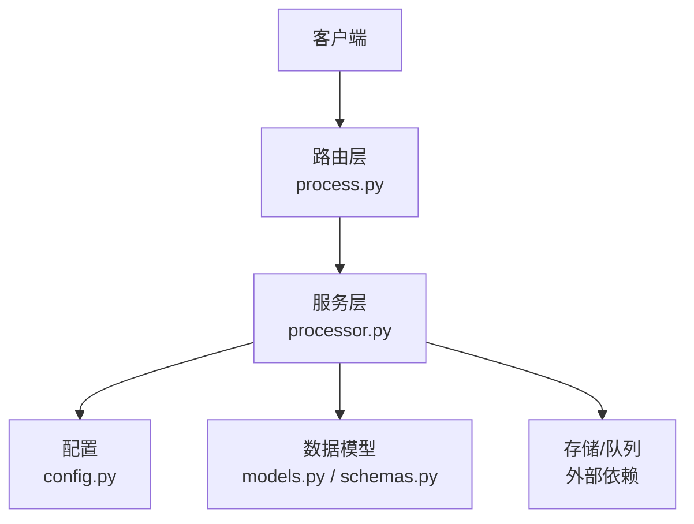
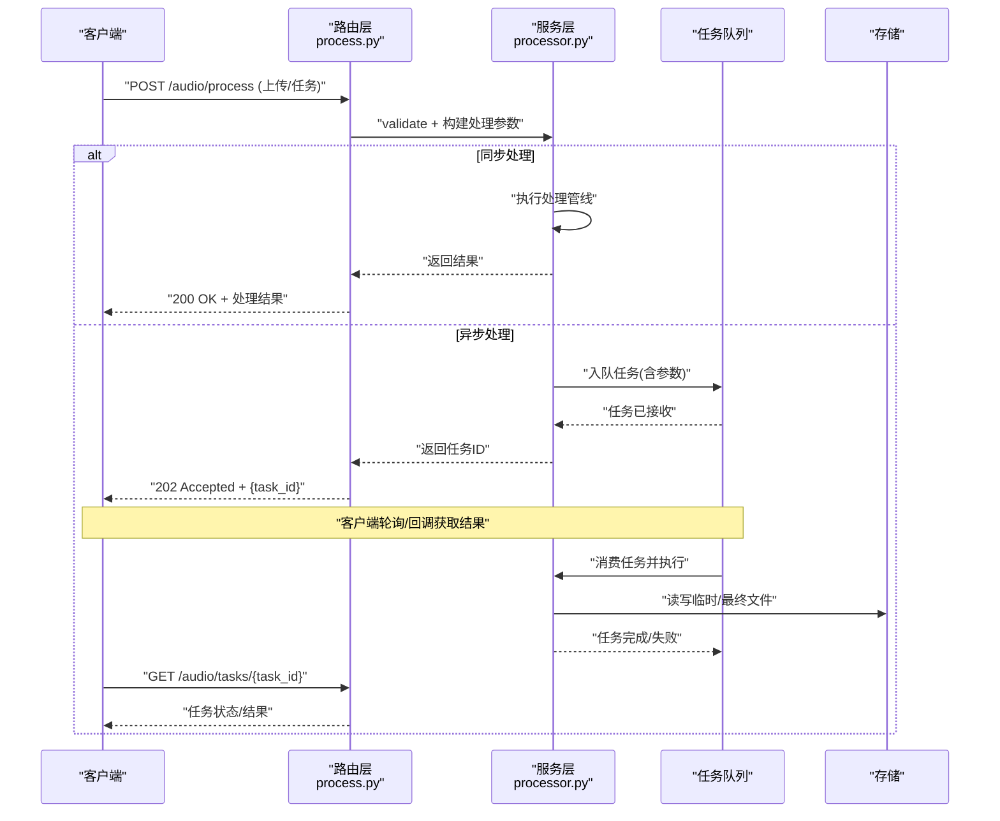
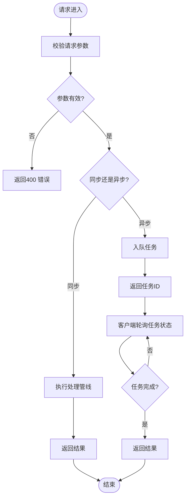
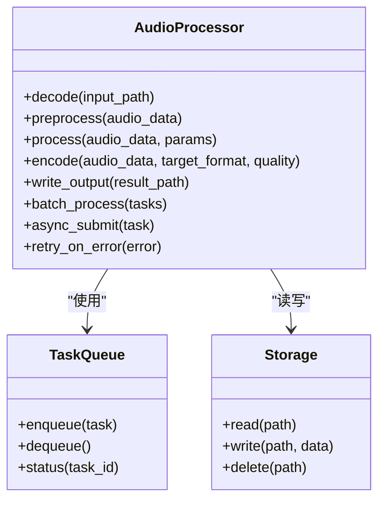
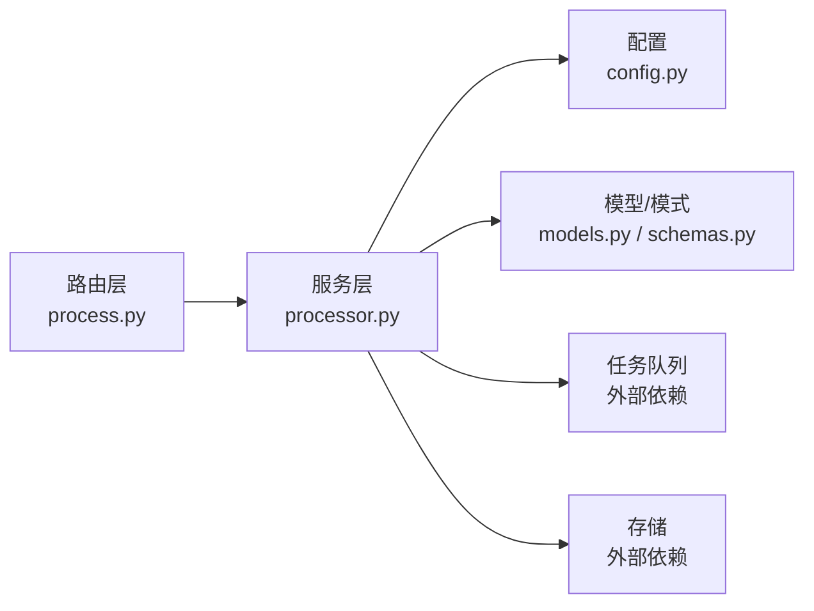

# 音频处理路由

<cite>
**本文引用的文件**   
- [backend/routers/process.py](file://backend/routers/process.py)
- [backend/services/processor.py](file://backend/services/processor.py)
- [backend/main.py](file://backend/main.py)
- [backend/config.py](file://backend/config.py)
- [backend/models.py](file://backend/models.py)
- [backend/schemas.py](file://backend/schemas.py)
</cite>

## 目录
1. [简介](#简介)
2. [项目结构](#项目结构)
3. [核心组件](#核心组件)
4. [架构总览](#架构总览)
5. [详细组件分析](#详细组件分析)
6. [依赖关系分析](#依赖关系分析)
7. [性能考量](#性能考量)
8. [故障排查指南](#故障排查指南)
9. [结论](#结论)
10. [附录](#附录)

## 简介
本文件面向生产环境的音频处理API路由，覆盖转码、压缩、格式转换与质量优化等基础能力，以及音频分析、噪声消除、音量标准化与元数据提取等高级处理能力。文档同时提供批处理、异步处理与错误恢复的端到端流程示例，帮助开发者快速集成与落地。

## 项目结构
后端采用分层设计：路由层负责HTTP接口定义与参数校验；服务层封装音频处理逻辑；配置与模型用于系统设置与数据契约。关键文件如下：
- 路由层：process.py 暴露音频处理相关API
- 服务层：processor.py 实现具体音频处理管线
- 应用入口：main.py 注册路由与中间件
- 配置：config.py 管理运行时参数（如并发、队列、存储路径）
- 模型与模式：models.py、schemas.py 定义数据结构与请求响应体

图表来源 
- [backend/routers/process.py](file://backend/routers/process.py)
- [backend/services/processor.py](file://backend/services/processor.py)
- [backend/main.py](file://backend/main.py)
- [backend/config.py](file://backend/config.py)
- [backend/models.py](file://backend/models.py)
- [backend/schemas.py](file://backend/schemas.py)

章节来源
- [backend/main.py](file://backend/main.py)
- [backend/routers/process.py](file://backend/routers/process.py)
- [backend/services/processor.py](file://backend/services/processor.py)
- [backend/config.py](file://backend/config.py)
- [backend/models.py](file://backend/models.py)
- [backend/schemas.py](file://backend/schemas.py)

## 核心组件
- 音频处理路由（process.py）
  - 定义上传、转码、压缩、格式转换、质量优化、分析、降噪、音量标准化、元数据提取等接口
  - 支持同步与异步两种调用方式，统一返回任务ID或结果
- 音频处理服务（processor.py）
  - 编排处理管线：解码→预处理→处理→编码→输出
  - 提供批处理与异步任务调度能力
  - 内置错误分类与重试策略
- 配置与数据契约（config.py, models.py, schemas.py）
  - 配置项包括并发度、队列大小、临时目录、编码器参数、质量阈值等
  - 模式定义请求/响应体字段，确保前后端一致

章节来源
- [backend/routers/process.py](file://backend/routers/process.py)
- [backend/services/processor.py](file://backend/services/processor.py)
- [backend/config.py](file://backend/config.py)
- [backend/models.py](file://backend/models.py)
- [backend/schemas.py](file://backend/schemas.py)

## 架构总览
整体架构遵循“路由-服务-配置/模型”的分层模式，结合任务队列与存储实现高吞吐与可扩展性。

图表来源 
- [backend/routers/process.py](file://backend/routers/process.py)
- [backend/services/processor.py](file://backend/services/processor.py)
- [backend/main.py](file://backend/main.py)

## 详细组件分析

### 路由层：音频处理API（process.py）
- 功能要点
  - 上传与任务创建：支持单文件上传与批量提交
  - 同步处理：直接返回处理后的音频文件或JSON结果
  - 异步处理：返回任务ID，支持查询任务状态与结果
  - 参数校验：基于schemas定义，确保必填字段、类型与范围正确
- 典型接口
  - 音频处理（同步/异步）
  - 任务状态查询
  - 批量任务提交
- 错误处理
  - 输入校验失败返回4xx
  - 处理异常返回5xx并附带错误码与消息
  - 超时与资源不足时返回可重试提示

图表来源 
- [backend/routers/process.py](file://backend/routers/process.py)

章节来源
- [backend/routers/process.py](file://backend/routers/process.py)
- [backend/schemas.py](file://backend/schemas.py)

### 服务层：音频处理管线（processor.py）
- 管线阶段
  - 解码：支持多格式输入（如MP3、WAV、FLAC、AAC等）
  - 预处理：重采样、声道数调整、静音裁剪
  - 处理：转码、压缩、格式转换、质量优化、噪声消除、音量标准化、元数据提取与分析
  - 编码：按目标格式与质量参数编码输出
  - 输出：写入临时目录或持久化存储，生成下载链接或二进制流
- 批处理与异步
  - 批处理：将多个音频任务合并为批次，提升吞吐
  - 异步：通过任务队列解耦请求与处理，提高可用性
- 错误与重试
  - 分类错误：解码失败、编码失败、I/O错误、资源不足
  - 重试策略：指数退避与最大重试次数限制
  - 回滚机制：失败时清理临时文件，避免磁盘泄漏

图表来源 
- [backend/services/processor.py](file://backend/services/processor.py)

章节来源
- [backend/services/processor.py](file://backend/services/processor.py)

### 配置与数据契约（config.py, models.py, schemas.py）
- 配置项建议
  - 并发与队列：worker数量、队列容量、超时时间
  - 存储路径：临时目录、最终输出目录、清理策略
  - 编码器参数：比特率、采样率、声道数、压缩级别
  - 质量阈值：响度目标、峰值限制、动态范围控制
- 数据模型与模式
  - 请求体：包含音频文件、处理参数、输出格式、质量选项
  - 响应体：成功返回结果URL或二进制流，失败返回错误码与消息
  - 任务模型：任务ID、状态、进度、错误信息、结果引用

章节来源
- [backend/config.py](file://backend/config.py)
- [backend/models.py](file://backend/models.py)
- [backend/schemas.py](file://backend/schemas.py)

## 依赖关系分析
- 模块耦合
  - 路由层依赖服务层进行实际处理，依赖schemas进行参数校验
  - 服务层依赖配置与存储，可选依赖任务队列实现异步
- 外部依赖
  - 音频编解码库（如FFmpeg封装）
  - 任务队列（如Celery/RQ）
  - 对象存储（如本地文件系统/S3）

图表来源 
- [backend/routers/process.py](file://backend/routers/process.py)
- [backend/services/processor.py](file://backend/services/processor.py)
- [backend/config.py](file://backend/config.py)
- [backend/models.py](file://backend/models.py)
- [backend/schemas.py](file://backend/schemas.py)

章节来源
- [backend/routers/process.py](file://backend/routers/process.py)
- [backend/services/processor.py](file://backend/services/processor.py)
- [backend/config.py](file://backend/config.py)
- [backend/models.py](file://backend/models.py)
- [backend/schemas.py](file://backend/schemas.py)

## 性能考量
- 并发与并行
  - 合理设置worker数量与队列容量，避免过载
  - 对大文件采用分块处理与流式IO
- 内存与CPU
  - 控制单次处理的音频时长与采样率，避免内存溢出
  - 使用硬件加速（如GPU/NPU）进行降噪与增强（若可用）
- I/O与存储
  - 使用SSD与高速网络，减少I/O瓶颈
  - 及时清理临时文件，避免磁盘占满
- 缓存与复用
  - 对相同参数的处理结果进行缓存，减少重复计算
  - 预加载常用编码器与滤镜，缩短启动时间

[本节为通用指导，不直接分析具体文件]

## 故障排查指南
- 常见问题
  - 解码失败：检查输入格式与编码参数
  - 编码失败：确认目标格式与质量参数合法
  - 内存不足：降低并发或减小单次处理规模
  - 磁盘空间不足：清理临时文件与旧输出
- 诊断步骤
  - 查看任务日志与错误堆栈
  - 验证配置项（并发、队列、存储路径）
  - 检查外部依赖（编解码库、队列服务、存储）
- 恢复策略
  - 自动重试与指数退避
  - 失败任务迁移到死信队列，便于人工干预
  - 断点续传与增量处理（针对长音频）

章节来源
- [backend/services/processor.py](file://backend/services/processor.py)
- [backend/config.py](file://backend/config.py)

## 结论
本音频处理路由以清晰的分层架构与可扩展的管线设计，满足生产环境对转码、压缩、格式转换、质量优化及高级处理能力的需求。通过批处理、异步任务与完善的错误恢复机制，系统在高吞吐与稳定性方面具备良好表现。建议在生产部署中结合监控与告警，持续优化性能与可靠性。

[本节为总结性内容，不直接分析具体文件]

## 附录
- 典型处理流程示例
  - 单文件同步处理：上传→校验→解码→预处理→处理→编码→返回结果
  - 批量异步处理：批量提交→入队→后台处理→轮询状态→下载结果
  - 错误恢复：失败重试→清理临时文件→记录日志→通知用户
- 最佳实践
  - 明确输入格式与质量要求，避免不必要的转换
  - 使用合理的并发与队列配置，平衡吞吐与延迟
  - 定期审计存储与日志，保持系统健康

[本节为概念性内容，不直接分析具体文件]