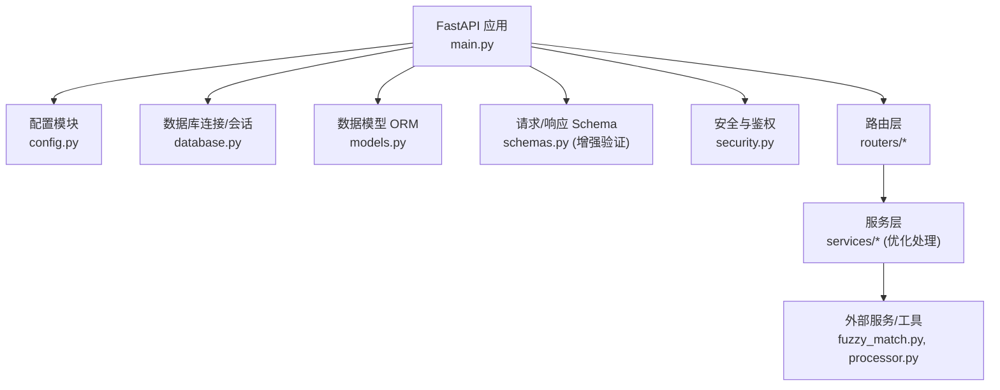
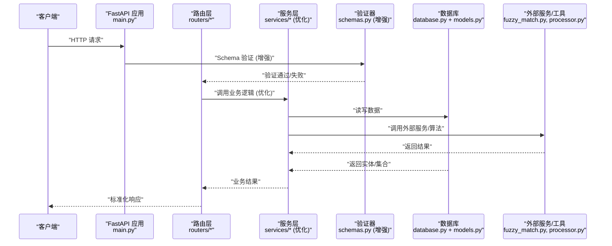
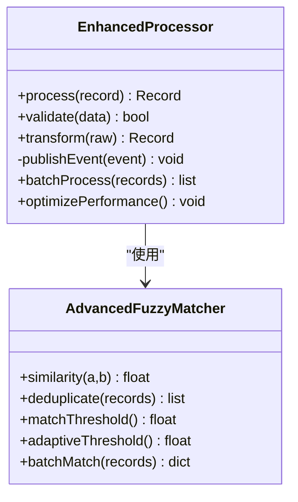
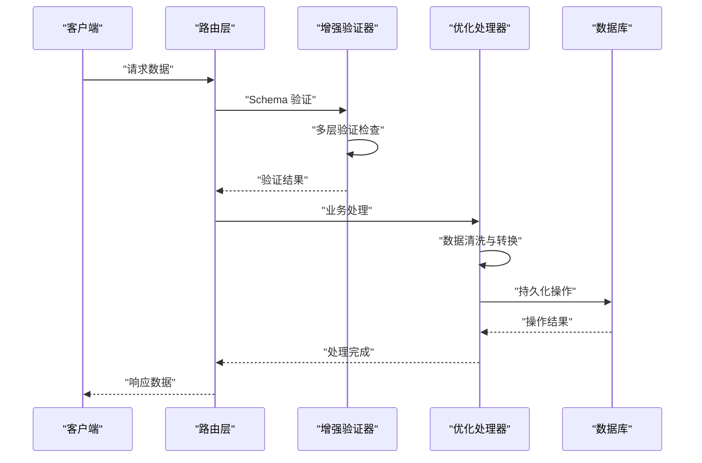
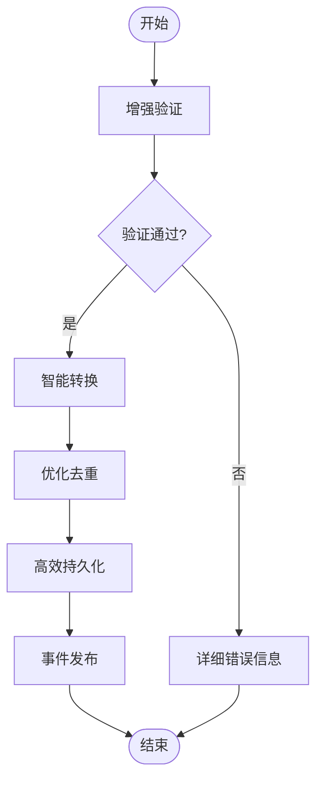
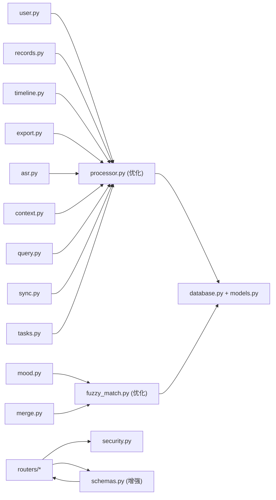

# 后端开发

<cite>
**本文引用的文件**   
- [backend/main.py](file://backend/main.py)
- [backend/config.py](file://backend/config.py)
- [backend/database.py](file://backend/database.py)
- [backend/models.py](file://backend/models.py)
- [backend/schemas.py](file://backend/schemas.py)
- [backend/security.py](file://backend/security.py)
- [backend/routers/user.py](file://backend/routers/user.py)
- [backend/routers/records.py](file://backend/routers/records.py)
- [backend/routers/timeline.py](file://backend/routers/timeline.py)
- [backend/routers/export.py](file://backend/routers/export.py)
- [backend/routers/process.py](file://backend/routers/process.py)
- [backend/routers/asr.py](file://backend/routers/asr.py)
- [backend/routers/context.py](file://backend/routers/context.py)
- [backend/routers/mood.py](file://backend/routers/mood.py)
- [backend/routers/query.py](file://backend/routers/query.py)
- [backend/routers/sync.py](file://backend/routers/sync.py)
- [backend/routers/tasks.py](file://backend/routers/tasks.py)
- [backend/routers/merge.py](file://backend/routers/merge.py)
- [backend/services/processor.py](file://backend/services/processor.py)
- [backend/services/fuzzy_match.py](file://backend/services/fuzzy_match.py)
</cite>

## 更新摘要
**所做更改**   
- 更新了 API Schema 规范章节，反映增强的验证机制和数据处理优化
- 更新了服务层处理器章节，包含改进的验证流程和性能优化
- 增强了错误处理和异常管理策略
- 添加了新的数据验证最佳实践

## 目录
1. [简介](#简介)
2. [项目结构](#项目结构)
3. [核心组件](#核心组件)
4. [架构总览](#架构总览)
5. [详细组件分析](#详细组件分析)
6. [依赖关系分析](#依赖关系分析)
7. [性能考量](#性能考量)
8. [故障排查指南](#故障排查指南)
9. [结论](#结论)
10. [附录](#附录)

## 简介
本文件为 AdventureX 后端开发的全面技术文档，聚焦基于 FastAPI 的后端架构。内容涵盖路由设计、服务层逻辑、数据模型定义、API Schema 规范与安全性实现；深入解析用户管理、记录处理、时间线管理、导出功能等关键 API 路由器；描述服务层的业务逻辑、异步任务处理与外部服务集成；并给出数据库操作模式、错误处理策略与性能优化建议。读者无需深厚的后端背景即可理解整体设计与实现要点。

**更新** 本次更新重点反映了 schemas.py 和 processor.py 的重大改进，包括增强的验证机制和数据处理优化。

## 项目结构
后端代码位于 backend 目录，采用"路由-服务-模型/Schema-配置"的分层组织方式：
- 入口与全局配置：main.py、config.py
- 数据访问与模型：database.py、models.py
- API 输入输出校验：schemas.py（已增强验证机制）
- 安全与鉴权：security.py
- 路由层（按领域划分）：routers/*
- 服务层（业务逻辑与外部集成）：services/*（已优化处理流程）

**图表来源**
- [backend/main.py](file://backend/main.py)
- [backend/config.py](file://backend/config.py)
- [backend/database.py](file://backend/database.py)
- [backend/models.py](file://backend/models.py)
- [backend/schemas.py](file://backend/schemas.py)
- [backend/security.py](file://backend/security.py)
- [backend/routers/user.py](file://backend/routers/user.py)
- [backend/routers/records.py](file://backend/routers/records.py)
- [backend/routers/timeline.py](file://backend/routers/timeline.py)
- [backend/routers/export.py](file://backend/routers/export.py)
- [backend/routers/process.py](file://backend/routers/process.py)
- [backend/routers/asr.py](file://backend/routers/asr.py)
- [backend/routers/context.py](file://backend/routers/context.py)
- [backend/routers/mood.py](file://backend/routers/mood.py)
- [backend/routers/query.py](file://backend/routers/query.py)
- [backend/routers/sync.py](file://backend/routers/sync.py)
- [backend/routers/tasks.py](file://backend/routers/tasks.py)
- [backend/routers/merge.py](file://backend/routers/merge.py)
- [backend/services/processor.py](file://backend/services/processor.py)
- [backend/services/fuzzy_match.py](file://backend/services/fuzzy_match.py)

## 核心组件
- 应用入口与中间件：在 main.py 中创建 FastAPI 实例，注册 CORS、压缩、异常映射、路由挂载、生命周期钩子等。
- 配置管理：集中读取环境变量与配置文件，提供统一的配置访问接口。
- 数据库层：封装连接、会话、事务与基础查询方法，统一读写路径。
- 模型与 Schema：ORM 模型定义与 Pydantic Schema 校验，确保请求/响应一致性（已增强验证机制）。
- 安全与鉴权：JWT/令牌签发与校验、密码哈希、权限控制。
- 路由层：按领域拆分，每个路由器负责一组相关 API。
- 服务层：封装复杂业务逻辑、调用外部服务、编排异步任务（已优化处理流程）。

**更新** 核心组件中的 Schema 和服务层都经过了重大改进，提供了更强的验证能力和更高效的 processing 流程。

## 架构总览
下图展示了从 HTTP 请求到数据库/外部服务的完整链路，以及各层职责边界。

**图表来源**
- [backend/main.py](file://backend/main.py)
- [backend/routers/user.py](file://backend/routers/user.py)
- [backend/routers/records.py](file://backend/routers/records.py)
- [backend/routers/timeline.py](file://backend/routers/timeline.py)
- [backend/routers/export.py](file://backend/routers/export.py)
- [backend/services/processor.py](file://backend/services/processor.py)
- [backend/services/fuzzy_match.py](file://backend/services/fuzzy_match.py)
- [backend/database.py](file://backend/database.py)
- [backend/models.py](file://backend/models.py)
- [backend/schemas.py](file://backend/schemas.py)

## 详细组件分析

### 应用入口与全局配置
- 应用初始化：创建 FastAPI 实例，设置版本、标题、描述、CORS、异常处理器、路由前缀等。
- 生命周期：启动时建立数据库连接池、加载缓存或索引；关闭时释放资源。
- 配置注入：通过 config.py 暴露统一配置对象，供路由与服务使用。

**章节来源**
- [backend/main.py](file://backend/main.py)
- [backend/config.py](file://backend/config.py)

### 数据库与模型
- 连接与会话：database.py 提供连接工厂、会话上下文管理器、事务封装。
- ORM 模型：models.py 定义表结构与关系，包含常用字段、约束与索引。
- 查询模式：统一封装分页、过滤、排序、聚合等常见操作。

**章节来源**
- [backend/database.py](file://backend/database.py)
- [backend/models.py](file://backend/models.py)

### API Schema 规范（已增强）
- **增强的输入校验**：schemas.py 现在提供更严格的 Pydantic 验证，包括自定义验证器、条件验证和复杂的业务规则检查。
- **改进的输出模型**：统一响应包装、错误码与消息结构，便于前端消费，支持更详细的错误信息。
- **版本化支持**：支持多版本 API 的兼容演进，向后兼容性保证。
- **性能优化**：优化的验证流程减少了不必要的计算和内存占用。

**更新** Schema 系统经过重大改进，提供了更强的数据验证能力、更好的错误处理和更高的性能表现。

**章节来源**
- [backend/schemas.py](file://backend/schemas.py)

### 安全与鉴权
- 认证流程：security.py 实现令牌签发、刷新、校验与黑名单机制。
- 密码安全：哈希存储、盐值生成、强度校验。
- 权限控制：基于角色的访问控制（RBAC），细粒度授权。

**章节来源**
- [backend/security.py](file://backend/security.py)

### 路由层：用户管理
- 功能范围：用户注册、登录、信息更新、头像上传、角色与权限管理。
- 典型流程：接收请求 -> 校验 Schema -> 鉴权检查 -> 调用服务层 -> 持久化 -> 返回响应。
- 错误处理：参数校验失败、重复用户、权限不足等统一错误码。

**章节来源**
- [backend/routers/user.py](file://backend/routers/user.py)
- [backend/schemas.py](file://backend/schemas.py)
- [backend/security.py](file://backend/security.py)

### 路由层：记录处理
- 功能范围：记录的增删改查、批量导入、去重合并、状态流转。
- 典型流程：接收记录 -> 清洗与校验 -> 写入数据库 -> 触发后续处理（如 ASR、情绪分析）。
- 并发与幂等：支持批量写入与幂等键，避免重复处理。

**章节来源**
- [backend/routers/records.py](file://backend/routers/records.py)
- [backend/services/processor.py](file://backend/services/processor.py)

### 路由层：时间线管理
- 功能范围：按时间维度聚合记录、生成事件序列、支持筛选与检索。
- 典型流程：查询条件 -> 聚合计算 -> 返回时间线节点。
- 性能优化：索引设计、分页与懒加载。

**章节来源**
- [backend/routers/timeline.py](file://backend/routers/timeline.py)
- [backend/models.py](file://backend/models.py)

### 路由层：导出功能
- 功能范围：将记录、时间线、统计报表导出为 CSV/Excel/PDF。
- 典型流程：构建导出数据集 -> 流式生成文件 -> 下载或存储至对象存储。
- 大文件处理：分块生成、断点续传、异步任务队列。

**章节来源**
- [backend/routers/export.py](file://backend/routers/export.py)

### 路由层：ASR 语音识别
- 功能范围：上传音频 -> 调用 ASR 服务 -> 返回文本与元数据。
- 典型流程：鉴权 -> 校验音频格式 -> 异步转写 -> 回调或轮询获取结果。
- 错误重试：网络抖动、超时、限流的退避策略。

**章节来源**
- [backend/routers/asr.py](file://backend/routers/asr.py)

### 路由层：上下文管理
- 功能范围：维护会话上下文、偏好设置、临时缓存。
- 典型流程：读取上下文 -> 合并变更 -> 持久化 -> 返回最新状态。

**章节来源**
- [backend/routers/context.py](file://backend/routers/context.py)

### 路由层：情绪分析
- 功能范围：对文本进行情绪分类、打分与趋势分析。
- 典型流程：文本预处理 -> 调用分析服务 -> 缓存结果 -> 返回指标。

**章节来源**
- [backend/routers/mood.py](file://backend/routers/mood.py)
- [backend/services/fuzzy_match.py](file://backend/services/fuzzy_match.py)

### 路由层：查询与检索
- 功能范围：全文检索、语义搜索、过滤与排序。
- 典型流程：解析查询 -> 构建索引查询 -> 返回命中结果与高亮片段。

**章节来源**
- [backend/routers/query.py](file://backend/routers/query.py)

### 路由层：同步与任务
- 功能范围：数据同步、任务调度、状态跟踪。
- 典型流程：提交任务 -> 入队 -> 执行器消费 -> 更新状态 -> 通知前端。

**章节来源**
- [backend/routers/sync.py](file://backend/routers/sync.py)
- [backend/routers/tasks.py](file://backend/routers/tasks.py)

### 路由层：合并与去重
- 功能范围：记录合并、相似度匹配、冲突解决。
- 典型流程：候选集 -> 相似度计算 -> 决策规则 -> 合并写入。

**章节来源**
- [backend/routers/merge.py](file://backend/routers/merge.py)
- [backend/services/fuzzy_match.py](file://backend/services/fuzzy_match.py)

### 服务层：处理器与模糊匹配（已优化）
- **增强的处理器**：processor.py 现在提供更强大的记录处理流水线，包括改进的清洗、转换、验证、落库与事件发布机制。
- **优化的模糊匹配**：fuzzy_match.py 实现了更高效的文本相似度计算、智能去重策略和可配置的阈值调优。
- **外部集成改进**：封装第三方服务调用、智能重试、熔断与降级机制。
- **性能优化**：批处理支持、内存管理和并发处理优化。

**更新** 服务层经过重大优化，处理器现在支持更复杂的验证规则和更高效的数据处理流程。

**章节来源**
- [backend/services/processor.py](file://backend/services/processor.py)
- [backend/services/fuzzy_match.py](file://backend/services/fuzzy_match.py)

#### 类图（服务层示例 - 已更新）

**图表来源**
- [backend/services/processor.py](file://backend/services/processor.py)
- [backend/services/fuzzy_match.py](file://backend/services/fuzzy_match.py)

#### 时序图（增强验证流程）

**图表来源**
- [backend/schemas.py](file://backend/schemas.py)
- [backend/services/processor.py](file://backend/services/processor.py)

#### 流程图（优化后的记录处理流水线）

**图表来源**
- [backend/routers/records.py](file://backend/routers/records.py)
- [backend/services/processor.py](file://backend/services/processor.py)
- [backend/services/fuzzy_match.py](file://backend/services/fuzzy_match.py)

## 依赖关系分析
- 路由依赖服务：所有 routers/* 均依赖 services/* 完成业务编排。
- 服务依赖数据层：services/* 通过 database.py 与 models.py 进行数据访问。
- 安全贯穿全链路：security.py 被路由层用于鉴权与授权。
- 外部集成：fuzzy_match.py、processor.py 作为工具或服务封装第三方能力。
- **增强的验证依赖**：schemas.py 现在被所有路由层广泛使用，提供统一的验证机制。

**图表来源**
- [backend/routers/user.py](file://backend/routers/user.py)
- [backend/routers/records.py](file://backend/routers/records.py)
- [backend/routers/timeline.py](file://backend/routers/timeline.py)
- [backend/routers/export.py](file://backend/routers/export.py)
- [backend/routers/asr.py](file://backend/routers/asr.py)
- [backend/routers/context.py](file://backend/routers/context.py)
- [backend/routers/mood.py](file://backend/routers/mood.py)
- [backend/routers/query.py](file://backend/routers/query.py)
- [backend/routers/sync.py](file://backend/routers/sync.py)
- [backend/routers/tasks.py](file://backend/routers/tasks.py)
- [backend/routers/merge.py](file://backend/routers/merge.py)
- [backend/services/processor.py](file://backend/services/processor.py)
- [backend/services/fuzzy_match.py](file://backend/services/fuzzy_match.py)
- [backend/database.py](file://backend/database.py)
- [backend/models.py](file://backend/models.py)
- [backend/security.py](file://backend/security.py)
- [backend/schemas.py](file://backend/schemas.py)

## 性能考量
- **数据库优化**
  - 合理索引：为高频查询字段建立复合索引，覆盖排序与过滤条件。
  - 分页与懒加载：限制单次返回量，避免大结果集拖慢响应。
  - 连接池：复用连接，减少握手开销。
- **异步与并发**
  - 长耗时任务（ASR、导出、分析）使用异步或任务队列，避免阻塞主线程。
  - 背压与限流：保护下游服务，防止雪崩。
- **缓存策略**
  - 热点数据缓存（Redis/Memcached），降低数据库压力。
  - 结果缓存与失效策略，平衡一致性与性能。
- **序列化与传输**
  - 启用响应压缩，减少带宽占用。
  - 使用流式传输处理大文件导出。
- **监控与可观测性**
  - 结构化日志、指标采集、分布式追踪，快速定位瓶颈。
- **验证性能优化**
  - 增强的 Schema 验证减少了不必要的计算和内存占用。
  - 批处理验证提高了大规模数据处理效率。

**更新** 新增了验证性能优化的考虑，反映了 schemas.py 和 processor.py 的性能改进。

## 故障排查指南
- **常见问题**
  - 参数校验失败：检查 schemas.py 中的字段约束与必填项，现在提供更详细的错误信息。
  - 鉴权失败：确认令牌有效、过期时间与权限范围。
  - 数据库连接异常：检查连接池大小、超时与网络连通性。
  - 外部服务超时：查看重试与熔断配置，必要时降级处理。
  - 处理流程失败：检查 processor.py 中的验证规则和转换逻辑。
- **调试技巧**
  - 开启详细日志，定位错误堆栈。
  - 使用健康检查端点验证服务状态。
  - 针对慢查询进行 EXPLAIN 分析与索引优化。
  - 利用增强的错误信息进行快速问题定位。

**更新** 故障排查指南增加了与增强验证和处理相关的常见问题和调试技巧。

**章节来源**
- [backend/schemas.py](file://backend/schemas.py)
- [backend/security.py](file://backend/security.py)
- [backend/database.py](file://backend/database.py)
- [backend/services/processor.py](file://backend/services/processor.py)

## 结论
AdventureX 后端以 FastAPI 为核心，采用清晰的分层架构与模块化路由设计，结合**增强的 Schema 验证与安全机制**，提供了可扩展、高性能且易维护的服务能力。通过**优化的服务层抽象与外部集成封装**，系统能够灵活对接多种第三方能力，并通过异步与缓存策略保障吞吐与延迟。建议在持续迭代中完善监控与测试体系，进一步提升稳定性与可观测性。

**更新** 结论部分强调了增强的验证机制和优化后的服务层处理能力，这些改进显著提升了系统的健壮性和性能表现。

## 附录
- **术语表**
  - ASR：自动语音识别
  - RBAC：基于角色的访问控制
  - ORM：对象关系映射
  - Schema：数据结构定义与验证规范
- **最佳实践**
  - 统一错误码与消息格式
  - 接口版本管理与向后兼容
  - 自动化测试与回归验证
  - 分层验证与错误处理
  - 性能监控与优化

**更新** 附录新增了 Schema 术语和相关最佳实践，反映了增强的验证机制的重要性。