# 后端架构设计

<cite>
**本文引用的文件**   
- [backend/main.py](file://backend/main.py)
- [backend/config.py](file://backend/config.py)
- [backend/database.py](file://backend/database.py)
- [backend/security.py](file://backend/security.py)
- [backend/models.py](file://backend/models.py)
- [backend/schemas.py](file://backend/schemas.py)
- [backend/routers/user.py](file://backend/routers/user.py)
- [backend/routers/query.py](file://backend/routers/query.py)
- [backend/routers/tasks.py](file://backend/routers/tasks.py)
- [backend/routers/records.py](file://backend/routers/records.py)
- [backend/routers/timeline.py](file://backend/routers/timeline.py)
- [backend/routers/export.py](file://backend/routers/export.py)
- [backend/routers/asr.py](file://backend/routers/asr.py)
- [backend/routers/context.py](file://backend/routers/context.py)
- [backend/routers/merge.py](file://backend/routers/merge.py)
- [backend/routers/mood.py](file://backend/routers/mood.py)
- [backend/routers/process.py](file://backend/routers/process.py)
- [backend/routers/sync.py](file://backend/routers/sync.py)
- [backend/services/processor.py](file://backend/services/processor.py)
- [backend/services/fuzzy_match.py](file://backend/services/fuzzy_match.py)
</cite>

## 更新摘要
**所做更改**
- 更新了数据模型和服务层处理逻辑的变更说明，重点反映schemas.py和services/processor.py的最新修改
- 增强了服务层处理器功能的详细描述
- 完善了数据验证与Schema定义章节的技术实现细节
- 更新了依赖关系分析中服务层与数据层的交互模式

## 目录
1. [简介](#简介)
2. [项目结构](#项目结构)
3. [核心组件](#核心组件)
4. [架构总览](#架构总览)
5. [详细组件分析](#详细组件分析)
6. [依赖关系分析](#依赖关系分析)
7. [性能考虑](#性能考虑)
8. [故障排查指南](#故障排查指南)
9. [结论](#结论)
10. [附录](#附录)

## 简介
本文件面向AdventureX后端系统的架构设计与实现，聚焦基于FastAPI的模块化架构。文档涵盖应用启动流程、中间件配置、数据库连接管理、全局配置管理；阐述分层架构（路由层、服务层、数据访问层）与依赖注入模式；说明异步处理机制、错误处理策略与日志记录系统；并提供性能优化建议、扩展点设计与第三方服务集成模式。通过架构图与数据流图帮助读者快速理解各组件交互关系。

## 项目结构
后端代码位于 backend 目录，采用按功能域划分的模块组织方式：
- 入口与装配：main.py 负责应用初始化、中间件注册、路由挂载、生命周期钩子等
- 配置与常量：config.py 提供统一配置读取与管理
- 数据层：database.py 管理数据库连接与会话；models.py 定义ORM模型；schemas.py 定义请求/响应数据结构
- 安全与鉴权：security.py 提供认证、授权与密码哈希等能力
- 路由层：routers/* 按业务域划分接口，如用户、查询、任务、记录、时间线、导出、ASR、上下文、合并、情绪、处理、同步等
- 服务层：services/* 封装领域逻辑与复用算法，如处理器与模糊匹配

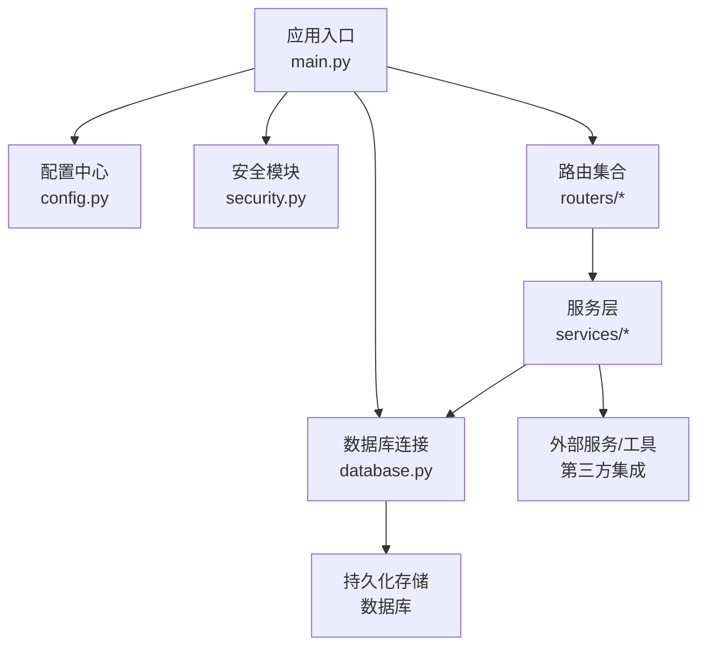

图表来源
- [backend/main.py](file://backend/main.py)
- [backend/config.py](file://backend/config.py)
- [backend/database.py](file://backend/database.py)
- [backend/security.py](file://backend/security.py)
- [backend/routers/user.py](file://backend/routers/user.py)
- [backend/routers/query.py](file://backend/routers/query.py)
- [backend/routers/tasks.py](file://backend/routers/tasks.py)
- [backend/routers/records.py](file://backend/routers/records.py)
- [backend/routers/timeline.py](file://backend/routers/timeline.py)
- [backend/routers/export.py](file://backend/routers/export.py)
- [backend/routers/asr.py](file://backend/routers/asr.py)
- [backend/routers/context.py](file://backend/routers/context.py)
- [backend/routers/merge.py](file://backend/routers/merge.py)
- [backend/routers/mood.py](file://backend/routers/mood.py)
- [backend/routers/process.py](file://backend/routers/process.py)
- [backend/routers/sync.py](file://backend/routers/sync.py)
- [backend/services/processor.py](file://backend/services/processor.py)
- [backend/services/fuzzy_match.py](file://backend/services/fuzzy_match.py)

章节来源
- [backend/main.py](file://backend/main.py)
- [backend/config.py](file://backend/config.py)
- [backend/database.py](file://backend/database.py)
- [backend/security.py](file://backend/security.py)
- [backend/models.py](file://backend/models.py)
- [backend/schemas.py](file://backend/schemas.py)
- [backend/routers/user.py](file://backend/routers/user.py)
- [backend/routers/query.py](file://backend/routers/query.py)
- [backend/routers/tasks.py](file://backend/routers/tasks.py)
- [backend/routers/records.py](file://backend/routers/records.py)
- [backend/routers/timeline.py](file://backend/routers/timeline.py)
- [backend/routers/export.py](file://backend/routers/export.py)
- [backend/routers/asr.py](file://backend/routers/asr.py)
- [backend/routers/context.py](file://backend/routers/context.py)
- [backend/routers/merge.py](file://backend/routers/merge.py)
- [backend/routers/mood.py](file://backend/routers/mood.py)
- [backend/routers/process.py](file://backend/routers/process.py)
- [backend/routers/sync.py](file://backend/routers/sync.py)
- [backend/services/processor.py](file://backend/services/processor.py)
- [backend/services/fuzzy_match.py](file://backend/services/fuzzy_match.py)

## 核心组件
- 应用入口与生命周期
  - 应用实例创建、中间件注册、路由挂载、事件钩子（启动/关闭）
  - 依赖注入容器初始化（如数据库会话、配置对象、缓存客户端等）
- 配置管理
  - 集中式配置加载与环境变量解析
  - 敏感信息管理与默认值回退
- 数据库连接管理
  - 连接池与会话工厂
  - 事务边界与资源释放
- 安全与鉴权
  - JWT/令牌校验、权限校验、密码哈希
- 路由层
  - 按业务域拆分路由，参数校验、异常映射、响应序列化
- 服务层
  - 领域逻辑封装、跨路由复用、对外部服务的调用编排
  - **更新**：增强的数据处理能力和批量操作支持
- 数据模型与Schema
  - ORM模型定义、请求/响应数据校验与转换
  - **更新**：改进的数据验证机制和时区处理能力

章节来源
- [backend/main.py](file://backend/main.py)
- [backend/config.py](file://backend/config.py)
- [backend/database.py](file://backend/database.py)
- [backend/security.py](file://backend/security.py)
- [backend/models.py](file://backend/models.py)
- [backend/schemas.py](file://backend/schemas.py)

## 架构总览
下图展示从HTTP请求到数据持久化的端到端流程，体现分层架构与依赖注入的使用。

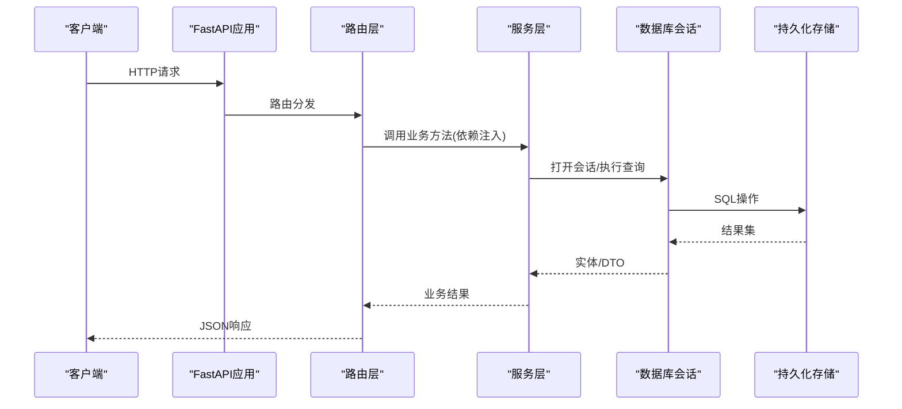

图表来源
- [backend/main.py](file://backend/main.py)
- [backend/routers/user.py](file://backend/routers/user.py)
- [backend/routers/query.py](file://backend/routers/query.py)
- [backend/routers/tasks.py](file://backend/routers/tasks.py)
- [backend/routers/records.py](file://backend/routers/records.py)
- [backend/routers/timeline.py](file://backend/routers/timeline.py)
- [backend/routers/export.py](file://backend/routers/export.py)
- [backend/routers/asr.py](file://backend/routers/asr.py)
- [backend/routers/context.py](file://backend/routers/context.py)
- [backend/routers/merge.py](file://backend/routers/merge.py)
- [backend/routers/mood.py](file://backend/routers/mood.py)
- [backend/routers/process.py](file://backend/routers/process.py)
- [backend/routers/sync.py](file://backend/routers/sync.py)
- [backend/services/processor.py](file://backend/services/processor.py)
- [backend/services/fuzzy_match.py](file://backend/services/fuzzy_match.py)
- [backend/database.py](file://backend/database.py)

## 详细组件分析

### 应用启动流程与中间件配置
- 应用启动顺序
  - 构建FastAPI实例
  - 加载全局配置（数据库URL、密钥、开关等）
  - 注册中间件（CORS、请求ID、限流、审计等）
  - 挂载路由（按模块导入并 include_router）
  - 注册生命周期钩子（on_event startup/shutdown）
- 中间件职责
  - 跨域与请求头处理
  - 统一日志与追踪
  - 安全相关（HTTPS重定向、HSTS等）
  - 性能监控与指标收集

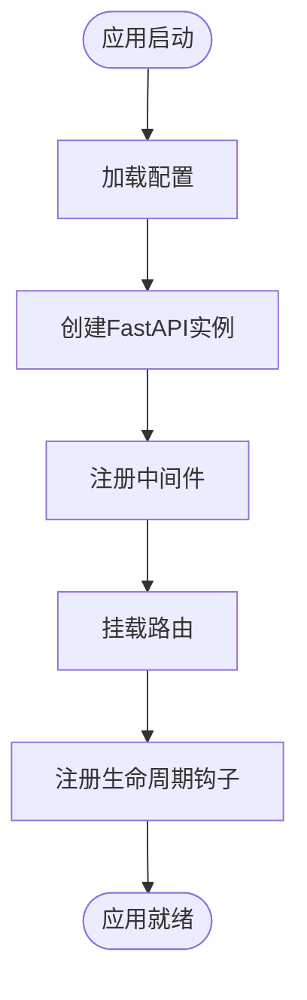

图表来源
- [backend/main.py](file://backend/main.py)
- [backend/config.py](file://backend/config.py)

章节来源
- [backend/main.py](file://backend/main.py)
- [backend/config.py](file://backend/config.py)

### 数据库连接管理
- 连接池与会话工厂
  - 使用连接池管理连接生命周期
  - 提供会话生成器用于依赖注入
- 事务与资源管理
  - 在请求上下文中自动开启/提交/回滚
  - 确保异常路径下正确释放资源
- 模型与Schema
  - ORM模型定义字段、索引、关联
  - Pydantic Schema用于输入输出校验与序列化
  - **更新**：增强的数据验证机制确保数据完整性

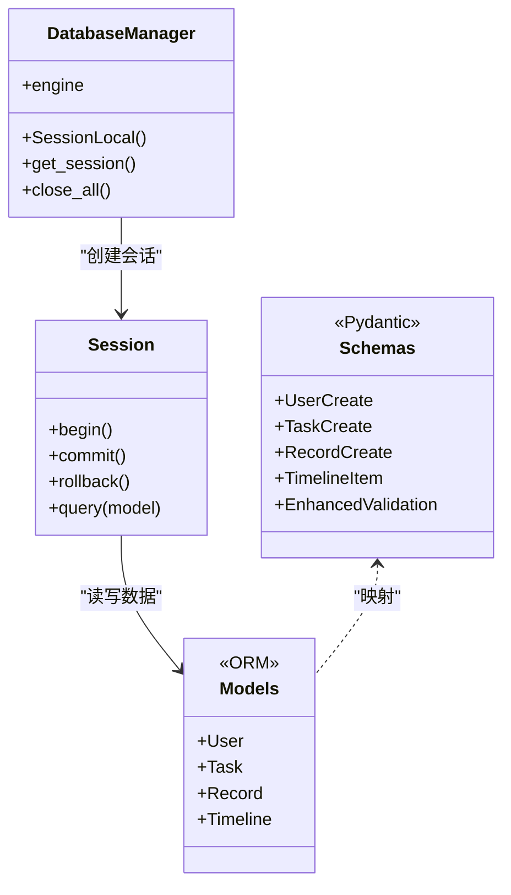

图表来源
- [backend/database.py](file://backend/database.py)
- [backend/models.py](file://backend/models.py)
- [backend/schemas.py](file://backend/schemas.py)

章节来源
- [backend/database.py](file://backend/database.py)
- [backend/models.py](file://backend/models.py)
- [backend/schemas.py](file://backend/schemas.py)

### 安全与鉴权
- 认证流程
  - 登录接口验证凭据并签发令牌
  - 受保护接口通过中间件或依赖注入校验令牌
- 授权控制
  - 基于角色或资源的访问控制
- 密码与密钥
  - 密码哈希与盐值管理
  - 环境变量中的密钥加载

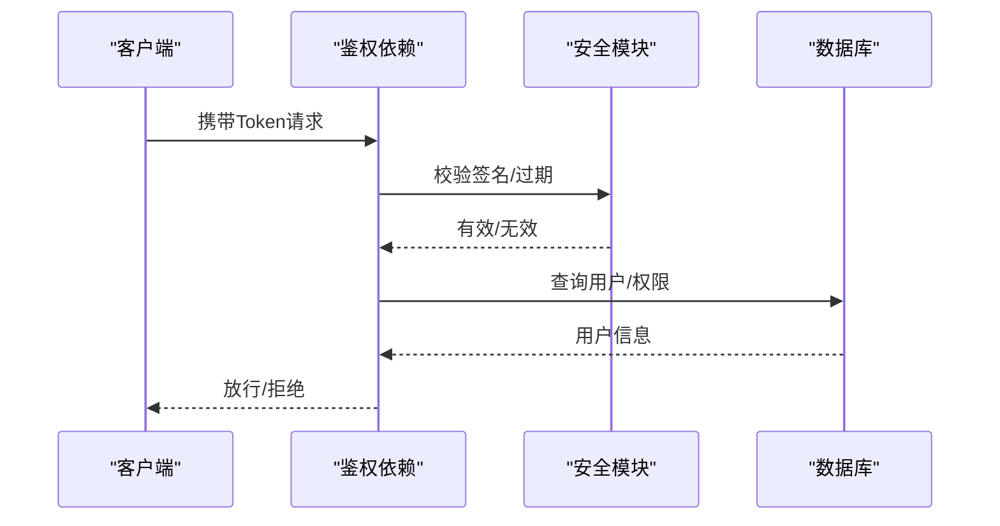

图表来源
- [backend/security.py](file://backend/security.py)

章节来源
- [backend/security.py](file://backend/security.py)

### 路由层（按业务域）
- 用户路由
  - 用户注册、登录、资料更新、权限查询
- 查询路由
  - 文本/语音查询、语义检索、结果聚合
- 任务路由
  - 任务创建、状态流转、批量操作
- 记录路由
  - 记录增删改查、分页与过滤
- 时间线路由
  - 时间线生成、事件聚合、视图渲染
- 导出路由
  - 数据导出为CSV/JSON/PDF等格式
- ASR路由
  - 音频上传、转写任务、回调通知
- 上下文路由
  - 上下文维护、记忆存储、检索增强
- 合并路由
  - 多源数据合并、冲突解决、版本管理
- 情绪路由
  - 情绪识别、标签分类、趋势统计
- 处理路由
  - 数据处理流水线、批处理任务
- 同步路由
  - 与外部系统的数据同步、增量同步

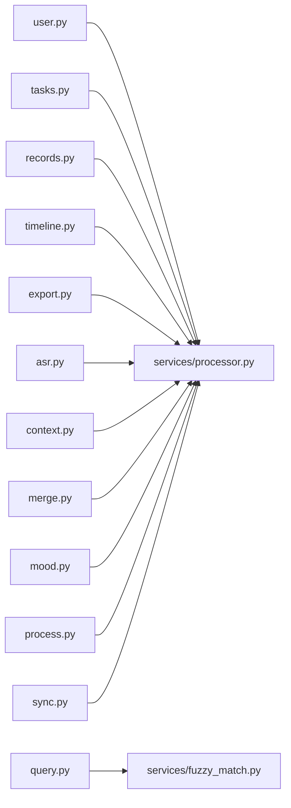

图表来源
- [backend/routers/user.py](file://backend/routers/user.py)
- [backend/routers/query.py](file://backend/routers/query.py)
- [backend/routers/tasks.py](file://backend/routers/tasks.py)
- [backend/routers/records.py](file://backend/routers/records.py)
- [backend/routers/timeline.py](file://backend/routers/timeline.py)
- [backend/routers/export.py](file://backend/routers/export.py)
- [backend/routers/asr.py](file://backend/routers/asr.py)
- [backend/routers/context.py](file://backend/routers/context.py)
- [backend/routers/merge.py](file://backend/routers/merge.py)
- [backend/routers/mood.py](file://backend/routers/mood.py)
- [backend/routers/process.py](file://backend/routers/process.py)
- [backend/routers/sync.py](file://backend/routers/sync.py)
- [backend/services/processor.py](file://backend/services/processor.py)
- [backend/services/fuzzy_match.py](file://backend/services/fuzzy_match.py)

章节来源
- [backend/routers/user.py](file://backend/routers/user.py)
- [backend/routers/query.py](file://backend/routers/query.py)
- [backend/routers/tasks.py](file://backend/routers/tasks.py)
- [backend/routers/records.py](file://backend/routers/records.py)
- [backend/routers/timeline.py](file://backend/routers/timeline.py)
- [backend/routers/export.py](file://backend/routers/export.py)
- [backend/routers/asr.py](file://backend/routers/asr.py)
- [backend/routers/context.py](file://backend/routers/context.py)
- [backend/routers/merge.py](file://backend/routers/merge.py)
- [backend/routers/mood.py](file://backend/routers/mood.py)
- [backend/routers/process.py](file://backend/routers/process.py)
- [backend/routers/sync.py](file://backend/routers/sync.py)

### 服务层（领域逻辑）
- 处理器服务
  - **更新**：增强的数据处理能力，支持更复杂的业务逻辑
  - 通用数据处理、格式化、转换、批处理编排
  - 改进的错误处理和重试机制
- 模糊匹配服务
  - 文本相似度计算、去重、推荐候选集生成

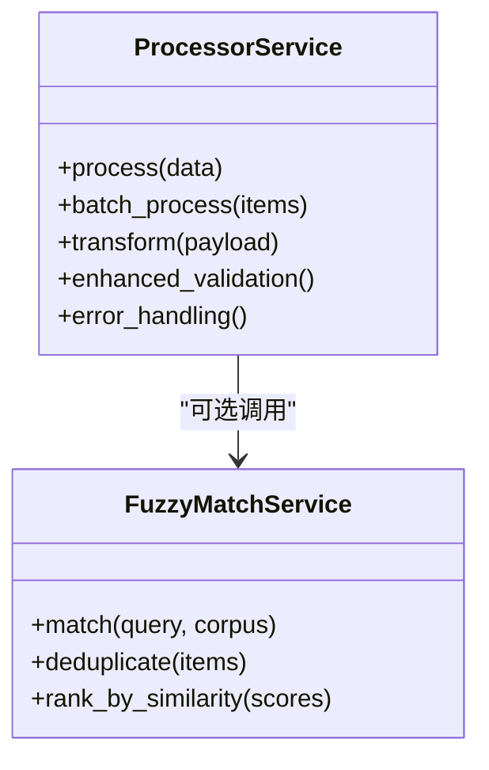

图表来源
- [backend/services/processor.py](file://backend/services/processor.py)
- [backend/services/fuzzy_match.py](file://backend/services/fuzzy_match.py)

章节来源
- [backend/services/processor.py](file://backend/services/processor.py)
- [backend/services/fuzzy_match.py](file://backend/services/fuzzy_match.py)

### 异步处理机制
- 异步路由与IO密集型任务
  - 使用异步函数提升并发吞吐
  - 将阻塞IO（如文件读写、网络请求）放入线程池或任务队列
- 后台任务与消息队列
  - 长耗时任务（ASR转写、导出、同步）通过队列异步执行
  - 任务状态跟踪与重试机制

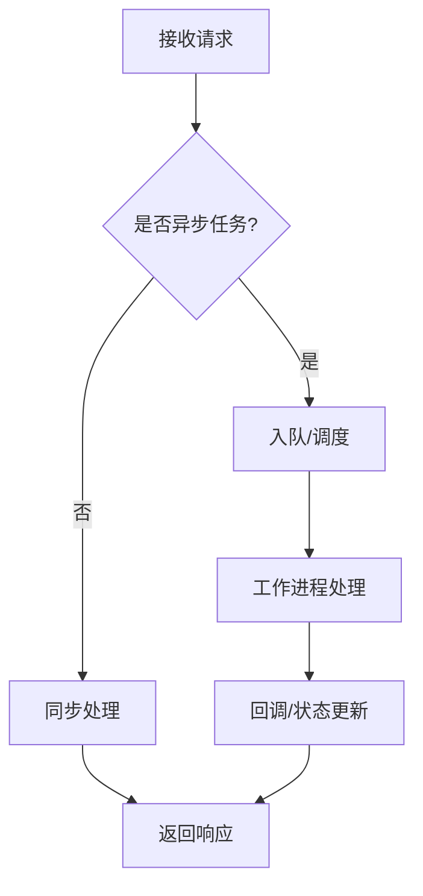

图表来源
- [backend/routers/asr.py](file://backend/routers/asr.py)
- [backend/routers/export.py](file://backend/routers/export.py)
- [backend/routers/sync.py](file://backend/routers/sync.py)

章节来源
- [backend/routers/asr.py](file://backend/routers/asr.py)
- [backend/routers/export.py](file://backend/routers/export.py)
- [backend/routers/sync.py](file://backend/routers/sync.py)

### 错误处理策略
- 统一异常捕获
  - 将业务异常转换为标准HTTP状态码与错误体
- 分级错误分类
  - 客户端错误（4xx）、服务端错误（5xx）、业务校验错误
- 日志与追踪
  - 记录关键路径的错误堆栈与上下文信息
  - 关联请求ID便于问题定位
- **更新**：增强的错误处理机制，支持更详细的错误信息和恢复策略

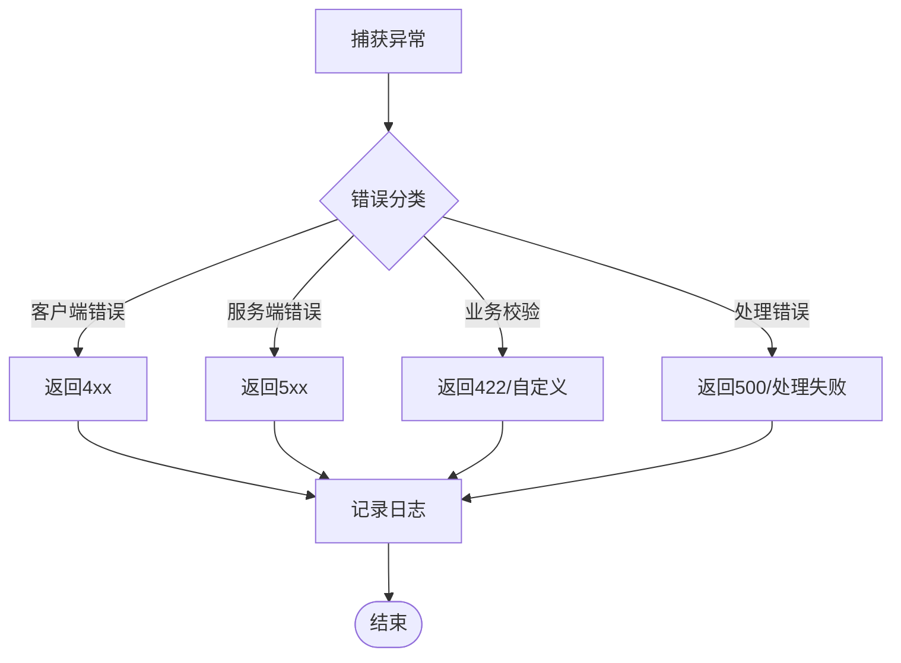

图表来源
- [backend/main.py](file://backend/main.py)
- [backend/schemas.py](file://backend/schemas.py)
- [backend/services/processor.py](file://backend/services/processor.py)

章节来源
- [backend/main.py](file://backend/main.py)
- [backend/schemas.py](file://backend/schemas.py)
- [backend/services/processor.py](file://backend/services/processor.py)

### 日志记录系统
- 结构化日志
  - 统一日志格式（时间戳、级别、模块、请求ID、耗时）
- 分级输出
  - DEBUG/INFO/WARNING/ERROR分别输出到不同目标
- 可观测性
  - 与APM/监控系统对接，采集指标与链路追踪

章节来源
- [backend/main.py](file://backend/main.py)

### 数据验证与Schema定义
- Pydantic模型设计
  - 强类型数据验证与自动序列化
  - 嵌套模型与复杂数据结构支持
- **更新**：增强的数据验证机制
  - 改进的输入数据校验逻辑
  - 更严格的类型检查和格式验证
  - 支持复杂业务规则的验证
- 数据完整性约束
  - 必填字段验证、格式校验、范围检查
  - 自定义验证器与业务规则校验

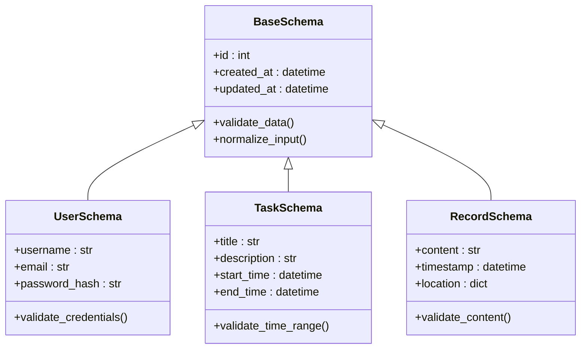

图表来源
- [backend/schemas.py](file://backend/schemas.py)

章节来源
- [backend/schemas.py](file://backend/schemas.py)

## 依赖关系分析
- 模块耦合
  - 路由层依赖服务层，服务层依赖数据层与安全模块
  - 配置与数据库连接由应用入口统一管理
- 外部依赖
  - 数据库驱动、消息队列、第三方API（ASR、导出服务等）
- 循环依赖规避
  - 通过接口抽象与依赖注入解耦
- **更新**：服务层与数据层的增强依赖关系
  - 服务层现在具有更强的数据处理能力
  - 改进的错误处理和重试机制依赖

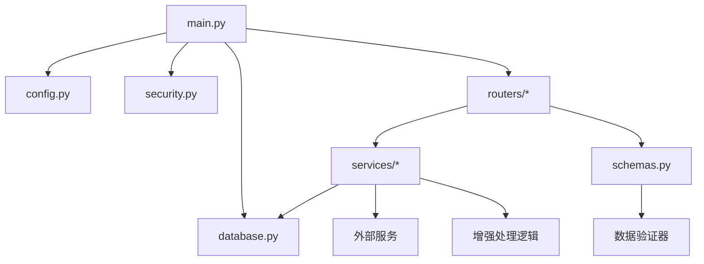

图表来源
- [backend/main.py](file://backend/main.py)
- [backend/config.py](file://backend/config.py)
- [backend/database.py](file://backend/database.py)
- [backend/security.py](file://backend/security.py)
- [backend/routers/user.py](file://backend/routers/user.py)
- [backend/routers/query.py](file://backend/routers/query.py)
- [backend/routers/tasks.py](file://backend/routers/tasks.py)
- [backend/routers/records.py](file://backend/routers/records.py)
- [backend/routers/timeline.py](file://backend/routers/timeline.py)
- [backend/routers/export.py](file://backend/routers/export.py)
- [backend/routers/asr.py](file://backend/routers/asr.py)
- [backend/routers/context.py](file://backend/routers/context.py)
- [backend/routers/merge.py](file://backend/routers/merge.py)
- [backend/routers/mood.py](file://backend/routers/mood.py)
- [backend/routers/process.py](file://backend/routers/process.py)
- [backend/routers/sync.py](file://backend/routers/sync.py)
- [backend/services/processor.py](file://backend/services/processor.py)
- [backend/services/fuzzy_match.py](file://backend/services/fuzzy_match.py)
- [backend/schemas.py](file://backend/schemas.py)

章节来源
- [backend/main.py](file://backend/main.py)
- [backend/config.py](file://backend/config.py)
- [backend/database.py](file://backend/database.py)
- [backend/security.py](file://backend/security.py)
- [backend/routers/user.py](file://backend/routers/user.py)
- [backend/routers/query.py](file://backend/routers/query.py)
- [backend/routers/tasks.py](file://backend/routers/tasks.py)
- [backend/routers/records.py](file://backend/routers/records.py)
- [backend/routers/timeline.py](file://backend/routers/timeline.py)
- [backend/routers/export.py](file://backend/routers/export.py)
- [backend/routers/asr.py](file://backend/routers/asr.py)
- [backend/routers/context.py](file://backend/routers/context.py)
- [backend/routers/merge.py](file://backend/routers/merge.py)
- [backend/routers/mood.py](file://backend/routers/mood.py)
- [backend/routers/process.py](file://backend/routers/process.py)
- [backend/routers/sync.py](file://backend/routers/sync.py)
- [backend/services/processor.py](file://backend/services/processor.py)
- [backend/services/fuzzy_match.py](file://backend/services/fuzzy_match.py)
- [backend/schemas.py](file://backend/schemas.py)

## 性能考虑
- 连接池与缓存
  - 合理设置数据库连接池大小与超时
  - 引入Redis缓存热点数据与查询结果
- 异步与并发
  - 对IO密集操作使用异步或任务队列
  - 避免在异步路径中进行阻塞调用
- 查询优化
  - 合理使用索引、分页与投影字段
  - 减少N+1查询，使用JOIN或批量加载
- 序列化与传输
  - 压缩响应体、按需返回字段
  - 使用Gzip/Brotli压缩
- **更新**：服务层性能优化
  - 改进的数据处理算法减少CPU消耗
  - 批量操作优化减少数据库往返
  - 内存使用优化避免大对象创建
- 监控与告警
  - 采集QPS、延迟、错误率、资源使用率
  - 设置阈值告警与自动扩缩容

## 故障排查指南
- 常见问题定位
  - 检查中间件链路与路由挂载顺序
  - 确认数据库连接池状态与SQL慢查询
  - 查看鉴权失败原因（令牌过期、签名错误）
- **更新**：服务层问题排查
  - 检查处理器服务的错误日志和异常堆栈
  - 验证数据验证失败的详细信息
  - 确认异步任务的执行状态和重试情况
- 日志与追踪
  - 启用请求级日志与链路追踪
  - 收集异常堆栈与上下文参数
- 恢复与降级
  - 关键服务不可用时的降级策略
  - 重试与熔断机制

章节来源
- [backend/main.py](file://backend/main.py)
- [backend/security.py](file://backend/security.py)
- [backend/database.py](file://backend/database.py)
- [backend/schemas.py](file://backend/schemas.py)
- [backend/services/processor.py](file://backend/services/processor.py)

## 结论
AdventureX后端采用FastAPI的模块化架构，清晰的分层设计与依赖注入使得系统具备高内聚、低耦合的特性。通过统一的配置与数据库管理、完善的错误处理与日志体系，以及异步与队列机制，系统在可扩展性与性能方面具备良好的基础。**特别值得注意的是，最新的更新增强了服务层处理能力和数据验证机制，提升了系统的稳定性和可靠性**。建议在后续迭代中持续完善监控与可观测性，强化缓存与查询优化，并逐步引入更丰富的第三方服务集成能力。

## 附录
- 扩展点设计
  - 新增路由：在 routers 下新建模块并在 main.py 中挂载
  - 新增服务：在 services 下实现领域逻辑并通过依赖注入使用
  - 新增数据模型：在 models.py 定义ORM模型并在迁移脚本中更新
  - 新增配置项：在 config.py 中增加环境变量与默认值
  - **更新**：服务层扩展：在 services/processor.py 中添加新的处理逻辑和验证器
- 第三方服务集成模式
  - 封装HTTP客户端与重试/熔断
  - 使用适配器模式屏蔽差异
  - 通过配置开关控制启用与降级
- **更新**：数据处理最佳实践
  - 使用增强的验证器确保数据质量
  - 实现优雅的错误处理和恢复机制
  - 优化批量操作的性能和内存使用